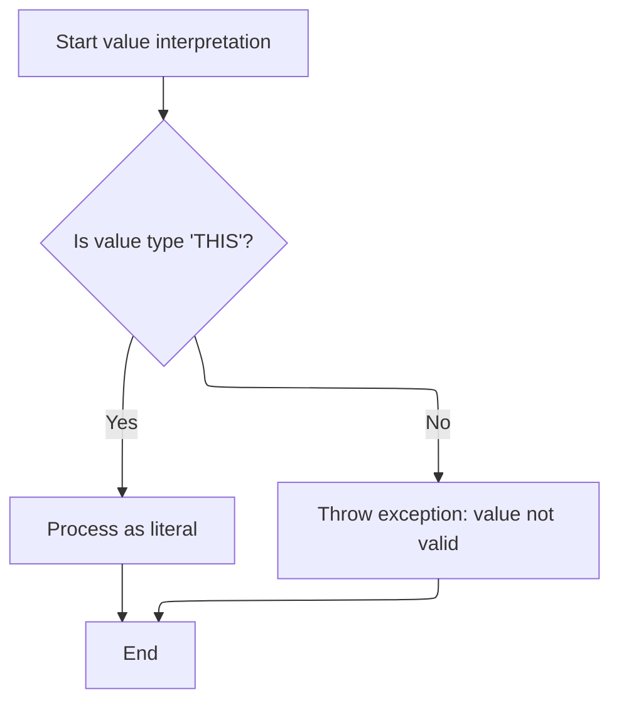
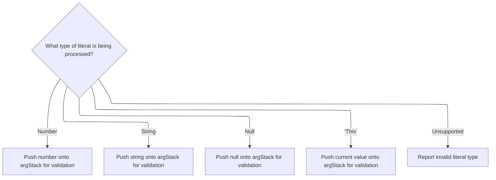

This document describes how a value in a validation expression is parsed and interpreted. The flow determines if the value is a field reference or a literal (number, string, null, or special value), and prepares it for validation.

# Parsing the value entry point

<SwmSnippet path="/core/src/main/java/org/apache/struts/validator/validwhen/ValidWhenParser.java" line="379">

---

In <SwmToken path="core/src/main/java/org/apache/struts/validator/validwhen/ValidWhenParser.java" pos="379:7:7" line-data="	public final void value() throws RecognitionException, TokenStreamException {">`value`</SwmToken>, we kick off parsing by checking the next token. If it's an IDENTIFIER, we jump to field() to handle field references, since those need more parsing logic than literals. Calling field() lets us process structured field expressions before moving on to other value types.

```java
	public final void value() throws RecognitionException, TokenStreamException {
		
		
		switch ( LA(1)) {
		case IDENTIFIER:
		{
			field();
			break;
		}
		case DECIMAL_LITERAL:
		case DEC_INT_LITERAL:
		case HEX_INT_LITERAL:
		case OCTAL_INT_LITERAL:
		case STRING_LITERAL:
		case LITERAL_null:
```

---

</SwmSnippet>

## Parsing field references and indexed access

```mermaid
%%{init: {"flowchart": {"defaultRenderer": "elk"}} }%%
flowchart TD
    node1["Start field parsing"] --> node2{"What is the field reference pattern?"}
    click node1 openCode "core/src/main/java/org/apache/struts/validator/validwhen/ValidWhenParser.java:288:341"
    click node2 openCode "core/src/main/java/org/apache/struts/validator/validwhen/ValidWhenParser.java:291:337"
    node2 -->|"Nested field with empty brackets (e.g., field[][subfield])"| node3["Prepare value for validation from form using field[][index]subfield"]
    click node3 openCode "core/src/main/java/org/apache/struts/validator/validwhen/ValidWhenParser.java:291:300"
    node2 -->|"Nested field with integer index (e.g., field[#quot;3#quot;]subfield)"| node4["Prepare value for validation from form using field["integer"]subfield"]
    click node4 openCode "core/src/main/java/org/apache/struts/validator/validwhen/ValidWhenParser.java:301:312"
    node2 -->|"Field with integer index (e.g., field[#quot;3#quot;])"| node5["Prepare value for validation from form using field["integer"]"]
    click node5 openCode "core/src/main/java/org/apache/struts/validator/validwhen/ValidWhenParser.java:313:321"
    node2 -->|"Field with empty brackets (e.g., field[] )"| node6["Prepare value for validation from form using field["index"]"]
    click node6 openCode "core/src/main/java/org/apache/struts/validator/validwhen/ValidWhenParser.java:323:330"
    node2 -->|"Simple field (e.g., field)"| node7["Prepare value for validation from form using field"]
    click node7 openCode "core/src/main/java/org/apache/struts/validator/validwhen/ValidWhenParser.java:331:335"
    node2 -->|"No valid pattern"| node8["Error: invalid field reference"]
    click node8 openCode "core/src/main/java/org/apache/struts/validator/validwhen/ValidWhenParser.java:337:339"
    node3 --> node9["Value ready for validation"]
    node4 --> node9
    node5 --> node9
    node6 --> node9
    node7 --> node9
    click node9 openCode "core/src/main/java/org/apache/struts/validator/validwhen/ValidWhenParser.java:299:335"

classDef HeadingStyle fill:#777777,stroke:#333,stroke-width:2px;

%% Swimm:
%% %%{init: {"flowchart": {"defaultRenderer": "elk"}} }%%
%% flowchart TD
%%     node1["Start field parsing"] --> node2{"What is the field reference pattern?"}
%%     click node1 openCode "<SwmPath>[core/…/validwhen/ValidWhenParser.java](core/src/main/java/org/apache/struts/validator/validwhen/ValidWhenParser.java)</SwmPath>:288:341"
%%     click node2 openCode "<SwmPath>[core/…/validwhen/ValidWhenParser.java](core/src/main/java/org/apache/struts/validator/validwhen/ValidWhenParser.java)</SwmPath>:291:337"
%%     node2 -->|"Nested field with empty brackets (e.g., field[][subfield])"| node3["Prepare value for validation from form using field[][index]subfield"]
%%     click node3 openCode "<SwmPath>[core/…/validwhen/ValidWhenParser.java](core/src/main/java/org/apache/struts/validator/validwhen/ValidWhenParser.java)</SwmPath>:291:300"
%%     node2 -->|"Nested field with integer index (e.g., field[#quot;3#quot;]subfield)"| node4["Prepare value for validation from form using field["integer"]subfield"]
%%     click node4 openCode "<SwmPath>[core/…/validwhen/ValidWhenParser.java](core/src/main/java/org/apache/struts/validator/validwhen/ValidWhenParser.java)</SwmPath>:301:312"
%%     node2 -->|"Field with integer index (e.g., field[#quot;3#quot;])"| node5["Prepare value for validation from form using field["integer"]"]
%%     click node5 openCode "<SwmPath>[core/…/validwhen/ValidWhenParser.java](core/src/main/java/org/apache/struts/validator/validwhen/ValidWhenParser.java)</SwmPath>:313:321"
%%     node2 -->|"Field with empty brackets (e.g., field[] )"| node6["Prepare value for validation from form using field["index"]"]
%%     click node6 openCode "<SwmPath>[core/…/validwhen/ValidWhenParser.java](core/src/main/java/org/apache/struts/validator/validwhen/ValidWhenParser.java)</SwmPath>:323:330"
%%     node2 -->|"Simple field (e.g., field)"| node7["Prepare value for validation from form using field"]
%%     click node7 openCode "<SwmPath>[core/…/validwhen/ValidWhenParser.java](core/src/main/java/org/apache/struts/validator/validwhen/ValidWhenParser.java)</SwmPath>:331:335"
%%     node2 -->|"No valid pattern"| node8["Error: invalid field reference"]
%%     click node8 openCode "<SwmPath>[core/…/validwhen/ValidWhenParser.java](core/src/main/java/org/apache/struts/validator/validwhen/ValidWhenParser.java)</SwmPath>:337:339"
%%     node3 --> node9["Value ready for validation"]
%%     node4 --> node9
%%     node5 --> node9
%%     node6 --> node9
%%     node7 --> node9
%%     click node9 openCode "<SwmPath>[core/…/validwhen/ValidWhenParser.java](core/src/main/java/org/apache/struts/validator/validwhen/ValidWhenParser.java)</SwmPath>:299:335"
%% 
%% classDef HeadingStyle fill:#777777,stroke:#333,stroke-width:2px;
```

<SwmSnippet path="/core/src/main/java/org/apache/struts/validator/validwhen/ValidWhenParser.java" line="288">

---

In <SwmToken path="core/src/main/java/org/apache/struts/validator/validwhen/ValidWhenParser.java" pos="288:7:7" line-data="	public final void field() throws RecognitionException, TokenStreamException {">`field`</SwmToken>, we handle different field access patterns. When the syntax includes a numeric index inside brackets, we call integer() to parse that index, so we can build the correct field reference for later evaluation.

```java
	public final void field() throws RecognitionException, TokenStreamException {
		
		
		if ((LA(1)==IDENTIFIER) && (LA(2)==LBRACKET) && (LA(3)==RBRACKET) && (LA(4)==IDENTIFIER)) {
			identifier();
			match(LBRACKET);
			match(RBRACKET);
			identifier();
			
			Object i2 = argStack.pop();
			Object i1 = argStack.pop();
			argStack.push(ValidatorUtils.getValueAsString(form, i1 + "[" + index + "]" + i2));
		}
		else if ((LA(1)==IDENTIFIER) && (LA(2)==LBRACKET) && ((LA(3) >= DEC_INT_LITERAL && LA(3) <= OCTAL_INT_LITERAL)) && (LA(4)==RBRACKET) && (LA(5)==IDENTIFIER)) {
			identifier();
			match(LBRACKET);
			integer();
			match(RBRACKET);
			identifier();
			
			Object i5 = argStack.pop();
			Object i4 = argStack.pop();
			Object i3 = argStack.pop();
			argStack.push(ValidatorUtils.getValueAsString(form, i3 + "[" + i4 + "]" + i5));
		}
		else if ((LA(1)==IDENTIFIER) && (LA(2)==LBRACKET) && ((LA(3) >= DEC_INT_LITERAL && LA(3) <= OCTAL_INT_LITERAL)) && (LA(4)==RBRACKET) && (_tokenSet_0.member(LA(5)))) {
			identifier();
			match(LBRACKET);
			integer();
```

---

</SwmSnippet>

<SwmSnippet path="/core/src/main/java/org/apache/struts/validator/validwhen/ValidWhenParser.java" line="212">

---

<SwmToken path="core/src/main/java/org/apache/struts/validator/validwhen/ValidWhenParser.java" pos="212:7:7" line-data="	public final void integer() throws RecognitionException, TokenStreamException {">`integer`</SwmToken> matches and decodes decimal, hex, or octal integer literals, then pushes the parsed value onto <SwmToken path="core/src/main/java/org/apache/struts/validator/validwhen/ValidWhenParser.java" pos="223:1:1" line-data="			argStack.push(Integer.decode(d.getText()));">`argStack`</SwmToken>. This lets the parser handle different numeric formats and keeps the parsed index ready for field reference assembly.

```java
	public final void integer() throws RecognitionException, TokenStreamException {
		
		Token  d = null;
		Token  h = null;
		Token  o = null;
		
		switch ( LA(1)) {
		case DEC_INT_LITERAL:
		{
			d = LT(1);
			match(DEC_INT_LITERAL);
			argStack.push(Integer.decode(d.getText()));
			break;
		}
		case HEX_INT_LITERAL:
		{
			h = LT(1);
			match(HEX_INT_LITERAL);
			argStack.push(Integer.decode(h.getText()));
			break;
		}
		case OCTAL_INT_LITERAL:
		{
			o = LT(1);
			match(OCTAL_INT_LITERAL);
			argStack.push(Integer.decode(o.getText()));
			break;
		}
		default:
		{
			throw new NoViableAltException(LT(1), getFilename());
		}
		}
	}
```

---

</SwmSnippet>

<SwmSnippet path="/core/src/main/java/org/apache/struts/validator/validwhen/ValidWhenParser.java" line="317">

---

Back in <SwmToken path="core/src/main/java/org/apache/struts/validator/validwhen/ValidWhenParser.java" pos="288:7:7" line-data="	public final void field() throws RecognitionException, TokenStreamException {">`field`</SwmToken>, after returning from integer(), we use the parsed index from <SwmToken path="core/src/main/java/org/apache/struts/validator/validwhen/ValidWhenParser.java" pos="319:7:7" line-data="			Object i7 = argStack.pop();">`argStack`</SwmToken> to assemble the field reference. This lets us handle expressions like field\[index\] and push the resolved value for later use.

```java
			match(RBRACKET);
			
			Object i7 = argStack.pop();
			Object i6 = argStack.pop();
			argStack.push(ValidatorUtils.getValueAsString(form, i6 + "[" + i7 + "]"));
		}
		else if ((LA(1)==IDENTIFIER) && (LA(2)==LBRACKET) && (LA(3)==RBRACKET) && (_tokenSet_0.member(LA(4)))) {
			identifier();
			match(LBRACKET);
			match(RBRACKET);
			
			Object i8 = argStack.pop();
			argStack.push(ValidatorUtils.getValueAsString(form, i8 + "[" + index + "]"));
		}
		else if ((LA(1)==IDENTIFIER) && (_tokenSet_0.member(LA(2)))) {
			identifier();
			
			Object i9 = argStack.pop();
			argStack.push(ValidatorUtils.getValueAsString(form, (String)i9));
		}
		else {
			throw new NoViableAltException(LT(1), getFilename());
		}
		
	}
```

---

</SwmSnippet>

## Parsing literal values after field references



<SwmSnippet path="/core/src/main/java/org/apache/struts/validator/validwhen/ValidWhenParser.java" line="394">

---

In <SwmToken path="core/src/main/java/org/apache/struts/validator/validwhen/ValidWhenParser.java" pos="369:5:5" line-data="			argStack.push(value);">`value`</SwmToken>, after finishing with field references, we branch to literal() for tokens like THIS or literals. This lets us handle simple values and special cases without mixing them with field parsing.

```java
		case THIS:
		{
			literal();
			break;
		}
		default:
		{
			throw new NoViableAltException(LT(1), getFilename());
		}
		}
	}
```

---

</SwmSnippet>

# Parsing literals: numbers and strings



<SwmSnippet path="/core/src/main/java/org/apache/struts/validator/validwhen/ValidWhenParser.java" line="343">

---

In <SwmToken path="core/src/main/java/org/apache/struts/validator/validwhen/ValidWhenParser.java" pos="343:7:7" line-data="	public final void literal() throws RecognitionException, TokenStreamException {">`literal`</SwmToken>, we check if the token is a numeric literal and call number() to handle parsing and storing the value. This keeps number parsing separate from string and special literal handling.

```java
	public final void literal() throws RecognitionException, TokenStreamException {
		
		
		switch ( LA(1)) {
		case DECIMAL_LITERAL:
		case DEC_INT_LITERAL:
		case HEX_INT_LITERAL:
		case OCTAL_INT_LITERAL:
		{
			number();
			break;
		}
```

---

</SwmSnippet>

<SwmSnippet path="/core/src/main/java/org/apache/struts/validator/validwhen/ValidWhenParser.java" line="247">

---

<SwmToken path="core/src/main/java/org/apache/struts/validator/validwhen/ValidWhenParser.java" pos="247:7:7" line-data="	public final void number() throws RecognitionException, TokenStreamException {">`number`</SwmToken> checks if the token is an integer type and calls integer() to parse it. This keeps integer parsing logic centralized and avoids repeating code for different formats.

```java
	public final void number() throws RecognitionException, TokenStreamException {
		
		
		switch ( LA(1)) {
		case DECIMAL_LITERAL:
		{
			decimal();
			break;
		}
		case DEC_INT_LITERAL:
		case HEX_INT_LITERAL:
		case OCTAL_INT_LITERAL:
		{
			integer();
			break;
		}
		default:
		{
			throw new NoViableAltException(LT(1), getFilename());
		}
		}
	}
```

---

</SwmSnippet>

<SwmSnippet path="/core/src/main/java/org/apache/struts/validator/validwhen/ValidWhenParser.java" line="355">

---

Back in <SwmToken path="core/src/main/java/org/apache/struts/validator/validwhen/ValidWhenParser.java" pos="343:7:7" line-data="	public final void literal() throws RecognitionException, TokenStreamException {">`literal`</SwmToken>, after handling numbers, we check for <SwmToken path="core/src/main/java/org/apache/struts/validator/validwhen/ValidWhenParser.java" pos="355:3:3" line-data="		case STRING_LITERAL:">`STRING_LITERAL`</SwmToken> and call string() to process quoted strings. This keeps string parsing isolated from numeric logic.

```java
		case STRING_LITERAL:
		{
			string();
			break;
		}
```

---

</SwmSnippet>

<SwmSnippet path="/core/src/main/java/org/apache/struts/validator/validwhen/ValidWhenParser.java" line="270">

---

<SwmToken path="core/src/main/java/org/apache/struts/validator/validwhen/ValidWhenParser.java" pos="270:7:7" line-data="	public final void string() throws RecognitionException, TokenStreamException {">`string`</SwmToken> grabs the text from <SwmToken path="core/src/main/java/org/apache/struts/validator/validwhen/ValidWhenParser.java" pos="275:3:3" line-data="		match(STRING_LITERAL);">`STRING_LITERAL`</SwmToken>, strips the quotes, and pushes the raw string onto <SwmToken path="core/src/main/java/org/apache/struts/validator/validwhen/ValidWhenParser.java" pos="276:1:1" line-data="		argStack.push(str.getText().substring(1, str.getText().length()-1));">`argStack`</SwmToken>. This gives us the usable string value for later steps.

```java
	public final void string() throws RecognitionException, TokenStreamException {
		
		Token  str = null;
		
		str = LT(1);
		match(STRING_LITERAL);
		argStack.push(str.getText().substring(1, str.getText().length()-1));
	}
```

---

</SwmSnippet>

<SwmSnippet path="/core/src/main/java/org/apache/struts/validator/validwhen/ValidWhenParser.java" line="360">

---

Back in <SwmToken path="core/src/main/java/org/apache/struts/validator/validwhen/ValidWhenParser.java" pos="343:7:7" line-data="	public final void literal() throws RecognitionException, TokenStreamException {">`literal`</SwmToken>, after string() returns, we push the string value onto <SwmToken path="core/src/main/java/org/apache/struts/validator/validwhen/ValidWhenParser.java" pos="363:1:1" line-data="			argStack.push(null);">`argStack`</SwmToken> and handle special cases like null and THIS, so all literal types are processed before exiting.

```java
		case LITERAL_null:
		{
			match(LITERAL_null);
			argStack.push(null);
			break;
		}
		case THIS:
		{
			match(THIS);
			argStack.push(value);
			break;
		}
		default:
		{
			throw new NoViableAltException(LT(1), getFilename());
		}
		}
	}
```

---

</SwmSnippet>

&nbsp;

*This is an auto-generated document by Swimm 🌊 and has not yet been verified by a human*

<SwmMeta version="3.0.0" repo-id="Z2l0aHViJTNBJTNBc3RydXRzMSUzQSUzQVN3aW1tLURlbW8=" repo-name="struts1"><sup>Powered by [Swimm](https://app.swimm.io/)</sup></SwmMeta>
