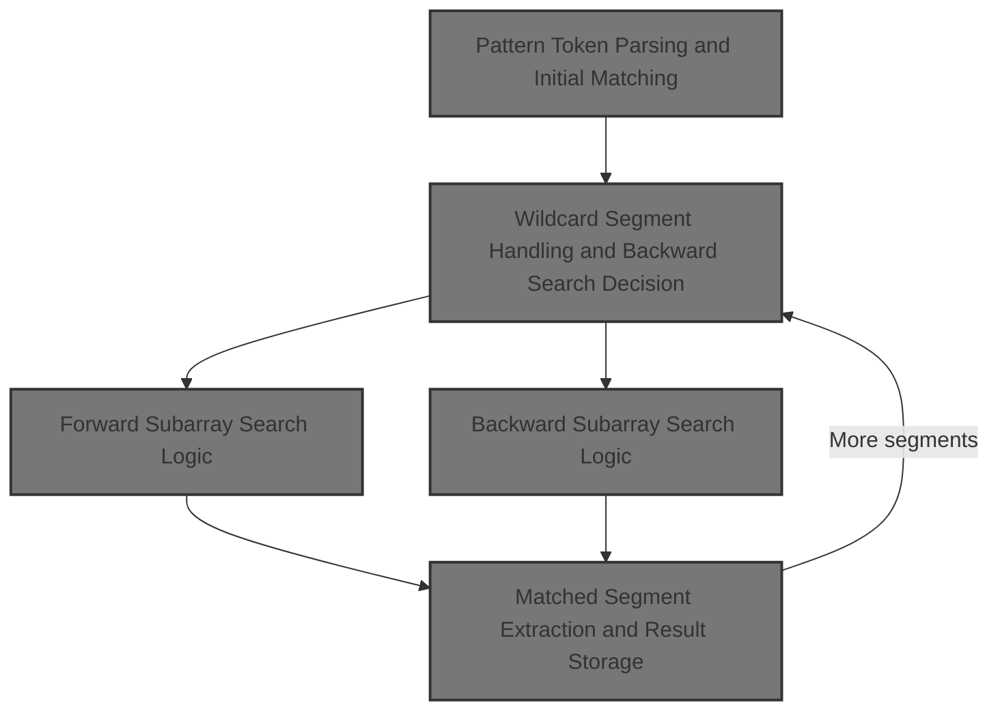
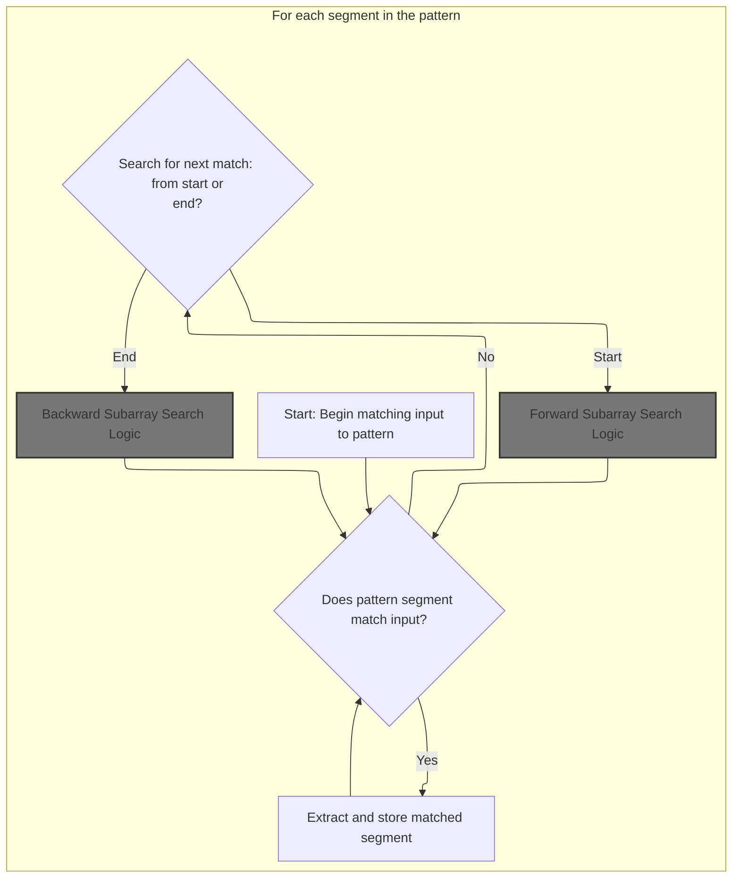
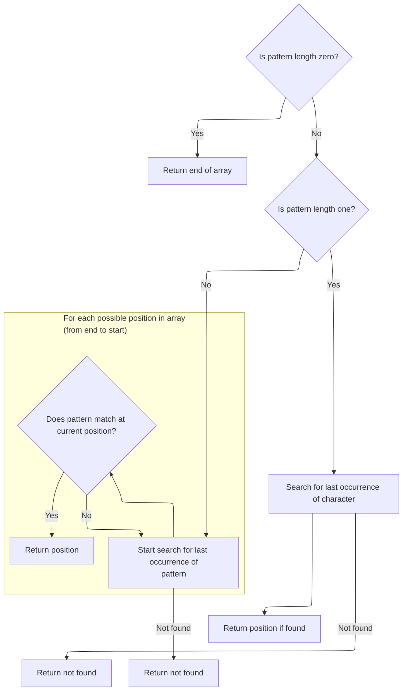
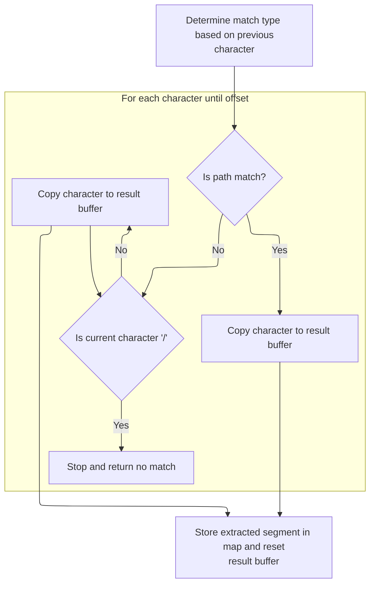

This document explains how an input string is matched against a pattern with wildcards. The flow receives a pattern and an input string, and outputs a map containing the matched segments, enabling flexible extraction of relevant parts from the input.



# Pattern Token Parsing and Initial Matching



<SwmSnippet path="/core/src/main/java/org/apache/struts/util/WildcardHelper.java" line="159">

---

In <SwmToken path="core/src/main/java/org/apache/struts/util/WildcardHelper.java" pos="159:5:5" line-data="    public boolean match(Map map, String data, int[] expr) {">`match`</SwmToken>, the function sets up the matching state, checks for required arguments, and prepares the buffers. It stores the full input string in the map under key '0', then looks for a <SwmToken path="core/src/main/java/org/apache/struts/util/WildcardHelper.java" pos="193:9:9" line-data="        // First check for MATCH_BEGIN">`MATCH_BEGIN`</SwmToken> token to determine if the pattern must match from the start. It scans the expr array for the first special token (negative value), setting up for the main matching loop. The MATCH\_\* constants drive how the pattern is interpreted and matched against the input.

```java
    public boolean match(Map map, String data, int[] expr) {
        if (map == null) {
            throw new NullPointerException("No map provided");
        }

        if (data == null) {
            throw new NullPointerException("No data provided");
        }

        if (expr == null) {
            throw new NullPointerException("No pattern expression provided");
        }

        char[] buff = data.toCharArray();

        // Allocate the result buffer
        char[] rslt = new char[expr.length + buff.length];

        // The previous and current position of the expression character
        // (MATCH_*)
        int charpos = 0;

        // The position in the expression, input, translation and result arrays
        int exprpos = 0;
        int buffpos = 0;
        int rsltpos = 0;
        int offset = -1;

        // The matching count
        int mcount = 0;

        // We want the complete data be in {0}
        map.put(Integer.toString(mcount), data);

        // First check for MATCH_BEGIN
        boolean matchBegin = false;

        if (expr[charpos] == MATCH_BEGIN) {
            matchBegin = true;
            exprpos = ++charpos;
        }

        // Search the fist expression character (except MATCH_BEGIN - already
        // skipped)
        while (expr[charpos] >= 0) {
            charpos++;
        }
```

---

</SwmSnippet>

<SwmSnippet path="/core/src/main/java/org/apache/struts/util/WildcardHelper.java" line="207">

---

Next, the function processes each pattern segment in expr, using negative values to detect special tokens and decide how to match the current segment. It either checks for an exact match at the start or searches for the segment in the input, then handles <SwmToken path="core/src/main/java/org/apache/struts/util/WildcardHelper.java" pos="240:8:8" line-data="            if (exprchr == MATCH_END) {">`MATCH_END`</SwmToken> or <SwmToken path="core/src/main/java/org/apache/struts/util/WildcardHelper.java" pos="248:12:12" line-data="            } else if (exprchr == MATCH_THEEND) {">`MATCH_THEEND`</SwmToken> if encountered.

```java
        // The expression charater (MATCH_*)
        int exprchr = expr[charpos];

        while (true) {
            // Check if the data in the expression array before the current
            // expression character matches the data in the input buffer
            if (matchBegin) {
                if (!matchArray(expr, exprpos, charpos, buff, buffpos)) {
                    return (false);
                }

                matchBegin = false;
            } else {
                offset = indexOfArray(expr, exprpos, charpos, buff, buffpos);

                if (offset < 0) {
                    return (false);
                }
            }

            // Check for MATCH_BEGIN
            if (matchBegin) {
                if (offset != 0) {
                    return (false);
                }

                matchBegin = false;
            }

            // Advance buffpos
            buffpos += (charpos - exprpos);

            // Check for END's
            if (exprchr == MATCH_END) {
                if (rsltpos > 0) {
                    map.put(Integer.toString(++mcount),
                        new String(rslt, 0, rsltpos));
                }

                // Don't care about rest of input buffer
                return (true);
            } else if (exprchr == MATCH_THEEND) {
                if (rsltpos > 0) {
                    map.put(Integer.toString(++mcount),
                        new String(rslt, 0, rsltpos));
                }

                // Check that we reach buffer's end
                return (buffpos == buff.length);
            }

            // Search the next expression character
            exprpos = ++charpos;

            while (expr[charpos] >= 0) {
                charpos++;
            }
```

---

</SwmSnippet>

<SwmSnippet path="/core/src/main/java/org/apache/struts/util/WildcardHelper.java" line="265">

---

Here, WildcardHelper.match decides whether to search forward or backward for the next pattern segment, calling <SwmToken path="core/src/main/java/org/apache/struts/util/WildcardHelper.java" pos="272:3:3" line-data="                ? indexOfArray(expr, exprpos, charpos, buff, buffpos)">`indexOfArray`</SwmToken> if the previous token was <SwmToken path="core/src/main/java/org/apache/struts/util/WildcardHelper.java" pos="271:6:6" line-data="                (prevchr == MATCH_FILE)">`MATCH_FILE`</SwmToken>. This determines where the next match starts in the input.

```java
            int prevchr = exprchr;

            exprchr = expr[charpos];

            // We have here prevchr == * or **.
            offset =
                (prevchr == MATCH_FILE)
                ? indexOfArray(expr, exprpos, charpos, buff, buffpos)
```

---

</SwmSnippet>

## Forward Subarray Search Logic

```mermaid
%%{init: {"flowchart": {"defaultRenderer": "elk"}} }%%
flowchart TD
  node1["Start: Find sequence in character array"]
  click node1 openCode "core/src/main/java/org/apache/struts/util/WildcardHelper.java:316:318"
  node1 --> node2{"Is search range valid?"}
  click node2 openCode "core/src/main/java/org/apache/struts/util/WildcardHelper.java:319:321"
  node2 -->|"No"| node3["Stop: Invalid search range"]
  click node3 openCode "core/src/main/java/org/apache/struts/util/WildcardHelper.java:320:321"
  node2 -->|"Yes"| node4{"Is sequence to match empty?"}
  click node4 openCode "core/src/main/java/org/apache/struts/util/WildcardHelper.java:324:325"
  node4 -->|"Yes"| node5["Return end of array"]
  click node5 openCode "core/src/main/java/org/apache/struts/util/WildcardHelper.java:325:326"
  node4 -->|"No"| node6{"Is sequence a single character?"}
  click node6 openCode "core/src/main/java/org/apache/struts/util/WildcardHelper.java:329:335"
  node6 -->|"Yes"| node7["Search for character in array"]
  click node7 openCode "core/src/main/java/org/apache/struts/util/WildcardHelper.java:331:335"
  node7 --> node8{"Character found?"}
  click node8 openCode "core/src/main/java/org/apache/struts/util/WildcardHelper.java:332:334"
  node8 -->|"Yes"| node9["Return position"]
  click node9 openCode "core/src/main/java/org/apache/struts/util/WildcardHelper.java:333:334"
  node8 -->|"No"| node10["Return not found"]
  click node10 openCode "core/src/main/java/org/apache/struts/util/WildcardHelper.java:335:335"
  node6 -->|"No"| node11["Search for sequence in array"]
  click node11 openCode "core/src/main/java/org/apache/struts/util/WildcardHelper.java:338:358"
  
  subgraph loop1["For each possible position in array"]
    node11 --> node12{"Does sequence match here?"}
    click node12 openCode "core/src/main/java/org/apache/struts/util/WildcardHelper.java:344:353"
    node12 -->|"Yes"| node13["Return position"]
    click node13 openCode "core/src/main/java/org/apache/struts/util/WildcardHelper.java:348:349"
    node12 -->|"No"| node14["Move to next position"]
    click node14 openCode "core/src/main/java/org/apache/struts/util/WildcardHelper.java:357:358"
    node14 --> node12
  end
  node11 --> node15["Return not found"]
  click node15 openCode "core/src/main/java/org/apache/struts/util/WildcardHelper.java:358:358"

classDef HeadingStyle fill:#777777,stroke:#333,stroke-width:2px;

%% Swimm:
%% %%{init: {"flowchart": {"defaultRenderer": "elk"}} }%%
%% flowchart TD
%%   node1["Start: Find sequence in character array"]
%%   click node1 openCode "<SwmPath>[core/…/util/WildcardHelper.java](core/src/main/java/org/apache/struts/util/WildcardHelper.java)</SwmPath>:316:318"
%%   node1 --> node2{"Is search range valid?"}
%%   click node2 openCode "<SwmPath>[core/…/util/WildcardHelper.java](core/src/main/java/org/apache/struts/util/WildcardHelper.java)</SwmPath>:319:321"
%%   node2 -->|"No"| node3["Stop: Invalid search range"]
%%   click node3 openCode "<SwmPath>[core/…/util/WildcardHelper.java](core/src/main/java/org/apache/struts/util/WildcardHelper.java)</SwmPath>:320:321"
%%   node2 -->|"Yes"| node4{"Is sequence to match empty?"}
%%   click node4 openCode "<SwmPath>[core/…/util/WildcardHelper.java](core/src/main/java/org/apache/struts/util/WildcardHelper.java)</SwmPath>:324:325"
%%   node4 -->|"Yes"| node5["Return end of array"]
%%   click node5 openCode "<SwmPath>[core/…/util/WildcardHelper.java](core/src/main/java/org/apache/struts/util/WildcardHelper.java)</SwmPath>:325:326"
%%   node4 -->|"No"| node6{"Is sequence a single character?"}
%%   click node6 openCode "<SwmPath>[core/…/util/WildcardHelper.java](core/src/main/java/org/apache/struts/util/WildcardHelper.java)</SwmPath>:329:335"
%%   node6 -->|"Yes"| node7["Search for character in array"]
%%   click node7 openCode "<SwmPath>[core/…/util/WildcardHelper.java](core/src/main/java/org/apache/struts/util/WildcardHelper.java)</SwmPath>:331:335"
%%   node7 --> node8{"Character found?"}
%%   click node8 openCode "<SwmPath>[core/…/util/WildcardHelper.java](core/src/main/java/org/apache/struts/util/WildcardHelper.java)</SwmPath>:332:334"
%%   node8 -->|"Yes"| node9["Return position"]
%%   click node9 openCode "<SwmPath>[core/…/util/WildcardHelper.java](core/src/main/java/org/apache/struts/util/WildcardHelper.java)</SwmPath>:333:334"
%%   node8 -->|"No"| node10["Return not found"]
%%   click node10 openCode "<SwmPath>[core/…/util/WildcardHelper.java](core/src/main/java/org/apache/struts/util/WildcardHelper.java)</SwmPath>:335:335"
%%   node6 -->|"No"| node11["Search for sequence in array"]
%%   click node11 openCode "<SwmPath>[core/…/util/WildcardHelper.java](core/src/main/java/org/apache/struts/util/WildcardHelper.java)</SwmPath>:338:358"
%%   
%%   subgraph loop1["For each possible position in array"]
%%     node11 --> node12{"Does sequence match here?"}
%%     click node12 openCode "<SwmPath>[core/…/util/WildcardHelper.java](core/src/main/java/org/apache/struts/util/WildcardHelper.java)</SwmPath>:344:353"
%%     node12 -->|"Yes"| node13["Return position"]
%%     click node13 openCode "<SwmPath>[core/…/util/WildcardHelper.java](core/src/main/java/org/apache/struts/util/WildcardHelper.java)</SwmPath>:348:349"
%%     node12 -->|"No"| node14["Move to next position"]
%%     click node14 openCode "<SwmPath>[core/…/util/WildcardHelper.java](core/src/main/java/org/apache/struts/util/WildcardHelper.java)</SwmPath>:357:358"
%%     node14 --> node12
%%   end
%%   node11 --> node15["Return not found"]
%%   click node15 openCode "<SwmPath>[core/…/util/WildcardHelper.java](core/src/main/java/org/apache/struts/util/WildcardHelper.java)</SwmPath>:358:358"
%% 
%% classDef HeadingStyle fill:#777777,stroke:#333,stroke-width:2px;
```



<SwmSnippet path="/core/src/main/java/org/apache/struts/util/WildcardHelper.java" line="316">

---

In <SwmToken path="core/src/main/java/org/apache/struts/util/WildcardHelper.java" pos="316:5:5" line-data="    protected int indexOfArray(int[] r, int rpos, int rend, char[] d,">`indexOfArray`</SwmToken>, the function checks for valid indices, handles zero-length and single-character subarray matches, and sets up for the main substring search. It mixes int\[\] and char\[\] for pattern and input, which is a quirk of this codebase.

```java
    protected int indexOfArray(int[] r, int rpos, int rend, char[] d,
        int dpos) {
        // Check if pos and len are legal
        if (rend < rpos) {
            throw new IllegalArgumentException("rend < rpos");
        }

        // If we need to match a zero length string return current dpos
        if (rend == rpos) {
            return (d.length); //?? dpos?
        }

        // If we need to match a 1 char length string do it simply
        if ((rend - rpos) == 1) {
            // Search for the specified character
            for (int x = dpos; x < d.length; x++) {
                if (r[rpos] == d[x]) {
                    return (x);
                }
            }
```

---

</SwmSnippet>

<SwmSnippet path="/core/src/main/java/org/apache/struts/util/WildcardHelper.java" line="338">

---

Here, <SwmToken path="core/src/main/java/org/apache/struts/util/WildcardHelper.java" pos="220:5:5" line-data="                offset = indexOfArray(expr, exprpos, charpos, buff, buffpos);">`indexOfArray`</SwmToken> runs a naive substring search, checking each possible position in the input for a match with the pattern subarray. It returns the start index if found, or -1 if not.

```java
        // Main string matching loop. It gets executed if the characters to
        // match are less then the characters left in the d buffer
        while (((dpos + rend) - rpos) <= d.length) {
            // Set current startpoint in d
            int y = dpos;

            // Check every character in d for equity. If the string is matched
            // return dpos
            for (int x = rpos; x <= rend; x++) {
                if (x == rend) {
                    return (dpos);
                }

                if (r[x] != d[y++]) {
                    break;
                }
            }

            // Increase dpos to search for the same string at next offset
            dpos++;
        }
```

---

</SwmSnippet>

## Wildcard Segment Handling and Backward Search Decision

<SwmSnippet path="/core/src/main/java/org/apache/struts/util/WildcardHelper.java" line="273">

---

Back in WildcardHelper.match, after getting the offset from <SwmToken path="core/src/main/java/org/apache/struts/util/WildcardHelper.java" pos="220:5:5" line-data="                offset = indexOfArray(expr, exprpos, charpos, buff, buffpos);">`indexOfArray`</SwmToken> or <SwmToken path="core/src/main/java/org/apache/struts/util/WildcardHelper.java" pos="273:3:3" line-data="                : lastIndexOfArray(expr, exprpos, charpos, buff, buffpos);">`lastIndexOfArray`</SwmToken>, the function checks if a match was found. If not, it returns false, ending the matching process for this pattern segment.

```java
                : lastIndexOfArray(expr, exprpos, charpos, buff, buffpos);

            if (offset < 0) {
                return (false);
            }

```

---

</SwmSnippet>

## Backward Subarray Search Logic



<SwmSnippet path="/core/src/main/java/org/apache/struts/util/WildcardHelper.java" line="380">

---

In <SwmToken path="core/src/main/java/org/apache/struts/util/WildcardHelper.java" pos="380:5:5" line-data="    protected int lastIndexOfArray(int[] r, int rpos, int rend, char[] d,">`lastIndexOfArray`</SwmToken>, the function validates indices, handles zero-length and single-character subarrays, and prepares for a backward substring search. It skips dpos in the single-character case and returns <SwmToken path="core/src/main/java/org/apache/struts/util/WildcardHelper.java" pos="389:4:6" line-data="            return (d.length); //?? dpos?">`d.length`</SwmToken> for zero-length matches.

```java
    protected int lastIndexOfArray(int[] r, int rpos, int rend, char[] d,
        int dpos) {
        // Check if pos and len are legal
        if (rend < rpos) {
            throw new IllegalArgumentException("rend < rpos");
        }

        // If we need to match a zero length string return current dpos
        if (rend == rpos) {
            return (d.length); //?? dpos?
        }

        // If we need to match a 1 char length string do it simply
        if ((rend - rpos) == 1) {
            // Search for the specified character
            for (int x = d.length - 1; x > dpos; x--) {
                if (r[rpos] == d[x]) {
                    return (x);
                }
            }
```

---

</SwmSnippet>

<SwmSnippet path="/core/src/main/java/org/apache/struts/util/WildcardHelper.java" line="402">

---

Here, <SwmToken path="core/src/main/java/org/apache/struts/util/WildcardHelper.java" pos="273:3:3" line-data="                : lastIndexOfArray(expr, exprpos, charpos, buff, buffpos);">`lastIndexOfArray`</SwmToken> runs a backward substring search, checking each possible position from the end of the input to dpos for a match with the pattern subarray. It returns the last matching index or -1.

```java
        // Main string matching loop. It gets executed if the characters to
        // match are less then the characters left in the d buffer
        int l = d.length - (rend - rpos);

        while (l >= dpos) {
            // Set current startpoint in d
            int y = l;

            // Check every character in d for equity. If the string is matched
            // return dpos
            for (int x = rpos; x <= rend; x++) {
                if (x == rend) {
                    return (l);
                }

                if (r[x] != d[y++]) {
                    break;
                }
            }

            // Decrease l to search for the same string at next offset
            l--;
        }
```

---

</SwmSnippet>

## Matched Segment Extraction and Result Storage



<SwmSnippet path="/core/src/main/java/org/apache/struts/util/WildcardHelper.java" line="279">

---

Back in WildcardHelper.match, after <SwmToken path="core/src/main/java/org/apache/struts/util/WildcardHelper.java" pos="273:3:3" line-data="                : lastIndexOfArray(expr, exprpos, charpos, buff, buffpos);">`lastIndexOfArray`</SwmToken>, the function copies the matched segment into the result buffer. <SwmToken path="core/src/main/java/org/apache/struts/util/WildcardHelper.java" pos="281:8:8" line-data="            if (prevchr == MATCH_PATH) {">`MATCH_PATH`</SwmToken> copies everything up to the match, while <SwmToken path="core/src/main/java/org/apache/struts/util/WildcardHelper.java" pos="271:6:6" line-data="                (prevchr == MATCH_FILE)">`MATCH_FILE`</SwmToken> checks for '/' and fails if present.

```java
            // Copy the data from the source buffer into the result buffer
            // to substitute the expression character
            if (prevchr == MATCH_PATH) {
                while (buffpos < offset) {
                    rslt[rsltpos++] = buff[buffpos++];
                }
```

---

</SwmSnippet>

<SwmSnippet path="/core/src/main/java/org/apache/struts/util/WildcardHelper.java" line="286">

---

Next, the function continues copying matched characters for <SwmToken path="core/src/main/java/org/apache/struts/util/WildcardHelper.java" pos="271:6:6" line-data="                (prevchr == MATCH_FILE)">`MATCH_FILE`</SwmToken>, but aborts if a '/' is found, enforcing file segment rules.

```java
                // Matching file, don't copy '/'
                while (buffpos < offset) {
                    if (buff[buffpos] == '/') {
                        return (false);
                    }

                    rslt[rsltpos++] = buff[buffpos++];
                }
```

---

</SwmSnippet>

<SwmSnippet path="/core/src/main/java/org/apache/struts/util/WildcardHelper.java" line="296">

---

Finally, WildcardHelper.match stores the matched segment in the map with the next integer key, resets the result buffer, and continues or finishes as needed. The map accumulates all matched segments for the caller.

```java
            map.put(Integer.toString(++mcount), new String(rslt, 0, rsltpos));
            rsltpos = 0;
        }
    }
```

---

</SwmSnippet>

&nbsp;

*This is an auto-generated document by Swimm 🌊 and has not yet been verified by a human*

<SwmMeta version="3.0.0" repo-id="Z2l0aHViJTNBJTNBc3RydXRzMSUzQSUzQVN3aW1tLURlbW8=" repo-name="struts1"><sup>Powered by [Swimm](https://app.swimm.io/)</sup></SwmMeta>
