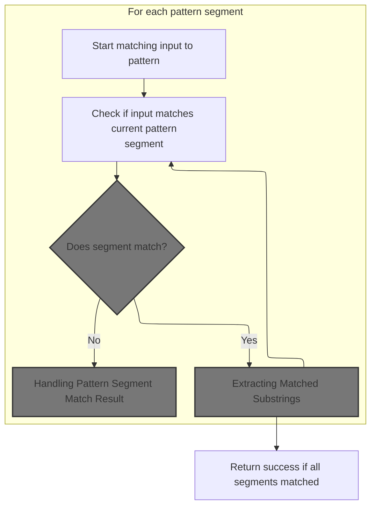
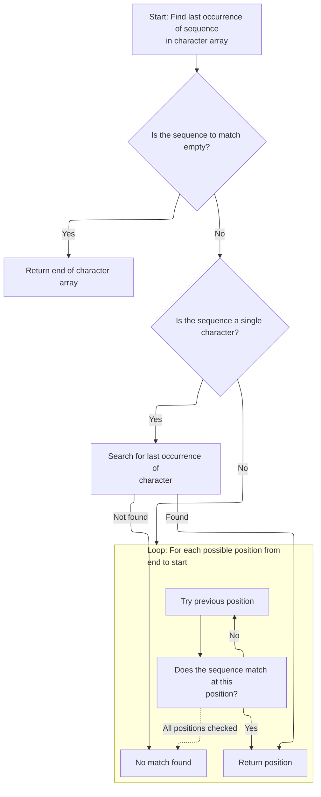
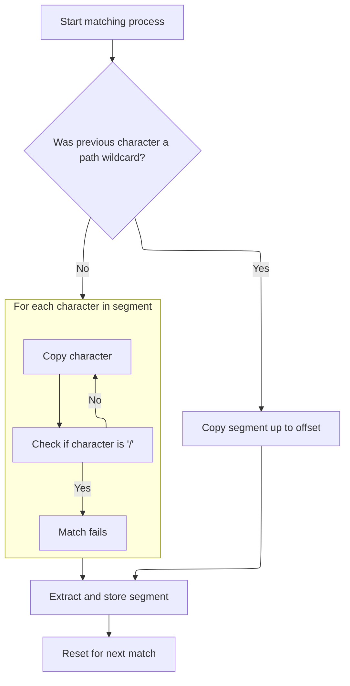

This document describes how an input string is matched against a pattern expression, with matched segments extracted and stored for later use. The process validates the inputs, iterates through pattern segments to find matches, and stores each matched substring in a map. This enables flexible pattern-based operations, such as routing or filtering.

# Pattern Matching Setup and Input Validation



<SwmSnippet path="/core/src/main/java/org/apache/struts/util/WildcardHelper.java" line="159">

---

In <SwmToken path="core/src/main/java/org/apache/struts/util/WildcardHelper.java" pos="159:5:5" line-data="    public boolean match(Map map, String data, int[] expr) {">`match`</SwmToken>, we validate inputs and set up buffers for pattern matching. The function uses custom MATCH\_\* constants to control how segments of the expr array are matched against the data string. It puts the full data string in the map as the first match group, checks for <SwmToken path="core/src/main/java/org/apache/struts/util/WildcardHelper.java" pos="193:9:9" line-data="        // First check for MATCH_BEGIN">`MATCH_BEGIN`</SwmToken> to see if the pattern starts strictly, and prepares to loop through expr and data for matching. This setup is specific to how Struts1 handles wildcard patterns.

```java
    public boolean match(Map map, String data, int[] expr) {
        if (map == null) {
            throw new NullPointerException("No map provided");
        }

        if (data == null) {
            throw new NullPointerException("No data provided");
        }

        if (expr == null) {
            throw new NullPointerException("No pattern expression provided");
        }

        char[] buff = data.toCharArray();

        // Allocate the result buffer
        char[] rslt = new char[expr.length + buff.length];

        // The previous and current position of the expression character
        // (MATCH_*)
        int charpos = 0;

        // The position in the expression, input, translation and result arrays
        int exprpos = 0;
        int buffpos = 0;
        int rsltpos = 0;
        int offset = -1;

        // The matching count
        int mcount = 0;

        // We want the complete data be in {0}
        map.put(Integer.toString(mcount), data);

        // First check for MATCH_BEGIN
        boolean matchBegin = false;

        if (expr[charpos] == MATCH_BEGIN) {
            matchBegin = true;
            exprpos = ++charpos;
        }

        // Search the fist expression character (except MATCH_BEGIN - already
        // skipped)
        while (expr[charpos] >= 0) {
            charpos++;
        }
```

---

</SwmSnippet>

<SwmSnippet path="/core/src/main/java/org/apache/struts/util/WildcardHelper.java" line="207">

---

After setting up, we advance through expr to find the first MATCH\_\* marker, so the matching logic starts at the right segment. This prepares the function for the main matching loop that follows.

```java
        // The expression charater (MATCH_*)
        int exprchr = expr[charpos];

        while (true) {
            // Check if the data in the expression array before the current
            // expression character matches the data in the input buffer
            if (matchBegin) {
                if (!matchArray(expr, exprpos, charpos, buff, buffpos)) {
                    return (false);
                }

                matchBegin = false;
            } else {
                offset = indexOfArray(expr, exprpos, charpos, buff, buffpos);

                if (offset < 0) {
                    return (false);
                }
            }

            // Check for MATCH_BEGIN
            if (matchBegin) {
                if (offset != 0) {
                    return (false);
                }

                matchBegin = false;
            }

            // Advance buffpos
            buffpos += (charpos - exprpos);

            // Check for END's
            if (exprchr == MATCH_END) {
                if (rsltpos > 0) {
                    map.put(Integer.toString(++mcount),
                        new String(rslt, 0, rsltpos));
                }

                // Don't care about rest of input buffer
                return (true);
            } else if (exprchr == MATCH_THEEND) {
                if (rsltpos > 0) {
                    map.put(Integer.toString(++mcount),
                        new String(rslt, 0, rsltpos));
                }

                // Check that we reach buffer's end
                return (buffpos == buff.length);
            }

            // Search the next expression character
            exprpos = ++charpos;

            while (expr[charpos] >= 0) {
                charpos++;
            }
```

---

</SwmSnippet>

<SwmSnippet path="/core/src/main/java/org/apache/struts/util/WildcardHelper.java" line="265">

---

Here we decide whether to use <SwmToken path="core/src/main/java/org/apache/struts/util/WildcardHelper.java" pos="272:3:3" line-data="                ? indexOfArray(expr, exprpos, charpos, buff, buffpos)">`indexOfArray`</SwmToken> or <SwmToken path="core/src/main/java/org/apache/struts/util/WildcardHelper.java" pos="273:3:3" line-data="                : lastIndexOfArray(expr, exprpos, charpos, buff, buffpos);">`lastIndexOfArray`</SwmToken> based on the previous MATCH\_\* marker. Calling <SwmToken path="core/src/main/java/org/apache/struts/util/WildcardHelper.java" pos="272:3:3" line-data="                ? indexOfArray(expr, exprpos, charpos, buff, buffpos)">`indexOfArray`</SwmToken> lets us find the next occurrence of the expr segment in the data, which is necessary for extracting the matched substring.

```java
            int prevchr = exprchr;

            exprchr = expr[charpos];

            // We have here prevchr == * or **.
            offset =
                (prevchr == MATCH_FILE)
                ? indexOfArray(expr, exprpos, charpos, buff, buffpos)
```

---

</SwmSnippet>

## Finding Pattern Segment in Input

```mermaid
%%{init: {"flowchart": {"defaultRenderer": "elk"}} }%%
flowchart TD
  node1{"Is search range valid? (rend < rpos)"}
  click node1 openCode "core/src/main/java/org/apache/struts/util/WildcardHelper.java:319:321"
  node1 -- No --> node2{"Is sequence empty? (rend == rpos)"}
  click node2 openCode "core/src/main/java/org/apache/struts/util/WildcardHelper.java:324:326"
  node1 -- Yes --> node3["Return error: invalid range"]
  click node3 openCode "core/src/main/java/org/apache/struts/util/WildcardHelper.java:320:321"
  node2 -- Yes --> node4["Return current position (end of array)"]
  click node4 openCode "core/src/main/java/org/apache/struts/util/WildcardHelper.java:325:326"
  node2 -- No --> node5{"Is sequence a single character? (rend -
rpos == 1)"}
  click node5 openCode "core/src/main/java/org/apache/struts/util/WildcardHelper.java:329:335"
  node5 -- Yes --> node6["Search for character in array from
current position"]
  click node6 openCode "core/src/main/java/org/apache/struts/util/WildcardHelper.java:331:335"
  node6 --> node7["Return position if found"]
  click node7 openCode "core/src/main/java/org/apache/struts/util/WildcardHelper.java:333:334"
  node5 -- No --> node8
  
  subgraph loop1["#quot;For each possible position in array
(dpos)#quot; "]
    node8["Check if sequence matches at current
position"]
    click node8 openCode "core/src/main/java/org/apache/struts/util/WildcardHelper.java:340:358"
    node8 -- Yes --> node9["Return current position (match found)"]
    click node9 openCode "core/src/main/java/org/apache/struts/util/WildcardHelper.java:348:349"
    node8 -- No --> node10["Move to next position"]
    click node10 openCode "core/src/main/java/org/apache/struts/util/WildcardHelper.java:357:358"
    node10 --> node8
  end

classDef HeadingStyle fill:#777777,stroke:#333,stroke-width:2px;

%% Swimm:
%% %%{init: {"flowchart": {"defaultRenderer": "elk"}} }%%
%% flowchart TD
%%   node1{"Is search range valid? (rend < rpos)"}
%%   click node1 openCode "<SwmPath>[core/…/util/WildcardHelper.java](core/src/main/java/org/apache/struts/util/WildcardHelper.java)</SwmPath>:319:321"
%%   node1 -- No --> node2{"Is sequence empty? (rend == rpos)"}
%%   click node2 openCode "<SwmPath>[core/…/util/WildcardHelper.java](core/src/main/java/org/apache/struts/util/WildcardHelper.java)</SwmPath>:324:326"
%%   node1 -- Yes --> node3["Return error: invalid range"]
%%   click node3 openCode "<SwmPath>[core/…/util/WildcardHelper.java](core/src/main/java/org/apache/struts/util/WildcardHelper.java)</SwmPath>:320:321"
%%   node2 -- Yes --> node4["Return current position (end of array)"]
%%   click node4 openCode "<SwmPath>[core/…/util/WildcardHelper.java](core/src/main/java/org/apache/struts/util/WildcardHelper.java)</SwmPath>:325:326"
%%   node2 -- No --> node5{"Is sequence a single character? (rend -
%% rpos == 1)"}
%%   click node5 openCode "<SwmPath>[core/…/util/WildcardHelper.java](core/src/main/java/org/apache/struts/util/WildcardHelper.java)</SwmPath>:329:335"
%%   node5 -- Yes --> node6["Search for character in array from
%% current position"]
%%   click node6 openCode "<SwmPath>[core/…/util/WildcardHelper.java](core/src/main/java/org/apache/struts/util/WildcardHelper.java)</SwmPath>:331:335"
%%   node6 --> node7["Return position if found"]
%%   click node7 openCode "<SwmPath>[core/…/util/WildcardHelper.java](core/src/main/java/org/apache/struts/util/WildcardHelper.java)</SwmPath>:333:334"
%%   node5 -- No --> node8
%%   
%%   subgraph loop1["#quot;For each possible position in array
%% (dpos)#quot; "]
%%     node8["Check if sequence matches at current
%% position"]
%%     click node8 openCode "<SwmPath>[core/…/util/WildcardHelper.java](core/src/main/java/org/apache/struts/util/WildcardHelper.java)</SwmPath>:340:358"
%%     node8 -- Yes --> node9["Return current position (match found)"]
%%     click node9 openCode "<SwmPath>[core/…/util/WildcardHelper.java](core/src/main/java/org/apache/struts/util/WildcardHelper.java)</SwmPath>:348:349"
%%     node8 -- No --> node10["Move to next position"]
%%     click node10 openCode "<SwmPath>[core/…/util/WildcardHelper.java](core/src/main/java/org/apache/struts/util/WildcardHelper.java)</SwmPath>:357:358"
%%     node10 --> node8
%%   end
%% 
%% classDef HeadingStyle fill:#777777,stroke:#333,stroke-width:2px;
```



<SwmSnippet path="/core/src/main/java/org/apache/struts/util/WildcardHelper.java" line="316">

---

In <SwmToken path="core/src/main/java/org/apache/struts/util/WildcardHelper.java" pos="316:5:5" line-data="    protected int indexOfArray(int[] r, int rpos, int rend, char[] d,">`indexOfArray`</SwmToken>, we match a segment of the expr int array against the data char array. Special handling is done for zero-length and single-character matches, and the main loop searches for the first occurrence of the pattern segment in the input. The int-to-char comparison is unique to this repo.

```java
    protected int indexOfArray(int[] r, int rpos, int rend, char[] d,
        int dpos) {
        // Check if pos and len are legal
        if (rend < rpos) {
            throw new IllegalArgumentException("rend < rpos");
        }

        // If we need to match a zero length string return current dpos
        if (rend == rpos) {
            return (d.length); //?? dpos?
        }

        // If we need to match a 1 char length string do it simply
        if ((rend - rpos) == 1) {
            // Search for the specified character
            for (int x = dpos; x < d.length; x++) {
                if (r[rpos] == d[x]) {
                    return (x);
                }
            }
```

---

</SwmSnippet>

<SwmSnippet path="/core/src/main/java/org/apache/struts/util/WildcardHelper.java" line="338">

---

The main loop checks for matches from rpos to rend inclusive, and returns the starting index in the input if a match is found. If no match is found, it returns -1. This inclusive handling isn't obvious from the function signature.

```java
        // Main string matching loop. It gets executed if the characters to
        // match are less then the characters left in the d buffer
        while (((dpos + rend) - rpos) <= d.length) {
            // Set current startpoint in d
            int y = dpos;

            // Check every character in d for equity. If the string is matched
            // return dpos
            for (int x = rpos; x <= rend; x++) {
                if (x == rend) {
                    return (dpos);
                }

                if (r[x] != d[y++]) {
                    break;
                }
            }

            // Increase dpos to search for the same string at next offset
            dpos++;
        }
```

---

</SwmSnippet>

## Handling Pattern Segment Match Result

<SwmSnippet path="/core/src/main/java/org/apache/struts/util/WildcardHelper.java" line="273">

---

Back in WildcardHelper.match, after getting the offset from <SwmToken path="core/src/main/java/org/apache/struts/util/WildcardHelper.java" pos="220:5:5" line-data="                offset = indexOfArray(expr, exprpos, charpos, buff, buffpos);">`indexOfArray`</SwmToken>, we check if we need to use <SwmToken path="core/src/main/java/org/apache/struts/util/WildcardHelper.java" pos="273:3:3" line-data="                : lastIndexOfArray(expr, exprpos, charpos, buff, buffpos);">`lastIndexOfArray`</SwmToken> instead, depending on the previous MATCH\_\* marker. This lets us handle cases where the pattern segment might appear multiple times and we want the last match.

```java
                : lastIndexOfArray(expr, exprpos, charpos, buff, buffpos);

            if (offset < 0) {
                return (false);
            }

```

---

</SwmSnippet>

## Finding Last Pattern Segment in Input



<SwmSnippet path="/core/src/main/java/org/apache/struts/util/WildcardHelper.java" line="380">

---

In <SwmToken path="core/src/main/java/org/apache/struts/util/WildcardHelper.java" pos="380:5:5" line-data="    protected int lastIndexOfArray(int[] r, int rpos, int rend, char[] d,">`lastIndexOfArray`</SwmToken>, we search backwards in the input for the last occurrence of the pattern segment, comparing the expr int array to the data char array. Special handling is done for zero-length matches and invalid indices, and the int-to-char comparison is unique to this repo.

```java
    protected int lastIndexOfArray(int[] r, int rpos, int rend, char[] d,
        int dpos) {
        // Check if pos and len are legal
        if (rend < rpos) {
            throw new IllegalArgumentException("rend < rpos");
        }

        // If we need to match a zero length string return current dpos
        if (rend == rpos) {
            return (d.length); //?? dpos?
        }

        // If we need to match a 1 char length string do it simply
        if ((rend - rpos) == 1) {
            // Search for the specified character
            for (int x = d.length - 1; x > dpos; x--) {
                if (r[rpos] == d[x]) {
                    return (x);
                }
            }
```

---

</SwmSnippet>

<SwmSnippet path="/core/src/main/java/org/apache/struts/util/WildcardHelper.java" line="402">

---

The main loop searches backwards for the last match of the pattern segment, returning the index if found, or -1 if not. Only the last match is returned

```java
        // Main string matching loop. It gets executed if the characters to
        // match are less then the characters left in the d buffer
        int l = d.length - (rend - rpos);

        while (l >= dpos) {
            // Set current startpoint in d
            int y = l;

            // Check every character in d for equity. If the string is matched
            // return dpos
            for (int x = rpos; x <= rend; x++) {
                if (x == rend) {
                    return (l);
                }

                if (r[x] != d[y++]) {
                    break;
                }
            }

            // Decrease l to search for the same string at next offset
            l--;
        }
```

---

</SwmSnippet>

## Extracting Matched Substrings



<SwmSnippet path="/core/src/main/java/org/apache/struts/util/WildcardHelper.java" line="279">

---

After returning from <SwmToken path="core/src/main/java/org/apache/struts/util/WildcardHelper.java" pos="273:3:3" line-data="                : lastIndexOfArray(expr, exprpos, charpos, buff, buffpos);">`lastIndexOfArray`</SwmToken> in WildcardHelper.match, we use the offset to copy the matched segment from the input buffer into the result buffer. This is how we extract the substring that matches the pattern segment.

```java
            // Copy the data from the source buffer into the result buffer
            // to substitute the expression character
            if (prevchr == MATCH_PATH) {
                while (buffpos < offset) {
                    rslt[rsltpos++] = buff[buffpos++];
                }
```

---

</SwmSnippet>

<SwmSnippet path="/core/src/main/java/org/apache/struts/util/WildcardHelper.java" line="286">

---

When handling <SwmToken path="core/src/main/java/org/apache/struts/util/WildcardHelper.java" pos="271:6:6" line-data="                (prevchr == MATCH_FILE)">`MATCH_FILE`</SwmToken>, we copy the matched segment but stop and fail if a '/' is found. This ensures file matches don't cross directory boundaries, which is important for path-specific patterns.

```java
                // Matching file, don't copy '/'
                while (buffpos < offset) {
                    if (buff[buffpos] == '/') {
                        return (false);
                    }

                    rslt[rsltpos++] = buff[buffpos++];
                }
```

---

</SwmSnippet>

<SwmSnippet path="/core/src/main/java/org/apache/struts/util/WildcardHelper.java" line="296">

---

After matching, we store each matched substring in the map with incrementing keys. The map ends up containing the full input and all matched segments, indexed by their group number. The matching logic is custom to handle Struts1's wildcard patterns.

```java
            map.put(Integer.toString(++mcount), new String(rslt, 0, rsltpos));
            rsltpos = 0;
        }
    }
```

---

</SwmSnippet>

&nbsp;

*This is an auto-generated document by Swimm 🌊 and has not yet been verified by a human*

<SwmMeta version="3.0.0" repo-id="Z2l0aHViJTNBJTNBc3RydXRzMSUzQSUzQVN3aW1tLURlbW8=" repo-name="struts1"><sup>Powered by [Swimm](https://app.swimm.io/)</sup></SwmMeta>
