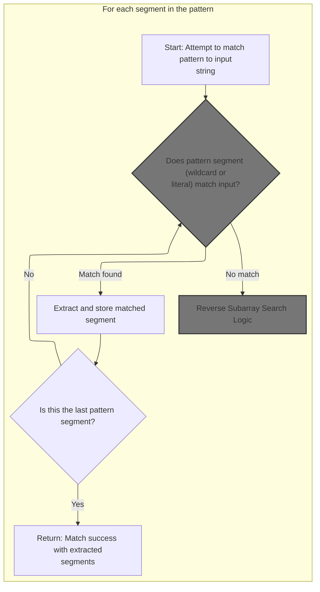
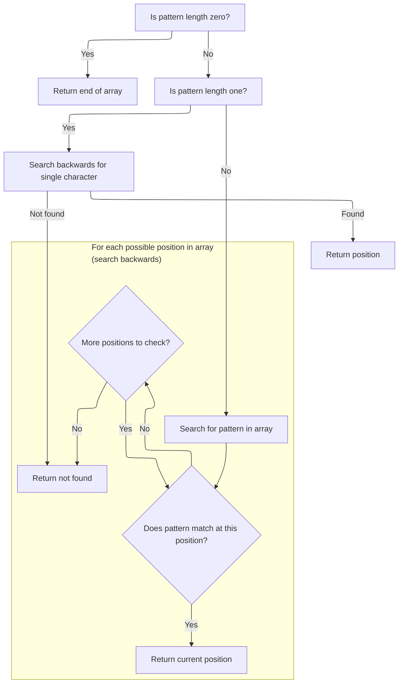
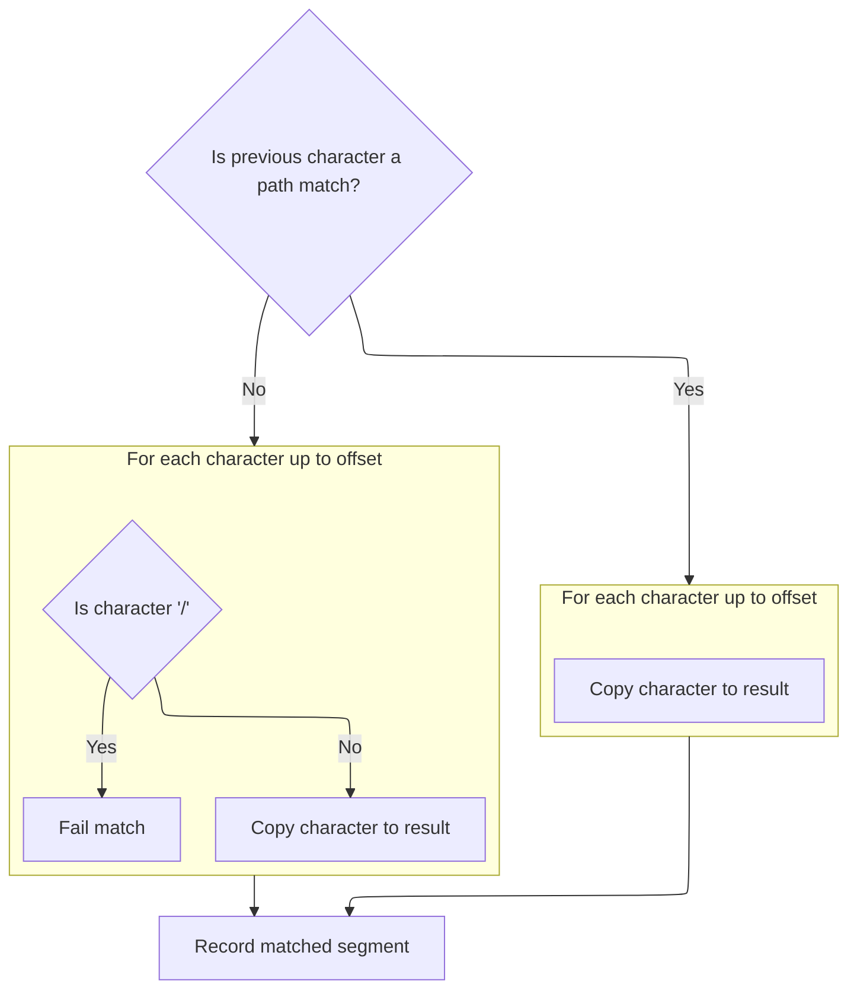

This document describes how pattern matching is performed to determine if an input string fits a specified pattern, which may include wildcards. The process extracts relevant segments from the input and stores them for later use. The flow receives a pattern, an input string, and a map for storing results, and returns whether the input matches the pattern along with any extracted segments.

# Pattern Matching Entry and Setup



<SwmSnippet path="/core/src/main/java/org/apache/struts/util/WildcardHelper.java" line="159">

---

In <SwmToken path="core/src/main/java/org/apache/struts/util/WildcardHelper.java" pos="159:5:5" line-data="    public boolean match(Map map, String data, int[] expr) {">`match`</SwmToken>, we're setting up the pattern matching: validating inputs, converting the input string to a char array, prepping buffers, and putting the whole input in the map under key '0'. We check if the pattern starts with <SwmToken path="core/src/main/java/org/apache/struts/util/WildcardHelper.java" pos="193:9:9" line-data="        // First check for MATCH_BEGIN">`MATCH_BEGIN`</SwmToken> and scan for the first special pattern character. This is all groundwork before the actual matching loop kicks in.

```java
    public boolean match(Map map, String data, int[] expr) {
        if (map == null) {
            throw new NullPointerException("No map provided");
        }

        if (data == null) {
            throw new NullPointerException("No data provided");
        }

        if (expr == null) {
            throw new NullPointerException("No pattern expression provided");
        }

        char[] buff = data.toCharArray();

        // Allocate the result buffer
        char[] rslt = new char[expr.length + buff.length];

        // The previous and current position of the expression character
        // (MATCH_*)
        int charpos = 0;

        // The position in the expression, input, translation and result arrays
        int exprpos = 0;
        int buffpos = 0;
        int rsltpos = 0;
        int offset = -1;

        // The matching count
        int mcount = 0;

        // We want the complete data be in {0}
        map.put(Integer.toString(mcount), data);

        // First check for MATCH_BEGIN
        boolean matchBegin = false;

        if (expr[charpos] == MATCH_BEGIN) {
            matchBegin = true;
            exprpos = ++charpos;
        }

        // Search the fist expression character (except MATCH_BEGIN - already
        // skipped)
        while (expr[charpos] >= 0) {
            charpos++;
        }
```

---

</SwmSnippet>

<SwmSnippet path="/core/src/main/java/org/apache/struts/util/WildcardHelper.java" line="207">

---

Here we're in the main matching loop. Depending on whether we're at the start of the pattern, we either check for an exact match or search for the next segment. If we hit <SwmToken path="core/src/main/java/org/apache/struts/util/WildcardHelper.java" pos="240:8:8" line-data="            if (exprchr == MATCH_END) {">`MATCH_END`</SwmToken> or <SwmToken path="core/src/main/java/org/apache/struts/util/WildcardHelper.java" pos="248:12:12" line-data="            } else if (exprchr == MATCH_THEEND) {">`MATCH_THEEND`</SwmToken>, we store the matched substring and either return true or check if we're at the end of the input. Otherwise, we move on to the next pattern segment.

```java
        // The expression charater (MATCH_*)
        int exprchr = expr[charpos];

        while (true) {
            // Check if the data in the expression array before the current
            // expression character matches the data in the input buffer
            if (matchBegin) {
                if (!matchArray(expr, exprpos, charpos, buff, buffpos)) {
                    return (false);
                }

                matchBegin = false;
            } else {
                offset = indexOfArray(expr, exprpos, charpos, buff, buffpos);

                if (offset < 0) {
                    return (false);
                }
            }

            // Check for MATCH_BEGIN
            if (matchBegin) {
                if (offset != 0) {
                    return (false);
                }

                matchBegin = false;
            }

            // Advance buffpos
            buffpos += (charpos - exprpos);

            // Check for END's
            if (exprchr == MATCH_END) {
                if (rsltpos > 0) {
                    map.put(Integer.toString(++mcount),
                        new String(rslt, 0, rsltpos));
                }

                // Don't care about rest of input buffer
                return (true);
            } else if (exprchr == MATCH_THEEND) {
                if (rsltpos > 0) {
                    map.put(Integer.toString(++mcount),
                        new String(rslt, 0, rsltpos));
                }

                // Check that we reach buffer's end
                return (buffpos == buff.length);
            }

            // Search the next expression character
            exprpos = ++charpos;

            while (expr[charpos] >= 0) {
                charpos++;
            }
```

---

</SwmSnippet>

<SwmSnippet path="/core/src/main/java/org/apache/struts/util/WildcardHelper.java" line="265">

---

At this point, we're deciding how to find the next matching segment in the input. If the previous pattern character was <SwmToken path="core/src/main/java/org/apache/struts/util/WildcardHelper.java" pos="271:6:6" line-data="                (prevchr == MATCH_FILE)">`MATCH_FILE`</SwmToken>, we use <SwmToken path="core/src/main/java/org/apache/struts/util/WildcardHelper.java" pos="272:3:3" line-data="                ? indexOfArray(expr, exprpos, charpos, buff, buffpos)">`indexOfArray`</SwmToken> to locate the next segment, since <SwmToken path="core/src/main/java/org/apache/struts/util/WildcardHelper.java" pos="271:6:6" line-data="                (prevchr == MATCH_FILE)">`MATCH_FILE`</SwmToken> means we want to match up to a file boundary. This sets up the offset for the next part of the match.

```java
            int prevchr = exprchr;

            exprchr = expr[charpos];

            // We have here prevchr == * or **.
            offset =
                (prevchr == MATCH_FILE)
                ? indexOfArray(expr, exprpos, charpos, buff, buffpos)
```

---

</SwmSnippet>

## Forward Subarray Search Logic

```mermaid
%%{init: {"flowchart": {"defaultRenderer": "elk"}} }%%
flowchart TD
  node1["Check if the search range is valid"] --> node2{"Is the search range valid?"}
  click node1 openCode "core/src/main/java/org/apache/struts/util/WildcardHelper.java:319:321"
  node2 -->|"No"| node3["Stop: Invalid search range"]
  click node2 openCode "core/src/main/java/org/apache/struts/util/WildcardHelper.java:319:321"
  click node3 openCode "core/src/main/java/org/apache/struts/util/WildcardHelper.java:320:321"
  node2 -->|"Yes"| node4{"Is the sequence to match empty?"}
  click node4 openCode "core/src/main/java/org/apache/struts/util/WildcardHelper.java:324:326"
  node4 -->|"Yes"| node5["Return end of character array"]
  click node5 openCode "core/src/main/java/org/apache/struts/util/WildcardHelper.java:325:326"
  node4 -->|"No"| node6{"Is the sequence a single character?"}
  click node6 openCode "core/src/main/java/org/apache/struts/util/WildcardHelper.java:329:335"
  node6 -->|"Yes"| node7["Search for character in array"]
  click node7 openCode "core/src/main/java/org/apache/struts/util/WildcardHelper.java:331:335"
  node7 -->|"Found"| node8["Return position"]
  click node8 openCode "core/src/main/java/org/apache/struts/util/WildcardHelper.java:333:334"
  node7 -->|"Not found"| node11["Return not found"]
  click node11 openCode "core/src/main/java/org/apache/struts/util/WildcardHelper.java:335:335"
  node6 -->|"No"| node9["Start sequence search in array"]
  click node9 openCode "core/src/main/java/org/apache/struts/util/WildcardHelper.java:340:358"

  subgraph loop1["For each possible starting position in
the character array"]
    node9 --> node12{"Does the sequence match at this
position?"}
    click node12 openCode "core/src/main/java/org/apache/struts/util/WildcardHelper.java:346:353"
    node12 -->|"Yes"| node10["Return position"]
    click node10 openCode "core/src/main/java/org/apache/struts/util/WildcardHelper.java:348:349"
    node12 -->|"No"| node13["Move to next position"]
    click node13 openCode "core/src/main/java/org/apache/struts/util/WildcardHelper.java:357:358"
    node13 --> node12
  end
  node12 -->|"End reached, not found"| node14["Return not found"]
  click node14 openCode "core/src/main/java/org/apache/struts/util/WildcardHelper.java:358:358"

classDef HeadingStyle fill:#777777,stroke:#333,stroke-width:2px;

%% Swimm:
%% %%{init: {"flowchart": {"defaultRenderer": "elk"}} }%%
%% flowchart TD
%%   node1["Check if the search range is valid"] --> node2{"Is the search range valid?"}
%%   click node1 openCode "<SwmPath>[core/…/util/WildcardHelper.java](core/src/main/java/org/apache/struts/util/WildcardHelper.java)</SwmPath>:319:321"
%%   node2 -->|"No"| node3["Stop: Invalid search range"]
%%   click node2 openCode "<SwmPath>[core/…/util/WildcardHelper.java](core/src/main/java/org/apache/struts/util/WildcardHelper.java)</SwmPath>:319:321"
%%   click node3 openCode "<SwmPath>[core/…/util/WildcardHelper.java](core/src/main/java/org/apache/struts/util/WildcardHelper.java)</SwmPath>:320:321"
%%   node2 -->|"Yes"| node4{"Is the sequence to match empty?"}
%%   click node4 openCode "<SwmPath>[core/…/util/WildcardHelper.java](core/src/main/java/org/apache/struts/util/WildcardHelper.java)</SwmPath>:324:326"
%%   node4 -->|"Yes"| node5["Return end of character array"]
%%   click node5 openCode "<SwmPath>[core/…/util/WildcardHelper.java](core/src/main/java/org/apache/struts/util/WildcardHelper.java)</SwmPath>:325:326"
%%   node4 -->|"No"| node6{"Is the sequence a single character?"}
%%   click node6 openCode "<SwmPath>[core/…/util/WildcardHelper.java](core/src/main/java/org/apache/struts/util/WildcardHelper.java)</SwmPath>:329:335"
%%   node6 -->|"Yes"| node7["Search for character in array"]
%%   click node7 openCode "<SwmPath>[core/…/util/WildcardHelper.java](core/src/main/java/org/apache/struts/util/WildcardHelper.java)</SwmPath>:331:335"
%%   node7 -->|"Found"| node8["Return position"]
%%   click node8 openCode "<SwmPath>[core/…/util/WildcardHelper.java](core/src/main/java/org/apache/struts/util/WildcardHelper.java)</SwmPath>:333:334"
%%   node7 -->|"Not found"| node11["Return not found"]
%%   click node11 openCode "<SwmPath>[core/…/util/WildcardHelper.java](core/src/main/java/org/apache/struts/util/WildcardHelper.java)</SwmPath>:335:335"
%%   node6 -->|"No"| node9["Start sequence search in array"]
%%   click node9 openCode "<SwmPath>[core/…/util/WildcardHelper.java](core/src/main/java/org/apache/struts/util/WildcardHelper.java)</SwmPath>:340:358"
%% 
%%   subgraph loop1["For each possible starting position in
%% the character array"]
%%     node9 --> node12{"Does the sequence match at this
%% position?"}
%%     click node12 openCode "<SwmPath>[core/…/util/WildcardHelper.java](core/src/main/java/org/apache/struts/util/WildcardHelper.java)</SwmPath>:346:353"
%%     node12 -->|"Yes"| node10["Return position"]
%%     click node10 openCode "<SwmPath>[core/…/util/WildcardHelper.java](core/src/main/java/org/apache/struts/util/WildcardHelper.java)</SwmPath>:348:349"
%%     node12 -->|"No"| node13["Move to next position"]
%%     click node13 openCode "<SwmPath>[core/…/util/WildcardHelper.java](core/src/main/java/org/apache/struts/util/WildcardHelper.java)</SwmPath>:357:358"
%%     node13 --> node12
%%   end
%%   node12 -->|"End reached, not found"| node14["Return not found"]
%%   click node14 openCode "<SwmPath>[core/…/util/WildcardHelper.java](core/src/main/java/org/apache/struts/util/WildcardHelper.java)</SwmPath>:358:358"
%% 
%% classDef HeadingStyle fill:#777777,stroke:#333,stroke-width:2px;
```



<SwmSnippet path="/core/src/main/java/org/apache/struts/util/WildcardHelper.java" line="316">

---

In <SwmToken path="core/src/main/java/org/apache/struts/util/WildcardHelper.java" pos="316:5:5" line-data="    protected int indexOfArray(int[] r, int rpos, int rend, char[] d,">`indexOfArray`</SwmToken>, we're searching for a sequence of ints (the pattern) inside a char array (the input). Special cases: if the pattern is zero-length, we return <SwmToken path="core/src/main/java/org/apache/struts/util/WildcardHelper.java" pos="325:4:6" line-data="            return (d.length); //?? dpos?">`d.length`</SwmToken>; if it's a single char, we do a simple scan. Otherwise, we loop through the input to find the first occurrence of the pattern segment.

```java
    protected int indexOfArray(int[] r, int rpos, int rend, char[] d,
        int dpos) {
        // Check if pos and len are legal
        if (rend < rpos) {
            throw new IllegalArgumentException("rend < rpos");
        }

        // If we need to match a zero length string return current dpos
        if (rend == rpos) {
            return (d.length); //?? dpos?
        }

        // If we need to match a 1 char length string do it simply
        if ((rend - rpos) == 1) {
            // Search for the specified character
            for (int x = dpos; x < d.length; x++) {
                if (r[rpos] == d[x]) {
                    return (x);
                }
            }
```

---

</SwmSnippet>

<SwmSnippet path="/core/src/main/java/org/apache/struts/util/WildcardHelper.java" line="338">

---

Here we're running the main matching loop: for each possible position in the input, we check if the pattern segment matches. If it does, we return the start index; if not, we keep searching. If nothing matches, we return -1.

```java
        // Main string matching loop. It gets executed if the characters to
        // match are less then the characters left in the d buffer
        while (((dpos + rend) - rpos) <= d.length) {
            // Set current startpoint in d
            int y = dpos;

            // Check every character in d for equity. If the string is matched
            // return dpos
            for (int x = rpos; x <= rend; x++) {
                if (x == rend) {
                    return (dpos);
                }

                if (r[x] != d[y++]) {
                    break;
                }
            }

            // Increase dpos to search for the same string at next offset
            dpos++;
        }
```

---

</SwmSnippet>

## Fallback to Reverse Search

<SwmSnippet path="/core/src/main/java/org/apache/struts/util/WildcardHelper.java" line="273">

---

Back in <SwmToken path="core/src/main/java/org/apache/struts/util/WildcardHelper.java" pos="159:5:5" line-data="    public boolean match(Map map, String data, int[] expr) {">`match`</SwmToken>, after trying <SwmToken path="core/src/main/java/org/apache/struts/util/WildcardHelper.java" pos="220:5:5" line-data="                offset = indexOfArray(expr, exprpos, charpos, buff, buffpos);">`indexOfArray`</SwmToken>, if <SwmToken path="core/src/main/java/org/apache/struts/util/WildcardHelper.java" pos="271:6:6" line-data="                (prevchr == MATCH_FILE)">`MATCH_FILE`</SwmToken> wasn't the previous pattern, we fall back to <SwmToken path="core/src/main/java/org/apache/struts/util/WildcardHelper.java" pos="273:3:3" line-data="                : lastIndexOfArray(expr, exprpos, charpos, buff, buffpos);">`lastIndexOfArray`</SwmToken> to find the last possible match for the segment. If we can't find a match (offset < 0), we bail out and return false.

```java
                : lastIndexOfArray(expr, exprpos, charpos, buff, buffpos);

            if (offset < 0) {
                return (false);
            }

```

---

</SwmSnippet>

## Reverse Subarray Search Logic



<SwmSnippet path="/core/src/main/java/org/apache/struts/util/WildcardHelper.java" line="380">

---

In <SwmToken path="core/src/main/java/org/apache/struts/util/WildcardHelper.java" pos="380:5:5" line-data="    protected int lastIndexOfArray(int[] r, int rpos, int rend, char[] d,">`lastIndexOfArray`</SwmToken>, we're searching for the last occurrence of a pattern segment (int array) in the input (char array), starting from the end and moving backwards. Special cases: zero-length matches return <SwmToken path="core/src/main/java/org/apache/struts/util/WildcardHelper.java" pos="389:4:6" line-data="            return (d.length); //?? dpos?">`d.length`</SwmToken>, single-char matches scan backwards, otherwise we loop from the end to the start.

```java
    protected int lastIndexOfArray(int[] r, int rpos, int rend, char[] d,
        int dpos) {
        // Check if pos and len are legal
        if (rend < rpos) {
            throw new IllegalArgumentException("rend < rpos");
        }

        // If we need to match a zero length string return current dpos
        if (rend == rpos) {
            return (d.length); //?? dpos?
        }

        // If we need to match a 1 char length string do it simply
        if ((rend - rpos) == 1) {
            // Search for the specified character
            for (int x = d.length - 1; x > dpos; x--) {
                if (r[rpos] == d[x]) {
                    return (x);
                }
            }
```

---

</SwmSnippet>

<SwmSnippet path="/core/src/main/java/org/apache/struts/util/WildcardHelper.java" line="402">

---

Here we're looping backwards through the input, checking for a match at each position. If we find a match, we return the start index; if not, we keep going. If nothing matches, we return -1.

```java
        // Main string matching loop. It gets executed if the characters to
        // match are less then the characters left in the d buffer
        int l = d.length - (rend - rpos);

        while (l >= dpos) {
            // Set current startpoint in d
            int y = l;

            // Check every character in d for equity. If the string is matched
            // return dpos
            for (int x = rpos; x <= rend; x++) {
                if (x == rend) {
                    return (l);
                }

                if (r[x] != d[y++]) {
                    break;
                }
            }

            // Decrease l to search for the same string at next offset
            l--;
        }
```

---

</SwmSnippet>

## Capturing and Storing Matched Segments



<SwmSnippet path="/core/src/main/java/org/apache/struts/util/WildcardHelper.java" line="279">

---

Back in <SwmToken path="core/src/main/java/org/apache/struts/util/WildcardHelper.java" pos="159:5:5" line-data="    public boolean match(Map map, String data, int[] expr) {">`match`</SwmToken>, after <SwmToken path="core/src/main/java/org/apache/struts/util/WildcardHelper.java" pos="273:3:3" line-data="                : lastIndexOfArray(expr, exprpos, charpos, buff, buffpos);">`lastIndexOfArray`</SwmToken> gives us the offset, we copy the matched segment from the input into the result buffer. If we're handling <SwmToken path="core/src/main/java/org/apache/struts/util/WildcardHelper.java" pos="281:8:8" line-data="            if (prevchr == MATCH_PATH) {">`MATCH_PATH`</SwmToken>, we just copy everything up to the offset.

```java
            // Copy the data from the source buffer into the result buffer
            // to substitute the expression character
            if (prevchr == MATCH_PATH) {
                while (buffpos < offset) {
                    rslt[rsltpos++] = buff[buffpos++];
                }
```

---

</SwmSnippet>

<SwmSnippet path="/core/src/main/java/org/apache/struts/util/WildcardHelper.java" line="286">

---

For <SwmToken path="core/src/main/java/org/apache/struts/util/WildcardHelper.java" pos="271:6:6" line-data="                (prevchr == MATCH_FILE)">`MATCH_FILE`</SwmToken>, we copy the matched segment but bail out if we hit a '/'. This keeps file matches from crossing path boundaries.

```java
                // Matching file, don't copy '/'
                while (buffpos < offset) {
                    if (buff[buffpos] == '/') {
                        return (false);
                    }

                    rslt[rsltpos++] = buff[buffpos++];
                }
```

---

</SwmSnippet>

<SwmSnippet path="/core/src/main/java/org/apache/struts/util/WildcardHelper.java" line="296">

---

Finally, after copying the matched segment, we store it in the map with the next index and reset the result buffer. The function returns true if matching completes successfully, or false if it fails anywhere along the way.

```java
            map.put(Integer.toString(++mcount), new String(rslt, 0, rsltpos));
            rsltpos = 0;
        }
    }
```

---

</SwmSnippet>

&nbsp;

*This is an auto-generated document by Swimm 🌊 and has not yet been verified by a human*

<SwmMeta version="3.0.0" repo-id="Z2l0aHViJTNBJTNBc3RydXRzMSUzQSUzQVN3aW1tLURlbW8=" repo-name="struts1"><sup>Powered by [Swimm](https://app.swimm.io/)</sup></SwmMeta>
