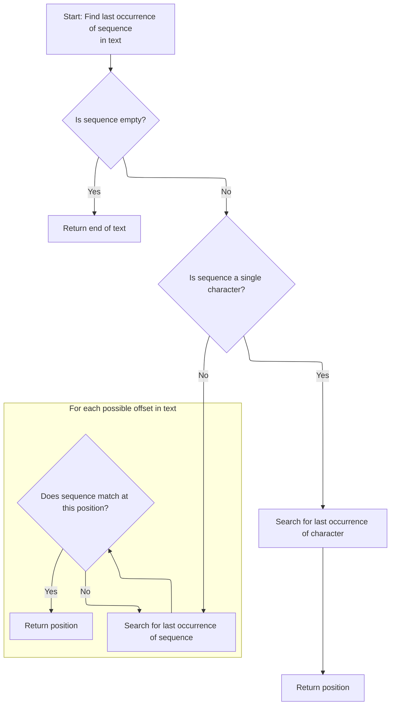
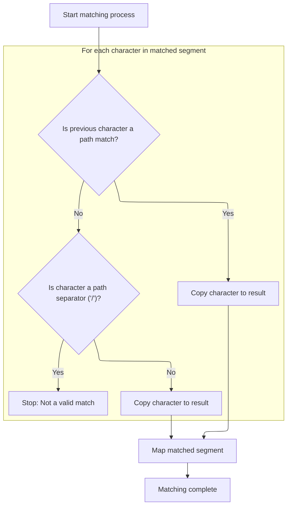

This document describes how an input string is matched against a pattern with support for wildcards, including path and file wildcards. The flow extracts matched segments into a map if the pattern matches the input.

# Pattern Matching Setup and Initial Checks

```mermaid
%%{init: {"flowchart": {"defaultRenderer": "elk"}} }%%
flowchart TD
    node1["Start: Map input as first segment and
begin matching pattern"] --> subgraph loop1["For each pattern segment"]
        node2{"Does current pattern segment match
input?"}
        click node2 openCode "core/src/main/java/org/apache/struts/util/WildcardHelper.java:196:215"
        node2 -->|"Yes"| node3["Reverse Subarray Search Logic"]
        
        node2 -->|"No"| node5["Return: No match"]
        click node5 openCode "core/src/main/java/org/apache/struts/util/WildcardHelper.java:215:224"
        node3 --> node4["Extract and store matching segment"]
        click node4 openCode "core/src/main/java/org/apache/struts/util/WildcardHelper.java:279:298"
    end
    node4 --> node6{"Is end of pattern reached and input
fully matched?"}
    click node6 openCode "core/src/main/java/org/apache/struts/util/WildcardHelper.java:240:256"
    node6 -->|"Yes"| node7["Return: Match success with extracted
segments"]
    click node7 openCode "core/src/main/java/org/apache/struts/util/WildcardHelper.java:247:256"
    node6 -->|"No"| node5
    click node5 openCode "core/src/main/java/org/apache/struts/util/WildcardHelper.java:215:224"

classDef HeadingStyle fill:#777777,stroke:#333,stroke-width:2px;
click node3 goToHeading "Forward Subarray Search Logic"
node3:::HeadingStyle
click node3 goToHeading "Reverse Subarray Search Logic"
node3:::HeadingStyle

%% Swimm:
%% %%{init: {"flowchart": {"defaultRenderer": "elk"}} }%%
%% flowchart TD
%%     node1["Start: Map input as first segment and
%% begin matching pattern"] --> subgraph loop1["For each pattern segment"]
%%         node2{"Does current pattern segment match
%% input?"}
%%         click node2 openCode "<SwmPath>[core/…/util/WildcardHelper.java](core/src/main/java/org/apache/struts/util/WildcardHelper.java)</SwmPath>:196:215"
%%         node2 -->|"Yes"| node3["Reverse Subarray Search Logic"]
%%         
%%         node2 -->|"No"| node5["Return: No match"]
%%         click node5 openCode "<SwmPath>[core/…/util/WildcardHelper.java](core/src/main/java/org/apache/struts/util/WildcardHelper.java)</SwmPath>:215:224"
%%         node3 --> node4["Extract and store matching segment"]
%%         click node4 openCode "<SwmPath>[core/…/util/WildcardHelper.java](core/src/main/java/org/apache/struts/util/WildcardHelper.java)</SwmPath>:279:298"
%%     end
%%     node4 --> node6{"Is end of pattern reached and input
%% fully matched?"}
%%     click node6 openCode "<SwmPath>[core/…/util/WildcardHelper.java](core/src/main/java/org/apache/struts/util/WildcardHelper.java)</SwmPath>:240:256"
%%     node6 -->|"Yes"| node7["Return: Match success with extracted
%% segments"]
%%     click node7 openCode "<SwmPath>[core/…/util/WildcardHelper.java](core/src/main/java/org/apache/struts/util/WildcardHelper.java)</SwmPath>:247:256"
%%     node6 -->|"No"| node5
%%     click node5 openCode "<SwmPath>[core/…/util/WildcardHelper.java](core/src/main/java/org/apache/struts/util/WildcardHelper.java)</SwmPath>:215:224"
%% 
%% classDef HeadingStyle fill:#777777,stroke:#333,stroke-width:2px;
%% click node3 goToHeading "Forward Subarray Search Logic"
%% node3:::HeadingStyle
%% click node3 goToHeading "Reverse Subarray Search Logic"
%% node3:::HeadingStyle
```

<SwmSnippet path="/core/src/main/java/org/apache/struts/util/WildcardHelper.java" line="159">

---

In <SwmToken path="core/src/main/java/org/apache/struts/util/WildcardHelper.java" pos="159:5:5" line-data="    public boolean match(Map map, String data, int[] expr) {">`match`</SwmToken>, we're validating the inputs, converting the data to a char array, setting up the result buffer, and storing the whole input string in the map under key '0'. Then we check if the pattern starts with <SwmToken path="core/src/main/java/org/apache/struts/util/WildcardHelper.java" pos="193:9:9" line-data="        // First check for MATCH_BEGIN">`MATCH_BEGIN`</SwmToken> and adjust our positions accordingly. We loop through expr to find the first MATCH\_\* token, which sets up the main matching logic. The use of MATCH\_\* constants here is what drives the custom pattern matching behavior.

```java
    public boolean match(Map map, String data, int[] expr) {
        if (map == null) {
            throw new NullPointerException("No map provided");
        }

        if (data == null) {
            throw new NullPointerException("No data provided");
        }

        if (expr == null) {
            throw new NullPointerException("No pattern expression provided");
        }

        char[] buff = data.toCharArray();

        // Allocate the result buffer
        char[] rslt = new char[expr.length + buff.length];

        // The previous and current position of the expression character
        // (MATCH_*)
        int charpos = 0;

        // The position in the expression, input, translation and result arrays
        int exprpos = 0;
        int buffpos = 0;
        int rsltpos = 0;
        int offset = -1;

        // The matching count
        int mcount = 0;

        // We want the complete data be in {0}
        map.put(Integer.toString(mcount), data);

        // First check for MATCH_BEGIN
        boolean matchBegin = false;

        if (expr[charpos] == MATCH_BEGIN) {
            matchBegin = true;
            exprpos = ++charpos;
        }

        // Search the fist expression character (except MATCH_BEGIN - already
        // skipped)
        while (expr[charpos] >= 0) {
            charpos++;
        }
```

---

</SwmSnippet>

<SwmSnippet path="/core/src/main/java/org/apache/struts/util/WildcardHelper.java" line="207">

---

After the initial setup, we're in the main matching loop. Here, we either check for a direct match at the current position (if <SwmToken path="core/src/main/java/org/apache/struts/util/WildcardHelper.java" pos="213:4:4" line-data="            if (matchBegin) {">`matchBegin`</SwmToken> is set) or search for the next matching substring using <SwmToken path="core/src/main/java/org/apache/struts/util/WildcardHelper.java" pos="220:5:5" line-data="                offset = indexOfArray(expr, exprpos, charpos, buff, buffpos);">`indexOfArray`</SwmToken>. If we hit <SwmToken path="core/src/main/java/org/apache/struts/util/WildcardHelper.java" pos="240:8:8" line-data="            if (exprchr == MATCH_END) {">`MATCH_END`</SwmToken> or <SwmToken path="core/src/main/java/org/apache/struts/util/WildcardHelper.java" pos="248:12:12" line-data="            } else if (exprchr == MATCH_THEEND) {">`MATCH_THEEND`</SwmToken>, we store the matched substring and either return true or check if we've consumed all input. Otherwise, we move to the next segment in expr for further matching. This is where the core matching logic happens.

```java
        // The expression charater (MATCH_*)
        int exprchr = expr[charpos];

        while (true) {
            // Check if the data in the expression array before the current
            // expression character matches the data in the input buffer
            if (matchBegin) {
                if (!matchArray(expr, exprpos, charpos, buff, buffpos)) {
                    return (false);
                }

                matchBegin = false;
            } else {
                offset = indexOfArray(expr, exprpos, charpos, buff, buffpos);

                if (offset < 0) {
                    return (false);
                }
            }

            // Check for MATCH_BEGIN
            if (matchBegin) {
                if (offset != 0) {
                    return (false);
                }

                matchBegin = false;
            }

            // Advance buffpos
            buffpos += (charpos - exprpos);

            // Check for END's
            if (exprchr == MATCH_END) {
                if (rsltpos > 0) {
                    map.put(Integer.toString(++mcount),
                        new String(rslt, 0, rsltpos));
                }

                // Don't care about rest of input buffer
                return (true);
            } else if (exprchr == MATCH_THEEND) {
                if (rsltpos > 0) {
                    map.put(Integer.toString(++mcount),
                        new String(rslt, 0, rsltpos));
                }

                // Check that we reach buffer's end
                return (buffpos == buff.length);
            }

            // Search the next expression character
            exprpos = ++charpos;

            while (expr[charpos] >= 0) {
                charpos++;
            }
```

---

</SwmSnippet>

<SwmSnippet path="/core/src/main/java/org/apache/struts/util/WildcardHelper.java" line="265">

---

At this point, we're deciding whether to use <SwmToken path="core/src/main/java/org/apache/struts/util/WildcardHelper.java" pos="272:3:3" line-data="                ? indexOfArray(expr, exprpos, charpos, buff, buffpos)">`indexOfArray`</SwmToken> or <SwmToken path="core/src/main/java/org/apache/struts/util/WildcardHelper.java" pos="273:3:3" line-data="                : lastIndexOfArray(expr, exprpos, charpos, buff, buffpos);">`lastIndexOfArray`</SwmToken> based on the previous MATCH\_\* token. Calling <SwmToken path="core/src/main/java/org/apache/struts/util/WildcardHelper.java" pos="272:3:3" line-data="                ? indexOfArray(expr, exprpos, charpos, buff, buffpos)">`indexOfArray`</SwmToken> here lets us find the next occurrence of the pattern segment in the input

```java
            int prevchr = exprchr;

            exprchr = expr[charpos];

            // We have here prevchr == * or **.
            offset =
                (prevchr == MATCH_FILE)
                ? indexOfArray(expr, exprpos, charpos, buff, buffpos)
```

---

</SwmSnippet>

## Forward Subarray Search Logic

```mermaid
%%{init: {"flowchart": {"defaultRenderer": "elk"}} }%%
flowchart TD
  node1["Start: Find where sequence appears in
text"] --> node2{"Is search range valid?"}
  click node1 openCode "core/src/main/java/org/apache/struts/util/WildcardHelper.java:316:319"
  click node2 openCode "core/src/main/java/org/apache/struts/util/WildcardHelper.java:319:321"
  node2 -->|"No"| node3["Stop: Invalid search range"]
  click node3 openCode "core/src/main/java/org/apache/struts/util/WildcardHelper.java:320:321"
  node2 -->|"Yes"| node4{"Is sequence empty?"}
  click node4 openCode "core/src/main/java/org/apache/struts/util/WildcardHelper.java:324:326"
  node4 -->|"Yes"| node5["Return end of text"]
  click node5 openCode "core/src/main/java/org/apache/struts/util/WildcardHelper.java:325:326"
  node4 -->|"No"| node6{"Is sequence a single character?"}
  click node6 openCode "core/src/main/java/org/apache/struts/util/WildcardHelper.java:329:335"
  node6 -->|"Yes"| node7["Find character in text"]
  click node7 openCode "core/src/main/java/org/apache/struts/util/WildcardHelper.java:331:335"
  node7 -->|"Found"| node8["Return position"]
  click node8 openCode "core/src/main/java/org/apache/struts/util/WildcardHelper.java:333:334"
  node7 -->|"Not found"| node13["Return not found"]
  click node13 openCode "core/src/main/java/org/apache/struts/util/WildcardHelper.java:335:335"
  node6 -->|"No"| node9["Search for sequence in text"]
  click node9 openCode "core/src/main/java/org/apache/struts/util/WildcardHelper.java:338:358"
  subgraph loop1["Repeat for each possible position in
text"]
    node9 --> node10{"Does sequence match here?"}
    click node10 openCode "core/src/main/java/org/apache/struts/util/WildcardHelper.java:344:354"
    node10 -->|"Yes"| node11["Return current position"]
    click node11 openCode "core/src/main/java/org/apache/struts/util/WildcardHelper.java:348:349"
    node10 -->|"No"| node12{"More positions left?"}
    click node12 openCode "core/src/main/java/org/apache/struts/util/WildcardHelper.java:357:358"
    node12 -->|"Yes"| node10
    node12 -->|"No"| node13
  end
classDef HeadingStyle fill:#777777,stroke:#333,stroke-width:2px;

%% Swimm:
%% %%{init: {"flowchart": {"defaultRenderer": "elk"}} }%%
%% flowchart TD
%%   node1["Start: Find where sequence appears in
%% text"] --> node2{"Is search range valid?"}
%%   click node1 openCode "<SwmPath>[core/…/util/WildcardHelper.java](core/src/main/java/org/apache/struts/util/WildcardHelper.java)</SwmPath>:316:319"
%%   click node2 openCode "<SwmPath>[core/…/util/WildcardHelper.java](core/src/main/java/org/apache/struts/util/WildcardHelper.java)</SwmPath>:319:321"
%%   node2 -->|"No"| node3["Stop: Invalid search range"]
%%   click node3 openCode "<SwmPath>[core/…/util/WildcardHelper.java](core/src/main/java/org/apache/struts/util/WildcardHelper.java)</SwmPath>:320:321"
%%   node2 -->|"Yes"| node4{"Is sequence empty?"}
%%   click node4 openCode "<SwmPath>[core/…/util/WildcardHelper.java](core/src/main/java/org/apache/struts/util/WildcardHelper.java)</SwmPath>:324:326"
%%   node4 -->|"Yes"| node5["Return end of text"]
%%   click node5 openCode "<SwmPath>[core/…/util/WildcardHelper.java](core/src/main/java/org/apache/struts/util/WildcardHelper.java)</SwmPath>:325:326"
%%   node4 -->|"No"| node6{"Is sequence a single character?"}
%%   click node6 openCode "<SwmPath>[core/…/util/WildcardHelper.java](core/src/main/java/org/apache/struts/util/WildcardHelper.java)</SwmPath>:329:335"
%%   node6 -->|"Yes"| node7["Find character in text"]
%%   click node7 openCode "<SwmPath>[core/…/util/WildcardHelper.java](core/src/main/java/org/apache/struts/util/WildcardHelper.java)</SwmPath>:331:335"
%%   node7 -->|"Found"| node8["Return position"]
%%   click node8 openCode "<SwmPath>[core/…/util/WildcardHelper.java](core/src/main/java/org/apache/struts/util/WildcardHelper.java)</SwmPath>:333:334"
%%   node7 -->|"Not found"| node13["Return not found"]
%%   click node13 openCode "<SwmPath>[core/…/util/WildcardHelper.java](core/src/main/java/org/apache/struts/util/WildcardHelper.java)</SwmPath>:335:335"
%%   node6 -->|"No"| node9["Search for sequence in text"]
%%   click node9 openCode "<SwmPath>[core/…/util/WildcardHelper.java](core/src/main/java/org/apache/struts/util/WildcardHelper.java)</SwmPath>:338:358"
%%   subgraph loop1["Repeat for each possible position in
%% text"]
%%     node9 --> node10{"Does sequence match here?"}
%%     click node10 openCode "<SwmPath>[core/…/util/WildcardHelper.java](core/src/main/java/org/apache/struts/util/WildcardHelper.java)</SwmPath>:344:354"
%%     node10 -->|"Yes"| node11["Return current position"]
%%     click node11 openCode "<SwmPath>[core/…/util/WildcardHelper.java](core/src/main/java/org/apache/struts/util/WildcardHelper.java)</SwmPath>:348:349"
%%     node10 -->|"No"| node12{"More positions left?"}
%%     click node12 openCode "<SwmPath>[core/…/util/WildcardHelper.java](core/src/main/java/org/apache/struts/util/WildcardHelper.java)</SwmPath>:357:358"
%%     node12 -->|"Yes"| node10
%%     node12 -->|"No"| node13
%%   end
%% classDef HeadingStyle fill:#777777,stroke:#333,stroke-width:2px;
```



<SwmSnippet path="/core/src/main/java/org/apache/struts/util/WildcardHelper.java" line="316">

---

In <SwmToken path="core/src/main/java/org/apache/struts/util/WildcardHelper.java" pos="316:5:5" line-data="    protected int indexOfArray(int[] r, int rpos, int rend, char[] d,">`indexOfArray`</SwmToken>, we're handling three cases: zero-length matches (return <SwmToken path="core/src/main/java/org/apache/struts/util/WildcardHelper.java" pos="325:4:6" line-data="            return (d.length); //?? dpos?">`d.length`</SwmToken>), single-character matches (scan for the char), and general substring search (naive loop). This is the core logic for finding where a pattern segment appears in the input, moving forward.

```java
    protected int indexOfArray(int[] r, int rpos, int rend, char[] d,
        int dpos) {
        // Check if pos and len are legal
        if (rend < rpos) {
            throw new IllegalArgumentException("rend < rpos");
        }

        // If we need to match a zero length string return current dpos
        if (rend == rpos) {
            return (d.length); //?? dpos?
        }

        // If we need to match a 1 char length string do it simply
        if ((rend - rpos) == 1) {
            // Search for the specified character
            for (int x = dpos; x < d.length; x++) {
                if (r[rpos] == d[x]) {
                    return (x);
                }
            }
```

---

</SwmSnippet>

<SwmSnippet path="/core/src/main/java/org/apache/struts/util/WildcardHelper.java" line="338">

---

After the main matching loop, if a match is found, we return the current dpos. If not, we keep searching or return -1. Note that rend is treated as inclusive, so the substring includes expr\[rend\].

```java
        // Main string matching loop. It gets executed if the characters to
        // match are less then the characters left in the d buffer
        while (((dpos + rend) - rpos) <= d.length) {
            // Set current startpoint in d
            int y = dpos;

            // Check every character in d for equity. If the string is matched
            // return dpos
            for (int x = rpos; x <= rend; x++) {
                if (x == rend) {
                    return (dpos);
                }

                if (r[x] != d[y++]) {
                    break;
                }
            }

            // Increase dpos to search for the same string at next offset
            dpos++;
        }
```

---

</SwmSnippet>

## Handling Path and File Wildcards

<SwmSnippet path="/core/src/main/java/org/apache/struts/util/WildcardHelper.java" line="273">

---

Back in WildcardHelper.match, after getting the offset from <SwmToken path="core/src/main/java/org/apache/struts/util/WildcardHelper.java" pos="220:5:5" line-data="                offset = indexOfArray(expr, exprpos, charpos, buff, buffpos);">`indexOfArray`</SwmToken> or <SwmToken path="core/src/main/java/org/apache/struts/util/WildcardHelper.java" pos="273:3:3" line-data="                : lastIndexOfArray(expr, exprpos, charpos, buff, buffpos);">`lastIndexOfArray`</SwmToken>, we check if a match was found. If not, we return false. The choice between <SwmToken path="core/src/main/java/org/apache/struts/util/WildcardHelper.java" pos="220:5:5" line-data="                offset = indexOfArray(expr, exprpos, charpos, buff, buffpos);">`indexOfArray`</SwmToken> and <SwmToken path="core/src/main/java/org/apache/struts/util/WildcardHelper.java" pos="273:3:3" line-data="                : lastIndexOfArray(expr, exprpos, charpos, buff, buffpos);">`lastIndexOfArray`</SwmToken> lets us handle both forward and greedy matching, depending on the wildcard type in expr.

```java
                : lastIndexOfArray(expr, exprpos, charpos, buff, buffpos);

            if (offset < 0) {
                return (false);
            }

```

---

</SwmSnippet>

## Reverse Subarray Search Logic



<SwmSnippet path="/core/src/main/java/org/apache/struts/util/WildcardHelper.java" line="380">

---

In <SwmToken path="core/src/main/java/org/apache/struts/util/WildcardHelper.java" pos="380:5:5" line-data="    protected int lastIndexOfArray(int[] r, int rpos, int rend, char[] d,">`lastIndexOfArray`</SwmToken>, we validate the indices, handle zero-length and single-character matches (searching backwards for the last occurrence), and set up for the main reverse substring search. This is used when we need the last possible match for a pattern segment.

```java
    protected int lastIndexOfArray(int[] r, int rpos, int rend, char[] d,
        int dpos) {
        // Check if pos and len are legal
        if (rend < rpos) {
            throw new IllegalArgumentException("rend < rpos");
        }

        // If we need to match a zero length string return current dpos
        if (rend == rpos) {
            return (d.length); //?? dpos?
        }

        // If we need to match a 1 char length string do it simply
        if ((rend - rpos) == 1) {
            // Search for the specified character
            for (int x = d.length - 1; x > dpos; x--) {
                if (r[rpos] == d[x]) {
                    return (x);
                }
            }
```

---

</SwmSnippet>

<SwmSnippet path="/core/src/main/java/org/apache/struts/util/WildcardHelper.java" line="402">

---

After the reverse search loop, if a match is found, we return the start index. If not, we return -1. This lets the caller grab the last matching segment in the input, which is key for greedy wildcard matching.

```java
        // Main string matching loop. It gets executed if the characters to
        // match are less then the characters left in the d buffer
        int l = d.length - (rend - rpos);

        while (l >= dpos) {
            // Set current startpoint in d
            int y = l;

            // Check every character in d for equity. If the string is matched
            // return dpos
            for (int x = rpos; x <= rend; x++) {
                if (x == rend) {
                    return (l);
                }

                if (r[x] != d[y++]) {
                    break;
                }
            }

            // Decrease l to search for the same string at next offset
            l--;
        }
```

---

</SwmSnippet>

## Extracting and Storing Matched Substrings



<SwmSnippet path="/core/src/main/java/org/apache/struts/util/WildcardHelper.java" line="279">

---

Just returned from <SwmToken path="core/src/main/java/org/apache/struts/util/WildcardHelper.java" pos="273:3:3" line-data="                : lastIndexOfArray(expr, exprpos, charpos, buff, buffpos);">`lastIndexOfArray`</SwmToken> in WildcardHelper.match. Now, if the previous token was <SwmToken path="core/src/main/java/org/apache/struts/util/WildcardHelper.java" pos="281:8:8" line-data="            if (prevchr == MATCH_PATH) {">`MATCH_PATH`</SwmToken>, we copy all characters up to the offset into the result buffer. This is how we extract the matched substring for path wildcards.

```java
            // Copy the data from the source buffer into the result buffer
            // to substitute the expression character
            if (prevchr == MATCH_PATH) {
                while (buffpos < offset) {
                    rslt[rsltpos++] = buff[buffpos++];
                }
```

---

</SwmSnippet>

<SwmSnippet path="/core/src/main/java/org/apache/struts/util/WildcardHelper.java" line="286">

---

For <SwmToken path="core/src/main/java/org/apache/struts/util/WildcardHelper.java" pos="271:6:6" line-data="                (prevchr == MATCH_FILE)">`MATCH_FILE`</SwmToken>, we copy characters up to the offset but bail out if we hit a '/'. This keeps file wildcards from matching across path boundaries, which is stricter than <SwmToken path="core/src/main/java/org/apache/struts/util/WildcardHelper.java" pos="281:8:8" line-data="            if (prevchr == MATCH_PATH) {">`MATCH_PATH`</SwmToken>.

```java
                // Matching file, don't copy '/'
                while (buffpos < offset) {
                    if (buff[buffpos] == '/') {
                        return (false);
                    }

                    rslt[rsltpos++] = buff[buffpos++];
                }
```

---

</SwmSnippet>

<SwmSnippet path="/core/src/main/java/org/apache/struts/util/WildcardHelper.java" line="296">

---

After copying the matched substring into the result buffer, we store it in the map with the next key and reset the buffer. This lets us collect all matched groups as we process the pattern. The function returns true if the pattern matches, false otherwise.

```java
            map.put(Integer.toString(++mcount), new String(rslt, 0, rsltpos));
            rsltpos = 0;
        }
    }
```

---

</SwmSnippet>

&nbsp;

*This is an auto-generated document by Swimm 🌊 and has not yet been verified by a human*

<SwmMeta version="3.0.0" repo-id="Z2l0aHViJTNBJTNBc3RydXRzMSUzQSUzQVN3aW1tLURlbW8=" repo-name="struts1"><sup>Powered by [Swimm](https://app.swimm.io/)</sup></SwmMeta>
