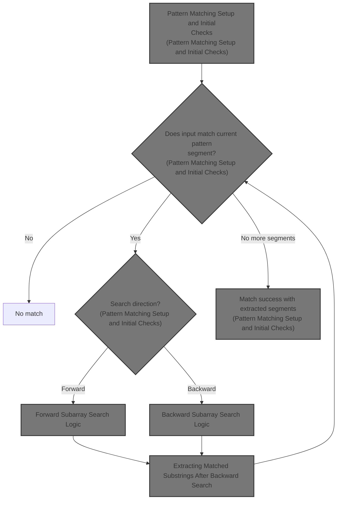
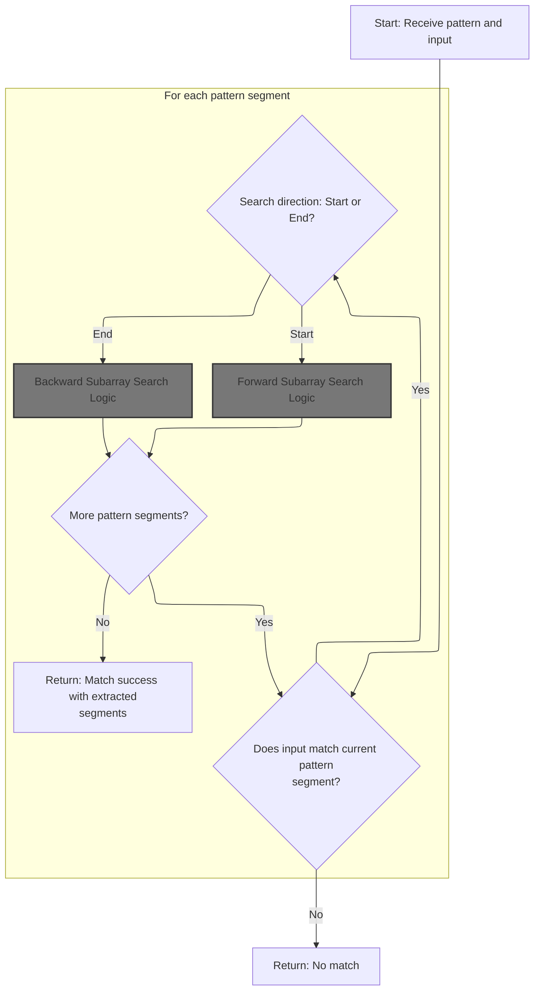
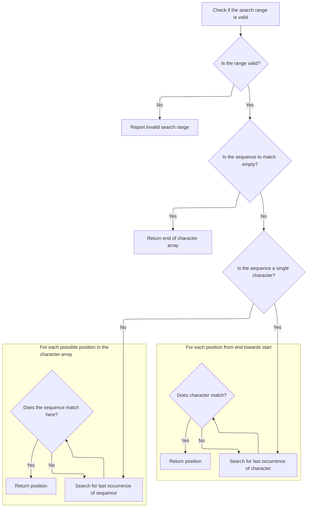
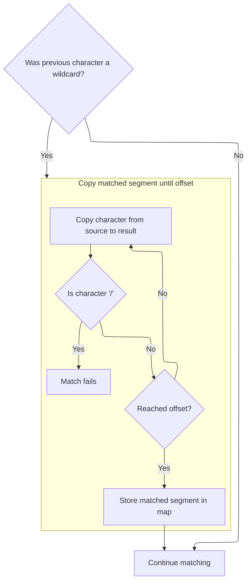

This document describes how pattern matching is used to determine if an input string fits a specified pattern, supporting wildcards and group extraction. The flow processes each pattern segment, searches the input string, and extracts matched segments for further use. The result indicates whether the input matches the pattern and provides the extracted segments.



# Pattern Matching Setup and Initial Checks



<SwmSnippet path="/core/src/main/java/org/apache/struts/util/WildcardHelper.java" line="159">

---

In <SwmToken path="core/src/main/java/org/apache/struts/util/WildcardHelper.java" pos="159:5:5" line-data="    public boolean match(Map map, String data, int[] expr) {">`match`</SwmToken>, we check for nulls and prep the buffers. The map gets the full input string under key '0' so you can always reference it. If the expr starts with <SwmToken path="core/src/main/java/org/apache/struts/util/WildcardHelper.java" pos="193:9:9" line-data="        // First check for MATCH_BEGIN">`MATCH_BEGIN`</SwmToken>, we anchor the match at the start. The expr array is parsed for MATCH\_\* tokens, which drive the custom matching logic and group extraction. Assumes expr is a valid pattern and map can store string keys for matched groups.

```java
    public boolean match(Map map, String data, int[] expr) {
        if (map == null) {
            throw new NullPointerException("No map provided");
        }

        if (data == null) {
            throw new NullPointerException("No data provided");
        }

        if (expr == null) {
            throw new NullPointerException("No pattern expression provided");
        }

        char[] buff = data.toCharArray();

        // Allocate the result buffer
        char[] rslt = new char[expr.length + buff.length];

        // The previous and current position of the expression character
        // (MATCH_*)
        int charpos = 0;

        // The position in the expression, input, translation and result arrays
        int exprpos = 0;
        int buffpos = 0;
        int rsltpos = 0;
        int offset = -1;

        // The matching count
        int mcount = 0;

        // We want the complete data be in {0}
        map.put(Integer.toString(mcount), data);

        // First check for MATCH_BEGIN
        boolean matchBegin = false;

        if (expr[charpos] == MATCH_BEGIN) {
            matchBegin = true;
            exprpos = ++charpos;
        }

        // Search the fist expression character (except MATCH_BEGIN - already
        // skipped)
        while (expr[charpos] >= 0) {
            charpos++;
        }
```

---

</SwmSnippet>

<SwmSnippet path="/core/src/main/java/org/apache/struts/util/WildcardHelper.java" line="207">

---

After prepping, we loop through expr to find the next MATCH\_\* token. We match the substring before the token, update positions, and check for <SwmToken path="core/src/main/java/org/apache/struts/util/WildcardHelper.java" pos="240:8:8" line-data="            if (exprchr == MATCH_END) {">`MATCH_END`</SwmToken> or <SwmToken path="core/src/main/java/org/apache/struts/util/WildcardHelper.java" pos="248:12:12" line-data="            } else if (exprchr == MATCH_THEEND) {">`MATCH_THEEND`</SwmToken> to finish the match and store any final group in the map. If not, we keep parsing for more pattern segments.

```java
        // The expression charater (MATCH_*)
        int exprchr = expr[charpos];

        while (true) {
            // Check if the data in the expression array before the current
            // expression character matches the data in the input buffer
            if (matchBegin) {
                if (!matchArray(expr, exprpos, charpos, buff, buffpos)) {
                    return (false);
                }

                matchBegin = false;
            } else {
                offset = indexOfArray(expr, exprpos, charpos, buff, buffpos);

                if (offset < 0) {
                    return (false);
                }
            }

            // Check for MATCH_BEGIN
            if (matchBegin) {
                if (offset != 0) {
                    return (false);
                }

                matchBegin = false;
            }

            // Advance buffpos
            buffpos += (charpos - exprpos);

            // Check for END's
            if (exprchr == MATCH_END) {
                if (rsltpos > 0) {
                    map.put(Integer.toString(++mcount),
                        new String(rslt, 0, rsltpos));
                }

                // Don't care about rest of input buffer
                return (true);
            } else if (exprchr == MATCH_THEEND) {
                if (rsltpos > 0) {
                    map.put(Integer.toString(++mcount),
                        new String(rslt, 0, rsltpos));
                }

                // Check that we reach buffer's end
                return (buffpos == buff.length);
            }

            // Search the next expression character
            exprpos = ++charpos;

            while (expr[charpos] >= 0) {
                charpos++;
            }
```

---

</SwmSnippet>

<SwmSnippet path="/core/src/main/java/org/apache/struts/util/WildcardHelper.java" line="265">

---

Here we decide whether to use <SwmToken path="core/src/main/java/org/apache/struts/util/WildcardHelper.java" pos="272:3:3" line-data="                ? indexOfArray(expr, exprpos, charpos, buff, buffpos)">`indexOfArray`</SwmToken> or <SwmToken path="core/src/main/java/org/apache/struts/util/WildcardHelper.java" pos="273:3:3" line-data="                : lastIndexOfArray(expr, exprpos, charpos, buff, buffpos);">`lastIndexOfArray`</SwmToken> based on the previous MATCH\_\* token. For <SwmToken path="core/src/main/java/org/apache/struts/util/WildcardHelper.java" pos="271:6:6" line-data="                (prevchr == MATCH_FILE)">`MATCH_FILE`</SwmToken>, we need the next occurrence, so we call <SwmToken path="core/src/main/java/org/apache/struts/util/WildcardHelper.java" pos="272:3:3" line-data="                ? indexOfArray(expr, exprpos, charpos, buff, buffpos)">`indexOfArray`</SwmToken> to find where the pattern segment matches in the input.

```java
            int prevchr = exprchr;

            exprchr = expr[charpos];

            // We have here prevchr == * or **.
            offset =
                (prevchr == MATCH_FILE)
                ? indexOfArray(expr, exprpos, charpos, buff, buffpos)
```

---

</SwmSnippet>

## Forward Subarray Search Logic

```mermaid
%%{init: {"flowchart": {"defaultRenderer": "elk"}} }%%
flowchart TD
    node1["Start: Search for a sequence in the
array"] --> node2{"Is the search range valid?"}
    click node1 openCode "core/src/main/java/org/apache/struts/util/WildcardHelper.java:316:318"
    click node2 openCode "core/src/main/java/org/apache/struts/util/WildcardHelper.java:319:321"
    node2 -->|"No"| node3["Stop: Invalid search range"]
    click node3 openCode "core/src/main/java/org/apache/struts/util/WildcardHelper.java:320:321"
    node2 -->|"Yes"| node4{"Is the sequence to find empty?"}
    click node4 openCode "core/src/main/java/org/apache/struts/util/WildcardHelper.java:324:325"
    node4 -->|"Yes"| node5["Return: No sequence to find, report end
of array"]
    click node5 openCode "core/src/main/java/org/apache/struts/util/WildcardHelper.java:325:326"
    node4 -->|"No"| node6{"Is the sequence a single character?"}
    click node6 openCode "core/src/main/java/org/apache/struts/util/WildcardHelper.java:329:330"
    node6 -->|"Yes"| loop1
    node6 -->|"No"| loop2

    subgraph loop1["Loop: For each character in the array
from current position"]
      node7["Does character match the one to find?"]
      click node7 openCode "core/src/main/java/org/apache/struts/util/WildcardHelper.java:331:334"
      node7 -->|"Yes"| node8["Return position of match"]
      click node8 openCode "core/src/main/java/org/apache/struts/util/WildcardHelper.java:333:334"
      node7 -->|"No"| node12["Continue searching"]
      click node12 openCode "core/src/main/java/org/apache/struts/util/WildcardHelper.java:335:335"
      node12 --> node7
    end
    loop1 --> node11["Return: Sequence not found"]
    click node11 openCode "core/src/main/java/org/apache/struts/util/WildcardHelper.java:358:358"

    subgraph loop2["Loop: For each possible position in the
array"]
      node9["Does the sequence match at this
position?"]
      click node9 openCode "core/src/main/java/org/apache/struts/util/WildcardHelper.java:340:354"
      node9 -->|"Yes"| node10["Return position of match"]
      click node10 openCode "core/src/main/java/org/apache/struts/util/WildcardHelper.java:348:349"
      node9 -->|"No"| node13["Continue searching"]
      click node13 openCode "core/src/main/java/org/apache/struts/util/WildcardHelper.java:357:358"
      node13 --> node9
    end
    loop2 --> node11
    node5 --> node11
    node3 --> node11

classDef HeadingStyle fill:#777777,stroke:#333,stroke-width:2px;

%% Swimm:
%% %%{init: {"flowchart": {"defaultRenderer": "elk"}} }%%
%% flowchart TD
%%     node1["Start: Search for a sequence in the
%% array"] --> node2{"Is the search range valid?"}
%%     click node1 openCode "<SwmPath>[core/…/util/WildcardHelper.java](core/src/main/java/org/apache/struts/util/WildcardHelper.java)</SwmPath>:316:318"
%%     click node2 openCode "<SwmPath>[core/…/util/WildcardHelper.java](core/src/main/java/org/apache/struts/util/WildcardHelper.java)</SwmPath>:319:321"
%%     node2 -->|"No"| node3["Stop: Invalid search range"]
%%     click node3 openCode "<SwmPath>[core/…/util/WildcardHelper.java](core/src/main/java/org/apache/struts/util/WildcardHelper.java)</SwmPath>:320:321"
%%     node2 -->|"Yes"| node4{"Is the sequence to find empty?"}
%%     click node4 openCode "<SwmPath>[core/…/util/WildcardHelper.java](core/src/main/java/org/apache/struts/util/WildcardHelper.java)</SwmPath>:324:325"
%%     node4 -->|"Yes"| node5["Return: No sequence to find, report end
%% of array"]
%%     click node5 openCode "<SwmPath>[core/…/util/WildcardHelper.java](core/src/main/java/org/apache/struts/util/WildcardHelper.java)</SwmPath>:325:326"
%%     node4 -->|"No"| node6{"Is the sequence a single character?"}
%%     click node6 openCode "<SwmPath>[core/…/util/WildcardHelper.java](core/src/main/java/org/apache/struts/util/WildcardHelper.java)</SwmPath>:329:330"
%%     node6 -->|"Yes"| loop1
%%     node6 -->|"No"| loop2
%% 
%%     subgraph loop1["Loop: For each character in the array
%% from current position"]
%%       node7["Does character match the one to find?"]
%%       click node7 openCode "<SwmPath>[core/…/util/WildcardHelper.java](core/src/main/java/org/apache/struts/util/WildcardHelper.java)</SwmPath>:331:334"
%%       node7 -->|"Yes"| node8["Return position of match"]
%%       click node8 openCode "<SwmPath>[core/…/util/WildcardHelper.java](core/src/main/java/org/apache/struts/util/WildcardHelper.java)</SwmPath>:333:334"
%%       node7 -->|"No"| node12["Continue searching"]
%%       click node12 openCode "<SwmPath>[core/…/util/WildcardHelper.java](core/src/main/java/org/apache/struts/util/WildcardHelper.java)</SwmPath>:335:335"
%%       node12 --> node7
%%     end
%%     loop1 --> node11["Return: Sequence not found"]
%%     click node11 openCode "<SwmPath>[core/…/util/WildcardHelper.java](core/src/main/java/org/apache/struts/util/WildcardHelper.java)</SwmPath>:358:358"
%% 
%%     subgraph loop2["Loop: For each possible position in the
%% array"]
%%       node9["Does the sequence match at this
%% position?"]
%%       click node9 openCode "<SwmPath>[core/…/util/WildcardHelper.java](core/src/main/java/org/apache/struts/util/WildcardHelper.java)</SwmPath>:340:354"
%%       node9 -->|"Yes"| node10["Return position of match"]
%%       click node10 openCode "<SwmPath>[core/…/util/WildcardHelper.java](core/src/main/java/org/apache/struts/util/WildcardHelper.java)</SwmPath>:348:349"
%%       node9 -->|"No"| node13["Continue searching"]
%%       click node13 openCode "<SwmPath>[core/…/util/WildcardHelper.java](core/src/main/java/org/apache/struts/util/WildcardHelper.java)</SwmPath>:357:358"
%%       node13 --> node9
%%     end
%%     loop2 --> node11
%%     node5 --> node11
%%     node3 --> node11
%% 
%% classDef HeadingStyle fill:#777777,stroke:#333,stroke-width:2px;
```



<SwmSnippet path="/core/src/main/java/org/apache/struts/util/WildcardHelper.java" line="316">

---

In <SwmToken path="core/src/main/java/org/apache/struts/util/WildcardHelper.java" pos="316:5:5" line-data="    protected int indexOfArray(int[] r, int rpos, int rend, char[] d,">`indexOfArray`</SwmToken>, we handle edge cases: zero-length subarrays return <SwmToken path="core/src/main/java/org/apache/struts/util/WildcardHelper.java" pos="325:4:6" line-data="            return (d.length); //?? dpos?">`d.length`</SwmToken>, and single-character searches are optimized with a simple loop. Assumes valid input ranges and non-null arrays.

```java
    protected int indexOfArray(int[] r, int rpos, int rend, char[] d,
        int dpos) {
        // Check if pos and len are legal
        if (rend < rpos) {
            throw new IllegalArgumentException("rend < rpos");
        }

        // If we need to match a zero length string return current dpos
        if (rend == rpos) {
            return (d.length); //?? dpos?
        }

        // If we need to match a 1 char length string do it simply
        if ((rend - rpos) == 1) {
            // Search for the specified character
            for (int x = dpos; x < d.length; x++) {
                if (r[rpos] == d[x]) {
                    return (x);
                }
            }
```

---

</SwmSnippet>

<SwmSnippet path="/core/src/main/java/org/apache/struts/util/WildcardHelper.java" line="338">

---

The main loop brute-forces the search for the subarray in the input, checking each position for a match. If it finds a match, it returns the start index; otherwise, it returns -1.

```java
        // Main string matching loop. It gets executed if the characters to
        // match are less then the characters left in the d buffer
        while (((dpos + rend) - rpos) <= d.length) {
            // Set current startpoint in d
            int y = dpos;

            // Check every character in d for equity. If the string is matched
            // return dpos
            for (int x = rpos; x <= rend; x++) {
                if (x == rend) {
                    return (dpos);
                }

                if (r[x] != d[y++]) {
                    break;
                }
            }

            // Increase dpos to search for the same string at next offset
            dpos++;
        }
```

---

</SwmSnippet>

## Handling Next Pattern Segment After Forward Search

<SwmSnippet path="/core/src/main/java/org/apache/struts/util/WildcardHelper.java" line="273">

---

Back in WildcardHelper.match, after getting the offset from <SwmToken path="core/src/main/java/org/apache/struts/util/WildcardHelper.java" pos="220:5:5" line-data="                offset = indexOfArray(expr, exprpos, charpos, buff, buffpos);">`indexOfArray`</SwmToken>, we check if it's valid. If not, we bail out. For certain tokens, we need the last occurrence, so we call <SwmToken path="core/src/main/java/org/apache/struts/util/WildcardHelper.java" pos="273:3:3" line-data="                : lastIndexOfArray(expr, exprpos, charpos, buff, buffpos);">`lastIndexOfArray`</SwmToken> next to handle those cases.

```java
                : lastIndexOfArray(expr, exprpos, charpos, buff, buffpos);

            if (offset < 0) {
                return (false);
            }

```

---

</SwmSnippet>

## Backward Subarray Search Logic



<SwmSnippet path="/core/src/main/java/org/apache/struts/util/WildcardHelper.java" line="380">

---

In <SwmToken path="core/src/main/java/org/apache/struts/util/WildcardHelper.java" pos="380:5:5" line-data="    protected int lastIndexOfArray(int[] r, int rpos, int rend, char[] d,">`lastIndexOfArray`</SwmToken>, we handle zero-length and single-character cases like before, but the main loop searches backwards for the last occurrence of the subarray. Assumes int and char arrays can be compared directly.

```java
    protected int lastIndexOfArray(int[] r, int rpos, int rend, char[] d,
        int dpos) {
        // Check if pos and len are legal
        if (rend < rpos) {
            throw new IllegalArgumentException("rend < rpos");
        }

        // If we need to match a zero length string return current dpos
        if (rend == rpos) {
            return (d.length); //?? dpos?
        }

        // If we need to match a 1 char length string do it simply
        if ((rend - rpos) == 1) {
            // Search for the specified character
            for (int x = d.length - 1; x > dpos; x--) {
                if (r[rpos] == d[x]) {
                    return (x);
                }
            }
```

---

</SwmSnippet>

<SwmSnippet path="/core/src/main/java/org/apache/struts/util/WildcardHelper.java" line="402">

---

The backward search checks each possible start position for a match, comparing int and char values directly. If a match is found, it returns the index; otherwise, it returns -1.

```java
        // Main string matching loop. It gets executed if the characters to
        // match are less then the characters left in the d buffer
        int l = d.length - (rend - rpos);

        while (l >= dpos) {
            // Set current startpoint in d
            int y = l;

            // Check every character in d for equity. If the string is matched
            // return dpos
            for (int x = rpos; x <= rend; x++) {
                if (x == rend) {
                    return (l);
                }

                if (r[x] != d[y++]) {
                    break;
                }
            }

            // Decrease l to search for the same string at next offset
            l--;
        }
```

---

</SwmSnippet>

## Extracting Matched Substrings After Backward Search



<SwmSnippet path="/core/src/main/java/org/apache/struts/util/WildcardHelper.java" line="279">

---

After <SwmToken path="core/src/main/java/org/apache/struts/util/WildcardHelper.java" pos="273:3:3" line-data="                : lastIndexOfArray(expr, exprpos, charpos, buff, buffpos);">`lastIndexOfArray`</SwmToken> returns, we copy the matched substring from the input buffer into the result buffer, so we can store it as a group in the map for later retrieval.

```java
            // Copy the data from the source buffer into the result buffer
            // to substitute the expression character
            if (prevchr == MATCH_PATH) {
                while (buffpos < offset) {
                    rslt[rsltpos++] = buff[buffpos++];
                }
```

---

</SwmSnippet>

<SwmSnippet path="/core/src/main/java/org/apache/struts/util/WildcardHelper.java" line="286">

---

For <SwmToken path="core/src/main/java/org/apache/struts/util/WildcardHelper.java" pos="271:6:6" line-data="                (prevchr == MATCH_FILE)">`MATCH_FILE`</SwmToken>, we copy characters up to offset unless we hit a '/', which means the match is invalid and we return false. This keeps file segment matching strict.

```java
                // Matching file, don't copy '/'
                while (buffpos < offset) {
                    if (buff[buffpos] == '/') {
                        return (false);
                    }

                    rslt[rsltpos++] = buff[buffpos++];
                }
```

---

</SwmSnippet>

<SwmSnippet path="/core/src/main/java/org/apache/struts/util/WildcardHelper.java" line="296">

---

After matching, the map contains the full input and all matched substrings under numbered keys. The function returns true if the pattern matches, false otherwise. Uses MATCH\_\* constants to drive the matching logic and group extraction.

```java
            map.put(Integer.toString(++mcount), new String(rslt, 0, rsltpos));
            rsltpos = 0;
        }
    }
```

---

</SwmSnippet>

&nbsp;

*This is an auto-generated document by Swimm 🌊 and has not yet been verified by a human*

<SwmMeta version="3.0.0" repo-id="Z2l0aHViJTNBJTNBc3RydXRzMSUzQSUzQVN3aW1tLURlbW8=" repo-name="struts1"><sup>Powered by [Swimm](https://app.swimm.io/)</sup></SwmMeta>
