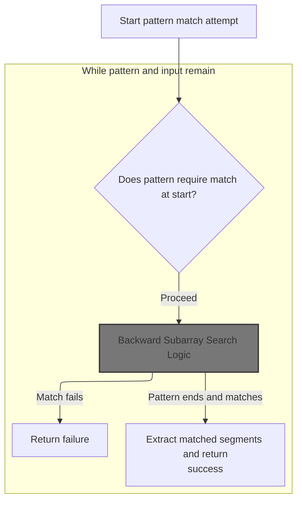

This document describes how pattern matching is performed to determine if an input string fits a specified pattern, supporting wildcards and segment extraction. Pattern matching enables flexible routing, filtering, or resource identification by comparing input strings to patterns. The flow receives a pattern and an input string, and outputs whether the input matches the pattern, along with any matched segments.

# Pattern Matching Setup and Token Handling



<SwmSnippet path="/core/src/main/java/org/apache/struts/util/WildcardHelper.java" line="159">

---

In <SwmToken path="core/src/main/java/org/apache/struts/util/WildcardHelper.java" pos="159:5:5" line-data="    public boolean match(Map map, String data, int[] expr) {">`match`</SwmToken>, we're setting up the matching state, handling null checks, and prepping buffers. The function checks for a <SwmToken path="core/src/main/java/org/apache/struts/util/WildcardHelper.java" pos="193:9:9" line-data="        // First check for MATCH_BEGIN">`MATCH_BEGIN`</SwmToken> token to anchor the match at the start, then iterates through the pattern expression, looking for special MATCH\_\* tokens. It also initializes the map to store matched substrings, with key '0' always holding the full input string. This section sets up the main loop and the rules for how the rest of the matching will proceed.

```java
    public boolean match(Map map, String data, int[] expr) {
        if (map == null) {
            throw new NullPointerException("No map provided");
        }

        if (data == null) {
            throw new NullPointerException("No data provided");
        }

        if (expr == null) {
            throw new NullPointerException("No pattern expression provided");
        }

        char[] buff = data.toCharArray();

        // Allocate the result buffer
        char[] rslt = new char[expr.length + buff.length];

        // The previous and current position of the expression character
        // (MATCH_*)
        int charpos = 0;

        // The position in the expression, input, translation and result arrays
        int exprpos = 0;
        int buffpos = 0;
        int rsltpos = 0;
        int offset = -1;

        // The matching count
        int mcount = 0;

        // We want the complete data be in {0}
        map.put(Integer.toString(mcount), data);

        // First check for MATCH_BEGIN
        boolean matchBegin = false;

        if (expr[charpos] == MATCH_BEGIN) {
            matchBegin = true;
            exprpos = ++charpos;
        }

        // Search the fist expression character (except MATCH_BEGIN - already
        // skipped)
        while (expr[charpos] >= 0) {
            charpos++;
        }
```

---

</SwmSnippet>

<SwmSnippet path="/core/src/main/java/org/apache/struts/util/WildcardHelper.java" line="207">

---

Here we're advancing through the pattern, checking if the current segment matches the input data. If we're anchored (<SwmToken path="core/src/main/java/org/apache/struts/util/WildcardHelper.java" pos="227:7:7" line-data="            // Check for MATCH_BEGIN">`MATCH_BEGIN`</SwmToken>), we require an exact match at the current position; otherwise, we search for the next occurrence. This block also handles early returns if the match fails, and checks for end tokens to decide if we're done.

```java
        // The expression charater (MATCH_*)
        int exprchr = expr[charpos];

        while (true) {
            // Check if the data in the expression array before the current
            // expression character matches the data in the input buffer
            if (matchBegin) {
                if (!matchArray(expr, exprpos, charpos, buff, buffpos)) {
                    return (false);
                }

                matchBegin = false;
            } else {
                offset = indexOfArray(expr, exprpos, charpos, buff, buffpos);

                if (offset < 0) {
                    return (false);
                }
            }

            // Check for MATCH_BEGIN
            if (matchBegin) {
                if (offset != 0) {
                    return (false);
                }

                matchBegin = false;
            }

            // Advance buffpos
            buffpos += (charpos - exprpos);

            // Check for END's
            if (exprchr == MATCH_END) {
                if (rsltpos > 0) {
                    map.put(Integer.toString(++mcount),
                        new String(rslt, 0, rsltpos));
                }

                // Don't care about rest of input buffer
                return (true);
            } else if (exprchr == MATCH_THEEND) {
                if (rsltpos > 0) {
                    map.put(Integer.toString(++mcount),
                        new String(rslt, 0, rsltpos));
                }

                // Check that we reach buffer's end
                return (buffpos == buff.length);
            }

            // Search the next expression character
            exprpos = ++charpos;

            while (expr[charpos] >= 0) {
                charpos++;
            }
```

---

</SwmSnippet>

<SwmSnippet path="/core/src/main/java/org/apache/struts/util/WildcardHelper.java" line="265">

---

Next we decide whether to search forward or backward for the next matching segment in the input, based on the previous token. We call <SwmToken path="core/src/main/java/org/apache/struts/util/WildcardHelper.java" pos="272:3:3" line-data="                ? indexOfArray(expr, exprpos, charpos, buff, buffpos)">`indexOfArray`</SwmToken> if we're matching a file segment, which helps us find where the next literal part of the pattern appears in the input.

```java
            int prevchr = exprchr;

            exprchr = expr[charpos];

            // We have here prevchr == * or **.
            offset =
                (prevchr == MATCH_FILE)
                ? indexOfArray(expr, exprpos, charpos, buff, buffpos)
```

---

</SwmSnippet>

## Forward Subarray Search Logic

```mermaid
%%{init: {"flowchart": {"defaultRenderer": "elk"}} }%%
flowchart TD
  node1["Start: Search for sequence in character
array (from rpos to rend in d starting
at dpos)"] --> node2{"Is search range valid?"}
  click node1 openCode "core/src/main/java/org/apache/struts/util/WildcardHelper.java:316:319"
  node2 -->|"No"| node3["Error: Invalid search range"]
  click node2 openCode "core/src/main/java/org/apache/struts/util/WildcardHelper.java:319:321"
  node2 -->|"Yes"| node4{"Is sequence empty?"}
  click node3 openCode "core/src/main/java/org/apache/struts/util/WildcardHelper.java:319:321"
  node4 -->|"Yes"| node5["Return end of character array"]
  click node4 openCode "core/src/main/java/org/apache/struts/util/WildcardHelper.java:324:326"
  node4 -->|"No"| node6{"Is sequence a single character?"}
  click node6 openCode "core/src/main/java/org/apache/struts/util/WildcardHelper.java:329:335"
  node6 -->|"Yes"| node7["Find character in array"]
  node7 -->|"Found"| node8["Return position"]
  click node7 openCode "core/src/main/java/org/apache/struts/util/WildcardHelper.java:331:334"
  node7 -->|"Not found"| node12["Return not found"]
  click node12 openCode "core/src/main/java/org/apache/struts/util/WildcardHelper.java:335:335"
  node6 -->|"No"| loop1
  
  subgraph loop1["Loop: Try to match sequence at each
position in d"]
    node9["Does sequence match at current position?"]
    click node9 openCode "core/src/main/java/org/apache/struts/util/WildcardHelper.java:340:354"
    node9 -->|"Yes"| node10["Return current position"]
    click node10 openCode "core/src/main/java/org/apache/struts/util/WildcardHelper.java:348:349"
    node9 -->|"No"| node11["Move to next position"]
    click node11 openCode "core/src/main/java/org/apache/struts/util/WildcardHelper.java:357:358"
    node11 --> node9
  end
  loop1 --> node12["Return not found"]
  click node12 openCode "core/src/main/java/org/apache/struts/util/WildcardHelper.java:358:358"
classDef HeadingStyle fill:#777777,stroke:#333,stroke-width:2px;

%% Swimm:
%% %%{init: {"flowchart": {"defaultRenderer": "elk"}} }%%
%% flowchart TD
%%   node1["Start: Search for sequence in character
%% array (from rpos to rend in d starting
%% at dpos)"] --> node2{"Is search range valid?"}
%%   click node1 openCode "<SwmPath>[core/…/util/WildcardHelper.java](core/src/main/java/org/apache/struts/util/WildcardHelper.java)</SwmPath>:316:319"
%%   node2 -->|"No"| node3["Error: Invalid search range"]
%%   click node2 openCode "<SwmPath>[core/…/util/WildcardHelper.java](core/src/main/java/org/apache/struts/util/WildcardHelper.java)</SwmPath>:319:321"
%%   node2 -->|"Yes"| node4{"Is sequence empty?"}
%%   click node3 openCode "<SwmPath>[core/…/util/WildcardHelper.java](core/src/main/java/org/apache/struts/util/WildcardHelper.java)</SwmPath>:319:321"
%%   node4 -->|"Yes"| node5["Return end of character array"]
%%   click node4 openCode "<SwmPath>[core/…/util/WildcardHelper.java](core/src/main/java/org/apache/struts/util/WildcardHelper.java)</SwmPath>:324:326"
%%   node4 -->|"No"| node6{"Is sequence a single character?"}
%%   click node6 openCode "<SwmPath>[core/…/util/WildcardHelper.java](core/src/main/java/org/apache/struts/util/WildcardHelper.java)</SwmPath>:329:335"
%%   node6 -->|"Yes"| node7["Find character in array"]
%%   node7 -->|"Found"| node8["Return position"]
%%   click node7 openCode "<SwmPath>[core/…/util/WildcardHelper.java](core/src/main/java/org/apache/struts/util/WildcardHelper.java)</SwmPath>:331:334"
%%   node7 -->|"Not found"| node12["Return not found"]
%%   click node12 openCode "<SwmPath>[core/…/util/WildcardHelper.java](core/src/main/java/org/apache/struts/util/WildcardHelper.java)</SwmPath>:335:335"
%%   node6 -->|"No"| loop1
%%   
%%   subgraph loop1["Loop: Try to match sequence at each
%% position in d"]
%%     node9["Does sequence match at current position?"]
%%     click node9 openCode "<SwmPath>[core/…/util/WildcardHelper.java](core/src/main/java/org/apache/struts/util/WildcardHelper.java)</SwmPath>:340:354"
%%     node9 -->|"Yes"| node10["Return current position"]
%%     click node10 openCode "<SwmPath>[core/…/util/WildcardHelper.java](core/src/main/java/org/apache/struts/util/WildcardHelper.java)</SwmPath>:348:349"
%%     node9 -->|"No"| node11["Move to next position"]
%%     click node11 openCode "<SwmPath>[core/…/util/WildcardHelper.java](core/src/main/java/org/apache/struts/util/WildcardHelper.java)</SwmPath>:357:358"
%%     node11 --> node9
%%   end
%%   loop1 --> node12["Return not found"]
%%   click node12 openCode "<SwmPath>[core/…/util/WildcardHelper.java](core/src/main/java/org/apache/struts/util/WildcardHelper.java)</SwmPath>:358:358"
%% classDef HeadingStyle fill:#777777,stroke:#333,stroke-width:2px;
```



<SwmSnippet path="/core/src/main/java/org/apache/struts/util/WildcardHelper.java" line="316">

---

In <SwmToken path="core/src/main/java/org/apache/struts/util/WildcardHelper.java" pos="316:5:5" line-data="    protected int indexOfArray(int[] r, int rpos, int rend, char[] d,">`indexOfArray`</SwmToken>, we're searching for the first occurrence of a pattern segment (as an int array) in the input data (as a char array). The function handles edge cases like zero-length matches and single-character matches, and assumes the input arrays and indices are valid.

```java
    protected int indexOfArray(int[] r, int rpos, int rend, char[] d,
        int dpos) {
        // Check if pos and len are legal
        if (rend < rpos) {
            throw new IllegalArgumentException("rend < rpos");
        }

        // If we need to match a zero length string return current dpos
        if (rend == rpos) {
            return (d.length); //?? dpos?
        }

        // If we need to match a 1 char length string do it simply
        if ((rend - rpos) == 1) {
            // Search for the specified character
            for (int x = dpos; x < d.length; x++) {
                if (r[rpos] == d[x]) {
                    return (x);
                }
            }
```

---

</SwmSnippet>

<SwmSnippet path="/core/src/main/java/org/apache/struts/util/WildcardHelper.java" line="338">

---

Here we brute-force search for the pattern segment in the input. For each possible position, we compare the segment to the input substring. If we find a match, we return the index; if not, we return -1.

```java
        // Main string matching loop. It gets executed if the characters to
        // match are less then the characters left in the d buffer
        while (((dpos + rend) - rpos) <= d.length) {
            // Set current startpoint in d
            int y = dpos;

            // Check every character in d for equity. If the string is matched
            // return dpos
            for (int x = rpos; x <= rend; x++) {
                if (x == rend) {
                    return (dpos);
                }

                if (r[x] != d[y++]) {
                    break;
                }
            }

            // Increase dpos to search for the same string at next offset
            dpos++;
        }
```

---

</SwmSnippet>

## Handling Backward Search and Segment Extraction

<SwmSnippet path="/core/src/main/java/org/apache/struts/util/WildcardHelper.java" line="273">

---

Back in `WildcardHelper.match`, after getting the offset from <SwmToken path="core/src/main/java/org/apache/struts/util/WildcardHelper.java" pos="220:5:5" line-data="                offset = indexOfArray(expr, exprpos, charpos, buff, buffpos);">`indexOfArray`</SwmToken>, we might need to switch to <SwmToken path="core/src/main/java/org/apache/struts/util/WildcardHelper.java" pos="273:3:3" line-data="                : lastIndexOfArray(expr, exprpos, charpos, buff, buffpos);">`lastIndexOfArray`</SwmToken> for tokens that require greedy matching. This lets us find the last occurrence of a segment, which is needed for some wildcard patterns. If no match is found, we bail out early.

```java
                : lastIndexOfArray(expr, exprpos, charpos, buff, buffpos);

            if (offset < 0) {
                return (false);
            }

```

---

</SwmSnippet>

## Backward Subarray Search Logic

```mermaid
%%{init: {"flowchart": {"defaultRenderer": "elk"}} }%%
flowchart TD
  node1["Start: Check if search range is valid"]
  click node1 openCode "core/src/main/java/org/apache/struts/util/WildcardHelper.java:383:385"
  node1 --> node2{"Is search range valid?"}
  click node2 openCode "core/src/main/java/org/apache/struts/util/WildcardHelper.java:383:385"
  node2 -->|"No"| node3["Stop: Invalid search range"]
  click node3 openCode "core/src/main/java/org/apache/struts/util/WildcardHelper.java:384:385"
  node2 -->|"Yes"| node4{"Is sequence empty?"}
  click node4 openCode "core/src/main/java/org/apache/struts/util/WildcardHelper.java:388:390"
  node4 -->|"Yes"| node5["Return end of character array"]
  click node5 openCode "core/src/main/java/org/apache/struts/util/WildcardHelper.java:389:390"
  node4 -->|"No"| node6{"Is sequence length 1?"}
  click node6 openCode "core/src/main/java/org/apache/struts/util/WildcardHelper.java:393:399"
  node6 -->|"Yes"| node7["Search for last occurrence of character
in array"]
  click node7 openCode "core/src/main/java/org/apache/struts/util/WildcardHelper.java:395:398"
  node7 --> node12["Return position or not found"]
  click node12 openCode "core/src/main/java/org/apache/struts/util/WildcardHelper.java:399:399"
  node6 -->|"No"| node8["Search for last occurrence of sequence
in array"]
  click node8 openCode "core/src/main/java/org/apache/struts/util/WildcardHelper.java:404:424"
  
  subgraph loop1["For each possible position in character
array (backwards)"]
    node8 --> node9{"Does sequence match at this position?"}
    click node9 openCode "core/src/main/java/org/apache/struts/util/WildcardHelper.java:410:419"
    node9 -->|"Yes"| node10["Return current position"]
    click node10 openCode "core/src/main/java/org/apache/struts/util/WildcardHelper.java:414:415"
    node9 -->|"No"| node13["Check next position"]
    click node13 openCode "core/src/main/java/org/apache/struts/util/WildcardHelper.java:423:424"
    node13 --> node9
  end
  node8 --> node11["Return not found"]
  click node11 openCode "core/src/main/java/org/apache/struts/util/WildcardHelper.java:424:424"

classDef HeadingStyle fill:#777777,stroke:#333,stroke-width:2px;

%% Swimm:
%% %%{init: {"flowchart": {"defaultRenderer": "elk"}} }%%
%% flowchart TD
%%   node1["Start: Check if search range is valid"]
%%   click node1 openCode "<SwmPath>[core/…/util/WildcardHelper.java](core/src/main/java/org/apache/struts/util/WildcardHelper.java)</SwmPath>:383:385"
%%   node1 --> node2{"Is search range valid?"}
%%   click node2 openCode "<SwmPath>[core/…/util/WildcardHelper.java](core/src/main/java/org/apache/struts/util/WildcardHelper.java)</SwmPath>:383:385"
%%   node2 -->|"No"| node3["Stop: Invalid search range"]
%%   click node3 openCode "<SwmPath>[core/…/util/WildcardHelper.java](core/src/main/java/org/apache/struts/util/WildcardHelper.java)</SwmPath>:384:385"
%%   node2 -->|"Yes"| node4{"Is sequence empty?"}
%%   click node4 openCode "<SwmPath>[core/…/util/WildcardHelper.java](core/src/main/java/org/apache/struts/util/WildcardHelper.java)</SwmPath>:388:390"
%%   node4 -->|"Yes"| node5["Return end of character array"]
%%   click node5 openCode "<SwmPath>[core/…/util/WildcardHelper.java](core/src/main/java/org/apache/struts/util/WildcardHelper.java)</SwmPath>:389:390"
%%   node4 -->|"No"| node6{"Is sequence length 1?"}
%%   click node6 openCode "<SwmPath>[core/…/util/WildcardHelper.java](core/src/main/java/org/apache/struts/util/WildcardHelper.java)</SwmPath>:393:399"
%%   node6 -->|"Yes"| node7["Search for last occurrence of character
%% in array"]
%%   click node7 openCode "<SwmPath>[core/…/util/WildcardHelper.java](core/src/main/java/org/apache/struts/util/WildcardHelper.java)</SwmPath>:395:398"
%%   node7 --> node12["Return position or not found"]
%%   click node12 openCode "<SwmPath>[core/…/util/WildcardHelper.java](core/src/main/java/org/apache/struts/util/WildcardHelper.java)</SwmPath>:399:399"
%%   node6 -->|"No"| node8["Search for last occurrence of sequence
%% in array"]
%%   click node8 openCode "<SwmPath>[core/…/util/WildcardHelper.java](core/src/main/java/org/apache/struts/util/WildcardHelper.java)</SwmPath>:404:424"
%%   
%%   subgraph loop1["For each possible position in character
%% array (backwards)"]
%%     node8 --> node9{"Does sequence match at this position?"}
%%     click node9 openCode "<SwmPath>[core/…/util/WildcardHelper.java](core/src/main/java/org/apache/struts/util/WildcardHelper.java)</SwmPath>:410:419"
%%     node9 -->|"Yes"| node10["Return current position"]
%%     click node10 openCode "<SwmPath>[core/…/util/WildcardHelper.java](core/src/main/java/org/apache/struts/util/WildcardHelper.java)</SwmPath>:414:415"
%%     node9 -->|"No"| node13["Check next position"]
%%     click node13 openCode "<SwmPath>[core/…/util/WildcardHelper.java](core/src/main/java/org/apache/struts/util/WildcardHelper.java)</SwmPath>:423:424"
%%     node13 --> node9
%%   end
%%   node8 --> node11["Return not found"]
%%   click node11 openCode "<SwmPath>[core/…/util/WildcardHelper.java](core/src/main/java/org/apache/struts/util/WildcardHelper.java)</SwmPath>:424:424"
%% 
%% classDef HeadingStyle fill:#777777,stroke:#333,stroke-width:2px;
```



<SwmSnippet path="/core/src/main/java/org/apache/struts/util/WildcardHelper.java" line="380">

---

In <SwmToken path="core/src/main/java/org/apache/struts/util/WildcardHelper.java" pos="380:5:5" line-data="    protected int lastIndexOfArray(int[] r, int rpos, int rend, char[] d,">`lastIndexOfArray`</SwmToken>, we're searching backward for the last occurrence of a pattern segment in the input. The function handles zero-length and single-character matches specially, and otherwise scans from the end, comparing the int array to the char array directly.

```java
    protected int lastIndexOfArray(int[] r, int rpos, int rend, char[] d,
        int dpos) {
        // Check if pos and len are legal
        if (rend < rpos) {
            throw new IllegalArgumentException("rend < rpos");
        }

        // If we need to match a zero length string return current dpos
        if (rend == rpos) {
            return (d.length); //?? dpos?
        }

        // If we need to match a 1 char length string do it simply
        if ((rend - rpos) == 1) {
            // Search for the specified character
            for (int x = d.length - 1; x > dpos; x--) {
                if (r[rpos] == d[x]) {
                    return (x);
                }
            }
```

---

</SwmSnippet>

<SwmSnippet path="/core/src/main/java/org/apache/struts/util/WildcardHelper.java" line="402">

---

Here we return the index of the last matching segment found in the input, or -1 if nothing matches. The comparison is done directly between int and char values.

```java
        // Main string matching loop. It gets executed if the characters to
        // match are less then the characters left in the d buffer
        int l = d.length - (rend - rpos);

        while (l >= dpos) {
            // Set current startpoint in d
            int y = l;

            // Check every character in d for equity. If the string is matched
            // return dpos
            for (int x = rpos; x <= rend; x++) {
                if (x == rend) {
                    return (l);
                }

                if (r[x] != d[y++]) {
                    break;
                }
            }

            // Decrease l to search for the same string at next offset
            l--;
        }
```

---

</SwmSnippet>

## Segment Extraction and Map Population

<SwmSnippet path="/core/src/main/java/org/apache/struts/util/WildcardHelper.java" line="279">

---

Back in `WildcardHelper.match`, after getting the offset from <SwmToken path="core/src/main/java/org/apache/struts/util/WildcardHelper.java" pos="273:3:3" line-data="                : lastIndexOfArray(expr, exprpos, charpos, buff, buffpos);">`lastIndexOfArray`</SwmToken>, we copy the matched segment into the result buffer. For <SwmToken path="core/src/main/java/org/apache/struts/util/WildcardHelper.java" pos="281:8:8" line-data="            if (prevchr == MATCH_PATH) {">`MATCH_PATH`</SwmToken>, we just copy everything up to the offset.

```java
            // Copy the data from the source buffer into the result buffer
            // to substitute the expression character
            if (prevchr == MATCH_PATH) {
                while (buffpos < offset) {
                    rslt[rsltpos++] = buff[buffpos++];
                }
```

---

</SwmSnippet>

<SwmSnippet path="/core/src/main/java/org/apache/struts/util/WildcardHelper.java" line="286">

---

Here we handle <SwmToken path="core/src/main/java/org/apache/struts/util/WildcardHelper.java" pos="271:6:6" line-data="                (prevchr == MATCH_FILE)">`MATCH_FILE`</SwmToken> by copying the segment only if it doesn't contain a '/'. If we hit a '/', we return false since file matches can't include path separators.

```java
                // Matching file, don't copy '/'
                while (buffpos < offset) {
                    if (buff[buffpos] == '/') {
                        return (false);
                    }

                    rslt[rsltpos++] = buff[buffpos++];
                }
```

---

</SwmSnippet>

<SwmSnippet path="/core/src/main/java/org/apache/struts/util/WildcardHelper.java" line="296">

---

Finally, if we reach the end and everything matches, we store the matched segment in the map and reset the result buffer. The function returns true if the pattern matches the data, with all matched segments available in the map.

```java
            map.put(Integer.toString(++mcount), new String(rslt, 0, rsltpos));
            rsltpos = 0;
        }
    }
```

---

</SwmSnippet>

&nbsp;

*This is an auto-generated document by Swimm 🌊 and has not yet been verified by a human*

<SwmMeta version="3.0.0" repo-id="Z2l0aHViJTNBJTNBc3RydXRzMSUzQSUzQVN3aW1tLURlbW8=" repo-name="struts1"><sup>Powered by [Swimm](https://app.swimm.io/)</sup></SwmMeta>
