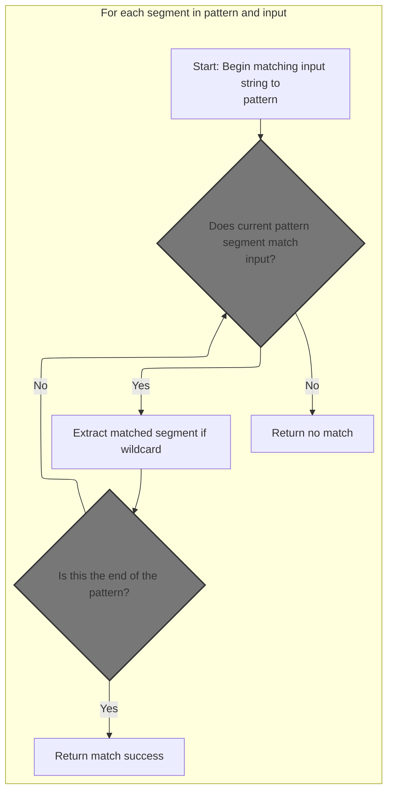
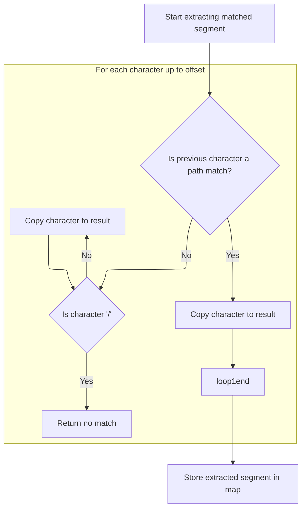

This document describes how pattern matching enables flexible string processing and extraction. The flow receives an input string and a pattern expression, searches for matches according to the pattern's rules, and extracts matched segments for further use. The process returns whether the input string matches the pattern and provides the matched segments.

# Pattern Matching Setup and Initial Checks



<SwmSnippet path="/core/src/main/java/org/apache/struts/util/WildcardHelper.java" line="159">

---

In <SwmToken path="core/src/main/java/org/apache/struts/util/WildcardHelper.java" pos="159:5:5" line-data="    public boolean match(Map map, String data, int[] expr) {">`match`</SwmToken>, we check for nulls and prep the buffers. The MATCH\_\* constants are used to mark special pattern positions (start, end, file, path). We store the whole input string in the map at key '0', then prep for matching segments. If the pattern starts with <SwmToken path="core/src/main/java/org/apache/struts/util/WildcardHelper.java" pos="193:9:9" line-data="        // First check for MATCH_BEGIN">`MATCH_BEGIN`</SwmToken>, we flag it and skip ahead. This sets up the main loop for segment matching.

```java
    public boolean match(Map map, String data, int[] expr) {
        if (map == null) {
            throw new NullPointerException("No map provided");
        }

        if (data == null) {
            throw new NullPointerException("No data provided");
        }

        if (expr == null) {
            throw new NullPointerException("No pattern expression provided");
        }

        char[] buff = data.toCharArray();

        // Allocate the result buffer
        char[] rslt = new char[expr.length + buff.length];

        // The previous and current position of the expression character
        // (MATCH_*)
        int charpos = 0;

        // The position in the expression, input, translation and result arrays
        int exprpos = 0;
        int buffpos = 0;
        int rsltpos = 0;
        int offset = -1;

        // The matching count
        int mcount = 0;

        // We want the complete data be in {0}
        map.put(Integer.toString(mcount), data);

        // First check for MATCH_BEGIN
        boolean matchBegin = false;

        if (expr[charpos] == MATCH_BEGIN) {
            matchBegin = true;
            exprpos = ++charpos;
        }

        // Search the fist expression character (except MATCH_BEGIN - already
        // skipped)
        while (expr[charpos] >= 0) {
            charpos++;
        }
```

---

</SwmSnippet>

<SwmSnippet path="/core/src/main/java/org/apache/struts/util/WildcardHelper.java" line="207">

---

After prepping for <SwmToken path="core/src/main/java/org/apache/struts/util/WildcardHelper.java" pos="227:7:7" line-data="            // Check for MATCH_BEGIN">`MATCH_BEGIN`</SwmToken>, we loop through the pattern to find the first MATCH\_\* token. This positions us at the next segment boundary, ready for the main matching logic.

```java
        // The expression charater (MATCH_*)
        int exprchr = expr[charpos];

        while (true) {
            // Check if the data in the expression array before the current
            // expression character matches the data in the input buffer
            if (matchBegin) {
                if (!matchArray(expr, exprpos, charpos, buff, buffpos)) {
                    return (false);
                }

                matchBegin = false;
            } else {
                offset = indexOfArray(expr, exprpos, charpos, buff, buffpos);

                if (offset < 0) {
                    return (false);
                }
            }

            // Check for MATCH_BEGIN
            if (matchBegin) {
                if (offset != 0) {
                    return (false);
                }

                matchBegin = false;
            }

            // Advance buffpos
            buffpos += (charpos - exprpos);

            // Check for END's
            if (exprchr == MATCH_END) {
                if (rsltpos > 0) {
                    map.put(Integer.toString(++mcount),
                        new String(rslt, 0, rsltpos));
                }

                // Don't care about rest of input buffer
                return (true);
            } else if (exprchr == MATCH_THEEND) {
                if (rsltpos > 0) {
                    map.put(Integer.toString(++mcount),
                        new String(rslt, 0, rsltpos));
                }

                // Check that we reach buffer's end
                return (buffpos == buff.length);
            }

            // Search the next expression character
            exprpos = ++charpos;

            while (expr[charpos] >= 0) {
                charpos++;
            }
```

---

</SwmSnippet>

<SwmSnippet path="/core/src/main/java/org/apache/struts/util/WildcardHelper.java" line="265">

---

Here we decide whether to search for the next segment using <SwmToken path="core/src/main/java/org/apache/struts/util/WildcardHelper.java" pos="272:3:3" line-data="                ? indexOfArray(expr, exprpos, charpos, buff, buffpos)">`indexOfArray`</SwmToken> or <SwmToken path="core/src/main/java/org/apache/struts/util/WildcardHelper.java" pos="273:3:3" line-data="                : lastIndexOfArray(expr, exprpos, charpos, buff, buffpos);">`lastIndexOfArray`</SwmToken>, based on the MATCH\_\* token. This lets us find the right position in the data buffer for the next pattern segment.

```java
            int prevchr = exprchr;

            exprchr = expr[charpos];

            // We have here prevchr == * or **.
            offset =
                (prevchr == MATCH_FILE)
                ? indexOfArray(expr, exprpos, charpos, buff, buffpos)
```

---

</SwmSnippet>

## Forward Segment Search Logic

```mermaid
%%{init: {"flowchart": {"defaultRenderer": "elk"}} }%%
flowchart TD
    node1["Start: Check if search range is valid
(rpos to rend)"] --> node2{"Is search range valid? (rend >= rpos)"}
    click node1 openCode "core/src/main/java/org/apache/struts/util/WildcardHelper.java:319:321"
    node2 -->|"No"| node3["Report invalid search range"]
    click node2 openCode "core/src/main/java/org/apache/struts/util/WildcardHelper.java:319:321"
    click node3 openCode "core/src/main/java/org/apache/struts/util/WildcardHelper.java:320:321"
    node2 -->|"Yes"| node4{"Is sequence to match empty? (rend ==
rpos)"}
    click node4 openCode "core/src/main/java/org/apache/struts/util/WildcardHelper.java:324:326"
    node4 -->|"Yes"| node5["Return end of character array (d.length)"]
    click node5 openCode "core/src/main/java/org/apache/struts/util/WildcardHelper.java:325:326"
    node4 -->|"No"| node6{"Is sequence length 1? (rend - rpos == 1)"}
    click node6 openCode "core/src/main/java/org/apache/struts/util/WildcardHelper.java:329:335"
    node6 -->|"Yes"| node7["Search for character in array (from
dpos)"]
    click node7 openCode "core/src/main/java/org/apache/struts/util/WildcardHelper.java:331:335"
    subgraph loop1["For each character in array from dpos"]
      node7 --> node8{"Is character found?"}
      click node8 openCode "core/src/main/java/org/apache/struts/util/WildcardHelper.java:332:333"
      node8 -->|"Yes"| node9["Return position where character found"]
      click node9 openCode "core/src/main/java/org/apache/struts/util/WildcardHelper.java:333:334"
      node8 -->|"No"| node13["Continue searching"]
      click node13 openCode "core/src/main/java/org/apache/struts/util/WildcardHelper.java:335:335"
      node13 --> node8
    end
    node6 -->|"No"| node10["Search for sequence in array (from dpos)"]
    click node10 openCode "core/src/main/java/org/apache/struts/util/WildcardHelper.java:340:358"
    subgraph loop2["For each possible starting position in
character array"]
      node10 --> node11{"Does sequence match at this position?"}
      click node11 openCode "core/src/main/java/org/apache/struts/util/WildcardHelper.java:344:353"
      node11 -->|"Yes"| node12["Return position where sequence starts"]
      click node12 openCode "core/src/main/java/org/apache/struts/util/WildcardHelper.java:348:349"
      node11 -->|"No"| node14["Move to next position"]
      click node14 openCode "core/src/main/java/org/apache/struts/util/WildcardHelper.java:357:358"
      node14 --> node11
    end
    node9 --> node15["If not found, return -1"]
    click node15 openCode "core/src/main/java/org/apache/struts/util/WildcardHelper.java:335:335"
    node12 --> node16["If not found, return -1"]
    click node16 openCode "core/src/main/java/org/apache/struts/util/WildcardHelper.java:358:358"

classDef HeadingStyle fill:#777777,stroke:#333,stroke-width:2px;

%% Swimm:
%% %%{init: {"flowchart": {"defaultRenderer": "elk"}} }%%
%% flowchart TD
%%     node1["Start: Check if search range is valid
%% (rpos to rend)"] --> node2{"Is search range valid? (rend >= rpos)"}
%%     click node1 openCode "<SwmPath>[core/…/util/WildcardHelper.java](core/src/main/java/org/apache/struts/util/WildcardHelper.java)</SwmPath>:319:321"
%%     node2 -->|"No"| node3["Report invalid search range"]
%%     click node2 openCode "<SwmPath>[core/…/util/WildcardHelper.java](core/src/main/java/org/apache/struts/util/WildcardHelper.java)</SwmPath>:319:321"
%%     click node3 openCode "<SwmPath>[core/…/util/WildcardHelper.java](core/src/main/java/org/apache/struts/util/WildcardHelper.java)</SwmPath>:320:321"
%%     node2 -->|"Yes"| node4{"Is sequence to match empty? (rend ==
%% rpos)"}
%%     click node4 openCode "<SwmPath>[core/…/util/WildcardHelper.java](core/src/main/java/org/apache/struts/util/WildcardHelper.java)</SwmPath>:324:326"
%%     node4 -->|"Yes"| node5["Return end of character array (<SwmToken path="core/src/main/java/org/apache/struts/util/WildcardHelper.java" pos="325:4:6" line-data="            return (d.length); //?? dpos?">`d.length`</SwmToken>)"]
%%     click node5 openCode "<SwmPath>[core/…/util/WildcardHelper.java](core/src/main/java/org/apache/struts/util/WildcardHelper.java)</SwmPath>:325:326"
%%     node4 -->|"No"| node6{"Is sequence length 1? (rend - rpos == 1)"}
%%     click node6 openCode "<SwmPath>[core/…/util/WildcardHelper.java](core/src/main/java/org/apache/struts/util/WildcardHelper.java)</SwmPath>:329:335"
%%     node6 -->|"Yes"| node7["Search for character in array (from
%% dpos)"]
%%     click node7 openCode "<SwmPath>[core/…/util/WildcardHelper.java](core/src/main/java/org/apache/struts/util/WildcardHelper.java)</SwmPath>:331:335"
%%     subgraph loop1["For each character in array from dpos"]
%%       node7 --> node8{"Is character found?"}
%%       click node8 openCode "<SwmPath>[core/…/util/WildcardHelper.java](core/src/main/java/org/apache/struts/util/WildcardHelper.java)</SwmPath>:332:333"
%%       node8 -->|"Yes"| node9["Return position where character found"]
%%       click node9 openCode "<SwmPath>[core/…/util/WildcardHelper.java](core/src/main/java/org/apache/struts/util/WildcardHelper.java)</SwmPath>:333:334"
%%       node8 -->|"No"| node13["Continue searching"]
%%       click node13 openCode "<SwmPath>[core/…/util/WildcardHelper.java](core/src/main/java/org/apache/struts/util/WildcardHelper.java)</SwmPath>:335:335"
%%       node13 --> node8
%%     end
%%     node6 -->|"No"| node10["Search for sequence in array (from dpos)"]
%%     click node10 openCode "<SwmPath>[core/…/util/WildcardHelper.java](core/src/main/java/org/apache/struts/util/WildcardHelper.java)</SwmPath>:340:358"
%%     subgraph loop2["For each possible starting position in
%% character array"]
%%       node10 --> node11{"Does sequence match at this position?"}
%%       click node11 openCode "<SwmPath>[core/…/util/WildcardHelper.java](core/src/main/java/org/apache/struts/util/WildcardHelper.java)</SwmPath>:344:353"
%%       node11 -->|"Yes"| node12["Return position where sequence starts"]
%%       click node12 openCode "<SwmPath>[core/…/util/WildcardHelper.java](core/src/main/java/org/apache/struts/util/WildcardHelper.java)</SwmPath>:348:349"
%%       node11 -->|"No"| node14["Move to next position"]
%%       click node14 openCode "<SwmPath>[core/…/util/WildcardHelper.java](core/src/main/java/org/apache/struts/util/WildcardHelper.java)</SwmPath>:357:358"
%%       node14 --> node11
%%     end
%%     node9 --> node15["If not found, return -1"]
%%     click node15 openCode "<SwmPath>[core/…/util/WildcardHelper.java](core/src/main/java/org/apache/struts/util/WildcardHelper.java)</SwmPath>:335:335"
%%     node12 --> node16["If not found, return -1"]
%%     click node16 openCode "<SwmPath>[core/…/util/WildcardHelper.java](core/src/main/java/org/apache/struts/util/WildcardHelper.java)</SwmPath>:358:358"
%% 
%% classDef HeadingStyle fill:#777777,stroke:#333,stroke-width:2px;
```



<SwmSnippet path="/core/src/main/java/org/apache/struts/util/WildcardHelper.java" line="316">

---

In <SwmToken path="core/src/main/java/org/apache/struts/util/WildcardHelper.java" pos="316:5:5" line-data="    protected int indexOfArray(int[] r, int rpos, int rend, char[] d,">`indexOfArray`</SwmToken>, we check for valid indices and handle zero-length matches by returning <SwmToken path="core/src/main/java/org/apache/struts/util/WildcardHelper.java" pos="325:4:6" line-data="            return (d.length); //?? dpos?">`d.length`</SwmToken>. The function assumes the int array represents character codes and compares them directly to the char array. For single-character matches, it just scans for the character.

```java
    protected int indexOfArray(int[] r, int rpos, int rend, char[] d,
        int dpos) {
        // Check if pos and len are legal
        if (rend < rpos) {
            throw new IllegalArgumentException("rend < rpos");
        }

        // If we need to match a zero length string return current dpos
        if (rend == rpos) {
            return (d.length); //?? dpos?
        }

        // If we need to match a 1 char length string do it simply
        if ((rend - rpos) == 1) {
            // Search for the specified character
            for (int x = dpos; x < d.length; x++) {
                if (r[rpos] == d[x]) {
                    return (x);
                }
            }
```

---

</SwmSnippet>

<SwmSnippet path="/core/src/main/java/org/apache/struts/util/WildcardHelper.java" line="338">

---

Here we manually search for the pattern segment in the data buffer. If a match is found, we return its starting index; if not, we return -1.

```java
        // Main string matching loop. It gets executed if the characters to
        // match are less then the characters left in the d buffer
        while (((dpos + rend) - rpos) <= d.length) {
            // Set current startpoint in d
            int y = dpos;

            // Check every character in d for equity. If the string is matched
            // return dpos
            for (int x = rpos; x <= rend; x++) {
                if (x == rend) {
                    return (dpos);
                }

                if (r[x] != d[y++]) {
                    break;
                }
            }

            // Increase dpos to search for the same string at next offset
            dpos++;
        }
```

---

</SwmSnippet>

## Post-Segment Search and Path Handling

<SwmSnippet path="/core/src/main/java/org/apache/struts/util/WildcardHelper.java" line="273">

---

Back in <SwmToken path="core/src/main/java/org/apache/struts/util/WildcardHelper.java" pos="159:5:5" line-data="    public boolean match(Map map, String data, int[] expr) {">`match`</SwmToken>, after getting the offset from <SwmToken path="core/src/main/java/org/apache/struts/util/WildcardHelper.java" pos="220:5:5" line-data="                offset = indexOfArray(expr, exprpos, charpos, buff, buffpos);">`indexOfArray`</SwmToken>, we check if it's valid. If not, we bail out. For certain tokens, we need the last occurrence, so we call <SwmToken path="core/src/main/java/org/apache/struts/util/WildcardHelper.java" pos="273:3:3" line-data="                : lastIndexOfArray(expr, exprpos, charpos, buff, buffpos);">`lastIndexOfArray`</SwmToken> next to handle those cases.

```java
                : lastIndexOfArray(expr, exprpos, charpos, buff, buffpos);

            if (offset < 0) {
                return (false);
            }

```

---

</SwmSnippet>

## Backward Segment Search Logic

```mermaid
%%{init: {"flowchart": {"defaultRenderer": "elk"}} }%%
flowchart TD
  node1["Start: Find last match of sequence in
array"] --> node2{"Is rend < rpos?"}
  click node1 openCode "core/src/main/java/org/apache/struts/util/WildcardHelper.java:380:383"
  node2 -->|"Yes"| node3["Throw error: Invalid input"]
  click node2 openCode "core/src/main/java/org/apache/struts/util/WildcardHelper.java:383:385"
  node2 -->|"No"| node4{"Is sequence empty? (rend == rpos)"}
  click node3 openCode "core/src/main/java/org/apache/struts/util/WildcardHelper.java:384:385"
  node4 -->|"Yes"| node5["Return end of array (d.length)"]
  click node4 openCode "core/src/main/java/org/apache/struts/util/WildcardHelper.java:388:390"
  node4 -->|"No"| node6{"Is sequence a single character? ((rend
- rpos) == 1)"}
  click node6 openCode "core/src/main/java/org/apache/struts/util/WildcardHelper.java:393:399"
  node6 -->|"Yes"| node7["Search for last occurrence of character"]
  click node7 openCode "core/src/main/java/org/apache/struts/util/WildcardHelper.java:395:398"
  node7 --> node8["Return last matching position"]
  click node8 openCode "core/src/main/java/org/apache/struts/util/WildcardHelper.java:397:398"
  node6 -->|"No"| node9["Search for last occurrence of sequence"]
  click node9 openCode "core/src/main/java/org/apache/struts/util/WildcardHelper.java:402:424"
  subgraph loop1["Loop: For each possible position from
end to dpos"]
    node9 --> node10{"Does sequence match at this position?"}
    click node10 openCode "core/src/main/java/org/apache/struts/util/WildcardHelper.java:410:419"
    node10 -->|"Yes"| node8
    node10 -->|"No"| node9
  end
  node5 --> node8
classDef HeadingStyle fill:#777777,stroke:#333,stroke-width:2px;

%% Swimm:
%% %%{init: {"flowchart": {"defaultRenderer": "elk"}} }%%
%% flowchart TD
%%   node1["Start: Find last match of sequence in
%% array"] --> node2{"Is rend < rpos?"}
%%   click node1 openCode "<SwmPath>[core/…/util/WildcardHelper.java](core/src/main/java/org/apache/struts/util/WildcardHelper.java)</SwmPath>:380:383"
%%   node2 -->|"Yes"| node3["Throw error: Invalid input"]
%%   click node2 openCode "<SwmPath>[core/…/util/WildcardHelper.java](core/src/main/java/org/apache/struts/util/WildcardHelper.java)</SwmPath>:383:385"
%%   node2 -->|"No"| node4{"Is sequence empty? (rend == rpos)"}
%%   click node3 openCode "<SwmPath>[core/…/util/WildcardHelper.java](core/src/main/java/org/apache/struts/util/WildcardHelper.java)</SwmPath>:384:385"
%%   node4 -->|"Yes"| node5["Return end of array (<SwmToken path="core/src/main/java/org/apache/struts/util/WildcardHelper.java" pos="325:4:6" line-data="            return (d.length); //?? dpos?">`d.length`</SwmToken>)"]
%%   click node4 openCode "<SwmPath>[core/…/util/WildcardHelper.java](core/src/main/java/org/apache/struts/util/WildcardHelper.java)</SwmPath>:388:390"
%%   node4 -->|"No"| node6{"Is sequence a single character? ((rend
%% - rpos) == 1)"}
%%   click node6 openCode "<SwmPath>[core/…/util/WildcardHelper.java](core/src/main/java/org/apache/struts/util/WildcardHelper.java)</SwmPath>:393:399"
%%   node6 -->|"Yes"| node7["Search for last occurrence of character"]
%%   click node7 openCode "<SwmPath>[core/…/util/WildcardHelper.java](core/src/main/java/org/apache/struts/util/WildcardHelper.java)</SwmPath>:395:398"
%%   node7 --> node8["Return last matching position"]
%%   click node8 openCode "<SwmPath>[core/…/util/WildcardHelper.java](core/src/main/java/org/apache/struts/util/WildcardHelper.java)</SwmPath>:397:398"
%%   node6 -->|"No"| node9["Search for last occurrence of sequence"]
%%   click node9 openCode "<SwmPath>[core/…/util/WildcardHelper.java](core/src/main/java/org/apache/struts/util/WildcardHelper.java)</SwmPath>:402:424"
%%   subgraph loop1["Loop: For each possible position from
%% end to dpos"]
%%     node9 --> node10{"Does sequence match at this position?"}
%%     click node10 openCode "<SwmPath>[core/…/util/WildcardHelper.java](core/src/main/java/org/apache/struts/util/WildcardHelper.java)</SwmPath>:410:419"
%%     node10 -->|"Yes"| node8
%%     node10 -->|"No"| node9
%%   end
%%   node5 --> node8
%% classDef HeadingStyle fill:#777777,stroke:#333,stroke-width:2px;
```



<SwmSnippet path="/core/src/main/java/org/apache/struts/util/WildcardHelper.java" line="380">

---

In <SwmToken path="core/src/main/java/org/apache/struts/util/WildcardHelper.java" pos="380:5:5" line-data="    protected int lastIndexOfArray(int[] r, int rpos, int rend, char[] d,">`lastIndexOfArray`</SwmToken>, we check for valid indices and handle zero-length matches by returning <SwmToken path="core/src/main/java/org/apache/struts/util/WildcardHelper.java" pos="389:4:6" line-data="            return (d.length); //?? dpos?">`d.length`</SwmToken>. The function compares int array segments to the char array, searching backwards for the last match. If found, it returns the index; otherwise, -1.

```java
    protected int lastIndexOfArray(int[] r, int rpos, int rend, char[] d,
        int dpos) {
        // Check if pos and len are legal
        if (rend < rpos) {
            throw new IllegalArgumentException("rend < rpos");
        }

        // If we need to match a zero length string return current dpos
        if (rend == rpos) {
            return (d.length); //?? dpos?
        }

        // If we need to match a 1 char length string do it simply
        if ((rend - rpos) == 1) {
            // Search for the specified character
            for (int x = d.length - 1; x > dpos; x--) {
                if (r[rpos] == d[x]) {
                    return (x);
                }
            }
```

---

</SwmSnippet>

<SwmSnippet path="/core/src/main/java/org/apache/struts/util/WildcardHelper.java" line="402">

---

Here we loop backwards through the data buffer, checking for the last occurrence of the pattern segment. If a match is found, we return its index; if not, we return -1.

```java
        // Main string matching loop. It gets executed if the characters to
        // match are less then the characters left in the d buffer
        int l = d.length - (rend - rpos);

        while (l >= dpos) {
            // Set current startpoint in d
            int y = l;

            // Check every character in d for equity. If the string is matched
            // return dpos
            for (int x = rpos; x <= rend; x++) {
                if (x == rend) {
                    return (l);
                }

                if (r[x] != d[y++]) {
                    break;
                }
            }

            // Decrease l to search for the same string at next offset
            l--;
        }
```

---

</SwmSnippet>

## Result Buffer Update and Path/File Segment Handling



<SwmSnippet path="/core/src/main/java/org/apache/struts/util/WildcardHelper.java" line="279">

---

After <SwmToken path="core/src/main/java/org/apache/struts/util/WildcardHelper.java" pos="273:3:3" line-data="                : lastIndexOfArray(expr, exprpos, charpos, buff, buffpos);">`lastIndexOfArray`</SwmToken> returns, we copy the matched segment from the data buffer into the result buffer. This is used for path segments, prepping it for storage in the map.

```java
            // Copy the data from the source buffer into the result buffer
            // to substitute the expression character
            if (prevchr == MATCH_PATH) {
                while (buffpos < offset) {
                    rslt[rsltpos++] = buff[buffpos++];
                }
```

---

</SwmSnippet>

<SwmSnippet path="/core/src/main/java/org/apache/struts/util/WildcardHelper.java" line="286">

---

For <SwmToken path="core/src/main/java/org/apache/struts/util/WildcardHelper.java" pos="271:6:6" line-data="                (prevchr == MATCH_FILE)">`MATCH_FILE`</SwmToken> segments, we scan the buffer and bail if we hit a '/'. Otherwise, we copy the segment into the result buffer for later use.

```java
                // Matching file, don't copy '/'
                while (buffpos < offset) {
                    if (buff[buffpos] == '/') {
                        return (false);
                    }

                    rslt[rsltpos++] = buff[buffpos++];
                }
```

---

</SwmSnippet>

<SwmSnippet path="/core/src/main/java/org/apache/struts/util/WildcardHelper.java" line="296">

---

After matching, we store the matched segment in the map and reset the result buffer. The function returns true if all pattern segments matched, false otherwise. The map ends up with the full input and each matched segment.

```java
            map.put(Integer.toString(++mcount), new String(rslt, 0, rsltpos));
            rsltpos = 0;
        }
    }
```

---

</SwmSnippet>

&nbsp;

*This is an auto-generated document by Swimm 🌊 and has not yet been verified by a human*

<SwmMeta version="3.0.0" repo-id="Z2l0aHViJTNBJTNBc3RydXRzMSUzQSUzQVN3aW1tLURlbW8=" repo-name="struts1"><sup>Powered by [Swimm](https://app.swimm.io/)</sup></SwmMeta>
