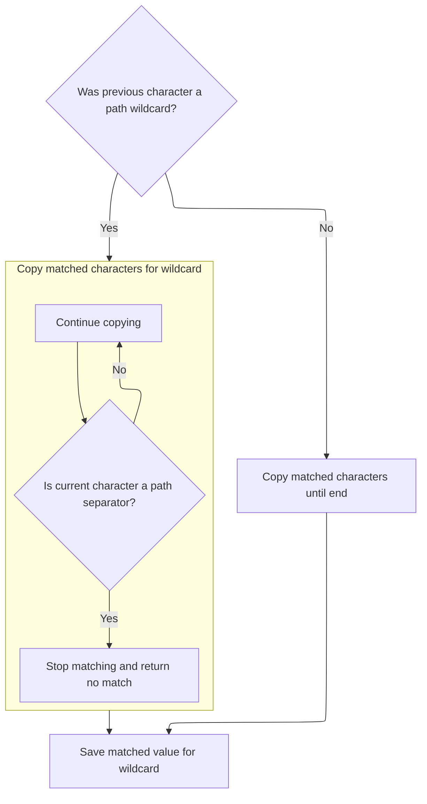

This document describes how an input string is matched against a pattern containing custom wildcards. The flow interprets the pattern, applies greedy matching for multi-segment wildcards, and extracts matched segments into a map for further use.

# Pattern Matching with Custom Wildcards

<SwmSnippet path="/core/src/main/java/org/apache/struts/util/WildcardHelper.java" line="159">

---

In <SwmToken path="core/src/main/java/org/apache/struts/util/WildcardHelper.java" pos="159:5:5" line-data="    public boolean match(Map map, String data, int[] expr) {">`match`</SwmToken>, we're setting up for the custom pattern matching logic. The code checks for nulls, sets up buffers, and initializes positions. It also puts the full input string into the map as group 0. If the pattern starts with <SwmToken path="core/src/main/java/org/apache/struts/util/WildcardHelper.java" pos="193:9:9" line-data="        // First check for MATCH_BEGIN">`MATCH_BEGIN`</SwmToken>, we flag it and move past it. Then we scan the expr array to find the first special MATCH\_\* constant, prepping for the main matching loop. This is where the function starts interpreting the custom pattern format and gets ready to match literal segments and wildcards.

```java
    public boolean match(Map map, String data, int[] expr) {
        if (map == null) {
            throw new NullPointerException("No map provided");
        }

        if (data == null) {
            throw new NullPointerException("No data provided");
        }

        if (expr == null) {
            throw new NullPointerException("No pattern expression provided");
        }

        char[] buff = data.toCharArray();

        // Allocate the result buffer
        char[] rslt = new char[expr.length + buff.length];

        // The previous and current position of the expression character
        // (MATCH_*)
        int charpos = 0;

        // The position in the expression, input, translation and result arrays
        int exprpos = 0;
        int buffpos = 0;
        int rsltpos = 0;
        int offset = -1;

        // The matching count
        int mcount = 0;

        // We want the complete data be in {0}
        map.put(Integer.toString(mcount), data);

        // First check for MATCH_BEGIN
        boolean matchBegin = false;

        if (expr[charpos] == MATCH_BEGIN) {
            matchBegin = true;
            exprpos = ++charpos;
        }

        // Search the fist expression character (except MATCH_BEGIN - already
        // skipped)
        while (expr[charpos] >= 0) {
            charpos++;
        }
```

---

</SwmSnippet>

<SwmSnippet path="/core/src/main/java/org/apache/struts/util/WildcardHelper.java" line="207">

---

Here we're in the main matching loop. The code checks if the literal segment before the current MATCH\_\* constant matches the input (either at the start or anywhere, depending on <SwmToken path="core/src/main/java/org/apache/struts/util/WildcardHelper.java" pos="213:4:4" line-data="            if (matchBegin) {">`matchBegin`</SwmToken>). If it doesn't match, we bail out. If we hit <SwmToken path="core/src/main/java/org/apache/struts/util/WildcardHelper.java" pos="240:8:8" line-data="            if (exprchr == MATCH_END) {">`MATCH_END`</SwmToken> or <SwmToken path="core/src/main/java/org/apache/struts/util/WildcardHelper.java" pos="248:12:12" line-data="            } else if (exprchr == MATCH_THEEND) {">`MATCH_THEEND`</SwmToken>, we store any pending group and return, otherwise we move to the next segment and keep matching.

```java
        // The expression charater (MATCH_*)
        int exprchr = expr[charpos];

        while (true) {
            // Check if the data in the expression array before the current
            // expression character matches the data in the input buffer
            if (matchBegin) {
                if (!matchArray(expr, exprpos, charpos, buff, buffpos)) {
                    return (false);
                }

                matchBegin = false;
            } else {
                offset = indexOfArray(expr, exprpos, charpos, buff, buffpos);

                if (offset < 0) {
                    return (false);
                }
            }

            // Check for MATCH_BEGIN
            if (matchBegin) {
                if (offset != 0) {
                    return (false);
                }

                matchBegin = false;
            }

            // Advance buffpos
            buffpos += (charpos - exprpos);

            // Check for END's
            if (exprchr == MATCH_END) {
                if (rsltpos > 0) {
                    map.put(Integer.toString(++mcount),
                        new String(rslt, 0, rsltpos));
                }

                // Don't care about rest of input buffer
                return (true);
            } else if (exprchr == MATCH_THEEND) {
                if (rsltpos > 0) {
                    map.put(Integer.toString(++mcount),
                        new String(rslt, 0, rsltpos));
                }

                // Check that we reach buffer's end
                return (buffpos == buff.length);
            }

            // Search the next expression character
            exprpos = ++charpos;

            while (expr[charpos] >= 0) {
                charpos++;
            }
```

---

</SwmSnippet>

<SwmSnippet path="/core/src/main/java/org/apache/struts/util/WildcardHelper.java" line="265">

---

After identifying the type of wildcard, we decide whether to search forward or backward for the next literal segment. For <SwmToken path="core/src/main/java/org/apache/struts/util/WildcardHelper.java" pos="271:6:6" line-data="                (prevchr == MATCH_FILE)">`MATCH_FILE`</SwmToken>, we look for the next occurrence, but for <SwmToken path="core/src/main/java/org/apache/struts/util/WildcardHelper.java" pos="281:8:8" line-data="            if (prevchr == MATCH_PATH) {">`MATCH_PATH`</SwmToken> (multi-segment wildcard), we use <SwmToken path="core/src/main/java/org/apache/struts/util/WildcardHelper.java" pos="273:3:3" line-data="                : lastIndexOfArray(expr, exprpos, charpos, buff, buffpos);">`lastIndexOfArray`</SwmToken> to find the last possible match, which is needed for greedy matching. If we can't find a match, we return false.

```java
            int prevchr = exprchr;

            exprchr = expr[charpos];

            // We have here prevchr == * or **.
            offset =
                (prevchr == MATCH_FILE)
                ? indexOfArray(expr, exprpos, charpos, buff, buffpos)
                : lastIndexOfArray(expr, exprpos, charpos, buff, buffpos);

            if (offset < 0) {
                return (false);
            }

```

---

</SwmSnippet>

## Reverse Subarray Search Logic

```mermaid
%%{init: {"flowchart": {"defaultRenderer": "elk"}} }%%
flowchart TD
  node1["Validate search range for sequence in
character array"]
  click node1 openCode "core/src/main/java/org/apache/struts/util/WildcardHelper.java:383:385"
  node1 --> node2{"Is search range valid?"}
  click node2 openCode "core/src/main/java/org/apache/struts/util/WildcardHelper.java:383:385"
  node2 -->|"No"| node3["Stop: Invalid search range"]
  click node3 openCode "core/src/main/java/org/apache/struts/util/WildcardHelper.java:384:385"
  node2 -->|"Yes"| node4{"Is sequence to match empty?"}
  click node4 openCode "core/src/main/java/org/apache/struts/util/WildcardHelper.java:388:390"
  node4 -->|"Yes"| node5["Return end of character array"]
  click node5 openCode "core/src/main/java/org/apache/struts/util/WildcardHelper.java:389:390"
  node4 -->|"No"| node6{"Is sequence a single character?"}
  click node6 openCode "core/src/main/java/org/apache/struts/util/WildcardHelper.java:393:399"
  node6 -->|"Yes"| node7["Find last occurrence of character in
array"]
  click node7 openCode "core/src/main/java/org/apache/struts/util/WildcardHelper.java:395:398"
  node7 --> node13{"Was character found?"}
  click node13 openCode "core/src/main/java/org/apache/struts/util/WildcardHelper.java:396:398"
  node13 -->|"Yes"| node11["Return position"]
  click node11 openCode "core/src/main/java/org/apache/struts/util/WildcardHelper.java:397:398"
  node13 -->|"No"| node12["Return not found"]
  click node12 openCode "core/src/main/java/org/apache/struts/util/WildcardHelper.java:399:399"
  node6 -->|"No"| node8["Find last occurrence of sequence in
array"]
  click node8 openCode "core/src/main/java/org/apache/struts/util/WildcardHelper.java:406:424"
  
  subgraph loop1["For each possible position in character
array, starting from the end"]
    node8 --> node9{"Does sequence match at this position?"}
    click node9 openCode "core/src/main/java/org/apache/struts/util/WildcardHelper.java:412:419"
    node9 -->|"Yes"| node10["Return position"]
    click node10 openCode "core/src/main/java/org/apache/struts/util/WildcardHelper.java:414:415"
    node9 -->|"No"| node8
  end
  node8 --> node12["Return not found if sequence does not
match anywhere"]
  click node12 openCode "core/src/main/java/org/apache/struts/util/WildcardHelper.java:424:424"

classDef HeadingStyle fill:#777777,stroke:#333,stroke-width:2px;

%% Swimm:
%% %%{init: {"flowchart": {"defaultRenderer": "elk"}} }%%
%% flowchart TD
%%   node1["Validate search range for sequence in
%% character array"]
%%   click node1 openCode "<SwmPath>[core/…/util/WildcardHelper.java](core/src/main/java/org/apache/struts/util/WildcardHelper.java)</SwmPath>:383:385"
%%   node1 --> node2{"Is search range valid?"}
%%   click node2 openCode "<SwmPath>[core/…/util/WildcardHelper.java](core/src/main/java/org/apache/struts/util/WildcardHelper.java)</SwmPath>:383:385"
%%   node2 -->|"No"| node3["Stop: Invalid search range"]
%%   click node3 openCode "<SwmPath>[core/…/util/WildcardHelper.java](core/src/main/java/org/apache/struts/util/WildcardHelper.java)</SwmPath>:384:385"
%%   node2 -->|"Yes"| node4{"Is sequence to match empty?"}
%%   click node4 openCode "<SwmPath>[core/…/util/WildcardHelper.java](core/src/main/java/org/apache/struts/util/WildcardHelper.java)</SwmPath>:388:390"
%%   node4 -->|"Yes"| node5["Return end of character array"]
%%   click node5 openCode "<SwmPath>[core/…/util/WildcardHelper.java](core/src/main/java/org/apache/struts/util/WildcardHelper.java)</SwmPath>:389:390"
%%   node4 -->|"No"| node6{"Is sequence a single character?"}
%%   click node6 openCode "<SwmPath>[core/…/util/WildcardHelper.java](core/src/main/java/org/apache/struts/util/WildcardHelper.java)</SwmPath>:393:399"
%%   node6 -->|"Yes"| node7["Find last occurrence of character in
%% array"]
%%   click node7 openCode "<SwmPath>[core/…/util/WildcardHelper.java](core/src/main/java/org/apache/struts/util/WildcardHelper.java)</SwmPath>:395:398"
%%   node7 --> node13{"Was character found?"}
%%   click node13 openCode "<SwmPath>[core/…/util/WildcardHelper.java](core/src/main/java/org/apache/struts/util/WildcardHelper.java)</SwmPath>:396:398"
%%   node13 -->|"Yes"| node11["Return position"]
%%   click node11 openCode "<SwmPath>[core/…/util/WildcardHelper.java](core/src/main/java/org/apache/struts/util/WildcardHelper.java)</SwmPath>:397:398"
%%   node13 -->|"No"| node12["Return not found"]
%%   click node12 openCode "<SwmPath>[core/…/util/WildcardHelper.java](core/src/main/java/org/apache/struts/util/WildcardHelper.java)</SwmPath>:399:399"
%%   node6 -->|"No"| node8["Find last occurrence of sequence in
%% array"]
%%   click node8 openCode "<SwmPath>[core/…/util/WildcardHelper.java](core/src/main/java/org/apache/struts/util/WildcardHelper.java)</SwmPath>:406:424"
%%   
%%   subgraph loop1["For each possible position in character
%% array, starting from the end"]
%%     node8 --> node9{"Does sequence match at this position?"}
%%     click node9 openCode "<SwmPath>[core/…/util/WildcardHelper.java](core/src/main/java/org/apache/struts/util/WildcardHelper.java)</SwmPath>:412:419"
%%     node9 -->|"Yes"| node10["Return position"]
%%     click node10 openCode "<SwmPath>[core/…/util/WildcardHelper.java](core/src/main/java/org/apache/struts/util/WildcardHelper.java)</SwmPath>:414:415"
%%     node9 -->|"No"| node8
%%   end
%%   node8 --> node12["Return not found if sequence does not
%% match anywhere"]
%%   click node12 openCode "<SwmPath>[core/…/util/WildcardHelper.java](core/src/main/java/org/apache/struts/util/WildcardHelper.java)</SwmPath>:424:424"
%% 
%% classDef HeadingStyle fill:#777777,stroke:#333,stroke-width:2px;
```



<SwmSnippet path="/core/src/main/java/org/apache/struts/util/WildcardHelper.java" line="380">

---

In <SwmToken path="core/src/main/java/org/apache/struts/util/WildcardHelper.java" pos="380:5:5" line-data="    protected int lastIndexOfArray(int[] r, int rpos, int rend, char[] d,">`lastIndexOfArray`</SwmToken>, we're handling the reverse search for a subarray in the input. If the subarray is zero-length, we return <SwmToken path="core/src/main/java/org/apache/struts/util/WildcardHelper.java" pos="389:4:6" line-data="            return (d.length); //?? dpos?">`d.length`</SwmToken> (which is a special case for this repo). For single-character matches, we scan backwards for that char. The function compares int pattern codes to char input values directly, which works because of how the pattern is encoded.

```java
    protected int lastIndexOfArray(int[] r, int rpos, int rend, char[] d,
        int dpos) {
        // Check if pos and len are legal
        if (rend < rpos) {
            throw new IllegalArgumentException("rend < rpos");
        }

        // If we need to match a zero length string return current dpos
        if (rend == rpos) {
            return (d.length); //?? dpos?
        }

        // If we need to match a 1 char length string do it simply
        if ((rend - rpos) == 1) {
            // Search for the specified character
            for (int x = d.length - 1; x > dpos; x--) {
                if (r[rpos] == d[x]) {
                    return (x);
                }
            }
```

---

</SwmSnippet>

<SwmSnippet path="/core/src/main/java/org/apache/struts/util/WildcardHelper.java" line="402">

---

Here we're running the main reverse search loop. For each possible position in the input, we check if the subarray matches. If we find a match, we return its starting index. If not, we return -1, which tells the caller that no match was found.

```java
        // Main string matching loop. It gets executed if the characters to
        // match are less then the characters left in the d buffer
        int l = d.length - (rend - rpos);

        while (l >= dpos) {
            // Set current startpoint in d
            int y = l;

            // Check every character in d for equity. If the string is matched
            // return dpos
            for (int x = rpos; x <= rend; x++) {
                if (x == rend) {
                    return (l);
                }

                if (r[x] != d[y++]) {
                    break;
                }
            }

            // Decrease l to search for the same string at next offset
            l--;
        }
```

---

</SwmSnippet>

## Extracting and Storing Matched Segments



<SwmSnippet path="/core/src/main/java/org/apache/struts/util/WildcardHelper.java" line="279">

---

Back in WildcardHelper.match, we just got an offset from <SwmToken path="core/src/main/java/org/apache/struts/util/WildcardHelper.java" pos="273:3:3" line-data="                : lastIndexOfArray(expr, exprpos, charpos, buff, buffpos);">`lastIndexOfArray`</SwmToken>. Now, for <SwmToken path="core/src/main/java/org/apache/struts/util/WildcardHelper.java" pos="281:8:8" line-data="            if (prevchr == MATCH_PATH) {">`MATCH_PATH`</SwmToken>, we copy everything from the current position up to that offset into the result buffer. This is how we extract the matched segment for this wildcard.

```java
            // Copy the data from the source buffer into the result buffer
            // to substitute the expression character
            if (prevchr == MATCH_PATH) {
                while (buffpos < offset) {
                    rslt[rsltpos++] = buff[buffpos++];
                }
```

---

</SwmSnippet>

<SwmSnippet path="/core/src/main/java/org/apache/struts/util/WildcardHelper.java" line="286">

---

For <SwmToken path="core/src/main/java/org/apache/struts/util/WildcardHelper.java" pos="271:6:6" line-data="                (prevchr == MATCH_FILE)">`MATCH_FILE`</SwmToken>, we copy the matched segment into rslt, but if we hit a '/', we return false since file wildcards aren't allowed to cross path boundaries. This keeps file and path wildcards distinct.

```java
                // Matching file, don't copy '/'
                while (buffpos < offset) {
                    if (buff[buffpos] == '/') {
                        return (false);
                    }

                    rslt[rsltpos++] = buff[buffpos++];
                }
```

---

</SwmSnippet>

<SwmSnippet path="/core/src/main/java/org/apache/struts/util/WildcardHelper.java" line="296">

---

Finally, after extracting the matched segment, we store it in the map as the next group. The function will keep looping or return true/false depending on whether the pattern matches the input, with all matched groups available in the map by the end.

```java
            map.put(Integer.toString(++mcount), new String(rslt, 0, rsltpos));
            rsltpos = 0;
        }
    }
```

---

</SwmSnippet>

&nbsp;

*This is an auto-generated document by Swimm 🌊 and has not yet been verified by a human*

<SwmMeta version="3.0.0" repo-id="Z2l0aHViJTNBJTNBc3RydXRzMSUzQSUzQVN3aW1tLURlbW8=" repo-name="struts1"><sup>Powered by [Swimm](https://app.swimm.io/)</sup></SwmMeta>
