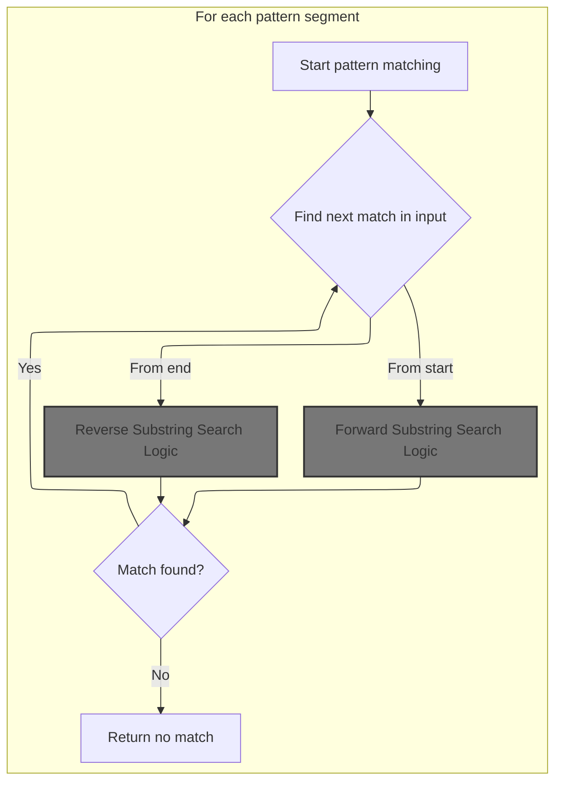

This document describes how pattern matching is used to check if an input string fits a pattern with wildcards. The flow supports flexible string matching, such as for file paths or URLs, and extracts relevant segments for further processing.

# Pattern Matching Loop and Token Handling



<SwmSnippet path="/core/src/main/java/org/apache/struts/util/WildcardHelper.java" line="159">

---

In <SwmToken path="core/src/main/java/org/apache/struts/util/WildcardHelper.java" pos="159:5:5" line-data="    public boolean match(Map map, String data, int[] expr) {">`match`</SwmToken>, the function sets up the matching process: it validates inputs, converts the data to a char array, initializes buffers, and stores the full input in the map. It checks for a <SwmToken path="core/src/main/java/org/apache/struts/util/WildcardHelper.java" pos="193:9:9" line-data="        // First check for MATCH_BEGIN">`MATCH_BEGIN`</SwmToken> token to see if the pattern must match from the start, then iterates through the expr array to find the next special token. This section is all about preparing for and starting the main matching loop, handling the initial pattern segment, and setting up for the token-driven matching logic.

```java
    public boolean match(Map map, String data, int[] expr) {
        if (map == null) {
            throw new NullPointerException("No map provided");
        }

        if (data == null) {
            throw new NullPointerException("No data provided");
        }

        if (expr == null) {
            throw new NullPointerException("No pattern expression provided");
        }

        char[] buff = data.toCharArray();

        // Allocate the result buffer
        char[] rslt = new char[expr.length + buff.length];

        // The previous and current position of the expression character
        // (MATCH_*)
        int charpos = 0;

        // The position in the expression, input, translation and result arrays
        int exprpos = 0;
        int buffpos = 0;
        int rsltpos = 0;
        int offset = -1;

        // The matching count
        int mcount = 0;

        // We want the complete data be in {0}
        map.put(Integer.toString(mcount), data);

        // First check for MATCH_BEGIN
        boolean matchBegin = false;

        if (expr[charpos] == MATCH_BEGIN) {
            matchBegin = true;
            exprpos = ++charpos;
        }

        // Search the fist expression character (except MATCH_BEGIN - already
        // skipped)
        while (expr[charpos] >= 0) {
            charpos++;
        }
```

---

</SwmSnippet>

<SwmSnippet path="/core/src/main/java/org/apache/struts/util/WildcardHelper.java" line="207">

---

Next, the function checks if the current segment matches the input (using <SwmToken path="core/src/main/java/org/apache/struts/util/WildcardHelper.java" pos="214:5:5" line-data="                if (!matchArray(expr, exprpos, charpos, buff, buffpos)) {">`matchArray`</SwmToken> or <SwmToken path="core/src/main/java/org/apache/struts/util/WildcardHelper.java" pos="220:5:5" line-data="                offset = indexOfArray(expr, exprpos, charpos, buff, buffpos);">`indexOfArray`</SwmToken>), handles the <SwmToken path="core/src/main/java/org/apache/struts/util/WildcardHelper.java" pos="227:7:7" line-data="            // Check for MATCH_BEGIN">`MATCH_BEGIN`</SwmToken> logic if needed, and advances the buffer position. It then checks for end tokens (<SwmToken path="core/src/main/java/org/apache/struts/util/WildcardHelper.java" pos="240:8:8" line-data="            if (exprchr == MATCH_END) {">`MATCH_END`</SwmToken> or <SwmToken path="core/src/main/java/org/apache/struts/util/WildcardHelper.java" pos="248:12:12" line-data="            } else if (exprchr == MATCH_THEEND) {">`MATCH_THEEND`</SwmToken>) to decide if the match is complete, storing any matched substrings in the map. If not at the end, it prepares for the next pattern segment.

```java
        // The expression charater (MATCH_*)
        int exprchr = expr[charpos];

        while (true) {
            // Check if the data in the expression array before the current
            // expression character matches the data in the input buffer
            if (matchBegin) {
                if (!matchArray(expr, exprpos, charpos, buff, buffpos)) {
                    return (false);
                }

                matchBegin = false;
            } else {
                offset = indexOfArray(expr, exprpos, charpos, buff, buffpos);

                if (offset < 0) {
                    return (false);
                }
            }

            // Check for MATCH_BEGIN
            if (matchBegin) {
                if (offset != 0) {
                    return (false);
                }

                matchBegin = false;
            }

            // Advance buffpos
            buffpos += (charpos - exprpos);

            // Check for END's
            if (exprchr == MATCH_END) {
                if (rsltpos > 0) {
                    map.put(Integer.toString(++mcount),
                        new String(rslt, 0, rsltpos));
                }

                // Don't care about rest of input buffer
                return (true);
            } else if (exprchr == MATCH_THEEND) {
                if (rsltpos > 0) {
                    map.put(Integer.toString(++mcount),
                        new String(rslt, 0, rsltpos));
                }

                // Check that we reach buffer's end
                return (buffpos == buff.length);
            }

            // Search the next expression character
            exprpos = ++charpos;

            while (expr[charpos] >= 0) {
                charpos++;
            }
```

---

</SwmSnippet>

<SwmSnippet path="/core/src/main/java/org/apache/struts/util/WildcardHelper.java" line="265">

---

Here, the function decides which search method to use based on the previous token: for <SwmToken path="core/src/main/java/org/apache/struts/util/WildcardHelper.java" pos="271:6:6" line-data="                (prevchr == MATCH_FILE)">`MATCH_FILE`</SwmToken>, it looks for the next occurrence of the pattern segment with <SwmToken path="core/src/main/java/org/apache/struts/util/WildcardHelper.java" pos="272:3:3" line-data="                ? indexOfArray(expr, exprpos, charpos, buff, buffpos)">`indexOfArray`</SwmToken>. This step is about locating where the next pattern segment appears in the input, which is necessary before copying or validating the matched substring.

```java
            int prevchr = exprchr;

            exprchr = expr[charpos];

            // We have here prevchr == * or **.
            offset =
                (prevchr == MATCH_FILE)
                ? indexOfArray(expr, exprpos, charpos, buff, buffpos)
```

---

</SwmSnippet>

## Forward Substring Search Logic

```mermaid
%%{init: {"flowchart": {"defaultRenderer": "elk"}} }%%
flowchart TD
  node1["Check if search range is valid (rpos to
rend)"]
  click node1 openCode "core/src/main/java/org/apache/struts/util/WildcardHelper.java:318:319"
  node2{"Is search range invalid? (rend < rpos)"}
  click node2 openCode "core/src/main/java/org/apache/struts/util/WildcardHelper.java:319:320"
  node3["Return error (invalid range)"]
  click node3 openCode "core/src/main/java/org/apache/struts/util/WildcardHelper.java:320:321"
  node4{"Is sequence empty? (rend == rpos)"}
  click node4 openCode "core/src/main/java/org/apache/struts/util/WildcardHelper.java:324:325"
  node5["Return current position (dpos)"]
  click node5 openCode "core/src/main/java/org/apache/struts/util/WildcardHelper.java:325:326"
  node6{"Is sequence a single character? ((rend
- rpos) == 1)"}
  click node6 openCode "core/src/main/java/org/apache/struts/util/WildcardHelper.java:329:330"
  node7["Search for single character in array"]
  click node7 openCode "core/src/main/java/org/apache/struts/util/WildcardHelper.java:331:335"
  node8{"Was single character found?"}
  click node8 openCode "core/src/main/java/org/apache/struts/util/WildcardHelper.java:332:334"
  node9["Return position if found, else -1"]
  click node9 openCode "core/src/main/java/org/apache/struts/util/WildcardHelper.java:333:335"
  node10["Main matching loop"]
  click node10 openCode "core/src/main/java/org/apache/struts/util/WildcardHelper.java:340:358"

  node1 --> node2
  node2 -->|"Yes"| node3
  node2 -->|"No"| node4
  node4 -->|"Yes"| node5
  node4 -->|"No"| node6
  node6 -->|"Yes"| node7
  node7 --> node8
  node8 -->|"Yes"| node9
  node8 -->|"No"| node9
  node6 -->|"No"| node10

  subgraph loop1["For each possible position in character
array (dpos)"]
    node10 --> node11{"Does sequence match at this position?"}
    click node11 openCode "core/src/main/java/org/apache/struts/util/WildcardHelper.java:346:353"
    node11 -->|"Yes"| node12["Return current position (dpos)"]
    click node12 openCode "core/src/main/java/org/apache/struts/util/WildcardHelper.java:348:349"
    node11 -->|"No"| node13{"More positions to try?"}
    click node13 openCode "core/src/main/java/org/apache/struts/util/WildcardHelper.java:357:358"
    node13 -->|"Yes"| node10
    node13 -->|"No"| node14["Return -1 (not found)"]
    click node14 openCode "core/src/main/java/org/apache/struts/util/WildcardHelper.java:358:358"
  end

classDef HeadingStyle fill:#777777,stroke:#333,stroke-width:2px;

%% Swimm:
%% %%{init: {"flowchart": {"defaultRenderer": "elk"}} }%%
%% flowchart TD
%%   node1["Check if search range is valid (rpos to
%% rend)"]
%%   click node1 openCode "<SwmPath>[core/…/util/WildcardHelper.java](core/src/main/java/org/apache/struts/util/WildcardHelper.java)</SwmPath>:318:319"
%%   node2{"Is search range invalid? (rend < rpos)"}
%%   click node2 openCode "<SwmPath>[core/…/util/WildcardHelper.java](core/src/main/java/org/apache/struts/util/WildcardHelper.java)</SwmPath>:319:320"
%%   node3["Return error (invalid range)"]
%%   click node3 openCode "<SwmPath>[core/…/util/WildcardHelper.java](core/src/main/java/org/apache/struts/util/WildcardHelper.java)</SwmPath>:320:321"
%%   node4{"Is sequence empty? (rend == rpos)"}
%%   click node4 openCode "<SwmPath>[core/…/util/WildcardHelper.java](core/src/main/java/org/apache/struts/util/WildcardHelper.java)</SwmPath>:324:325"
%%   node5["Return current position (dpos)"]
%%   click node5 openCode "<SwmPath>[core/…/util/WildcardHelper.java](core/src/main/java/org/apache/struts/util/WildcardHelper.java)</SwmPath>:325:326"
%%   node6{"Is sequence a single character? ((rend
%% - rpos) == 1)"}
%%   click node6 openCode "<SwmPath>[core/…/util/WildcardHelper.java](core/src/main/java/org/apache/struts/util/WildcardHelper.java)</SwmPath>:329:330"
%%   node7["Search for single character in array"]
%%   click node7 openCode "<SwmPath>[core/…/util/WildcardHelper.java](core/src/main/java/org/apache/struts/util/WildcardHelper.java)</SwmPath>:331:335"
%%   node8{"Was single character found?"}
%%   click node8 openCode "<SwmPath>[core/…/util/WildcardHelper.java](core/src/main/java/org/apache/struts/util/WildcardHelper.java)</SwmPath>:332:334"
%%   node9["Return position if found, else -1"]
%%   click node9 openCode "<SwmPath>[core/…/util/WildcardHelper.java](core/src/main/java/org/apache/struts/util/WildcardHelper.java)</SwmPath>:333:335"
%%   node10["Main matching loop"]
%%   click node10 openCode "<SwmPath>[core/…/util/WildcardHelper.java](core/src/main/java/org/apache/struts/util/WildcardHelper.java)</SwmPath>:340:358"
%% 
%%   node1 --> node2
%%   node2 -->|"Yes"| node3
%%   node2 -->|"No"| node4
%%   node4 -->|"Yes"| node5
%%   node4 -->|"No"| node6
%%   node6 -->|"Yes"| node7
%%   node7 --> node8
%%   node8 -->|"Yes"| node9
%%   node8 -->|"No"| node9
%%   node6 -->|"No"| node10
%% 
%%   subgraph loop1["For each possible position in character
%% array (dpos)"]
%%     node10 --> node11{"Does sequence match at this position?"}
%%     click node11 openCode "<SwmPath>[core/…/util/WildcardHelper.java](core/src/main/java/org/apache/struts/util/WildcardHelper.java)</SwmPath>:346:353"
%%     node11 -->|"Yes"| node12["Return current position (dpos)"]
%%     click node12 openCode "<SwmPath>[core/…/util/WildcardHelper.java](core/src/main/java/org/apache/struts/util/WildcardHelper.java)</SwmPath>:348:349"
%%     node11 -->|"No"| node13{"More positions to try?"}
%%     click node13 openCode "<SwmPath>[core/…/util/WildcardHelper.java](core/src/main/java/org/apache/struts/util/WildcardHelper.java)</SwmPath>:357:358"
%%     node13 -->|"Yes"| node10
%%     node13 -->|"No"| node14["Return -1 (not found)"]
%%     click node14 openCode "<SwmPath>[core/…/util/WildcardHelper.java](core/src/main/java/org/apache/struts/util/WildcardHelper.java)</SwmPath>:358:358"
%%   end
%% 
%% classDef HeadingStyle fill:#777777,stroke:#333,stroke-width:2px;
```



<SwmSnippet path="/core/src/main/java/org/apache/struts/util/WildcardHelper.java" line="316">

---

In <SwmToken path="core/src/main/java/org/apache/struts/util/WildcardHelper.java" pos="316:5:5" line-data="    protected int indexOfArray(int[] r, int rpos, int rend, char[] d,">`indexOfArray`</SwmToken>, the function checks for invalid input, handles the zero-length match case (returning <SwmToken path="core/src/main/java/org/apache/struts/util/WildcardHelper.java" pos="325:4:6" line-data="            return (d.length); //?? dpos?">`d.length`</SwmToken>), and does a simple search for single-character patterns. For longer patterns, it loops through the input to find the first matching substring, comparing the int pattern array to the char data array.

```java
    protected int indexOfArray(int[] r, int rpos, int rend, char[] d,
        int dpos) {
        // Check if pos and len are legal
        if (rend < rpos) {
            throw new IllegalArgumentException("rend < rpos");
        }

        // If we need to match a zero length string return current dpos
        if (rend == rpos) {
            return (d.length); //?? dpos?
        }

        // If we need to match a 1 char length string do it simply
        if ((rend - rpos) == 1) {
            // Search for the specified character
            for (int x = dpos; x < d.length; x++) {
                if (r[rpos] == d[x]) {
                    return (x);
                }
            }
```

---

</SwmSnippet>

<SwmSnippet path="/core/src/main/java/org/apache/struts/util/WildcardHelper.java" line="338">

---

Here, the function loops through the input, comparing each possible substring to the pattern. If a match is found, it returns the starting index; if not, it returns -1. The rend parameter is treated as inclusive, so the match includes the character at rend.

```java
        // Main string matching loop. It gets executed if the characters to
        // match are less then the characters left in the d buffer
        while (((dpos + rend) - rpos) <= d.length) {
            // Set current startpoint in d
            int y = dpos;

            // Check every character in d for equity. If the string is matched
            // return dpos
            for (int x = rpos; x <= rend; x++) {
                if (x == rend) {
                    return (dpos);
                }

                if (r[x] != d[y++]) {
                    break;
                }
            }

            // Increase dpos to search for the same string at next offset
            dpos++;
        }
```

---

</SwmSnippet>

## Handling Greedy and Non-Greedy Wildcards

<SwmSnippet path="/core/src/main/java/org/apache/struts/util/WildcardHelper.java" line="273">

---

Back in WildcardHelper.match, after getting the offset from <SwmToken path="core/src/main/java/org/apache/struts/util/WildcardHelper.java" pos="220:5:5" line-data="                offset = indexOfArray(expr, exprpos, charpos, buff, buffpos);">`indexOfArray`</SwmToken> or <SwmToken path="core/src/main/java/org/apache/struts/util/WildcardHelper.java" pos="273:3:3" line-data="                : lastIndexOfArray(expr, exprpos, charpos, buff, buffpos);">`lastIndexOfArray`</SwmToken>, the function checks if a match was found. If not, it returns false. The use of <SwmToken path="core/src/main/java/org/apache/struts/util/WildcardHelper.java" pos="273:3:3" line-data="                : lastIndexOfArray(expr, exprpos, charpos, buff, buffpos);">`lastIndexOfArray`</SwmToken> for <SwmToken path="core/src/main/java/org/apache/struts/util/WildcardHelper.java" pos="281:8:8" line-data="            if (prevchr == MATCH_PATH) {">`MATCH_PATH`</SwmToken> ensures the pattern matches the longest possible substring

```java
                : lastIndexOfArray(expr, exprpos, charpos, buff, buffpos);

            if (offset < 0) {
                return (false);
            }

```

---

</SwmSnippet>

## Reverse Substring Search Logic

```mermaid
%%{init: {"flowchart": {"defaultRenderer": "elk"}} }%%
flowchart TD
  node1["Start: Find last occurrence of pattern
in array"]
  click node1 openCode "core/src/main/java/org/apache/struts/util/WildcardHelper.java:380:382"
  node1 --> node2{"Is pattern length zero?"}
  click node2 openCode "core/src/main/java/org/apache/struts/util/WildcardHelper.java:388:390"
  node2 -->|"Yes"| node3["Return end of array"]
  click node3 openCode "core/src/main/java/org/apache/struts/util/WildcardHelper.java:389:390"
  node2 -->|"No"| node4{"Is pattern length one?"}
  click node4 openCode "core/src/main/java/org/apache/struts/util/WildcardHelper.java:393:399"
  node4 -->|"Yes"| node5["Search backwards for single character"]
  click node5 openCode "core/src/main/java/org/apache/struts/util/WildcardHelper.java:395:398"
  node5 --> node6{"Was character found?"}
  click node6 openCode "core/src/main/java/org/apache/struts/util/WildcardHelper.java:396:398"
  node6 -->|"Yes"| node7["Return position"]
  click node7 openCode "core/src/main/java/org/apache/struts/util/WildcardHelper.java:397:398"
  node6 -->|"No"| node12["Return not found"]
  click node12 openCode "core/src/main/java/org/apache/struts/util/WildcardHelper.java:399:399"
  node4 -->|"No"| node8["Search for pattern in array"]
  click node8 openCode "core/src/main/java/org/apache/struts/util/WildcardHelper.java:406:424"
  subgraph loop1["For each possible position in array
(backwards)"]
    node8 --> node9{"Does pattern match at this position?"}
    click node9 openCode "core/src/main/java/org/apache/struts/util/WildcardHelper.java:410:419"
    node9 -->|"Yes"| node10["Return current position"]
    click node10 openCode "core/src/main/java/org/apache/struts/util/WildcardHelper.java:414:415"
    node9 -->|"No"| node11["Continue searching"]
    click node11 openCode "core/src/main/java/org/apache/struts/util/WildcardHelper.java:423:424"
    node11 --> node9
  end
  node8 --> node13["Return not found"]
  click node13 openCode "core/src/main/java/org/apache/struts/util/WildcardHelper.java:424:424"
classDef HeadingStyle fill:#777777,stroke:#333,stroke-width:2px;

%% Swimm:
%% %%{init: {"flowchart": {"defaultRenderer": "elk"}} }%%
%% flowchart TD
%%   node1["Start: Find last occurrence of pattern
%% in array"]
%%   click node1 openCode "<SwmPath>[core/…/util/WildcardHelper.java](core/src/main/java/org/apache/struts/util/WildcardHelper.java)</SwmPath>:380:382"
%%   node1 --> node2{"Is pattern length zero?"}
%%   click node2 openCode "<SwmPath>[core/…/util/WildcardHelper.java](core/src/main/java/org/apache/struts/util/WildcardHelper.java)</SwmPath>:388:390"
%%   node2 -->|"Yes"| node3["Return end of array"]
%%   click node3 openCode "<SwmPath>[core/…/util/WildcardHelper.java](core/src/main/java/org/apache/struts/util/WildcardHelper.java)</SwmPath>:389:390"
%%   node2 -->|"No"| node4{"Is pattern length one?"}
%%   click node4 openCode "<SwmPath>[core/…/util/WildcardHelper.java](core/src/main/java/org/apache/struts/util/WildcardHelper.java)</SwmPath>:393:399"
%%   node4 -->|"Yes"| node5["Search backwards for single character"]
%%   click node5 openCode "<SwmPath>[core/…/util/WildcardHelper.java](core/src/main/java/org/apache/struts/util/WildcardHelper.java)</SwmPath>:395:398"
%%   node5 --> node6{"Was character found?"}
%%   click node6 openCode "<SwmPath>[core/…/util/WildcardHelper.java](core/src/main/java/org/apache/struts/util/WildcardHelper.java)</SwmPath>:396:398"
%%   node6 -->|"Yes"| node7["Return position"]
%%   click node7 openCode "<SwmPath>[core/…/util/WildcardHelper.java](core/src/main/java/org/apache/struts/util/WildcardHelper.java)</SwmPath>:397:398"
%%   node6 -->|"No"| node12["Return not found"]
%%   click node12 openCode "<SwmPath>[core/…/util/WildcardHelper.java](core/src/main/java/org/apache/struts/util/WildcardHelper.java)</SwmPath>:399:399"
%%   node4 -->|"No"| node8["Search for pattern in array"]
%%   click node8 openCode "<SwmPath>[core/…/util/WildcardHelper.java](core/src/main/java/org/apache/struts/util/WildcardHelper.java)</SwmPath>:406:424"
%%   subgraph loop1["For each possible position in array
%% (backwards)"]
%%     node8 --> node9{"Does pattern match at this position?"}
%%     click node9 openCode "<SwmPath>[core/…/util/WildcardHelper.java](core/src/main/java/org/apache/struts/util/WildcardHelper.java)</SwmPath>:410:419"
%%     node9 -->|"Yes"| node10["Return current position"]
%%     click node10 openCode "<SwmPath>[core/…/util/WildcardHelper.java](core/src/main/java/org/apache/struts/util/WildcardHelper.java)</SwmPath>:414:415"
%%     node9 -->|"No"| node11["Continue searching"]
%%     click node11 openCode "<SwmPath>[core/…/util/WildcardHelper.java](core/src/main/java/org/apache/struts/util/WildcardHelper.java)</SwmPath>:423:424"
%%     node11 --> node9
%%   end
%%   node8 --> node13["Return not found"]
%%   click node13 openCode "<SwmPath>[core/…/util/WildcardHelper.java](core/src/main/java/org/apache/struts/util/WildcardHelper.java)</SwmPath>:424:424"
%% classDef HeadingStyle fill:#777777,stroke:#333,stroke-width:2px;
```



<SwmSnippet path="/core/src/main/java/org/apache/struts/util/WildcardHelper.java" line="380">

---

In <SwmToken path="core/src/main/java/org/apache/struts/util/WildcardHelper.java" pos="380:5:5" line-data="    protected int lastIndexOfArray(int[] r, int rpos, int rend, char[] d,">`lastIndexOfArray`</SwmToken>, the function checks for invalid input, handles zero-length and single-character matches, and then searches backward through the input for the last occurrence of the pattern segment. It compares the int pattern array to the char data array directly.

```java
    protected int lastIndexOfArray(int[] r, int rpos, int rend, char[] d,
        int dpos) {
        // Check if pos and len are legal
        if (rend < rpos) {
            throw new IllegalArgumentException("rend < rpos");
        }

        // If we need to match a zero length string return current dpos
        if (rend == rpos) {
            return (d.length); //?? dpos?
        }

        // If we need to match a 1 char length string do it simply
        if ((rend - rpos) == 1) {
            // Search for the specified character
            for (int x = d.length - 1; x > dpos; x--) {
                if (r[rpos] == d[x]) {
                    return (x);
                }
            }
```

---

</SwmSnippet>

<SwmSnippet path="/core/src/main/java/org/apache/struts/util/WildcardHelper.java" line="402">

---

Here, the function returns the start index of the last matching substring if found, or -1 if not. The comparison between int and char is direct, relying on the pattern array only containing valid char codes.

```java
        // Main string matching loop. It gets executed if the characters to
        // match are less then the characters left in the d buffer
        int l = d.length - (rend - rpos);

        while (l >= dpos) {
            // Set current startpoint in d
            int y = l;

            // Check every character in d for equity. If the string is matched
            // return dpos
            for (int x = rpos; x <= rend; x++) {
                if (x == rend) {
                    return (l);
                }

                if (r[x] != d[y++]) {
                    break;
                }
            }

            // Decrease l to search for the same string at next offset
            l--;
        }
```

---

</SwmSnippet>

## Copying and Validating Matched Substrings

<SwmSnippet path="/core/src/main/java/org/apache/struts/util/WildcardHelper.java" line="279">

---

Back in WildcardHelper.match, after getting the offset from <SwmToken path="core/src/main/java/org/apache/struts/util/WildcardHelper.java" pos="273:3:3" line-data="                : lastIndexOfArray(expr, exprpos, charpos, buff, buffpos);">`lastIndexOfArray`</SwmToken>, the function copies the matched substring into the result buffer. For <SwmToken path="core/src/main/java/org/apache/struts/util/WildcardHelper.java" pos="281:8:8" line-data="            if (prevchr == MATCH_PATH) {">`MATCH_PATH`</SwmToken>, it copies everything up to the offset; for <SwmToken path="core/src/main/java/org/apache/struts/util/WildcardHelper.java" pos="271:6:6" line-data="                (prevchr == MATCH_FILE)">`MATCH_FILE`</SwmToken>, it checks for '/' and fails if found, enforcing file-only matching.

```java
            // Copy the data from the source buffer into the result buffer
            // to substitute the expression character
            if (prevchr == MATCH_PATH) {
                while (buffpos < offset) {
                    rslt[rsltpos++] = buff[buffpos++];
                }
```

---

</SwmSnippet>

<SwmSnippet path="/core/src/main/java/org/apache/struts/util/WildcardHelper.java" line="286">

---

Next, the function continues copying characters for <SwmToken path="core/src/main/java/org/apache/struts/util/WildcardHelper.java" pos="271:6:6" line-data="                (prevchr == MATCH_FILE)">`MATCH_FILE`</SwmToken>, but aborts if it hits a '/', making sure the match doesn't cross directory boundaries. This keeps file wildcards strict to a single path segment.

```java
                // Matching file, don't copy '/'
                while (buffpos < offset) {
                    if (buff[buffpos] == '/') {
                        return (false);
                    }

                    rslt[rsltpos++] = buff[buffpos++];
                }
```

---

</SwmSnippet>

<SwmSnippet path="/core/src/main/java/org/apache/struts/util/WildcardHelper.java" line="296">

---

Finally, the function stores the matched substring in the map, resets the result buffer, and continues or ends as needed. The return value is true if the pattern matched, false otherwise. All matched segments are available in the map for the caller to use.

```java
            map.put(Integer.toString(++mcount), new String(rslt, 0, rsltpos));
            rsltpos = 0;
        }
    }
```

---

</SwmSnippet>

&nbsp;

*This is an auto-generated document by Swimm 🌊 and has not yet been verified by a human*

<SwmMeta version="3.0.0" repo-id="Z2l0aHViJTNBJTNBc3RydXRzMSUzQSUzQVN3aW1tLURlbW8=" repo-name="struts1"><sup>Powered by [Swimm](https://app.swimm.io/)</sup></SwmMeta>
