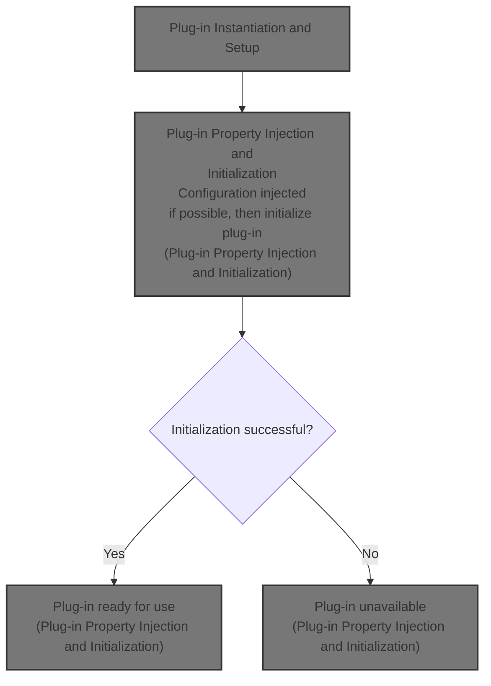
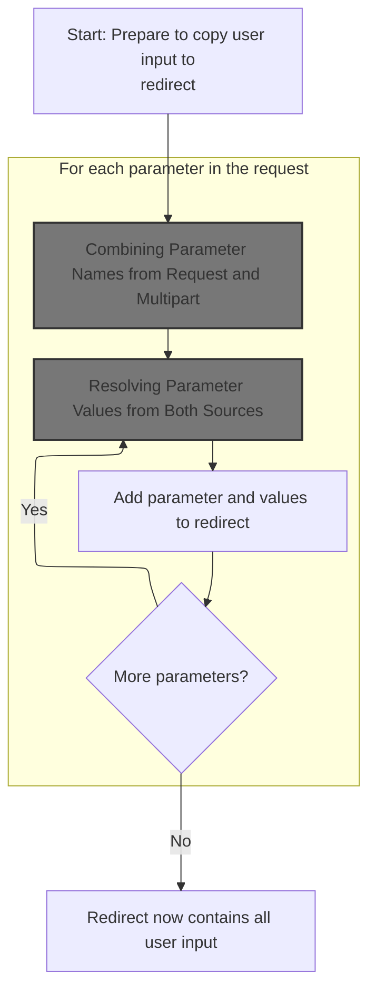
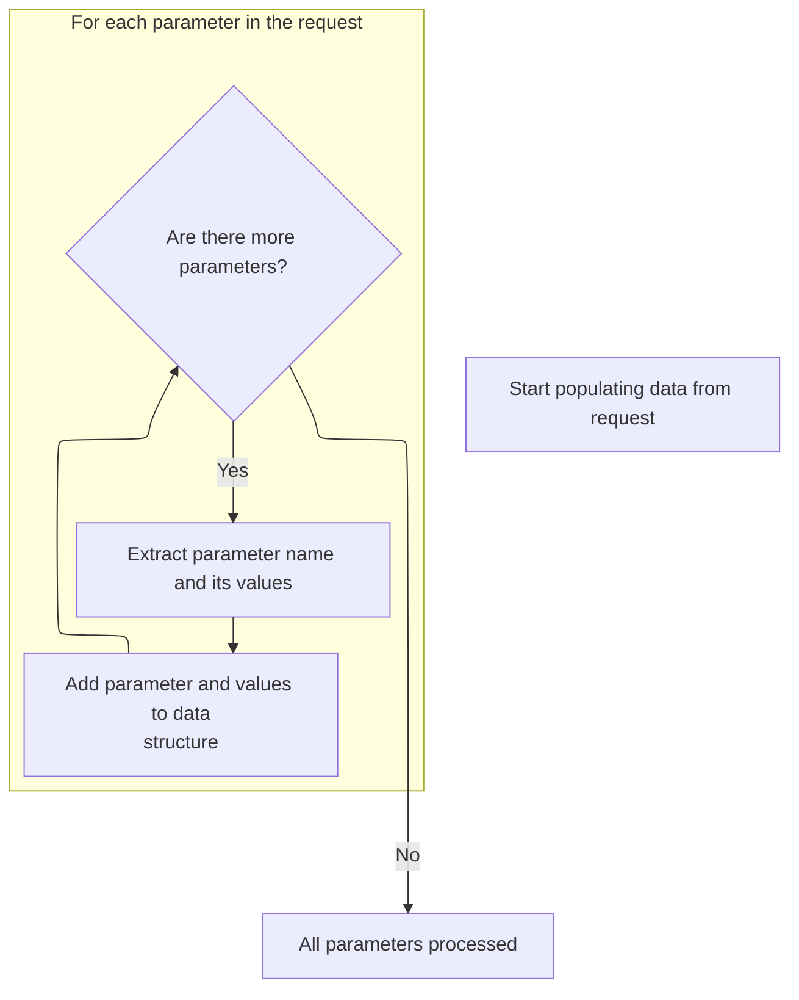
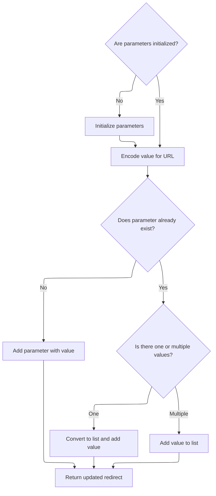
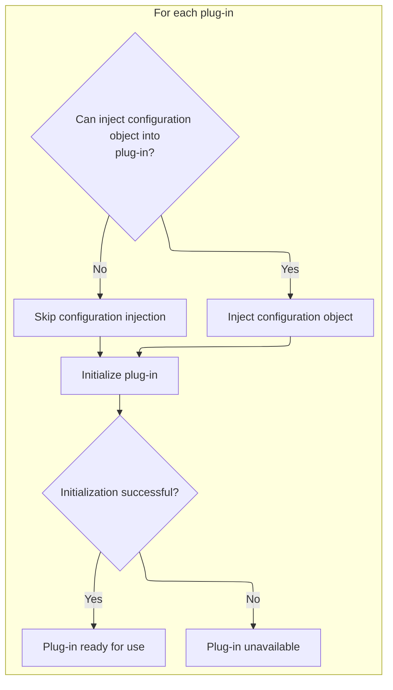

This document describes how plug-ins are set up and initialized for a module. Plug-ins extend the application's functionality. The flow retrieves plug-in configuration objects, creates and configures each plug-in, and initializes them for use within the module.



# Plug-in Instantiation and Setup

<SwmSnippet path="/core/src/main/java/org/apache/struts/action/ActionServlet.java" line="847">

---

In <SwmToken path="core/src/main/java/org/apache/struts/action/ActionServlet.java" pos="847:5:5" line-data="    protected void initModulePlugIns(ModuleConfig config)">`initModulePlugIns`</SwmToken>, we grab the plug-in configs, create the plug-in array, and stash it in the servlet context for module-wide access. Then, for each config, we instantiate the plug-in using <SwmToken path="core/src/main/java/org/apache/struts/action/ActionServlet.java" pos="863:5:7" line-data="                    (PlugIn) RequestUtils.applicationInstance(plugInConfigs[i]">`RequestUtils.applicationInstance`</SwmToken> (handles class loading), and immediately populate its properties with <SwmToken path="core/src/main/java/org/apache/struts/action/ActionServlet.java" pos="865:1:3" line-data="                BeanUtils.populate(plugIns[i], plugInConfigs[i].getProperties());">`BeanUtils.populate`</SwmToken>. Next up is more plug-in property setup, so we need to call into <SwmToken path="core/src/main/java/org/apache/struts/action/ActionServlet.java" pos="863:5:5" line-data="                    (PlugIn) RequestUtils.applicationInstance(plugInConfigs[i]">`RequestUtils`</SwmToken> for that.

```java
    protected void initModulePlugIns(ModuleConfig config)
        throws ServletException {
        if (log.isDebugEnabled()) {
            log.debug("Initializing module path '" + config.getPrefix()
                + "' plug ins");
        }

        PlugInConfig[] plugInConfigs = config.findPlugInConfigs();
        PlugIn[] plugIns = new PlugIn[plugInConfigs.length];

        getServletContext().setAttribute(Globals.PLUG_INS_KEY
            + config.getPrefix(), plugIns);

        for (int i = 0; i < plugIns.length; i++) {
            try {
                plugIns[i] =
                    (PlugIn) RequestUtils.applicationInstance(plugInConfigs[i]
                        .getClassName());
                BeanUtils.populate(plugIns[i], plugInConfigs[i].getProperties());

```

---

</SwmSnippet>

## Populating Redirect Parameters from Request



<SwmSnippet path="/core/src/main/java/org/apache/struts/util/RequestUtils.java" line="496">

---

In <SwmToken path="core/src/main/java/org/apache/struts/util/RequestUtils.java" pos="496:7:7" line-data="    public static void populate(ActionRedirect redirect, HttpServletRequest request) {">`populate`</SwmToken>, we start by grabbing all parameter names from the request (could be a multipart wrapper). To get the full list, including multipart params, we need to call <SwmToken path="core/src/main/java/org/apache/struts/util/RequestUtils.java" pos="39:10:10" line-data="import org.apache.struts.upload.MultipartRequestWrapper;">`MultipartRequestWrapper`</SwmToken> next.

```java
    public static void populate(ActionRedirect redirect, HttpServletRequest request) {
        assert (redirect != null) : "redirect is required";
        assert (request != null) : "request is required";
        
        Enumeration e = request.getParameterNames();
```

---

</SwmSnippet>

### Combining Parameter Names from Request and Multipart

<SwmSnippet path="/core/src/main/java/org/apache/struts/upload/MultipartRequestWrapper.java" line="94">

---

In <SwmToken path="core/src/main/java/org/apache/struts/upload/MultipartRequestWrapper.java" pos="94:5:5" line-data="    public Enumeration getParameterNames() {">`getParameterNames`</SwmToken>, we pull parameter names from both the original request and the multipart map, merging them into a single Enumeration. To get the base parameter names, we need to call into ServletActionContext next.

```java
    public Enumeration getParameterNames() {
        Enumeration baseParams = getRequest().getParameterNames();
```

---

</SwmSnippet>

<SwmSnippet path="/core/src/main/java/org/apache/struts/upload/MultipartRequestWrapper.java" line="96">

---

Back in <SwmToken path="core/src/main/java/org/apache/struts/util/RequestUtils.java" pos="500:9:9" line-data="        Enumeration e = request.getParameterNames();">`getParameterNames`</SwmToken>, after getting the base parameter names from ServletActionContext, we add them to a Vector. This is just standard Java for building an Enumeration from multiple sources.

```java
        Vector list = new Vector();

        while (baseParams.hasMoreElements()) {
            list.add(baseParams.nextElement());
        }
```

---

</SwmSnippet>

<SwmSnippet path="/core/src/main/java/org/apache/struts/upload/MultipartRequestWrapper.java" line="102">

---

Here, we add all keys from the multipart parameters map to the Vector, so the returned Enumeration covers both standard and multipart parameter names.

```java
        Collection multipartParams = parameters.keySet();
        Iterator iterator = multipartParams.iterator();

        while (iterator.hasNext()) {
            list.add(iterator.next());
        }
```

---

</SwmSnippet>

### Iterating Over All Request Parameters



<SwmSnippet path="/core/src/main/java/org/apache/struts/util/RequestUtils.java" line="501">

---

Back in `RequestUtils.populate`, after getting the merged parameter names from <SwmToken path="core/src/main/java/org/apache/struts/util/RequestUtils.java" pos="39:10:10" line-data="import org.apache.struts.upload.MultipartRequestWrapper;">`MultipartRequestWrapper`</SwmToken>, we loop through each name and fetch its values. We need to call <SwmToken path="core/src/main/java/org/apache/struts/util/RequestUtils.java" pos="39:10:10" line-data="import org.apache.struts.upload.MultipartRequestWrapper;">`MultipartRequestWrapper`</SwmToken> again to get the actual values for each parameter.

```java
        while (e.hasMoreElements()) {
            String name = (String) e.nextElement();
            String[] values = request.getParameterValues(name);
```

---

</SwmSnippet>

### Resolving Parameter Values from Both Sources

<SwmSnippet path="/core/src/main/java/org/apache/struts/upload/MultipartRequestWrapper.java" line="118">

---

In <SwmToken path="core/src/main/java/org/apache/struts/upload/MultipartRequestWrapper.java" pos="118:7:7" line-data="    public String[] getParameterValues(String name) {">`getParameterValues`</SwmToken>, we first try to get the parameter values from the base request. If not found, we fall back to the multipart map. To get the base values, we need to call into ServletActionContext next.

```java
    public String[] getParameterValues(String name) {
        String[] value = getRequest().getParameterValues(name);

```

---

</SwmSnippet>

<SwmSnippet path="/core/src/main/java/org/apache/struts/upload/MultipartRequestWrapper.java" line="121">

---

Back in <SwmToken path="core/src/main/java/org/apache/struts/util/RequestUtils.java" pos="503:11:11" line-data="            String[] values = request.getParameterValues(name);">`getParameterValues`</SwmToken>, after checking the base request via ServletActionContext, if no value is found, we grab it from the multipart map. Only one source is used per parameter.

```java
        if (value == null) {
            value = (String[]) parameters.get(name);
        }

        return value;
    }
```

---

</SwmSnippet>

### Adding Parameters to the Redirect

<SwmSnippet path="/core/src/main/java/org/apache/struts/util/RequestUtils.java" line="504">

---

Back in `RequestUtils.populate`, after fetching parameter values from <SwmToken path="core/src/main/java/org/apache/struts/util/RequestUtils.java" pos="39:10:10" line-data="import org.apache.struts.upload.MultipartRequestWrapper;">`MultipartRequestWrapper`</SwmToken>, we add each parameter and its values to the <SwmToken path="core/src/main/java/org/apache/struts/util/RequestUtils.java" pos="496:9:9" line-data="    public static void populate(ActionRedirect redirect, HttpServletRequest request) {">`ActionRedirect`</SwmToken>. Next, we need to call <SwmToken path="core/src/main/java/org/apache/struts/util/RequestUtils.java" pos="496:9:9" line-data="    public static void populate(ActionRedirect redirect, HttpServletRequest request) {">`ActionRedirect`</SwmToken> to actually store these parameters.

```java
            redirect.addParameter(name, values);
        }
    }
```

---

</SwmSnippet>

## Storing Parameters in the Redirect Object

<SwmSnippet path="/core/src/main/java/org/apache/struts/action/ActionRedirect.java" line="158">

---

In <SwmToken path="core/src/main/java/org/apache/struts/action/ActionRedirect.java" pos="158:5:5" line-data="    public ActionRedirect addParameter(String fieldName, Object valueObj) {">`addParameter`</SwmToken>, we convert the value to a String (or empty if null) and encode it for safe URL usage. Next, we need to update the internal parameter map to store the value(s) for this field.

```java
    public ActionRedirect addParameter(String fieldName, Object valueObj) {
        String value = (valueObj != null) ? valueObj.toString() : "";

```

---

</SwmSnippet>

### Serializing Redirect Parameters to a URL String

See <SwmLink doc-title="Redirect Summary Generation">[Redirect Summary Generation](/.swm/redirect-summary-generation.4pkqjumr.sw.md)</SwmLink>

### Handling Multiple Values for Redirect Parameters



<SwmSnippet path="/core/src/main/java/org/apache/struts/action/ActionRedirect.java" line="161">

---

Back in <SwmToken path="core/src/main/java/org/apache/struts/util/RequestUtils.java" pos="504:3:3" line-data="            redirect.addParameter(name, values);">`addParameter`</SwmToken>, if a parameter is added multiple times, we store all values in a String array. This way, the redirect can handle repeated parameters cleanly.

```java
        if (parameterValues == null) {
            initializeParameters();
        }

        //try {
        value = ResponseUtils.encodeURL(value);

        //} catch (UnsupportedEncodingException uce) {
        // this shouldn't happen since UTF-8 is the W3C Recommendation
        //     String errorMsg = "UTF-8 Character Encoding not supported";
        //     LOG.error(errorMsg, uce);
        //     throw new RuntimeException(errorMsg, uce);
        // }
        Object currentValue = parameterValues.get(fieldName);

        if (currentValue == null) {
            // there's no value for this param yet; add it to the map
            parameterValues.put(fieldName, value);
        } else if (currentValue instanceof String) {
            // there's already a value; let's use an array for these parameters
            String[] newValue = new String[2];

            newValue[0] = (String) currentValue;
            newValue[1] = value;
            parameterValues.put(fieldName, newValue);
        } else if (currentValue instanceof String[]) {
            // add the value to the list of existing values
            List newValues =
                new ArrayList(Arrays.asList((Object[]) currentValue));

            newValues.add(value);
            parameterValues.put(fieldName,
                newValues.toArray(new String[newValues.size()]));
        }
        return this;
    }
```

---

</SwmSnippet>

## Plug-in Property Injection and Initialization



<SwmSnippet path="/core/src/main/java/org/apache/struts/action/ActionServlet.java" line="867">

---

Back in <SwmToken path="core/src/main/java/org/apache/struts/action/ActionServlet.java" pos="847:5:5" line-data="    protected void initModulePlugIns(ModuleConfig config)">`initModulePlugIns`</SwmToken>, after populating plug-in properties, we try to set <SwmToken path="core/src/main/java/org/apache/struts/action/ActionServlet.java" pos="872:2:2" line-data="                        &quot;currentPlugInConfigObject&quot;, plugInConfigs[i]);">`currentPlugInConfigObject`</SwmToken> via reflection. If it fails, we ignore the error (some containers block this). Then we call the plug-in's init method. Next, we need to move on to the main servlet init logic.

```java
                // Pass the current plugIn config object to the PlugIn.
                // The property is set only if the plugin declares it.
                // This plugin config object is needed by Tiles
                try {
                    PropertyUtils.setProperty(plugIns[i],
                        "currentPlugInConfigObject", plugInConfigs[i]);
                } catch (Exception e) {
                    ;

                    // FIXME Whenever we fail silently, we must document a valid
                    // reason for doing so.  Why should we fail silently if a
                    // property can't be set on the plugin?

                    /**
                     * Between version 1.138-1.140 cedric made these changes.
                     * The exceptions are caught to deal with containers
                     * applying strict security. This was in response to bug
                     * #15736
                     *
                     * Recommend that we make the currentPlugInConfigObject part
                     * of the PlugIn Interface if we can, Rob
                     */
                }

                plugIns[i].init(this, config);
```

---

</SwmSnippet>

<SwmSnippet path="/core/src/main/java/org/apache/struts/action/ActionServlet.java" line="892">

---

Finally, in <SwmToken path="core/src/main/java/org/apache/struts/action/ActionServlet.java" pos="847:5:5" line-data="    protected void initModulePlugIns(ModuleConfig config)">`initModulePlugIns`</SwmToken>, if any plug-in fails to initialize, we log the error and throw an <SwmToken path="core/src/main/java/org/apache/struts/action/ActionServlet.java" pos="900:1:1" line-data="                UnavailableException e2 = new UnavailableException(errMsg);">`UnavailableException`</SwmToken>. This stops the app from running with incomplete plug-in setup. Next, we move on to ConfigHelper for further configuration.

```java
            } catch (ServletException e) {
                throw e;
            } catch (Exception e) {
                String errMsg =
                    internal.getMessage("plugIn.init",
                        plugInConfigs[i].getClassName());

                log(errMsg, e);
                UnavailableException e2 = new UnavailableException(errMsg);
                e2.initCause(e);
                throw e2;
            }
        }
    }
```

---

</SwmSnippet>

&nbsp;

*This is an auto-generated document by Swimm 🌊 and has not yet been verified by a human*

<SwmMeta version="3.0.0" repo-id="Z2l0aHViJTNBJTNBc3RydXRzMSUzQSUzQVN3aW1tLURlbW8=" repo-name="struts1"><sup>Powered by [Swimm](https://app.swimm.io/)</sup></SwmMeta>
