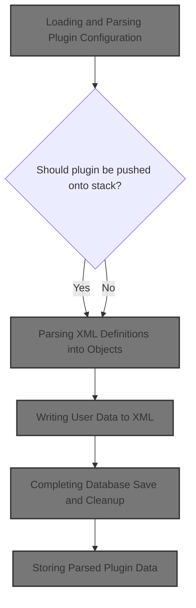
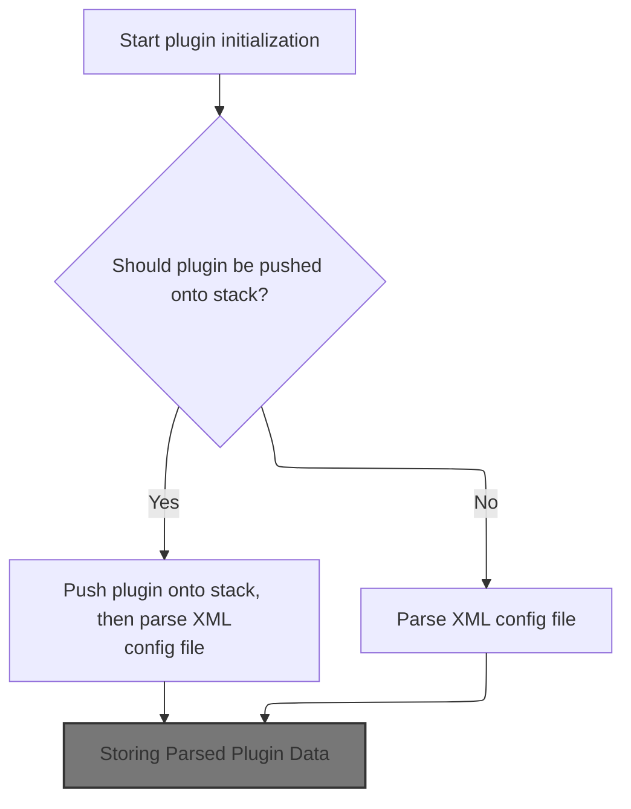
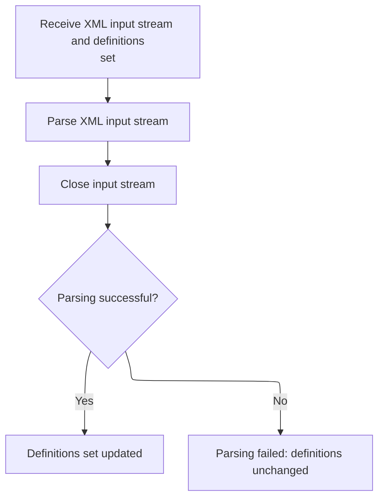

This document describes how plugin initialization is achieved by loading configuration from an XML file, parsing it into objects, and updating the user database. The process ensures that both plugin settings and user information are current and available for the system's operation.



# Loading and Parsing Plugin Configuration



<SwmSnippet path="/extras/src/main/java/org/apache/struts/plugins/DigestingPlugIn.java" line="96">

---

In <SwmToken path="extras/src/main/java/org/apache/struts/plugins/DigestingPlugIn.java" pos="96:5:5" line-data="    public void init(ActionServlet servlet, ModuleConfig config)">`init`</SwmToken>, we're setting up the Digester and loading the XML config file for the plugin. We push the plugin onto the stack if needed, then parse the config file. Next, we call <SwmToken path="tiles/src/main/java/org/apache/struts/tiles/xmlDefinition/XmlParser.java" pos="36:4:4" line-data="public class XmlParser">`XmlParser`</SwmToken> to actually process the XML and turn it into usable objects for the plugin.

```java
    public void init(ActionServlet servlet, ModuleConfig config)
        throws ServletException {
        this.servlet = servlet;
        this.moduleConfig = config;

        Object obj = null;

        Digester digester = this.initializeDigester();

        if (this.push) {
            log.debug("push == true; pushing plugin onto digester stack");
            digester.push(this);
        }

        try {
            log.debug("XML data file: [path: " + this.configPath + ", source: "
                + this.configSource + "]");

            URL configURL =
                this.getConfigURL(this.configPath, this.configSource);

            if (configURL == null) {
                throw new ServletException(
                    "Unable to locate XML data file at [path: "
                    + this.configPath + ", source: " + this.configSource + "]");
            }

            URLConnection conn = configURL.openConnection();

            conn.setUseCaches(false);
            conn.connect();
            obj = digester.parse(conn.getInputStream());
        } catch (IOException e) {
            // TODO Internationalize msg
            log.error("Exception processing config", e);
            throw new ServletException(e);
        } catch (SAXException e) {
            // TODO Internationalize msg
            log.error("Exception processing config", e);
            throw new ServletException(e);
        }

```

---

</SwmSnippet>

## Parsing XML Definitions into Objects



<SwmSnippet path="/tiles/src/main/java/org/apache/struts/tiles/xmlDefinition/XmlParser.java" line="275">

---

<SwmToken path="tiles/src/main/java/org/apache/struts/tiles/xmlDefinition/XmlParser.java" pos="275:5:5" line-data="  public void parse( InputStream in, XmlDefinitionsSet definitions ) throws IOException, SAXException">`parse`</SwmToken> pushes the definitions set onto the digester stack and parses the XML input stream, filling the definitions object. After parsing, we close the stream. Next, we call <SwmToken path="apps/faces-example1/src/main/java/org/apache/struts/webapp/example/memory/MemoryUserDatabase.java" pos="53:6:6" line-data="public final class MemoryUserDatabase implements UserDatabase {">`MemoryUserDatabase`</SwmToken> to handle user data, which is likely needed for further processing or storage.

```java
  public void parse( InputStream in, XmlDefinitionsSet definitions ) throws IOException, SAXException
  {
    try
    {
      // set first object in stack
    //digester.clear();
    digester.push(definitions);
      // parse
      digester.parse(in);
      in.close();
      }
  catch (SAXException e)
    {
      //throw new ServletException( "Error while parsing " + mappingConfig, e);
    throw e;
      }

  }
```

---

</SwmSnippet>

## Finalizing User Database Changes

<SwmSnippet path="/apps/faces-example1/src/main/java/org/apache/struts/webapp/example/memory/MemoryUserDatabase.java" line="106">

---

<SwmToken path="apps/faces-example1/src/main/java/org/apache/struts/webapp/example/memory/MemoryUserDatabase.java" pos="106:5:5" line-data="    public void close() throws Exception {">`close`</SwmToken> just calls <SwmToken path="apps/faces-example1/src/main/java/org/apache/struts/webapp/example/memory/MemoryUserDatabase.java" pos="108:1:1" line-data="        save();">`save`</SwmToken> to persist any changes to the user database. Next, we call <SwmToken path="apps/faces-example1/src/main/java/org/apache/struts/webapp/example/memory/MemoryUserDatabase.java" pos="108:1:1" line-data="        save();">`save`</SwmToken> to actually write the data out.

```java
    public void close() throws Exception {

        save();

    }
```

---

</SwmSnippet>

## Writing User Data to XML

<SwmSnippet path="/apps/faces-example1/src/main/java/org/apache/struts/webapp/example/memory/MemoryUserDatabase.java" line="257">

---

In <SwmToken path="apps/faces-example1/src/main/java/org/apache/struts/webapp/example/memory/MemoryUserDatabase.java" pos="257:5:5" line-data="    public void save() throws Exception {">`save`</SwmToken>, we're writing the user database to XML using a temporary file for atomicity. We start by printing the XML prolog and root element, then loop through users (from <SwmToken path="apps/faces-example1/src/main/java/org/apache/struts/webapp/example/memory/MemoryUserDatabase.java" pos="277:9:9" line-data="            User users[] = findUsers();">`findUsers`</SwmToken>) and their subscriptions, writing each as XML. Next, we need to actually fetch the users array, so we call <SwmToken path="apps/faces-example1/src/main/java/org/apache/struts/webapp/example/memory/MemoryUserDatabase.java" pos="277:9:9" line-data="            User users[] = findUsers();">`findUsers`</SwmToken>.

```java
    public void save() throws Exception {

        if (log.isDebugEnabled()) {
            log.debug("Saving database to '" + pathname + "'");
        }
        File fileNew = new File(pathnameNew);
        PrintWriter writer = null;

        try {

            // Configure our PrintWriter
            FileOutputStream fos = new FileOutputStream(fileNew);
            OutputStreamWriter osw = new OutputStreamWriter(fos);
            writer = new PrintWriter(osw);

            // Print the file prolog
            writer.println("<?xml version='1.0'?>");
            writer.println("<database>");

            // Print entries for each defined user and associated subscriptions
            User users[] = findUsers();
```

---

</SwmSnippet>

<SwmSnippet path="/apps/faces-example1/src/main/java/org/apache/struts/webapp/example/memory/MemoryUserDatabase.java" line="160">

---

<SwmToken path="apps/faces-example1/src/main/java/org/apache/struts/webapp/example/memory/MemoryUserDatabase.java" pos="160:7:7" line-data="    public User[] findUsers() {">`findUsers`</SwmToken> grabs a snapshot of the users collection as an array, synchronizing for thread safety. This ensures the array we return is consistent. Back in <SwmToken path="apps/faces-example1/src/main/java/org/apache/struts/webapp/example/memory/MemoryUserDatabase.java" pos="108:1:1" line-data="        save();">`save`</SwmToken>, we use this array to write out each user and their subscriptions as XML.

```java
    public User[] findUsers() {

        synchronized (users) {
            User results[] = new User[users.size()];
            return ((User[]) users.values().toArray(results));
        }

    }
```

---

</SwmSnippet>

<SwmSnippet path="/apps/faces-example1/src/main/java/org/apache/struts/webapp/example/memory/MemoryUserDatabase.java" line="278">

---

We just got the users array from <SwmToken path="apps/faces-example1/src/main/java/org/apache/struts/webapp/example/memory/MemoryUserDatabase.java" pos="160:7:7" line-data="    public User[] findUsers() {">`findUsers`</SwmToken>, and now we're looping through it to write each user and their subscriptions as XML. This depends on User and Subscription <SwmToken path="tiles/src/main/java/org/apache/struts/tiles/xmlDefinition/XmlParser.java" pos="75:13:15" line-data="          digester.register(registrations[i], url.toString());">`toString()`</SwmToken> methods producing valid XML fragments.

```java
            for (int i = 0; i < users.length; i++) {
                writer.print("  ");
                writer.println(users[i]);
                Subscription subscriptions[] =
                    users[i].getSubscriptions();
                for (int j = 0; j < subscriptions.length; j++) {
                    writer.print("    ");
                    writer.println(subscriptions[j]);
                    writer.print("    ");
                    writer.println("</subscription>");
                }
                writer.print("  ");
                writer.println("</user>");
            }
```

---

</SwmSnippet>

<SwmSnippet path="/apps/faces-example1/src/main/java/org/apache/struts/webapp/example/memory/MemoryUserDatabase.java" line="293">

---

After writing all users and subscriptions, we finish the XML by closing the root element. If there's a write error, we clean up and throw an exception. Next, we handle cleanup and error reporting.

```java
            // Print the file epilog
            writer.println("</database>");

            // Check for errors that occurred while printing
            if (writer.checkError()) {
                writer.close();
```

---

</SwmSnippet>

<SwmSnippet path="/apps/faces-example1/src/main/java/org/apache/struts/webapp/example/memory/MemoryUserDatabase.java" line="299">

---

We just finished writing the XML in <SwmToken path="apps/faces-example1/src/main/java/org/apache/struts/webapp/example/memory/MemoryUserDatabase.java" pos="108:1:1" line-data="        save();">`save`</SwmToken>. If there's an error, we delete the temp file and throw. Next, we move on to RegistrationBacking to handle user registration cleanup or updates.

```java
                fileNew.delete();
                throw new IOException
                    ("Saving database to '" + pathname + "'");
            }
```

---

</SwmSnippet>

### Removing User Registration

See <SwmLink doc-title="Deleting a Subscription">[Deleting a Subscription](/.swm/deleting-a-subscription.id58gn3d.sw.md)</SwmLink>

### Completing Database Save and Cleanup

```mermaid
%%{init: {"flowchart": {"defaultRenderer": "elk"}} }%%
flowchart TD
  node1["Write new user data to temporary file"]
  click node1 openCode "apps/faces-example1/src/main/java/org/apache/struts/webapp/example/memory/MemoryUserDatabase.java:303:305"
  node1 --> node2{"Did writing succeed?"}
  click node2 openCode "apps/faces-example1/src/main/java/org/apache/struts/webapp/example/memory/MemoryUserDatabase.java:306:312"
  node2 -->|"No"| node3["Delete temporary file and report failure"]
  click node3 openCode "apps/faces-example1/src/main/java/org/apache/struts/webapp/example/memory/MemoryUserDatabase.java:311:312"
  node2 -->|"Yes"| node4{"Does original file exist?"}
  click node4 openCode "apps/faces-example1/src/main/java/org/apache/struts/webapp/example/memory/MemoryUserDatabase.java:320:326"
  node4 -->|"Yes"| node5["Backup original file (rename original to
backup)"]
  click node5 openCode "apps/faces-example1/src/main/java/org/apache/struts/webapp/example/memory/MemoryUserDatabase.java:321:325"
  node4 -->|"No"| node6["Proceed to replace original"]
  click node6 openCode "apps/faces-example1/src/main/java/org/apache/struts/webapp/example/memory/MemoryUserDatabase.java:327:334"
  node5 --> node6
  node6 --> node7{"Did replacement succeed?"}
  click node7 openCode "apps/faces-example1/src/main/java/org/apache/struts/webapp/example/memory/MemoryUserDatabase.java:327:333"
  node7 -->|"Yes"| node8["Delete backup and finish"]
  click node8 openCode "apps/faces-example1/src/main/java/org/apache/struts/webapp/example/memory/MemoryUserDatabase.java:334:334"
  node7 -->|"No"| node9["Attempt to restore backup and report
failure"]
  click node9 openCode "apps/faces-example1/src/main/java/org/apache/struts/webapp/example/memory/MemoryUserDatabase.java:328:333"

classDef HeadingStyle fill:#777777,stroke:#333,stroke-width:2px;

%% Swimm:
%% %%{init: {"flowchart": {"defaultRenderer": "elk"}} }%%
%% flowchart TD
%%   node1["Write new user data to temporary file"]
%%   click node1 openCode "<SwmPath>[apps/…/memory/MemoryUserDatabase.java](apps/faces-example1/src/main/java/org/apache/struts/webapp/example/memory/MemoryUserDatabase.java)</SwmPath>:303:305"
%%   node1 --> node2{"Did writing succeed?"}
%%   click node2 openCode "<SwmPath>[apps/…/memory/MemoryUserDatabase.java](apps/faces-example1/src/main/java/org/apache/struts/webapp/example/memory/MemoryUserDatabase.java)</SwmPath>:306:312"
%%   node2 -->|"No"| node3["Delete temporary file and report failure"]
%%   click node3 openCode "<SwmPath>[apps/…/memory/MemoryUserDatabase.java](apps/faces-example1/src/main/java/org/apache/struts/webapp/example/memory/MemoryUserDatabase.java)</SwmPath>:311:312"
%%   node2 -->|"Yes"| node4{"Does original file exist?"}
%%   click node4 openCode "<SwmPath>[apps/…/memory/MemoryUserDatabase.java](apps/faces-example1/src/main/java/org/apache/struts/webapp/example/memory/MemoryUserDatabase.java)</SwmPath>:320:326"
%%   node4 -->|"Yes"| node5["Backup original file (rename original to
%% backup)"]
%%   click node5 openCode "<SwmPath>[apps/…/memory/MemoryUserDatabase.java](apps/faces-example1/src/main/java/org/apache/struts/webapp/example/memory/MemoryUserDatabase.java)</SwmPath>:321:325"
%%   node4 -->|"No"| node6["Proceed to replace original"]
%%   click node6 openCode "<SwmPath>[apps/…/memory/MemoryUserDatabase.java](apps/faces-example1/src/main/java/org/apache/struts/webapp/example/memory/MemoryUserDatabase.java)</SwmPath>:327:334"
%%   node5 --> node6
%%   node6 --> node7{"Did replacement succeed?"}
%%   click node7 openCode "<SwmPath>[apps/…/memory/MemoryUserDatabase.java](apps/faces-example1/src/main/java/org/apache/struts/webapp/example/memory/MemoryUserDatabase.java)</SwmPath>:327:333"
%%   node7 -->|"Yes"| node8["Delete backup and finish"]
%%   click node8 openCode "<SwmPath>[apps/…/memory/MemoryUserDatabase.java](apps/faces-example1/src/main/java/org/apache/struts/webapp/example/memory/MemoryUserDatabase.java)</SwmPath>:334:334"
%%   node7 -->|"No"| node9["Attempt to restore backup and report
%% failure"]
%%   click node9 openCode "<SwmPath>[apps/…/memory/MemoryUserDatabase.java](apps/faces-example1/src/main/java/org/apache/struts/webapp/example/memory/MemoryUserDatabase.java)</SwmPath>:328:333"
%% 
%% classDef HeadingStyle fill:#777777,stroke:#333,stroke-width:2px;
```



<SwmSnippet path="/apps/faces-example1/src/main/java/org/apache/struts/webapp/example/memory/MemoryUserDatabase.java" line="303">

---

We just came back from RegistrationBacking, and now in <SwmToken path="apps/faces-example1/src/main/java/org/apache/struts/webapp/example/memory/MemoryUserDatabase.java" pos="108:1:1" line-data="        save();">`save`</SwmToken>, we're making sure the writer is closed if there's an error. Next, we continue with file renaming and final cleanup in the database save.

```java
            writer.close();
            writer = null;

        } catch (IOException e) {

            if (writer != null) {
                writer.close();
            }
```

---

</SwmSnippet>

<SwmSnippet path="/apps/faces-example1/src/main/java/org/apache/struts/webapp/example/memory/MemoryUserDatabase.java" line="311">

---

We just finished error handling in <SwmToken path="apps/faces-example1/src/main/java/org/apache/struts/webapp/example/memory/MemoryUserDatabase.java" pos="317:15:15" line-data="        // Perform the required renames to permanently save this file">`save`</SwmToken>. Now, we rename files to make the save atomic, delete backups, and ensure the database is safely persisted. Next, RegistrationBacking might be called to update or clean up user registration info.

```java
            fileNew.delete();
            throw e;

        }


        // Perform the required renames to permanently save this file
        File fileOrig = new File(pathname);
        File fileOld = new File(pathnameOld);
        if (fileOrig.exists()) {
            fileOld.delete();
            if (!fileOrig.renameTo(fileOld)) {
                throw new IOException
                    ("Renaming '" + pathname + "' to '" + pathnameOld + "'");
            }
        }
        if (!fileNew.renameTo(fileOrig)) {
            if (fileOld.exists()) {
                fileOld.renameTo(fileOrig);
            }
            throw new IOException
                ("Renaming '" + pathnameNew + "' to '" + pathname + "'");
        }
        fileOld.delete();

    }
```

---

</SwmSnippet>

## Storing Parsed Plugin Data

<SwmSnippet path="/extras/src/main/java/org/apache/struts/plugins/DigestingPlugIn.java" line="138">

---

We just finished parsing XML in <SwmToken path="tiles/src/main/java/org/apache/struts/tiles/xmlDefinition/XmlParser.java" pos="36:4:4" line-data="public class XmlParser">`XmlParser`</SwmToken>, and now in <SwmToken path="extras/src/main/java/org/apache/struts/plugins/DigestingPlugIn.java" pos="96:5:5" line-data="    public void init(ActionServlet servlet, ModuleConfig config)">`init`</SwmToken>, we're storing the resulting object for later use by the plugin. This makes the parsed config available to the rest of the system.

```java
        this.storeGeneratedObject(obj);
    }
```

---

</SwmSnippet>

&nbsp;

*This is an auto-generated document by Swimm 🌊 and has not yet been verified by a human*

<SwmMeta version="3.0.0" repo-id="Z2l0aHViJTNBJTNBc3RydXRzMSUzQSUzQVN3aW1tLURlbW8=" repo-name="struts1"><sup>Powered by [Swimm](https://app.swimm.io/)</sup></SwmMeta>
