This document describes how parameters from an HTTP request are extracted and used to populate a bean, supporting both standard and multipart forms such as file uploads. The flow merges parameters from all sources, applies filtering rules, and populates the bean with the resulting data.

# Extracting Parameters and Handling Multipart Requests

<SwmSnippet path="/core/src/main/java/org/apache/struts/util/RequestUtils.java" line="363">

---

In <SwmToken path="core/src/main/java/org/apache/struts/util/RequestUtils.java" pos="363:7:7" line-data="    public static void populate(Object bean, String prefix, String suffix,">`populate`</SwmToken>, we figure out if the request is a multipart POST and, if so, make sure the bean is an <SwmToken path="core/src/main/java/org/apache/struts/util/RequestUtils.java" pos="379:8:8" line-data="        if (bean instanceof ActionForm) {">`ActionForm`</SwmToken>. We clear any previous multipart handler, then call <SwmToken path="core/src/main/java/org/apache/struts/util/RequestUtils.java" pos="400:5:5" line-data="            multipartHandler = getMultipartHandler(request);">`getMultipartHandler`</SwmToken> to grab the right handler for this request. This is needed to process file uploads and extract multipart parameters, since regular parameter extraction won't work for multipart data.

```java
    public static void populate(Object bean, String prefix, String suffix,
        HttpServletRequest request)
        throws ServletException {
        // Build a list of relevant request parameters from this request
        HashMap properties = new HashMap();

        // Iterator of parameter names
        Enumeration names = null;

        // Map for multipart parameters
        Map multipartParameters = null;

        String contentType = request.getContentType();
        String method = request.getMethod();
        boolean isMultipart = false;

        if (bean instanceof ActionForm) {
            ((ActionForm) bean).setMultipartRequestHandler(null);
        }

        MultipartRequestHandler multipartHandler = null;
        if ((contentType != null)
            && (contentType.startsWith("multipart/form-data"))
            && (method.equalsIgnoreCase("POST"))) {
            // Get the ActionServletWrapper from the form bean
            ActionServletWrapper servlet;

            if (bean instanceof ActionForm) {
                servlet = ((ActionForm) bean).getServletWrapper();
            } else {
                throw new ServletException("bean that's supposed to be "
                    + "populated from a multipart request is not of type "
                    + "\"org.apache.struts.action.ActionForm\", but type "
                    + "\"" + bean.getClass().getName() + "\"");
            }

            // Obtain a MultipartRequestHandler
            multipartHandler = getMultipartHandler(request);

```

---

</SwmSnippet>

<SwmSnippet path="/core/src/main/java/org/apache/struts/util/RequestUtils.java" line="566">

---

<SwmToken path="core/src/main/java/org/apache/struts/util/RequestUtils.java" pos="566:7:7" line-data="    private static MultipartRequestHandler getMultipartHandler(">`getMultipartHandler`</SwmToken> checks for a handler class name in the request attribute (for per-request overrides), tries to instantiate it, and if that fails, falls back to the global handler from the module config. If neither works, it returns null. This lets Struts support both custom and default multipart handling.

```java
    private static MultipartRequestHandler getMultipartHandler(
        HttpServletRequest request)
        throws ServletException {
        MultipartRequestHandler multipartHandler = null;
        String multipartClass =
            (String) request.getAttribute(Globals.MULTIPART_KEY);

        request.removeAttribute(Globals.MULTIPART_KEY);

        // Try to initialize the mapping specific request handler
        if (multipartClass != null) {
            try {
                multipartHandler =
                    (MultipartRequestHandler) applicationInstance(multipartClass);
            } catch (ClassNotFoundException cnfe) {
                log.error("MultipartRequestHandler class \"" + multipartClass
                    + "\" in mapping class not found, "
                    + "defaulting to global multipart class");
            } catch (InstantiationException ie) {
                log.error("InstantiationException when instantiating "
                    + "MultipartRequestHandler \"" + multipartClass + "\", "
                    + "defaulting to global multipart class, exception: "
                    + ie.getMessage());
            } catch (IllegalAccessException iae) {
                log.error("IllegalAccessException when instantiating "
                    + "MultipartRequestHandler \"" + multipartClass + "\", "
                    + "defaulting to global multipart class, exception: "
                    + iae.getMessage());
            }

            if (multipartHandler != null) {
                return multipartHandler;
            }
        }

        ModuleConfig moduleConfig =
            ModuleUtils.getInstance().getModuleConfig(request);

        multipartClass = moduleConfig.getControllerConfig().getMultipartClass();

        // Try to initialize the global request handler
        if (multipartClass != null) {
            try {
                multipartHandler =
                    (MultipartRequestHandler) applicationInstance(multipartClass);
            } catch (ClassNotFoundException cnfe) {
                throw new ServletException("Cannot find multipart class \""
                    + multipartClass + "\"", cnfe);
            } catch (InstantiationException ie) {
                throw new ServletException(
                    "InstantiationException when instantiating "
                    + "multipart class \"" + multipartClass + "\"", ie);
            } catch (IllegalAccessException iae) {
                throw new ServletException(
                    "IllegalAccessException when instantiating "
                    + "multipart class \"" + multipartClass + "\"", iae);
            }

            if (multipartHandler != null) {
                return multipartHandler;
            }
        }

        return multipartHandler;
    }
```

---

</SwmSnippet>

<SwmSnippet path="/core/src/main/java/org/apache/struts/util/RequestUtils.java" line="402">

---

Back in <SwmToken path="core/src/main/java/org/apache/struts/util/RequestUtils.java" pos="363:7:7" line-data="    public static void populate(Object bean, String prefix, String suffix,">`populate`</SwmToken>, after getting and initializing the multipart handler, we check for upload size limits and, if all is good, call <SwmToken path="core/src/main/java/org/apache/struts/util/RequestUtils.java" pos="425:1:1" line-data="                    getAllParametersForMultipartRequest(request,">`getAllParametersForMultipartRequest`</SwmToken> to pull out all form fields and files from the multipart request. This is how Struts gets the actual data for multipart forms.

```java
            if (multipartHandler != null) {
                isMultipart = true;

                // Set servlet and mapping info
                servlet.setServletFor(multipartHandler);
                multipartHandler.setMapping((ActionMapping) request
                    .getAttribute(Globals.MAPPING_KEY));

                // Initialize multipart request class handler
                multipartHandler.handleRequest(request);

                //stop here if the maximum length has been exceeded
                Boolean maxLengthExceeded =
                    (Boolean) request.getAttribute(MultipartRequestHandler.ATTRIBUTE_MAX_LENGTH_EXCEEDED);

                if ((maxLengthExceeded != null)
                    && (maxLengthExceeded.booleanValue())) {
                    ((ActionForm) bean).setMultipartRequestHandler(multipartHandler);
                    return;
                }

                //retrieve form values and put into properties
                multipartParameters =
                    getAllParametersForMultipartRequest(request,
                        multipartHandler);
                names = Collections.enumeration(multipartParameters.keySet());
            }
        }

```

---

</SwmSnippet>

## Merging Multipart and Standard Parameters

<SwmSnippet path="/core/src/main/java/org/apache/struts/util/RequestUtils.java" line="644">

---

In <SwmToken path="core/src/main/java/org/apache/struts/util/RequestUtils.java" pos="644:7:7" line-data="    private static Map getAllParametersForMultipartRequest(">`getAllParametersForMultipartRequest`</SwmToken>, we grab all elements from the multipart handler and add them to the parameters map. This covers everything the handler parsed from the multipart request, but we might need to merge in more data if the request is wrapped.

```java
    private static Map getAllParametersForMultipartRequest(
        HttpServletRequest request, MultipartRequestHandler multipartHandler) {
        Map parameters = new HashMap();
        Hashtable elements = multipartHandler.getAllElements();
        Enumeration e = elements.keys();

        while (e.hasMoreElements()) {
            String key = (String) e.nextElement();

            parameters.put(key, elements.get(key));
        }
```

---

</SwmSnippet>

<SwmSnippet path="/core/src/main/java/org/apache/struts/util/RequestUtils.java" line="656">

---

Here, we check if the request is a <SwmToken path="core/src/main/java/org/apache/struts/util/RequestUtils.java" pos="656:8:8" line-data="        if (request instanceof MultipartRequestWrapper) {">`MultipartRequestWrapper`</SwmToken>. If so, we unwrap it to access the original request's parameters, making sure nothing is missed during parameter extraction.

```java
        if (request instanceof MultipartRequestWrapper) {
            request =
                (HttpServletRequest) ((MultipartRequestWrapper) request)
                .getRequest();
```

---

</SwmSnippet>

<SwmSnippet path="/core/src/main/java/org/apache/struts/util/RequestUtils.java" line="660">

---

Now that we're back in <SwmToken path="core/src/main/java/org/apache/struts/util/RequestUtils.java" pos="425:1:1" line-data="                    getAllParametersForMultipartRequest(request,">`getAllParametersForMultipartRequest`</SwmToken> with the unwrapped request, we enumerate all parameter names to pull in any values that might not have been handled by the multipart handler.

```java
            e = request.getParameterNames();

```

---

</SwmSnippet>

<SwmSnippet path="/core/src/main/java/org/apache/struts/util/RequestUtils.java" line="662">

---

Finally, after merging parameters from both the multipart handler and the unwrapped request, <SwmToken path="core/src/main/java/org/apache/struts/util/RequestUtils.java" pos="425:1:1" line-data="                    getAllParametersForMultipartRequest(request,">`getAllParametersForMultipartRequest`</SwmToken> returns the complete map. This guarantees that all form data is available for the rest of the population logic.

```java
            while (e.hasMoreElements()) {
                String key = (String) e.nextElement();

                parameters.put(key, request.getParameterValues(key));
            }
        } else {
            log.debug("Gathering multipart parameters for unwrapped request");
        }

        return parameters;
    }
```

---

</SwmSnippet>

## Filtering and Preparing Parameters for Bean Population

```mermaid
%%{init: {"flowchart": {"defaultRenderer": "elk"}} }%%
flowchart TD
    node1["Start: Prepare to populate bean from
request"] --> node2{"Is request multipart?"}
    click node1 openCode "core/src/main/java/org/apache/struts/util/RequestUtils.java:431:433"
    node2 -->|"Yes"| node3["Use multipart parameters"]
    click node2 openCode "core/src/main/java/org/apache/struts/util/RequestUtils.java:431:433"
    node2 -->|"No"| node4["Use standard request parameters"]
    click node3 openCode "core/src/main/java/org/apache/struts/util/RequestUtils.java:458:461"
    click node4 openCode "core/src/main/java/org/apache/struts/util/RequestUtils.java:432:433"
    node3 --> node5["Process parameters"]
    node4 --> node5
    
    subgraph loop1["For each parameter in request"]
        node5 --> node12["Get parameter value"]
        click node12 openCode "core/src/main/java/org/apache/struts/util/RequestUtils.java:456:463"
        node12 --> node13{"If multipart, rationalize file property"}
        click node13 openCode "core/src/main/java/org/apache/struts/util/RequestUtils.java:460:460"
        node13 -->|"Yes"| node6{"Matches prefix?"}
        node13 -->|"No"| node6
        click node6 openCode "core/src/main/java/org/apache/struts/util/RequestUtils.java:439:445"
        node6 -->|"No"| node5
        node6 -->|"Yes"| node7{"Matches suffix?"}
        click node7 openCode "core/src/main/java/org/apache/struts/util/RequestUtils.java:447:454"
        node7 -->|"No"| node5
        node7 -->|"Yes"| node8{"Is framework attribute?"}
        click node8 openCode "core/src/main/java/org/apache/struts/util/RequestUtils.java:467:468"
        node8 -->|"Yes"| node5
        node8 -->|"No"| node9["Add parameter to properties"]
        click node9 openCode "core/src/main/java/org/apache/struts/util/RequestUtils.java:468:469"
        node9 --> node5
    end
    node5 --> node10["Populate bean with properties"]
    click node10 openCode "core/src/main/java/org/apache/struts/util/RequestUtils.java:474:474"
    node10 --> node11["Set multipart handler if needed"]
    click node11 openCode "core/src/main/java/org/apache/struts/util/RequestUtils.java:478:483"

classDef HeadingStyle fill:#777777,stroke:#333,stroke-width:2px;

%% Swimm:
%% %%{init: {"flowchart": {"defaultRenderer": "elk"}} }%%
%% flowchart TD
%%     node1["Start: Prepare to populate bean from
%% request"] --> node2{"Is request multipart?"}
%%     click node1 openCode "<SwmPath>[core/…/util/RequestUtils.java](core/src/main/java/org/apache/struts/util/RequestUtils.java)</SwmPath>:431:433"
%%     node2 -->|"Yes"| node3["Use multipart parameters"]
%%     click node2 openCode "<SwmPath>[core/…/util/RequestUtils.java](core/src/main/java/org/apache/struts/util/RequestUtils.java)</SwmPath>:431:433"
%%     node2 -->|"No"| node4["Use standard request parameters"]
%%     click node3 openCode "<SwmPath>[core/…/util/RequestUtils.java](core/src/main/java/org/apache/struts/util/RequestUtils.java)</SwmPath>:458:461"
%%     click node4 openCode "<SwmPath>[core/…/util/RequestUtils.java](core/src/main/java/org/apache/struts/util/RequestUtils.java)</SwmPath>:432:433"
%%     node3 --> node5["Process parameters"]
%%     node4 --> node5
%%     
%%     subgraph loop1["For each parameter in request"]
%%         node5 --> node12["Get parameter value"]
%%         click node12 openCode "<SwmPath>[core/…/util/RequestUtils.java](core/src/main/java/org/apache/struts/util/RequestUtils.java)</SwmPath>:456:463"
%%         node12 --> node13{"If multipart, rationalize file property"}
%%         click node13 openCode "<SwmPath>[core/…/util/RequestUtils.java](core/src/main/java/org/apache/struts/util/RequestUtils.java)</SwmPath>:460:460"
%%         node13 -->|"Yes"| node6{"Matches prefix?"}
%%         node13 -->|"No"| node6
%%         click node6 openCode "<SwmPath>[core/…/util/RequestUtils.java](core/src/main/java/org/apache/struts/util/RequestUtils.java)</SwmPath>:439:445"
%%         node6 -->|"No"| node5
%%         node6 -->|"Yes"| node7{"Matches suffix?"}
%%         click node7 openCode "<SwmPath>[core/…/util/RequestUtils.java](core/src/main/java/org/apache/struts/util/RequestUtils.java)</SwmPath>:447:454"
%%         node7 -->|"No"| node5
%%         node7 -->|"Yes"| node8{"Is framework attribute?"}
%%         click node8 openCode "<SwmPath>[core/…/util/RequestUtils.java](core/src/main/java/org/apache/struts/util/RequestUtils.java)</SwmPath>:467:468"
%%         node8 -->|"Yes"| node5
%%         node8 -->|"No"| node9["Add parameter to properties"]
%%         click node9 openCode "<SwmPath>[core/…/util/RequestUtils.java](core/src/main/java/org/apache/struts/util/RequestUtils.java)</SwmPath>:468:469"
%%         node9 --> node5
%%     end
%%     node5 --> node10["Populate bean with properties"]
%%     click node10 openCode "<SwmPath>[core/…/util/RequestUtils.java](core/src/main/java/org/apache/struts/util/RequestUtils.java)</SwmPath>:474:474"
%%     node10 --> node11["Set multipart handler if needed"]
%%     click node11 openCode "<SwmPath>[core/…/util/RequestUtils.java](core/src/main/java/org/apache/struts/util/RequestUtils.java)</SwmPath>:478:483"
%% 
%% classDef HeadingStyle fill:#777777,stroke:#333,stroke-width:2px;
```



<SwmSnippet path="/core/src/main/java/org/apache/struts/util/RequestUtils.java" line="431">

---

Here, after returning from <SwmToken path="core/src/main/java/org/apache/struts/util/RequestUtils.java" pos="425:1:1" line-data="                    getAllParametersForMultipartRequest(request,">`getAllParametersForMultipartRequest`</SwmToken>, we check if the request isn't multipart. If it's not, we grab parameter names straight from the request. This keeps RequestUtils.populate working for both file uploads and regular forms.

```java
        if (!isMultipart) {
            names = request.getParameterNames();
        }

```

---

</SwmSnippet>

<SwmSnippet path="/core/src/main/java/org/apache/struts/util/RequestUtils.java" line="435">

---

Next, we loop through all parameter names, filtering by prefix and suffix if set, and skip anything starting with '<SwmToken path="core/src/main/java/org/apache/struts/util/RequestUtils.java" pos="466:8:12" line-data="            // such as &#39;org.apache.struts.action.CANCEL&#39;">`org.apache.struts`</SwmToken>.' so we don't set internal framework attributes on the bean. We grab parameter values from either the multipart map or the request, and collect them for population in RequestUtils.populate.

```java
        while (names.hasMoreElements()) {
            String name = (String) names.nextElement();
            String stripped = name;

            if (prefix != null) {
                if (!stripped.startsWith(prefix)) {
                    continue;
                }

                stripped = stripped.substring(prefix.length());
            }

            if (suffix != null) {
                if (!stripped.endsWith(suffix)) {
                    continue;
                }

                stripped =
                    stripped.substring(0, stripped.length() - suffix.length());
            }

            Object parameterValue = null;

            if (isMultipart) {
                parameterValue = multipartParameters.get(name);
                parameterValue = rationalizeMultipleFileProperty(bean, name, parameterValue);
            } else {
                parameterValue = request.getParameterValues(name);
            }

            // Populate parameters, except "standard" struts attributes
            // such as 'org.apache.struts.action.CANCEL'
            if (!(stripped.startsWith("org.apache.struts."))) {
                properties.put(stripped, parameterValue);
            }
        }

```

---

</SwmSnippet>

<SwmSnippet path="/core/src/main/java/org/apache/struts/util/RequestUtils.java" line="472">

---

Now we call <SwmToken path="core/src/main/java/org/apache/struts/util/RequestUtils.java" pos="474:1:3" line-data="            BeanUtils.populate(bean, properties);">`BeanUtils.populate`</SwmToken> to set all the collected properties on the bean in one shot. This step leverages <SwmToken path="core/src/main/java/org/apache/struts/util/RequestUtils.java" pos="474:1:1" line-data="            BeanUtils.populate(bean, properties);">`BeanUtils`</SwmToken> for property mapping and type conversion in RequestUtils.populate.

```java
        // Set the corresponding properties of our bean
        try {
            BeanUtils.populate(bean, properties);
```

---

</SwmSnippet>

<SwmSnippet path="/core/src/main/java/org/apache/struts/util/RequestUtils.java" line="475">

---

Finally, after populating the bean, we attach the multipart handler to the <SwmToken path="core/src/main/java/org/apache/struts/util/RequestUtils.java" pos="479:17:17" line-data="                // Set the multipart request handler for our ActionForm.">`ActionForm`</SwmToken> if needed. This wraps up RequestUtils.populate, making sure the form can access upload details later if required.

```java
        } catch (Exception e) {
            throw new ServletException("BeanUtils.populate", e);
        } finally {
            if (multipartHandler != null) {
                // Set the multipart request handler for our ActionForm.
                // If the bean isn't an ActionForm, an exception would have been
                // thrown earlier, so it's safe to assume that our bean is
                // in fact an ActionForm.
                ((ActionForm) bean).setMultipartRequestHandler(multipartHandler);
            }
        }
    }
```

---

</SwmSnippet>

&nbsp;

*This is an auto-generated document by Swimm 🌊 and has not yet been verified by a human*

<SwmMeta version="3.0.0" repo-id="Z2l0aHViJTNBJTNBc3RydXRzMSUzQSUzQVN3aW1tLURlbW8=" repo-name="struts1"><sup>Powered by [Swimm](https://app.swimm.io/)</sup></SwmMeta>
