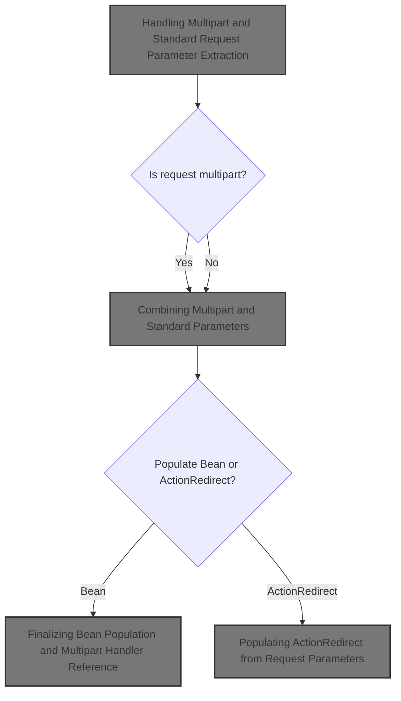
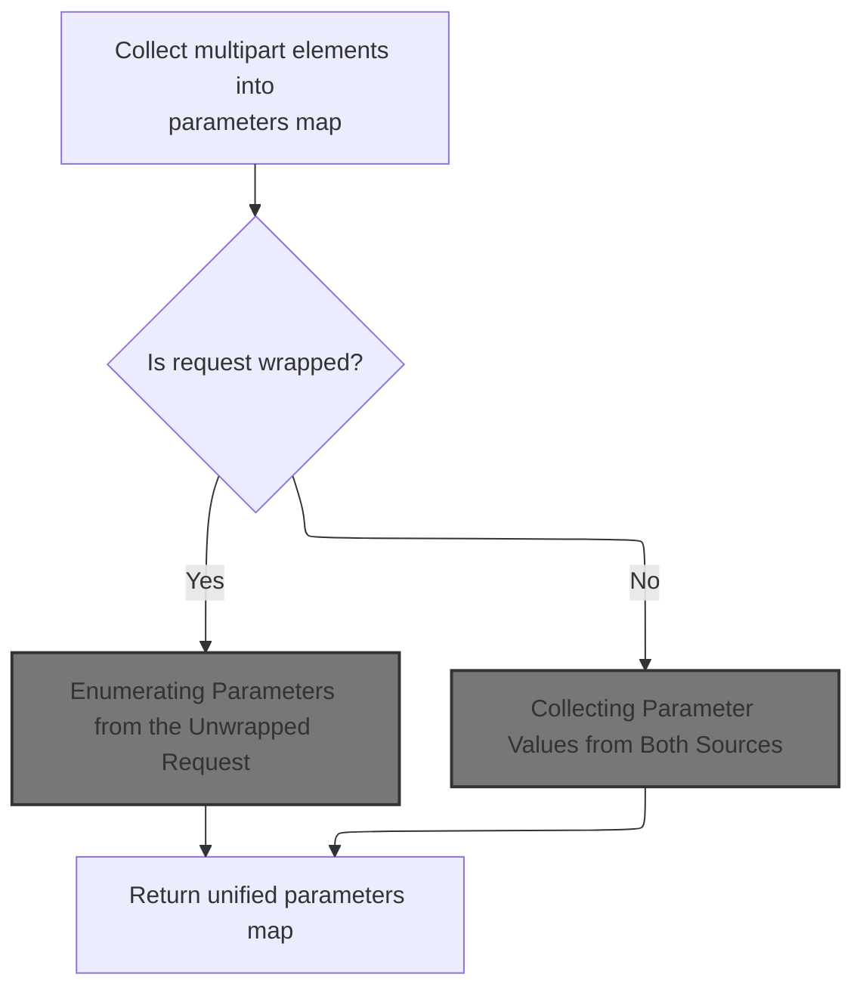
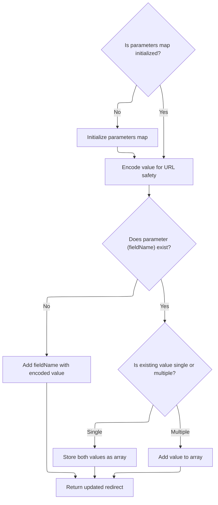

This document explains how HTTP request parameters, including standard fields and file uploads, are collected and mapped to Java objects. The flow supports user input handling by extracting parameters from the request and populating either a bean or an <SwmToken path="core/src/main/java/org/apache/struts/util/RequestUtils.java" pos="496:9:9" line-data="    public static void populate(ActionRedirect redirect, HttpServletRequest request) {">`ActionRedirect`</SwmToken>.



# Where is this flow used?

This flow is used multiple times in the codebase as represented in the following diagram:

```mermaid
graph TD;
      cfc2151cb282a07ad0e8ef89b53768505ca2d6be9e61823762e96d7815f4d163(core/…/action/RequestProcessor.java::RequestProcessor.processPopulate) --> 41225e4ca423d535d46ef28b25da7a7aebaba2b996c7d727af8b3a33a12a31fb(core/…/util/RequestUtils.java::RequestUtils.populate)

1f3af44bfff9bae4b8af237be5302e37d202c99867273a09e77b9f6144dee63a(core/…/action/RequestProcessor.java::RequestProcessor.process) --> cfc2151cb282a07ad0e8ef89b53768505ca2d6be9e61823762e96d7815f4d163(core/…/action/RequestProcessor.java::RequestProcessor.processPopulate)

294cd284fa406b4fe4f160157c73b79eaa7835613a545efd883ce1f14dd1ca7e(core/…/action/ActionServlet.java::ActionServlet.process) --> 1f3af44bfff9bae4b8af237be5302e37d202c99867273a09e77b9f6144dee63a(core/…/action/RequestProcessor.java::RequestProcessor.process)

dde35d78060f1afca84b5e9dedc002fc37669b07142e9d5a1f656107cc900aa0(core/…/action/ActionServlet.java::ActionServlet.doGet) --> 294cd284fa406b4fe4f160157c73b79eaa7835613a545efd883ce1f14dd1ca7e(core/…/action/ActionServlet.java::ActionServlet.process)

ec52fb7c28a6afaae4fd5937965ca776c6c12441d8a10e0b92b387b05c5c5cf5(core/…/action/ActionServlet.java::ActionServlet.doPost) --> 294cd284fa406b4fe4f160157c73b79eaa7835613a545efd883ce1f14dd1ca7e(core/…/action/ActionServlet.java::ActionServlet.process)

8a621e29539d7ec8103485c1826ea7ac430c2b3deba2e4e21eb89aae3dfd0db1(faces/…/application/ActionListenerImpl.java::ActionListenerImpl.processAction) --> 1f3af44bfff9bae4b8af237be5302e37d202c99867273a09e77b9f6144dee63a(core/…/action/RequestProcessor.java::RequestProcessor.process)

8a621e29539d7ec8103485c1826ea7ac430c2b3deba2e4e21eb89aae3dfd0db1(faces/…/application/ActionListenerImpl.java::ActionListenerImpl.processAction) --> 8a621e29539d7ec8103485c1826ea7ac430c2b3deba2e4e21eb89aae3dfd0db1(faces/…/application/ActionListenerImpl.java::ActionListenerImpl.processAction)

e1046609af2713777cf4d18bf40cb9072aa42052b9fe49ca1cf5f9b93c1b9a84(faces/…/application/FacesRequestProcessor.java::FacesRequestProcessor.processPopulate) --> cfc2151cb282a07ad0e8ef89b53768505ca2d6be9e61823762e96d7815f4d163(core/…/action/RequestProcessor.java::RequestProcessor.processPopulate)

3bfb5652829c219269c320328e6de2e3bbea342a80f33dee1b72db226663b497(faces/…/application/FacesTilesRequestProcessor.java::FacesTilesRequestProcessor.processPopulate) --> cfc2151cb282a07ad0e8ef89b53768505ca2d6be9e61823762e96d7815f4d163(core/…/action/RequestProcessor.java::RequestProcessor.processPopulate)

1ff4bf3c4c08b6df4e586062406fa006172960720bc32660f1fe38bd33d34f94(core/…/servlet/PopulateActionForm.java::PopulateActionForm.populate) --> 41225e4ca423d535d46ef28b25da7a7aebaba2b996c7d727af8b3a33a12a31fb(core/…/util/RequestUtils.java::RequestUtils.populate)


classDef mainFlowStyle color:#000000,fill:#7CB9F4
classDef rootsStyle color:#000000,fill:#00FFF4
classDef Style1 color:#000000,fill:#00FFAA
classDef Style2 color:#000000,fill:#FFFF00
classDef Style3 color:#000000,fill:#AA7CB9

%% Swimm:
%% graph TD;
%%       cfc2151cb282a07ad0e8ef89b53768505ca2d6be9e61823762e96d7815f4d163(<SwmPath>[core/…/action/RequestProcessor.java](core/src/main/java/org/apache/struts/action/RequestProcessor.java)</SwmPath>::RequestProcessor.processPopulate) --> 41225e4ca423d535d46ef28b25da7a7aebaba2b996c7d727af8b3a33a12a31fb(<SwmPath>[core/…/util/RequestUtils.java](core/src/main/java/org/apache/struts/util/RequestUtils.java)</SwmPath>::RequestUtils.populate)
%% 
%% 1f3af44bfff9bae4b8af237be5302e37d202c99867273a09e77b9f6144dee63a(<SwmPath>[core/…/action/RequestProcessor.java](core/src/main/java/org/apache/struts/action/RequestProcessor.java)</SwmPath>::RequestProcessor.process) --> cfc2151cb282a07ad0e8ef89b53768505ca2d6be9e61823762e96d7815f4d163(<SwmPath>[core/…/action/RequestProcessor.java](core/src/main/java/org/apache/struts/action/RequestProcessor.java)</SwmPath>::RequestProcessor.processPopulate)
%% 
%% 294cd284fa406b4fe4f160157c73b79eaa7835613a545efd883ce1f14dd1ca7e(<SwmPath>[core/…/action/ActionServlet.java](core/src/main/java/org/apache/struts/action/ActionServlet.java)</SwmPath>::ActionServlet.process) --> 1f3af44bfff9bae4b8af237be5302e37d202c99867273a09e77b9f6144dee63a(<SwmPath>[core/…/action/RequestProcessor.java](core/src/main/java/org/apache/struts/action/RequestProcessor.java)</SwmPath>::RequestProcessor.process)
%% 
%% dde35d78060f1afca84b5e9dedc002fc37669b07142e9d5a1f656107cc900aa0(<SwmPath>[core/…/action/ActionServlet.java](core/src/main/java/org/apache/struts/action/ActionServlet.java)</SwmPath>::ActionServlet.doGet) --> 294cd284fa406b4fe4f160157c73b79eaa7835613a545efd883ce1f14dd1ca7e(<SwmPath>[core/…/action/ActionServlet.java](core/src/main/java/org/apache/struts/action/ActionServlet.java)</SwmPath>::ActionServlet.process)
%% 
%% ec52fb7c28a6afaae4fd5937965ca776c6c12441d8a10e0b92b387b05c5c5cf5(<SwmPath>[core/…/action/ActionServlet.java](core/src/main/java/org/apache/struts/action/ActionServlet.java)</SwmPath>::ActionServlet.doPost) --> 294cd284fa406b4fe4f160157c73b79eaa7835613a545efd883ce1f14dd1ca7e(<SwmPath>[core/…/action/ActionServlet.java](core/src/main/java/org/apache/struts/action/ActionServlet.java)</SwmPath>::ActionServlet.process)
%% 
%% 8a621e29539d7ec8103485c1826ea7ac430c2b3deba2e4e21eb89aae3dfd0db1(<SwmPath>[faces/…/application/ActionListenerImpl.java](faces/src/main/java/org/apache/struts/faces/application/ActionListenerImpl.java)</SwmPath>::ActionListenerImpl.processAction) --> 1f3af44bfff9bae4b8af237be5302e37d202c99867273a09e77b9f6144dee63a(<SwmPath>[core/…/action/RequestProcessor.java](core/src/main/java/org/apache/struts/action/RequestProcessor.java)</SwmPath>::RequestProcessor.process)
%% 
%% 8a621e29539d7ec8103485c1826ea7ac430c2b3deba2e4e21eb89aae3dfd0db1(<SwmPath>[faces/…/application/ActionListenerImpl.java](faces/src/main/java/org/apache/struts/faces/application/ActionListenerImpl.java)</SwmPath>::ActionListenerImpl.processAction) --> 8a621e29539d7ec8103485c1826ea7ac430c2b3deba2e4e21eb89aae3dfd0db1(<SwmPath>[faces/…/application/ActionListenerImpl.java](faces/src/main/java/org/apache/struts/faces/application/ActionListenerImpl.java)</SwmPath>::ActionListenerImpl.processAction)
%% 
%% e1046609af2713777cf4d18bf40cb9072aa42052b9fe49ca1cf5f9b93c1b9a84(<SwmPath>[faces/…/application/FacesRequestProcessor.java](faces/src/main/java/org/apache/struts/faces/application/FacesRequestProcessor.java)</SwmPath>::FacesRequestProcessor.processPopulate) --> cfc2151cb282a07ad0e8ef89b53768505ca2d6be9e61823762e96d7815f4d163(<SwmPath>[core/…/action/RequestProcessor.java](core/src/main/java/org/apache/struts/action/RequestProcessor.java)</SwmPath>::RequestProcessor.processPopulate)
%% 
%% 3bfb5652829c219269c320328e6de2e3bbea342a80f33dee1b72db226663b497(<SwmPath>[faces/…/application/FacesTilesRequestProcessor.java](faces/src/main/java/org/apache/struts/faces/application/FacesTilesRequestProcessor.java)</SwmPath>::FacesTilesRequestProcessor.processPopulate) --> cfc2151cb282a07ad0e8ef89b53768505ca2d6be9e61823762e96d7815f4d163(<SwmPath>[core/…/action/RequestProcessor.java](core/src/main/java/org/apache/struts/action/RequestProcessor.java)</SwmPath>::RequestProcessor.processPopulate)
%% 
%% 1ff4bf3c4c08b6df4e586062406fa006172960720bc32660f1fe38bd33d34f94(<SwmPath>[core/…/servlet/PopulateActionForm.java](core/src/main/java/org/apache/struts/chain/commands/servlet/PopulateActionForm.java)</SwmPath>::PopulateActionForm.populate) --> 41225e4ca423d535d46ef28b25da7a7aebaba2b996c7d727af8b3a33a12a31fb(<SwmPath>[core/…/util/RequestUtils.java](core/src/main/java/org/apache/struts/util/RequestUtils.java)</SwmPath>::RequestUtils.populate)
%% 
%% 
%% classDef mainFlowStyle color:#000000,fill:#7CB9F4
%% classDef rootsStyle color:#000000,fill:#00FFF4
%% classDef Style1 color:#000000,fill:#00FFAA
%% classDef Style2 color:#000000,fill:#FFFF00
%% classDef Style3 color:#000000,fill:#AA7CB9
```



# Handling Multipart and Standard Request Parameter Extraction

```mermaid
%%{init: {"flowchart": {"defaultRenderer": "elk"}} }%%
flowchart TD
    node1["Start: Prepare to populate bean from
request"]
    click node1 openCode "core/src/main/java/org/apache/struts/util/RequestUtils.java:363:383"
    node1 --> node2{"Is request multipart?"}
    click node2 openCode "core/src/main/java/org/apache/struts/util/RequestUtils.java:384:429"
    node2 -->|"Yes"| node3["Combining Multipart and Standard Parameters"]
    
    node2 -->|"No"| node4["Switching to Standard Parameter Extraction if Not Multipart"]
    
    node3 --> node5
    node4 --> node5
    
    subgraph loop1["For each parameter in the request"]
      node5 --> node8{"Matches prefix/suffix?"}
      click node8 openCode "core/src/main/java/org/apache/struts/util/RequestUtils.java:435:455"
      node8 -->|"Yes"| node9{"Is not a Struts attribute?"}
      node8 -->|"No"| node11["Next parameter"]
      node9 -->|"Yes"| node10["Add parameter to properties"]
      click node10 openCode "core/src/main/java/org/apache/struts/util/RequestUtils.java:467:469"
      node9 -->|"No"| node11
      node10 --> node11
      node11["Next parameter"] --> node5
    end
    node5 --> node6["Populating ActionRedirect from Request Parameters"]
    
    node6 --> node7["Finish: Set multipart handler if needed"]
    click node7 openCode "core/src/main/java/org/apache/struts/util/RequestUtils.java:475:485"

classDef HeadingStyle fill:#777777,stroke:#333,stroke-width:2px;
click node3 goToHeading "Combining Multipart and Standard Parameters"
node3:::HeadingStyle
click node4 goToHeading "Switching to Standard Parameter Extraction if Not Multipart"
node4:::HeadingStyle
click node6 goToHeading "Populating ActionRedirect from Request Parameters"
node6:::HeadingStyle

%% Swimm:
%% %%{init: {"flowchart": {"defaultRenderer": "elk"}} }%%
%% flowchart TD
%%     node1["Start: Prepare to populate bean from
%% request"]
%%     click node1 openCode "<SwmPath>[core/…/util/RequestUtils.java](core/src/main/java/org/apache/struts/util/RequestUtils.java)</SwmPath>:363:383"
%%     node1 --> node2{"Is request multipart?"}
%%     click node2 openCode "<SwmPath>[core/…/util/RequestUtils.java](core/src/main/java/org/apache/struts/util/RequestUtils.java)</SwmPath>:384:429"
%%     node2 -->|"Yes"| node3["Combining Multipart and Standard Parameters"]
%%     
%%     node2 -->|"No"| node4["Switching to Standard Parameter Extraction if Not Multipart"]
%%     
%%     node3 --> node5
%%     node4 --> node5
%%     
%%     subgraph loop1["For each parameter in the request"]
%%       node5 --> node8{"Matches prefix/suffix?"}
%%       click node8 openCode "<SwmPath>[core/…/util/RequestUtils.java](core/src/main/java/org/apache/struts/util/RequestUtils.java)</SwmPath>:435:455"
%%       node8 -->|"Yes"| node9{"Is not a Struts attribute?"}
%%       node8 -->|"No"| node11["Next parameter"]
%%       node9 -->|"Yes"| node10["Add parameter to properties"]
%%       click node10 openCode "<SwmPath>[core/…/util/RequestUtils.java](core/src/main/java/org/apache/struts/util/RequestUtils.java)</SwmPath>:467:469"
%%       node9 -->|"No"| node11
%%       node10 --> node11
%%       node11["Next parameter"] --> node5
%%     end
%%     node5 --> node6["Populating <SwmToken path="core/src/main/java/org/apache/struts/util/RequestUtils.java" pos="496:9:9" line-data="    public static void populate(ActionRedirect redirect, HttpServletRequest request) {">`ActionRedirect`</SwmToken> from Request Parameters"]
%%     
%%     node6 --> node7["Finish: Set multipart handler if needed"]
%%     click node7 openCode "<SwmPath>[core/…/util/RequestUtils.java](core/src/main/java/org/apache/struts/util/RequestUtils.java)</SwmPath>:475:485"
%% 
%% classDef HeadingStyle fill:#777777,stroke:#333,stroke-width:2px;
%% click node3 goToHeading "Combining Multipart and Standard Parameters"
%% node3:::HeadingStyle
%% click node4 goToHeading "Switching to Standard Parameter Extraction if Not Multipart"
%% node4:::HeadingStyle
%% click node6 goToHeading "Populating <SwmToken path="core/src/main/java/org/apache/struts/util/RequestUtils.java" pos="496:9:9" line-data="    public static void populate(ActionRedirect redirect, HttpServletRequest request) {">`ActionRedirect`</SwmToken> from Request Parameters"
%% node6:::HeadingStyle
```



<SwmSnippet path="/core/src/main/java/org/apache/struts/util/RequestUtils.java" line="363">

---

In `RequestUtils.populate`, we're checking if the request is a multipart POST (file upload). If so, we make sure the bean is an <SwmToken path="core/src/main/java/org/apache/struts/util/RequestUtils.java" pos="379:8:8" line-data="        if (bean instanceof ActionForm) {">`ActionForm`</SwmToken>, grab its servlet wrapper, and then call <SwmToken path="core/src/main/java/org/apache/struts/util/RequestUtils.java" pos="400:5:5" line-data="            multipartHandler = getMultipartHandler(request);">`getMultipartHandler`</SwmToken> to get a handler that knows how to parse multipart data. This is where Struts switches from normal parameter extraction to handling file uploads and multipart form fields.

```java
    public static void populate(Object bean, String prefix, String suffix,
        HttpServletRequest request)
        throws ServletException {
        // Build a list of relevant request parameters from this request
        HashMap properties = new HashMap();

        // Iterator of parameter names
        Enumeration names = null;

        // Map for multipart parameters
        Map multipartParameters = null;

        String contentType = request.getContentType();
        String method = request.getMethod();
        boolean isMultipart = false;

        if (bean instanceof ActionForm) {
            ((ActionForm) bean).setMultipartRequestHandler(null);
        }

        MultipartRequestHandler multipartHandler = null;
        if ((contentType != null)
            && (contentType.startsWith("multipart/form-data"))
            && (method.equalsIgnoreCase("POST"))) {
            // Get the ActionServletWrapper from the form bean
            ActionServletWrapper servlet;

            if (bean instanceof ActionForm) {
                servlet = ((ActionForm) bean).getServletWrapper();
            } else {
                throw new ServletException("bean that's supposed to be "
                    + "populated from a multipart request is not of type "
                    + "\"org.apache.struts.action.ActionForm\", but type "
                    + "\"" + bean.getClass().getName() + "\"");
            }

            // Obtain a MultipartRequestHandler
            multipartHandler = getMultipartHandler(request);

```

---

</SwmSnippet>

<SwmSnippet path="/core/src/main/java/org/apache/struts/util/RequestUtils.java" line="566">

---

<SwmToken path="core/src/main/java/org/apache/struts/util/RequestUtils.java" pos="566:7:7" line-data="    private static MultipartRequestHandler getMultipartHandler(">`getMultipartHandler`</SwmToken> tries to find a multipart handler class name in the request (<SwmToken path="core/src/main/java/org/apache/struts/util/RequestUtils.java" pos="571:9:11" line-data="            (String) request.getAttribute(Globals.MULTIPART_KEY);">`Globals.MULTIPART_KEY`</SwmToken>), removes it, and tries to instantiate it. If that fails, it falls back to the module's global handler class. This lets Struts support both per-request and global multipart handling strategies.

```java
    private static MultipartRequestHandler getMultipartHandler(
        HttpServletRequest request)
        throws ServletException {
        MultipartRequestHandler multipartHandler = null;
        String multipartClass =
            (String) request.getAttribute(Globals.MULTIPART_KEY);

        request.removeAttribute(Globals.MULTIPART_KEY);

        // Try to initialize the mapping specific request handler
        if (multipartClass != null) {
            try {
                multipartHandler =
                    (MultipartRequestHandler) applicationInstance(multipartClass);
            } catch (ClassNotFoundException cnfe) {
                log.error("MultipartRequestHandler class \"" + multipartClass
                    + "\" in mapping class not found, "
                    + "defaulting to global multipart class");
            } catch (InstantiationException ie) {
                log.error("InstantiationException when instantiating "
                    + "MultipartRequestHandler \"" + multipartClass + "\", "
                    + "defaulting to global multipart class, exception: "
                    + ie.getMessage());
            } catch (IllegalAccessException iae) {
                log.error("IllegalAccessException when instantiating "
                    + "MultipartRequestHandler \"" + multipartClass + "\", "
                    + "defaulting to global multipart class, exception: "
                    + iae.getMessage());
            }

            if (multipartHandler != null) {
                return multipartHandler;
            }
        }

        ModuleConfig moduleConfig =
            ModuleUtils.getInstance().getModuleConfig(request);

        multipartClass = moduleConfig.getControllerConfig().getMultipartClass();

        // Try to initialize the global request handler
        if (multipartClass != null) {
            try {
                multipartHandler =
                    (MultipartRequestHandler) applicationInstance(multipartClass);
            } catch (ClassNotFoundException cnfe) {
                throw new ServletException("Cannot find multipart class \""
                    + multipartClass + "\"", cnfe);
            } catch (InstantiationException ie) {
                throw new ServletException(
                    "InstantiationException when instantiating "
                    + "multipart class \"" + multipartClass + "\"", ie);
            } catch (IllegalAccessException iae) {
                throw new ServletException(
                    "IllegalAccessException when instantiating "
                    + "multipart class \"" + multipartClass + "\"", iae);
            }

            if (multipartHandler != null) {
                return multipartHandler;
            }
        }

        return multipartHandler;
    }
```

---

</SwmSnippet>

<SwmSnippet path="/core/src/main/java/org/apache/struts/util/RequestUtils.java" line="402">

---

Back in `RequestUtils.populate`, after getting the multipart handler and letting it process the request, we check for upload size issues, then call <SwmToken path="core/src/main/java/org/apache/struts/util/RequestUtils.java" pos="425:1:1" line-data="                    getAllParametersForMultipartRequest(request,">`getAllParametersForMultipartRequest`</SwmToken> to grab all the parsed parameters (files and fields) for the rest of the population logic.

```java
            if (multipartHandler != null) {
                isMultipart = true;

                // Set servlet and mapping info
                servlet.setServletFor(multipartHandler);
                multipartHandler.setMapping((ActionMapping) request
                    .getAttribute(Globals.MAPPING_KEY));

                // Initialize multipart request class handler
                multipartHandler.handleRequest(request);

                //stop here if the maximum length has been exceeded
                Boolean maxLengthExceeded =
                    (Boolean) request.getAttribute(MultipartRequestHandler.ATTRIBUTE_MAX_LENGTH_EXCEEDED);

                if ((maxLengthExceeded != null)
                    && (maxLengthExceeded.booleanValue())) {
                    ((ActionForm) bean).setMultipartRequestHandler(multipartHandler);
                    return;
                }

                //retrieve form values and put into properties
                multipartParameters =
                    getAllParametersForMultipartRequest(request,
                        multipartHandler);
                names = Collections.enumeration(multipartParameters.keySet());
            }
        }

```

---

</SwmSnippet>

## Combining Multipart and Standard Parameters



<SwmSnippet path="/core/src/main/java/org/apache/struts/util/RequestUtils.java" line="644">

---

In <SwmToken path="core/src/main/java/org/apache/struts/util/RequestUtils.java" pos="644:7:7" line-data="    private static Map getAllParametersForMultipartRequest(">`getAllParametersForMultipartRequest`</SwmToken>, we grab all elements from the multipart handler, then if the request is a <SwmToken path="core/src/main/java/org/apache/struts/util/RequestUtils.java" pos="656:8:8" line-data="        if (request instanceof MultipartRequestWrapper) {">`MultipartRequestWrapper`</SwmToken>, we unwrap it and add any parameters from the original request too. This way, we cover both sources.

```java
    private static Map getAllParametersForMultipartRequest(
        HttpServletRequest request, MultipartRequestHandler multipartHandler) {
        Map parameters = new HashMap();
        Hashtable elements = multipartHandler.getAllElements();
        Enumeration e = elements.keys();

        while (e.hasMoreElements()) {
            String key = (String) e.nextElement();

            parameters.put(key, elements.get(key));
        }
```

---

</SwmSnippet>

<SwmSnippet path="/core/src/main/java/org/apache/struts/util/RequestUtils.java" line="656">

---

Here we check if the request is a <SwmToken path="core/src/main/java/org/apache/struts/util/RequestUtils.java" pos="656:8:8" line-data="        if (request instanceof MultipartRequestWrapper) {">`MultipartRequestWrapper`</SwmToken>. If it is, we unwrap it to get the original <SwmToken path="core/src/main/java/org/apache/struts/util/RequestUtils.java" pos="658:2:2" line-data="                (HttpServletRequest) ((MultipartRequestWrapper) request)">`HttpServletRequest`</SwmToken>. This is needed because some parameters might only be available on the unwrapped request, so we need to access it for a full parameter list.

```java
        if (request instanceof MultipartRequestWrapper) {
            request =
                (HttpServletRequest) ((MultipartRequestWrapper) request)
                .getRequest();
```

---

</SwmSnippet>

### Unwrapping the Request for Parameter Access

<SwmSnippet path="/core/src/main/java/org/apache/struts/chain/contexts/ServletActionContext.java" line="94">

---

<SwmToken path="core/src/main/java/org/apache/struts/chain/contexts/ServletActionContext.java" pos="94:5:5" line-data="    public HttpServletRequest getRequest() {">`getRequest`</SwmToken> just delegates to <SwmToken path="core/src/main/java/org/apache/struts/chain/contexts/ServletActionContext.java" pos="95:3:9" line-data="        return servletWebContext().getRequest();">`servletWebContext().getRequest()`</SwmToken>, so we can access the underlying <SwmToken path="core/src/main/java/org/apache/struts/chain/contexts/ServletActionContext.java" pos="94:3:3" line-data="    public HttpServletRequest getRequest() {">`HttpServletRequest`</SwmToken>. This is how we actually get to the original request object after unwrapping.

```java
    public HttpServletRequest getRequest() {
        return servletWebContext().getRequest();
    }
```

---

</SwmSnippet>

<SwmSnippet path="/core/src/main/java/org/apache/struts/chain/contexts/ServletActionContext.java" line="67">

---

<SwmToken path="core/src/main/java/org/apache/struts/chain/contexts/ServletActionContext.java" pos="67:5:5" line-data="    protected ServletWebContext servletWebContext() {">`servletWebContext`</SwmToken> just casts the base context to <SwmToken path="core/src/main/java/org/apache/struts/chain/contexts/ServletActionContext.java" pos="67:3:3" line-data="    protected ServletWebContext servletWebContext() {">`ServletWebContext`</SwmToken>. If <SwmToken path="core/src/main/java/org/apache/struts/chain/contexts/ServletActionContext.java" pos="68:9:11" line-data="        return (ServletWebContext) this.getBaseContext();">`getBaseContext()`</SwmToken> isn't what we expect, this will blow up, but Struts assumes the context is always right here.

```java
    protected ServletWebContext servletWebContext() {
        return (ServletWebContext) this.getBaseContext();
    }
```

---

</SwmSnippet>

### Enumerating Parameters from the Unwrapped Request

<SwmSnippet path="/core/src/main/java/org/apache/struts/util/RequestUtils.java" line="660">

---

Just got back from unwrapping the request using <SwmToken path="core/src/main/java/org/apache/struts/chain/contexts/ServletActionContext.java" pos="39:4:4" line-data="public class ServletActionContext extends WebActionContext {">`ServletActionContext`</SwmToken>. Now in `RequestUtils.getAllParametersForMultipartRequest`, we grab all parameter names from the unwrapped request. This is needed because some parameters might only be present on the original request, not the wrapper, so we need to enumerate them for a complete parameter map.

```java
            e = request.getParameterNames();

```

---

</SwmSnippet>

### Merging Parameter Names from Multiple Sources

<SwmSnippet path="/core/src/main/java/org/apache/struts/upload/MultipartRequestWrapper.java" line="94">

---

In <SwmToken path="core/src/main/java/org/apache/struts/upload/MultipartRequestWrapper.java" pos="94:5:5" line-data="    public Enumeration getParameterNames() {">`getParameterNames`</SwmToken>, we start by getting parameter names from the original request, then we'll add any extra names from the multipart parameters. This way, the Enumeration we return covers both sources, so nothing gets missed.

```java
    public Enumeration getParameterNames() {
        Enumeration baseParams = getRequest().getParameterNames();
```

---

</SwmSnippet>

<SwmSnippet path="/core/src/main/java/org/apache/struts/upload/MultipartRequestWrapper.java" line="96">

---

Just returned from unwrapping the request. In `MultipartRequestWrapper.getParameterNames`, we collect all parameter names from both the original request and the multipart parameters into a Vector, then return them as a single Enumeration. This is how Struts merges both sources for parameter iteration.

```java
        Vector list = new Vector();

        while (baseParams.hasMoreElements()) {
            list.add(baseParams.nextElement());
        }
```

---

</SwmSnippet>

<SwmSnippet path="/core/src/main/java/org/apache/struts/upload/MultipartRequestWrapper.java" line="102">

---

The Enumeration returned here includes all parameter names from both the original request and the multipart parameters map. This only works if 'parameters' is a Map with a <SwmToken path="core/src/main/java/org/apache/struts/upload/MultipartRequestWrapper.java" pos="102:9:9" line-data="        Collection multipartParams = parameters.keySet();">`keySet`</SwmToken>, which is a Struts-specific detail.

```java
        Collection multipartParams = parameters.keySet();
        Iterator iterator = multipartParams.iterator();

        while (iterator.hasNext()) {
            list.add(iterator.next());
        }
```

---

</SwmSnippet>

### Collecting Parameter Values from Both Sources

<SwmSnippet path="/core/src/main/java/org/apache/struts/util/RequestUtils.java" line="662">

---

Just returned from `MultipartRequestWrapper.getParameterNames`. Now, in `RequestUtils.getAllParametersForMultipartRequest`, we loop over all parameter names and pull their values from the unwrapped request, adding them to our parameters map. This ensures we have a complete set of parameters from both the multipart handler and the original request.

```java
            while (e.hasMoreElements()) {
                String key = (String) e.nextElement();

                parameters.put(key, request.getParameterValues(key));
            }
        } else {
            log.debug("Gathering multipart parameters for unwrapped request");
        }

        return parameters;
    }
```

---

</SwmSnippet>

## Resolving Parameter Values with Fallback

<SwmSnippet path="/core/src/main/java/org/apache/struts/upload/MultipartRequestWrapper.java" line="118">

---

In <SwmToken path="core/src/main/java/org/apache/struts/upload/MultipartRequestWrapper.java" pos="118:7:7" line-data="    public String[] getParameterValues(String name) {">`getParameterValues`</SwmToken>, we first try to get the parameter values from the original request. If they're not there, we fall back to our local parameters map. This fallback is how Struts handles parameters that only exist in the multipart wrapper.

```java
    public String[] getParameterValues(String name) {
        String[] value = getRequest().getParameterValues(name);

```

---

</SwmSnippet>

<SwmSnippet path="/core/src/main/java/org/apache/struts/upload/MultipartRequestWrapper.java" line="121">

---

After unwrapping the request, in `MultipartRequestWrapper.getParameterValues`, if the original request doesn't have the parameter, we grab it from the local parameters map. This is how Struts ensures all parameters are available, no matter where they came from.

```java
        if (value == null) {
            value = (String[]) parameters.get(name);
        }

        return value;
    }
```

---

</SwmSnippet>

## Switching to Standard Parameter Extraction if Not Multipart

```mermaid
%%{init: {"flowchart": {"defaultRenderer": "elk"}} }%%
flowchart TD
    node1["Start: Prepare to populate bean from
request"]
    click node1 openCode "core/src/main/java/org/apache/struts/util/RequestUtils.java:431:432"
    node1 --> node2{"Is request multipart?"}
    click node2 openCode "core/src/main/java/org/apache/struts/util/RequestUtils.java:431:433"
    node2 -->|"No"| node3["Get parameter names from request"]
    click node3 openCode "core/src/main/java/org/apache/struts/util/RequestUtils.java:432:433"
    node2 -->|"Yes"| node3
    
    node3 --> node4["Process parameters"]
    click node4 openCode "core/src/main/java/org/apache/struts/util/RequestUtils.java:435:470"
    
    subgraph loop1["For each parameter in request"]
        node4 --> node5{"Matches prefix?"}
        click node5 openCode "core/src/main/java/org/apache/struts/util/RequestUtils.java:439:445"
        node5 -->|"No"| node4
        node5 -->|"Yes"| node6{"Matches suffix?"}
        click node6 openCode "core/src/main/java/org/apache/struts/util/RequestUtils.java:447:454"
        node6 -->|"No"| node4
        node6 -->|"Yes"| node7{"Is request multipart?"}
        click node7 openCode "core/src/main/java/org/apache/struts/util/RequestUtils.java:458:461"
        node7 -->|"Yes"| node8["Rationalize file property and get value"]
        click node8 openCode "core/src/main/java/org/apache/struts/util/RequestUtils.java:459:461"
        node7 -->|"No"| node10["Get parameter value"]
        click node10 openCode "core/src/main/java/org/apache/struts/util/RequestUtils.java:462:462"
        node8 --> node11{"Is standard Struts attribute?"}
        node10 --> node11
        click node11 openCode "core/src/main/java/org/apache/struts/util/RequestUtils.java:467:467"
        node11 -->|"Yes"| node4
        node11 -->|"No"| node12["Add parameter to properties"]
        click node12 openCode "core/src/main/java/org/apache/struts/util/RequestUtils.java:468:468"
        node12 --> node4
    end
    node4 --> node13["Populate bean with filtered parameters"]
    click node13 openCode "core/src/main/java/org/apache/struts/util/RequestUtils.java:474:474"
classDef HeadingStyle fill:#777777,stroke:#333,stroke-width:2px;

%% Swimm:
%% %%{init: {"flowchart": {"defaultRenderer": "elk"}} }%%
%% flowchart TD
%%     node1["Start: Prepare to populate bean from
%% request"]
%%     click node1 openCode "<SwmPath>[core/…/util/RequestUtils.java](core/src/main/java/org/apache/struts/util/RequestUtils.java)</SwmPath>:431:432"
%%     node1 --> node2{"Is request multipart?"}
%%     click node2 openCode "<SwmPath>[core/…/util/RequestUtils.java](core/src/main/java/org/apache/struts/util/RequestUtils.java)</SwmPath>:431:433"
%%     node2 -->|"No"| node3["Get parameter names from request"]
%%     click node3 openCode "<SwmPath>[core/…/util/RequestUtils.java](core/src/main/java/org/apache/struts/util/RequestUtils.java)</SwmPath>:432:433"
%%     node2 -->|"Yes"| node3
%%     
%%     node3 --> node4["Process parameters"]
%%     click node4 openCode "<SwmPath>[core/…/util/RequestUtils.java](core/src/main/java/org/apache/struts/util/RequestUtils.java)</SwmPath>:435:470"
%%     
%%     subgraph loop1["For each parameter in request"]
%%         node4 --> node5{"Matches prefix?"}
%%         click node5 openCode "<SwmPath>[core/…/util/RequestUtils.java](core/src/main/java/org/apache/struts/util/RequestUtils.java)</SwmPath>:439:445"
%%         node5 -->|"No"| node4
%%         node5 -->|"Yes"| node6{"Matches suffix?"}
%%         click node6 openCode "<SwmPath>[core/…/util/RequestUtils.java](core/src/main/java/org/apache/struts/util/RequestUtils.java)</SwmPath>:447:454"
%%         node6 -->|"No"| node4
%%         node6 -->|"Yes"| node7{"Is request multipart?"}
%%         click node7 openCode "<SwmPath>[core/…/util/RequestUtils.java](core/src/main/java/org/apache/struts/util/RequestUtils.java)</SwmPath>:458:461"
%%         node7 -->|"Yes"| node8["Rationalize file property and get value"]
%%         click node8 openCode "<SwmPath>[core/…/util/RequestUtils.java](core/src/main/java/org/apache/struts/util/RequestUtils.java)</SwmPath>:459:461"
%%         node7 -->|"No"| node10["Get parameter value"]
%%         click node10 openCode "<SwmPath>[core/…/util/RequestUtils.java](core/src/main/java/org/apache/struts/util/RequestUtils.java)</SwmPath>:462:462"
%%         node8 --> node11{"Is standard Struts attribute?"}
%%         node10 --> node11
%%         click node11 openCode "<SwmPath>[core/…/util/RequestUtils.java](core/src/main/java/org/apache/struts/util/RequestUtils.java)</SwmPath>:467:467"
%%         node11 -->|"Yes"| node4
%%         node11 -->|"No"| node12["Add parameter to properties"]
%%         click node12 openCode "<SwmPath>[core/…/util/RequestUtils.java](core/src/main/java/org/apache/struts/util/RequestUtils.java)</SwmPath>:468:468"
%%         node12 --> node4
%%     end
%%     node4 --> node13["Populate bean with filtered parameters"]
%%     click node13 openCode "<SwmPath>[core/…/util/RequestUtils.java](core/src/main/java/org/apache/struts/util/RequestUtils.java)</SwmPath>:474:474"
%% classDef HeadingStyle fill:#777777,stroke:#333,stroke-width:2px;
```



<SwmSnippet path="/core/src/main/java/org/apache/struts/util/RequestUtils.java" line="431">

---

Just returned from `RequestUtils.getAllParametersForMultipartRequest`. If the request wasn't multipart, in `RequestUtils.populate` we just grab parameter names directly from the request. This keeps the logic unified for both multipart and standard requests.

```java
        if (!isMultipart) {
            names = request.getParameterNames();
        }

```

---

</SwmSnippet>

<SwmSnippet path="/core/src/main/java/org/apache/struts/util/RequestUtils.java" line="435">

---

Just returned from <SwmToken path="core/src/main/java/org/apache/struts/util/RequestUtils.java" pos="656:8:8" line-data="        if (request instanceof MultipartRequestWrapper) {">`MultipartRequestWrapper`</SwmToken>. Now in `RequestUtils.populate`, we filter parameter names by prefix and suffix, and for multipart requests, we grab values from the multipart map and run them through <SwmToken path="core/src/main/java/org/apache/struts/util/RequestUtils.java" pos="460:5:5" line-data="                parameterValue = rationalizeMultipleFileProperty(bean, name, parameterValue);">`rationalizeMultipleFileProperty`</SwmToken> to handle file uploads. For normal requests, we just use <SwmToken path="core/src/main/java/org/apache/struts/util/RequestUtils.java" pos="462:7:7" line-data="                parameterValue = request.getParameterValues(name);">`getParameterValues`</SwmToken>. This keeps file and non-file parameters straight.

```java
        while (names.hasMoreElements()) {
            String name = (String) names.nextElement();
            String stripped = name;

            if (prefix != null) {
                if (!stripped.startsWith(prefix)) {
                    continue;
                }

                stripped = stripped.substring(prefix.length());
            }

            if (suffix != null) {
                if (!stripped.endsWith(suffix)) {
                    continue;
                }

                stripped =
                    stripped.substring(0, stripped.length() - suffix.length());
            }

            Object parameterValue = null;

            if (isMultipart) {
                parameterValue = multipartParameters.get(name);
                parameterValue = rationalizeMultipleFileProperty(bean, name, parameterValue);
            } else {
```

---

</SwmSnippet>

<SwmSnippet path="/core/src/main/java/org/apache/struts/util/RequestUtils.java" line="518">

---

<SwmToken path="core/src/main/java/org/apache/struts/util/RequestUtils.java" pos="518:7:7" line-data="    private static Object rationalizeMultipleFileProperty(Object bean, String name, Object parameterValue) throws ServletException {">`rationalizeMultipleFileProperty`</SwmToken> checks if the value is a <SwmToken path="core/src/main/java/org/apache/struts/util/RequestUtils.java" pos="519:10:10" line-data="        if (!(parameterValue instanceof FormFile)) {">`FormFile`</SwmToken>. If so, it figures out if the bean property expects a List or an array, and wraps the <SwmToken path="core/src/main/java/org/apache/struts/util/RequestUtils.java" pos="519:10:10" line-data="        if (!(parameterValue instanceof FormFile)) {">`FormFile`</SwmToken> accordingly. If not, it just returns the value as-is. This is how Struts adapts file upload fields to whatever the bean expects.

```java
    private static Object rationalizeMultipleFileProperty(Object bean, String name, Object parameterValue) throws ServletException {
        if (!(parameterValue instanceof FormFile)) {
            return parameterValue;
        }

        FormFile formFileValue = (FormFile) parameterValue;
        try {
            Class propertyType = PropertyUtils.getPropertyType(bean, name);

            if (propertyType == null) {
                return parameterValue;
            }

            if (List.class.isAssignableFrom(propertyType)) {
                ArrayList list = new ArrayList(1);
                list.add(formFileValue);
                return list;
            }

            if (propertyType.isArray() && propertyType.getComponentType().equals(FormFile.class)) {
                return new FormFile[] { formFileValue };
            }

        } catch (IllegalAccessException e) {
            throw new ServletException(e);
        } catch (InvocationTargetException e) {
            throw new ServletException(e);
        } catch (NoSuchMethodException e) {
            throw new ServletException(e);
        }

        // no changes
        return parameterValue;

    }
```

---

</SwmSnippet>

<SwmSnippet path="/core/src/main/java/org/apache/struts/util/RequestUtils.java" line="462">

---

Just returned from <SwmToken path="core/src/main/java/org/apache/struts/util/RequestUtils.java" pos="460:5:5" line-data="                parameterValue = rationalizeMultipleFileProperty(bean, name, parameterValue);">`rationalizeMultipleFileProperty`</SwmToken>. Now in `RequestUtils.populate`, we skip any parameters that look like standard Struts attributes (those starting with '<SwmToken path="core/src/main/java/org/apache/struts/util/RequestUtils.java" pos="466:8:12" line-data="            // such as &#39;org.apache.struts.action.CANCEL&#39;">`org.apache.struts`</SwmToken>.'). Everything else gets added to the properties map for bean population.

```java
                parameterValue = request.getParameterValues(name);
            }

            // Populate parameters, except "standard" struts attributes
            // such as 'org.apache.struts.action.CANCEL'
            if (!(stripped.startsWith("org.apache.struts."))) {
                properties.put(stripped, parameterValue);
            }
        }

```

---

</SwmSnippet>

<SwmSnippet path="/core/src/main/java/org/apache/struts/util/RequestUtils.java" line="472">

---

Just returned from <SwmToken path="core/src/main/java/org/apache/struts/util/RequestUtils.java" pos="656:8:8" line-data="        if (request instanceof MultipartRequestWrapper) {">`MultipartRequestWrapper`</SwmToken>. Now in `RequestUtils.populate`, we use <SwmToken path="core/src/main/java/org/apache/struts/util/RequestUtils.java" pos="474:1:3" line-data="            BeanUtils.populate(bean, properties);">`BeanUtils.populate`</SwmToken> to actually set all the collected properties on the bean. This is where the bean finally gets its values.

```java
        // Set the corresponding properties of our bean
        try {
            BeanUtils.populate(bean, properties);
```

---

</SwmSnippet>

## Populating <SwmToken path="core/src/main/java/org/apache/struts/util/RequestUtils.java" pos="496:9:9" line-data="    public static void populate(ActionRedirect redirect, HttpServletRequest request) {">`ActionRedirect`</SwmToken> from Request Parameters

<SwmSnippet path="/core/src/main/java/org/apache/struts/util/RequestUtils.java" line="496">

---

In `RequestUtils.populate` (the <SwmToken path="core/src/main/java/org/apache/struts/util/RequestUtils.java" pos="496:9:9" line-data="    public static void populate(ActionRedirect redirect, HttpServletRequest request) {">`ActionRedirect`</SwmToken> version), we start by getting all parameter names from the request. This is the entry point for copying request parameters into the <SwmToken path="core/src/main/java/org/apache/struts/util/RequestUtils.java" pos="496:9:9" line-data="    public static void populate(ActionRedirect redirect, HttpServletRequest request) {">`ActionRedirect`</SwmToken>.

```java
    public static void populate(ActionRedirect redirect, HttpServletRequest request) {
        assert (redirect != null) : "redirect is required";
        assert (request != null) : "request is required";
        
        Enumeration e = request.getParameterNames();
```

---

</SwmSnippet>

<SwmSnippet path="/core/src/main/java/org/apache/struts/util/RequestUtils.java" line="501">

---

Just returned from <SwmToken path="core/src/main/java/org/apache/struts/util/RequestUtils.java" pos="656:8:8" line-data="        if (request instanceof MultipartRequestWrapper) {">`MultipartRequestWrapper`</SwmToken>. Now in `RequestUtils.populate`, for each parameter name, we get its values from the request. This is how we prepare to add all parameters to the <SwmToken path="core/src/main/java/org/apache/struts/util/RequestUtils.java" pos="496:9:9" line-data="    public static void populate(ActionRedirect redirect, HttpServletRequest request) {">`ActionRedirect`</SwmToken>.

```java
        while (e.hasMoreElements()) {
            String name = (String) e.nextElement();
            String[] values = request.getParameterValues(name);
```

---

</SwmSnippet>

<SwmSnippet path="/core/src/main/java/org/apache/struts/util/RequestUtils.java" line="504">

---

Just returned from <SwmToken path="core/src/main/java/org/apache/struts/util/RequestUtils.java" pos="656:8:8" line-data="        if (request instanceof MultipartRequestWrapper) {">`MultipartRequestWrapper`</SwmToken>. Now in `RequestUtils.populate`, we add each parameter and its values to the <SwmToken path="core/src/main/java/org/apache/struts/util/RequestUtils.java" pos="496:9:9" line-data="    public static void populate(ActionRedirect redirect, HttpServletRequest request) {">`ActionRedirect`</SwmToken> using <SwmToken path="core/src/main/java/org/apache/struts/util/RequestUtils.java" pos="504:3:3" line-data="            redirect.addParameter(name, values);">`addParameter`</SwmToken>. This is how the redirect gets all the request parameters.

```java
            redirect.addParameter(name, values);
        }
    }
```

---

</SwmSnippet>

## Adding Parameters to the Redirect

<SwmSnippet path="/core/src/main/java/org/apache/struts/action/ActionRedirect.java" line="158">

---

In `ActionRedirect.addParameter`, we convert the value to a string (or empty string if null) and make sure the parameter map is initialized. This is the setup for storing parameters in the redirect.

```java
    public ActionRedirect addParameter(String fieldName, Object valueObj) {
        String value = (valueObj != null) ? valueObj.toString() : "";

```

---

</SwmSnippet>

### Serializing Redirect Parameters to a Query String

See <SwmLink doc-title="Generating a Redirect Summary">[Generating a Redirect Summary](/.swm/generating-a-redirect-summary.ojqxvht6.sw.md)</SwmLink>

### Handling Multiple Values for a Redirect Parameter



<SwmSnippet path="/core/src/main/java/org/apache/struts/action/ActionRedirect.java" line="161">

---

Just returned from `ActionRedirect.toString`. Now in `ActionRedirect.addParameter`, we encode the value, check if the parameter already exists, and if so, handle multiple values by storing them in an array. This lets us support repeated parameters in the redirect.

```java
        if (parameterValues == null) {
            initializeParameters();
        }

        //try {
        value = ResponseUtils.encodeURL(value);

        //} catch (UnsupportedEncodingException uce) {
        // this shouldn't happen since UTF-8 is the W3C Recommendation
        //     String errorMsg = "UTF-8 Character Encoding not supported";
        //     LOG.error(errorMsg, uce);
        //     throw new RuntimeException(errorMsg, uce);
        // }
        Object currentValue = parameterValues.get(fieldName);

        if (currentValue == null) {
            // there's no value for this param yet; add it to the map
            parameterValues.put(fieldName, value);
        } else if (currentValue instanceof String) {
            // there's already a value; let's use an array for these parameters
            String[] newValue = new String[2];

            newValue[0] = (String) currentValue;
            newValue[1] = value;
            parameterValues.put(fieldName, newValue);
        } else if (currentValue instanceof String[]) {
            // add the value to the list of existing values
            List newValues =
                new ArrayList(Arrays.asList((Object[]) currentValue));

            newValues.add(value);
            parameterValues.put(fieldName,
                newValues.toArray(new String[newValues.size()]));
        }
        return this;
    }
```

---

</SwmSnippet>

## Finalizing Bean Population and Multipart Handler Reference

<SwmSnippet path="/core/src/main/java/org/apache/struts/util/RequestUtils.java" line="475">

---

Just returned from `RequestUtils.populate`. After <SwmToken path="core/src/main/java/org/apache/struts/util/RequestUtils.java" pos="476:8:10" line-data="            throw new ServletException(&quot;BeanUtils.populate&quot;, e);">`BeanUtils.populate`</SwmToken> sets all the bean properties, if we used a multipart handler, we set it back on the <SwmToken path="core/src/main/java/org/apache/struts/util/RequestUtils.java" pos="479:17:17" line-data="                // Set the multipart request handler for our ActionForm.">`ActionForm`</SwmToken>. This keeps the handler available for any later processing or validation that needs it.

```java
        } catch (Exception e) {
            throw new ServletException("BeanUtils.populate", e);
        } finally {
            if (multipartHandler != null) {
                // Set the multipart request handler for our ActionForm.
                // If the bean isn't an ActionForm, an exception would have been
                // thrown earlier, so it's safe to assume that our bean is
                // in fact an ActionForm.
                ((ActionForm) bean).setMultipartRequestHandler(multipartHandler);
            }
        }
    }
```

---

</SwmSnippet>

&nbsp;

*This is an auto-generated document by Swimm 🌊 and has not yet been verified by a human*

<SwmMeta version="3.0.0" repo-id="Z2l0aHViJTNBJTNBc3RydXRzMSUzQSUzQVN3aW1tLURlbW8=" repo-name="struts1"><sup>Powered by [Swimm](https://app.swimm.io/)</sup></SwmMeta>
