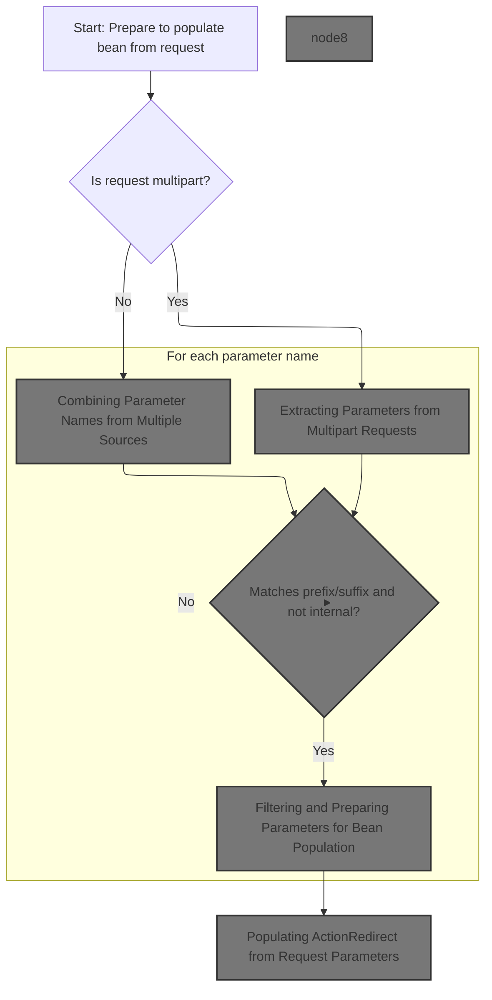
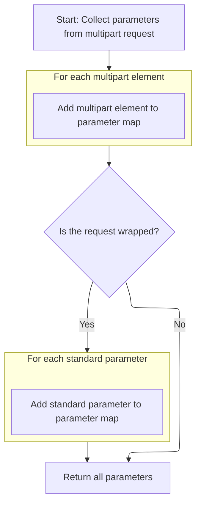
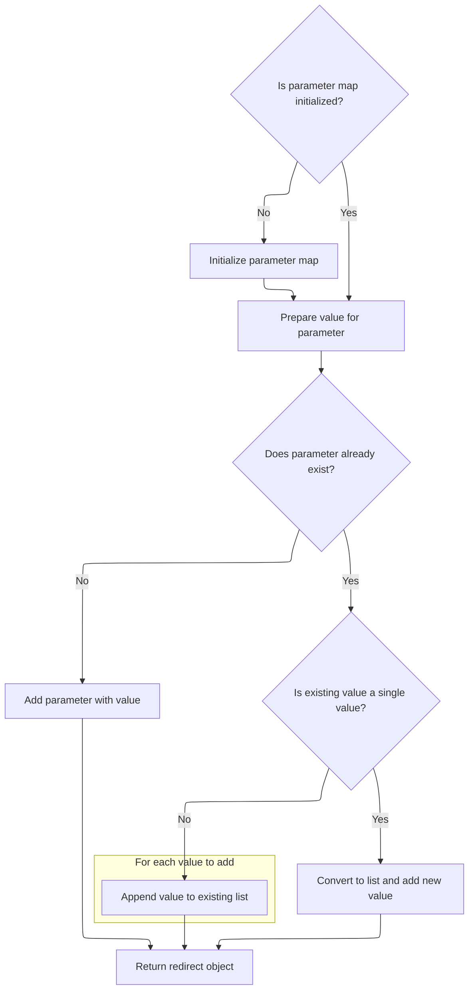

This document explains how user-submitted data from an HTTP request is used to populate a bean, supporting both standard and file upload forms. The flow extracts and filters parameters from the request, then sets the corresponding properties on the target object.

# Where is this flow used?

This flow is used multiple times in the codebase as represented in the following diagram:

```mermaid
graph TD;
      cfc2151cb282a07ad0e8ef89b53768505ca2d6be9e61823762e96d7815f4d163(core/…/action/RequestProcessor.java::RequestProcessor.processPopulate) --> 41225e4ca423d535d46ef28b25da7a7aebaba2b996c7d727af8b3a33a12a31fb(core/…/util/RequestUtils.java::RequestUtils.populate)

1f3af44bfff9bae4b8af237be5302e37d202c99867273a09e77b9f6144dee63a(core/…/action/RequestProcessor.java::RequestProcessor.process) --> cfc2151cb282a07ad0e8ef89b53768505ca2d6be9e61823762e96d7815f4d163(core/…/action/RequestProcessor.java::RequestProcessor.processPopulate)

294cd284fa406b4fe4f160157c73b79eaa7835613a545efd883ce1f14dd1ca7e(core/…/action/ActionServlet.java::ActionServlet.process) --> 1f3af44bfff9bae4b8af237be5302e37d202c99867273a09e77b9f6144dee63a(core/…/action/RequestProcessor.java::RequestProcessor.process)

dde35d78060f1afca84b5e9dedc002fc37669b07142e9d5a1f656107cc900aa0(core/…/action/ActionServlet.java::ActionServlet.doGet) --> 294cd284fa406b4fe4f160157c73b79eaa7835613a545efd883ce1f14dd1ca7e(core/…/action/ActionServlet.java::ActionServlet.process)

ec52fb7c28a6afaae4fd5937965ca776c6c12441d8a10e0b92b387b05c5c5cf5(core/…/action/ActionServlet.java::ActionServlet.doPost) --> 294cd284fa406b4fe4f160157c73b79eaa7835613a545efd883ce1f14dd1ca7e(core/…/action/ActionServlet.java::ActionServlet.process)

8a621e29539d7ec8103485c1826ea7ac430c2b3deba2e4e21eb89aae3dfd0db1(faces/…/application/ActionListenerImpl.java::ActionListenerImpl.processAction) --> 1f3af44bfff9bae4b8af237be5302e37d202c99867273a09e77b9f6144dee63a(core/…/action/RequestProcessor.java::RequestProcessor.process)

8a621e29539d7ec8103485c1826ea7ac430c2b3deba2e4e21eb89aae3dfd0db1(faces/…/application/ActionListenerImpl.java::ActionListenerImpl.processAction) --> 8a621e29539d7ec8103485c1826ea7ac430c2b3deba2e4e21eb89aae3dfd0db1(faces/…/application/ActionListenerImpl.java::ActionListenerImpl.processAction)

e1046609af2713777cf4d18bf40cb9072aa42052b9fe49ca1cf5f9b93c1b9a84(faces/…/application/FacesRequestProcessor.java::FacesRequestProcessor.processPopulate) --> cfc2151cb282a07ad0e8ef89b53768505ca2d6be9e61823762e96d7815f4d163(core/…/action/RequestProcessor.java::RequestProcessor.processPopulate)

3bfb5652829c219269c320328e6de2e3bbea342a80f33dee1b72db226663b497(faces/…/application/FacesTilesRequestProcessor.java::FacesTilesRequestProcessor.processPopulate) --> cfc2151cb282a07ad0e8ef89b53768505ca2d6be9e61823762e96d7815f4d163(core/…/action/RequestProcessor.java::RequestProcessor.processPopulate)

1ff4bf3c4c08b6df4e586062406fa006172960720bc32660f1fe38bd33d34f94(core/…/servlet/PopulateActionForm.java::PopulateActionForm.populate) --> 41225e4ca423d535d46ef28b25da7a7aebaba2b996c7d727af8b3a33a12a31fb(core/…/util/RequestUtils.java::RequestUtils.populate)


classDef mainFlowStyle color:#000000,fill:#7CB9F4
classDef rootsStyle color:#000000,fill:#00FFF4
classDef Style1 color:#000000,fill:#00FFAA
classDef Style2 color:#000000,fill:#FFFF00
classDef Style3 color:#000000,fill:#AA7CB9

%% Swimm:
%% graph TD;
%%       cfc2151cb282a07ad0e8ef89b53768505ca2d6be9e61823762e96d7815f4d163(<SwmPath>[core/…/action/RequestProcessor.java](core/src/main/java/org/apache/struts/action/RequestProcessor.java)</SwmPath>::RequestProcessor.processPopulate) --> 41225e4ca423d535d46ef28b25da7a7aebaba2b996c7d727af8b3a33a12a31fb(<SwmPath>[core/…/util/RequestUtils.java](core/src/main/java/org/apache/struts/util/RequestUtils.java)</SwmPath>::RequestUtils.populate)
%% 
%% 1f3af44bfff9bae4b8af237be5302e37d202c99867273a09e77b9f6144dee63a(<SwmPath>[core/…/action/RequestProcessor.java](core/src/main/java/org/apache/struts/action/RequestProcessor.java)</SwmPath>::RequestProcessor.process) --> cfc2151cb282a07ad0e8ef89b53768505ca2d6be9e61823762e96d7815f4d163(<SwmPath>[core/…/action/RequestProcessor.java](core/src/main/java/org/apache/struts/action/RequestProcessor.java)</SwmPath>::RequestProcessor.processPopulate)
%% 
%% 294cd284fa406b4fe4f160157c73b79eaa7835613a545efd883ce1f14dd1ca7e(<SwmPath>[core/…/action/ActionServlet.java](core/src/main/java/org/apache/struts/action/ActionServlet.java)</SwmPath>::ActionServlet.process) --> 1f3af44bfff9bae4b8af237be5302e37d202c99867273a09e77b9f6144dee63a(<SwmPath>[core/…/action/RequestProcessor.java](core/src/main/java/org/apache/struts/action/RequestProcessor.java)</SwmPath>::RequestProcessor.process)
%% 
%% dde35d78060f1afca84b5e9dedc002fc37669b07142e9d5a1f656107cc900aa0(<SwmPath>[core/…/action/ActionServlet.java](core/src/main/java/org/apache/struts/action/ActionServlet.java)</SwmPath>::ActionServlet.doGet) --> 294cd284fa406b4fe4f160157c73b79eaa7835613a545efd883ce1f14dd1ca7e(<SwmPath>[core/…/action/ActionServlet.java](core/src/main/java/org/apache/struts/action/ActionServlet.java)</SwmPath>::ActionServlet.process)
%% 
%% ec52fb7c28a6afaae4fd5937965ca776c6c12441d8a10e0b92b387b05c5c5cf5(<SwmPath>[core/…/action/ActionServlet.java](core/src/main/java/org/apache/struts/action/ActionServlet.java)</SwmPath>::ActionServlet.doPost) --> 294cd284fa406b4fe4f160157c73b79eaa7835613a545efd883ce1f14dd1ca7e(<SwmPath>[core/…/action/ActionServlet.java](core/src/main/java/org/apache/struts/action/ActionServlet.java)</SwmPath>::ActionServlet.process)
%% 
%% 8a621e29539d7ec8103485c1826ea7ac430c2b3deba2e4e21eb89aae3dfd0db1(<SwmPath>[faces/…/application/ActionListenerImpl.java](faces/src/main/java/org/apache/struts/faces/application/ActionListenerImpl.java)</SwmPath>::ActionListenerImpl.processAction) --> 1f3af44bfff9bae4b8af237be5302e37d202c99867273a09e77b9f6144dee63a(<SwmPath>[core/…/action/RequestProcessor.java](core/src/main/java/org/apache/struts/action/RequestProcessor.java)</SwmPath>::RequestProcessor.process)
%% 
%% 8a621e29539d7ec8103485c1826ea7ac430c2b3deba2e4e21eb89aae3dfd0db1(<SwmPath>[faces/…/application/ActionListenerImpl.java](faces/src/main/java/org/apache/struts/faces/application/ActionListenerImpl.java)</SwmPath>::ActionListenerImpl.processAction) --> 8a621e29539d7ec8103485c1826ea7ac430c2b3deba2e4e21eb89aae3dfd0db1(<SwmPath>[faces/…/application/ActionListenerImpl.java](faces/src/main/java/org/apache/struts/faces/application/ActionListenerImpl.java)</SwmPath>::ActionListenerImpl.processAction)
%% 
%% e1046609af2713777cf4d18bf40cb9072aa42052b9fe49ca1cf5f9b93c1b9a84(<SwmPath>[faces/…/application/FacesRequestProcessor.java](faces/src/main/java/org/apache/struts/faces/application/FacesRequestProcessor.java)</SwmPath>::FacesRequestProcessor.processPopulate) --> cfc2151cb282a07ad0e8ef89b53768505ca2d6be9e61823762e96d7815f4d163(<SwmPath>[core/…/action/RequestProcessor.java](core/src/main/java/org/apache/struts/action/RequestProcessor.java)</SwmPath>::RequestProcessor.processPopulate)
%% 
%% 3bfb5652829c219269c320328e6de2e3bbea342a80f33dee1b72db226663b497(<SwmPath>[faces/…/application/FacesTilesRequestProcessor.java](faces/src/main/java/org/apache/struts/faces/application/FacesTilesRequestProcessor.java)</SwmPath>::FacesTilesRequestProcessor.processPopulate) --> cfc2151cb282a07ad0e8ef89b53768505ca2d6be9e61823762e96d7815f4d163(<SwmPath>[core/…/action/RequestProcessor.java](core/src/main/java/org/apache/struts/action/RequestProcessor.java)</SwmPath>::RequestProcessor.processPopulate)
%% 
%% 1ff4bf3c4c08b6df4e586062406fa006172960720bc32660f1fe38bd33d34f94(<SwmPath>[core/…/servlet/PopulateActionForm.java](core/src/main/java/org/apache/struts/chain/commands/servlet/PopulateActionForm.java)</SwmPath>::PopulateActionForm.populate) --> 41225e4ca423d535d46ef28b25da7a7aebaba2b996c7d727af8b3a33a12a31fb(<SwmPath>[core/…/util/RequestUtils.java](core/src/main/java/org/apache/struts/util/RequestUtils.java)</SwmPath>::RequestUtils.populate)
%% 
%% 
%% classDef mainFlowStyle color:#000000,fill:#7CB9F4
%% classDef rootsStyle color:#000000,fill:#00FFF4
%% classDef Style1 color:#000000,fill:#00FFAA
%% classDef Style2 color:#000000,fill:#FFFF00
%% classDef Style3 color:#000000,fill:#AA7CB9
```



# Populating Beans from HTTP Requests



<SwmSnippet path="/core/src/main/java/org/apache/struts/util/RequestUtils.java" line="363">

---

In `RequestUtils.populate`, we start by checking if the request is a multipart POST. If so, the bean must be an <SwmToken path="core/src/main/java/org/apache/struts/util/RequestUtils.java" pos="379:8:8" line-data="        if (bean instanceof ActionForm) {">`ActionForm`</SwmToken>, otherwise we bail with a <SwmToken path="core/src/main/java/org/apache/struts/util/RequestUtils.java" pos="365:3:3" line-data="        throws ServletException {">`ServletException`</SwmToken>. Next, we call <SwmToken path="core/src/main/java/org/apache/struts/util/RequestUtils.java" pos="400:5:5" line-data="            multipartHandler = getMultipartHandler(request);">`getMultipartHandler`</SwmToken> to grab a handler for parsing the multipart data, since only ActionForms are set up to deal with file uploads and multipart content in Struts.

```java
    public static void populate(Object bean, String prefix, String suffix,
        HttpServletRequest request)
        throws ServletException {
        // Build a list of relevant request parameters from this request
        HashMap properties = new HashMap();

        // Iterator of parameter names
        Enumeration names = null;

        // Map for multipart parameters
        Map multipartParameters = null;

        String contentType = request.getContentType();
        String method = request.getMethod();
        boolean isMultipart = false;

        if (bean instanceof ActionForm) {
            ((ActionForm) bean).setMultipartRequestHandler(null);
        }

        MultipartRequestHandler multipartHandler = null;
        if ((contentType != null)
            && (contentType.startsWith("multipart/form-data"))
            && (method.equalsIgnoreCase("POST"))) {
            // Get the ActionServletWrapper from the form bean
            ActionServletWrapper servlet;

            if (bean instanceof ActionForm) {
                servlet = ((ActionForm) bean).getServletWrapper();
            } else {
                throw new ServletException("bean that's supposed to be "
                    + "populated from a multipart request is not of type "
                    + "\"org.apache.struts.action.ActionForm\", but type "
                    + "\"" + bean.getClass().getName() + "\"");
            }

            // Obtain a MultipartRequestHandler
            multipartHandler = getMultipartHandler(request);

```

---

</SwmSnippet>

<SwmSnippet path="/core/src/main/java/org/apache/struts/util/RequestUtils.java" line="566">

---

<SwmToken path="core/src/main/java/org/apache/struts/util/RequestUtils.java" pos="566:7:7" line-data="    private static MultipartRequestHandler getMultipartHandler(">`getMultipartHandler`</SwmToken> tries to instantiate a <SwmToken path="core/src/main/java/org/apache/struts/util/RequestUtils.java" pos="566:5:5" line-data="    private static MultipartRequestHandler getMultipartHandler(">`MultipartRequestHandler`</SwmToken> class, first looking for a request-specific override, then falling back to the global config. If the request attribute isn't set or instantiation fails, it uses the module's default handler. This lets you override multipart handling per request if needed.

```java
    private static MultipartRequestHandler getMultipartHandler(
        HttpServletRequest request)
        throws ServletException {
        MultipartRequestHandler multipartHandler = null;
        String multipartClass =
            (String) request.getAttribute(Globals.MULTIPART_KEY);

        request.removeAttribute(Globals.MULTIPART_KEY);

        // Try to initialize the mapping specific request handler
        if (multipartClass != null) {
            try {
                multipartHandler =
                    (MultipartRequestHandler) applicationInstance(multipartClass);
            } catch (ClassNotFoundException cnfe) {
                log.error("MultipartRequestHandler class \"" + multipartClass
                    + "\" in mapping class not found, "
                    + "defaulting to global multipart class");
            } catch (InstantiationException ie) {
                log.error("InstantiationException when instantiating "
                    + "MultipartRequestHandler \"" + multipartClass + "\", "
                    + "defaulting to global multipart class, exception: "
                    + ie.getMessage());
            } catch (IllegalAccessException iae) {
                log.error("IllegalAccessException when instantiating "
                    + "MultipartRequestHandler \"" + multipartClass + "\", "
                    + "defaulting to global multipart class, exception: "
                    + iae.getMessage());
            }

            if (multipartHandler != null) {
                return multipartHandler;
            }
        }

        ModuleConfig moduleConfig =
            ModuleUtils.getInstance().getModuleConfig(request);

        multipartClass = moduleConfig.getControllerConfig().getMultipartClass();

        // Try to initialize the global request handler
        if (multipartClass != null) {
            try {
                multipartHandler =
                    (MultipartRequestHandler) applicationInstance(multipartClass);
            } catch (ClassNotFoundException cnfe) {
                throw new ServletException("Cannot find multipart class \""
                    + multipartClass + "\"", cnfe);
            } catch (InstantiationException ie) {
                throw new ServletException(
                    "InstantiationException when instantiating "
                    + "multipart class \"" + multipartClass + "\"", ie);
            } catch (IllegalAccessException iae) {
                throw new ServletException(
                    "IllegalAccessException when instantiating "
                    + "multipart class \"" + multipartClass + "\"", iae);
            }

            if (multipartHandler != null) {
                return multipartHandler;
            }
        }

        return multipartHandler;
    }
```

---

</SwmSnippet>

<SwmSnippet path="/core/src/main/java/org/apache/struts/util/RequestUtils.java" line="402">

---

Back in `RequestUtils.populate`, after getting the multipart handler, we set it up with servlet and mapping info, parse the request, and check for upload size issues. If all is good, we call <SwmToken path="core/src/main/java/org/apache/struts/util/RequestUtils.java" pos="425:1:1" line-data="                    getAllParametersForMultipartRequest(request,">`getAllParametersForMultipartRequest`</SwmToken> to pull out all the form fields and files so we can actually populate the bean.

```java
            if (multipartHandler != null) {
                isMultipart = true;

                // Set servlet and mapping info
                servlet.setServletFor(multipartHandler);
                multipartHandler.setMapping((ActionMapping) request
                    .getAttribute(Globals.MAPPING_KEY));

                // Initialize multipart request class handler
                multipartHandler.handleRequest(request);

                //stop here if the maximum length has been exceeded
                Boolean maxLengthExceeded =
                    (Boolean) request.getAttribute(MultipartRequestHandler.ATTRIBUTE_MAX_LENGTH_EXCEEDED);

                if ((maxLengthExceeded != null)
                    && (maxLengthExceeded.booleanValue())) {
                    ((ActionForm) bean).setMultipartRequestHandler(multipartHandler);
                    return;
                }

                //retrieve form values and put into properties
                multipartParameters =
                    getAllParametersForMultipartRequest(request,
                        multipartHandler);
                names = Collections.enumeration(multipartParameters.keySet());
            }
        }

```

---

</SwmSnippet>

## Extracting Parameters from Multipart Requests



<SwmSnippet path="/core/src/main/java/org/apache/struts/util/RequestUtils.java" line="644">

---

In <SwmToken path="core/src/main/java/org/apache/struts/util/RequestUtils.java" pos="644:7:7" line-data="    private static Map getAllParametersForMultipartRequest(">`getAllParametersForMultipartRequest`</SwmToken>, we start by grabbing all elements from the multipart handler and stuffing them into a map. This collects all the multipart form fields and files.

```java
    private static Map getAllParametersForMultipartRequest(
        HttpServletRequest request, MultipartRequestHandler multipartHandler) {
        Map parameters = new HashMap();
        Hashtable elements = multipartHandler.getAllElements();
        Enumeration e = elements.keys();

        while (e.hasMoreElements()) {
            String key = (String) e.nextElement();

            parameters.put(key, elements.get(key));
        }
```

---

</SwmSnippet>

<SwmSnippet path="/core/src/main/java/org/apache/struts/util/RequestUtils.java" line="656">

---

After collecting parameters from the handler, if the request is a <SwmToken path="core/src/main/java/org/apache/struts/util/RequestUtils.java" pos="656:8:8" line-data="        if (request instanceof MultipartRequestWrapper) {">`MultipartRequestWrapper`</SwmToken>, we also grab parameter names and values from the wrapped request and merge them in. This way, we don't miss any parameters that might not be in the handler.

```java
        if (request instanceof MultipartRequestWrapper) {
            request =
                (HttpServletRequest) ((MultipartRequestWrapper) request)
                .getRequest();
            e = request.getParameterNames();

            while (e.hasMoreElements()) {
                String key = (String) e.nextElement();

                parameters.put(key, request.getParameterValues(key));
            }
        } else {
            log.debug("Gathering multipart parameters for unwrapped request");
        }

        return parameters;
    }
```

---

</SwmSnippet>

## Combining Parameter Names from Multiple Sources

<SwmSnippet path="/core/src/main/java/org/apache/struts/upload/MultipartRequestWrapper.java" line="94">

---

In <SwmToken path="core/src/main/java/org/apache/struts/upload/MultipartRequestWrapper.java" pos="94:5:5" line-data="    public Enumeration getParameterNames() {">`getParameterNames`</SwmToken>, we grab all parameter names from the original request and add them to a Vector, then add names from the internal parameters collection. This way, we get a combined list of all parameter names from both sources.

```java
    public Enumeration getParameterNames() {
        Enumeration baseParams = getRequest().getParameterNames();
        Vector list = new Vector();

        while (baseParams.hasMoreElements()) {
            list.add(baseParams.nextElement());
        }
```

---

</SwmSnippet>

<SwmSnippet path="/core/src/main/java/org/apache/struts/upload/MultipartRequestWrapper.java" line="102">

---

After merging, the function returns an Enumeration of all parameter names, assuming the 'parameters' collection is always set up correctly. If it's empty, you just get the base request's names.

```java
        Collection multipartParams = parameters.keySet();
        Iterator iterator = multipartParams.iterator();

        while (iterator.hasNext()) {
            list.add(iterator.next());
        }
```

---

</SwmSnippet>

## Filtering and Preparing Parameters for Bean Population

```mermaid
%%{init: {"flowchart": {"defaultRenderer": "elk"}} }%%
flowchart TD
    node1["Start: Prepare to populate bean from request"]
    click node1 openCode "core/src/main/java/org/apache/struts/util/RequestUtils.java:431:433"
    node1 --> node2{"Is request multipart?"}
    click node2 openCode "core/src/main/java/org/apache/struts/util/RequestUtils.java:431:433"
    node2 --> node3["Get parameter names"]
    click node3 openCode "core/src/main/java/org/apache/struts/util/RequestUtils.java:432:433"
    subgraph loop1["For each parameter in the request"]
        node3 --> node4{"Matches prefix?"}
        click node4 openCode "core/src/main/java/org/apache/struts/util/RequestUtils.java:439:445"
        node4 -->|"No"| node12["Next parameter"]
        node4 -->|"Yes"| node5{"Matches suffix?"}
        click node5 openCode "core/src/main/java/org/apache/struts/util/RequestUtils.java:447:454"
        node5 -->|"No"| node12
        node5 -->|"Yes"| node6{"Is internal Struts attribute?"}
        click node6 openCode "core/src/main/java/org/apache/struts/util/RequestUtils.java:467:467"
        node6 -->|"Yes"| node12
        node6 -->|"No"| node7{"Is multipart?"}
        click node7 openCode "core/src/main/java/org/apache/struts/util/RequestUtils.java:458:463"
        node7 -->|"Yes"| node8["Get value from multipart and rationalize file property"]
        click node8 openCode "core/src/main/java/org/apache/struts/util/RequestUtils.java:459:461"
        node7 -->|"No"| node9["Get value from request"]
        click node9 openCode "core/src/main/java/org/apache/struts/util/RequestUtils.java:462:463"
        node8 --> node10["Add parameter to properties"]
        click node10 openCode "core/src/main/java/org/apache/struts/util/RequestUtils.java:468:469"
        node9 --> node10
        node10 --> node12
        node12["Next parameter"]
    end
    node12 --> node11["Populate bean with properties"]
    click node11 openCode "core/src/main/java/org/apache/struts/util/RequestUtils.java:474:474"

classDef HeadingStyle fill:#777777,stroke:#333,stroke-width:2px;

%% Swimm:
%% %%{init: {"flowchart": {"defaultRenderer": "elk"}} }%%
%% flowchart TD
%%     node1["Start: Prepare to populate bean from request"]
%%     click node1 openCode "<SwmPath>[core/…/util/RequestUtils.java](core/src/main/java/org/apache/struts/util/RequestUtils.java)</SwmPath>:431:433"
%%     node1 --> node2{"Is request multipart?"}
%%     click node2 openCode "<SwmPath>[core/…/util/RequestUtils.java](core/src/main/java/org/apache/struts/util/RequestUtils.java)</SwmPath>:431:433"
%%     node2 --> node3["Get parameter names"]
%%     click node3 openCode "<SwmPath>[core/…/util/RequestUtils.java](core/src/main/java/org/apache/struts/util/RequestUtils.java)</SwmPath>:432:433"
%%     subgraph loop1["For each parameter in the request"]
%%         node3 --> node4{"Matches prefix?"}
%%         click node4 openCode "<SwmPath>[core/…/util/RequestUtils.java](core/src/main/java/org/apache/struts/util/RequestUtils.java)</SwmPath>:439:445"
%%         node4 -->|"No"| node12["Next parameter"]
%%         node4 -->|"Yes"| node5{"Matches suffix?"}
%%         click node5 openCode "<SwmPath>[core/…/util/RequestUtils.java](core/src/main/java/org/apache/struts/util/RequestUtils.java)</SwmPath>:447:454"
%%         node5 -->|"No"| node12
%%         node5 -->|"Yes"| node6{"Is internal Struts attribute?"}
%%         click node6 openCode "<SwmPath>[core/…/util/RequestUtils.java](core/src/main/java/org/apache/struts/util/RequestUtils.java)</SwmPath>:467:467"
%%         node6 -->|"Yes"| node12
%%         node6 -->|"No"| node7{"Is multipart?"}
%%         click node7 openCode "<SwmPath>[core/…/util/RequestUtils.java](core/src/main/java/org/apache/struts/util/RequestUtils.java)</SwmPath>:458:463"
%%         node7 -->|"Yes"| node8["Get value from multipart and rationalize file property"]
%%         click node8 openCode "<SwmPath>[core/…/util/RequestUtils.java](core/src/main/java/org/apache/struts/util/RequestUtils.java)</SwmPath>:459:461"
%%         node7 -->|"No"| node9["Get value from request"]
%%         click node9 openCode "<SwmPath>[core/…/util/RequestUtils.java](core/src/main/java/org/apache/struts/util/RequestUtils.java)</SwmPath>:462:463"
%%         node8 --> node10["Add parameter to properties"]
%%         click node10 openCode "<SwmPath>[core/…/util/RequestUtils.java](core/src/main/java/org/apache/struts/util/RequestUtils.java)</SwmPath>:468:469"
%%         node9 --> node10
%%         node10 --> node12
%%         node12["Next parameter"]
%%     end
%%     node12 --> node11["Populate bean with properties"]
%%     click node11 openCode "<SwmPath>[core/…/util/RequestUtils.java](core/src/main/java/org/apache/struts/util/RequestUtils.java)</SwmPath>:474:474"
%% 
%% classDef HeadingStyle fill:#777777,stroke:#333,stroke-width:2px;
```



<SwmSnippet path="/core/src/main/java/org/apache/struts/util/RequestUtils.java" line="431">

---

Back in `RequestUtils.populate`, if the request wasn't multipart, we just grab parameter names from the request (which could be a <SwmToken path="core/src/main/java/org/apache/struts/util/RequestUtils.java" pos="656:8:8" line-data="        if (request instanceof MultipartRequestWrapper) {">`MultipartRequestWrapper`</SwmToken>). This makes sure we get all parameters, regardless of how they were parsed.

```java
        if (!isMultipart) {
            names = request.getParameterNames();
        }

```

---

</SwmSnippet>

<SwmSnippet path="/core/src/main/java/org/apache/struts/util/RequestUtils.java" line="435">

---

After getting all parameter names (possibly from <SwmToken path="core/src/main/java/org/apache/struts/util/RequestUtils.java" pos="656:8:8" line-data="        if (request instanceof MultipartRequestWrapper) {">`MultipartRequestWrapper`</SwmToken>), we filter them by prefix and suffix, strip those off, and only keep the ones that match. This lets us control which bean properties get set in `RequestUtils.populate`.

```java
        while (names.hasMoreElements()) {
            String name = (String) names.nextElement();
            String stripped = name;

            if (prefix != null) {
                if (!stripped.startsWith(prefix)) {
                    continue;
                }

                stripped = stripped.substring(prefix.length());
            }

            if (suffix != null) {
                if (!stripped.endsWith(suffix)) {
                    continue;
                }

                stripped =
                    stripped.substring(0, stripped.length() - suffix.length());
            }

            Object parameterValue = null;

            if (isMultipart) {
                parameterValue = multipartParameters.get(name);
                parameterValue = rationalizeMultipleFileProperty(bean, name, parameterValue);
            } else {
                parameterValue = request.getParameterValues(name);
            }

            // Populate parameters, except "standard" struts attributes
            // such as 'org.apache.struts.action.CANCEL'
            if (!(stripped.startsWith("org.apache.struts."))) {
                properties.put(stripped, parameterValue);
            }
        }
```

---

</SwmSnippet>

<SwmSnippet path="/core/src/main/java/org/apache/struts/util/RequestUtils.java" line="472">

---

Once we've got the filtered parameters, we call <SwmToken path="core/src/main/java/org/apache/struts/util/RequestUtils.java" pos="474:1:3" line-data="            BeanUtils.populate(bean, properties);">`BeanUtils.populate`</SwmToken> to actually set the bean properties. This handles all the mapping and type conversion for us.

```java
        // Set the corresponding properties of our bean
        try {
            BeanUtils.populate(bean, properties);
```

---

</SwmSnippet>

## Populating <SwmToken path="core/src/main/java/org/apache/struts/util/RequestUtils.java" pos="496:9:9" line-data="    public static void populate(ActionRedirect redirect, HttpServletRequest request) {">`ActionRedirect`</SwmToken> from Request Parameters

<SwmSnippet path="/core/src/main/java/org/apache/struts/util/RequestUtils.java" line="496">

---

In <SwmToken path="core/src/main/java/org/apache/struts/util/RequestUtils.java" pos="496:7:7" line-data="    public static void populate(ActionRedirect redirect, HttpServletRequest request) {">`populate`</SwmToken>`(`<SwmToken path="core/src/main/java/org/apache/struts/util/RequestUtils.java" pos="496:9:9" line-data="    public static void populate(ActionRedirect redirect, HttpServletRequest request) {">`ActionRedirect`</SwmToken>`, `<SwmToken path="core/src/main/java/org/apache/struts/util/RequestUtils.java" pos="496:16:16" line-data="    public static void populate(ActionRedirect redirect, HttpServletRequest request) {">`request`</SwmToken>`)`, we loop through all parameter names from the request (which could be a <SwmToken path="core/src/main/java/org/apache/struts/util/RequestUtils.java" pos="656:8:8" line-data="        if (request instanceof MultipartRequestWrapper) {">`MultipartRequestWrapper`</SwmToken>), so we get both regular and multipart parameters for the redirect.

```java
    public static void populate(ActionRedirect redirect, HttpServletRequest request) {
        assert (redirect != null) : "redirect is required";
        assert (request != null) : "request is required";
        
        Enumeration e = request.getParameterNames();
```

---

</SwmSnippet>

<SwmSnippet path="/core/src/main/java/org/apache/struts/util/RequestUtils.java" line="501">

---

After getting all parameter names and values, we call <SwmToken path="core/src/main/java/org/apache/struts/util/RequestUtils.java" pos="504:1:3" line-data="            redirect.addParameter(name, values);">`redirect.addParameter`</SwmToken> for each one. This way, <SwmToken path="core/src/main/java/org/apache/struts/util/RequestUtils.java" pos="496:9:9" line-data="    public static void populate(ActionRedirect redirect, HttpServletRequest request) {">`ActionRedirect`</SwmToken> gets all the parameters, including multi-valued ones, from the request.

```java
        while (e.hasMoreElements()) {
            String name = (String) e.nextElement();
            String[] values = request.getParameterValues(name);
            redirect.addParameter(name, values);
        }
    }
```

---

</SwmSnippet>

## Adding Parameters to <SwmToken path="core/src/main/java/org/apache/struts/util/RequestUtils.java" pos="496:9:9" line-data="    public static void populate(ActionRedirect redirect, HttpServletRequest request) {">`ActionRedirect`</SwmToken>

<SwmSnippet path="/core/src/main/java/org/apache/struts/action/ActionRedirect.java" line="158">

---

In <SwmToken path="core/src/main/java/org/apache/struts/action/ActionRedirect.java" pos="158:5:5" line-data="    public ActionRedirect addParameter(String fieldName, Object valueObj) {">`addParameter`</SwmToken>, we encode the value for URL safety, then add it to the <SwmToken path="core/src/main/java/org/apache/struts/action/ActionRedirect.java" pos="161:4:4" line-data="        if (parameterValues == null) {">`parameterValues`</SwmToken> map. If there are already values for this name, we handle single and multiple values accordingly.

```java
    public ActionRedirect addParameter(String fieldName, Object valueObj) {
        String value = (valueObj != null) ? valueObj.toString() : "";

```

---

</SwmSnippet>

### Building the Redirect URL String

See <SwmLink doc-title="Redirect Summary Generation">[Redirect Summary Generation](/.swm/redirect-summary-generation.ixlwycx5.sw.md)</SwmLink>

### Managing Multiple Redirect Parameters



<SwmSnippet path="/core/src/main/java/org/apache/struts/action/ActionRedirect.java" line="161">

---

After calling <SwmToken path="core/src/main/java/org/apache/struts/util/RequestUtils.java" pos="504:3:3" line-data="            redirect.addParameter(name, values);">`addParameter`</SwmToken> in <SwmToken path="core/src/main/java/org/apache/struts/util/RequestUtils.java" pos="496:9:9" line-data="    public static void populate(ActionRedirect redirect, HttpServletRequest request) {">`ActionRedirect`</SwmToken>, the function handles multiple values for the same parameter name by switching from a String to a String array, and for more than two values, it uses a List and then back to an array. All values are URL-encoded before storing, so they're safe for redirects.

```java
        if (parameterValues == null) {
            initializeParameters();
        }

        //try {
        value = ResponseUtils.encodeURL(value);

        //} catch (UnsupportedEncodingException uce) {
        // this shouldn't happen since UTF-8 is the W3C Recommendation
        //     String errorMsg = "UTF-8 Character Encoding not supported";
        //     LOG.error(errorMsg, uce);
        //     throw new RuntimeException(errorMsg, uce);
        // }
        Object currentValue = parameterValues.get(fieldName);

        if (currentValue == null) {
            // there's no value for this param yet; add it to the map
            parameterValues.put(fieldName, value);
        } else if (currentValue instanceof String) {
            // there's already a value; let's use an array for these parameters
            String[] newValue = new String[2];

            newValue[0] = (String) currentValue;
            newValue[1] = value;
            parameterValues.put(fieldName, newValue);
        } else if (currentValue instanceof String[]) {
            // add the value to the list of existing values
            List newValues =
                new ArrayList(Arrays.asList((Object[]) currentValue));

            newValues.add(value);
            parameterValues.put(fieldName,
                newValues.toArray(new String[newValues.size()]));
        }
        return this;
    }
```

---

</SwmSnippet>

## Finalizing Bean Population

<SwmSnippet path="/core/src/main/java/org/apache/struts/util/RequestUtils.java" line="475">

---

After calling <SwmToken path="core/src/main/java/org/apache/struts/util/RequestUtils.java" pos="476:8:10" line-data="            throw new ServletException(&quot;BeanUtils.populate&quot;, e);">`BeanUtils.populate`</SwmToken>, we set the multipart handler on the <SwmToken path="core/src/main/java/org/apache/struts/util/RequestUtils.java" pos="479:17:17" line-data="                // Set the multipart request handler for our ActionForm.">`ActionForm`</SwmToken> (if used), so the form can access upload info later. If anything fails, we throw a <SwmToken path="core/src/main/java/org/apache/struts/util/RequestUtils.java" pos="476:5:5" line-data="            throw new ServletException(&quot;BeanUtils.populate&quot;, e);">`ServletException`</SwmToken> to signal the problem.

```java
        } catch (Exception e) {
            throw new ServletException("BeanUtils.populate", e);
        } finally {
            if (multipartHandler != null) {
                // Set the multipart request handler for our ActionForm.
                // If the bean isn't an ActionForm, an exception would have been
                // thrown earlier, so it's safe to assume that our bean is
                // in fact an ActionForm.
                ((ActionForm) bean).setMultipartRequestHandler(multipartHandler);
            }
        }
    }
```

---

</SwmSnippet>

&nbsp;

*This is an auto-generated document by Swimm 🌊 and has not yet been verified by a human*

<SwmMeta version="3.0.0" repo-id="Z2l0aHViJTNBJTNBc3RydXRzMSUzQSUzQVN3aW1tLURlbW8=" repo-name="struts1"><sup>Powered by [Swimm](https://app.swimm.io/)</sup></SwmMeta>
