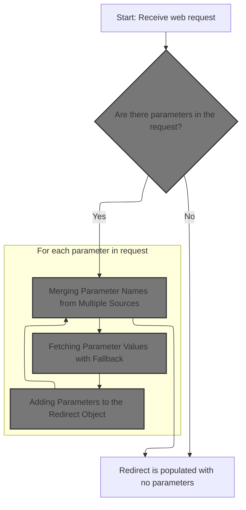
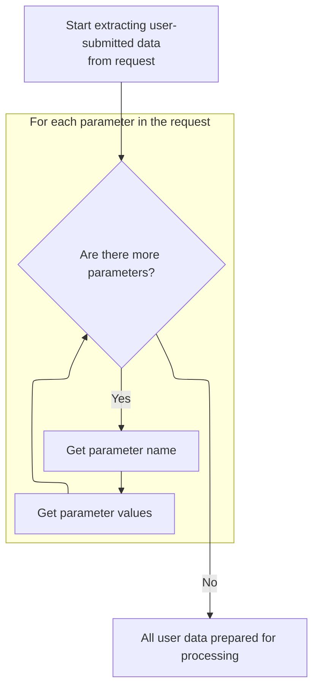
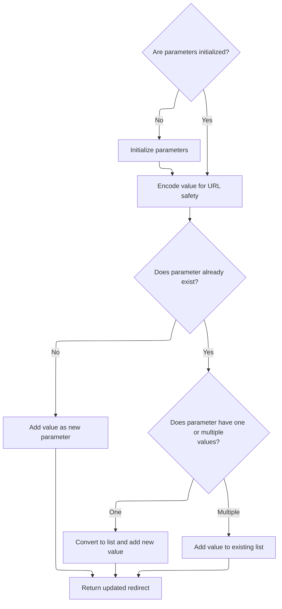

This document describes how user-submitted parameters from a web request are collected and transferred into a redirect object. All parameters, including those from file uploads, are gathered and added to the redirect, ensuring that user input is preserved across redirects.

# Collecting Parameters from the Request



<SwmSnippet path="/core/src/main/java/org/apache/struts/util/RequestUtils.java" line="496">

---

In <SwmToken path="core/src/main/java/org/apache/struts/util/RequestUtils.java" pos="496:7:7" line-data="    public static void populate(ActionRedirect redirect, HttpServletRequest request) {">`populate`</SwmToken>, we grab all parameter names from the request, which could be a wrapped multipart request. Next, we need <SwmToken path="core/src/main/java/org/apache/struts/util/RequestUtils.java" pos="39:10:10" line-data="import org.apache.struts.upload.MultipartRequestWrapper;">`MultipartRequestWrapper`</SwmToken> to make sure we don't miss parameters that only exist in multipart form data.

```java
    public static void populate(ActionRedirect redirect, HttpServletRequest request) {
        assert (redirect != null) : "redirect is required";
        assert (request != null) : "request is required";
        
        Enumeration e = request.getParameterNames();
```

---

</SwmSnippet>

## Merging Parameter Names from Multiple Sources

<SwmSnippet path="/core/src/main/java/org/apache/struts/upload/MultipartRequestWrapper.java" line="94">

---

In <SwmToken path="core/src/main/java/org/apache/struts/upload/MultipartRequestWrapper.java" pos="94:5:5" line-data="    public Enumeration getParameterNames() {">`getParameterNames`</SwmToken>, we combine parameter names from the original request and an internal parameters map. Next, we need ServletActionContext to access the underlying request context for further processing.

```java
    public Enumeration getParameterNames() {
        Enumeration baseParams = getRequest().getParameterNames();
```

---

</SwmSnippet>

<SwmSnippet path="/core/src/main/java/org/apache/struts/upload/MultipartRequestWrapper.java" line="96">

---

Back in <SwmToken path="core/src/main/java/org/apache/struts/util/RequestUtils.java" pos="500:9:9" line-data="        Enumeration e = request.getParameterNames();">`getParameterNames`</SwmToken>, after getting the context from ServletActionContext, we fill a Vector with parameter names from the base request. This sets up the combined list before adding multipart-specific names.

```java
        Vector list = new Vector();

        while (baseParams.hasMoreElements()) {
            list.add(baseParams.nextElement());
        }
```

---

</SwmSnippet>

<SwmSnippet path="/core/src/main/java/org/apache/struts/upload/MultipartRequestWrapper.java" line="102">

---

Next, we add parameter names from the internal parameters map to the Vector. The function assumes 'parameters' is a Map, so its keys are used as additional parameter names.

```java
        Collection multipartParams = parameters.keySet();
        Iterator iterator = multipartParams.iterator();

        while (iterator.hasNext()) {
            list.add(iterator.next());
        }
```

---

</SwmSnippet>

## Retrieving Parameter Values for Each Name



<SwmSnippet path="/core/src/main/java/org/apache/struts/util/RequestUtils.java" line="501">

---

Back in `RequestUtils.populate`, after getting all parameter names (including multipart), we loop through each and fetch their values using <SwmToken path="core/src/main/java/org/apache/struts/util/RequestUtils.java" pos="503:11:11" line-data="            String[] values = request.getParameterValues(name);">`getParameterValues`</SwmToken>. This ensures we handle parameters with multiple values.

```java
        while (e.hasMoreElements()) {
            String name = (String) e.nextElement();
            String[] values = request.getParameterValues(name);
```

---

</SwmSnippet>

## Fetching Parameter Values with Fallback

<SwmSnippet path="/core/src/main/java/org/apache/struts/upload/MultipartRequestWrapper.java" line="118">

---

In <SwmToken path="core/src/main/java/org/apache/struts/upload/MultipartRequestWrapper.java" pos="118:7:7" line-data="    public String[] getParameterValues(String name) {">`getParameterValues`</SwmToken>, we first try to get values from the base request. If nothing is found, we fall back to the internal parameters map. Next, we need ServletActionContext to keep context for multipart handling.

```java
    public String[] getParameterValues(String name) {
        String[] value = getRequest().getParameterValues(name);

```

---

</SwmSnippet>

<SwmSnippet path="/core/src/main/java/org/apache/struts/upload/MultipartRequestWrapper.java" line="121">

---

Back in <SwmToken path="core/src/main/java/org/apache/struts/util/RequestUtils.java" pos="503:11:11" line-data="            String[] values = request.getParameterValues(name);">`getParameterValues`</SwmToken>, after checking the context, we return either the values from the base request or, if missing, from the parameters map. This relies on the assumption that the map only holds String\[\] values.

```java
        if (value == null) {
            value = (String[]) parameters.get(name);
        }

        return value;
    }
```

---

</SwmSnippet>

## Adding Parameters to the Redirect Object

<SwmSnippet path="/core/src/main/java/org/apache/struts/util/RequestUtils.java" line="504">

---

Back in `RequestUtils.populate`, after getting parameter values, we add each name and its values to the <SwmToken path="core/src/main/java/org/apache/struts/util/RequestUtils.java" pos="496:9:9" line-data="    public static void populate(ActionRedirect redirect, HttpServletRequest request) {">`ActionRedirect`</SwmToken>. Next, we need <SwmToken path="core/src/main/java/org/apache/struts/util/RequestUtils.java" pos="496:9:9" line-data="    public static void populate(ActionRedirect redirect, HttpServletRequest request) {">`ActionRedirect`</SwmToken> to actually store and later serialize these parameters for the redirect URL.

```java
            redirect.addParameter(name, values);
        }
    }
```

---

</SwmSnippet>

# Storing Parameters for the Redirect

<SwmSnippet path="/core/src/main/java/org/apache/struts/action/ActionRedirect.java" line="158">

---

In <SwmToken path="core/src/main/java/org/apache/struts/action/ActionRedirect.java" pos="158:5:5" line-data="    public ActionRedirect addParameter(String fieldName, Object valueObj) {">`addParameter`</SwmToken>, we encode the value for URL safety and handle multiple values for the same parameter by storing them as arrays. Next, we need to serialize these parameters for the redirect URL.

```java
    public ActionRedirect addParameter(String fieldName, Object valueObj) {
        String value = (valueObj != null) ? valueObj.toString() : "";

```

---

</SwmSnippet>

## Serializing the Redirect for Output

<SwmSnippet path="/core/src/main/java/org/apache/struts/action/ActionRedirect.java" line="340">

---

In <SwmToken path="core/src/main/java/org/apache/struts/action/ActionRedirect.java" pos="340:5:5" line-data="    public String toString() {">`toString`</SwmToken>, we start building a string that represents the redirect, including the original path and parameters. Next, we need to fetch the original path for the output.

```java
    public String toString() {
        StringBuffer result = new StringBuffer(DEFAULT_BUFFER_SIZE);

        result.append("ActionRedirect [");
        result.append("originalPath=").append(getOriginalPath()).append(";");
```

---

</SwmSnippet>

### Getting the Redirect's Original Path

<SwmSnippet path="/core/src/main/java/org/apache/struts/action/ActionRedirect.java" line="220">

---

<SwmToken path="core/src/main/java/org/apache/struts/action/ActionRedirect.java" pos="220:5:5" line-data="    public String getOriginalPath() {">`getOriginalPath`</SwmToken> just delegates to the superclass to fetch the path. Next, we need to continue building the string representation with parameters.

```java
    public String getOriginalPath() {
        return super.getPath();
    }
```

---

</SwmSnippet>

### Resolving the Redirect Path from the Superclass

See <SwmLink doc-title="Building a Redirect URL">[Building a Redirect URL](/.swm/building-a-redirect-url.se5cgwks.sw.md)</SwmLink>

### Appending Parameters and Anchor to the Output

<SwmSnippet path="/core/src/main/java/org/apache/struts/action/ActionRedirect.java" line="345">

---

Back in <SwmToken path="core/src/main/java/org/apache/struts/action/ActionRedirect.java" pos="159:19:19" line-data="        String value = (valueObj != null) ? valueObj.toString() : &quot;&quot;;">`toString`</SwmToken>, after getting the original path, we append the parameter string and anchor string to the output. This keeps the redirect's state clear and debuggable.

```java
        result.append("parameterString=").append(getParameterString()).append("]");
```

---

</SwmSnippet>

<SwmSnippet path="/core/src/main/java/org/apache/struts/action/ActionRedirect.java" line="346">

---

Finally, in <SwmToken path="core/src/main/java/org/apache/struts/action/ActionRedirect.java" pos="348:5:5" line-data="        return result.toString();">`toString`</SwmToken>, we finish the string with the anchor and return the result. This gives a full summary of the redirect for logging or debugging.

```java
        result.append("anchorString=").append(getAnchorString()).append("]");

        return result.toString();
    }
```

---

</SwmSnippet>

## Handling Multiple Values and Encoding in Parameters



<SwmSnippet path="/core/src/main/java/org/apache/struts/action/ActionRedirect.java" line="161">

---

Back in <SwmToken path="core/src/main/java/org/apache/struts/util/RequestUtils.java" pos="504:3:3" line-data="            redirect.addParameter(name, values);">`addParameter`</SwmToken>, after serializing the redirect, we handle cases where a parameter is added more than once by storing all values in an array. All values are URL-encoded before storing.

```java
        if (parameterValues == null) {
            initializeParameters();
        }

        //try {
        value = ResponseUtils.encodeURL(value);

        //} catch (UnsupportedEncodingException uce) {
        // this shouldn't happen since UTF-8 is the W3C Recommendation
        //     String errorMsg = "UTF-8 Character Encoding not supported";
        //     LOG.error(errorMsg, uce);
        //     throw new RuntimeException(errorMsg, uce);
        // }
        Object currentValue = parameterValues.get(fieldName);

        if (currentValue == null) {
            // there's no value for this param yet; add it to the map
            parameterValues.put(fieldName, value);
        } else if (currentValue instanceof String) {
            // there's already a value; let's use an array for these parameters
            String[] newValue = new String[2];

            newValue[0] = (String) currentValue;
            newValue[1] = value;
            parameterValues.put(fieldName, newValue);
        } else if (currentValue instanceof String[]) {
            // add the value to the list of existing values
            List newValues =
                new ArrayList(Arrays.asList((Object[]) currentValue));

            newValues.add(value);
            parameterValues.put(fieldName,
                newValues.toArray(new String[newValues.size()]));
        }
        return this;
    }
```

---

</SwmSnippet>

&nbsp;

*This is an auto-generated document by Swimm 🌊 and has not yet been verified by a human*

<SwmMeta version="3.0.0" repo-id="Z2l0aHViJTNBJTNBc3RydXRzMSUzQSUzQVN3aW1tLURlbW8=" repo-name="struts1"><sup>Powered by [Swimm](https://app.swimm.io/)</sup></SwmMeta>
