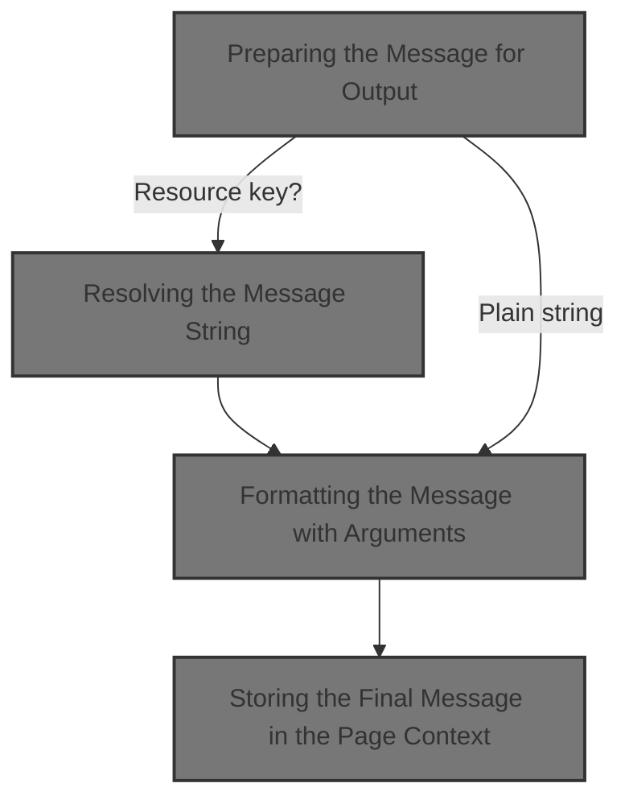
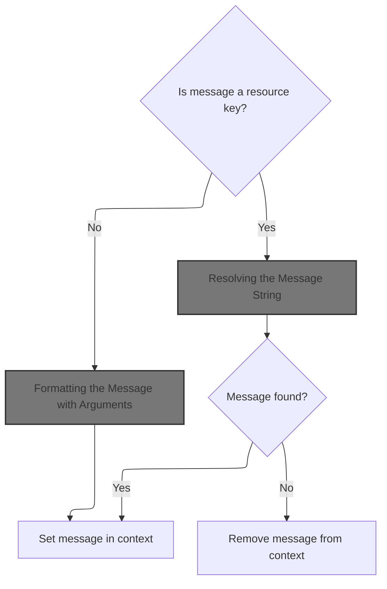
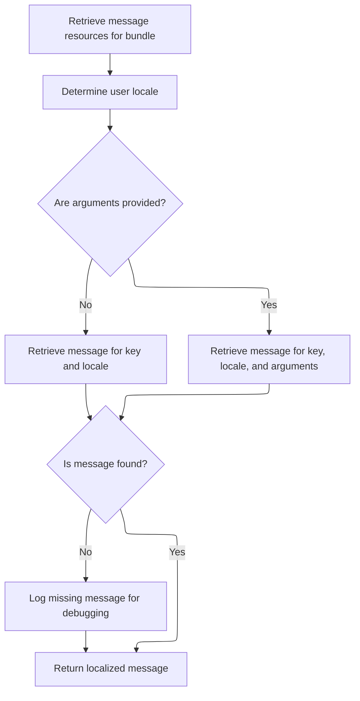
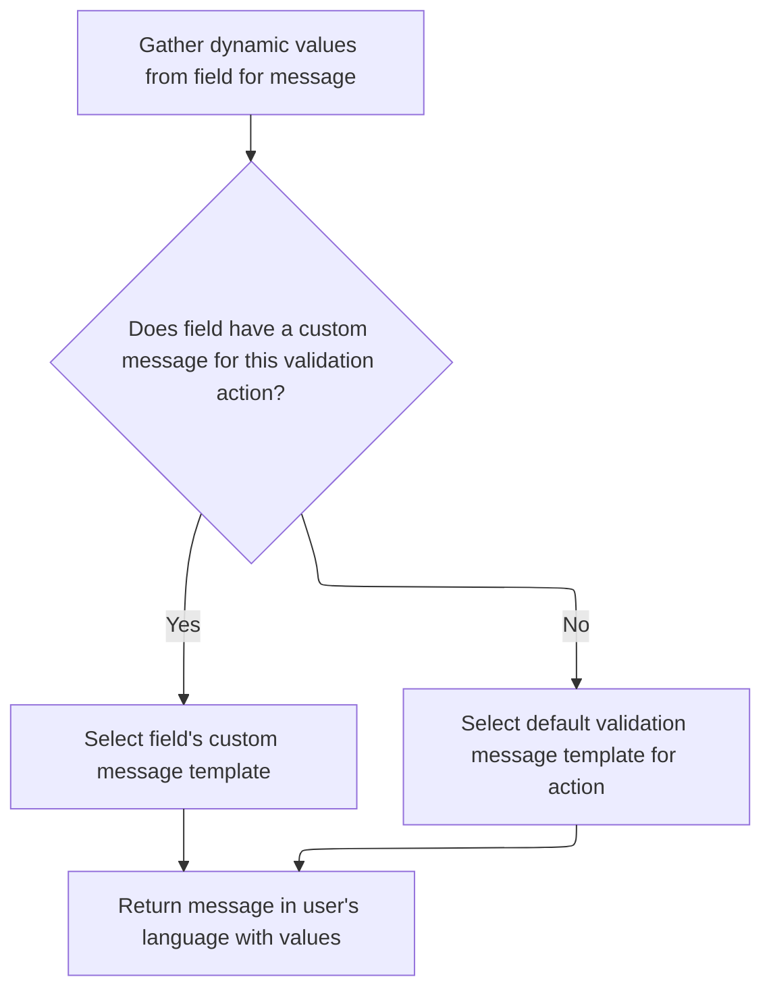
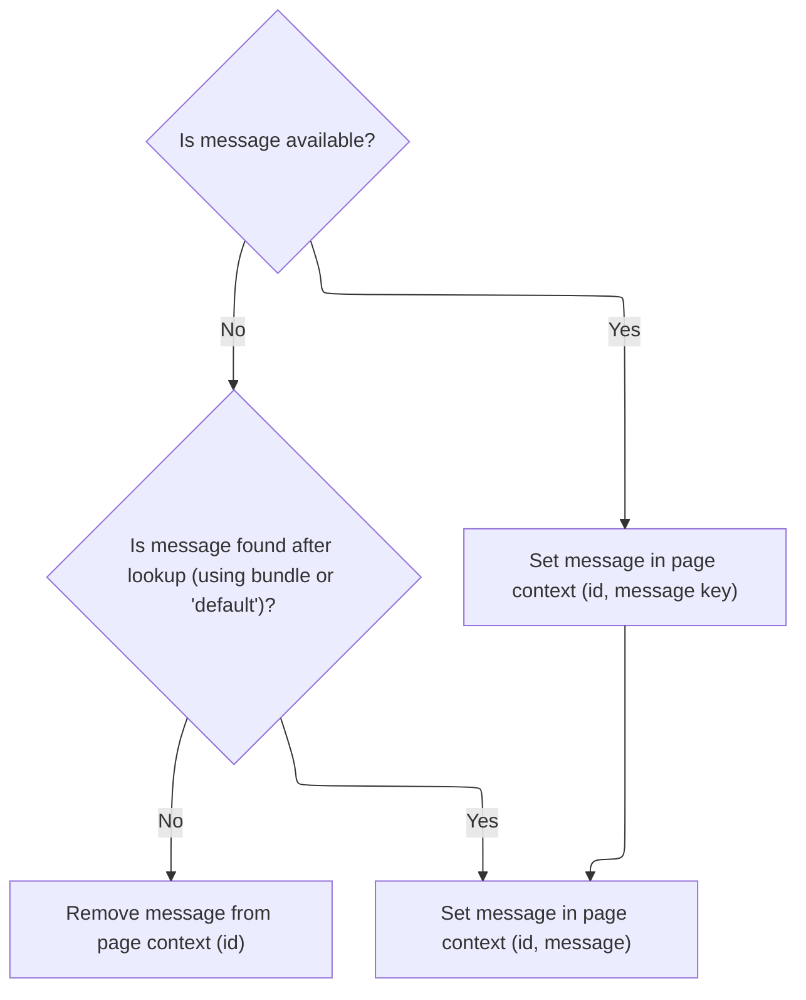

Messages shown to users are prepared by checking if they need localization or can be used as-is. If localization is required, the message is resolved and formatted with dynamic values before being stored for display. This ensures messages are presented in the correct language and format.



# Where is this flow used?

This flow is used multiple times in the codebase as represented in the following diagram:

```mermaid
graph TD;
      8bf7f4c55e8294499cb93083471ed76f74afaf4bb5dd222e7e9d67ee3346238b(taglib/…/html/MessagesTag.java::MessagesTag.doStartTag) --> 72afb4dd125b85c39db221e93726cbc34be8e9aa3cca5350087fe9a68598af37(taglib/…/html/MessagesTag.java::MessagesTag.processMessage)

fe1eff2e4d768eea4bcfdac55fc10ff525f5cce284c33dd790f59c92899472f5(taglib/…/html/MessagesTag.java::MessagesTag.doAfterBody) --> 72afb4dd125b85c39db221e93726cbc34be8e9aa3cca5350087fe9a68598af37(taglib/…/html/MessagesTag.java::MessagesTag.processMessage)


classDef mainFlowStyle color:#000000,fill:#7CB9F4
classDef rootsStyle color:#000000,fill:#00FFF4
classDef Style1 color:#000000,fill:#00FFAA
classDef Style2 color:#000000,fill:#FFFF00
classDef Style3 color:#000000,fill:#AA7CB9

%% Swimm:
%% graph TD;
%%       8bf7f4c55e8294499cb93083471ed76f74afaf4bb5dd222e7e9d67ee3346238b(<SwmPath>[taglib/…/html/MessagesTag.java](taglib/src/main/java/org/apache/struts/taglib/html/MessagesTag.java)</SwmPath>::MessagesTag.doStartTag) --> 72afb4dd125b85c39db221e93726cbc34be8e9aa3cca5350087fe9a68598af37(<SwmPath>[taglib/…/html/MessagesTag.java](taglib/src/main/java/org/apache/struts/taglib/html/MessagesTag.java)</SwmPath>::MessagesTag.processMessage)
%% 
%% fe1eff2e4d768eea4bcfdac55fc10ff525f5cce284c33dd790f59c92899472f5(<SwmPath>[taglib/…/html/MessagesTag.java](taglib/src/main/java/org/apache/struts/taglib/html/MessagesTag.java)</SwmPath>::MessagesTag.doAfterBody) --> 72afb4dd125b85c39db221e93726cbc34be8e9aa3cca5350087fe9a68598af37(<SwmPath>[taglib/…/html/MessagesTag.java](taglib/src/main/java/org/apache/struts/taglib/html/MessagesTag.java)</SwmPath>::MessagesTag.processMessage)
%% 
%% 
%% classDef mainFlowStyle color:#000000,fill:#7CB9F4
%% classDef rootsStyle color:#000000,fill:#00FFF4
%% classDef Style1 color:#000000,fill:#00FFAA
%% classDef Style2 color:#000000,fill:#FFFF00
%% classDef Style3 color:#000000,fill:#AA7CB9
```



# Preparing the Message for Output



<SwmSnippet path="/taglib/src/main/java/org/apache/struts/taglib/html/MessagesTag.java" line="293">

---

In <SwmToken path="taglib/src/main/java/org/apache/struts/taglib/html/MessagesTag.java" pos="293:5:5" line-data="    private void processMessage(ActionMessage report)">`processMessage`</SwmToken>, we start by checking if the <SwmToken path="taglib/src/main/java/org/apache/struts/taglib/html/MessagesTag.java" pos="293:7:7" line-data="    private void processMessage(ActionMessage report)">`ActionMessage`</SwmToken> is a resource, and if so, we prep the arguments (filtering if needed) and then call <SwmToken path="taglib/src/main/java/org/apache/struts/taglib/html/MessagesTag.java" pos="303:5:5" line-data="            msg = TagUtils.getInstance().message(pageContext, bundle, locale,">`TagUtils`</SwmToken> to actually resolve the message string. We need <SwmToken path="taglib/src/main/java/org/apache/struts/taglib/html/MessagesTag.java" pos="303:5:5" line-data="            msg = TagUtils.getInstance().message(pageContext, bundle, locale,">`TagUtils`</SwmToken> here because it handles the lookup logic for resource bundles, which isn't handled in this class.

```java
    private void processMessage(ActionMessage report)
        throws JspException {
        String msg = null;

        if (report.isResource()) {
            Object[] values = report.getValues();
            if (filterArgs) {
                values = filterMessageReplacementValues(values);
            }
            
            msg = TagUtils.getInstance().message(pageContext, bundle, locale,
                    report.getKey(), values);

```

---

</SwmSnippet>

## Resolving the Message String



<SwmSnippet path="/taglib/src/main/java/org/apache/struts/taglib/TagUtils.java" line="995">

---

In <SwmToken path="taglib/src/main/java/org/apache/struts/taglib/TagUtils.java" pos="995:5:5" line-data="    public String message(PageContext pageContext, String bundle,">`message`</SwmToken>, we grab the <SwmToken path="taglib/src/main/java/org/apache/struts/taglib/TagUtils.java" pos="998:1:1" line-data="        MessageResources resources =">`MessageResources`</SwmToken> for the given bundle and locale. We call <SwmToken path="taglib/src/main/java/org/apache/struts/taglib/TagUtils.java" pos="999:1:1" line-data="            retrieveMessageResources(pageContext, bundle, false);">`retrieveMessageResources`</SwmToken> first because that's where all the actual message data lives, and we need it before we can do any lookups.

```java
    public String message(PageContext pageContext, String bundle,
        String locale, String key, Object[] args)
        throws JspException {
        MessageResources resources =
            retrieveMessageResources(pageContext, bundle, false);

```

---

</SwmSnippet>

<SwmSnippet path="/taglib/src/main/java/org/apache/struts/taglib/TagUtils.java" line="1118">

---

<SwmToken path="taglib/src/main/java/org/apache/struts/taglib/TagUtils.java" pos="1118:5:5" line-data="    public MessageResources retrieveMessageResources(PageContext pageContext,">`retrieveMessageResources`</SwmToken> checks for <SwmToken path="taglib/src/main/java/org/apache/struts/taglib/TagUtils.java" pos="1118:3:3" line-data="    public MessageResources retrieveMessageResources(PageContext pageContext,">`MessageResources`</SwmToken> in page, request, and application scopes (with and without a module prefix), in that order. This lets us override messages at more specific levels before using the global ones. If nothing is found, it throws.

```java
    public MessageResources retrieveMessageResources(PageContext pageContext,
        String bundle, boolean checkPageScope)
        throws JspException {
        MessageResources resources = null;

        if (bundle == null) {
            bundle = Globals.MESSAGES_KEY;
        }

        if (checkPageScope) {
            resources =
                (MessageResources) pageContext.getAttribute(bundle,
                    PageContext.PAGE_SCOPE);
        }

        if (resources == null) {
            resources =
                (MessageResources) pageContext.getAttribute(bundle,
                    PageContext.REQUEST_SCOPE);
        }

        if (resources == null) {
            ModuleConfig moduleConfig = getModuleConfig(pageContext);

            resources =
                (MessageResources) pageContext.getAttribute(bundle
                    + moduleConfig.getPrefix(), PageContext.APPLICATION_SCOPE);
        }

        if (resources == null) {
            resources =
                (MessageResources) pageContext.getAttribute(bundle,
                    PageContext.APPLICATION_SCOPE);
        }

        if (resources == null) {
            JspException e =
                new JspException(messages.getMessage("message.bundle", bundle));

            saveException(pageContext, e);
            throw e;
        }

        return resources;
    }
```

---

</SwmSnippet>

<SwmSnippet path="/taglib/src/main/java/org/apache/struts/taglib/TagUtils.java" line="1001">

---

Back in `TagUtils.message`, after getting the resources, we resolve the user's locale and fetch the message string, with or without arguments. If the message isn't found, we log it for debugging. Next, we call into Resources to handle more complex message formatting.

```java
        Locale userLocale = getUserLocale(pageContext, locale);
        String message = null;

        if (args == null) {
            message = resources.getMessage(userLocale, key);
        } else {
            message = resources.getMessage(userLocale, key, args);
        }

        if ((message == null) && log.isDebugEnabled()) {
            // log missing key to ease debugging
            log.debug(resources.getMessage("message.resources", key, bundle,
                    locale));
        }

        return message;
    }
```

---

</SwmSnippet>

## Formatting the Message with Arguments



<SwmSnippet path="/core/src/main/java/org/apache/struts/validator/Resources.java" line="265">

---

In <SwmToken path="core/src/main/java/org/apache/struts/validator/Resources.java" pos="265:7:7" line-data="    public static String getMessage(MessageResources messages, Locale locale,">`getMessage`</SwmToken>, we grab the arguments for the message using <SwmToken path="core/src/main/java/org/apache/struts/validator/Resources.java" pos="267:9:9" line-data="        String[] args = getArgs(va.getName(), messages, locale, field);">`getArgs`</SwmToken>, since some messages need runtime values plugged in. This sets up everything for the final message formatting.

```java
    public static String getMessage(MessageResources messages, Locale locale,
        ValidatorAction va, Field field) {
        String[] args = getArgs(va.getName(), messages, locale, field);
```

---

</SwmSnippet>

<SwmSnippet path="/core/src/main/java/org/apache/struts/validator/Resources.java" line="420">

---

<SwmToken path="core/src/main/java/org/apache/struts/validator/Resources.java" pos="420:9:9" line-data="    public static String[] getArgs(String actionName,">`getArgs`</SwmToken> builds an array of up to four arguments for the message, checking each one to see if it's a resource (and resolving it if so) or just a plain value. Anything beyond four is ignored.

```java
    public static String[] getArgs(String actionName,
        MessageResources messages, Locale locale, Field field) {
        String[] argMessages = new String[4];

        Arg[] args =
            new Arg[] {
                field.getArg(actionName, 0), field.getArg(actionName, 1),
                field.getArg(actionName, 2), field.getArg(actionName, 3)
            };

        for (int i = 0; i < args.length; i++) {
            if (args[i] == null) {
                continue;
            }

            if (args[i].isResource()) {
                argMessages[i] = getMessage(messages, locale, args[i].getKey());
            } else {
                argMessages[i] = args[i].getKey();
            }
        }
```

---

</SwmSnippet>

<SwmSnippet path="/core/src/main/java/org/apache/struts/validator/Resources.java" line="268">

---

After getting the args from <SwmToken path="core/src/main/java/org/apache/struts/validator/Resources.java" pos="267:9:9" line-data="        String[] args = getArgs(va.getName(), messages, locale, field);">`getArgs`</SwmToken>, we check if the field has a custom message and use it if present; otherwise, we fall back to the default from <SwmToken path="core/src/main/java/org/apache/struts/validator/Resources.java" pos="266:1:1" line-data="        ValidatorAction va, Field field) {">`ValidatorAction`</SwmToken>. Then we call <SwmToken path="core/src/main/java/org/apache/struts/validator/Resources.java" pos="272:3:5" line-data="        return messages.getMessage(locale, msg, args);">`messages.getMessage`</SwmToken> to format the final string.

```java
        String msg =
            (field.getMsg(va.getName()) != null) ? field.getMsg(va.getName())
                                                 : va.getMsg();

        return messages.getMessage(locale, msg, args);
    }
```

---

</SwmSnippet>

## Storing the Final Message in the Page Context



<SwmSnippet path="/taglib/src/main/java/org/apache/struts/taglib/html/MessagesTag.java" line="306">

---

Back in <SwmToken path="taglib/src/main/java/org/apache/struts/taglib/html/MessagesTag.java" pos="293:5:5" line-data="    private void processMessage(ActionMessage report)">`processMessage`</SwmToken>, after resolving the message, we either set it in the page context under the given id or remove the attribute if the message is still null. This controls what gets rendered in the JSP.

```java
            if (msg == null) {
                String bundleName = (bundle == null) ? "default" : bundle;

                msg = messageResources.getMessage("messagesTag.notfound",
                        report.getKey(), bundleName);
            }
        } else {
            msg = report.getKey();
        }

        if (msg == null) {
            pageContext.removeAttribute(id);
        } else {
            pageContext.setAttribute(id, msg);
        }
    }
```

---

</SwmSnippet>

&nbsp;

*This is an auto-generated document by Swimm 🌊 and has not yet been verified by a human*

<SwmMeta version="3.0.0" repo-id="Z2l0aHViJTNBJTNBc3RydXRzMSUzQSUzQVN3aW1tLURlbW8=" repo-name="struts1"><sup>Powered by [Swimm](https://app.swimm.io/)</sup></SwmMeta>
