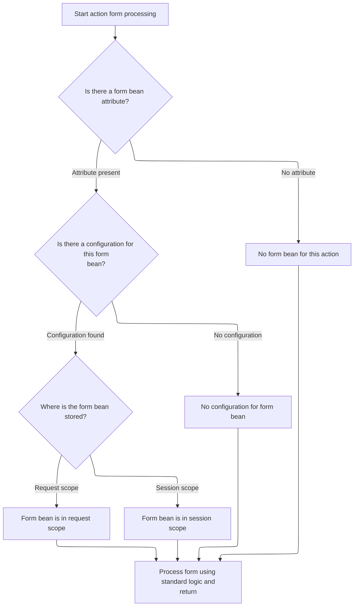
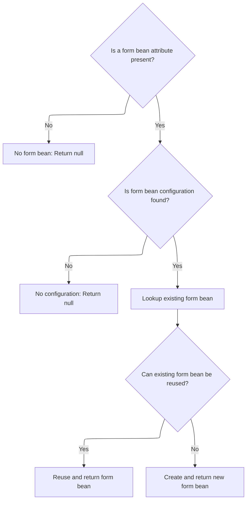
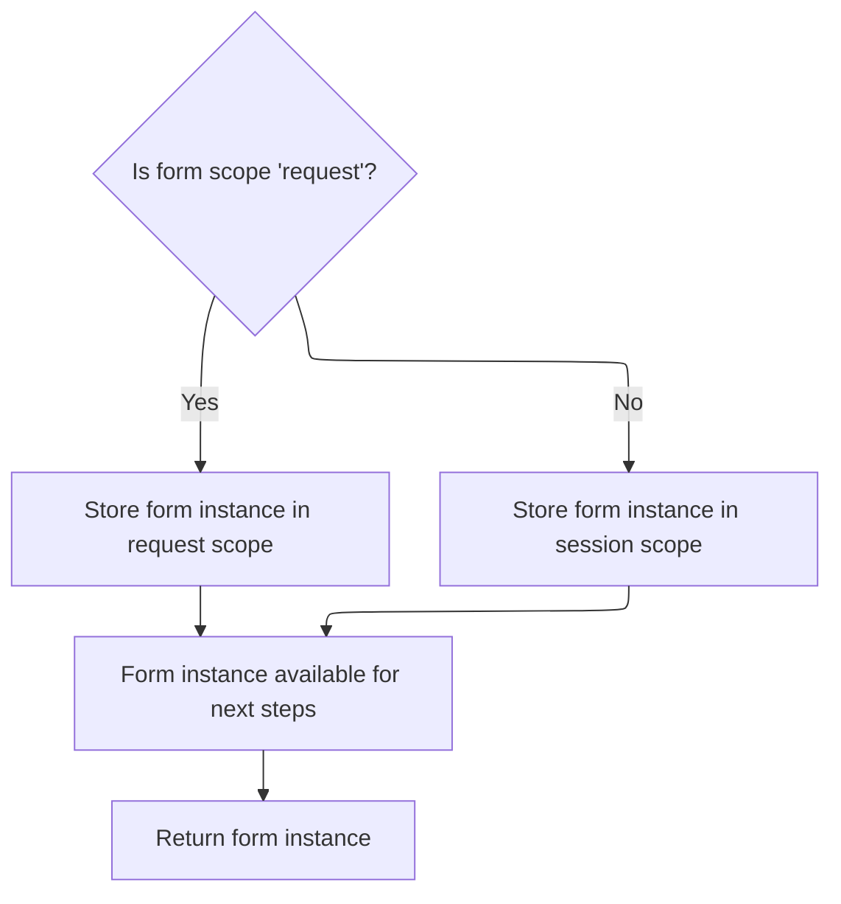

This document describes how the system prepares and provides a form bean for an action as part of the request processing pipeline. When an HTTP request targets an action, the system checks if a form bean is required, reuses an existing instance if possible, or creates a new one, and stores it in the appropriate scope for the action to use.

# Resolving the Action Form Attribute



<SwmSnippet path="/faces/src/main/java/org/apache/struts/faces/application/FacesTilesRequestProcessor.java" line="208">

---

In <SwmToken path="faces/src/main/java/org/apache/struts/faces/application/FacesTilesRequestProcessor.java" pos="208:5:5" line-data="    protected ActionForm processActionForm(HttpServletRequest request,">`processActionForm`</SwmToken>, we start by logging the action form processing and immediately fetch the attribute from the mapping. This attribute determines if and how a form bean should be handled for the current action. To get the attribute, we need to call into <SwmToken path="core/src/main/java/org/apache/struts/config/ActionConfig.java" pos="41:4:4" line-data="public class ActionConfig extends BaseConfig {">`ActionConfig`</SwmToken>, since it might have fallback logic if the attribute isn't set directly.

```java
    protected ActionForm processActionForm(HttpServletRequest request,
                                           HttpServletResponse response,
                                           ActionMapping mapping) {
        if (log.isTraceEnabled()) {
            log.trace("Performing standard action form processing");
            String attribute = mapping.getAttribute();
```

---

</SwmSnippet>

<SwmSnippet path="/core/src/main/java/org/apache/struts/config/ActionConfig.java" line="321">

---

<SwmToken path="core/src/main/java/org/apache/struts/config/ActionConfig.java" pos="321:5:5" line-data="    public String getAttribute() {">`getAttribute`</SwmToken> handles the logic for returning the attribute name used for form beans. If 'attribute' isn't set, it falls back to 'name', which is a repository-specific convention. This fallback isn't obvious from the method name, so you need to know that 'name' will be used if 'attribute' is missing.

```java
    public String getAttribute() {
        if (this.attribute == null) {
            return (this.name);
        } else {
            return (this.attribute);
        }
    }
```

---

</SwmSnippet>

<SwmSnippet path="/faces/src/main/java/org/apache/struts/faces/application/FacesTilesRequestProcessor.java" line="214">

---

Back in `FacesTilesRequestProcessor.processActionForm`, after getting the attribute, we check for the form bean in the configured scope and log what we find. If a <SwmToken path="faces/src/main/java/org/apache/struts/faces/application/FacesTilesRequestProcessor.java" pos="216:1:1" line-data="                FormBeanConfig fbc = moduleConfig.findFormBeanConfig(name);">`FormBeanConfig`</SwmToken> exists, we log the bean from the right scope; otherwise, we log that it's missing. Finally, we call the superclass's <SwmToken path="faces/src/main/java/org/apache/struts/faces/application/FacesTilesRequestProcessor.java" pos="233:3:3" line-data="            super.processActionForm(request, response, mapping);">`processActionForm`</SwmToken> to actually create or retrieve the <SwmToken path="faces/src/main/java/org/apache/struts/faces/application/FacesTilesRequestProcessor.java" pos="232:1:1" line-data="        ActionForm result =">`ActionForm`</SwmToken>, which means we now jump into the core Struts logic in <SwmToken path="faces/src/main/java/org/apache/struts/faces/application/FacesTilesRequestProcessor.java" pos="54:15:15" line-data=" * &lt;p&gt;Concrete implementation of &lt;code&gt;RequestProcessor&lt;/code&gt; that">`RequestProcessor`</SwmToken>.

```java
            if (attribute != null) {
                String name = mapping.getName();
                FormBeanConfig fbc = moduleConfig.findFormBeanConfig(name);
                if (fbc != null) {
                    if ("request".equals(mapping.getScope())) {
                        log.trace("  Bean in request scope = " +
                                  request.getAttribute(attribute));
                    } else {
                        log.trace("  Bean in session scope = " +
                                  request.getSession().getAttribute(attribute));
                    }
                } else {
                    log.trace("  No FormBeanConfig for '" + name + "'");
                }
            } else {
                log.trace("  No form bean for this action");
            }
        }
        ActionForm result =
            super.processActionForm(request, response, mapping);
        if (log.isDebugEnabled()) {
            log.debug("Standard action form returned " +
                      result);
        }
        return (result);


    }
```

---

</SwmSnippet>

# Creating or Reusing the Action Form

<SwmSnippet path="/core/src/main/java/org/apache/struts/action/RequestProcessor.java" line="316">

---

In <SwmToken path="core/src/main/java/org/apache/struts/action/RequestProcessor.java" pos="316:5:5" line-data="    protected ActionForm processActionForm(HttpServletRequest request,">`processActionForm`</SwmToken> (<SwmToken path="faces/src/main/java/org/apache/struts/faces/application/FacesTilesRequestProcessor.java" pos="54:15:15" line-data=" * &lt;p&gt;Concrete implementation of &lt;code&gt;RequestProcessor&lt;/code&gt; that">`RequestProcessor`</SwmToken>), we call into <SwmToken path="core/src/main/java/org/apache/struts/action/RequestProcessor.java" pos="320:1:1" line-data="            RequestUtils.createActionForm(request, mapping, moduleConfig,">`RequestUtils`</SwmToken> to handle the actual creation or lookup of the <SwmToken path="core/src/main/java/org/apache/struts/action/RequestProcessor.java" pos="316:3:3" line-data="    protected ActionForm processActionForm(HttpServletRequest request,">`ActionForm`</SwmToken>. This keeps the logic for form bean instantiation and reuse in one place, and lets us handle scope and config details consistently. If no form is found, we return null early.

```java
    protected ActionForm processActionForm(HttpServletRequest request,
        HttpServletResponse response, ActionMapping mapping) {
        // Create (if necessary) a form bean to use
        ActionForm instance =
            RequestUtils.createActionForm(request, mapping, moduleConfig,
                servlet);

        if (instance == null) {
            return (null);
        }

        // Store the new instance in the appropriate scope
        if (log.isDebugEnabled()) {
            log.debug(" Storing ActionForm bean instance in scope '"
                + mapping.getScope() + "' under attribute key '"
                + mapping.getAttribute() + "'");
        }

```

---

</SwmSnippet>

## Looking Up and Validating the Action Form



<SwmSnippet path="/core/src/main/java/org/apache/struts/util/RequestUtils.java" line="187">

---

In <SwmToken path="core/src/main/java/org/apache/struts/util/RequestUtils.java" pos="187:7:7" line-data="    public static ActionForm createActionForm(HttpServletRequest request,">`createActionForm`</SwmToken>, we grab the attribute from the mapping and bail out if it's null. Then we look up the <SwmToken path="faces/src/main/java/org/apache/struts/faces/application/FacesTilesRequestProcessor.java" pos="216:1:1" line-data="                FormBeanConfig fbc = moduleConfig.findFormBeanConfig(name);">`FormBeanConfig`</SwmToken> using the mapping's name. If the config isn't found, we log a warning and return null. To get the attribute, we rely on <SwmToken path="core/src/main/java/org/apache/struts/config/ActionConfig.java" pos="41:4:4" line-data="public class ActionConfig extends BaseConfig {">`ActionConfig`</SwmToken> logic, which might apply fallback rules.

```java
    public static ActionForm createActionForm(HttpServletRequest request,
        ActionMapping mapping, ModuleConfig moduleConfig, ActionServlet servlet) {
        // Is there a form bean associated with this mapping?
        String attribute = mapping.getAttribute();

        if (attribute == null) {
            return (null);
        }

```

---

</SwmSnippet>

<SwmSnippet path="/core/src/main/java/org/apache/struts/util/RequestUtils.java" line="196">

---

Just returned from <SwmToken path="core/src/main/java/org/apache/struts/config/ActionConfig.java" pos="41:4:4" line-data="public class ActionConfig extends BaseConfig {">`ActionConfig`</SwmToken>, now in <SwmToken path="core/src/main/java/org/apache/struts/action/RequestProcessor.java" pos="320:3:3" line-data="            RequestUtils.createActionForm(request, mapping, moduleConfig,">`createActionForm`</SwmToken> we use the mapping's name to find the <SwmToken path="core/src/main/java/org/apache/struts/util/RequestUtils.java" pos="198:1:1" line-data="        FormBeanConfig config = moduleConfig.findFormBeanConfig(name);">`FormBeanConfig`</SwmToken>. If it's found, we call <SwmToken path="core/src/main/java/org/apache/struts/util/RequestUtils.java" pos="207:1:1" line-data="            lookupActionForm(request, attribute, mapping.getScope());">`lookupActionForm`</SwmToken> to see if there's already a form instance in the right scope that we can reuse.

```java
        // Look up the form bean configuration information to use
        String name = mapping.getName();
        FormBeanConfig config = moduleConfig.findFormBeanConfig(name);

        if (config == null) {
            log.warn("No FormBeanConfig found under '" + name + "'");

            return (null);
        }

        ActionForm instance =
            lookupActionForm(request, attribute, mapping.getScope());

```

---

</SwmSnippet>

<SwmSnippet path="/core/src/main/java/org/apache/struts/util/RequestUtils.java" line="217">

---

<SwmToken path="core/src/main/java/org/apache/struts/util/RequestUtils.java" pos="217:7:7" line-data="    private static ActionForm lookupActionForm(HttpServletRequest request,">`lookupActionForm`</SwmToken> checks for an existing <SwmToken path="core/src/main/java/org/apache/struts/util/RequestUtils.java" pos="217:5:5" line-data="    private static ActionForm lookupActionForm(HttpServletRequest request,">`ActionForm`</SwmToken> in the specified scope. If the scope is 'request', it looks in the request attributes; otherwise, it defaults to session. There's no validation for other scope values, so anything not 'request' is treated as session.

```java
    private static ActionForm lookupActionForm(HttpServletRequest request,
        String attribute, String scope) {
        // Look up any existing form bean instance
        if (log.isDebugEnabled()) {
            log.debug(" Looking for ActionForm bean instance in scope '"
                + scope + "' under attribute key '" + attribute + "'");
        }

        ActionForm instance = null;
        HttpSession session = null;

        if ("request".equals(scope)) {
            instance = (ActionForm) request.getAttribute(attribute);
        } else {
            session = request.getSession();
            instance = (ActionForm) session.getAttribute(attribute);
        }

        return (instance);
    }
```

---

</SwmSnippet>

<SwmSnippet path="/core/src/main/java/org/apache/struts/util/RequestUtils.java" line="209">

---

Just returned from <SwmToken path="core/src/main/java/org/apache/struts/util/RequestUtils.java" pos="207:1:1" line-data="            lookupActionForm(request, attribute, mapping.getScope());">`lookupActionForm`</SwmToken>, now in <SwmToken path="core/src/main/java/org/apache/struts/util/RequestUtils.java" pos="214:3:3" line-data="        return createActionForm(config, servlet);">`createActionForm`</SwmToken> we check if the found instance can be reused using <SwmToken path="faces/src/main/java/org/apache/struts/faces/application/FacesTilesRequestProcessor.java" pos="216:1:1" line-data="                FormBeanConfig fbc = moduleConfig.findFormBeanConfig(name);">`FormBeanConfig`</SwmToken>. If it can't, we create a new <SwmToken path="faces/src/main/java/org/apache/struts/faces/application/FacesTilesRequestProcessor.java" pos="208:3:3" line-data="    protected ActionForm processActionForm(HttpServletRequest request,">`ActionForm`</SwmToken>. This step ensures we don't waste resources or accidentally use an incompatible form.

```java
        // Can we recycle the existing form bean instance (if there is one)?
        if ((instance != null) && config.canReuse(instance)) {
            return (instance);
        }

        return createActionForm(config, servlet);
    }
```

---

</SwmSnippet>

<SwmSnippet path="/core/src/main/java/org/apache/struts/config/FormBeanConfig.java" line="369">

---

<SwmToken path="core/src/main/java/org/apache/struts/config/FormBeanConfig.java" pos="369:5:5" line-data="    public boolean canReuse(ActionForm form) {">`canReuse`</SwmToken> checks if the <SwmToken path="core/src/main/java/org/apache/struts/config/FormBeanConfig.java" pos="369:7:7" line-data="    public boolean canReuse(ActionForm form) {">`ActionForm`</SwmToken> instance matches the expected type. For dynamic forms, it compares the <SwmToken path="core/src/main/java/org/apache/struts/config/FormBeanConfig.java" pos="372:9:9" line-data="                String className = ((DynaBean) form).getDynaClass().getName();">`DynaBean`</SwmToken> class name with the config name. For <SwmToken path="core/src/main/java/org/apache/struts/config/FormBeanConfig.java" pos="385:8:8" line-data="                    if (form instanceof BeanValidatorForm) {">`BeanValidatorForm`</SwmToken>, it digs into the wrapped instance and checks compatibility. Otherwise, it uses class type checks. These checks are needed because dynamic and validator forms have different reuse rules.

```java
    public boolean canReuse(ActionForm form) {
        if (form != null) {
            if (this.getDynamic()) {
                String className = ((DynaBean) form).getDynaClass().getName();

                if (className.equals(this.getName())) {
                    log.debug("Can reuse existing instance (dynamic)");

                    return (true);
                }
            } else {
                try {
                    // check if the form's class is compatible with the class
                    //      we're configured for
                    Class formClass = form.getClass();

                    if (form instanceof BeanValidatorForm) {
                        BeanValidatorForm beanValidatorForm =
                            (BeanValidatorForm) form;

                        if (beanValidatorForm.getInstance() instanceof DynaBean) {
                            String formName = beanValidatorForm.getStrutsConfigFormName();
                            if (getName().equals(formName)) {
                                log.debug("Can reuse existing instance (BeanValidatorForm)");
                                return true;
                            } else {
                                return false;
                            }
                        }
                        formClass = beanValidatorForm.getInstance().getClass();
                    }

                    Class configClass =
                        ClassUtils.getApplicationClass(this.getType());

                    if (configClass.isAssignableFrom(formClass)) {
                        log.debug("Can reuse existing instance (non-dynamic)");

                        return (true);
                    }
                } catch (Exception e) {
                    log.debug("Error testing existing instance for reusability; just create a new instance",
                        e);
                }
            }
        }

        return false;
    }
```

---

</SwmSnippet>

## Storing the Action Form in the Correct Scope



<SwmSnippet path="/core/src/main/java/org/apache/struts/action/RequestProcessor.java" line="334">

---

Just returned from <SwmToken path="core/src/main/java/org/apache/struts/action/RequestProcessor.java" pos="320:1:3" line-data="            RequestUtils.createActionForm(request, mapping, moduleConfig,">`RequestUtils.createActionForm`</SwmToken>, now in <SwmToken path="faces/src/main/java/org/apache/struts/faces/application/FacesTilesRequestProcessor.java" pos="208:5:5" line-data="    protected ActionForm processActionForm(HttpServletRequest request,">`processActionForm`</SwmToken> (<SwmToken path="faces/src/main/java/org/apache/struts/faces/application/FacesTilesRequestProcessor.java" pos="54:15:15" line-data=" * &lt;p&gt;Concrete implementation of &lt;code&gt;RequestProcessor&lt;/code&gt; that">`RequestProcessor`</SwmToken>) we store the <SwmToken path="faces/src/main/java/org/apache/struts/faces/application/FacesTilesRequestProcessor.java" pos="208:3:3" line-data="    protected ActionForm processActionForm(HttpServletRequest request,">`ActionForm`</SwmToken> in the scope specified by the mapping—either request or session. This makes the form available for the rest of the request or for the user's session, as configured.

```java
        if ("request".equals(mapping.getScope())) {
            request.setAttribute(mapping.getAttribute(), instance);
        } else {
            HttpSession session = request.getSession();

            session.setAttribute(mapping.getAttribute(), instance);
        }

        return (instance);
    }
```

---

</SwmSnippet>

&nbsp;

*This is an auto-generated document by Swimm 🌊 and has not yet been verified by a human*

<SwmMeta version="3.0.0" repo-id="Z2l0aHViJTNBJTNBc3RydXRzMSUzQSUzQVN3aW1tLURlbW8=" repo-name="struts1"><sup>Powered by [Swimm](https://app.swimm.io/)</sup></SwmMeta>
