This document describes how a form element is prepared and rendered so it is correctly linked to the application's action and form bean configuration. The process ensures the form is mapped to the right backend action, includes necessary hidden fields and tokens, and has a form bean instance ready for user interaction.

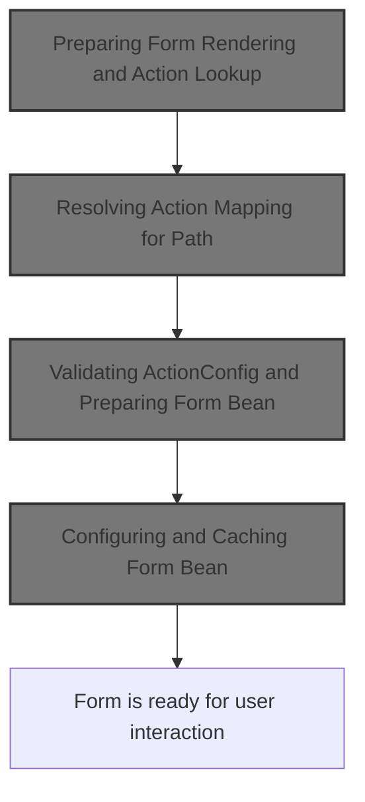

# Preparing Form Rendering and Action Lookup

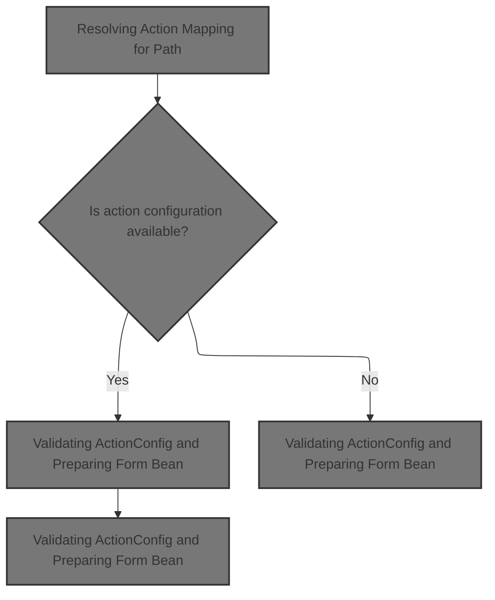

<SwmSnippet path="/faces/src/main/java/org/apache/struts/faces/renderer/FormRenderer.java" line="107">

---

In <SwmToken path="faces/src/main/java/org/apache/struts/faces/renderer/FormRenderer.java" pos="107:5:5" line-data="    public void encodeBegin(FacesContext context, UIComponent component)">`encodeBegin`</SwmToken>, we validate the context and component, cast the component to <SwmToken path="faces/src/main/java/org/apache/struts/faces/renderer/FormRenderer.java" pos="115:1:1" line-data="        FormComponent form = (FormComponent) component;">`FormComponent`</SwmToken>, and extract the action string. We then look up the module and action configuration to figure out how the form should be wired up. This is where we need to call <SwmToken path="core/src/main/java/org/apache/struts/config/impl/ModuleConfigImpl.java" pos="58:4:4" line-data="public class ModuleConfigImpl extends BaseConfig implements Serializable,">`ModuleConfigImpl`</SwmToken> next, since finding the right <SwmToken path="faces/src/main/java/org/apache/struts/faces/renderer/FormRenderer.java" pos="118:1:1" line-data="        ActionConfig actionConfig = moduleConfig.findActionConfig(action);">`ActionConfig`</SwmToken> is required before we can proceed with encoding the rest of the form and handling things like hidden fields, tokens, and bean creation.

```java
    public void encodeBegin(FacesContext context, UIComponent component)
        throws IOException {

        if ((context == null) || (component == null)) {
            throw new NullPointerException();
        }

        // Calculate and cache the form name
        FormComponent form = (FormComponent) component;
        String action = form.getAction();
        ModuleConfig moduleConfig = form.lookupModuleConfig(context);
        ActionConfig actionConfig = moduleConfig.findActionConfig(action);
```

---

</SwmSnippet>

## Resolving Action Mapping for Path

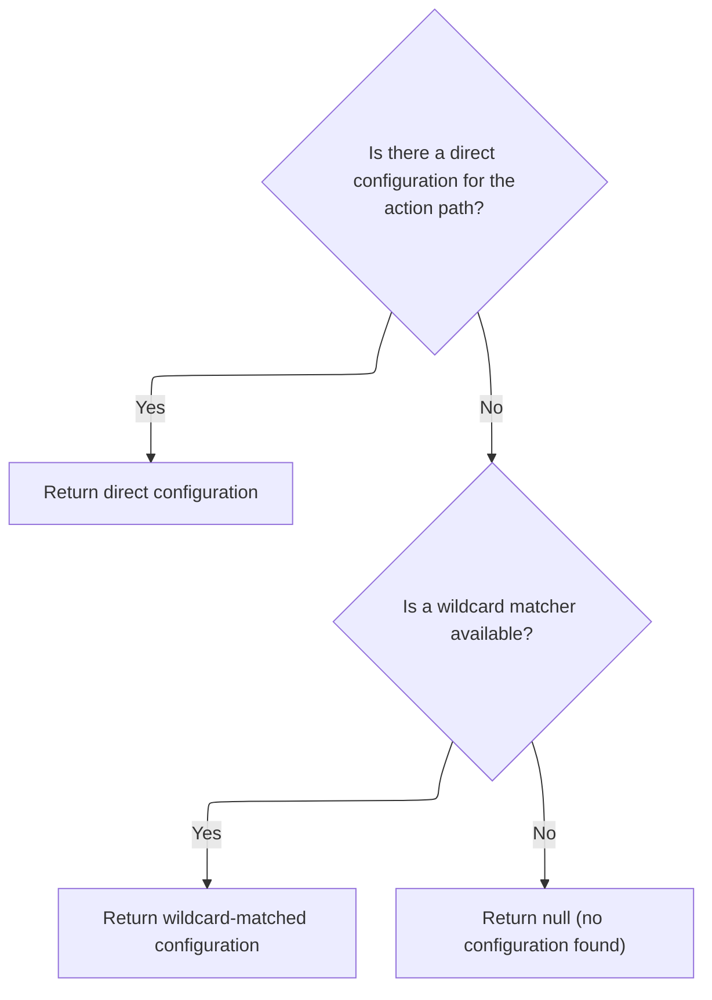

<SwmSnippet path="/core/src/main/java/org/apache/struts/config/impl/ModuleConfigImpl.java" line="436">

---

<SwmToken path="core/src/main/java/org/apache/struts/config/impl/ModuleConfigImpl.java" pos="436:5:5" line-data="    public ActionConfig findActionConfig(String path) {">`findActionConfig`</SwmToken> checks for a direct match in the <SwmToken path="core/src/main/java/org/apache/struts/config/impl/ModuleConfigImpl.java" pos="437:11:11" line-data="        ActionConfig config = (ActionConfig) actionConfigs.get(path);">`actionConfigs`</SwmToken> map. If it doesn't find one and a matcher is available, it tries to match the path using wildcard patterns. That's why we need to call <SwmToken path="core/src/main/java/org/apache/struts/config/impl/ModuleConfigImpl.java" pos="27:10:10" line-data="import org.apache.struts.config.ActionConfigMatcher;">`ActionConfigMatcher`</SwmToken> next—to handle cases where the action path isn't an exact match but could fit a wildcard mapping.

```java
    public ActionConfig findActionConfig(String path) {
        ActionConfig config = (ActionConfig) actionConfigs.get(path);

        // If a direct match cannot be found, try to match action configs
        // containing wildcard patterns only if a matcher exists.
        if ((config == null) && (matcher != null)) {
            config = matcher.match(path);
        }

        return config;
    }
```

---

</SwmSnippet>

## Wildcard Pattern Matching for Actions

<SwmSnippet path="/core/src/main/java/org/apache/struts/config/ActionConfigMatcher.java" line="101">

---

In <SwmToken path="core/src/main/java/org/apache/struts/config/ActionConfigMatcher.java" pos="101:5:5" line-data="    public ActionConfig match(String path) {">`match`</SwmToken>, we loop through all compiled wildcard patterns to see if any match the given path. To do this, we need to use <SwmToken path="core/src/main/java/org/apache/struts/util/IteratorAdapter.java" pos="36:4:4" line-data="public class IteratorAdapter implements Iterator {">`IteratorAdapter`</SwmToken> to handle the iteration, since <SwmToken path="core/src/main/java/org/apache/struts/config/ActionConfigMatcher.java" pos="104:4:4" line-data="        if (compiledPaths.size() &gt; 0) {">`compiledPaths`</SwmToken> might be backed by an Enumeration. This lets us check each Mapping for a possible match.

```java
    public ActionConfig match(String path) {
        ActionConfig config = null;

        if (compiledPaths.size() > 0) {
            if (log.isDebugEnabled()) {
                log.debug("Attempting to match '" + path
                    + "' to a wildcard pattern");
            }

            if ((path.length() > 0) && (path.charAt(0) == '/')) {
                path = path.substring(1);
            }

            Mapping m;
            HashMap vars = new HashMap();

            for (Iterator i = compiledPaths.iterator(); i.hasNext();) {
                m = (Mapping) i.next();

```

---

</SwmSnippet>

<SwmSnippet path="/core/src/main/java/org/apache/struts/util/IteratorAdapter.java" line="47">

---

<SwmToken path="core/src/main/java/org/apache/struts/util/IteratorAdapter.java" pos="47:5:5" line-data="    public Object next() {">`next`</SwmToken> in <SwmToken path="core/src/main/java/org/apache/struts/util/IteratorAdapter.java" pos="36:4:4" line-data="public class IteratorAdapter implements Iterator {">`IteratorAdapter`</SwmToken> pulls the next element from an Enumeration, throwing if there are no more elements. This is needed because the matching logic expects to use Iterator semantics, but the underlying collection might only provide Enumeration.

```java
    public Object next() {
        if (!e.hasMoreElements()) {
            throw new NoSuchElementException(
                "IteratorAdaptor.next() has no more elements");
        }

        return e.nextElement();
    }
```

---

</SwmSnippet>

<SwmSnippet path="/core/src/main/java/org/apache/struts/config/ActionConfigMatcher.java" line="120">

---

Back in ActionConfigMatcher.match, after getting the next Mapping from <SwmToken path="core/src/main/java/org/apache/struts/util/IteratorAdapter.java" pos="36:4:4" line-data="public class IteratorAdapter implements Iterator {">`IteratorAdapter`</SwmToken>, we call WildcardHelper.match to see if the path matches the wildcard pattern. This step is what actually checks if the current Mapping applies to the requested path.

```java
                if (wildcard.match(vars, path, m.getPattern())) {
                    if (log.isDebugEnabled()) {
                        log.debug("Path matches pattern '"
                            + m.getActionConfig().getPath() + "'");
                    }

```

---

</SwmSnippet>

### Evaluating Path Against Wildcard Patterns

See <SwmLink doc-title="Pattern Matching and Extraction Flow">[Pattern Matching and Extraction Flow](/.swm/pattern-matching-and-extraction-flow.rflr4tdf.sw.md)</SwmLink>

### Wildcard Match Result Handling

<SwmSnippet path="/core/src/main/java/org/apache/struts/config/ActionConfigMatcher.java" line="126">

---

Just returned from WildcardHelper.match: if the path matches, we call <SwmToken path="core/src/main/java/org/apache/struts/config/ActionConfigMatcher.java" pos="128:1:1" line-data="                	    convertActionConfig(path,">`convertActionConfig`</SwmToken> to create a new <SwmToken path="core/src/main/java/org/apache/struts/config/ActionConfigMatcher.java" pos="129:2:2" line-data="                		    (ActionConfig) m.getActionConfig(), vars);">`ActionConfig`</SwmToken> with the matched variables filled in. This is where we handle variable substitution and check for recursive substitution issues.

```java
                    try {
                	config =
                	    convertActionConfig(path,
                		    (ActionConfig) m.getActionConfig(), vars);
                    } catch (IllegalStateException e) {
                	log.warn("Path matches pattern '"
                		+ m.getActionConfig().getPath() + "' but is "
                		+ "incompatible with the matching config due "
                		+ "to recursive substitution: "
                		+ path);
                	config = null;
                    }
                }
            }
        }

        return config;
    }
```

---

</SwmSnippet>

## Substituting Variables into <SwmToken path="faces/src/main/java/org/apache/struts/faces/renderer/FormRenderer.java" pos="118:1:1" line-data="        ActionConfig actionConfig = moduleConfig.findActionConfig(action);">`ActionConfig`</SwmToken>

```mermaid
%%{init: {"flowchart": {"defaultRenderer": "elk"}} }%%
flowchart TD
  node1["Clone the original configuration"] --> node2{"Was cloning successful?"}
  click node1 openCode "core/src/main/java/org/apache/struts/config/ActionConfigMatcher.java:157:169"
  node2 -->|"No"| node7["Updating ForwardConfig References"]
  click node2 openCode "core/src/main/java/org/apache/struts/config/ActionConfigMatcher.java:161:168"
  
  node2 -->|"Yes"| node3["Finalizing ActionConfig Field Substitution"]
  
  node3 --> node4["Finalizing ActionConfig Field Substitution"]
  
  node4 --> node5["Substituting Remaining Config Fields"]
  
  node5 --> node6["Customize forward mappings"]
  click node6 openCode "core/src/main/java/org/apache/struts/config/ActionConfigMatcher.java:190:211"
  
  subgraph loop1["For each forward mapping in the original
configuration"]
    node6 --> node61["Clone and substitute variables in
forward mapping"]
    click node61 openCode "core/src/main/java/org/apache/struts/config/ActionConfigMatcher.java:193:206"
    node61 --> node62["Substituting ForwardConfig Properties"]
    
    node62 --> node63["Updating ForwardConfig References"]
    
    node63 --> node6
  end
  node6 --> node7["Updating ForwardConfig References"]
  

classDef HeadingStyle fill:#777777,stroke:#333,stroke-width:2px;
click node3 goToHeading "Finalizing ActionConfig Field Substitution"
node3:::HeadingStyle
click node4 goToHeading "Finalizing ActionConfig Field Substitution"
node4:::HeadingStyle
click node5 goToHeading "Substituting Remaining Config Fields"
node5:::HeadingStyle
click node62 goToHeading "Substituting ForwardConfig Properties"
node62:::HeadingStyle
click node63 goToHeading "Updating ForwardConfig References"
node63:::HeadingStyle
click node7 goToHeading "Updating ForwardConfig References"
node7:::HeadingStyle

%% Swimm:
%% %%{init: {"flowchart": {"defaultRenderer": "elk"}} }%%
%% flowchart TD
%%   node1["Clone the original configuration"] --> node2{"Was cloning successful?"}
%%   click node1 openCode "<SwmPath>[core/…/config/ActionConfigMatcher.java](core/src/main/java/org/apache/struts/config/ActionConfigMatcher.java)</SwmPath>:157:169"
%%   node2 -->|"No"| node7["Updating <SwmToken path="core/src/main/java/org/apache/struts/config/ActionConfigMatcher.java" pos="190:1:1" line-data="        ForwardConfig[] fConfigs = orig.findForwardConfigs();">`ForwardConfig`</SwmToken> References"]
%%   click node2 openCode "<SwmPath>[core/…/config/ActionConfigMatcher.java](core/src/main/java/org/apache/struts/config/ActionConfigMatcher.java)</SwmPath>:161:168"
%%   
%%   node2 -->|"Yes"| node3["Finalizing <SwmToken path="faces/src/main/java/org/apache/struts/faces/renderer/FormRenderer.java" pos="118:1:1" line-data="        ActionConfig actionConfig = moduleConfig.findActionConfig(action);">`ActionConfig`</SwmToken> Field Substitution"]
%%   
%%   node3 --> node4["Finalizing <SwmToken path="faces/src/main/java/org/apache/struts/faces/renderer/FormRenderer.java" pos="118:1:1" line-data="        ActionConfig actionConfig = moduleConfig.findActionConfig(action);">`ActionConfig`</SwmToken> Field Substitution"]
%%   
%%   node4 --> node5["Substituting Remaining Config Fields"]
%%   
%%   node5 --> node6["Customize forward mappings"]
%%   click node6 openCode "<SwmPath>[core/…/config/ActionConfigMatcher.java](core/src/main/java/org/apache/struts/config/ActionConfigMatcher.java)</SwmPath>:190:211"
%%   
%%   subgraph loop1["For each forward mapping in the original
%% configuration"]
%%     node6 --> node61["Clone and substitute variables in
%% forward mapping"]
%%     click node61 openCode "<SwmPath>[core/…/config/ActionConfigMatcher.java](core/src/main/java/org/apache/struts/config/ActionConfigMatcher.java)</SwmPath>:193:206"
%%     node61 --> node62["Substituting <SwmToken path="core/src/main/java/org/apache/struts/config/ActionConfigMatcher.java" pos="190:1:1" line-data="        ForwardConfig[] fConfigs = orig.findForwardConfigs();">`ForwardConfig`</SwmToken> Properties"]
%%     
%%     node62 --> node63["Updating <SwmToken path="core/src/main/java/org/apache/struts/config/ActionConfigMatcher.java" pos="190:1:1" line-data="        ForwardConfig[] fConfigs = orig.findForwardConfigs();">`ForwardConfig`</SwmToken> References"]
%%     
%%     node63 --> node6
%%   end
%%   node6 --> node7["Updating <SwmToken path="core/src/main/java/org/apache/struts/config/ActionConfigMatcher.java" pos="190:1:1" line-data="        ForwardConfig[] fConfigs = orig.findForwardConfigs();">`ForwardConfig`</SwmToken> References"]
%%   
%% 
%% classDef HeadingStyle fill:#777777,stroke:#333,stroke-width:2px;
%% click node3 goToHeading "Finalizing <SwmToken path="faces/src/main/java/org/apache/struts/faces/renderer/FormRenderer.java" pos="118:1:1" line-data="        ActionConfig actionConfig = moduleConfig.findActionConfig(action);">`ActionConfig`</SwmToken> Field Substitution"
%% node3:::HeadingStyle
%% click node4 goToHeading "Finalizing <SwmToken path="faces/src/main/java/org/apache/struts/faces/renderer/FormRenderer.java" pos="118:1:1" line-data="        ActionConfig actionConfig = moduleConfig.findActionConfig(action);">`ActionConfig`</SwmToken> Field Substitution"
%% node4:::HeadingStyle
%% click node5 goToHeading "Substituting Remaining Config Fields"
%% node5:::HeadingStyle
%% click node62 goToHeading "Substituting <SwmToken path="core/src/main/java/org/apache/struts/config/ActionConfigMatcher.java" pos="190:1:1" line-data="        ForwardConfig[] fConfigs = orig.findForwardConfigs();">`ForwardConfig`</SwmToken> Properties"
%% node62:::HeadingStyle
%% click node63 goToHeading "Updating <SwmToken path="core/src/main/java/org/apache/struts/config/ActionConfigMatcher.java" pos="190:1:1" line-data="        ForwardConfig[] fConfigs = orig.findForwardConfigs();">`ForwardConfig`</SwmToken> References"
%% node63:::HeadingStyle
%% click node7 goToHeading "Updating <SwmToken path="core/src/main/java/org/apache/struts/config/ActionConfigMatcher.java" pos="190:1:1" line-data="        ForwardConfig[] fConfigs = orig.findForwardConfigs();">`ForwardConfig`</SwmToken> References"
%% node7:::HeadingStyle
```

<SwmSnippet path="/core/src/main/java/org/apache/struts/config/ActionConfigMatcher.java" line="157">

---

In <SwmToken path="core/src/main/java/org/apache/struts/config/ActionConfigMatcher.java" pos="157:5:5" line-data="    protected ActionConfig convertActionConfig(String path, ActionConfig orig,">`convertActionConfig`</SwmToken>, we clone the original <SwmToken path="core/src/main/java/org/apache/struts/config/ActionConfigMatcher.java" pos="157:3:3" line-data="    protected ActionConfig convertActionConfig(String path, ActionConfig orig,">`ActionConfig`</SwmToken> and start substituting variables into its fields. Next, we need to call <SwmToken path="core/src/main/java/org/apache/struts/config/ActionConfigMatcher.java" pos="170:5:5" line-data="        config.setName(convertParam(orig.getName(), vars));">`convertParam`</SwmToken> to handle the actual placeholder replacement for each relevant field.

```java
    protected ActionConfig convertActionConfig(String path, ActionConfig orig,
        Map vars) {
        ActionConfig config = null;

        try {
            config = (ActionConfig) BeanUtils.cloneBean(orig);
        } catch (Exception ex) {
            log.warn("Unable to clone action config, recommend not using "
                + "wildcards", ex);

            return null;
        }

        config.setName(convertParam(orig.getName(), vars));
```

---

</SwmSnippet>

### Replacing Placeholders in Config Fields

```mermaid
%%{init: {"flowchart": {"defaultRenderer": "elk"}} }%%
flowchart TD
    node1{"Is input value null?"}
    click node1 openCode "core/src/main/java/org/apache/struts/config/ActionConfigMatcher.java:259:260"
    node1 -->|"Yes"| node2["Return null"]
    click node2 openCode "core/src/main/java/org/apache/struts/config/ActionConfigMatcher.java:260:260"
    node1 -->|"No"| node3{Does input value contain placeholders ('{')?}
    click node3 openCode "core/src/main/java/org/apache/struts/config/ActionConfigMatcher.java:261:262"
    node3 -->|"No"| node4["Return input value"]
    click node4 openCode "core/src/main/java/org/apache/struts/config/ActionConfigMatcher.java:262:262"
    node3 -->|"Yes"| node5["Begin substitution process"]
    click node5 openCode "core/src/main/java/org/apache/struts/config/ActionConfigMatcher.java:271:286"

    subgraph loop1["For each variable in variables"]
        node5 --> node6{"Does replacement value contain its own
placeholder?"}
        click node6 openCode "core/src/main/java/org/apache/struts/config/ActionConfigMatcher.java:279:281"
        node6 -->|"Yes"| node7["Stop: Invalid substitution"]
        click node7 openCode "core/src/main/java/org/apache/struts/config/ActionConfigMatcher.java:280:281"
        node6 -->|"No"| node8["Replace all instances of placeholder
with replacement value"]
        click node8 openCode "core/src/main/java/org/apache/struts/config/ActionConfigMatcher.java:284:286"
    end
    node5 --> node9["Return substituted value"]
    click node9 openCode "core/src/main/java/org/apache/struts/config/ActionConfigMatcher.java:286:286"

classDef HeadingStyle fill:#777777,stroke:#333,stroke-width:2px;

%% Swimm:
%% %%{init: {"flowchart": {"defaultRenderer": "elk"}} }%%
%% flowchart TD
%%     node1{"Is input value null?"}
%%     click node1 openCode "<SwmPath>[core/…/config/ActionConfigMatcher.java](core/src/main/java/org/apache/struts/config/ActionConfigMatcher.java)</SwmPath>:259:260"
%%     node1 -->|"Yes"| node2["Return null"]
%%     click node2 openCode "<SwmPath>[core/…/config/ActionConfigMatcher.java](core/src/main/java/org/apache/struts/config/ActionConfigMatcher.java)</SwmPath>:260:260"
%%     node1 -->|"No"| node3{Does input value contain placeholders ('{')?}
%%     click node3 openCode "<SwmPath>[core/…/config/ActionConfigMatcher.java](core/src/main/java/org/apache/struts/config/ActionConfigMatcher.java)</SwmPath>:261:262"
%%     node3 -->|"No"| node4["Return input value"]
%%     click node4 openCode "<SwmPath>[core/…/config/ActionConfigMatcher.java](core/src/main/java/org/apache/struts/config/ActionConfigMatcher.java)</SwmPath>:262:262"
%%     node3 -->|"Yes"| node5["Begin substitution process"]
%%     click node5 openCode "<SwmPath>[core/…/config/ActionConfigMatcher.java](core/src/main/java/org/apache/struts/config/ActionConfigMatcher.java)</SwmPath>:271:286"
%% 
%%     subgraph loop1["For each variable in variables"]
%%         node5 --> node6{"Does replacement value contain its own
%% placeholder?"}
%%         click node6 openCode "<SwmPath>[core/…/config/ActionConfigMatcher.java](core/src/main/java/org/apache/struts/config/ActionConfigMatcher.java)</SwmPath>:279:281"
%%         node6 -->|"Yes"| node7["Stop: Invalid substitution"]
%%         click node7 openCode "<SwmPath>[core/…/config/ActionConfigMatcher.java](core/src/main/java/org/apache/struts/config/ActionConfigMatcher.java)</SwmPath>:280:281"
%%         node6 -->|"No"| node8["Replace all instances of placeholder
%% with replacement value"]
%%         click node8 openCode "<SwmPath>[core/…/config/ActionConfigMatcher.java](core/src/main/java/org/apache/struts/config/ActionConfigMatcher.java)</SwmPath>:284:286"
%%     end
%%     node5 --> node9["Return substituted value"]
%%     click node9 openCode "<SwmPath>[core/…/config/ActionConfigMatcher.java](core/src/main/java/org/apache/struts/config/ActionConfigMatcher.java)</SwmPath>:286:286"
%% 
%% classDef HeadingStyle fill:#777777,stroke:#333,stroke-width:2px;
```

<SwmSnippet path="/core/src/main/java/org/apache/struts/config/ActionConfigMatcher.java" line="258">

---

In <SwmToken path="core/src/main/java/org/apache/struts/config/ActionConfigMatcher.java" pos="258:5:5" line-data="    protected String convertParam(String val, Map vars) {">`convertParam`</SwmToken>, we loop through each entry in the vars map, building placeholders like '{a}' and replacing them in the input string. <SwmToken path="core/src/main/java/org/apache/struts/util/IteratorAdapter.java" pos="36:4:4" line-data="public class IteratorAdapter implements Iterator {">`IteratorAdapter`</SwmToken> is needed here to iterate over the map entries, since the code expects an Iterator.

```java
    protected String convertParam(String val, Map vars) {
        if (val == null) {
            return null;
        } else if (val.indexOf("{") == -1) {
            return val;
        }

        Map.Entry entry;
        StringBuffer key = new StringBuffer("{0}");
        StringBuffer ret = new StringBuffer(val);
        String keyStr;
        int x;

        for (Iterator i = vars.entrySet().iterator(); i.hasNext();) {
            entry = (Map.Entry) i.next();
```

---

</SwmSnippet>

<SwmSnippet path="/core/src/main/java/org/apache/struts/config/ActionConfigMatcher.java" line="273">

---

Just returned from <SwmToken path="core/src/main/java/org/apache/struts/util/IteratorAdapter.java" pos="36:4:4" line-data="public class IteratorAdapter implements Iterator {">`IteratorAdapter`</SwmToken>: in <SwmToken path="core/src/main/java/org/apache/struts/config/ActionConfigMatcher.java" pos="170:5:5" line-data="        config.setName(convertParam(orig.getName(), vars));">`convertParam`</SwmToken>, after iterating over vars, we check for recursive substitutions and throw if detected. This prevents infinite loops when replacing placeholders in <SwmToken path="core/src/main/java/org/apache/struts/config/impl/ModuleConfigImpl.java" pos="27:10:10" line-data="import org.apache.struts.config.ActionConfigMatcher;">`ActionConfigMatcher`</SwmToken>.

```java
            key.setCharAt(1, ((String) entry.getKey()).charAt(0));
            keyStr = key.toString();
            
            // STR-3169
            // Prevent an infinite loop by retaining the placeholders
            // that contain itself in the substitution value
            if (((String) entry.getValue()).contains(keyStr)) {
        	throw new IllegalStateException();
            }
            
            // Replace all instances of the placeholder
            while ((x = ret.toString().indexOf(keyStr)) > -1) {
                ret.replace(x, x + 3, (String) entry.getValue());
            }
```

---

</SwmSnippet>

### Finalizing <SwmToken path="faces/src/main/java/org/apache/struts/faces/renderer/FormRenderer.java" pos="118:1:1" line-data="        ActionConfig actionConfig = moduleConfig.findActionConfig(action);">`ActionConfig`</SwmToken> Field Substitution

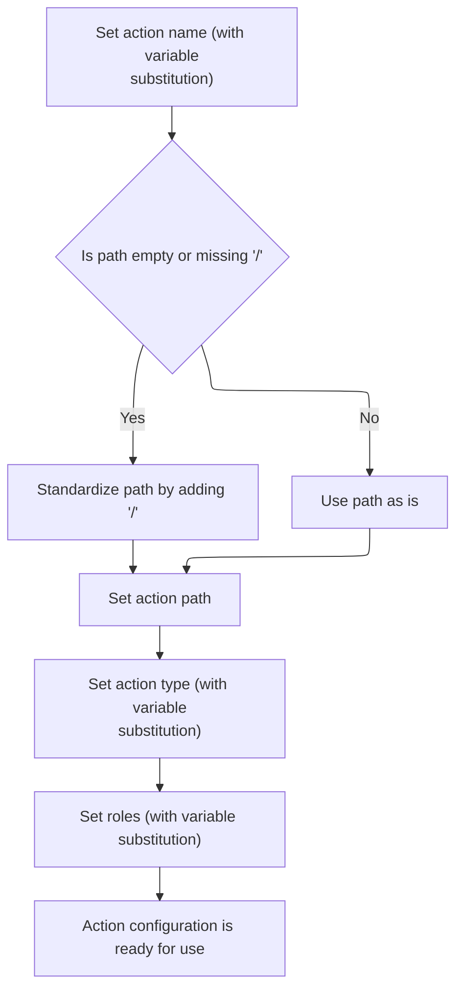

<SwmSnippet path="/core/src/main/java/org/apache/struts/config/ActionConfigMatcher.java" line="170">

---

Just returned from <SwmToken path="core/src/main/java/org/apache/struts/config/ActionConfigMatcher.java" pos="170:5:5" line-data="        config.setName(convertParam(orig.getName(), vars));">`convertParam`</SwmToken> in <SwmToken path="core/src/main/java/org/apache/struts/config/impl/ModuleConfigImpl.java" pos="27:10:10" line-data="import org.apache.struts.config.ActionConfigMatcher;">`ActionConfigMatcher`</SwmToken>: after substituting the name, we check and normalize the path (prepend slash if missing), then call <SwmToken path="core/src/main/java/org/apache/struts/config/ActionConfigMatcher.java" pos="176:3:3" line-data="        config.setPath(path);">`setPath`</SwmToken> on the config to update it. Next, we need to call <SwmToken path="faces/src/main/java/org/apache/struts/faces/renderer/FormRenderer.java" pos="118:1:1" line-data="        ActionConfig actionConfig = moduleConfig.findActionConfig(action);">`ActionConfig`</SwmToken> to actually set the path.

```java
        config.setName(convertParam(orig.getName(), vars));

```

---

</SwmSnippet>

<SwmSnippet path="/core/src/main/java/org/apache/struts/config/ActionConfig.java" line="517">

---

<SwmToken path="core/src/main/java/org/apache/struts/config/ActionConfig.java" pos="517:5:5" line-data="    public void setName(String name) {">`setName`</SwmToken> updates the config's name, but only if the configuration isn't frozen (checked via the configured flag). If it's frozen, it throws, so this setter can't be used after config is finalized.

```java
    public void setName(String name) {
        if (configured) {
            throw new IllegalStateException("Configuration is frozen");
        }

        this.name = name;
    }
```

---

</SwmSnippet>

<SwmSnippet path="/core/src/main/java/org/apache/struts/config/ActionConfigMatcher.java" line="172">

---

Just returned from <SwmToken path="core/src/main/java/org/apache/struts/config/ActionConfigMatcher.java" pos="170:3:3" line-data="        config.setName(convertParam(orig.getName(), vars));">`setName`</SwmToken> in <SwmToken path="faces/src/main/java/org/apache/struts/faces/renderer/FormRenderer.java" pos="118:1:1" line-data="        ActionConfig actionConfig = moduleConfig.findActionConfig(action);">`ActionConfig`</SwmToken>: now we update the path field in the config, which may have changed after variable substitution. Next, we call <SwmToken path="core/src/main/java/org/apache/struts/config/ActionConfigMatcher.java" pos="176:3:3" line-data="        config.setPath(path);">`setPath`</SwmToken> to store the normalized path.

```java
        if ((path.length() == 0) || (path.charAt(0) != '/')) {
            path = "/" + path;
        }

        config.setPath(path);
```

---

</SwmSnippet>

<SwmSnippet path="/core/src/main/java/org/apache/struts/config/ActionConfig.java" line="565">

---

<SwmToken path="core/src/main/java/org/apache/struts/config/ActionConfig.java" pos="565:5:5" line-data="    public void setPath(String path) {">`setPath`</SwmToken> sets the config's path, but only if the configuration isn't frozen. If it's frozen, it throws, so the path can't be changed after config is finalized.

```java
    public void setPath(String path) {
        if (configured) {
            throw new IllegalStateException("Configuration is frozen");
        }

        this.path = path;
    }
```

---

</SwmSnippet>

<SwmSnippet path="/core/src/main/java/org/apache/struts/config/ActionConfigMatcher.java" line="177">

---

Just returned from <SwmToken path="core/src/main/java/org/apache/struts/config/ActionConfigMatcher.java" pos="176:3:3" line-data="        config.setPath(path);">`setPath`</SwmToken> in <SwmToken path="faces/src/main/java/org/apache/struts/faces/renderer/FormRenderer.java" pos="118:1:1" line-data="        ActionConfig actionConfig = moduleConfig.findActionConfig(action);">`ActionConfig`</SwmToken>: now we update the type field in the config, which may have changed after variable substitution. Next, we call <SwmToken path="core/src/main/java/org/apache/struts/config/ActionConfigMatcher.java" pos="177:3:3" line-data="        config.setType(convertParam(orig.getType(), vars));">`setType`</SwmToken> to store the correct action type.

```java
        config.setType(convertParam(orig.getType(), vars));
```

---

</SwmSnippet>

<SwmSnippet path="/core/src/main/java/org/apache/struts/config/ActionConfigMatcher.java" line="177">

---

Just returned from <SwmToken path="core/src/main/java/org/apache/struts/config/ActionConfigMatcher.java" pos="177:5:5" line-data="        config.setType(convertParam(orig.getType(), vars));">`convertParam`</SwmToken> in <SwmToken path="core/src/main/java/org/apache/struts/config/impl/ModuleConfigImpl.java" pos="27:10:10" line-data="import org.apache.struts.config.ActionConfigMatcher;">`ActionConfigMatcher`</SwmToken>: now we call <SwmToken path="core/src/main/java/org/apache/struts/config/ActionConfigMatcher.java" pos="177:3:3" line-data="        config.setType(convertParam(orig.getType(), vars));">`setType`</SwmToken> on the config to update the action class, which may have changed after substitution.

```java
        config.setType(convertParam(orig.getType(), vars));
```

---

</SwmSnippet>

<SwmSnippet path="/core/src/main/java/org/apache/struts/config/ActionConfig.java" line="788">

---

<SwmToken path="core/src/main/java/org/apache/struts/config/ActionConfig.java" pos="788:5:5" line-data="    public void setType(String type) {">`setType`</SwmToken> sets the config's action class, but only if the configuration isn't frozen. If it's frozen, it throws, so the action class can't be changed after config is finalized.

```java
    public void setType(String type) {
        if (configured) {
            throw new IllegalStateException("Configuration is frozen");
        }

        this.type = type;
    }
```

---

</SwmSnippet>

<SwmSnippet path="/core/src/main/java/org/apache/struts/config/ActionConfigMatcher.java" line="178">

---

Just returned from <SwmToken path="core/src/main/java/org/apache/struts/config/ActionConfigMatcher.java" pos="177:3:3" line-data="        config.setType(convertParam(orig.getType(), vars));">`setType`</SwmToken> in <SwmToken path="faces/src/main/java/org/apache/struts/faces/renderer/FormRenderer.java" pos="118:1:1" line-data="        ActionConfig actionConfig = moduleConfig.findActionConfig(action);">`ActionConfig`</SwmToken>: now we update the roles field in the config, which may have changed after variable substitution. Next, we call <SwmToken path="core/src/main/java/org/apache/struts/config/ActionConfigMatcher.java" pos="178:3:3" line-data="        config.setRoles(convertParam(orig.getRoles(), vars));">`setRoles`</SwmToken> to store the correct roles.

```java
        config.setRoles(convertParam(orig.getRoles(), vars));
```

---

</SwmSnippet>

<SwmSnippet path="/core/src/main/java/org/apache/struts/config/ActionConfigMatcher.java" line="178">

---

Just returned from <SwmToken path="core/src/main/java/org/apache/struts/config/ActionConfigMatcher.java" pos="178:5:5" line-data="        config.setRoles(convertParam(orig.getRoles(), vars));">`convertParam`</SwmToken> in <SwmToken path="core/src/main/java/org/apache/struts/config/impl/ModuleConfigImpl.java" pos="27:10:10" line-data="import org.apache.struts.config.ActionConfigMatcher;">`ActionConfigMatcher`</SwmToken>: now we call <SwmToken path="core/src/main/java/org/apache/struts/config/ActionConfigMatcher.java" pos="178:3:3" line-data="        config.setRoles(convertParam(orig.getRoles(), vars));">`setRoles`</SwmToken> on the config to update the roles, which may have changed after substitution.

```java
        config.setRoles(convertParam(orig.getRoles(), vars));
```

---

</SwmSnippet>

### Parsing and Assigning Roles to Config

```mermaid
%%{init: {"flowchart": {"defaultRenderer": "elk"}} }%%
flowchart TD
  node1["Set roles for action"] --> node2{"Is configuration frozen?"}
  click node1 openCode "core/src/main/java/org/apache/struts/config/ActionConfig.java:597:630"
  node2 -->|"Yes"| node3["Reject change: configuration is frozen"]
  click node2 openCode "core/src/main/java/org/apache/struts/config/ActionConfig.java:598:600"
  click node3 openCode "core/src/main/java/org/apache/struts/config/ActionConfig.java:599:600"
  node2 -->|"No"| node4{"Is roles value null?"}
  click node4 openCode "core/src/main/java/org/apache/struts/config/ActionConfig.java:604:608"
  node4 -->|"Yes"| node5["Set allowed roles to none"]
  click node5 openCode "core/src/main/java/org/apache/struts/config/ActionConfig.java:605:607"
  node4 -->|"No"| node6["Extract roles from input"]
  click node6 openCode "core/src/main/java/org/apache/struts/config/ActionConfig.java:610:623"
  
  subgraph loop1["While roles string contains a comma"]
    node6 --> node7["Add extracted role to allowed roles
list"]
    click node7 openCode "core/src/main/java/org/apache/struts/config/ActionConfig.java:619:620"
    node7 --> node6
  end
  node6 -->|"No more commas"| node8{"Is there a remaining role after
trimming?"}
  click node8 openCode "core/src/main/java/org/apache/struts/config/ActionConfig.java:625:627"
  node8 -->|"Yes"| node9["Add last role to allowed roles list"]
  click node9 openCode "core/src/main/java/org/apache/struts/config/ActionConfig.java:626:627"
  node8 -->|"No"| node10["Finalize allowed roles list"]
  click node10 openCode "core/src/main/java/org/apache/struts/config/ActionConfig.java:629:630"
  node9 --> node10
classDef HeadingStyle fill:#777777,stroke:#333,stroke-width:2px;

%% Swimm:
%% %%{init: {"flowchart": {"defaultRenderer": "elk"}} }%%
%% flowchart TD
%%   node1["Set roles for action"] --> node2{"Is configuration frozen?"}
%%   click node1 openCode "<SwmPath>[core/…/config/ActionConfig.java](core/src/main/java/org/apache/struts/config/ActionConfig.java)</SwmPath>:597:630"
%%   node2 -->|"Yes"| node3["Reject change: configuration is frozen"]
%%   click node2 openCode "<SwmPath>[core/…/config/ActionConfig.java](core/src/main/java/org/apache/struts/config/ActionConfig.java)</SwmPath>:598:600"
%%   click node3 openCode "<SwmPath>[core/…/config/ActionConfig.java](core/src/main/java/org/apache/struts/config/ActionConfig.java)</SwmPath>:599:600"
%%   node2 -->|"No"| node4{"Is roles value null?"}
%%   click node4 openCode "<SwmPath>[core/…/config/ActionConfig.java](core/src/main/java/org/apache/struts/config/ActionConfig.java)</SwmPath>:604:608"
%%   node4 -->|"Yes"| node5["Set allowed roles to none"]
%%   click node5 openCode "<SwmPath>[core/…/config/ActionConfig.java](core/src/main/java/org/apache/struts/config/ActionConfig.java)</SwmPath>:605:607"
%%   node4 -->|"No"| node6["Extract roles from input"]
%%   click node6 openCode "<SwmPath>[core/…/config/ActionConfig.java](core/src/main/java/org/apache/struts/config/ActionConfig.java)</SwmPath>:610:623"
%%   
%%   subgraph loop1["While roles string contains a comma"]
%%     node6 --> node7["Add extracted role to allowed roles
%% list"]
%%     click node7 openCode "<SwmPath>[core/…/config/ActionConfig.java](core/src/main/java/org/apache/struts/config/ActionConfig.java)</SwmPath>:619:620"
%%     node7 --> node6
%%   end
%%   node6 -->|"No more commas"| node8{"Is there a remaining role after
%% trimming?"}
%%   click node8 openCode "<SwmPath>[core/…/config/ActionConfig.java](core/src/main/java/org/apache/struts/config/ActionConfig.java)</SwmPath>:625:627"
%%   node8 -->|"Yes"| node9["Add last role to allowed roles list"]
%%   click node9 openCode "<SwmPath>[core/…/config/ActionConfig.java](core/src/main/java/org/apache/struts/config/ActionConfig.java)</SwmPath>:626:627"
%%   node8 -->|"No"| node10["Finalize allowed roles list"]
%%   click node10 openCode "<SwmPath>[core/…/config/ActionConfig.java](core/src/main/java/org/apache/struts/config/ActionConfig.java)</SwmPath>:629:630"
%%   node9 --> node10
%% classDef HeadingStyle fill:#777777,stroke:#333,stroke-width:2px;
```

<SwmSnippet path="/core/src/main/java/org/apache/struts/config/ActionConfig.java" line="597">

---

In <SwmToken path="core/src/main/java/org/apache/struts/config/ActionConfig.java" pos="597:5:5" line-data="    public void setRoles(String roles) {">`setRoles`</SwmToken>, we split the roles string on commas, trim each part, and store the result in an array. If roles is null, we clear the array. If config is frozen, we throw. This ensures <SwmToken path="core/src/main/java/org/apache/struts/config/ActionConfig.java" pos="605:1:1" line-data="            roleNames = new String[0];">`roleNames`</SwmToken> always reflects the current, valid roles.

```java
    public void setRoles(String roles) {
        if (configured) {
            throw new IllegalStateException("Configuration is frozen");
        }

        this.roles = roles;

        if (roles == null) {
            roleNames = new String[0];

            return;
        }

        ArrayList list = new ArrayList();

        while (true) {
            int comma = roles.indexOf(',');

            if (comma < 0) {
                break;
            }

            list.add(roles.substring(0, comma).trim());
            roles = roles.substring(comma + 1);
        }
```

---

</SwmSnippet>

<SwmSnippet path="/core/src/main/java/org/apache/struts/config/ActionConfig.java" line="623">

---

After parsing, <SwmToken path="core/src/main/java/org/apache/struts/config/ActionConfig.java" pos="629:1:1" line-data="        roleNames = (String[]) list.toArray(new String[list.size()]);">`roleNames`</SwmToken> contains all non-empty, trimmed role names from the input string. If the input is null or empty, <SwmToken path="core/src/main/java/org/apache/struts/config/ActionConfig.java" pos="629:1:1" line-data="        roleNames = (String[]) list.toArray(new String[list.size()]);">`roleNames`</SwmToken> is just an empty array.

```java
        roles = roles.trim();

        if (roles.length() > 0) {
            list.add(roles);
        }

        roleNames = (String[]) list.toArray(new String[list.size()]);
    }
```

---

</SwmSnippet>

### Substituting Remaining Config Fields

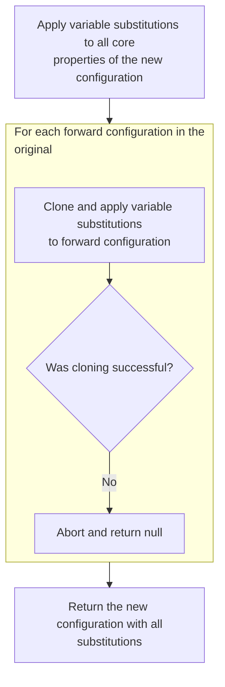

<SwmSnippet path="/core/src/main/java/org/apache/struts/config/ActionConfigMatcher.java" line="179">

---

Just returned from <SwmToken path="core/src/main/java/org/apache/struts/config/ActionConfigMatcher.java" pos="178:3:3" line-data="        config.setRoles(convertParam(orig.getRoles(), vars));">`setRoles`</SwmToken> in <SwmToken path="faces/src/main/java/org/apache/struts/faces/renderer/FormRenderer.java" pos="118:1:1" line-data="        ActionConfig actionConfig = moduleConfig.findActionConfig(action);">`ActionConfig`</SwmToken>: now we update the parameter field in the config, which may have changed after variable substitution. Next, we call <SwmToken path="core/src/main/java/org/apache/struts/config/ActionConfigMatcher.java" pos="179:3:3" line-data="        config.setParameter(convertParam(orig.getParameter(), vars));">`setParameter`</SwmToken> to store the correct parameter.

```java
        config.setParameter(convertParam(orig.getParameter(), vars));
```

---

</SwmSnippet>

<SwmSnippet path="/core/src/main/java/org/apache/struts/config/ActionConfigMatcher.java" line="180">

---

Just returned from <SwmToken path="core/src/main/java/org/apache/struts/config/ActionConfigMatcher.java" pos="180:5:5" line-data="        config.setAttribute(convertParam(orig.getAttribute(), vars));">`convertParam`</SwmToken> in <SwmToken path="core/src/main/java/org/apache/struts/config/impl/ModuleConfigImpl.java" pos="27:10:10" line-data="import org.apache.struts.config.ActionConfigMatcher;">`ActionConfigMatcher`</SwmToken>: now we call <SwmToken path="core/src/main/java/org/apache/struts/config/ActionConfigMatcher.java" pos="180:3:3" line-data="        config.setAttribute(convertParam(orig.getAttribute(), vars));">`setAttribute`</SwmToken> on the config to update the attribute, which may have changed after substitution.

```java
        config.setAttribute(convertParam(orig.getAttribute(), vars));
```

---

</SwmSnippet>

<SwmSnippet path="/core/src/main/java/org/apache/struts/config/ActionConfig.java" line="321">

---

<SwmToken path="core/src/main/java/org/apache/struts/config/ActionConfig.java" pos="321:5:5" line-data="    public String getAttribute() {">`getAttribute`</SwmToken> returns the attribute field if set, otherwise falls back to the name. This guarantees a non-null value for attribute in the config.

```java
    public String getAttribute() {
        if (this.attribute == null) {
            return (this.name);
        } else {
            return (this.attribute);
        }
    }
```

---

</SwmSnippet>

<SwmSnippet path="/core/src/main/java/org/apache/struts/config/ActionConfigMatcher.java" line="180">

---

Just returned from <SwmToken path="core/src/main/java/org/apache/struts/config/ActionConfigMatcher.java" pos="180:9:9" line-data="        config.setAttribute(convertParam(orig.getAttribute(), vars));">`getAttribute`</SwmToken> in <SwmToken path="faces/src/main/java/org/apache/struts/faces/renderer/FormRenderer.java" pos="118:1:1" line-data="        ActionConfig actionConfig = moduleConfig.findActionConfig(action);">`ActionConfig`</SwmToken>: now we call <SwmToken path="core/src/main/java/org/apache/struts/config/ActionConfigMatcher.java" pos="180:3:3" line-data="        config.setAttribute(convertParam(orig.getAttribute(), vars));">`setAttribute`</SwmToken> to update the config with the substituted attribute value.

```java
        config.setAttribute(convertParam(orig.getAttribute(), vars));
```

---

</SwmSnippet>

<SwmSnippet path="/core/src/main/java/org/apache/struts/config/ActionConfigMatcher.java" line="180">

---

Just returned from <SwmToken path="core/src/main/java/org/apache/struts/config/ActionConfigMatcher.java" pos="180:5:5" line-data="        config.setAttribute(convertParam(orig.getAttribute(), vars));">`convertParam`</SwmToken> in <SwmToken path="core/src/main/java/org/apache/struts/config/impl/ModuleConfigImpl.java" pos="27:10:10" line-data="import org.apache.struts.config.ActionConfigMatcher;">`ActionConfigMatcher`</SwmToken>: now we call <SwmToken path="core/src/main/java/org/apache/struts/config/ActionConfigMatcher.java" pos="180:3:3" line-data="        config.setAttribute(convertParam(orig.getAttribute(), vars));">`setAttribute`</SwmToken> on the config to update the attribute, which may have changed after substitution.

```java
        config.setAttribute(convertParam(orig.getAttribute(), vars));
```

---

</SwmSnippet>

<SwmSnippet path="/core/src/main/java/org/apache/struts/config/ActionConfig.java" line="337">

---

<SwmToken path="core/src/main/java/org/apache/struts/config/ActionConfig.java" pos="337:5:5" line-data="    public void setAttribute(String attribute) {">`setAttribute`</SwmToken> sets the config's attribute, but only if the configuration isn't frozen. If it's frozen, it throws, so the attribute can't be changed after config is finalized.

```java
    public void setAttribute(String attribute) {
        if (configured) {
            throw new IllegalStateException("Configuration is frozen");
        }

        this.attribute = attribute;
    }
```

---

</SwmSnippet>

<SwmSnippet path="/core/src/main/java/org/apache/struts/config/ActionConfigMatcher.java" line="181">

---

Just returned from <SwmToken path="core/src/main/java/org/apache/struts/config/ActionConfigMatcher.java" pos="180:3:3" line-data="        config.setAttribute(convertParam(orig.getAttribute(), vars));">`setAttribute`</SwmToken> in <SwmToken path="faces/src/main/java/org/apache/struts/faces/renderer/FormRenderer.java" pos="118:1:1" line-data="        ActionConfig actionConfig = moduleConfig.findActionConfig(action);">`ActionConfig`</SwmToken>: now we update the forward field in the config, which may have changed after variable substitution. Next, we call <SwmToken path="core/src/main/java/org/apache/struts/config/ActionConfigMatcher.java" pos="181:3:3" line-data="        config.setForward(convertParam(orig.getForward(), vars));">`setForward`</SwmToken> to store the correct forward value.

```java
        config.setForward(convertParam(orig.getForward(), vars));
```

---

</SwmSnippet>

<SwmSnippet path="/core/src/main/java/org/apache/struts/config/ActionConfigMatcher.java" line="181">

---

Just returned from <SwmToken path="core/src/main/java/org/apache/struts/config/ActionConfigMatcher.java" pos="181:5:5" line-data="        config.setForward(convertParam(orig.getForward(), vars));">`convertParam`</SwmToken> in <SwmToken path="core/src/main/java/org/apache/struts/config/impl/ModuleConfigImpl.java" pos="27:10:10" line-data="import org.apache.struts.config.ActionConfigMatcher;">`ActionConfigMatcher`</SwmToken>: now we call <SwmToken path="core/src/main/java/org/apache/struts/config/ActionConfigMatcher.java" pos="181:3:3" line-data="        config.setForward(convertParam(orig.getForward(), vars));">`setForward`</SwmToken> on the config to update the forward value, which may have changed after substitution.

```java
        config.setForward(convertParam(orig.getForward(), vars));
```

---

</SwmSnippet>

<SwmSnippet path="/core/src/main/java/org/apache/struts/config/ActionConfig.java" line="419">

---

<SwmToken path="core/src/main/java/org/apache/struts/config/ActionConfig.java" pos="419:5:5" line-data="    public void setForward(String forward) {">`setForward`</SwmToken> sets the config's forward value, but only if the configuration isn't frozen. If it's frozen, it throws, so the navigation target can't be changed after config is finalized.

```java
    public void setForward(String forward) {
        if (configured) {
            throw new IllegalStateException("Configuration is frozen");
        }

        this.forward = forward;
    }
```

---

</SwmSnippet>

<SwmSnippet path="/core/src/main/java/org/apache/struts/config/ActionConfigMatcher.java" line="182">

---

Just returned from <SwmToken path="core/src/main/java/org/apache/struts/config/ActionConfigMatcher.java" pos="181:3:3" line-data="        config.setForward(convertParam(orig.getForward(), vars));">`setForward`</SwmToken> in <SwmToken path="faces/src/main/java/org/apache/struts/faces/renderer/FormRenderer.java" pos="118:1:1" line-data="        ActionConfig actionConfig = moduleConfig.findActionConfig(action);">`ActionConfig`</SwmToken>: now we update the include field in the config, which may have changed after variable substitution. Next, we call <SwmToken path="core/src/main/java/org/apache/struts/config/ActionConfigMatcher.java" pos="182:3:3" line-data="        config.setInclude(convertParam(orig.getInclude(), vars));">`setInclude`</SwmToken> to store the correct include value.

```java
        config.setInclude(convertParam(orig.getInclude(), vars));
```

---

</SwmSnippet>

<SwmSnippet path="/core/src/main/java/org/apache/struts/config/ActionConfigMatcher.java" line="182">

---

Back in ActionConfigMatcher.convertActionConfig, after converting the include value with variable substitution, we call ActionConfig.setInclude to actually update the config. This step is needed to store the resolved include value, but only if the config isn't frozen—otherwise, it throws.

```java
        config.setInclude(convertParam(orig.getInclude(), vars));
```

---

</SwmSnippet>

<SwmSnippet path="/core/src/main/java/org/apache/struts/config/ActionConfig.java" line="446">

---

SetInclude checks the 'configured' flag before updating the include field. If the config is frozen, it throws an exception to block changes. This is how the repo enforces immutability after config is finalized.

```java
    public void setInclude(String include) {
        if (configured) {
            throw new IllegalStateException("Configuration is frozen");
        }

        this.include = include;
    }
```

---

</SwmSnippet>

<SwmSnippet path="/core/src/main/java/org/apache/struts/config/ActionConfigMatcher.java" line="183">

---

Just returned from <SwmToken path="core/src/main/java/org/apache/struts/config/ActionConfigMatcher.java" pos="182:3:3" line-data="        config.setInclude(convertParam(orig.getInclude(), vars));">`setInclude`</SwmToken> in <SwmToken path="faces/src/main/java/org/apache/struts/faces/renderer/FormRenderer.java" pos="118:1:1" line-data="        ActionConfig actionConfig = moduleConfig.findActionConfig(action);">`ActionConfig`</SwmToken>, the next step in ActionConfigMatcher.convertActionConfig is to update the input field with any substituted values. This keeps all config fields in sync with the resolved variables.

```java
        config.setInput(convertParam(orig.getInput(), vars));
```

---

</SwmSnippet>

<SwmSnippet path="/core/src/main/java/org/apache/struts/config/ActionConfigMatcher.java" line="183">

---

Back in ActionConfigMatcher.convertActionConfig, after converting the input value, we call ActionConfig.setInput to update the config. This only works if the config isn't frozen—otherwise, it throws.

```java
        config.setInput(convertParam(orig.getInput(), vars));
```

---

</SwmSnippet>

<SwmSnippet path="/core/src/main/java/org/apache/struts/config/ActionConfig.java" line="473">

---

SetInput checks if the config is frozen before updating the input field. If it's frozen, it throws, so you can't change input after config is finalized. This is how the repo enforces immutability.

```java
    public void setInput(String input) {
        if (configured) {
            throw new IllegalStateException("Configuration is frozen");
        }

        this.input = input;
    }
```

---

</SwmSnippet>

<SwmSnippet path="/core/src/main/java/org/apache/struts/config/ActionConfigMatcher.java" line="184">

---

Just returned from <SwmToken path="core/src/main/java/org/apache/struts/config/ActionConfigMatcher.java" pos="183:3:3" line-data="        config.setInput(convertParam(orig.getInput(), vars));">`setInput`</SwmToken> in <SwmToken path="faces/src/main/java/org/apache/struts/faces/renderer/FormRenderer.java" pos="118:1:1" line-data="        ActionConfig actionConfig = moduleConfig.findActionConfig(action);">`ActionConfig`</SwmToken>, the next step in ActionConfigMatcher.convertActionConfig is to update the catalog field with any substituted values. This keeps the config consistent with the resolved variables.

```java
        config.setCatalog(convertParam(orig.getCatalog(), vars));
```

---

</SwmSnippet>

<SwmSnippet path="/core/src/main/java/org/apache/struts/config/ActionConfigMatcher.java" line="184">

---

Back in ActionConfigMatcher.convertActionConfig, after converting the catalog value, we call ActionConfig.setCatalog to update the config. This only works if the config isn't frozen—otherwise, it throws.

```java
        config.setCatalog(convertParam(orig.getCatalog(), vars));
```

---

</SwmSnippet>

<SwmSnippet path="/core/src/main/java/org/apache/struts/config/ActionConfig.java" line="882">

---

SetCatalog checks if the config is frozen before updating the catalog field. If it's frozen, it throws, so you can't change catalog after config is finalized. This is how the repo enforces immutability.

```java
    public void setCatalog(String catalog) {
        if (configured) {
            throw new IllegalStateException("Configuration is frozen");
        }

        this.catalog = catalog;
    }
```

---

</SwmSnippet>

<SwmSnippet path="/core/src/main/java/org/apache/struts/config/ActionConfigMatcher.java" line="185">

---

Just returned from <SwmToken path="core/src/main/java/org/apache/struts/config/ActionConfigMatcher.java" pos="184:3:3" line-data="        config.setCatalog(convertParam(orig.getCatalog(), vars));">`setCatalog`</SwmToken> in <SwmToken path="faces/src/main/java/org/apache/struts/faces/renderer/FormRenderer.java" pos="118:1:1" line-data="        ActionConfig actionConfig = moduleConfig.findActionConfig(action);">`ActionConfig`</SwmToken>, the next step in ActionConfigMatcher.convertActionConfig is to update the command field with any substituted values. This keeps the config consistent with the resolved variables.

```java
        config.setCommand(convertParam(orig.getCommand(), vars));
```

---

</SwmSnippet>

<SwmSnippet path="/core/src/main/java/org/apache/struts/config/ActionConfigMatcher.java" line="185">

---

Back in ActionConfigMatcher.convertActionConfig, after converting the command value, we call ActionConfig.setCommand to update the config. This only works if the config isn't frozen—otherwise, it throws.

```java
        config.setCommand(convertParam(orig.getCommand(), vars));
```

---

</SwmSnippet>

<SwmSnippet path="/core/src/main/java/org/apache/struts/config/ActionConfig.java" line="864">

---

SetCommand checks if the config is frozen before updating the command field. If it's frozen, it throws, so you can't change command after config is finalized. This is how the repo enforces immutability.

```java
    public void setCommand(String command) {
        if (configured) {
            throw new IllegalStateException("Configuration is frozen");
        }

        this.command = command;
    }
```

---

</SwmSnippet>

<SwmSnippet path="/core/src/main/java/org/apache/struts/config/ActionConfigMatcher.java" line="186">

---

Just returned from <SwmToken path="core/src/main/java/org/apache/struts/config/ActionConfigMatcher.java" pos="185:3:3" line-data="        config.setCommand(convertParam(orig.getCommand(), vars));">`setCommand`</SwmToken> in <SwmToken path="faces/src/main/java/org/apache/struts/faces/renderer/FormRenderer.java" pos="118:1:1" line-data="        ActionConfig actionConfig = moduleConfig.findActionConfig(action);">`ActionConfig`</SwmToken>, the next step in ActionConfigMatcher.convertActionConfig is to update the <SwmToken path="core/src/main/java/org/apache/struts/config/ActionConfig.java" pos="499:9:9" line-data="    public void setMultipartClass(String multipartClass) {">`multipartClass`</SwmToken> field with any substituted values. This keeps the config consistent with the resolved variables.

```java
        config.setMultipartClass(convertParam(orig.getMultipartClass(), vars));
```

---

</SwmSnippet>

<SwmSnippet path="/core/src/main/java/org/apache/struts/config/ActionConfigMatcher.java" line="186">

---

Back in ActionConfigMatcher.convertActionConfig, after converting the <SwmToken path="core/src/main/java/org/apache/struts/config/ActionConfig.java" pos="499:9:9" line-data="    public void setMultipartClass(String multipartClass) {">`multipartClass`</SwmToken> value, we call ActionConfig.setMultipartClass to update the config. This only works if the config isn't frozen—otherwise, it throws.

```java
        config.setMultipartClass(convertParam(orig.getMultipartClass(), vars));
```

---

</SwmSnippet>

<SwmSnippet path="/core/src/main/java/org/apache/struts/config/ActionConfig.java" line="499">

---

SetMultipartClass checks if the config is frozen before updating the <SwmToken path="core/src/main/java/org/apache/struts/config/ActionConfig.java" pos="499:9:9" line-data="    public void setMultipartClass(String multipartClass) {">`multipartClass`</SwmToken> field. If it's frozen, it throws, so you can't change <SwmToken path="core/src/main/java/org/apache/struts/config/ActionConfig.java" pos="499:9:9" line-data="    public void setMultipartClass(String multipartClass) {">`multipartClass`</SwmToken> after config is finalized. This is how the repo enforces immutability.

```java
    public void setMultipartClass(String multipartClass) {
        if (configured) {
            throw new IllegalStateException("Configuration is frozen");
        }

        this.multipartClass = multipartClass;
    }
```

---

</SwmSnippet>

<SwmSnippet path="/core/src/main/java/org/apache/struts/config/ActionConfigMatcher.java" line="187">

---

Just returned from <SwmToken path="core/src/main/java/org/apache/struts/config/ActionConfigMatcher.java" pos="186:3:3" line-data="        config.setMultipartClass(convertParam(orig.getMultipartClass(), vars));">`setMultipartClass`</SwmToken> in <SwmToken path="faces/src/main/java/org/apache/struts/faces/renderer/FormRenderer.java" pos="118:1:1" line-data="        ActionConfig actionConfig = moduleConfig.findActionConfig(action);">`ActionConfig`</SwmToken>, the next step in ActionConfigMatcher.convertActionConfig is to update the prefix field with any substituted values. This keeps the config consistent with the resolved variables.

```java
        config.setPrefix(convertParam(orig.getPrefix(), vars));
```

---

</SwmSnippet>

<SwmSnippet path="/core/src/main/java/org/apache/struts/config/ActionConfigMatcher.java" line="187">

---

Back in ActionConfigMatcher.convertActionConfig, after converting the prefix value, we call ActionConfig.setPrefix to update the config. This only works if the config isn't frozen—otherwise, it throws.

```java
        config.setPrefix(convertParam(orig.getPrefix(), vars));
```

---

</SwmSnippet>

<SwmSnippet path="/core/src/main/java/org/apache/struts/config/ActionConfig.java" line="585">

---

SetPrefix checks if the config is frozen before updating the prefix field. If it's frozen, it throws, so you can't change prefix after config is finalized. This is how the repo enforces immutability.

```java
    public void setPrefix(String prefix) {
        if (configured) {
            throw new IllegalStateException("Configuration is frozen");
        }

        this.prefix = prefix;
    }
```

---

</SwmSnippet>

<SwmSnippet path="/core/src/main/java/org/apache/struts/config/ActionConfigMatcher.java" line="188">

---

Just returned from <SwmToken path="core/src/main/java/org/apache/struts/config/ActionConfigMatcher.java" pos="187:3:3" line-data="        config.setPrefix(convertParam(orig.getPrefix(), vars));">`setPrefix`</SwmToken> in <SwmToken path="faces/src/main/java/org/apache/struts/faces/renderer/FormRenderer.java" pos="118:1:1" line-data="        ActionConfig actionConfig = moduleConfig.findActionConfig(action);">`ActionConfig`</SwmToken>, the next step in ActionConfigMatcher.convertActionConfig is to update the suffix field with any substituted values. This keeps the config consistent with the resolved variables.

```java
        config.setSuffix(convertParam(orig.getSuffix(), vars));
```

---

</SwmSnippet>

<SwmSnippet path="/core/src/main/java/org/apache/struts/config/ActionConfigMatcher.java" line="188">

---

Back in ActionConfigMatcher.convertActionConfig, after converting the suffix value, we call ActionConfig.setSuffix to update the config. This only works if the config isn't frozen—otherwise, it throws.

```java
        config.setSuffix(convertParam(orig.getSuffix(), vars));

```

---

</SwmSnippet>

<SwmSnippet path="/core/src/main/java/org/apache/struts/config/ActionConfig.java" line="776">

---

SetSuffix checks if the config is frozen before updating the suffix field. If it's frozen, it throws, so you can't change suffix after config is finalized. This is how the repo enforces immutability.

```java
    public void setSuffix(String suffix) {
        if (configured) {
            throw new IllegalStateException("Configuration is frozen");
        }

        this.suffix = suffix;
    }
```

---

</SwmSnippet>

<SwmSnippet path="/core/src/main/java/org/apache/struts/config/ActionConfigMatcher.java" line="190">

---

Just returned from <SwmToken path="core/src/main/java/org/apache/struts/config/ActionConfigMatcher.java" pos="188:3:3" line-data="        config.setSuffix(convertParam(orig.getSuffix(), vars));">`setSuffix`</SwmToken> in <SwmToken path="faces/src/main/java/org/apache/struts/faces/renderer/FormRenderer.java" pos="118:1:1" line-data="        ActionConfig actionConfig = moduleConfig.findActionConfig(action);">`ActionConfig`</SwmToken>, now ActionConfigMatcher.convertActionConfig loops through <SwmToken path="core/src/main/java/org/apache/struts/config/ActionConfigMatcher.java" pos="190:1:1" line-data="        ForwardConfig[] fConfigs = orig.findForwardConfigs();">`ForwardConfig`</SwmToken> objects, clones each one, and starts updating their fields with substituted values. Cloning avoids side effects on the original config.

```java
        ForwardConfig[] fConfigs = orig.findForwardConfigs();
        ForwardConfig cfg;

        for (int x = 0; x < fConfigs.length; x++) {
            try {
                cfg = (ActionForward) BeanUtils.cloneBean(fConfigs[x]);
            } catch (Exception ex) {
                log.warn("Unable to clone action config, recommend not using "
                        + "wildcards", ex);
                return null;
            }
            cfg.setName(fConfigs[x].getName());
            cfg.setPath(convertParam(fConfigs[x].getPath(), vars));
```

---

</SwmSnippet>

<SwmSnippet path="/core/src/main/java/org/apache/struts/config/ActionConfigMatcher.java" line="202">

---

Back in ActionConfigMatcher.convertActionConfig, after cloning a <SwmToken path="core/src/main/java/org/apache/struts/config/ActionConfigMatcher.java" pos="190:1:1" line-data="        ForwardConfig[] fConfigs = orig.findForwardConfigs();">`ForwardConfig`</SwmToken>, we call <SwmToken path="core/src/main/java/org/apache/struts/config/ActionConfigMatcher.java" pos="202:3:3" line-data="            cfg.setPath(convertParam(fConfigs[x].getPath(), vars));">`setPath`</SwmToken> to update its path with the substituted value. This only works if the config isn't frozen—otherwise, it throws.

```java
            cfg.setPath(convertParam(fConfigs[x].getPath(), vars));
```

---

</SwmSnippet>

<SwmSnippet path="/core/src/main/java/org/apache/struts/config/ExceptionConfig.java" line="141">

---

SetPath checks if the config is frozen before updating the path field. If it's frozen, it throws, so you can't change path after config is finalized. This is how the repo enforces immutability.

```java
    public void setPath(String path) {
        if (configured) {
            throw new IllegalStateException("Configuration is frozen");
        }

        this.path = path;
    }
```

---

</SwmSnippet>

<SwmSnippet path="/core/src/main/java/org/apache/struts/config/ActionConfigMatcher.java" line="203">

---

Back in ActionConfigMatcher.convertActionConfig, after updating the path, we call <SwmToken path="core/src/main/java/org/apache/struts/config/ActionConfigMatcher.java" pos="203:3:3" line-data="            cfg.setRedirect(fConfigs[x].getRedirect());">`setRedirect`</SwmToken> on the <SwmToken path="core/src/main/java/org/apache/struts/config/ActionConfigMatcher.java" pos="190:1:1" line-data="        ForwardConfig[] fConfigs = orig.findForwardConfigs();">`ForwardConfig`</SwmToken> to update its redirect flag. This only works if the config isn't frozen—otherwise, it throws.

```java
            cfg.setRedirect(fConfigs[x].getRedirect());
```

---

</SwmSnippet>

<SwmSnippet path="/core/src/main/java/org/apache/struts/config/ForwardConfig.java" line="222">

---

SetRedirect checks if the config is frozen before updating the redirect flag. If it's frozen, it throws, so you can't change redirect after config is finalized. This is how the repo enforces immutability.

```java
    public void setRedirect(boolean redirect) {
        if (configured) {
            throw new IllegalStateException("Configuration is frozen");
        }

        this.redirect = redirect;
    }
```

---

</SwmSnippet>

<SwmSnippet path="/core/src/main/java/org/apache/struts/config/ActionConfigMatcher.java" line="204">

---

Just returned from <SwmToken path="core/src/main/java/org/apache/struts/config/ActionConfigMatcher.java" pos="203:3:3" line-data="            cfg.setRedirect(fConfigs[x].getRedirect());">`setRedirect`</SwmToken> in <SwmToken path="core/src/main/java/org/apache/struts/config/ActionConfigMatcher.java" pos="190:1:1" line-data="        ForwardConfig[] fConfigs = orig.findForwardConfigs();">`ForwardConfig`</SwmToken>, the next step in ActionConfigMatcher.convertActionConfig is to update the command field with any substituted values. This keeps the config consistent with the resolved variables.

```java
            cfg.setCommand(convertParam(fConfigs[x].getCommand(), vars));
```

---

</SwmSnippet>

<SwmSnippet path="/core/src/main/java/org/apache/struts/config/ActionConfigMatcher.java" line="204">

---

Back in ActionConfigMatcher.convertActionConfig, after converting the command value, we call <SwmToken path="core/src/main/java/org/apache/struts/config/ActionConfigMatcher.java" pos="204:3:3" line-data="            cfg.setCommand(convertParam(fConfigs[x].getCommand(), vars));">`setCommand`</SwmToken> to update the <SwmToken path="core/src/main/java/org/apache/struts/config/ActionConfigMatcher.java" pos="190:1:1" line-data="        ForwardConfig[] fConfigs = orig.findForwardConfigs();">`ForwardConfig`</SwmToken>. This only works if the config isn't frozen—otherwise, it throws.

```java
            cfg.setCommand(convertParam(fConfigs[x].getCommand(), vars));
```

---

</SwmSnippet>

<SwmSnippet path="/core/src/main/java/org/apache/struts/config/ActionConfigMatcher.java" line="205">

---

Just returned from <SwmToken path="core/src/main/java/org/apache/struts/config/ActionConfigMatcher.java" pos="185:3:3" line-data="        config.setCommand(convertParam(orig.getCommand(), vars));">`setCommand`</SwmToken> in <SwmToken path="core/src/main/java/org/apache/struts/config/ActionConfigMatcher.java" pos="190:1:1" line-data="        ForwardConfig[] fConfigs = orig.findForwardConfigs();">`ForwardConfig`</SwmToken>, the next step in ActionConfigMatcher.convertActionConfig is to update the catalog field with any substituted values. This keeps the config consistent with the resolved variables.

```java
            cfg.setCatalog(convertParam(fConfigs[x].getCatalog(), vars));
```

---

</SwmSnippet>

<SwmSnippet path="/core/src/main/java/org/apache/struts/config/ActionConfigMatcher.java" line="205">

---

Back in ActionConfigMatcher.convertActionConfig, after converting the catalog value, we call <SwmToken path="core/src/main/java/org/apache/struts/config/ActionConfigMatcher.java" pos="205:3:3" line-data="            cfg.setCatalog(convertParam(fConfigs[x].getCatalog(), vars));">`setCatalog`</SwmToken> to update the <SwmToken path="core/src/main/java/org/apache/struts/config/ActionConfigMatcher.java" pos="190:1:1" line-data="        ForwardConfig[] fConfigs = orig.findForwardConfigs();">`ForwardConfig`</SwmToken>. This only works if the config isn't frozen—otherwise, it throws.

```java
            cfg.setCatalog(convertParam(fConfigs[x].getCatalog(), vars));
```

---

</SwmSnippet>

<SwmSnippet path="/core/src/main/java/org/apache/struts/config/ActionConfigMatcher.java" line="206">

---

Just returned from <SwmToken path="core/src/main/java/org/apache/struts/config/ActionConfigMatcher.java" pos="184:3:3" line-data="        config.setCatalog(convertParam(orig.getCatalog(), vars));">`setCatalog`</SwmToken> in <SwmToken path="core/src/main/java/org/apache/struts/config/ActionConfigMatcher.java" pos="190:1:1" line-data="        ForwardConfig[] fConfigs = orig.findForwardConfigs();">`ForwardConfig`</SwmToken>, the next step in ActionConfigMatcher.convertActionConfig is to update the module field with any substituted values. This keeps the config consistent with the resolved variables.

```java
            cfg.setModule(convertParam(fConfigs[x].getModule(), vars));
```

---

</SwmSnippet>

<SwmSnippet path="/core/src/main/java/org/apache/struts/config/ActionConfigMatcher.java" line="206">

---

Back in ActionConfigMatcher.convertActionConfig, after converting the module value, we call <SwmToken path="core/src/main/java/org/apache/struts/config/ActionConfigMatcher.java" pos="206:3:3" line-data="            cfg.setModule(convertParam(fConfigs[x].getModule(), vars));">`setModule`</SwmToken> to update the <SwmToken path="core/src/main/java/org/apache/struts/config/ActionConfigMatcher.java" pos="190:1:1" line-data="        ForwardConfig[] fConfigs = orig.findForwardConfigs();">`ForwardConfig`</SwmToken>. This only works if the config isn't frozen—otherwise, it throws.

```java
            cfg.setModule(convertParam(fConfigs[x].getModule(), vars));

```

---

</SwmSnippet>

<SwmSnippet path="/core/src/main/java/org/apache/struts/config/ForwardConfig.java" line="210">

---

SetModule checks if the config is frozen before updating the module field. If it's frozen, it throws, so you can't change module after config is finalized. This is how the repo enforces immutability.

```java
    public void setModule(String module) {
        if (configured) {
            throw new IllegalStateException("Configuration is frozen");
        }

        this.module = module;
    }
```

---

</SwmSnippet>

<SwmSnippet path="/core/src/main/java/org/apache/struts/config/ActionConfigMatcher.java" line="208">

---

Just returned from <SwmToken path="core/src/main/java/org/apache/struts/config/ActionConfigMatcher.java" pos="206:3:3" line-data="            cfg.setModule(convertParam(fConfigs[x].getModule(), vars));">`setModule`</SwmToken> in <SwmToken path="core/src/main/java/org/apache/struts/config/ActionConfigMatcher.java" pos="190:1:1" line-data="        ForwardConfig[] fConfigs = orig.findForwardConfigs();">`ForwardConfig`</SwmToken>, now ActionConfigMatcher.convertActionConfig calls <SwmToken path="core/src/main/java/org/apache/struts/config/ActionConfigMatcher.java" pos="208:1:1" line-data="            replaceProperties(fConfigs[x].getProperties(), cfg.getProperties(),">`replaceProperties`</SwmToken> to update all property values in the <SwmToken path="core/src/main/java/org/apache/struts/config/ActionConfigMatcher.java" pos="190:1:1" line-data="        ForwardConfig[] fConfigs = orig.findForwardConfigs();">`ForwardConfig`</SwmToken> with the resolved variables. This ensures properties are consistent with the rest of the config.

```java
            replaceProperties(fConfigs[x].getProperties(), cfg.getProperties(),
                vars);

```

---

</SwmSnippet>

### Substituting <SwmToken path="core/src/main/java/org/apache/struts/config/ActionConfigMatcher.java" pos="190:1:1" line-data="        ForwardConfig[] fConfigs = orig.findForwardConfigs();">`ForwardConfig`</SwmToken> Properties

<SwmSnippet path="/core/src/main/java/org/apache/struts/config/ActionConfigMatcher.java" line="238">

---

In <SwmToken path="core/src/main/java/org/apache/struts/config/ActionConfigMatcher.java" pos="238:5:5" line-data="    protected void replaceProperties(Properties orig, Properties props, Map vars) {">`replaceProperties`</SwmToken>, we loop through all entries in the original properties map. <SwmToken path="core/src/main/java/org/apache/struts/util/IteratorAdapter.java" pos="36:4:4" line-data="public class IteratorAdapter implements Iterator {">`IteratorAdapter`</SwmToken> is used here to handle cases where the collection isn't a standard Iterator, making the code more flexible for different property sources.

```java
    protected void replaceProperties(Properties orig, Properties props, Map vars) {
        Map.Entry entry = null;

        for (Iterator i = orig.entrySet().iterator(); i.hasNext();) {
            entry = (Map.Entry) i.next();
```

---

</SwmSnippet>

<SwmSnippet path="/core/src/main/java/org/apache/struts/config/ActionConfigMatcher.java" line="243">

---

Just returned from <SwmToken path="core/src/main/java/org/apache/struts/util/IteratorAdapter.java" pos="36:4:4" line-data="public class IteratorAdapter implements Iterator {">`IteratorAdapter`</SwmToken>, now <SwmToken path="core/src/main/java/org/apache/struts/config/ActionConfigMatcher.java" pos="208:1:1" line-data="            replaceProperties(fConfigs[x].getProperties(), cfg.getProperties(),">`replaceProperties`</SwmToken> sets each property in the target properties map after substituting placeholders. This finalizes the <SwmToken path="core/src/main/java/org/apache/struts/config/ActionConfigMatcher.java" pos="190:1:1" line-data="        ForwardConfig[] fConfigs = orig.findForwardConfigs();">`ForwardConfig`</SwmToken>'s properties with the correct values.

```java
            props.setProperty((String) entry.getKey(),
                convertParam((String) entry.getValue(), vars));
        }
    }
```

---

</SwmSnippet>

### Updating <SwmToken path="core/src/main/java/org/apache/struts/config/ActionConfigMatcher.java" pos="190:1:1" line-data="        ForwardConfig[] fConfigs = orig.findForwardConfigs();">`ForwardConfig`</SwmToken> References

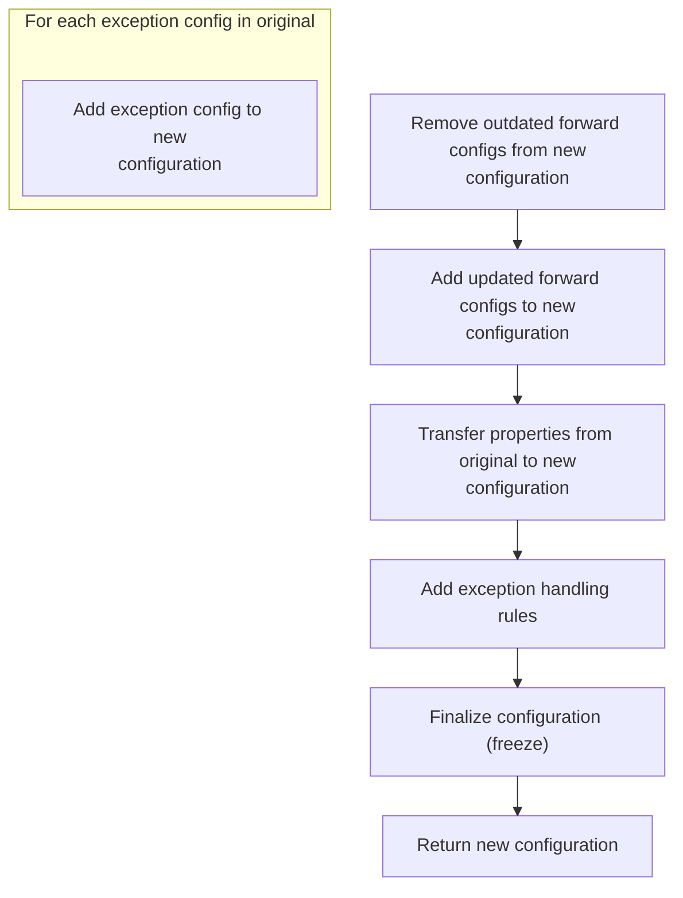

<SwmSnippet path="/core/src/main/java/org/apache/struts/config/ActionConfigMatcher.java" line="211">

---

Just returned from <SwmToken path="core/src/main/java/org/apache/struts/config/ActionConfigMatcher.java" pos="208:1:1" line-data="            replaceProperties(fConfigs[x].getProperties(), cfg.getProperties(),">`replaceProperties`</SwmToken> in <SwmToken path="core/src/main/java/org/apache/struts/config/impl/ModuleConfigImpl.java" pos="27:10:10" line-data="import org.apache.struts.config.ActionConfigMatcher;">`ActionConfigMatcher`</SwmToken>, now we call <SwmToken path="core/src/main/java/org/apache/struts/config/ActionConfigMatcher.java" pos="211:3:3" line-data="            config.removeForwardConfig(fConfigs[x]);">`removeForwardConfig`</SwmToken> on <SwmToken path="faces/src/main/java/org/apache/struts/faces/renderer/FormRenderer.java" pos="118:1:1" line-data="        ActionConfig actionConfig = moduleConfig.findActionConfig(action);">`ActionConfig`</SwmToken> to drop the original <SwmToken path="core/src/main/java/org/apache/struts/config/ActionConfigMatcher.java" pos="190:1:1" line-data="        ForwardConfig[] fConfigs = orig.findForwardConfigs();">`ForwardConfig`</SwmToken> before adding the updated one. This keeps the config clean and avoids stale references.

```java
            config.removeForwardConfig(fConfigs[x]);
```

---

</SwmSnippet>

<SwmSnippet path="/core/src/main/java/org/apache/struts/config/ActionConfig.java" line="1355">

---

RemoveForwardConfig checks if the config is frozen before removing the <SwmToken path="core/src/main/java/org/apache/struts/config/ActionConfig.java" pos="1355:7:7" line-data="    public void removeForwardConfig(ForwardConfig config) {">`ForwardConfig`</SwmToken> from the forwards map. If it's frozen, it throws, so you can't change forwards after config is finalized. This is how the repo enforces immutability.

```java
    public void removeForwardConfig(ForwardConfig config) {
        if (configured) {
            throw new IllegalStateException("Configuration is frozen");
        }

        forwards.remove(config.getName());
    }
```

---

</SwmSnippet>

<SwmSnippet path="/core/src/main/java/org/apache/struts/config/ActionConfigMatcher.java" line="212">

---

Just returned from <SwmToken path="core/src/main/java/org/apache/struts/config/ActionConfigMatcher.java" pos="211:3:3" line-data="            config.removeForwardConfig(fConfigs[x]);">`removeForwardConfig`</SwmToken> in <SwmToken path="faces/src/main/java/org/apache/struts/faces/renderer/FormRenderer.java" pos="118:1:1" line-data="        ActionConfig actionConfig = moduleConfig.findActionConfig(action);">`ActionConfig`</SwmToken>, now we call <SwmToken path="core/src/main/java/org/apache/struts/config/ActionConfigMatcher.java" pos="212:3:3" line-data="            config.addForwardConfig(cfg);">`addForwardConfig`</SwmToken> to insert the updated <SwmToken path="core/src/main/java/org/apache/struts/config/ActionConfigMatcher.java" pos="190:1:1" line-data="        ForwardConfig[] fConfigs = orig.findForwardConfigs();">`ForwardConfig`</SwmToken>. This replaces the old reference with the new, substituted one.

```java
            config.addForwardConfig(cfg);
        }

```

---

</SwmSnippet>

<SwmSnippet path="/core/src/main/java/org/apache/struts/config/ActionConfig.java" line="1059">

---

<SwmToken path="core/src/main/java/org/apache/struts/config/ActionConfig.java" pos="1059:5:5" line-data="    public void addForwardConfig(ForwardConfig config) {">`addForwardConfig`</SwmToken> only adds a <SwmToken path="core/src/main/java/org/apache/struts/config/ActionConfig.java" pos="1059:7:7" line-data="    public void addForwardConfig(ForwardConfig config) {">`ForwardConfig`</SwmToken> if the config isn't frozen (checked by the 'configured' flag). It throws if you try to add after freezing. The <SwmToken path="core/src/main/java/org/apache/struts/config/ActionConfig.java" pos="1059:7:7" line-data="    public void addForwardConfig(ForwardConfig config) {">`ForwardConfig`</SwmToken> is stored in a map using its name as the key, so names need to be unique. This keeps the forwards map immutable after setup.

```java
    public void addForwardConfig(ForwardConfig config) {
        if (configured) {
            throw new IllegalStateException("Configuration is frozen");
        }

        forwards.put(config.getName(), config);
    }
```

---

</SwmSnippet>

<SwmSnippet path="/core/src/main/java/org/apache/struts/config/ActionConfigMatcher.java" line="215">

---

After adding the <SwmToken path="core/src/main/java/org/apache/struts/config/ActionConfigMatcher.java" pos="190:1:1" line-data="        ForwardConfig[] fConfigs = orig.findForwardConfigs();">`ForwardConfig`</SwmToken>, we call <SwmToken path="core/src/main/java/org/apache/struts/config/ActionConfigMatcher.java" pos="215:1:1" line-data="        replaceProperties(orig.getProperties(), config.getProperties(), vars);">`replaceProperties`</SwmToken> in <SwmToken path="core/src/main/java/org/apache/struts/config/impl/ModuleConfigImpl.java" pos="27:10:10" line-data="import org.apache.struts.config.ActionConfigMatcher;">`ActionConfigMatcher`</SwmToken> to update all property values in the <SwmToken path="core/src/main/java/org/apache/struts/config/ActionConfigMatcher.java" pos="190:1:1" line-data="        ForwardConfig[] fConfigs = orig.findForwardConfigs();">`ForwardConfig`</SwmToken> with the resolved variables. This step ensures the properties are actually usable and don't contain unresolved placeholders.

```java
        replaceProperties(orig.getProperties(), config.getProperties(), vars);

```

---

</SwmSnippet>

<SwmSnippet path="/core/src/main/java/org/apache/struts/config/ActionConfigMatcher.java" line="217">

---

Back in <SwmToken path="core/src/main/java/org/apache/struts/config/impl/ModuleConfigImpl.java" pos="27:10:10" line-data="import org.apache.struts.config.ActionConfigMatcher;">`ActionConfigMatcher`</SwmToken>, after updating ForwardConfigs, we copy all ExceptionConfigs from the original to the new <SwmToken path="faces/src/main/java/org/apache/struts/faces/renderer/FormRenderer.java" pos="118:1:1" line-data="        ActionConfig actionConfig = moduleConfig.findActionConfig(action);">`ActionConfig`</SwmToken>. This keeps exception handling consistent with the original mapping.

```java
        ExceptionConfig[] exConfigs = orig.findExceptionConfigs();

        for (int x = 0; x < exConfigs.length; x++) {
            config.addExceptionConfig(exConfigs[x]);
        }
```

---

</SwmSnippet>

<SwmSnippet path="/core/src/main/java/org/apache/struts/config/ActionConfigMatcher.java" line="223">

---

At the end of <SwmToken path="core/src/main/java/org/apache/struts/config/impl/ModuleConfigImpl.java" pos="27:10:10" line-data="import org.apache.struts.config.ActionConfigMatcher;">`ActionConfigMatcher`</SwmToken>, we freeze the config to prevent further changes and return it. After this point, the config is immutable and safe to use.

```java
        config.freeze();

        return config;
    }
```

---

</SwmSnippet>

## Validating <SwmToken path="faces/src/main/java/org/apache/struts/faces/renderer/FormRenderer.java" pos="118:1:1" line-data="        ActionConfig actionConfig = moduleConfig.findActionConfig(action);">`ActionConfig`</SwmToken> and Preparing Form Bean

```mermaid
%%{init: {"flowchart": {"defaultRenderer": "elk"}} }%%
flowchart TD
  node1{"Is action configuration present?"}
  click node1 openCode "faces/src/main/java/org/apache/struts/faces/renderer/FormRenderer.java:119:122"
  node1 -->|"No"| nodeEnd["Stop: Cannot render form"]
  click nodeEnd openCode "faces/src/main/java/org/apache/struts/faces/renderer/FormRenderer.java:120:122"
  node1 -->|"Yes"| node2{"Is bean name present?"}
  click node2 openCode "faces/src/main/java/org/apache/struts/faces/renderer/FormRenderer.java:123:126"
  node2 -->|"Yes"| node3["Associate bean name with form"]
  click node3 openCode "faces/src/main/java/org/apache/struts/faces/renderer/FormRenderer.java:124:126"
  node2 -->|"No"| node4["Continue without bean name"]
  click node4 openCode "faces/src/main/java/org/apache/struts/faces/renderer/FormRenderer.java:127:127"
  node3 --> node5["Render form start tag and attributes"]
  node4 --> node5
  click node5 openCode "faces/src/main/java/org/apache/struts/faces/renderer/FormRenderer.java:137:149"
  node5 --> node6{"Is style class present?"}
  click node6 openCode "faces/src/main/java/org/apache/struts/faces/renderer/FormRenderer.java:133:146"
  node6 -->|"Yes"| node7["Add style class to form"]
  click node7 openCode "faces/src/main/java/org/apache/struts/faces/renderer/FormRenderer.java:144:146"
  node6 -->|"No"| node8["Continue without style class"]
  click node8 openCode "faces/src/main/java/org/apache/struts/faces/renderer/FormRenderer.java:147:147"
  node7 --> node9{"Is form method specified?"}
  node8 --> node9
  click node9 openCode "faces/src/main/java/org/apache/struts/faces/renderer/FormRenderer.java:147:149"
  node9 -->|"No"| node10["Set method to 'post'"]
  click node10 openCode "faces/src/main/java/org/apache/struts/faces/renderer/FormRenderer.java:148:149"
  node9 -->|"Yes"| node11["Use specified method"]
  click node11 openCode "faces/src/main/java/org/apache/struts/faces/renderer/FormRenderer.java:147:147"
  node10 --> node12["Add hidden input for form tracking"]
  node11 --> node12
  click node12 openCode "faces/src/main/java/org/apache/struts/faces/renderer/FormRenderer.java:154:159"
  node12 --> node13{"Is transaction token present?"}
  click node13 openCode "faces/src/main/java/org/apache/struts/faces/renderer/FormRenderer.java:164:175"
  node13 -->|"Yes"| node14["Add hidden input for transaction token"]
  click node14 openCode "faces/src/main/java/org/apache/struts/faces/renderer/FormRenderer.java:168:174"
  node13 -->|"No"| node15["Continue without transaction token"]
  click node15 openCode "faces/src/main/java/org/apache/struts/faces/renderer/FormRenderer.java:176:176"
  node14 --> node16{"Is component a FormComponent?"}
  node15 --> node16
  click node16 openCode "faces/src/main/java/org/apache/struts/faces/renderer/FormRenderer.java:179:181"
  node16 -->|"Yes"| node17["Create form bean instance"]
  click node17 openCode "faces/src/main/java/org/apache/struts/faces/renderer/FormRenderer.java:180:181"
  node16 -->|"No"| node18["Finish form rendering"]
  click node18 openCode "faces/src/main/java/org/apache/struts/faces/renderer/FormRenderer.java:182:183"

classDef HeadingStyle fill:#777777,stroke:#333,stroke-width:2px;

%% Swimm:
%% %%{init: {"flowchart": {"defaultRenderer": "elk"}} }%%
%% flowchart TD
%%   node1{"Is action configuration present?"}
%%   click node1 openCode "<SwmPath>[faces/…/renderer/FormRenderer.java](faces/src/main/java/org/apache/struts/faces/renderer/FormRenderer.java)</SwmPath>:119:122"
%%   node1 -->|"No"| nodeEnd["Stop: Cannot render form"]
%%   click nodeEnd openCode "<SwmPath>[faces/…/renderer/FormRenderer.java](faces/src/main/java/org/apache/struts/faces/renderer/FormRenderer.java)</SwmPath>:120:122"
%%   node1 -->|"Yes"| node2{"Is bean name present?"}
%%   click node2 openCode "<SwmPath>[faces/…/renderer/FormRenderer.java](faces/src/main/java/org/apache/struts/faces/renderer/FormRenderer.java)</SwmPath>:123:126"
%%   node2 -->|"Yes"| node3["Associate bean name with form"]
%%   click node3 openCode "<SwmPath>[faces/…/renderer/FormRenderer.java](faces/src/main/java/org/apache/struts/faces/renderer/FormRenderer.java)</SwmPath>:124:126"
%%   node2 -->|"No"| node4["Continue without bean name"]
%%   click node4 openCode "<SwmPath>[faces/…/renderer/FormRenderer.java](faces/src/main/java/org/apache/struts/faces/renderer/FormRenderer.java)</SwmPath>:127:127"
%%   node3 --> node5["Render form start tag and attributes"]
%%   node4 --> node5
%%   click node5 openCode "<SwmPath>[faces/…/renderer/FormRenderer.java](faces/src/main/java/org/apache/struts/faces/renderer/FormRenderer.java)</SwmPath>:137:149"
%%   node5 --> node6{"Is style class present?"}
%%   click node6 openCode "<SwmPath>[faces/…/renderer/FormRenderer.java](faces/src/main/java/org/apache/struts/faces/renderer/FormRenderer.java)</SwmPath>:133:146"
%%   node6 -->|"Yes"| node7["Add style class to form"]
%%   click node7 openCode "<SwmPath>[faces/…/renderer/FormRenderer.java](faces/src/main/java/org/apache/struts/faces/renderer/FormRenderer.java)</SwmPath>:144:146"
%%   node6 -->|"No"| node8["Continue without style class"]
%%   click node8 openCode "<SwmPath>[faces/…/renderer/FormRenderer.java](faces/src/main/java/org/apache/struts/faces/renderer/FormRenderer.java)</SwmPath>:147:147"
%%   node7 --> node9{"Is form method specified?"}
%%   node8 --> node9
%%   click node9 openCode "<SwmPath>[faces/…/renderer/FormRenderer.java](faces/src/main/java/org/apache/struts/faces/renderer/FormRenderer.java)</SwmPath>:147:149"
%%   node9 -->|"No"| node10["Set method to 'post'"]
%%   click node10 openCode "<SwmPath>[faces/…/renderer/FormRenderer.java](faces/src/main/java/org/apache/struts/faces/renderer/FormRenderer.java)</SwmPath>:148:149"
%%   node9 -->|"Yes"| node11["Use specified method"]
%%   click node11 openCode "<SwmPath>[faces/…/renderer/FormRenderer.java](faces/src/main/java/org/apache/struts/faces/renderer/FormRenderer.java)</SwmPath>:147:147"
%%   node10 --> node12["Add hidden input for form tracking"]
%%   node11 --> node12
%%   click node12 openCode "<SwmPath>[faces/…/renderer/FormRenderer.java](faces/src/main/java/org/apache/struts/faces/renderer/FormRenderer.java)</SwmPath>:154:159"
%%   node12 --> node13{"Is transaction token present?"}
%%   click node13 openCode "<SwmPath>[faces/…/renderer/FormRenderer.java](faces/src/main/java/org/apache/struts/faces/renderer/FormRenderer.java)</SwmPath>:164:175"
%%   node13 -->|"Yes"| node14["Add hidden input for transaction token"]
%%   click node14 openCode "<SwmPath>[faces/…/renderer/FormRenderer.java](faces/src/main/java/org/apache/struts/faces/renderer/FormRenderer.java)</SwmPath>:168:174"
%%   node13 -->|"No"| node15["Continue without transaction token"]
%%   click node15 openCode "<SwmPath>[faces/…/renderer/FormRenderer.java](faces/src/main/java/org/apache/struts/faces/renderer/FormRenderer.java)</SwmPath>:176:176"
%%   node14 --> node16{"Is component a <SwmToken path="faces/src/main/java/org/apache/struts/faces/renderer/FormRenderer.java" pos="115:1:1" line-data="        FormComponent form = (FormComponent) component;">`FormComponent`</SwmToken>?"}
%%   node15 --> node16
%%   click node16 openCode "<SwmPath>[faces/…/renderer/FormRenderer.java](faces/src/main/java/org/apache/struts/faces/renderer/FormRenderer.java)</SwmPath>:179:181"
%%   node16 -->|"Yes"| node17["Create form bean instance"]
%%   click node17 openCode "<SwmPath>[faces/…/renderer/FormRenderer.java](faces/src/main/java/org/apache/struts/faces/renderer/FormRenderer.java)</SwmPath>:180:181"
%%   node16 -->|"No"| node18["Finish form rendering"]
%%   click node18 openCode "<SwmPath>[faces/…/renderer/FormRenderer.java](faces/src/main/java/org/apache/struts/faces/renderer/FormRenderer.java)</SwmPath>:182:183"
%% 
%% classDef HeadingStyle fill:#777777,stroke:#333,stroke-width:2px;
```

<SwmSnippet path="/faces/src/main/java/org/apache/struts/faces/renderer/FormRenderer.java" line="119">

---

Back in FormRenderer.encodeBegin, after getting the <SwmToken path="faces/src/main/java/org/apache/struts/faces/renderer/FormRenderer.java" pos="119:4:4" line-data="        if (actionConfig == null) {">`actionConfig`</SwmToken>, we throw if it's missing. Then we cache the bean name from the config into the form's attributes. This only works if the component is a <SwmToken path="faces/src/main/java/org/apache/struts/faces/renderer/FormRenderer.java" pos="115:1:1" line-data="        FormComponent form = (FormComponent) component;">`FormComponent`</SwmToken> and the config is valid—otherwise, you'll hit a runtime error.

```java
        if (actionConfig == null) {
            throw new IllegalArgumentException("Cannot find action '" +
                                               action + "' configuration");
        }
        String beanName = actionConfig.getAttribute();
```

---

</SwmSnippet>

<SwmSnippet path="/faces/src/main/java/org/apache/struts/faces/renderer/FormRenderer.java" line="124">

---

After setting up the form attributes, FormRenderer.encodeBegin writes hidden inputs for form submission tracking and transaction tokens. Finally, it creates the form bean instance if needed, so the backend has everything ready for the request.

```java
        if (beanName != null) {
            form.getAttributes().put("beanName", beanName);
        }

        // Look up attribute values we need
        String clientId = component.getClientId(context);
        if (log.isDebugEnabled()) {
            log.debug("encodeBegin(" + clientId + ")");
        }
        String styleClass =
            (String) component.getAttributes().get("styleClass");

        // Render the beginning of this form
        ResponseWriter writer = context.getResponseWriter();
        writer.startElement("form", form);
        writer.writeAttribute("id", clientId, "clientId");
        if (beanName != null) {
            writer.writeAttribute("name", beanName, null);
        }
        writer.writeAttribute("action", action(context, component), "action");
        if (styleClass != null) {
            writer.writeAttribute("class", styleClass, "styleClass");
        }
        if (component.getAttributes().get("method") == null) {
            writer.writeAttribute("method", "post", null);
        }
        renderPassThrough(context, component, writer, passThrough);
        writer.writeText("\n", null);

        // Add a marker used by our decode() method to note this form is submitted
        writer.startElement("input", form);
        writer.writeAttribute("type", "hidden", null);
        writer.writeAttribute("name", clientId, null);
        writer.writeAttribute("value", clientId, null);
        writer.endElement("input");
        writer.writeText("\n", null);

        // Add a transaction token if necessary
        HttpSession session = (HttpSession)
            context.getExternalContext().getSession(false);
        if (session != null) {
            String token = (String)
                session.getAttribute(Globals.TRANSACTION_TOKEN_KEY);
            if (token != null) {
                writer.startElement("input", form);
                writer.writeAttribute("type", "hidden", null);
                writer.writeAttribute
                    ("name", "org.apache.struts.taglib.html.TOKEN", null);
                writer.writeAttribute("value", token, null);
                writer.endElement("input");
                writer.writeText("\n", null);
            }
        }

        // Create an instance of the form bean if necessary
        if (component instanceof FormComponent) {
            ((FormComponent) component).createActionForm(context);
        }

    }
```

---

</SwmSnippet>

# Looking Up Form Bean Configuration

```mermaid
%%{init: {"flowchart": {"defaultRenderer": "elk"}} }%%
flowchart TD
  node1["Find ActionConfig for requested action"]
  click node1 openCode "faces/src/main/java/org/apache/struts/faces/component/FormComponent.java:448:452"
  node1 --> node2{"Is a form bean specified?"}
  click node2 openCode "faces/src/main/java/org/apache/struts/faces/component/FormComponent.java:459:462"
  node2 -->|"No"| node6["Finish: No form bean needed"]
  click node6 openCode "faces/src/main/java/org/apache/struts/faces/component/FormComponent.java:461:461"
  node2 -->|"Yes"| node3{"Is there a reusable form bean instance?"}
  click node3 openCode "faces/src/main/java/org/apache/struts/faces/component/FormComponent.java:474:517"
  node3 -->|"Yes"| node6["Finish: Reuse existing form bean"]
  node3 -->|"No"| node4{"Dynamic or static form bean?"}
  click node4 openCode "faces/src/main/java/org/apache/struts/faces/component/FormComponent.java:520:555"
  node4 -->|"Dynamic"| node5["Instantiating DynaActionFormClass"]
  
  node4 -->|"Static"| node5
  node5 --> node6["Finish: Form bean ready"]

classDef HeadingStyle fill:#777777,stroke:#333,stroke-width:2px;
click node5 goToHeading "Instantiating DynaActionFormClass"
node5:::HeadingStyle

%% Swimm:
%% %%{init: {"flowchart": {"defaultRenderer": "elk"}} }%%
%% flowchart TD
%%   node1["Find <SwmToken path="faces/src/main/java/org/apache/struts/faces/renderer/FormRenderer.java" pos="118:1:1" line-data="        ActionConfig actionConfig = moduleConfig.findActionConfig(action);">`ActionConfig`</SwmToken> for requested action"]
%%   click node1 openCode "<SwmPath>[faces/…/component/FormComponent.java](faces/src/main/java/org/apache/struts/faces/component/FormComponent.java)</SwmPath>:448:452"
%%   node1 --> node2{"Is a form bean specified?"}
%%   click node2 openCode "<SwmPath>[faces/…/component/FormComponent.java](faces/src/main/java/org/apache/struts/faces/component/FormComponent.java)</SwmPath>:459:462"
%%   node2 -->|"No"| node6["Finish: No form bean needed"]
%%   click node6 openCode "<SwmPath>[faces/…/component/FormComponent.java](faces/src/main/java/org/apache/struts/faces/component/FormComponent.java)</SwmPath>:461:461"
%%   node2 -->|"Yes"| node3{"Is there a reusable form bean instance?"}
%%   click node3 openCode "<SwmPath>[faces/…/component/FormComponent.java](faces/src/main/java/org/apache/struts/faces/component/FormComponent.java)</SwmPath>:474:517"
%%   node3 -->|"Yes"| node6["Finish: Reuse existing form bean"]
%%   node3 -->|"No"| node4{"Dynamic or static form bean?"}
%%   click node4 openCode "<SwmPath>[faces/…/component/FormComponent.java](faces/src/main/java/org/apache/struts/faces/component/FormComponent.java)</SwmPath>:520:555"
%%   node4 -->|"Dynamic"| node5["Instantiating <SwmToken path="faces/src/main/java/org/apache/struts/faces/component/FormComponent.java" pos="522:1:1" line-data="                DynaActionFormClass dynaClass =">`DynaActionFormClass`</SwmToken>"]
%%   
%%   node4 -->|"Static"| node5
%%   node5 --> node6["Finish: Form bean ready"]
%% 
%% classDef HeadingStyle fill:#777777,stroke:#333,stroke-width:2px;
%% click node5 goToHeading "Instantiating <SwmToken path="faces/src/main/java/org/apache/struts/faces/component/FormComponent.java" pos="522:1:1" line-data="                DynaActionFormClass dynaClass =">`DynaActionFormClass`</SwmToken>"
%% node5:::HeadingStyle
```

<SwmSnippet path="/faces/src/main/java/org/apache/struts/faces/component/FormComponent.java" line="445">

---

In <SwmToken path="faces/src/main/java/org/apache/struts/faces/component/FormComponent.java" pos="445:5:5" line-data="    public void createActionForm(FacesContext context) {">`createActionForm`</SwmToken>, we grab the <SwmToken path="faces/src/main/java/org/apache/struts/faces/component/FormComponent.java" pos="448:1:1" line-data="        ModuleConfig moduleConfig = lookupModuleConfig(context);">`ModuleConfig`</SwmToken> and use it to find the <SwmToken path="faces/src/main/java/org/apache/struts/faces/component/FormComponent.java" pos="450:9:9" line-data="        // Look up the ActionConfig we are processing">`ActionConfig`</SwmToken> for the current action. This is needed to figure out which form bean (if any) should be created for this form.

```java
    public void createActionForm(FacesContext context) {

        // Look up the application module configuration information we need
        ModuleConfig moduleConfig = lookupModuleConfig(context);

        // Look up the ActionConfig we are processing
        String action = getAction();
        ActionConfig actionConfig = moduleConfig.findActionConfig(action);
```

---

</SwmSnippet>

<SwmSnippet path="/faces/src/main/java/org/apache/struts/faces/component/FormComponent.java" line="453">

---

After getting the <SwmToken path="faces/src/main/java/org/apache/struts/faces/component/FormComponent.java" pos="458:7:7" line-data="        // Does this ActionConfig specify a form bean?">`ActionConfig`</SwmToken> in <SwmToken path="faces/src/main/java/org/apache/struts/faces/renderer/FormRenderer.java" pos="180:9:9" line-data="            ((FormComponent) component).createActionForm(context);">`createActionForm`</SwmToken>, we check if it specifies a form bean name. If not, we bail out. If it does, we look up the <SwmToken path="faces/src/main/java/org/apache/struts/faces/component/FormComponent.java" pos="464:9:9" line-data="        // Look up the FormBeanConfig we are processing">`FormBeanConfig`</SwmToken>—if that's missing, we throw, since the mapping is incomplete.

```java
        if (actionConfig == null) {
            throw new IllegalArgumentException("Cannot find action '" +
                                               action + "' configuration");
        }

        // Does this ActionConfig specify a form bean?
        String name = actionConfig.getName();
        if (name == null) {
            return;
        }

        // Look up the FormBeanConfig we are processing
        FormBeanConfig fbConfig = moduleConfig.findFormBeanConfig(name);
        if (fbConfig == null) {
            throw new IllegalArgumentException("Cannot find form bean '" +
                                               name + "' configuration");
        }

        // Does a usable form bean attribute already exist?
        String attribute = actionConfig.getAttribute();
```

---

</SwmSnippet>

<SwmSnippet path="/faces/src/main/java/org/apache/struts/faces/component/FormComponent.java" line="473">

---

In <SwmToken path="faces/src/main/java/org/apache/struts/faces/renderer/FormRenderer.java" pos="180:9:9" line-data="            ((FormComponent) component).createActionForm(context);">`createActionForm`</SwmToken>, after finding the configs, we check if a form bean instance already exists in the right scope. If it's there and matches the expected type, we just reuse it. Otherwise, we move on to creating a new one.

```java
        String scope = actionConfig.getScope();
        ActionForm instance = null;
        if ("request".equals(scope)) {
            instance = (ActionForm)
                context.getExternalContext().getRequestMap().get(attribute);
        } else if ("session".equals(scope)) {
            HttpSession session = (HttpSession)
                context.getExternalContext().getSession(true);
            instance = (ActionForm)
                context.getExternalContext().getSessionMap().get(attribute);
        }
        if (instance != null) {
            if (fbConfig.getDynamic()) {
                String className =
                    ((DynaBean) instance).getDynaClass().getName();
                if (className.equals(fbConfig.getName())) {
                    if (log.isDebugEnabled()) {
                        log.debug
                            (" Recycling existing DynaActionForm instance " +
                             "of type '" + className + "'");
                    }
                    return;
                }
            } else {
                try {
                    Class configClass =
                        RequestUtils.applicationClass(fbConfig.getType());
                    if (configClass.isAssignableFrom(instance.getClass())) {
                        if (log.isDebugEnabled()) {
                            log.debug
                                (" Recycling existing ActionForm instance " +
                                 "of class '" + instance.getClass().getName()
                                 + "'");
                        }
                        return;
                    }
                } catch (Throwable t) {
                	IllegalArgumentException t2 = new IllegalArgumentException
                        ("Cannot load form bean class '" +
                         fbConfig.getType() + "'");
                    t2.initCause(t);
                    throw t2;
                }
            }
        }

        // Create a new form bean instance
        if (fbConfig.getDynamic()) {
            try {
                DynaActionFormClass dynaClass =
                    DynaActionFormClass.createDynaActionFormClass(fbConfig);
```

---

</SwmSnippet>

## Instantiating <SwmToken path="faces/src/main/java/org/apache/struts/faces/component/FormComponent.java" pos="522:1:1" line-data="                DynaActionFormClass dynaClass =">`DynaActionFormClass`</SwmToken>

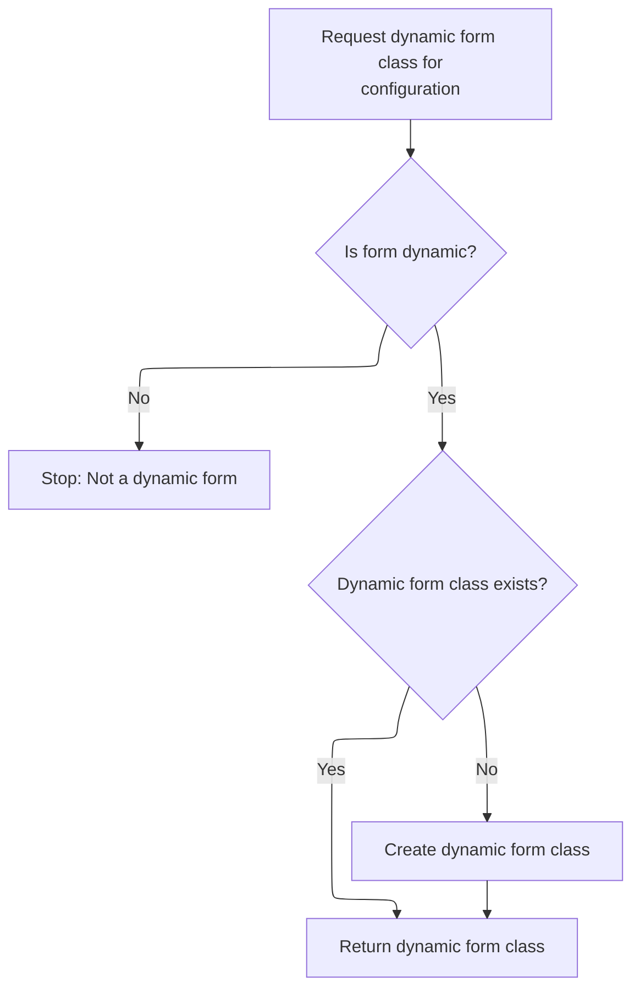

<SwmSnippet path="/core/src/main/java/org/apache/struts/action/DynaActionFormClass.java" line="212">

---

CreateDynaActionFormClass just calls <SwmToken path="core/src/main/java/org/apache/struts/action/DynaActionFormClass.java" pos="214:5:5" line-data="        return config.getDynaActionFormClass();">`getDynaActionFormClass`</SwmToken> on the <SwmToken path="core/src/main/java/org/apache/struts/action/DynaActionFormClass.java" pos="213:1:1" line-data="        FormBeanConfig config) {">`FormBeanConfig`</SwmToken>. That method handles caching and thread safety, so we don't duplicate logic here.

```java
    public static DynaActionFormClass createDynaActionFormClass(
        FormBeanConfig config) {
        return config.getDynaActionFormClass();
    }
```

---

</SwmSnippet>

<SwmSnippet path="/core/src/main/java/org/apache/struts/config/FormBeanConfig.java" line="117">

---

GetDynaActionFormClass checks if the form is dynamic and throws if not. It uses a synchronized block to lazily initialize and cache the <SwmToken path="core/src/main/java/org/apache/struts/config/FormBeanConfig.java" pos="117:3:3" line-data="    public DynaActionFormClass getDynaActionFormClass() {">`DynaActionFormClass`</SwmToken>, so you only get one instance per config, even with multiple threads.

```java
    public DynaActionFormClass getDynaActionFormClass() {
        if (dynamic == false) {
            throw new IllegalArgumentException("ActionForm is not dynamic");
        }

        synchronized (lock) {
            if (dynaActionFormClass == null) {
                dynaActionFormClass = new DynaActionFormClass(this);
            }
        }

        return dynaActionFormClass;
    }
```

---

</SwmSnippet>

## Creating <SwmToken path="faces/src/main/java/org/apache/struts/faces/component/FormComponent.java" pos="491:8:8" line-data="                            (&quot; Recycling existing DynaActionForm instance &quot; +">`DynaActionForm`</SwmToken> Instance

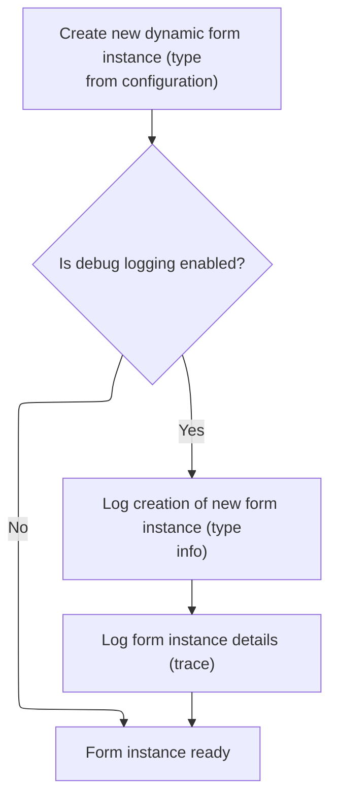

<SwmSnippet path="/faces/src/main/java/org/apache/struts/faces/component/FormComponent.java" line="524">

---

After getting the <SwmToken path="faces/src/main/java/org/apache/struts/faces/component/FormComponent.java" pos="522:1:1" line-data="                DynaActionFormClass dynaClass =">`DynaActionFormClass`</SwmToken>, <SwmToken path="faces/src/main/java/org/apache/struts/faces/renderer/FormRenderer.java" pos="180:9:9" line-data="            ((FormComponent) component).createActionForm(context);">`createActionForm`</SwmToken> calls <SwmToken path="faces/src/main/java/org/apache/struts/faces/component/FormComponent.java" pos="524:11:13" line-data="                instance = (ActionForm) dynaClass.newInstance();">`newInstance()`</SwmToken> to actually create the <SwmToken path="faces/src/main/java/org/apache/struts/faces/component/FormComponent.java" pos="527:8:8" line-data="                        (&quot; Creating new DynaActionForm instance &quot; +">`DynaActionForm`</SwmToken>. If debug is enabled, it logs the creation and the instance details.

```java
                instance = (ActionForm) dynaClass.newInstance();
                if (log.isDebugEnabled()) {
                    log.debug
                        (" Creating new DynaActionForm instance " +
                         "of type '" + fbConfig.getType() + "'");
                    log.trace(" --> " + instance);
                }
```

---

</SwmSnippet>

## Creating New <SwmToken path="faces/src/main/java/org/apache/struts/faces/component/FormComponent.java" pos="491:8:8" line-data="                            (&quot; Recycling existing DynaActionForm instance &quot; +">`DynaActionForm`</SwmToken> Bean

<SwmSnippet path="/core/src/main/java/org/apache/struts/action/DynaActionFormClass.java" line="158">

---

In <SwmToken path="core/src/main/java/org/apache/struts/action/DynaActionFormClass.java" pos="158:5:5" line-data="    public DynaBean newInstance()">`newInstance`</SwmToken>, we create the <SwmToken path="core/src/main/java/org/apache/struts/action/DynaActionFormClass.java" pos="160:1:1" line-data="        DynaActionForm dynaBean = (DynaActionForm) getBeanClass().newInstance();">`DynaActionForm`</SwmToken>, set its <SwmToken path="faces/src/main/java/org/apache/struts/faces/component/FormComponent.java" pos="522:1:1" line-data="                DynaActionFormClass dynaClass =">`DynaActionFormClass`</SwmToken>, and loop through all property configs to set their initial values. This wires up the bean so it's ready for use.

```java
    public DynaBean newInstance()
        throws IllegalAccessException, InstantiationException {
        DynaActionForm dynaBean = (DynaActionForm) getBeanClass().newInstance();

```

---

</SwmSnippet>

### Resolving Bean Class for <SwmToken path="faces/src/main/java/org/apache/struts/faces/component/FormComponent.java" pos="491:8:8" line-data="                            (&quot; Recycling existing DynaActionForm instance &quot; +">`DynaActionForm`</SwmToken>

<SwmSnippet path="/core/src/main/java/org/apache/struts/action/DynaActionFormClass.java" line="227">

---

GetBeanClass checks if <SwmToken path="core/src/main/java/org/apache/struts/action/DynaActionFormClass.java" pos="228:4:4" line-data="        if (beanClass == null) {">`beanClass`</SwmToken> is already set. If not, it calls introspect to resolve and cache the class using the config. This avoids unnecessary work until the bean is actually needed.

```java
    protected Class getBeanClass() {
        if (beanClass == null) {
            introspect(config);
        }

        return (beanClass);
    }
```

---

</SwmSnippet>

### Introspecting Form Bean and Properties

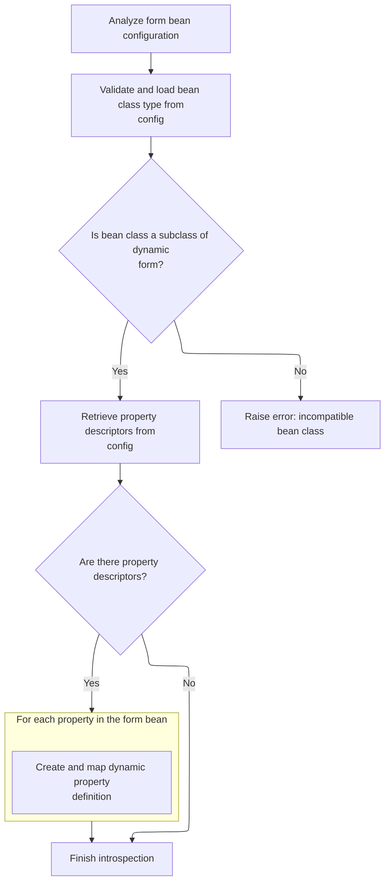

<SwmSnippet path="/core/src/main/java/org/apache/struts/action/DynaActionFormClass.java" line="246">

---

In introspect, we loop through all FormPropertyConfigs, create <SwmToken path="core/src/main/java/org/apache/struts/action/DynaActionFormClass.java" pos="277:7:7" line-data="        properties = new DynaProperty[descriptors.length];">`DynaProperty`</SwmToken> objects for each, and store them in a map. This sets up the metadata for all dynamic properties on the form bean.

```java
    protected void introspect(FormBeanConfig config) {
        this.config = config;

        // Validate the ActionFormBean implementation class
        try {
            beanClass = RequestUtils.applicationClass(config.getType());
        } catch (Throwable t) {
        	IllegalArgumentException t2 = new IllegalArgumentException(
                "Cannot instantiate ActionFormBean class '" + config.getType()
                + "'");
        	t2.initCause(t);
        	throw t2;
        }

        if (!DynaActionForm.class.isAssignableFrom(beanClass)) {
            throw new IllegalArgumentException("Class '" + config.getType()
                + "' is not a subclass of "
                + "'org.apache.struts.action.DynaActionForm'");
        }

        // Set the name we will know ourselves by from the form bean name
        this.name = config.getName();

        // Look up the property descriptors for this bean class
        FormPropertyConfig[] descriptors = config.findFormPropertyConfigs();

        if (descriptors == null) {
            descriptors = new FormPropertyConfig[0];
        }

        // Create corresponding dynamic property definitions
        properties = new DynaProperty[descriptors.length];

        for (int i = 0; i < descriptors.length; i++) {
            properties[i] =
                new DynaProperty(descriptors[i].getName(),
                    descriptors[i].getTypeClass());
            propertiesMap.put(properties[i].getName(), properties[i]);
        }
    }
```

---

</SwmSnippet>

<SwmSnippet path="/core/src/main/java/org/apache/struts/config/FormPropertyConfig.java" line="221">

---

GetTypeClass checks if the type is an array, handles primitive types, and loads the class using the context class loader. If it's an array, it returns the array Class object; otherwise, just the base class.

```java
    public Class getTypeClass() {
        // Identify the base class (in case an array was specified)
        String baseType = getType();
        boolean indexed = false;

        if (baseType.endsWith("[]")) {
            baseType = baseType.substring(0, baseType.length() - 2);
            indexed = true;
        }

        // Construct an appropriate Class instance for the base class
        Class baseClass = null;

        if ("boolean".equals(baseType)) {
            baseClass = Boolean.TYPE;
        } else if ("byte".equals(baseType)) {
            baseClass = Byte.TYPE;
        } else if ("char".equals(baseType)) {
            baseClass = Character.TYPE;
        } else if ("double".equals(baseType)) {
            baseClass = Double.TYPE;
        } else if ("float".equals(baseType)) {
            baseClass = Float.TYPE;
        } else if ("int".equals(baseType)) {
            baseClass = Integer.TYPE;
        } else if ("long".equals(baseType)) {
            baseClass = Long.TYPE;
        } else if ("short".equals(baseType)) {
            baseClass = Short.TYPE;
        } else {
            ClassLoader classLoader =
                Thread.currentThread().getContextClassLoader();

            if (classLoader == null) {
                classLoader = this.getClass().getClassLoader();
            }

            try {
                baseClass = classLoader.loadClass(baseType);
            } catch (ClassNotFoundException ex) {
                log.error("Class '" + baseType +
                          "' not found for property '" + name + "'");
                baseClass = null;
            }
        }

        // Return the base class or an array appropriately
        if (indexed) {
            return (Array.newInstance(baseClass, 0).getClass());
        } else {
            return (baseClass);
        }
    }
```

---

</SwmSnippet>

### Initializing <SwmToken path="faces/src/main/java/org/apache/struts/faces/component/FormComponent.java" pos="491:8:8" line-data="                            (&quot; Recycling existing DynaActionForm instance &quot; +">`DynaActionForm`</SwmToken> Property Values

<SwmSnippet path="/core/src/main/java/org/apache/struts/action/DynaActionFormClass.java" line="162">

---

After creating the <SwmToken path="faces/src/main/java/org/apache/struts/faces/component/FormComponent.java" pos="491:8:8" line-data="                            (&quot; Recycling existing DynaActionForm instance &quot; +">`DynaActionForm`</SwmToken>, <SwmToken path="faces/src/main/java/org/apache/struts/faces/component/FormComponent.java" pos="524:11:11" line-data="                instance = (ActionForm) dynaClass.newInstance();">`newInstance`</SwmToken> loops through all property configs and sets each property to its initial value. This is where we call FormPropertyConfig.initial to get the right value for each property.

```java
        dynaBean.setDynaActionFormClass(this);

        FormPropertyConfig[] props = config.findFormPropertyConfigs();

        for (int i = 0; i < props.length; i++) {
            dynaBean.set(props[i].getName(), props[i].initial());
        }

        return (dynaBean);
    }
```

---

</SwmSnippet>

## Creating Initial Property Values

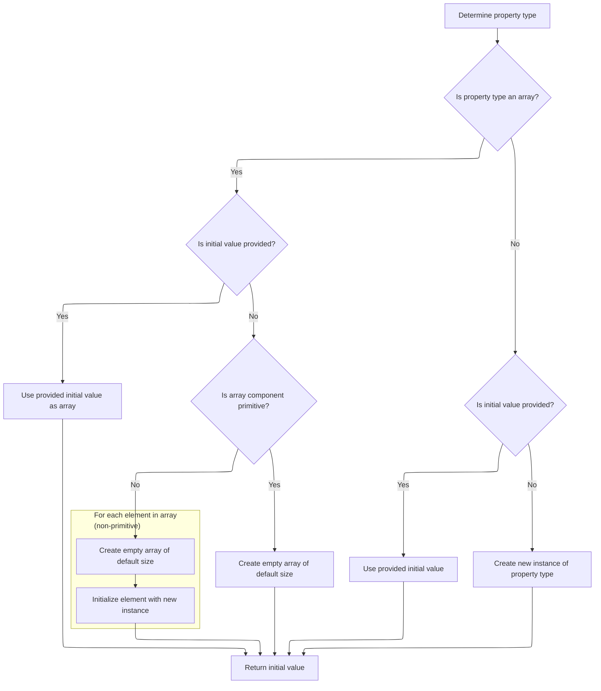

<SwmSnippet path="/core/src/main/java/org/apache/struts/config/FormPropertyConfig.java" line="318">

---

In initial, we figure out the property type, then either convert the initial value or create a new instance. For arrays, we handle both primitive and object types, filling them as needed.

```java
    public Object initial() {
        Object initialValue = null;

        try {
            Class clazz = getTypeClass();

```

---

</SwmSnippet>

<SwmSnippet path="/core/src/main/java/org/apache/struts/config/FormPropertyConfig.java" line="324">

---

After figuring out the type in initial, if it's an array and not primitive, we loop and instantiate each element. If anything fails, we log the error but keep going. For non-arrays, we just convert or instantiate as needed.

```java
            if (clazz.isArray()) {
                if (initial != null) {
                    initialValue = ConvertUtils.convert(initial, clazz);
                } else {
                    initialValue =
                        Array.newInstance(clazz.getComponentType(), size);

                    if (!(clazz.getComponentType().isPrimitive())) {
                        for (int i = 0; i < size; i++) {
                            try {
                                Array.set(initialValue, i,
                                    clazz.getComponentType().newInstance());
                            } catch (Throwable t) {
                                log.error("Unable to create instance of "
                                    + clazz.getName() + " for property=" + name
                                    + ", type=" + type + ", initial=" + initial
                                    + ", size=" + size + ".");

                                //FIXME: Should we just dump the entire application/module ?
                            }
                        }
```

---

</SwmSnippet>

<SwmSnippet path="/core/src/main/java/org/apache/struts/config/FormPropertyConfig.java" line="348">

---

At the end of initial, if anything goes wrong, we just return null. Otherwise, we return the created or converted value. This hands control back to <SwmToken path="faces/src/main/java/org/apache/struts/faces/component/FormComponent.java" pos="522:1:1" line-data="                DynaActionFormClass dynaClass =">`DynaActionFormClass`</SwmToken> to finish setting up the bean.

```java
                if (initial != null) {
                    initialValue = ConvertUtils.convert(initial, clazz);
                } else {
                    initialValue = clazz.newInstance();
                }
            }
        } catch (Throwable t) {
            initialValue = null;
        }

        return (initialValue);
    }
```

---

</SwmSnippet>

## Configuring and Caching Form Bean

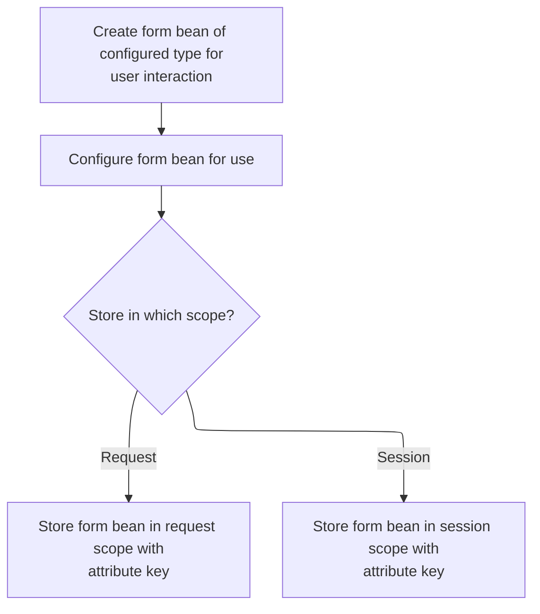

<SwmSnippet path="/faces/src/main/java/org/apache/struts/faces/component/FormComponent.java" line="531">

---

After creating the form bean, <SwmToken path="faces/src/main/java/org/apache/struts/faces/renderer/FormRenderer.java" pos="180:9:9" line-data="            ((FormComponent) component).createActionForm(context);">`createActionForm`</SwmToken> sets the servlet reference and stores the bean in either the request or session map, depending on the scope. This makes the bean available for the rest of the JSF/Struts request lifecycle.

```java
            } catch (Throwable t) {
            	IllegalArgumentException t2 = new IllegalArgumentException
                    ("Cannot create form bean of type '" +
                     fbConfig.getType() + "'");
                t2.initCause(t);
                throw t2;
            }
        } else {
            try {
                instance = (ActionForm)
                    RequestUtils.applicationInstance(fbConfig.getType());
                if (log.isDebugEnabled()) {
                    log.debug
                        (" Creating new ActionForm instance " +
                         "of type '" + fbConfig.getType() + "'");
                    log.trace(" --> " + instance);
                }
            } catch (Throwable t) {
            	IllegalArgumentException t2 = new IllegalArgumentException
                    ("Cannot create form bean of class '" +
                     fbConfig.getType() + "'");
                t2.initCause(t);
                throw t2;
            }
        }

        // Configure and cache the form bean instance in the correct scope
        ActionServlet servlet = (ActionServlet)
            context.getExternalContext().getApplicationMap().get
            (Globals.ACTION_SERVLET_KEY);
        instance.setServlet(servlet);
        if ("request".equals(scope)) {
            context.getExternalContext().getRequestMap().put
                (attribute, instance);
        } else if ("session".equals(scope)) {
            context.getExternalContext().getSessionMap().put
                (attribute, instance);
        }

    }
```

---

</SwmSnippet>

&nbsp;

*This is an auto-generated document by Swimm 🌊 and has not yet been verified by a human*

<SwmMeta version="3.0.0" repo-id="Z2l0aHViJTNBJTNBc3RydXRzMSUzQSUzQVN3aW1tLURlbW8=" repo-name="struts1"><sup>Powered by [Swimm](https://app.swimm.io/)</sup></SwmMeta>
