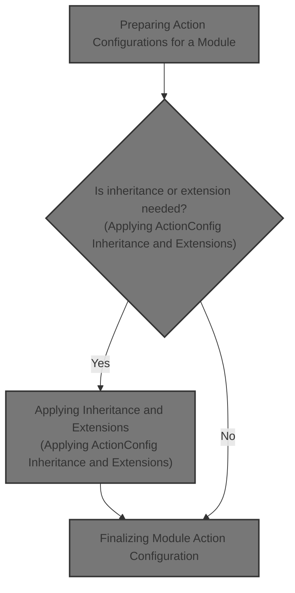
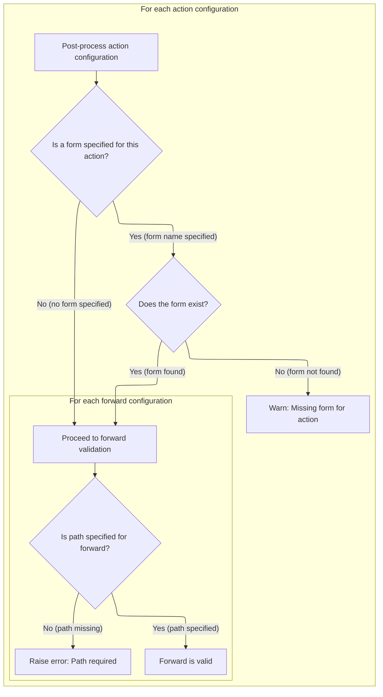

```mermaid
%%{init: {"flowchart": {"defaultRenderer": "elk"}} }%%
flowchart TD
    node1["Start: Does this config extend another?
(ancestor)"] --> node2{"Does config extend another?"}
    click node1 openCode "core/src/main/java/org/apache/struts/action/ActionServlet.java:1482:1484"
    node2 -->|"No"| node9["Return config unchanged"]
    click node2 openCode "core/src/main/java/org/apache/struts/action/ActionServlet.java:1485:1487"
    node2 -->|"Yes"| node3{"Is ancestor config found?"}
    click node3 openCode "core/src/main/java/org/apache/struts/action/ActionServlet.java:1490:1498"
    node3 -->|"No"| node10["Error: Ancestor config missing"]
    click node10 openCode "core/src/main/java/org/apache/struts/action/ActionServlet.java:1495:1498"
    node3 -->|"Yes"| node4{"Does config class match ancestor's
class?"}
    click node4 openCode "core/src/main/java/org/apache/struts/action/ActionServlet.java:1501:1537"
    node4 -->|"Yes"| node9
    node4 -->|"No"| node5["Create new config of ancestor's class"]
    click node5 openCode "core/src/main/java/org/apache/struts/action/ActionServlet.java:1505:1510"
    node5 --> node6["Copy all settings from old to new config"]
    click node6 openCode "core/src/main/java/org/apache/struts/action/ActionServlet.java:1513:1513"
    
    subgraph loop1["For each forward config"]
      node6 --> node7["Add forward config to new config"]
      click node7 openCode "core/src/main/java/org/apache/struts/action/ActionServlet.java:1516:1521"
    end
    node7 --> node8["Add exception configs to new config"]
    click node8 openCode "core/src/main/java/org/apache/struts/action/ActionServlet.java:1523:1528"
    node8 --> node11["Replace old config with new config"]
    click node11 openCode "core/src/main/java/org/apache/struts/action/ActionServlet.java:1534:1536"
    node11 --> node9
    click node9 openCode "core/src/main/java/org/apache/struts/action/ActionServlet.java:1540:1541"

classDef HeadingStyle fill:#777777,stroke:#333,stroke-width:2px;

%% Swimm:
%% %%{init: {"flowchart": {"defaultRenderer": "elk"}} }%%
%% flowchart TD
%%     node1["Start: Does this config extend another?
%% (ancestor)"] --> node2{"Does config extend another?"}
%%     click node1 openCode "<SwmPath>[core/…/action/ActionServlet.java](core/src/main/java/org/apache/struts/action/ActionServlet.java)</SwmPath>:1482:1484"
%%     node2 -->|"No"| node9["Return config unchanged"]
%%     click node2 openCode "<SwmPath>[core/…/action/ActionServlet.java](core/src/main/java/org/apache/struts/action/ActionServlet.java)</SwmPath>:1485:1487"
%%     node2 -->|"Yes"| node3{"Is ancestor config found?"}
%%     click node3 openCode "<SwmPath>[core/…/action/ActionServlet.java](core/src/main/java/org/apache/struts/action/ActionServlet.java)</SwmPath>:1490:1498"
%%     node3 -->|"No"| node10["Error: Ancestor config missing"]
%%     click node10 openCode "<SwmPath>[core/…/action/ActionServlet.java](core/src/main/java/org/apache/struts/action/ActionServlet.java)</SwmPath>:1495:1498"
%%     node3 -->|"Yes"| node4{"Does config class match ancestor's
%% class?"}
%%     click node4 openCode "<SwmPath>[core/…/action/ActionServlet.java](core/src/main/java/org/apache/struts/action/ActionServlet.java)</SwmPath>:1501:1537"
%%     node4 -->|"Yes"| node9
%%     node4 -->|"No"| node5["Create new config of ancestor's class"]
%%     click node5 openCode "<SwmPath>[core/…/action/ActionServlet.java](core/src/main/java/org/apache/struts/action/ActionServlet.java)</SwmPath>:1505:1510"
%%     node5 --> node6["Copy all settings from old to new config"]
%%     click node6 openCode "<SwmPath>[core/…/action/ActionServlet.java](core/src/main/java/org/apache/struts/action/ActionServlet.java)</SwmPath>:1513:1513"
%%     
%%     subgraph loop1["For each forward config"]
%%       node6 --> node7["Add forward config to new config"]
%%       click node7 openCode "<SwmPath>[core/…/action/ActionServlet.java](core/src/main/java/org/apache/struts/action/ActionServlet.java)</SwmPath>:1516:1521"
%%     end
%%     node7 --> node8["Add exception configs to new config"]
%%     click node8 openCode "<SwmPath>[core/…/action/ActionServlet.java](core/src/main/java/org/apache/struts/action/ActionServlet.java)</SwmPath>:1523:1528"
%%     node8 --> node11["Replace old config with new config"]
%%     click node11 openCode "<SwmPath>[core/…/action/ActionServlet.java](core/src/main/java/org/apache/struts/action/ActionServlet.java)</SwmPath>:1534:1536"
%%     node11 --> node9
%%     click node9 openCode "<SwmPath>[core/…/action/ActionServlet.java](core/src/main/java/org/apache/struts/action/ActionServlet.java)</SwmPath>:1540:1541"
%% 
%% classDef HeadingStyle fill:#777777,stroke:#333,stroke-width:2px;
```

This document describes how action configurations for a module are prepared and validated. The flow receives a set of action configurations and a module configuration, applies inheritance and extension logic, normalizes the configurations, and validates that all required properties and references are present.



# Preparing Action Configurations for a Module

<SwmSnippet path="/core/src/main/java/org/apache/struts/action/ActionServlet.java" line="1363">

---

In <SwmToken path="core/src/main/java/org/apache/struts/action/ActionServlet.java" pos="1363:5:5" line-data="    protected void initModuleActions(ModuleConfig config)">`initModuleActions`</SwmToken>, we loop through all ActionConfigs for the module and immediately call <SwmToken path="core/src/main/java/org/apache/struts/action/ActionServlet.java" pos="1376:1:1" line-data="            postProcessConfig(actionConfig, config, true);">`postProcessConfig`</SwmToken> on each. This sets up each <SwmToken path="core/src/main/java/org/apache/struts/action/ActionServlet.java" pos="1370:5:5" line-data="        // Process ActionConfig extensions.">`ActionConfig`</SwmToken> so that any custom logic or normalization is applied before we handle extensions or inheritance.

```java
    protected void initModuleActions(ModuleConfig config)
        throws ServletException {
        if (log.isDebugEnabled()) {
            log.debug("Initializing module path '" + config.getPrefix()
                + "' action configs");
        }

        // Process ActionConfig extensions.
        ActionConfig[] actionConfigs = config.findActionConfigs();

        for (int i = 0; i < actionConfigs.length; i++) {
            ActionConfig actionConfig = actionConfigs[i];

            postProcessConfig(actionConfig, config, true);
```

---

</SwmSnippet>

<SwmSnippet path="/core/src/main/java/org/apache/struts/action/ActionServlet.java" line="1377">

---

Back in <SwmToken path="core/src/main/java/org/apache/struts/action/ActionServlet.java" pos="1363:5:5" line-data="    protected void initModuleActions(ModuleConfig config)">`initModuleActions`</SwmToken>, after <SwmToken path="core/src/main/java/org/apache/struts/action/ActionServlet.java" pos="1376:1:1" line-data="            postProcessConfig(actionConfig, config, true);">`postProcessConfig`</SwmToken>, we call <SwmToken path="core/src/main/java/org/apache/struts/action/ActionServlet.java" pos="1377:1:1" line-data="            processActionConfigExtension(actionConfig, config);">`processActionConfigExtension`</SwmToken> to handle inheritance and extension logic for each <SwmToken path="core/src/main/java/org/apache/struts/action/ActionServlet.java" pos="1370:5:5" line-data="        // Process ActionConfig extensions.">`ActionConfig`</SwmToken>. This is where configs that extend others get their properties and class adjustments.

```java
            processActionConfigExtension(actionConfig, config);
```

---

</SwmSnippet>

## Applying <SwmToken path="core/src/main/java/org/apache/struts/action/ActionServlet.java" pos="1370:5:5" line-data="        // Process ActionConfig extensions.">`ActionConfig`</SwmToken> Inheritance and Extensions

<SwmSnippet path="/core/src/main/java/org/apache/struts/action/ActionServlet.java" line="1431">

---

In <SwmToken path="core/src/main/java/org/apache/struts/action/ActionServlet.java" pos="1431:5:5" line-data="    protected void processActionConfigExtension(ActionConfig actionConfig,">`processActionConfigExtension`</SwmToken>, we check if the <SwmToken path="core/src/main/java/org/apache/struts/action/ActionServlet.java" pos="1431:7:7" line-data="    protected void processActionConfigExtension(ActionConfig actionConfig,">`ActionConfig`</SwmToken>'s extensions have already been processed. If not, we call <SwmToken path="core/src/main/java/org/apache/struts/action/ActionServlet.java" pos="1442:1:1" line-data="                    processActionConfigClass(actionConfig, moduleConfig);">`processActionConfigClass`</SwmToken> to handle class inheritance and ensure the config uses the correct class and properties.

```java
    protected void processActionConfigExtension(ActionConfig actionConfig,
        ModuleConfig moduleConfig)
        throws ServletException {
        try {
            if (!actionConfig.isExtensionProcessed()) {
                if (log.isDebugEnabled()) {
                    log.debug("Processing extensions for '"
                        + actionConfig.getPath() + "'");
                }

                actionConfig =
                    processActionConfigClass(actionConfig, moduleConfig);

```

---

</SwmSnippet>

### Resolving <SwmToken path="core/src/main/java/org/apache/struts/action/ActionServlet.java" pos="1370:5:5" line-data="        // Process ActionConfig extensions.">`ActionConfig`</SwmToken> Class Inheritance



<SwmSnippet path="/core/src/main/java/org/apache/struts/action/ActionServlet.java" line="1479">

---

In <SwmToken path="core/src/main/java/org/apache/struts/action/ActionServlet.java" pos="1479:5:5" line-data="    protected ActionConfig processActionConfigClass(ActionConfig actionConfig,">`processActionConfigClass`</SwmToken>, we check if the <SwmToken path="core/src/main/java/org/apache/struts/action/ActionServlet.java" pos="1479:3:3" line-data="    protected ActionConfig processActionConfigClass(ActionConfig actionConfig,">`ActionConfig`</SwmToken> has an 'extends' attribute. If so, we look up the base <SwmToken path="core/src/main/java/org/apache/struts/action/ActionServlet.java" pos="1479:3:3" line-data="    protected ActionConfig processActionConfigClass(ActionConfig actionConfig,">`ActionConfig`</SwmToken> in the <SwmToken path="core/src/main/java/org/apache/struts/action/ActionServlet.java" pos="1480:1:1" line-data="        ModuleConfig moduleConfig)">`ModuleConfig`</SwmToken> (which is handled by ModuleConfigImpl). This is where we determine what config to inherit from.

```java
    protected ActionConfig processActionConfigClass(ActionConfig actionConfig,
        ModuleConfig moduleConfig)
        throws ServletException {
        String ancestor = actionConfig.getExtends();

        if (ancestor == null) {
            // Nothing to do, then
            return actionConfig;
        }

        // Make sure that this config is of the right class
        ActionConfig baseConfig = moduleConfig.findActionConfig(ancestor);
```

---

</SwmSnippet>

<SwmSnippet path="/core/src/main/java/org/apache/struts/action/ActionServlet.java" line="1491">

---

Back in <SwmToken path="core/src/main/java/org/apache/struts/action/ActionServlet.java" pos="1442:1:1" line-data="                    processActionConfigClass(actionConfig, moduleConfig);">`processActionConfigClass`</SwmToken>, after finding the base config, we check if the <SwmToken path="core/src/main/java/org/apache/struts/action/ActionServlet.java" pos="1505:1:1" line-data="                ActionConfig newActionConfig = null;">`ActionConfig`</SwmToken>'s class needs to be replaced. If so, we use reflection and <SwmToken path="core/src/main/java/org/apache/struts/action/ActionServlet.java" pos="1513:1:1" line-data="                    BeanUtils.copyProperties(newActionConfig, actionConfig);">`BeanUtils`</SwmToken> to create a new instance of the base config's class and copy over all properties. This is where <SwmToken path="core/src/main/java/org/apache/struts/action/ActionServlet.java" pos="45:10:10" line-data="import org.apache.struts.config.BaseConfig;">`BaseConfig`</SwmToken> logic comes in for instantiation and property copying.

```java
        if (baseConfig == null) {
            baseConfig = moduleConfig.findActionConfigId(ancestor); 
        }
        
        if (baseConfig == null) {
            throw new UnavailableException("Unable to find "
                + "action config for '" + ancestor + "' to extend.");
        }

        // Was our actionConfig's class overridden already?
        if (actionConfig.getClass().equals(ActionMapping.class)) {
            // Ensure that our config is using the correct class
            if (!baseConfig.getClass().equals(actionConfig.getClass())) {
                // Replace the config with an instance of the correct class
                ActionConfig newActionConfig = null;
                String baseConfigClassName = baseConfig.getClass().getName();

                try {
                    newActionConfig =
                        (ActionConfig) RequestUtils.applicationInstance(baseConfigClassName);

                    // copy the values
                    BeanUtils.copyProperties(newActionConfig, actionConfig);

```

---

</SwmSnippet>

<SwmSnippet path="/core/src/main/java/org/apache/struts/action/ActionServlet.java" line="1515">

---

Back in <SwmToken path="core/src/main/java/org/apache/struts/action/ActionServlet.java" pos="1442:1:1" line-data="                    processActionConfigClass(actionConfig, moduleConfig);">`processActionConfigClass`</SwmToken>, after copying basic properties, we explicitly copy all <SwmToken path="core/src/main/java/org/apache/struts/action/ActionServlet.java" pos="1516:1:1" line-data="                    ForwardConfig[] forwards =">`ForwardConfig`</SwmToken> objects from the old <SwmToken path="core/src/main/java/org/apache/struts/action/ActionServlet.java" pos="1370:5:5" line-data="        // Process ActionConfig extensions.">`ActionConfig`</SwmToken> to the new one. This ensures all forwards are preserved during inheritance.

```java
                    // copy the forward and exception configs, too
                    ForwardConfig[] forwards =
                        actionConfig.findForwardConfigs();

                    for (int i = 0; i < forwards.length; i++) {
                        newActionConfig.addForwardConfig(forwards[i]);
                    }

```

---

</SwmSnippet>

<SwmSnippet path="/core/src/main/java/org/apache/struts/action/ActionServlet.java" line="1523">

---

Still in <SwmToken path="core/src/main/java/org/apache/struts/action/ActionServlet.java" pos="1442:1:1" line-data="                    processActionConfigClass(actionConfig, moduleConfig);">`processActionConfigClass`</SwmToken>, we copy all <SwmToken path="core/src/main/java/org/apache/struts/action/ActionServlet.java" pos="1523:1:1" line-data="                    ExceptionConfig[] exceptions =">`ExceptionConfig`</SwmToken> objects to the new <SwmToken path="core/src/main/java/org/apache/struts/action/ActionServlet.java" pos="1370:5:5" line-data="        // Process ActionConfig extensions.">`ActionConfig`</SwmToken>, right after copying the forwards. This keeps all exception handling logic intact when replacing the config instance.

```java
                    ExceptionConfig[] exceptions =
                        actionConfig.findExceptionConfigs();

                    for (int i = 0; i < exceptions.length; i++) {
                        newActionConfig.addExceptionConfig(exceptions[i]);
                    }
```

---

</SwmSnippet>

<SwmSnippet path="/core/src/main/java/org/apache/struts/action/ActionServlet.java" line="1529">

---

Finally, in <SwmToken path="core/src/main/java/org/apache/struts/action/ActionServlet.java" pos="1442:1:1" line-data="                    processActionConfigClass(actionConfig, moduleConfig);">`processActionConfigClass`</SwmToken>, if anything fails during the new <SwmToken path="core/src/main/java/org/apache/struts/action/ActionServlet.java" pos="1370:5:5" line-data="        // Process ActionConfig extensions.">`ActionConfig`</SwmToken> creation, we call <SwmToken path="core/src/main/java/org/apache/struts/action/ActionServlet.java" pos="1530:1:1" line-data="                    handleCreationException(baseConfigClassName, e);">`handleCreationException`</SwmToken> to log and handle the error. After that, we swap the old config for the new one in the <SwmToken path="core/src/main/java/org/apache/struts/action/ActionServlet.java" pos="1363:7:7" line-data="    protected void initModuleActions(ModuleConfig config)">`ModuleConfig`</SwmToken>.

```java
                } catch (Exception e) {
                    handleCreationException(baseConfigClassName, e);
                }

                // replace actionConfig with newActionConfig
                moduleConfig.removeActionConfig(actionConfig);
                moduleConfig.addActionConfig(newActionConfig);
                actionConfig = newActionConfig;
            }
        }

        return actionConfig;
    }
```

---

</SwmSnippet>

### Finalizing <SwmToken path="core/src/main/java/org/apache/struts/action/ActionServlet.java" pos="1370:5:5" line-data="        // Process ActionConfig extensions.">`ActionConfig`</SwmToken> Extension Processing

<SwmSnippet path="/core/src/main/java/org/apache/struts/action/ActionServlet.java" line="1444">

---

Back in <SwmToken path="core/src/main/java/org/apache/struts/action/ActionServlet.java" pos="1377:1:1" line-data="            processActionConfigExtension(actionConfig, config);">`processActionConfigExtension`</SwmToken>, after class inheritance is handled, we call <SwmToken path="core/src/main/java/org/apache/struts/action/ActionServlet.java" pos="1444:3:3" line-data="                actionConfig.processExtends(moduleConfig);">`processExtends`</SwmToken> on the <SwmToken path="core/src/main/java/org/apache/struts/action/ActionServlet.java" pos="1370:5:5" line-data="        // Process ActionConfig extensions.">`ActionConfig`</SwmToken> to apply any remaining inheritance logic that wasn't covered by class replacement.

```java
                actionConfig.processExtends(moduleConfig);
            }

```

---

</SwmSnippet>

<SwmSnippet path="/core/src/main/java/org/apache/struts/action/ActionServlet.java" line="1447">

---

Still in <SwmToken path="core/src/main/java/org/apache/struts/action/ActionServlet.java" pos="1377:1:1" line-data="            processActionConfigExtension(actionConfig, config);">`processActionConfigExtension`</SwmToken>, after processing <SwmToken path="core/src/main/java/org/apache/struts/action/ActionServlet.java" pos="1370:5:5" line-data="        // Process ActionConfig extensions.">`ActionConfig`</SwmToken> inheritance, we loop through all ForwardConfigs and call <SwmToken path="core/src/main/java/org/apache/struts/action/ActionServlet.java" pos="1451:1:1" line-data="                processForwardExtension(forward, moduleConfig, actionConfig);">`processForwardExtension`</SwmToken> on each. This lets forwards handle their own extension logic.

```java
            // Process forwards extensions.
            ForwardConfig[] forwards = actionConfig.findForwardConfigs();
            for (int i = 0; i < forwards.length; i++) {
                ForwardConfig forward = forwards[i];
                processForwardExtension(forward, moduleConfig, actionConfig);
            }

```

---

</SwmSnippet>

<SwmSnippet path="/core/src/main/java/org/apache/struts/action/ActionServlet.java" line="1454">

---

Still in <SwmToken path="core/src/main/java/org/apache/struts/action/ActionServlet.java" pos="1377:1:1" line-data="            processActionConfigExtension(actionConfig, config);">`processActionConfigExtension`</SwmToken>, after forwards, we process all ExceptionConfigs by calling <SwmToken path="core/src/main/java/org/apache/struts/action/ActionServlet.java" pos="1458:1:1" line-data="                processExceptionExtension(exception, moduleConfig,">`processExceptionExtension`</SwmToken>. This finalizes exception handling logic for the <SwmToken path="core/src/main/java/org/apache/struts/action/ActionServlet.java" pos="1370:5:5" line-data="        // Process ActionConfig extensions.">`ActionConfig`</SwmToken>.

```java
            // Process exception extensions.
            ExceptionConfig[] exceptions = actionConfig.findExceptionConfigs();
            for (int i = 0; i < exceptions.length; i++) {
                ExceptionConfig exception = exceptions[i];
                processExceptionExtension(exception, moduleConfig,
                    actionConfig);
            }
```

---

</SwmSnippet>

<SwmSnippet path="/core/src/main/java/org/apache/struts/action/ActionServlet.java" line="1461">

---

Finally, in <SwmToken path="core/src/main/java/org/apache/struts/action/ActionServlet.java" pos="1377:1:1" line-data="            processActionConfigExtension(actionConfig, config);">`processActionConfigExtension`</SwmToken>, if any exception occurs during extension processing, we call <SwmToken path="core/src/main/java/org/apache/struts/action/ActionServlet.java" pos="1464:1:1" line-data="            handleGeneralExtensionException(&quot;Action&quot;, actionConfig.getPath(), e);">`handleGeneralExtensionException`</SwmToken> to log and handle the error for visibility.

```java
        } catch (ServletException e) {
            throw e;
        } catch (Exception e) {
            handleGeneralExtensionException("Action", actionConfig.getPath(), e);
        }
    }
```

---

</SwmSnippet>

## Finalizing Module Action Configuration



<SwmSnippet path="/core/src/main/java/org/apache/struts/action/ActionServlet.java" line="1378">

---

Back in <SwmToken path="core/src/main/java/org/apache/struts/action/ActionServlet.java" pos="1363:5:5" line-data="    protected void initModuleActions(ModuleConfig config)">`initModuleActions`</SwmToken>, after all extension logic, we call <SwmToken path="core/src/main/java/org/apache/struts/action/ActionServlet.java" pos="1378:1:1" line-data="            postProcessConfig(actionConfig, config, false);">`postProcessConfig`</SwmToken> again to normalize and finalize any changes made during extension processing.

```java
            postProcessConfig(actionConfig, config, false);

```

---

</SwmSnippet>

<SwmSnippet path="/core/src/main/java/org/apache/struts/action/ActionServlet.java" line="1380">

---

Still in <SwmToken path="core/src/main/java/org/apache/struts/action/ActionServlet.java" pos="1363:5:5" line-data="    protected void initModuleActions(ModuleConfig config)">`initModuleActions`</SwmToken>, after finalizing configs, we check if each <SwmToken path="core/src/main/java/org/apache/struts/action/ActionServlet.java" pos="1370:5:5" line-data="        // Process ActionConfig extensions.">`ActionConfig`</SwmToken>'s form bean exists. If not, we log a warning to help developers catch typos or missing beans early.

```java
            // Verify the form, if specified, exists to help the developer
            // detect a possible typo. It is also possible the missing
            // reference is a dynamic runtime bean
            String formName = actionConfig.getName();
            if (formName != null) {
                FormBeanConfig formConfig = config.findFormBeanConfig(formName);
                if (formConfig == null) {
                    log.warn(getInternal().getMessage("actionFormUnknown", 
                            actionConfig.getPath(), formName));
                }
            }
        }

```

---

</SwmSnippet>

<SwmSnippet path="/core/src/main/java/org/apache/struts/action/ActionServlet.java" line="1393">

---

Back in <SwmToken path="core/src/main/java/org/apache/struts/action/ActionServlet.java" pos="1363:5:5" line-data="    protected void initModuleActions(ModuleConfig config)">`initModuleActions`</SwmToken>, we loop through all forwards for each <SwmToken path="core/src/main/java/org/apache/struts/action/ActionServlet.java" pos="1394:1:1" line-data="            ActionConfig actionConfig = actionConfigs[i];">`ActionConfig`</SwmToken> and check that required fields like 'path' are set. If not, we call <SwmToken path="core/src/main/java/org/apache/struts/action/ActionServlet.java" pos="1404:1:1" line-data="                    handleValueRequiredException(&quot;path&quot;, forward.getName(),">`handleValueRequiredException`</SwmToken> to log or throw an error.

```java
        for (int i = 0; i < actionConfigs.length; i++) {
            ActionConfig actionConfig = actionConfigs[i];

            // Verify that required fields are all present for the forward
            // configs
            ForwardConfig[] forwards = actionConfig.findForwardConfigs();

            for (int j = 0; j < forwards.length; j++) {
                ForwardConfig forward = forwards[j];

                if (forward.getPath() == null) {
                    handleValueRequiredException("path", forward.getName(),
                        "action forward");
                }
            }

```

---

</SwmSnippet>

<SwmSnippet path="/core/src/main/java/org/apache/struts/action/ActionServlet.java" line="1409">

---

At the end of <SwmToken path="core/src/main/java/org/apache/struts/action/ActionServlet.java" pos="1363:5:5" line-data="    protected void initModuleActions(ModuleConfig config)">`initModuleActions`</SwmToken>, the code for validating required fields in ExceptionConfigs is commented out due to a known issue (<SwmToken path="core/src/main/java/org/apache/struts/action/ActionServlet.java" pos="1409:2:4" line-data="// STR-2924">`STR-2924`</SwmToken>). So, only forwards are checked for required values here.

```java
// STR-2924
//            // ... and the exception configs
//            ExceptionConfig[] exceptions = actionConfig.findExceptionConfigs();
//
//            for (int j = 0; j < exceptions.length; j++) {
//                ExceptionConfig exception = exceptions[j];
//
//                if (exception.getKey() == null) {
//                    handleValueRequiredException("key", exception.getType(),
//                        "action exception config");
//                }
//            }
        }
    }
```

---

</SwmSnippet>

&nbsp;

*This is an auto-generated document by Swimm 🌊 and has not yet been verified by a human*

<SwmMeta version="3.0.0" repo-id="Z2l0aHViJTNBJTNBc3RydXRzMSUzQSUzQVN3aW1tLURlbW8=" repo-name="struts1"><sup>Powered by [Swimm](https://app.swimm.io/)</sup></SwmMeta>
