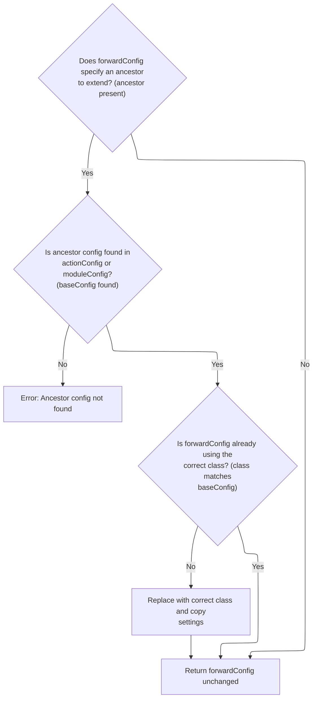

This document explains how forward configurations for a module are prepared, extended, and validated. The process takes a set of forward configurations, normalizes them, applies inheritance and extension logic, and ensures all required properties are present. This setup enables reliable navigation and redirection within the module.

# Preparing Forward Configurations for a Module

<SwmSnippet path="/core/src/main/java/org/apache/struts/action/ActionServlet.java" line="1062">

---

In <SwmToken path="core/src/main/java/org/apache/struts/action/ActionServlet.java" pos="1062:5:5" line-data="    protected void initModuleForwards(ModuleConfig config)">`initModuleForwards`</SwmToken>, we loop through all ForwardConfigs for the module and call <SwmToken path="core/src/main/java/org/apache/struts/action/ActionServlet.java" pos="1075:1:1" line-data="            postProcessConfig(forward, config, true);">`postProcessConfig`</SwmToken> on each one. This ensures each <SwmToken path="core/src/main/java/org/apache/struts/action/ActionServlet.java" pos="1070:1:1" line-data="        ForwardConfig[] forwards = config.findForwardConfigs();">`ForwardConfig`</SwmToken> is normalized and ready before we handle any extension logic.

```java
    protected void initModuleForwards(ModuleConfig config)
        throws ServletException {
        if (log.isDebugEnabled()) {
            log.debug("Initializing module path '" + config.getPrefix()
                + "' forwards");
        }

        // Process forwards extensions.
        ForwardConfig[] forwards = config.findForwardConfigs();

        for (int i = 0; i < forwards.length; i++) {
            ForwardConfig forward = forwards[i];

            postProcessConfig(forward, config, true);
```

---

</SwmSnippet>

<SwmSnippet path="/core/src/main/java/org/apache/struts/action/ActionServlet.java" line="1076">

---

Back in <SwmToken path="core/src/main/java/org/apache/struts/action/ActionServlet.java" pos="1062:5:5" line-data="    protected void initModuleForwards(ModuleConfig config)">`initModuleForwards`</SwmToken>, after <SwmToken path="core/src/main/java/org/apache/struts/action/ActionServlet.java" pos="1075:1:1" line-data="            postProcessConfig(forward, config, true);">`postProcessConfig`</SwmToken>, we call <SwmToken path="core/src/main/java/org/apache/struts/action/ActionServlet.java" pos="1076:1:1" line-data="            processForwardExtension(forward, config, null);">`processForwardExtension`</SwmToken> to handle any inheritance or extension logic for the <SwmToken path="core/src/main/java/org/apache/struts/action/ActionServlet.java" pos="1070:1:1" line-data="        ForwardConfig[] forwards = config.findForwardConfigs();">`ForwardConfig`</SwmToken>, making sure it reflects any parent config it extends.

```java
            processForwardExtension(forward, config, null);
```

---

</SwmSnippet>

## Applying Forward Inheritance and Extensions

<SwmSnippet path="/core/src/main/java/org/apache/struts/action/ActionServlet.java" line="1102">

---

In <SwmToken path="core/src/main/java/org/apache/struts/action/ActionServlet.java" pos="1102:5:5" line-data="    protected void processForwardExtension(ForwardConfig forwardConfig,">`processForwardExtension`</SwmToken>, we check if the <SwmToken path="core/src/main/java/org/apache/struts/action/ActionServlet.java" pos="1102:7:7" line-data="    protected void processForwardExtension(ForwardConfig forwardConfig,">`ForwardConfig`</SwmToken>'s extension logic has already been processed. If not, we call <SwmToken path="core/src/main/java/org/apache/struts/action/ActionServlet.java" pos="1113:1:1" line-data="                    processForwardConfigClass(forwardConfig, moduleConfig,">`processForwardConfigClass`</SwmToken> to handle inheritance and class replacement if needed.

```java
    protected void processForwardExtension(ForwardConfig forwardConfig,
        ModuleConfig moduleConfig, ActionConfig actionConfig)
        throws ServletException {
        try {
            if (!forwardConfig.isExtensionProcessed()) {
                if (log.isDebugEnabled()) {
                    log.debug("Processing extensions for '"
                        + forwardConfig.getName() + "'");
                }

                forwardConfig =
                    processForwardConfigClass(forwardConfig, moduleConfig,
                        actionConfig);

```

---

</SwmSnippet>

### Resolving Forward Inheritance and Class Replacement



<SwmSnippet path="/core/src/main/java/org/apache/struts/action/ActionServlet.java" line="1142">

---

In <SwmToken path="core/src/main/java/org/apache/struts/action/ActionServlet.java" pos="1142:5:5" line-data="    protected ForwardConfig processForwardConfigClass(">`processForwardConfigClass`</SwmToken>, we check if the <SwmToken path="core/src/main/java/org/apache/struts/action/ActionServlet.java" pos="1142:3:3" line-data="    protected ForwardConfig processForwardConfigClass(">`ForwardConfig`</SwmToken> extends another config. If so, we look up the ancestor, and if the class types differ, we create a new instance of the ancestor's class and copy properties over. This handles both inheritance and class replacement, not just property merging.

```java
    protected ForwardConfig processForwardConfigClass(
        ForwardConfig forwardConfig, ModuleConfig moduleConfig,
        ActionConfig actionConfig)
        throws ServletException {
        String ancestor = forwardConfig.getExtends();

        if (ancestor == null) {
            // Nothing to do, then
            return forwardConfig;
        }

        // Make sure that this config is of the right class
        ForwardConfig baseConfig = null;
        if (actionConfig != null) {
            // Look for this in the actionConfig
            baseConfig = actionConfig.findForwardConfig(ancestor);
        }

        if (baseConfig == null) {
            // Either this is a forwardConfig that inherits a global config,
            //  or actionConfig is null
            baseConfig = moduleConfig.findForwardConfig(ancestor);
        }

        if (baseConfig == null) {
            throw new UnavailableException("Unable to find " + "forward '"
                + ancestor + "' to extend.");
        }

        // Was our forwards's class overridden already?
        if (forwardConfig.getClass().equals(ActionForward.class)) {
            // Ensure that our forward is using the correct class
            if (!baseConfig.getClass().equals(forwardConfig.getClass())) {
                // Replace the config with an instance of the correct class
                ForwardConfig newForwardConfig = null;
                String baseConfigClassName = baseConfig.getClass().getName();

                try {
                    newForwardConfig =
                        (ForwardConfig) RequestUtils.applicationInstance(
                                baseConfigClassName);

                    // copy the values
                    BeanUtils.copyProperties(newForwardConfig, forwardConfig);
```

---

</SwmSnippet>

<SwmSnippet path="/core/src/main/java/org/apache/struts/action/ActionServlet.java" line="1186">

---

Back in <SwmToken path="core/src/main/java/org/apache/struts/action/ActionServlet.java" pos="1113:1:1" line-data="                    processForwardConfigClass(forwardConfig, moduleConfig,">`processForwardConfigClass`</SwmToken>, if creating the new <SwmToken path="core/src/main/java/org/apache/struts/action/ActionServlet.java" pos="1070:1:1" line-data="        ForwardConfig[] forwards = config.findForwardConfigs();">`ForwardConfig`</SwmToken> instance or copying properties fails, we call <SwmToken path="core/src/main/java/org/apache/struts/action/ActionServlet.java" pos="1187:1:1" line-data="                    handleCreationException(baseConfigClassName, e);">`handleCreationException`</SwmToken> to handle the error and avoid silent failures in config inheritance.

```java
                } catch (Exception e) {
                    handleCreationException(baseConfigClassName, e);
                }

```

---

</SwmSnippet>

<SwmSnippet path="/core/src/main/java/org/apache/struts/action/ActionServlet.java" line="1190">

---

Back in <SwmToken path="core/src/main/java/org/apache/struts/action/ActionServlet.java" pos="1113:1:1" line-data="                    processForwardConfigClass(forwardConfig, moduleConfig,">`processForwardConfigClass`</SwmToken>, after handling errors, we remove the old <SwmToken path="core/src/main/java/org/apache/struts/action/ActionServlet.java" pos="1070:1:1" line-data="        ForwardConfig[] forwards = config.findForwardConfigs();">`ForwardConfig`</SwmToken> from <SwmToken path="core/src/main/java/org/apache/struts/action/ActionServlet.java" pos="1103:6:6" line-data="        ModuleConfig moduleConfig, ActionConfig actionConfig)">`ActionConfig`</SwmToken> to make room for the new, correctly-typed config.

```java
                // replace forwardConfig with newForwardConfig
                if (actionConfig != null) {
                    actionConfig.removeForwardConfig(forwardConfig);
```

---

</SwmSnippet>

<SwmSnippet path="/core/src/main/java/org/apache/struts/action/ActionServlet.java" line="1193">

---

Back in <SwmToken path="core/src/main/java/org/apache/struts/action/ActionServlet.java" pos="1113:1:1" line-data="                    processForwardConfigClass(forwardConfig, moduleConfig,">`processForwardConfigClass`</SwmToken>, we add the new <SwmToken path="core/src/main/java/org/apache/struts/action/ActionServlet.java" pos="1070:1:1" line-data="        ForwardConfig[] forwards = config.findForwardConfigs();">`ForwardConfig`</SwmToken> to <SwmToken path="core/src/main/java/org/apache/struts/action/ActionServlet.java" pos="1103:6:6" line-data="        ModuleConfig moduleConfig, ActionConfig actionConfig)">`ActionConfig`</SwmToken> right after removal, so the updated config is available for the rest of the framework.

```java
                    actionConfig.addForwardConfig(newForwardConfig);
                } else {
```

---

</SwmSnippet>

<SwmSnippet path="/core/src/main/java/org/apache/struts/action/ActionServlet.java" line="1195">

---

Back in <SwmToken path="core/src/main/java/org/apache/struts/action/ActionServlet.java" pos="1113:1:1" line-data="                    processForwardConfigClass(forwardConfig, moduleConfig,">`processForwardConfigClass`</SwmToken>, if the <SwmToken path="core/src/main/java/org/apache/struts/action/ActionServlet.java" pos="1070:1:1" line-data="        ForwardConfig[] forwards = config.findForwardConfigs();">`ForwardConfig`</SwmToken> is global (not tied to an <SwmToken path="core/src/main/java/org/apache/struts/action/ActionServlet.java" pos="1103:6:6" line-data="        ModuleConfig moduleConfig, ActionConfig actionConfig)">`ActionConfig`</SwmToken>), we update it in <SwmToken path="core/src/main/java/org/apache/struts/action/ActionServlet.java" pos="1062:7:7" line-data="    protected void initModuleForwards(ModuleConfig config)">`ModuleConfig`</SwmToken> by removing the old config and adding the new one, keeping the global config consistent.

```java
                    // this is a global forward
                    moduleConfig.removeForwardConfig(forwardConfig);
                    moduleConfig.addForwardConfig(newForwardConfig);
                }
                forwardConfig = newForwardConfig;
            }
        }

        return forwardConfig;
    }
```

---

</SwmSnippet>

<SwmSnippet path="/core/src/main/java/org/apache/struts/config/impl/ModuleConfigImpl.java" line="701">

---

<SwmToken path="core/src/main/java/org/apache/struts/config/impl/ModuleConfigImpl.java" pos="701:5:5" line-data="    public void removeForwardConfig(ForwardConfig config) {">`removeForwardConfig`</SwmToken> checks if the module is still modifiable before removing the <SwmToken path="core/src/main/java/org/apache/struts/config/impl/ModuleConfigImpl.java" pos="701:7:7" line-data="    public void removeForwardConfig(ForwardConfig config) {">`ForwardConfig`</SwmToken> by name from the forwards map. This prevents changes after configuration is locked.

```java
    public void removeForwardConfig(ForwardConfig config) {
        throwIfConfigured();
        forwards.remove(config.getName());
    }
```

---

</SwmSnippet>

### Finalizing Forward Extension Processing

<SwmSnippet path="/core/src/main/java/org/apache/struts/action/ActionServlet.java" line="1116">

---

Back in <SwmToken path="core/src/main/java/org/apache/struts/action/ActionServlet.java" pos="1076:1:1" line-data="            processForwardExtension(forward, config, null);">`processForwardExtension`</SwmToken>, after class replacement, we call <SwmToken path="core/src/main/java/org/apache/struts/action/ActionServlet.java" pos="1116:3:3" line-data="                forwardConfig.processExtends(moduleConfig, actionConfig);">`processExtends`</SwmToken> on the <SwmToken path="core/src/main/java/org/apache/struts/action/ActionServlet.java" pos="1070:1:1" line-data="        ForwardConfig[] forwards = config.findForwardConfigs();">`ForwardConfig`</SwmToken> to finalize inheritance, including checks for circular references and applying inherited properties.

```java
                forwardConfig.processExtends(moduleConfig, actionConfig);
            }
```

---

</SwmSnippet>

### Validating Forward Inheritance and Circular References

See <SwmLink doc-title="Resolving Forward Inheritance">[Resolving Forward Inheritance](/.swm/resolving-forward-inheritance.89pppnbw.sw.md)</SwmLink>

### Handling Extension Errors in Forward Processing

<SwmSnippet path="/core/src/main/java/org/apache/struts/action/ActionServlet.java" line="1118">

---

Back in <SwmToken path="core/src/main/java/org/apache/struts/action/ActionServlet.java" pos="1076:1:1" line-data="            processForwardExtension(forward, config, null);">`processForwardExtension`</SwmToken>, if any exception (other than <SwmToken path="core/src/main/java/org/apache/struts/action/ActionServlet.java" pos="1118:6:6" line-data="        } catch (ServletException e) {">`ServletException`</SwmToken>) is thrown during extension processing, we call <SwmToken path="core/src/main/java/org/apache/struts/action/ActionServlet.java" pos="1121:1:1" line-data="            handleGeneralExtensionException(&quot;Forward&quot;, forwardConfig.getName(),">`handleGeneralExtensionException`</SwmToken> to log or handle the error without crashing the whole process.

```java
        } catch (ServletException e) {
            throw e;
        } catch (Exception e) {
            handleGeneralExtensionException("Forward", forwardConfig.getName(),
                e);
        }
    }
```

---

</SwmSnippet>

## Post-Extension Forward Processing

<SwmSnippet path="/core/src/main/java/org/apache/struts/action/ActionServlet.java" line="1077">

---

Back in <SwmToken path="core/src/main/java/org/apache/struts/action/ActionServlet.java" pos="1062:5:5" line-data="    protected void initModuleForwards(ModuleConfig config)">`initModuleForwards`</SwmToken>, after processing extensions, we call <SwmToken path="core/src/main/java/org/apache/struts/action/ActionServlet.java" pos="1077:1:1" line-data="            postProcessConfig(forward, config, false);">`postProcessConfig`</SwmToken> again to finalize any changes made during extension

```java
            postProcessConfig(forward, config, false);
        }

```

---

</SwmSnippet>

<SwmSnippet path="/core/src/main/java/org/apache/struts/action/ActionServlet.java" line="1080">

---

Back in <SwmToken path="core/src/main/java/org/apache/struts/action/ActionServlet.java" pos="1062:5:5" line-data="    protected void initModuleForwards(ModuleConfig config)">`initModuleForwards`</SwmToken>, after all processing, we check that each <SwmToken path="core/src/main/java/org/apache/struts/action/ActionServlet.java" pos="1081:1:1" line-data="            ForwardConfig forward = forwards[i];">`ForwardConfig`</SwmToken> has a path. If not, <SwmToken path="core/src/main/java/org/apache/struts/action/ActionServlet.java" pos="1085:1:1" line-data="                handleValueRequiredException(&quot;path&quot;, forward.getName(),">`handleValueRequiredException`</SwmToken> is called to flag the missing required value.

```java
        for (int i = 0; i < forwards.length; i++) {
            ForwardConfig forward = forwards[i];

            // Verify that required fields are all present for the forward
            if (forward.getPath() == null) {
                handleValueRequiredException("path", forward.getName(),
                    "global forward");
            }
        }
    }
```

---

</SwmSnippet>

&nbsp;

*This is an auto-generated document by Swimm 🌊 and has not yet been verified by a human*

<SwmMeta version="3.0.0" repo-id="Z2l0aHViJTNBJTNBc3RydXRzMSUzQSUzQVN3aW1tLURlbW8=" repo-name="struts1"><sup>Powered by [Swimm](https://app.swimm.io/)</sup></SwmMeta>
