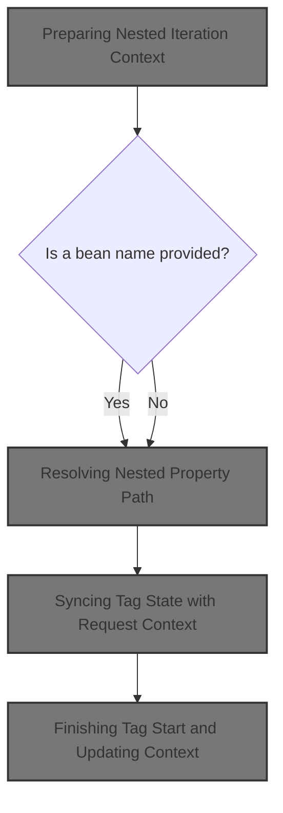
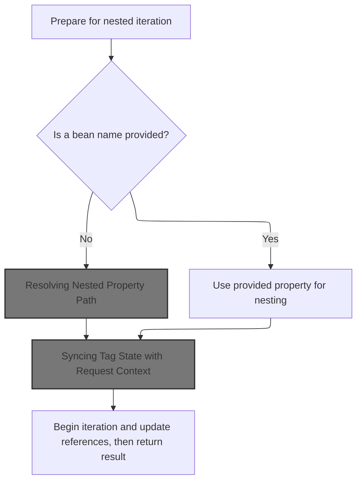

This document explains how the system prepares the context for nested iteration in JSP pages. By resolving the correct property path and updating the request context, nested tags are able to access and manipulate the appropriate data.



# Preparing Nested Iteration Context



<SwmSnippet path="/taglib/src/main/java/org/apache/struts/taglib/nested/logic/NestedIterateTag.java" line="60">

---

In <SwmToken path="taglib/src/main/java/org/apache/struts/taglib/nested/logic/NestedIterateTag.java" pos="60:5:5" line-data="    public int doStartTag() throws JspException {">`doStartTag`</SwmToken>, we're setting up the context for nested iteration. We grab the original 'name' and 'property', ensure the tag has an 'id', and pull current nesting info from the request using <SwmToken path="taglib/src/main/java/org/apache/struts/taglib/nested/logic/NestedIterateTag.java" pos="75:5:5" line-data="        originalNesting = NestedPropertyHelper.getCurrentProperty(request);">`NestedPropertyHelper`</SwmToken>. If 'name' is missing, we call <SwmToken path="taglib/src/main/java/org/apache/struts/taglib/nested/logic/NestedIterateTag.java" pos="75:5:5" line-data="        originalNesting = NestedPropertyHelper.getCurrentProperty(request);">`NestedPropertyHelper`</SwmToken> to adjust the property for nesting, so the tag works with the right bean. This setup is needed before we can iterate or manipulate nested data.

```java
    public int doStartTag() throws JspException {
        // original values
        originalName = getName();
        originalProperty = getProperty();

        // set the ID to make the super tag happy
        if ((id == null) || (id.trim().length() == 0)) {
            id = property;
        }

        // the request object
        HttpServletRequest request =
            (HttpServletRequest) pageContext.getRequest();

        // original nesting details
        originalNesting = NestedPropertyHelper.getCurrentProperty(request);
        originalNestingName =
            NestedPropertyHelper.getCurrentName(request, this);

        // set the bean if it's been provided
        // (the bean that's been provided! get it!?... nevermind)
        if (getName() == null) {
            // the qualified nesting value
            nesting =
                NestedPropertyHelper.getAdjustedProperty(request, getProperty());
        } else {
            // it's just the property
            nesting = getProperty();
        }

```

---

</SwmSnippet>

## Resolving Nested Property Path

<SwmSnippet path="/taglib/src/main/java/org/apache/struts/taglib/nested/NestedPropertyHelper.java" line="121">

---

<SwmToken path="taglib/src/main/java/org/apache/struts/taglib/nested/NestedPropertyHelper.java" pos="121:9:9" line-data="    public static final String getAdjustedProperty(HttpServletRequest request,">`getAdjustedProperty`</SwmToken> figures out the full property path by combining the current property with its parent from the request. This lets the tag reference the right nested bean, so the iteration or data access happens at the correct level.

```java
    public static final String getAdjustedProperty(HttpServletRequest request,
        String property) {
        // get the old one if any
        String parent = getCurrentProperty(request);

        return calculateRelativeProperty(property, parent);
    }
```

---

</SwmSnippet>

## Calculating Relative Paths for Nested Properties

```mermaid
%%{init: {"flowchart": {"defaultRenderer": "elk"}} }%%
flowchart TD
    node1["Start: Resolve property path relative to parent"] --> node2{"Is property './' or 'this/'?"}
    click node1 openCode "taglib/src/main/java/org/apache/struts/taglib/nested/NestedPropertyHelper.java:232:234"
    node2 -->|"Yes"| node3["Return parent property path"]
    click node2 openCode "taglib/src/main/java/org/apache/struts/taglib/nested/NestedPropertyHelper.java:244:246"
    click node3 openCode "taglib/src/main/java/org/apache/struts/taglib/nested/NestedPropertyHelper.java:245:246"
    node2 -->|"No"| node4{"Does property path start from root?"}
    click node4 openCode "taglib/src/main/java/org/apache/struts/taglib/nested/NestedPropertyHelper.java:264:266"
    node4 -->|"Yes"| node5["Return property path from root"]
    click node5 openCode "taglib/src/main/java/org/apache/struts/taglib/nested/NestedPropertyHelper.java:266:267"
    node4 -->|"No"| node6{"Does property path step up as much or more than parent depth?"}
    click node6 openCode "taglib/src/main/java/org/apache/struts/taglib/nested/NestedPropertyHelper.java:276:278"
    node6 -->|"Yes"| node7["Return property path from root"]
    click node7 openCode "taglib/src/main/java/org/apache/struts/taglib/nested/NestedPropertyHelper.java:278:279"
    node6 -->|"No"| loop1
    
    subgraph loop1["For each remaining parent level needed"]
      node8["Append parent token to result"]
      click node8 openCode "taglib/src/main/java/org/apache/struts/taglib/nested/NestedPropertyHelper.java:285:287"
    end
    loop1 --> node9{"Does result end with a dot?"}
    click node9 openCode "taglib/src/main/java/org/apache/struts/taglib/nested/NestedPropertyHelper.java:293:294"
    node9 -->|"Yes"| node10["Return result without trailing dot"]
    click node10 openCode "taglib/src/main/java/org/apache/struts/taglib/nested/NestedPropertyHelper.java:294:295"
    node9 -->|"No"| node11["Return resolved property path"]
    click node11 openCode "taglib/src/main/java/org/apache/struts/taglib/nested/NestedPropertyHelper.java:296:297"

classDef HeadingStyle fill:#777777,stroke:#333,stroke-width:2px;

%% Swimm:
%% %%{init: {"flowchart": {"defaultRenderer": "elk"}} }%%
%% flowchart TD
%%     node1["Start: Resolve property path relative to parent"] --> node2{"Is property './' or 'this/'?"}
%%     click node1 openCode "<SwmPath>[taglib/…/nested/NestedPropertyHelper.java](taglib/src/main/java/org/apache/struts/taglib/nested/NestedPropertyHelper.java)</SwmPath>:232:234"
%%     node2 -->|"Yes"| node3["Return parent property path"]
%%     click node2 openCode "<SwmPath>[taglib/…/nested/NestedPropertyHelper.java](taglib/src/main/java/org/apache/struts/taglib/nested/NestedPropertyHelper.java)</SwmPath>:244:246"
%%     click node3 openCode "<SwmPath>[taglib/…/nested/NestedPropertyHelper.java](taglib/src/main/java/org/apache/struts/taglib/nested/NestedPropertyHelper.java)</SwmPath>:245:246"
%%     node2 -->|"No"| node4{"Does property path start from root?"}
%%     click node4 openCode "<SwmPath>[taglib/…/nested/NestedPropertyHelper.java](taglib/src/main/java/org/apache/struts/taglib/nested/NestedPropertyHelper.java)</SwmPath>:264:266"
%%     node4 -->|"Yes"| node5["Return property path from root"]
%%     click node5 openCode "<SwmPath>[taglib/…/nested/NestedPropertyHelper.java](taglib/src/main/java/org/apache/struts/taglib/nested/NestedPropertyHelper.java)</SwmPath>:266:267"
%%     node4 -->|"No"| node6{"Does property path step up as much or more than parent depth?"}
%%     click node6 openCode "<SwmPath>[taglib/…/nested/NestedPropertyHelper.java](taglib/src/main/java/org/apache/struts/taglib/nested/NestedPropertyHelper.java)</SwmPath>:276:278"
%%     node6 -->|"Yes"| node7["Return property path from root"]
%%     click node7 openCode "<SwmPath>[taglib/…/nested/NestedPropertyHelper.java](taglib/src/main/java/org/apache/struts/taglib/nested/NestedPropertyHelper.java)</SwmPath>:278:279"
%%     node6 -->|"No"| loop1
%%     
%%     subgraph loop1["For each remaining parent level needed"]
%%       node8["Append parent token to result"]
%%       click node8 openCode "<SwmPath>[taglib/…/nested/NestedPropertyHelper.java](taglib/src/main/java/org/apache/struts/taglib/nested/NestedPropertyHelper.java)</SwmPath>:285:287"
%%     end
%%     loop1 --> node9{"Does result end with a dot?"}
%%     click node9 openCode "<SwmPath>[taglib/…/nested/NestedPropertyHelper.java](taglib/src/main/java/org/apache/struts/taglib/nested/NestedPropertyHelper.java)</SwmPath>:293:294"
%%     node9 -->|"Yes"| node10["Return result without trailing dot"]
%%     click node10 openCode "<SwmPath>[taglib/…/nested/NestedPropertyHelper.java](taglib/src/main/java/org/apache/struts/taglib/nested/NestedPropertyHelper.java)</SwmPath>:294:295"
%%     node9 -->|"No"| node11["Return resolved property path"]
%%     click node11 openCode "<SwmPath>[taglib/…/nested/NestedPropertyHelper.java](taglib/src/main/java/org/apache/struts/taglib/nested/NestedPropertyHelper.java)</SwmPath>:296:297"
%% 
%% classDef HeadingStyle fill:#777777,stroke:#333,stroke-width:2px;
```



<SwmSnippet path="/taglib/src/main/java/org/apache/struts/taglib/nested/NestedPropertyHelper.java" line="232">

---

In <SwmToken path="taglib/src/main/java/org/apache/struts/taglib/nested/NestedPropertyHelper.java" pos="232:7:7" line-data="    private static String calculateRelativeProperty(String property,">`calculateRelativeProperty`</SwmToken>, we're figuring out how to reference a nested property relative to its parent. The function handles special cases like './' and 'this/' to just return the parent, strips off any stepping (trailing '/') from the property, and then uses token counts to decide if we need to build a new path or just use the property as-is. It's not just concatenation—it's making sure the path matches the nesting level expected by the tag structure.

```java
    private static String calculateRelativeProperty(String property,
        String parent) {
        if (parent == null) {
            parent = "";
        }

        if (property == null) {
            property = "";
        }

        /* Special case... reference my parent's nested property.
        Otherwise impossible for things like indexed properties */
        if ("./".equals(property) || "this/".equals(property)) {
            return parent;
        }

        /* remove the stepping from the property */
        String stepping;

        /* isolate a parent reference */
        if (property.endsWith("/")) {
            stepping = property;
            property = "";
        } else {
            stepping = property.substring(0, property.lastIndexOf('/') + 1);

            /* isolate the property */
            property =
                property.substring(property.lastIndexOf('/') + 1,
                    property.length());
        }

        if (stepping.startsWith("/")) {
            /* return from root */
            return property;
        } else {
            /* tokenize the nested property */
            StringTokenizer proT = new StringTokenizer(parent, ".");
            int propCount = proT.countTokens();

            /* tokenize the stepping */
            StringTokenizer strT = new StringTokenizer(stepping, "/");
            int count = strT.countTokens();

            if (count >= propCount) {
                /* return from root */
                return property;
            } else {
                /* append the tokens up to the token difference */
                count = propCount - count;

                StringBuffer result = new StringBuffer();

                for (int i = 0; i < count; i++) {
                    result.append(proT.nextToken());
                    result.append('.');
                }
```

---

</SwmSnippet>

<SwmSnippet path="/taglib/src/main/java/org/apache/struts/taglib/nested/NestedPropertyHelper.java" line="290">

---

Here we're returning the final property path—either just the property (if we're at the root or stepping out of the current context), or a combination of parent and property tokens to match the nesting. The function also strips any trailing dot to keep the path valid for bean access.

```java
                result.append(property);

                /* parent reference will have a dot on the end. Leave it off */
                if (result.charAt(result.length() - 1) == '.') {
                    return result.substring(0, result.length() - 1);
                } else {
                    return result.toString();
                }
            }
        }
    }
```

---

</SwmSnippet>

## Updating Request Context with Nested Properties

<SwmSnippet path="/taglib/src/main/java/org/apache/struts/taglib/nested/logic/NestedIterateTag.java" line="90">

---

Back in `NestedIterateTag.doStartTag`, after getting the adjusted property from <SwmToken path="taglib/src/main/java/org/apache/struts/taglib/nested/logic/NestedIterateTag.java" pos="91:1:1" line-data="        NestedPropertyHelper.setNestedProperties(request, this);">`NestedPropertyHelper`</SwmToken>, we call <SwmToken path="taglib/src/main/java/org/apache/struts/taglib/nested/logic/NestedIterateTag.java" pos="91:3:3" line-data="        NestedPropertyHelper.setNestedProperties(request, this);">`setNestedProperties`</SwmToken> to update the request context. This makes sure any nested tags inside this iterate tag use the right property path and bean references for their operations.

```java
        // set the properties
        NestedPropertyHelper.setNestedProperties(request, this);

```

---

</SwmSnippet>

## Syncing Tag State with Request Context

```mermaid
%%{init: {"flowchart": {"defaultRenderer": "elk"}} }%%
flowchart TD
    node1["Start: Set nested properties for tag"]
    click node1 openCode "taglib/src/main/java/org/apache/struts/taglib/nested/NestedPropertyHelper.java:175:179"
    node1 --> node2{"Does tag implement NestedNameSupport?"}
    click node2 openCode "taglib/src/main/java/org/apache/struts/taglib/nested/NestedPropertyHelper.java:180:189"
    node2 -->|"Yes"| node3{"Is tag's name missing or default?"}
    click node3 openCode "taglib/src/main/java/org/apache/struts/taglib/nested/NestedPropertyHelper.java:183:185"
    node3 -->|"Yes"| node4["Set tag's name to current nested name"]
    click node4 openCode "taglib/src/main/java/org/apache/struts/taglib/nested/NestedPropertyHelper.java:185:185"
    node3 -->|"No"| node5["Do not adjust property"]
    click node5 openCode "taglib/src/main/java/org/apache/struts/taglib/nested/NestedPropertyHelper.java:186:188"
    node2 -->|"No"| node7{"Should property be adjusted?"}
    click node7 openCode "taglib/src/main/java/org/apache/struts/taglib/nested/NestedPropertyHelper.java:194:195"
    node4 --> node7
    node5 --> node7
    node7 -->|"Yes"| node8["Adjust property based on nesting"]
    click node8 openCode "taglib/src/main/java/org/apache/struts/taglib/nested/NestedPropertyHelper.java:195:196"
    node7 -->|"No"| node9["Keep property unchanged"]
    click node9 openCode "taglib/src/main/java/org/apache/struts/taglib/nested/NestedPropertyHelper.java:192:194"
    node8 --> node10["Set tag's property"]
    node9 --> node10
    click node10 openCode "taglib/src/main/java/org/apache/struts/taglib/nested/NestedPropertyHelper.java:198:199"
classDef HeadingStyle fill:#777777,stroke:#333,stroke-width:2px;

%% Swimm:
%% %%{init: {"flowchart": {"defaultRenderer": "elk"}} }%%
%% flowchart TD
%%     node1["Start: Set nested properties for tag"]
%%     click node1 openCode "<SwmPath>[taglib/…/nested/NestedPropertyHelper.java](taglib/src/main/java/org/apache/struts/taglib/nested/NestedPropertyHelper.java)</SwmPath>:175:179"
%%     node1 --> node2{"Does tag implement <SwmToken path="taglib/src/main/java/org/apache/struts/taglib/nested/NestedPropertyHelper.java" pos="179:11:11" line-data="        /* if the tag implements NestedNameSupport, set the name for the tag also */">`NestedNameSupport`</SwmToken>?"}
%%     click node2 openCode "<SwmPath>[taglib/…/nested/NestedPropertyHelper.java](taglib/src/main/java/org/apache/struts/taglib/nested/NestedPropertyHelper.java)</SwmPath>:180:189"
%%     node2 -->|"Yes"| node3{"Is tag's name missing or default?"}
%%     click node3 openCode "<SwmPath>[taglib/…/nested/NestedPropertyHelper.java](taglib/src/main/java/org/apache/struts/taglib/nested/NestedPropertyHelper.java)</SwmPath>:183:185"
%%     node3 -->|"Yes"| node4["Set tag's name to current nested name"]
%%     click node4 openCode "<SwmPath>[taglib/…/nested/NestedPropertyHelper.java](taglib/src/main/java/org/apache/struts/taglib/nested/NestedPropertyHelper.java)</SwmPath>:185:185"
%%     node3 -->|"No"| node5["Do not adjust property"]
%%     click node5 openCode "<SwmPath>[taglib/…/nested/NestedPropertyHelper.java](taglib/src/main/java/org/apache/struts/taglib/nested/NestedPropertyHelper.java)</SwmPath>:186:188"
%%     node2 -->|"No"| node7{"Should property be adjusted?"}
%%     click node7 openCode "<SwmPath>[taglib/…/nested/NestedPropertyHelper.java](taglib/src/main/java/org/apache/struts/taglib/nested/NestedPropertyHelper.java)</SwmPath>:194:195"
%%     node4 --> node7
%%     node5 --> node7
%%     node7 -->|"Yes"| node8["Adjust property based on nesting"]
%%     click node8 openCode "<SwmPath>[taglib/…/nested/NestedPropertyHelper.java](taglib/src/main/java/org/apache/struts/taglib/nested/NestedPropertyHelper.java)</SwmPath>:195:196"
%%     node7 -->|"No"| node9["Keep property unchanged"]
%%     click node9 openCode "<SwmPath>[taglib/…/nested/NestedPropertyHelper.java](taglib/src/main/java/org/apache/struts/taglib/nested/NestedPropertyHelper.java)</SwmPath>:192:194"
%%     node8 --> node10["Set tag's property"]
%%     node9 --> node10
%%     click node10 openCode "<SwmPath>[taglib/…/nested/NestedPropertyHelper.java](taglib/src/main/java/org/apache/struts/taglib/nested/NestedPropertyHelper.java)</SwmPath>:198:199"
%% classDef HeadingStyle fill:#777777,stroke:#333,stroke-width:2px;
```



<SwmSnippet path="/taglib/src/main/java/org/apache/struts/taglib/nested/NestedPropertyHelper.java" line="175">

---

In <SwmToken path="taglib/src/main/java/org/apache/struts/taglib/nested/NestedPropertyHelper.java" pos="175:7:7" line-data="    public static void setNestedProperties(HttpServletRequest request,">`setNestedProperties`</SwmToken>, we're syncing the tag's name and property with the current request context. If the tag supports nested naming and its name is null or set to <SwmToken path="taglib/src/main/java/org/apache/struts/taglib/nested/NestedPropertyHelper.java" pos="184:3:5" line-data="                || Constants.BEAN_KEY.equals(nameTag.getName())) {">`Constants.BEAN_KEY`</SwmToken>, we update its name from the request. Otherwise, we skip property adjustment. This ensures nested tags always point to the right bean and property, especially when tags are reused or deeply nested.

```java
    public static void setNestedProperties(HttpServletRequest request,
        NestedPropertySupport tag) {
        boolean adjustProperty = true;

        /* if the tag implements NestedNameSupport, set the name for the tag also */
        if (tag instanceof NestedNameSupport) {
            NestedNameSupport nameTag = (NestedNameSupport) tag;

            if ((nameTag.getName() == null)
                || Constants.BEAN_KEY.equals(nameTag.getName())) {
                nameTag.setName(getCurrentName(request, (NestedNameSupport) tag));
            } else {
                adjustProperty = false;
            }
        }

        /* get and set the relative property, adjust if required */
        String property = tag.getProperty();

        if (adjustProperty) {
            property = getAdjustedProperty(request, property);
        }

```

---

</SwmSnippet>

<SwmSnippet path="/taglib/src/main/java/org/apache/struts/taglib/nested/NestedPropertyHelper.java" line="198">

---

Here we're finishing up the <SwmToken path="taglib/src/main/java/org/apache/struts/taglib/nested/logic/NestedIterateTag.java" pos="91:3:3" line-data="        NestedPropertyHelper.setNestedProperties(request, this);">`setNestedProperties`</SwmToken> function in <SwmToken path="taglib/src/main/java/org/apache/struts/taglib/nested/logic/NestedIterateTag.java" pos="75:5:5" line-data="        originalNesting = NestedPropertyHelper.getCurrentProperty(request);">`NestedPropertyHelper`</SwmToken>. We set the property on the tag using the adjusted property string. This step makes sure the tag is ready to reference the correct bean property for any nested operations. The function assumes the tag and request are valid, and that <SwmToken path="taglib/src/main/java/org/apache/struts/taglib/nested/NestedPropertyHelper.java" pos="179:11:11" line-data="        /* if the tag implements NestedNameSupport, set the name for the tag also */">`NestedNameSupport`</SwmToken> is implemented correctly, so the property adjustment works as intended. We just returned from <SwmToken path="taglib/src/main/java/org/apache/struts/taglib/nested/logic/NestedIterateTag.java" pos="75:5:5" line-data="        originalNesting = NestedPropertyHelper.getCurrentProperty(request);">`NestedPropertyHelper`</SwmToken>, so the tag's state is now synced with the request context for nested property access.

```java
        tag.setProperty(property);
    }
```

---

</SwmSnippet>

## Finishing Tag Start and Updating Context

<SwmSnippet path="/taglib/src/main/java/org/apache/struts/taglib/nested/logic/NestedIterateTag.java" line="93">

---

After syncing the tag state with <SwmToken path="taglib/src/main/java/org/apache/struts/taglib/nested/logic/NestedIterateTag.java" pos="97:1:1" line-data="        NestedPropertyHelper.setName(request, getName());">`NestedPropertyHelper`</SwmToken>, we call <SwmToken path="taglib/src/main/java/org/apache/struts/taglib/nested/logic/NestedIterateTag.java" pos="94:7:11" line-data="        int temp = super.doStartTag();">`super.doStartTag()`</SwmToken> to run the standard tag logic and grab its result. Then, we update the request context with the current name and derived property, so any nested tags see the right context. Finally, we return the result from the superclass, which tells the JSP engine how to proceed with the tag body. This wraps up the setup in NestedIterateTag.doStartTag after coming back from <SwmToken path="taglib/src/main/java/org/apache/struts/taglib/nested/logic/NestedIterateTag.java" pos="97:1:1" line-data="        NestedPropertyHelper.setName(request, getName());">`NestedPropertyHelper`</SwmToken>.

```java
        // get the original result
        int temp = super.doStartTag();

        // set the new reference (including the index etc)
        NestedPropertyHelper.setName(request, getName());
        NestedPropertyHelper.setProperty(request, deriveNestedProperty());

        // return the result
        return temp;
    }
```

---

</SwmSnippet>

&nbsp;

*This is an auto-generated document by Swimm 🌊 and has not yet been verified by a human*

<SwmMeta version="3.0.0" repo-id="Z2l0aHViJTNBJTNBc3RydXRzMSUzQSUzQVN3aW1tLURlbW8=" repo-name="struts1"><sup>Powered by [Swimm](https://app.swimm.io/)</sup></SwmMeta>
