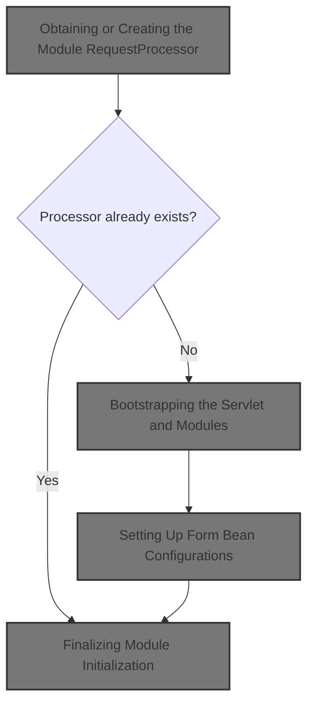
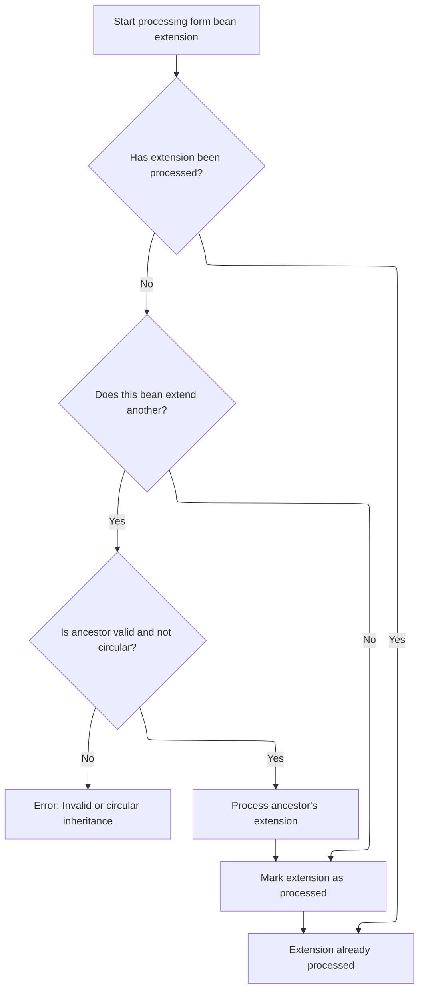

```mermaid
%%{init: {"flowchart": {"defaultRenderer": "elk"}} }%%
flowchart TD
    node1["Check for existing processor for module"] --> node2{"Processor already exists?"}
    click node1 openCode "core/src/main/java/org/apache/struts/action/ActionServlet.java:610:610"
    node2 -->|"Yes"| node6["Return processor"]
    click node2 openCode "core/src/main/java/org/apache/struts/action/ActionServlet.java:612:612"
    click node6 openCode "core/src/main/java/org/apache/struts/action/ActionServlet.java:641:642"
    node2 -->|"No"| node3["Create processor from module config"]
    click node3 openCode "core/src/main/java/org/apache/struts/action/ActionServlet.java:614:616"
    node3 --> node4{"Is processor modern (Composable)?"}
    click node4 openCode "core/src/main/java/org/apache/struts/action/ActionServlet.java:628:628"
    node4 -->|"Yes"| node5["Initialize processor with servlet and module config"]
    click node5 openCode "core/src/main/java/org/apache/struts/action/ActionServlet.java:634:634"
    node4 -->|"No"| node7["Warn: Classic processor used"]
    click node7 openCode "core/src/main/java/org/apache/struts/action/ActionServlet.java:629:631"
    node7 --> node5
    node5 --> node8["Store processor for module"]
    click node8 openCode "core/src/main/java/org/apache/struts/action/ActionServlet.java:638:638"
    node8 --> node6["Return processor"]
    click node6 openCode "core/src/main/java/org/apache/struts/action/ActionServlet.java:641:642"

classDef HeadingStyle fill:#777777,stroke:#333,stroke-width:2px;

%% Swimm:
%% %%{init: {"flowchart": {"defaultRenderer": "elk"}} }%%
%% flowchart TD
%%     node1["Check for existing processor for module"] --> node2{"Processor already exists?"}
%%     click node1 openCode "<SwmPath>[core/…/action/ActionServlet.java](core/src/main/java/org/apache/struts/action/ActionServlet.java)</SwmPath>:610:610"
%%     node2 -->|"Yes"| node6["Return processor"]
%%     click node2 openCode "<SwmPath>[core/…/action/ActionServlet.java](core/src/main/java/org/apache/struts/action/ActionServlet.java)</SwmPath>:612:612"
%%     click node6 openCode "<SwmPath>[core/…/action/ActionServlet.java](core/src/main/java/org/apache/struts/action/ActionServlet.java)</SwmPath>:641:642"
%%     node2 -->|"No"| node3["Create processor from module config"]
%%     click node3 openCode "<SwmPath>[core/…/action/ActionServlet.java](core/src/main/java/org/apache/struts/action/ActionServlet.java)</SwmPath>:614:616"
%%     node3 --> node4{"Is processor modern (Composable)?"}
%%     click node4 openCode "<SwmPath>[core/…/action/ActionServlet.java](core/src/main/java/org/apache/struts/action/ActionServlet.java)</SwmPath>:628:628"
%%     node4 -->|"Yes"| node5["Initialize processor with servlet and module config"]
%%     click node5 openCode "<SwmPath>[core/…/action/ActionServlet.java](core/src/main/java/org/apache/struts/action/ActionServlet.java)</SwmPath>:634:634"
%%     node4 -->|"No"| node7["Warn: Classic processor used"]
%%     click node7 openCode "<SwmPath>[core/…/action/ActionServlet.java](core/src/main/java/org/apache/struts/action/ActionServlet.java)</SwmPath>:629:631"
%%     node7 --> node5
%%     node5 --> node8["Store processor for module"]
%%     click node8 openCode "<SwmPath>[core/…/action/ActionServlet.java](core/src/main/java/org/apache/struts/action/ActionServlet.java)</SwmPath>:638:638"
%%     node8 --> node6["Return processor"]
%%     click node6 openCode "<SwmPath>[core/…/action/ActionServlet.java](core/src/main/java/org/apache/struts/action/ActionServlet.java)</SwmPath>:641:642"
%% 
%% classDef HeadingStyle fill:#777777,stroke:#333,stroke-width:2px;
```

This document describes how the system prepares a processor to handle requests for a specific module. When a request is received, the system ensures that a processor is available and that all module resources, including form beans and their inheritance, are properly initialized.



# Where is this flow used?

This flow is used multiple times in the codebase as represented in the following diagram:

```mermaid
graph TD;
      294cd284fa406b4fe4f160157c73b79eaa7835613a545efd883ce1f14dd1ca7e(core/…/action/ActionServlet.java::ActionServlet.process) --> 8021481ad2e61cbffbd4896e05edd9e89db84071d125277e9a801c0e7ae658c3(core/…/action/ActionServlet.java::ActionServlet.getRequestProcessor)

dde35d78060f1afca84b5e9dedc002fc37669b07142e9d5a1f656107cc900aa0(core/…/action/ActionServlet.java::ActionServlet.doGet) --> 294cd284fa406b4fe4f160157c73b79eaa7835613a545efd883ce1f14dd1ca7e(core/…/action/ActionServlet.java::ActionServlet.process)

ec52fb7c28a6afaae4fd5937965ca776c6c12441d8a10e0b92b387b05c5c5cf5(core/…/action/ActionServlet.java::ActionServlet.doPost) --> 294cd284fa406b4fe4f160157c73b79eaa7835613a545efd883ce1f14dd1ca7e(core/…/action/ActionServlet.java::ActionServlet.process)

f42b5fa1bea56d8ff671c6affb9d85867c0cd9c866b2e87d4e79e1160c4ffca1(tiles/…/tiles/RedeployableActionServlet.java::RedeployableActionServlet.getRequestProcessor) --> 8021481ad2e61cbffbd4896e05edd9e89db84071d125277e9a801c0e7ae658c3(core/…/action/ActionServlet.java::ActionServlet.getRequestProcessor)

dddf0d96694fd2e68165f2dd8b7e18080f18dd95805f51cb8f454b28c8cb9f2e(tiles/…/tiles/RedeployableActionServlet.java::RedeployableActionServlet.getRequestProcessor) --> 8021481ad2e61cbffbd4896e05edd9e89db84071d125277e9a801c0e7ae658c3(core/…/action/ActionServlet.java::ActionServlet.getRequestProcessor)


classDef mainFlowStyle color:#000000,fill:#7CB9F4
classDef rootsStyle color:#000000,fill:#00FFF4
classDef Style1 color:#000000,fill:#00FFAA
classDef Style2 color:#000000,fill:#FFFF00
classDef Style3 color:#000000,fill:#AA7CB9

%% Swimm:
%% graph TD;
%%       294cd284fa406b4fe4f160157c73b79eaa7835613a545efd883ce1f14dd1ca7e(<SwmPath>[core/…/action/ActionServlet.java](core/src/main/java/org/apache/struts/action/ActionServlet.java)</SwmPath>::ActionServlet.process) --> 8021481ad2e61cbffbd4896e05edd9e89db84071d125277e9a801c0e7ae658c3(<SwmPath>[core/…/action/ActionServlet.java](core/src/main/java/org/apache/struts/action/ActionServlet.java)</SwmPath>::ActionServlet.getRequestProcessor)
%% 
%% dde35d78060f1afca84b5e9dedc002fc37669b07142e9d5a1f656107cc900aa0(<SwmPath>[core/…/action/ActionServlet.java](core/src/main/java/org/apache/struts/action/ActionServlet.java)</SwmPath>::ActionServlet.doGet) --> 294cd284fa406b4fe4f160157c73b79eaa7835613a545efd883ce1f14dd1ca7e(<SwmPath>[core/…/action/ActionServlet.java](core/src/main/java/org/apache/struts/action/ActionServlet.java)</SwmPath>::ActionServlet.process)
%% 
%% ec52fb7c28a6afaae4fd5937965ca776c6c12441d8a10e0b92b387b05c5c5cf5(<SwmPath>[core/…/action/ActionServlet.java](core/src/main/java/org/apache/struts/action/ActionServlet.java)</SwmPath>::ActionServlet.doPost) --> 294cd284fa406b4fe4f160157c73b79eaa7835613a545efd883ce1f14dd1ca7e(<SwmPath>[core/…/action/ActionServlet.java](core/src/main/java/org/apache/struts/action/ActionServlet.java)</SwmPath>::ActionServlet.process)
%% 
%% f42b5fa1bea56d8ff671c6affb9d85867c0cd9c866b2e87d4e79e1160c4ffca1(<SwmPath>[tiles/…/tiles/RedeployableActionServlet.java](tiles/src/main/java/org/apache/struts/tiles/RedeployableActionServlet.java)</SwmPath>::RedeployableActionServlet.getRequestProcessor) --> 8021481ad2e61cbffbd4896e05edd9e89db84071d125277e9a801c0e7ae658c3(<SwmPath>[core/…/action/ActionServlet.java](core/src/main/java/org/apache/struts/action/ActionServlet.java)</SwmPath>::ActionServlet.getRequestProcessor)
%% 
%% dddf0d96694fd2e68165f2dd8b7e18080f18dd95805f51cb8f454b28c8cb9f2e(<SwmPath>[tiles/…/tiles/RedeployableActionServlet.java](tiles/src/main/java/org/apache/struts/tiles/RedeployableActionServlet.java)</SwmPath>::RedeployableActionServlet.getRequestProcessor) --> 8021481ad2e61cbffbd4896e05edd9e89db84071d125277e9a801c0e7ae658c3(<SwmPath>[core/…/action/ActionServlet.java](core/src/main/java/org/apache/struts/action/ActionServlet.java)</SwmPath>::ActionServlet.getRequestProcessor)
%% 
%% 
%% classDef mainFlowStyle color:#000000,fill:#7CB9F4
%% classDef rootsStyle color:#000000,fill:#00FFF4
%% classDef Style1 color:#000000,fill:#00FFAA
%% classDef Style2 color:#000000,fill:#FFFF00
%% classDef Style3 color:#000000,fill:#AA7CB9
```



# Obtaining or Creating the Module <SwmToken path="core/src/main/java/org/apache/struts/action/ActionServlet.java" pos="608:5:5" line-data="    protected synchronized RequestProcessor getRequestProcessor(">`RequestProcessor`</SwmToken>



<SwmSnippet path="/core/src/main/java/org/apache/struts/action/ActionServlet.java" line="608">

---

<SwmToken path="core/src/main/java/org/apache/struts/action/ActionServlet.java" pos="608:7:7" line-data="    protected synchronized RequestProcessor getRequestProcessor(">`getRequestProcessor`</SwmToken> kicks off by checking if there's already a <SwmToken path="core/src/main/java/org/apache/struts/action/ActionServlet.java" pos="608:5:5" line-data="    protected synchronized RequestProcessor getRequestProcessor(">`RequestProcessor`</SwmToken> for the given module. If not, it creates one, initializes it, and stashes it in the servlet context using a module-specific key. It also logs a warning if you're still using the old-school <SwmToken path="core/src/main/java/org/apache/struts/action/ActionServlet.java" pos="608:5:5" line-data="    protected synchronized RequestProcessor getRequestProcessor(">`RequestProcessor`</SwmToken> instead of the newer <SwmToken path="core/src/main/java/org/apache/struts/action/ActionServlet.java" pos="628:10:10" line-data="            if (!(processor instanceof ComposableRequestProcessor)) {">`ComposableRequestProcessor`</SwmToken>. After this, we need to make sure the servlet (and its modules) are initialized, which is why `ActionServlet.init` comes next—otherwise, there might not be any module config or controller class to work with.

```java
    protected synchronized RequestProcessor getRequestProcessor(
        ModuleConfig config) throws ServletException {
        RequestProcessor processor = this.getProcessorForModule(config);

        if (processor == null) {
            try {
                processor =
                    (RequestProcessor) RequestUtils.applicationInstance(config.getControllerConfig()
                                                                              .getProcessorClass());
            } catch (Exception e) {
            	UnavailableException e2 = new UnavailableException(
                    "Cannot initialize RequestProcessor of class "
                    + config.getControllerConfig().getProcessorClass());
                e2.initCause(e);
                throw e2;
            }
            
            // Emit a warning to the log if the classic RequestProcessor is 
            // being used without composition. Hopefully developers will 
            // heed this message and make the upgrade.
            if (!(processor instanceof ComposableRequestProcessor)) {
                log.warn("Use of the classic RequestProcessor is not recommended. " +
                        "Please upgrade to the ComposableRequestProcessor to " +
                        "receive the advantage of modern enhancements and fixes.");
            }

            processor.init(this, config);

            String key = Globals.REQUEST_PROCESSOR_KEY + config.getPrefix();

            getServletContext().setAttribute(key, processor);
        }

        return (processor);
    }
```

---

</SwmSnippet>

# Bootstrapping the Servlet and Modules

<SwmSnippet path="/core/src/main/java/org/apache/struts/action/ActionServlet.java" line="339">

---

In <SwmToken path="core/src/main/java/org/apache/struts/action/ActionServlet.java" pos="339:5:5" line-data="    public void init() throws ServletException {">`init`</SwmToken>, the servlet sets up its internal state, initializes itself, and then loops through each module to set up their configs. It calls <SwmToken path="core/src/main/java/org/apache/struts/action/ActionServlet.java" pos="360:1:1" line-data="            initModuleFormBeans(moduleConfig);">`initModuleFormBeans`</SwmToken> early because form beans might be referenced by actions and other configs that get initialized right after. Without this, you'd risk referencing beans that aren't set up yet.

```java
    public void init() throws ServletException {
        final String configPrefix = "config/";
        final int configPrefixLength = configPrefix.length() - 1;

        // Wraps the entire initialization in a try/catch to better handle
        // unexpected exceptions and errors to provide better feedback
        // to the developer
        try {
            initInternal();
            initOther();
            initServlet();
            initChain();

            getServletContext().setAttribute(Globals.ACTION_SERVLET_KEY, this);
            initModuleConfigFactory();

            // Initialize modules as needed
            ModuleConfig moduleConfig = initModuleConfig("", config);

            initModuleMessageResources(moduleConfig);
            initModulePlugIns(moduleConfig);
            initModuleFormBeans(moduleConfig);
            initModuleForwards(moduleConfig);
            initModuleExceptionConfigs(moduleConfig);
            initModuleActions(moduleConfig);
            postProcessConfig(moduleConfig);
            moduleConfig.freeze();

            Enumeration names = getServletConfig().getInitParameterNames();

            while (names.hasMoreElements()) {
                String name = (String) names.nextElement();

                if (!name.startsWith(configPrefix)) {
                    continue;
                }

                String prefix = name.substring(configPrefixLength);

                moduleConfig =
                    initModuleConfig(prefix,
                        getServletConfig().getInitParameter(name));
                initModuleMessageResources(moduleConfig);
                initModulePlugIns(moduleConfig);
                initModuleFormBeans(moduleConfig);
                initModuleForwards(moduleConfig);
                initModuleExceptionConfigs(moduleConfig);
                initModuleActions(moduleConfig);
                postProcessConfig(moduleConfig);
                moduleConfig.freeze();
            }

```

---

</SwmSnippet>

## Setting Up Form Bean Configurations

<SwmSnippet path="/core/src/main/java/org/apache/struts/action/ActionServlet.java" line="914">

---

In <SwmToken path="core/src/main/java/org/apache/struts/action/ActionServlet.java" pos="914:5:5" line-data="    protected void initModuleFormBeans(ModuleConfig config)">`initModuleFormBeans`</SwmToken>, we loop through all form beans for the module and handle their extension logic. We call <SwmToken path="core/src/main/java/org/apache/struts/action/ActionServlet.java" pos="928:1:1" line-data="            processFormBeanExtension(beanConfig, config);">`processFormBeanExtension`</SwmToken> for each one to make sure any inheritance is resolved, so beans that extend others get their properties set up correctly.

```java
    protected void initModuleFormBeans(ModuleConfig config)
        throws ServletException {
        if (log.isDebugEnabled()) {
            log.debug("Initializing module path '" + config.getPrefix()
                + "' form beans");
        }

        // Process form bean extensions.
        FormBeanConfig[] formBeans = config.findFormBeanConfigs();

        for (int i = 0; i < formBeans.length; i++) {
            FormBeanConfig beanConfig = formBeans[i];

            postProcessConfig(beanConfig, config, true);
            processFormBeanExtension(beanConfig, config);
            postProcessConfig(beanConfig, config, false);
        }

```

---

</SwmSnippet>

### Resolving Form Bean Inheritance



<SwmSnippet path="/core/src/main/java/org/apache/struts/action/ActionServlet.java" line="968">

---

<SwmToken path="core/src/main/java/org/apache/struts/action/ActionServlet.java" pos="968:5:5" line-data="    protected void processFormBeanExtension(FormBeanConfig beanConfig,">`processFormBeanExtension`</SwmToken> checks if the bean's inheritance has already been handled. If not, it processes the bean's class and then calls <SwmToken path="core/src/main/java/org/apache/struts/action/ActionServlet.java" pos="981:3:3" line-data="                beanConfig.processExtends(moduleConfig);">`processExtends`</SwmToken> to resolve any inheritance. This is where we jump into the actual inheritance logic in <SwmToken path="core/src/main/java/org/apache/struts/action/ActionServlet.java" pos="968:7:7" line-data="    protected void processFormBeanExtension(FormBeanConfig beanConfig,">`FormBeanConfig`</SwmToken>.

```java
    protected void processFormBeanExtension(FormBeanConfig beanConfig,
        ModuleConfig moduleConfig)
        throws ServletException {
        try {
            if (!beanConfig.isExtensionProcessed()) {
                if (log.isDebugEnabled()) {
                    log.debug("Processing extensions for '"
                        + beanConfig.getName() + "'");
                }

                beanConfig =
                    processFormBeanConfigClass(beanConfig, moduleConfig);

                beanConfig.processExtends(moduleConfig);
            }
        } catch (ServletException e) {
            throw e;
        } catch (Exception e) {
            handleGeneralExtensionException("FormBeanConfig",
                beanConfig.getName(), e);
        }
    }
```

---

</SwmSnippet>

<SwmSnippet path="/core/src/main/java/org/apache/struts/config/FormBeanConfig.java" line="528">

---

<SwmToken path="core/src/main/java/org/apache/struts/config/FormBeanConfig.java" pos="528:5:5" line-data="    public void processExtends(ModuleConfig moduleConfig)">`processExtends`</SwmToken> in <SwmToken path="core/src/main/java/org/apache/struts/config/FormBeanConfig.java" pos="538:1:1" line-data="            FormBeanConfig baseConfig =">`FormBeanConfig`</SwmToken> handles the actual inheritance. It checks for frozen configs, finds the ancestor, prevents circular references, recursively processes the ancestor if needed, and copies over inherited properties. If the ancestor isn't found, it blows up with a <SwmToken path="core/src/main/java/org/apache/struts/config/FormBeanConfig.java" pos="542:5:5" line-data="                throw new NullPointerException(&quot;Unable to find &quot;">`NullPointerException`</SwmToken>.

```java
    public void processExtends(ModuleConfig moduleConfig)
        throws ClassNotFoundException, IllegalAccessException,
            InstantiationException, InvocationTargetException {
        if (configured) {
            throw new IllegalStateException("Configuration is frozen");
        }

        String ancestor = getExtends();

        if ((!extensionProcessed) && (ancestor != null)) {
            FormBeanConfig baseConfig =
                moduleConfig.findFormBeanConfig(ancestor);

            if (baseConfig == null) {
                throw new NullPointerException("Unable to find "
                    + "form bean '" + ancestor + "' to extend.");
            }

            // Check against circule inheritance and make sure the base config's
            //  own extends have been processed already
            if (checkCircularInheritance(moduleConfig)) {
                throw new IllegalArgumentException(
                    "Circular inheritance detected for form bean " + getName());
            }

            // Make sure the ancestor's own extension has been processed.
            if (!baseConfig.isExtensionProcessed()) {
                baseConfig.processExtends(moduleConfig);
            }

            // Copy values from the base config
            inheritFrom(baseConfig);
        }

        extensionProcessed = true;
    }
```

---

</SwmSnippet>

### Validating and Registering Form Beans

```mermaid
%%{init: {"flowchart": {"defaultRenderer": "elk"}} }%%
flowchart TD
    node1["Start module form bean initialization"]
    click node1 openCode "core/src/main/java/org/apache/struts/action/ActionServlet.java:932:958"
    subgraph loop1["For each form bean in the module"]
      node1 --> node2{"Is form bean type specified?"}
      click node2 openCode "core/src/main/java/org/apache/struts/action/ActionServlet.java:936:939"
      node2 -->|"No"| node3["Report missing form bean type"]
      click node3 openCode "core/src/main/java/org/apache/struts/action/ActionServlet.java:937:939"
      node2 -->|"Yes"| node4["Validate all properties"]
      click node4 openCode "core/src/main/java/org/apache/struts/action/ActionServlet.java:942:951"
      subgraph loop2["For each property in form bean"]
        node4 --> node5{"Is property type specified?"}
        click node5 openCode "core/src/main/java/org/apache/struts/action/ActionServlet.java:947:950"
        node5 -->|"No"| node6["Report missing property type"]
        click node6 openCode "core/src/main/java/org/apache/struts/action/ActionServlet.java:948:950"
        node5 -->|"Yes"| node4
        node6 --> node4
      end
      node4 --> node7{"Is form bean dynamic?"}
      click node7 openCode "core/src/main/java/org/apache/struts/action/ActionServlet.java:955:957"
      node7 -->|"Yes"| node8["Initialize dynamic form bean"]
      click node8 openCode "core/src/main/java/org/apache/struts/action/ActionServlet.java:956:957"
      node7 -->|"No"| node9["Continue"]
      node8 --> node9
    end
    node9 --> node10["All form beans initialized"]
    click node10 openCode "core/src/main/java/org/apache/struts/action/ActionServlet.java:958:958"
classDef HeadingStyle fill:#777777,stroke:#333,stroke-width:2px;

%% Swimm:
%% %%{init: {"flowchart": {"defaultRenderer": "elk"}} }%%
%% flowchart TD
%%     node1["Start module form bean initialization"]
%%     click node1 openCode "<SwmPath>[core/…/action/ActionServlet.java](core/src/main/java/org/apache/struts/action/ActionServlet.java)</SwmPath>:932:958"
%%     subgraph loop1["For each form bean in the module"]
%%       node1 --> node2{"Is form bean type specified?"}
%%       click node2 openCode "<SwmPath>[core/…/action/ActionServlet.java](core/src/main/java/org/apache/struts/action/ActionServlet.java)</SwmPath>:936:939"
%%       node2 -->|"No"| node3["Report missing form bean type"]
%%       click node3 openCode "<SwmPath>[core/…/action/ActionServlet.java](core/src/main/java/org/apache/struts/action/ActionServlet.java)</SwmPath>:937:939"
%%       node2 -->|"Yes"| node4["Validate all properties"]
%%       click node4 openCode "<SwmPath>[core/…/action/ActionServlet.java](core/src/main/java/org/apache/struts/action/ActionServlet.java)</SwmPath>:942:951"
%%       subgraph loop2["For each property in form bean"]
%%         node4 --> node5{"Is property type specified?"}
%%         click node5 openCode "<SwmPath>[core/…/action/ActionServlet.java](core/src/main/java/org/apache/struts/action/ActionServlet.java)</SwmPath>:947:950"
%%         node5 -->|"No"| node6["Report missing property type"]
%%         click node6 openCode "<SwmPath>[core/…/action/ActionServlet.java](core/src/main/java/org/apache/struts/action/ActionServlet.java)</SwmPath>:948:950"
%%         node5 -->|"Yes"| node4
%%         node6 --> node4
%%       end
%%       node4 --> node7{"Is form bean dynamic?"}
%%       click node7 openCode "<SwmPath>[core/…/action/ActionServlet.java](core/src/main/java/org/apache/struts/action/ActionServlet.java)</SwmPath>:955:957"
%%       node7 -->|"Yes"| node8["Initialize dynamic form bean"]
%%       click node8 openCode "<SwmPath>[core/…/action/ActionServlet.java](core/src/main/java/org/apache/struts/action/ActionServlet.java)</SwmPath>:956:957"
%%       node7 -->|"No"| node9["Continue"]
%%       node8 --> node9
%%     end
%%     node9 --> node10["All form beans initialized"]
%%     click node10 openCode "<SwmPath>[core/…/action/ActionServlet.java](core/src/main/java/org/apache/struts/action/ActionServlet.java)</SwmPath>:958:958"
%% classDef HeadingStyle fill:#777777,stroke:#333,stroke-width:2px;
```



<SwmSnippet path="/core/src/main/java/org/apache/struts/action/ActionServlet.java" line="932">

---

Back in <SwmToken path="core/src/main/java/org/apache/struts/action/ActionServlet.java" pos="360:1:1" line-data="            initModuleFormBeans(moduleConfig);">`initModuleFormBeans`</SwmToken>, after handling inheritance with <SwmToken path="core/src/main/java/org/apache/struts/action/ActionServlet.java" pos="928:1:1" line-data="            processFormBeanExtension(beanConfig, config);">`processFormBeanExtension`</SwmToken>, we validate that all form beans and their properties have the required types. For dynamic beans, we also trigger their class registration. This ensures everything is ready for use, with all inherited and direct properties in place.

```java
        for (int i = 0; i < formBeans.length; i++) {
            FormBeanConfig formBean = formBeans[i];

            // Verify that required fields are all present for the form config
            if (formBean.getType() == null) {
                handleValueRequiredException("type", formBean.getName(),
                    "form bean");
            }

            // ... and the property configs
            FormPropertyConfig[] fpcs = formBean.findFormPropertyConfigs();

            for (int j = 0; j < fpcs.length; j++) {
                FormPropertyConfig property = fpcs[j];

                if (property.getType() == null) {
                    handleValueRequiredException("type", property.getName(),
                        "form property");
                }
            }

            // Force creation and registration of DynaActionFormClass instances
            // for all dynamic form beans
            if (formBean.getDynamic()) {
                formBean.getDynaActionFormClass();
            }
        }
```

---

</SwmSnippet>

## Finalizing Module Initialization

<SwmSnippet path="/core/src/main/java/org/apache/struts/action/ActionServlet.java" line="391">

---

After coming back from <SwmToken path="core/src/main/java/org/apache/struts/action/ActionServlet.java" pos="360:1:1" line-data="            initModuleFormBeans(moduleConfig);">`initModuleFormBeans`</SwmToken>, <SwmToken path="core/src/main/java/org/apache/struts/action/ActionServlet.java" pos="339:5:5" line-data="    public void init() throws ServletException {">`init`</SwmToken> wraps up by setting up module prefixes and cleaning up config resources. If anything failed during initialization, the servlet is marked as unavailable and logs the error, so the app doesn't start in a broken state.

```java
            this.initModulePrefixes(this.getServletContext());

            this.destroyConfigDigester();
        } catch (UnavailableException ex) {
            throw ex;
        } catch (Throwable t) {
            // The follow error message is not retrieved from internal message
            // resources as they may not have been able to have been
            // initialized
            log.error("Unable to initialize Struts ActionServlet due to an "
                + "unexpected exception or error thrown, so marking the "
                + "servlet as unavailable.  Most likely, this is due to an "
                + "incorrect or missing library dependency.", t);
            UnavailableException t2 = new UnavailableException(t.getMessage());
            t2.initCause(t);
            throw t2;
        }
    }
```

---

</SwmSnippet>

&nbsp;

*This is an auto-generated document by Swimm 🌊 and has not yet been verified by a human*

<SwmMeta version="3.0.0" repo-id="Z2l0aHViJTNBJTNBc3RydXRzMSUzQSUzQVN3aW1tLURlbW8=" repo-name="struts1"><sup>Powered by [Swimm](https://app.swimm.io/)</sup></SwmMeta>
