This document describes how an option tag in a web form is prepared for rendering. Dynamic attributes are resolved and set, ensuring the tag is configured with the correct settings before it is rendered in the HTML output.

# Starting Option Tag Processing

<SwmSnippet path="/el/src/main/java/org/apache/strutsel/taglib/html/ELOptionTag.java" line="351">

---

In <SwmToken path="el/src/main/java/org/apache/strutsel/taglib/html/ELOptionTag.java" pos="351:5:5" line-data="    public int doStartTag() throws JspException {">`doStartTag`</SwmToken>, we kick off the tag processing by resolving all dynamic attribute expressions. Calling <SwmToken path="el/src/main/java/org/apache/strutsel/taglib/html/ELOptionTag.java" pos="352:1:1" line-data="        evaluateExpressions();">`evaluateExpressions`</SwmToken> here ensures that any EL-based values are set up before the rest of the tag logic runs.

```java
    public int doStartTag() throws JspException {
        evaluateExpressions();

```

---

</SwmSnippet>

## Evaluating Option Tag Attributes

<SwmSnippet path="/el/src/main/java/org/apache/strutsel/taglib/html/ELOptionTag.java" line="363">

---

In <SwmToken path="el/src/main/java/org/apache/strutsel/taglib/html/ELOptionTag.java" pos="363:5:5" line-data="    private void evaluateExpressions()">`evaluateExpressions`</SwmToken>, we resolve and set the 'bundle' attribute if present. This step determines which resource bundle to use for localization, so we call into the config logic to update it accordingly.

```java
    private void evaluateExpressions()
        throws JspException {
        String string = null;
        Boolean bool = null;

        if ((string =
                EvalHelper.evalString("bundle", getBundleExpr(), this,
                    pageContext)) != null) {
            setBundle(string);
        }

```

---

</SwmSnippet>

<SwmSnippet path="/core/src/main/java/org/apache/struts/config/ExceptionConfig.java" line="89">

---

SetBundle checks if configuration is frozen using the 'configured' flag. If so, it blocks changes by throwing an exception. This prevents runtime changes to localization settings after setup.

```java
    public void setBundle(String bundle) {
        if (configured) {
            throw new IllegalStateException("Configuration is frozen");
        }

        this.bundle = bundle;
    }
```

---

</SwmSnippet>

<SwmSnippet path="/el/src/main/java/org/apache/strutsel/taglib/html/ELOptionTag.java" line="374">

---

Back in `ELOptionTag.evaluateExpressions`, after updating the bundle, we continue resolving other attributes like 'dir', 'disabled', and 'filter'. Setting 'filter' here triggers logic in the <SwmToken path="faces/src/main/java/org/apache/struts/faces/component/WriteComponent.java" pos="35:4:4" line-data="public class WriteComponent extends UIOutput {">`WriteComponent`</SwmToken> to handle output escaping.

```java
        if ((string =
        		EvalHelper.evalString("dir", getDirExpr(), this,
        			pageContext)) != null) {
        	setDir(string);
        }
        
        if ((bool =
                EvalHelper.evalBoolean("disabled", getDisabledExpr(), this,
                    pageContext)) != null) {
            setDisabled(bool.booleanValue());
        }

        if ((bool =
                EvalHelper.evalBoolean("filter", getFilterExpr(), this,
                    pageContext)) != null) {
            setFilter(bool.booleanValue());
        }

```

---

</SwmSnippet>

<SwmSnippet path="/faces/src/main/java/org/apache/struts/faces/component/WriteComponent.java" line="114">

---

SetFilter updates both the 'filter' value and marks <SwmToken path="faces/src/main/java/org/apache/struts/faces/component/WriteComponent.java" pos="117:3:3" line-data="        this.filterSet = true;">`filterSet`</SwmToken> as true, so the system knows this attribute was explicitly set and not just left at its default.

```java
    public void setFilter(boolean filter) {

        this.filter = filter;
        this.filterSet = true;

    }
```

---

</SwmSnippet>

<SwmSnippet path="/el/src/main/java/org/apache/strutsel/taglib/html/ELOptionTag.java" line="392">

---

Back in `ELOptionTag.evaluateExpressions`, after handling 'filter', we finish resolving the rest of the tag's attributes (like lang, key, style, etc.), which all impact how the option is rendered in the final HTML.

```java
        if ((string =
            	EvalHelper.evalString("lang", getLangExpr(), this,
            		pageContext)) != null) {
        	setLang(string);
        }

        if ((string =
                EvalHelper.evalString("key", getKeyExpr(), this, pageContext)) != null) {
            setKey(string);
        }

        if ((string =
                EvalHelper.evalString("locale", getLocaleExpr(), this,
                    pageContext)) != null) {
            setLocale(string);
        }

        if ((string =
                EvalHelper.evalString("style", getStyleExpr(), this, pageContext)) != null) {
            setStyle(string);
        }

        if ((string =
                EvalHelper.evalString("styleClass", getStyleClassExpr(), this,
                    pageContext)) != null) {
            setStyleClass(string);
        }

        if ((string =
                EvalHelper.evalString("styleId", getStyleIdExpr(), this,
                    pageContext)) != null) {
            setStyleId(string);
        }

        if ((string =
                EvalHelper.evalString("title", getTitleExpr(), this,
                    pageContext)) != null) {
            setTitle(string);
        }

        if ((string =
                EvalHelper.evalString("titleKey", getTitleKeyExpr(), this,
                    pageContext)) != null) {
            setTitleKey(string);
        }

        if ((string =
                EvalHelper.evalString("value", getValueExpr(), this, pageContext)) != null) {
            setValue(string);
        }
    }
```

---

</SwmSnippet>

## Delegating to Parent Option Logic

<SwmSnippet path="/el/src/main/java/org/apache/strutsel/taglib/html/ELOptionTag.java" line="354">

---

Finally, in `ELOptionTag.doStartTag`, after resolving all expressions, we hand off to the parent implementation to handle the rest of the tag processing, which may trigger further tag logic like resource handling.

```java
        return (super.doStartTag());
    }
```

---

</SwmSnippet>

# Starting Resource Tag Processing

<SwmSnippet path="/el/src/main/java/org/apache/strutsel/taglib/bean/ELResourceTag.java" line="120">

---

DoStartTag in <SwmToken path="el/src/main/java/org/apache/strutsel/taglib/bean/ELResourceTag.java" pos="38:4:4" line-data="public class ELResourceTag extends ResourceTag {">`ELResourceTag`</SwmToken> resolves any dynamic attributes for the resource tag, then passes control to the parent for further processing.

```java
    public int doStartTag() throws JspException {
        evaluateExpressions();

        return (super.doStartTag());
    }
```

---

</SwmSnippet>

# Evaluating Resource Tag Attributes

```mermaid
%%{init: {"flowchart": {"defaultRenderer": "elk"}} }%%
flowchart TD
    node1["Evaluate 'id' expression"]
    click node1 openCode "el/src/main/java/org/apache/strutsel/taglib/bean/ELResourceTag.java:136:139"
    node1 --> node2{"Is 'id' value present?"}
    click node2 openCode "el/src/main/java/org/apache/strutsel/taglib/bean/ELResourceTag.java:136:139"
    node2 -->|"Yes"| node3["Set tag 'id'"]
    click node3 openCode "el/src/main/java/org/apache/strutsel/taglib/bean/ELResourceTag.java:138:139"
    node2 -->|"No"| node4
    node4["Evaluate 'input' expression"]
    click node4 openCode "el/src/main/java/org/apache/strutsel/taglib/bean/ELResourceTag.java:141:144"
    node4 --> node5{"Is 'input' value present?"}
    click node5 openCode "el/src/main/java/org/apache/strutsel/taglib/bean/ELResourceTag.java:141:144"
    node5 -->|"Yes"| node6["Set tag 'input'"]
    click node6 openCode "el/src/main/java/org/apache/strutsel/taglib/bean/ELResourceTag.java:143:144"
    node5 -->|"No"| node7
    node7["Evaluate 'name' expression"]
    click node7 openCode "el/src/main/java/org/apache/strutsel/taglib/bean/ELResourceTag.java:146:149"
    node7 --> node8{"Is 'name' value present?"}
    click node8 openCode "el/src/main/java/org/apache/strutsel/taglib/bean/ELResourceTag.java:146:149"
    node8 -->|"Yes"| node9["Set tag 'name'"]
    click node9 openCode "el/src/main/java/org/apache/strutsel/taglib/bean/ELResourceTag.java:148:149"
    node8 -->|"No"| node10["End"]
    node9 --> node10["End"]
    click node10 openCode "el/src/main/java/org/apache/strutsel/taglib/bean/ELResourceTag.java:150:150"

classDef HeadingStyle fill:#777777,stroke:#333,stroke-width:2px;

%% Swimm:
%% %%{init: {"flowchart": {"defaultRenderer": "elk"}} }%%
%% flowchart TD
%%     node1["Evaluate 'id' expression"]
%%     click node1 openCode "<SwmPath>[el/…/bean/ELResourceTag.java](el/src/main/java/org/apache/strutsel/taglib/bean/ELResourceTag.java)</SwmPath>:136:139"
%%     node1 --> node2{"Is 'id' value present?"}
%%     click node2 openCode "<SwmPath>[el/…/bean/ELResourceTag.java](el/src/main/java/org/apache/strutsel/taglib/bean/ELResourceTag.java)</SwmPath>:136:139"
%%     node2 -->|"Yes"| node3["Set tag 'id'"]
%%     click node3 openCode "<SwmPath>[el/…/bean/ELResourceTag.java](el/src/main/java/org/apache/strutsel/taglib/bean/ELResourceTag.java)</SwmPath>:138:139"
%%     node2 -->|"No"| node4
%%     node4["Evaluate 'input' expression"]
%%     click node4 openCode "<SwmPath>[el/…/bean/ELResourceTag.java](el/src/main/java/org/apache/strutsel/taglib/bean/ELResourceTag.java)</SwmPath>:141:144"
%%     node4 --> node5{"Is 'input' value present?"}
%%     click node5 openCode "<SwmPath>[el/…/bean/ELResourceTag.java](el/src/main/java/org/apache/strutsel/taglib/bean/ELResourceTag.java)</SwmPath>:141:144"
%%     node5 -->|"Yes"| node6["Set tag 'input'"]
%%     click node6 openCode "<SwmPath>[el/…/bean/ELResourceTag.java](el/src/main/java/org/apache/strutsel/taglib/bean/ELResourceTag.java)</SwmPath>:143:144"
%%     node5 -->|"No"| node7
%%     node7["Evaluate 'name' expression"]
%%     click node7 openCode "<SwmPath>[el/…/bean/ELResourceTag.java](el/src/main/java/org/apache/strutsel/taglib/bean/ELResourceTag.java)</SwmPath>:146:149"
%%     node7 --> node8{"Is 'name' value present?"}
%%     click node8 openCode "<SwmPath>[el/…/bean/ELResourceTag.java](el/src/main/java/org/apache/strutsel/taglib/bean/ELResourceTag.java)</SwmPath>:146:149"
%%     node8 -->|"Yes"| node9["Set tag 'name'"]
%%     click node9 openCode "<SwmPath>[el/…/bean/ELResourceTag.java](el/src/main/java/org/apache/strutsel/taglib/bean/ELResourceTag.java)</SwmPath>:148:149"
%%     node8 -->|"No"| node10["End"]
%%     node9 --> node10["End"]
%%     click node10 openCode "<SwmPath>[el/…/bean/ELResourceTag.java](el/src/main/java/org/apache/strutsel/taglib/bean/ELResourceTag.java)</SwmPath>:150:150"
%% 
%% classDef HeadingStyle fill:#777777,stroke:#333,stroke-width:2px;
```



<SwmSnippet path="/el/src/main/java/org/apache/strutsel/taglib/bean/ELResourceTag.java" line="132">

---

In <SwmToken path="el/src/main/java/org/apache/strutsel/taglib/bean/ELResourceTag.java" pos="132:5:5" line-data="    private void evaluateExpressions()">`evaluateExpressions`</SwmToken> for <SwmToken path="el/src/main/java/org/apache/strutsel/taglib/bean/ELResourceTag.java" pos="38:4:4" line-data="public class ELResourceTag extends ResourceTag {">`ELResourceTag`</SwmToken>, we resolve 'id' and 'input' attributes. Setting 'input' here updates the resource configuration, so we call into <SwmToken path="core/src/main/java/org/apache/struts/config/ExceptionConfig.java" pos="180:14:14" line-data="     * @param actionConfig The {@link ActionConfig} that this config is from,">`ActionConfig`</SwmToken> to apply it.

```java
    private void evaluateExpressions()
        throws JspException {
        String string = null;

        if ((string =
                EvalHelper.evalString("id", getIdExpr(), this, pageContext)) != null) {
            setId(string);
        }

        if ((string =
                EvalHelper.evalString("input", getInputExpr(), this, pageContext)) != null) {
            setInput(string);
        }

```

---

</SwmSnippet>

<SwmSnippet path="/core/src/main/java/org/apache/struts/config/ActionConfig.java" line="473">

---

SetInput blocks changes if configuration is frozen, using the 'configured' flag. This keeps resource settings stable after setup.

```java
    public void setInput(String input) {
        if (configured) {
            throw new IllegalStateException("Configuration is frozen");
        }

        this.input = input;
    }
```

---

</SwmSnippet>

<SwmSnippet path="/el/src/main/java/org/apache/strutsel/taglib/bean/ELResourceTag.java" line="146">

---

Back in `ELResourceTag.evaluateExpressions`, after updating the input, we finish by resolving the 'name' attribute, which is used for referencing the resource in the page context.

```java
        if ((string =
                EvalHelper.evalString("name", getNameExpr(), this, pageContext)) != null) {
            setName(string);
        }
    }
```

---

</SwmSnippet>

&nbsp;

*This is an auto-generated document by Swimm 🌊 and has not yet been verified by a human*

<SwmMeta version="3.0.0" repo-id="Z2l0aHViJTNBJTNBc3RydXRzMSUzQSUzQVN3aW1tLURlbW8=" repo-name="struts1"><sup>Powered by [Swimm](https://app.swimm.io/)</sup></SwmMeta>
