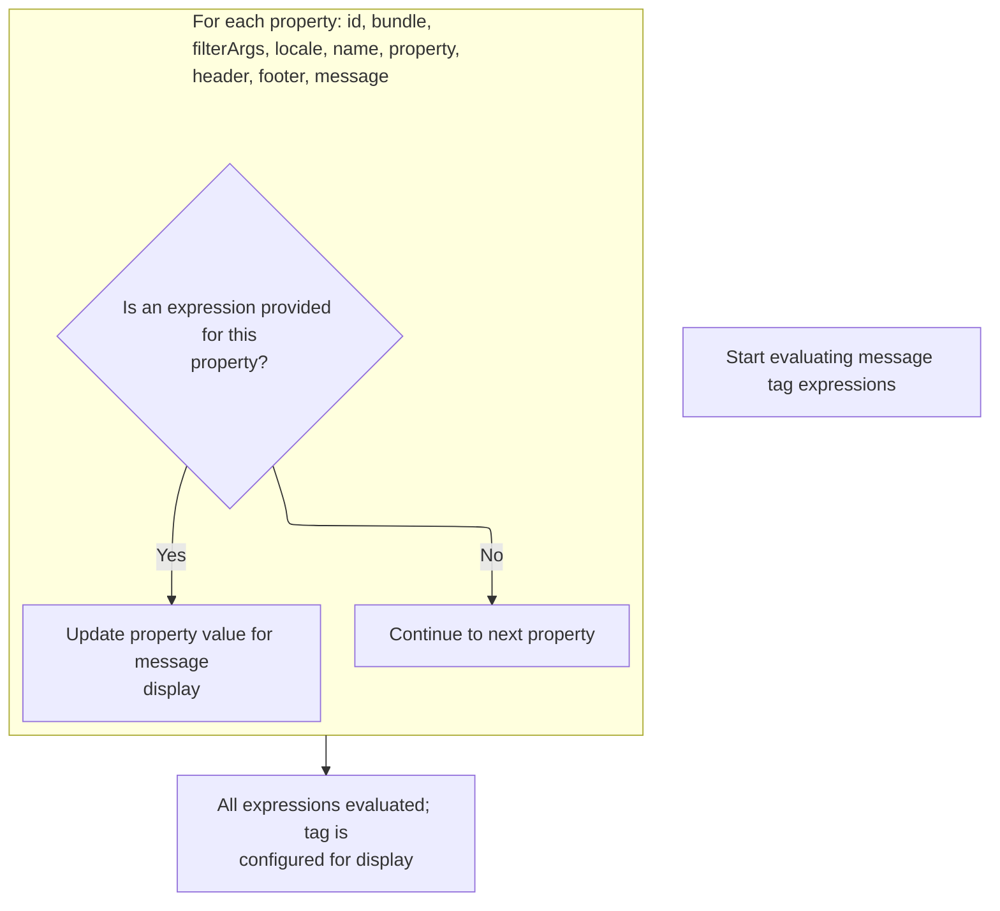

This document explains how tag attributes are evaluated and assigned their final values before being used for rendering or further processing. The flow ensures all attributes are resolved and ready for the next stage in tag handling.

# Evaluating Tag Expressions

<SwmSnippet path="/el/src/main/java/org/apache/strutsel/taglib/html/ELMessagesTag.java" line="261">

---

In <SwmToken path="el/src/main/java/org/apache/strutsel/taglib/html/ELMessagesTag.java" pos="261:5:5" line-data="    public int doStartTag() throws JspException {">`doStartTag`</SwmToken>, we kick off by evaluating any expressions tied to the tag's attributes. This sets up the tag with the right values before any further processing. We call <SwmToken path="el/src/main/java/org/apache/strutsel/taglib/html/ELMessagesTag.java" pos="262:1:1" line-data="        evaluateExpressions();">`evaluateExpressions`</SwmToken> next to make sure all dynamic attributes are resolved early.

```java
    public int doStartTag() throws JspException {
        evaluateExpressions();

```

---

</SwmSnippet>

## Resolving and Assigning Tag Attribute Values



<SwmSnippet path="/el/src/main/java/org/apache/strutsel/taglib/html/ELMessagesTag.java" line="273">

---

In <SwmToken path="el/src/main/java/org/apache/strutsel/taglib/html/ELMessagesTag.java" pos="273:5:5" line-data="    private void evaluateExpressions()">`evaluateExpressions`</SwmToken>, we resolve each tag attribute using <SwmToken path="el/src/main/java/org/apache/strutsel/taglib/html/ELMessagesTag.java" pos="279:1:1" line-data="                EvalHelper.evalString(&quot;id&quot;, getIdExpr(), this, pageContext)) != null) {">`EvalHelper`</SwmToken>. If the 'bundle' attribute is present, we set it, which triggers logic in <SwmToken path="core/src/main/java/org/apache/struts/config/ExceptionConfig.java" pos="34:4:4" line-data="public class ExceptionConfig extends BaseConfig {">`ExceptionConfig`</SwmToken> to handle the bundle assignment. We need to call <SwmToken path="core/src/main/java/org/apache/struts/config/ExceptionConfig.java" pos="34:4:4" line-data="public class ExceptionConfig extends BaseConfig {">`ExceptionConfig`</SwmToken> next because setting the bundle might involve state checks or constraints.

```java
    private void evaluateExpressions()
        throws JspException {
        String string = null;
        Boolean bool = null;

        if ((string =
                EvalHelper.evalString("id", getIdExpr(), this, pageContext)) != null) {
            setId(string);
        }

        if ((string =
                EvalHelper.evalString("bundle", getBundleExpr(), this,
                    pageContext)) != null) {
            setBundle(string);
        }

```

---

</SwmSnippet>

<SwmSnippet path="/core/src/main/java/org/apache/struts/config/ExceptionConfig.java" line="89">

---

<SwmToken path="core/src/main/java/org/apache/struts/config/ExceptionConfig.java" pos="89:5:5" line-data="    public void setBundle(String bundle) {">`setBundle`</SwmToken> checks if the configuration is frozen using the 'configured' flag. If it's frozen, it throws an exception and blocks changes. Otherwise, it just sets the bundle value. This immutability enforcement is specific to this repo.

```java
    public void setBundle(String bundle) {
        if (configured) {
            throw new IllegalStateException("Configuration is frozen");
        }

        this.bundle = bundle;
    }
```

---

</SwmSnippet>

<SwmSnippet path="/el/src/main/java/org/apache/strutsel/taglib/html/ELMessagesTag.java" line="289">

---

After returning from <SwmToken path="core/src/main/java/org/apache/struts/config/ExceptionConfig.java" pos="34:4:4" line-data="public class ExceptionConfig extends BaseConfig {">`ExceptionConfig`</SwmToken>, <SwmToken path="el/src/main/java/org/apache/strutsel/taglib/html/ELMessagesTag.java" pos="262:1:1" line-data="        evaluateExpressions();">`evaluateExpressions`</SwmToken> continues by resolving and assigning the remaining tag attributes. These assignments aren't affected by the bundle's configuration state and just set values as needed.

```java
        if ((bool =
                EvalHelper.evalBoolean("filterArgs", getFilterArgsExpr(), this,
                    pageContext)) != null) {
            setFilterArgs(bool.booleanValue());
        }

        if ((string =
                EvalHelper.evalString("locale", getLocaleExpr(), this,
                    pageContext)) != null) {
            setLocale(string);
        }

        if ((string =
                EvalHelper.evalString("name", getNameExpr(), this, pageContext)) != null) {
            setName(string);
        }

        if ((string =
                EvalHelper.evalString("property", getPropertyExpr(), this,
                    pageContext)) != null) {
            setProperty(string);
        }

        if ((string =
                EvalHelper.evalString("header", getHeaderExpr(), this,
                    pageContext)) != null) {
            setHeader(string);
        }

        if ((string =
                EvalHelper.evalString("footer", getFooterExpr(), this,
                    pageContext)) != null) {
            setFooter(string);
        }

        if ((string =
                EvalHelper.evalString("message", getMessageExpr(), this,
                    pageContext)) != null) {
            setMessage(string);
        }
    }
```

---

</SwmSnippet>

## Delegating to Superclass Tag Logic

<SwmSnippet path="/el/src/main/java/org/apache/strutsel/taglib/html/ELMessagesTag.java" line="264">

---

After finishing <SwmToken path="el/src/main/java/org/apache/strutsel/taglib/html/ELMessagesTag.java" pos="262:1:1" line-data="        evaluateExpressions();">`evaluateExpressions`</SwmToken>, <SwmToken path="el/src/main/java/org/apache/strutsel/taglib/html/ELMessagesTag.java" pos="264:6:6" line-data="        return (super.doStartTag());">`doStartTag`</SwmToken> hands off control to the superclass. This lets the base tag logic process the now-resolved attributes. Next, we move to <SwmToken path="el/src/main/java/org/apache/strutsel/taglib/bean/ELResourceTag.java" pos="38:4:4" line-data="public class ELResourceTag extends ResourceTag {">`ELResourceTag`</SwmToken> to handle resource-specific tag processing.

```java
        return (super.doStartTag());
    }
```

---

</SwmSnippet>

# Processing Resource Tag Expressions

<SwmSnippet path="/el/src/main/java/org/apache/strutsel/taglib/bean/ELResourceTag.java" line="120">

---

<SwmToken path="el/src/main/java/org/apache/strutsel/taglib/bean/ELResourceTag.java" pos="120:5:5" line-data="    public int doStartTag() throws JspException {">`doStartTag`</SwmToken> in <SwmToken path="el/src/main/java/org/apache/strutsel/taglib/bean/ELResourceTag.java" pos="38:4:4" line-data="public class ELResourceTag extends ResourceTag {">`ELResourceTag`</SwmToken> evaluates expressions for resource tag attributes and then passes control to the superclass. This keeps the tag logic consistent and lets the base class handle rendering or further processing.

```java
    public int doStartTag() throws JspException {
        evaluateExpressions();

        return (super.doStartTag());
    }
```

---

</SwmSnippet>

# Resolving Resource Tag Attribute Values

```mermaid
%%{init: {"flowchart": {"defaultRenderer": "elk"}} }%%
flowchart TD
    node1{"Is 'id' expression evaluated to a
value?"}
    click node1 openCode "el/src/main/java/org/apache/strutsel/taglib/bean/ELResourceTag.java:136:139"
    node1 -->|"Yes"| node2["Update tag id"]
    click node2 openCode "el/src/main/java/org/apache/strutsel/taglib/bean/ELResourceTag.java:138:138"
    node1 -->|"No"| node3
    node2 --> node3
    node3{"Is 'input' expression evaluated to a
value?"}
    click node3 openCode "el/src/main/java/org/apache/strutsel/taglib/bean/ELResourceTag.java:141:144"
    node3 -->|"Yes"| node4["Update tag input"]
    click node4 openCode "el/src/main/java/org/apache/strutsel/taglib/bean/ELResourceTag.java:143:143"
    node3 -->|"No"| node5
    node4 --> node5
    node5{"Is 'name' expression evaluated to a
value?"}
    click node5 openCode "el/src/main/java/org/apache/strutsel/taglib/bean/ELResourceTag.java:146:149"
    node5 -->|"Yes"| node6["Update tag name"]
    click node6 openCode "el/src/main/java/org/apache/strutsel/taglib/bean/ELResourceTag.java:148:148"
    node5 -->|"No"| node7["Done"]
    node6 --> node7
    click node7 openCode "el/src/main/java/org/apache/strutsel/taglib/bean/ELResourceTag.java:150:150"

classDef HeadingStyle fill:#777777,stroke:#333,stroke-width:2px;

%% Swimm:
%% %%{init: {"flowchart": {"defaultRenderer": "elk"}} }%%
%% flowchart TD
%%     node1{"Is 'id' expression evaluated to a
%% value?"}
%%     click node1 openCode "<SwmPath>[el/…/bean/ELResourceTag.java](el/src/main/java/org/apache/strutsel/taglib/bean/ELResourceTag.java)</SwmPath>:136:139"
%%     node1 -->|"Yes"| node2["Update tag id"]
%%     click node2 openCode "<SwmPath>[el/…/bean/ELResourceTag.java](el/src/main/java/org/apache/strutsel/taglib/bean/ELResourceTag.java)</SwmPath>:138:138"
%%     node1 -->|"No"| node3
%%     node2 --> node3
%%     node3{"Is 'input' expression evaluated to a
%% value?"}
%%     click node3 openCode "<SwmPath>[el/…/bean/ELResourceTag.java](el/src/main/java/org/apache/strutsel/taglib/bean/ELResourceTag.java)</SwmPath>:141:144"
%%     node3 -->|"Yes"| node4["Update tag input"]
%%     click node4 openCode "<SwmPath>[el/…/bean/ELResourceTag.java](el/src/main/java/org/apache/strutsel/taglib/bean/ELResourceTag.java)</SwmPath>:143:143"
%%     node3 -->|"No"| node5
%%     node4 --> node5
%%     node5{"Is 'name' expression evaluated to a
%% value?"}
%%     click node5 openCode "<SwmPath>[el/…/bean/ELResourceTag.java](el/src/main/java/org/apache/strutsel/taglib/bean/ELResourceTag.java)</SwmPath>:146:149"
%%     node5 -->|"Yes"| node6["Update tag name"]
%%     click node6 openCode "<SwmPath>[el/…/bean/ELResourceTag.java](el/src/main/java/org/apache/strutsel/taglib/bean/ELResourceTag.java)</SwmPath>:148:148"
%%     node5 -->|"No"| node7["Done"]
%%     node6 --> node7
%%     click node7 openCode "<SwmPath>[el/…/bean/ELResourceTag.java](el/src/main/java/org/apache/strutsel/taglib/bean/ELResourceTag.java)</SwmPath>:150:150"
%% 
%% classDef HeadingStyle fill:#777777,stroke:#333,stroke-width:2px;
```



<SwmSnippet path="/el/src/main/java/org/apache/strutsel/taglib/bean/ELResourceTag.java" line="132">

---

In <SwmToken path="el/src/main/java/org/apache/strutsel/taglib/bean/ELResourceTag.java" pos="132:5:5" line-data="    private void evaluateExpressions()">`evaluateExpressions`</SwmToken>, we resolve each resource tag attribute. When 'input' is present, we set it, which triggers <SwmToken path="core/src/main/java/org/apache/struts/config/ExceptionConfig.java" pos="180:14:14" line-data="     * @param actionConfig The {@link ActionConfig} that this config is from,">`ActionConfig`</SwmToken> to handle assignment and enforce immutability if configuration is frozen. We call <SwmToken path="core/src/main/java/org/apache/struts/config/ExceptionConfig.java" pos="180:14:14" line-data="     * @param actionConfig The {@link ActionConfig} that this config is from,">`ActionConfig`</SwmToken> next to actually set the value and check constraints.

```java
    private void evaluateExpressions()
        throws JspException {
        String string = null;

        if ((string =
                EvalHelper.evalString("id", getIdExpr(), this, pageContext)) != null) {
            setId(string);
        }

        if ((string =
                EvalHelper.evalString("input", getInputExpr(), this, pageContext)) != null) {
            setInput(string);
        }

```

---

</SwmSnippet>

<SwmSnippet path="/core/src/main/java/org/apache/struts/config/ActionConfig.java" line="473">

---

<SwmToken path="core/src/main/java/org/apache/struts/config/ActionConfig.java" pos="473:5:5" line-data="    public void setInput(String input) {">`setInput`</SwmToken> checks if configuration is frozen before assigning the input value. If it's frozen, it throws an exception; otherwise, it sets the value. This pattern enforces immutability after setup.

```java
    public void setInput(String input) {
        if (configured) {
            throw new IllegalStateException("Configuration is frozen");
        }

        this.input = input;
    }
```

---

</SwmSnippet>

<SwmSnippet path="/el/src/main/java/org/apache/strutsel/taglib/bean/ELResourceTag.java" line="146">

---

After returning from <SwmToken path="core/src/main/java/org/apache/struts/config/ExceptionConfig.java" pos="180:14:14" line-data="     * @param actionConfig The {@link ActionConfig} that this config is from,">`ActionConfig`</SwmToken>, <SwmToken path="el/src/main/java/org/apache/strutsel/taglib/html/ELMessagesTag.java" pos="262:1:1" line-data="        evaluateExpressions();">`evaluateExpressions`</SwmToken> in <SwmToken path="el/src/main/java/org/apache/strutsel/taglib/bean/ELResourceTag.java" pos="38:4:4" line-data="public class ELResourceTag extends ResourceTag {">`ELResourceTag`</SwmToken> continues by resolving and assigning the remaining attributes. These are just set directly, unaffected by the configuration state.

```java
        if ((string =
                EvalHelper.evalString("name", getNameExpr(), this, pageContext)) != null) {
            setName(string);
        }
    }
```

---

</SwmSnippet>

&nbsp;

*This is an auto-generated document by Swimm 🌊 and has not yet been verified by a human*

<SwmMeta version="3.0.0" repo-id="Z2l0aHViJTNBJTNBc3RydXRzMSUzQSUzQVN3aW1tLURlbW8=" repo-name="struts1"><sup>Powered by [Swimm](https://app.swimm.io/)</sup></SwmMeta>
