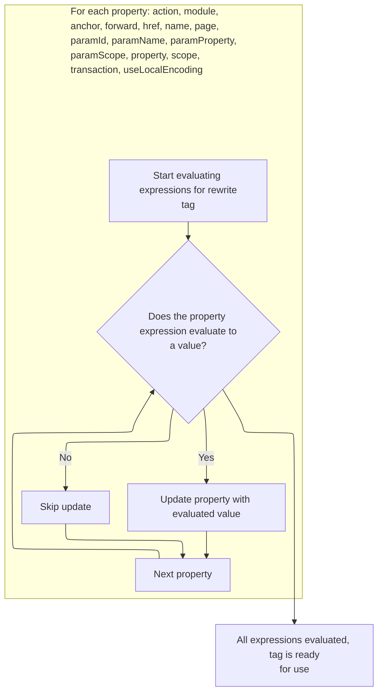
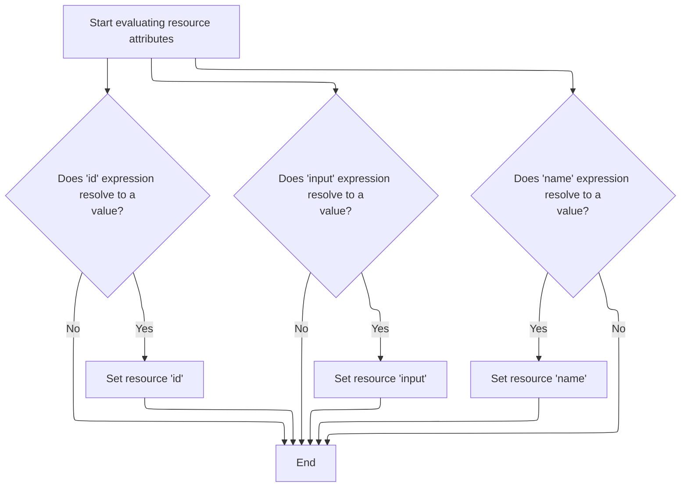

This document describes how tag attributes are prepared for use by evaluating expressions and enforcing configuration immutability. As part of the tag processing system, this flow ensures that all dynamic values are resolved and configuration rules are enforced before the tag is processed further.

# Starting tag processing and expression evaluation

<SwmSnippet path="/el/src/main/java/org/apache/strutsel/taglib/html/ELRewriteTag.java" line="395">

---

In <SwmToken path="el/src/main/java/org/apache/strutsel/taglib/html/ELRewriteTag.java" pos="395:5:5" line-data="    public int doStartTag() throws JspException {">`doStartTag`</SwmToken>, we kick off tag processing by evaluating any expressions tied to the tag's attributes. This step ensures all dynamic values are resolved before moving on to the rest of the tag logic, so the tag operates with the latest data.

```java
    public int doStartTag() throws JspException {
        evaluateExpressions();

```

---

</SwmSnippet>

## Resolving tag attribute values and enforcing configuration state



<SwmSnippet path="/el/src/main/java/org/apache/strutsel/taglib/html/ELRewriteTag.java" line="407">

---

In <SwmToken path="el/src/main/java/org/apache/strutsel/taglib/html/ELRewriteTag.java" pos="407:5:5" line-data="    private void evaluateExpressions()">`evaluateExpressions`</SwmToken>, we resolve each attribute's value using expression evaluation. Once the module expression is evaluated, we call the setter to update the module context, which is needed for downstream tag logic.

```java
    private void evaluateExpressions()
        throws JspException {
        String string = null;
        Boolean bool = null;

        if ((string =
                EvalHelper.evalString("action", getActionExpr(), this,
                    pageContext)) != null) {
            setAction(string);
        }

        if ((string =
                EvalHelper.evalString("module", getModuleExpr(), this,
                    pageContext)) != null) {
            setModule(string);
        }

```

---

</SwmSnippet>

<SwmSnippet path="/core/src/main/java/org/apache/struts/config/ForwardConfig.java" line="210">

---

SetModule enforces immutability by checking the 'configured' flag before updating the module value. If configuration is frozen, it throws an exception, preventing any changes and ensuring the module context stays consistent.

```java
    public void setModule(String module) {
        if (configured) {
            throw new IllegalStateException("Configuration is frozen");
        }

        this.module = module;
    }
```

---

</SwmSnippet>

<SwmSnippet path="/el/src/main/java/org/apache/strutsel/taglib/html/ELRewriteTag.java" line="424">

---

Back in <SwmToken path="el/src/main/java/org/apache/strutsel/taglib/html/ELRewriteTag.java" pos="396:1:1" line-data="        evaluateExpressions();">`evaluateExpressions`</SwmToken>, after updating the module, we keep resolving and setting other attributes. Next, we call the scope setter in <SwmToken path="core/src/main/java/org/apache/struts/config/ForwardConfig.java" pos="261:14:14" line-data="     * @param actionConfig The {@link ActionConfig} that this config is from,">`ActionConfig`</SwmToken>, which also checks for immutability

```java
        if ((string =
                EvalHelper.evalString("anchor", getAnchorExpr(), this,
                    pageContext)) != null) {
            setAnchor(string);
        }

        if ((string =
                EvalHelper.evalString("forward", getForwardExpr(), this,
                    pageContext)) != null) {
            setForward(string);
        }

        if ((string =
                EvalHelper.evalString("href", getHrefExpr(), this, pageContext)) != null) {
            setHref(string);
        }

        if ((string =
                EvalHelper.evalString("name", getNameExpr(), this, pageContext)) != null) {
            setName(string);
        }

        if ((string =
                EvalHelper.evalString("page", getPageExpr(), this, pageContext)) != null) {
            setPage(string);
        }

        if ((string =
                EvalHelper.evalString("paramId", getParamIdExpr(), this,
                    pageContext)) != null) {
            setParamId(string);
        }

        if ((string =
                EvalHelper.evalString("paramName", getParamNameExpr(), this,
                    pageContext)) != null) {
            setParamName(string);
        }

        if ((string =
                EvalHelper.evalString("paramProperty", getParamPropertyExpr(),
                    this, pageContext)) != null) {
            setParamProperty(string);
        }

        if ((string =
                EvalHelper.evalString("paramScope", getParamScopeExpr(), this,
                    pageContext)) != null) {
            setParamScope(string);
        }

        if ((string =
                EvalHelper.evalString("property", getPropertyExpr(), this,
                    pageContext)) != null) {
            setProperty(string);
        }

        if ((string =
                EvalHelper.evalString("scope", getScopeExpr(), this, pageContext)) != null) {
            setScope(string);
        }

```

---

</SwmSnippet>

<SwmSnippet path="/core/src/main/java/org/apache/struts/config/ActionConfig.java" line="652">

---

SetScope checks the 'configured' flag before updating the scope. If configuration is frozen, it throws an exception, locking the scope value and preventing runtime changes.

```java
    public void setScope(String scope) {
        if (configured) {
            throw new IllegalStateException("Configuration is frozen");
        }

        this.scope = scope;
    }
```

---

</SwmSnippet>

<SwmSnippet path="/el/src/main/java/org/apache/strutsel/taglib/html/ELRewriteTag.java" line="486">

---

Back in <SwmToken path="el/src/main/java/org/apache/strutsel/taglib/html/ELRewriteTag.java" pos="396:1:1" line-data="        evaluateExpressions();">`evaluateExpressions`</SwmToken>, after handling scope, we finish by evaluating boolean attributes like transaction and <SwmToken path="el/src/main/java/org/apache/strutsel/taglib/html/ELRewriteTag.java" pos="493:6:6" line-data="                EvalHelper.evalBoolean(&quot;useLocalEncoding&quot;,">`useLocalEncoding`</SwmToken>. If configuration is frozen, their setters will block changes, keeping the tag's state locked.

```java
        if ((bool =
                EvalHelper.evalBoolean("transaction", getTransactionExpr(),
                    this, pageContext)) != null) {
            setTransaction(bool.booleanValue());
        }

        if ((bool =
                EvalHelper.evalBoolean("useLocalEncoding",
                    getUseLocalEncodingExpr(), this, pageContext)) != null) {
            setUseLocalEncoding(bool.booleanValue());
        }
    }
```

---

</SwmSnippet>

## Completing tag processing and delegating to parent logic

<SwmSnippet path="/el/src/main/java/org/apache/strutsel/taglib/html/ELRewriteTag.java" line="398">

---

Back in <SwmToken path="el/src/main/java/org/apache/strutsel/taglib/html/ELRewriteTag.java" pos="398:6:6" line-data="        return (super.doStartTag());">`doStartTag`</SwmToken>, after evaluating expressions, we hand off to the parent tag logic. This step ensures any inherited processing is applied, prepping for the next tag in the flow, like <SwmToken path="el/src/main/java/org/apache/strutsel/taglib/bean/ELResourceTag.java" pos="38:4:4" line-data="public class ELResourceTag extends ResourceTag {">`ELResourceTag`</SwmToken>.

```java
        return (super.doStartTag());
    }
```

---

</SwmSnippet>

# Resource tag processing and expression resolution

<SwmSnippet path="/el/src/main/java/org/apache/strutsel/taglib/bean/ELResourceTag.java" line="120">

---

DoStartTag in <SwmToken path="el/src/main/java/org/apache/strutsel/taglib/bean/ELResourceTag.java" pos="38:4:4" line-data="public class ELResourceTag extends ResourceTag {">`ELResourceTag`</SwmToken> starts by resolving expressions for resource attributes, making sure any dynamic values are set before moving on to parent tag logic.

```java
    public int doStartTag() throws JspException {
        evaluateExpressions();

        return (super.doStartTag());
    }
```

---

</SwmSnippet>

# Resolving resource attributes and enforcing input immutability



<SwmSnippet path="/el/src/main/java/org/apache/strutsel/taglib/bean/ELResourceTag.java" line="132">

---

In <SwmToken path="el/src/main/java/org/apache/strutsel/taglib/bean/ELResourceTag.java" pos="132:5:5" line-data="    private void evaluateExpressions()">`evaluateExpressions`</SwmToken>, we resolve id and input values for the resource tag. After evaluating input, we call its setter, which checks for immutability before updating.

```java
    private void evaluateExpressions()
        throws JspException {
        String string = null;

        if ((string =
                EvalHelper.evalString("id", getIdExpr(), this, pageContext)) != null) {
            setId(string);
        }

        if ((string =
                EvalHelper.evalString("input", getInputExpr(), this, pageContext)) != null) {
            setInput(string);
        }

```

---

</SwmSnippet>

<SwmSnippet path="/core/src/main/java/org/apache/struts/config/ActionConfig.java" line="473">

---

SetInput checks the 'configured' flag before updating input. If configuration is frozen, it throws an exception, locking the input value and preventing changes.

```java
    public void setInput(String input) {
        if (configured) {
            throw new IllegalStateException("Configuration is frozen");
        }

        this.input = input;
    }
```

---

</SwmSnippet>

<SwmSnippet path="/el/src/main/java/org/apache/strutsel/taglib/bean/ELResourceTag.java" line="146">

---

Back in <SwmToken path="el/src/main/java/org/apache/strutsel/taglib/html/ELRewriteTag.java" pos="396:1:1" line-data="        evaluateExpressions();">`evaluateExpressions`</SwmToken> for <SwmToken path="el/src/main/java/org/apache/strutsel/taglib/bean/ELResourceTag.java" pos="38:4:4" line-data="public class ELResourceTag extends ResourceTag {">`ELResourceTag`</SwmToken>, after handling input immutability, we finish by resolving and setting the name attribute, which may or may not be locked depending on its setter.

```java
        if ((string =
                EvalHelper.evalString("name", getNameExpr(), this, pageContext)) != null) {
            setName(string);
        }
    }
```

---

</SwmSnippet>

&nbsp;

*This is an auto-generated document by Swimm 🌊 and has not yet been verified by a human*

<SwmMeta version="3.0.0" repo-id="Z2l0aHViJTNBJTNBc3RydXRzMSUzQSUzQVN3aW1tLURlbW8=" repo-name="struts1"><sup>Powered by [Swimm](https://app.swimm.io/)</sup></SwmMeta>
