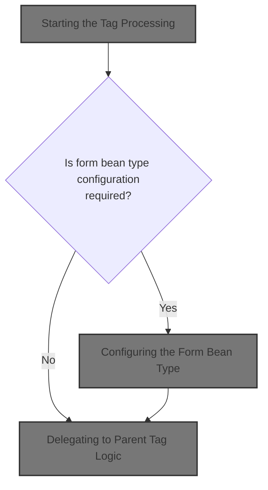
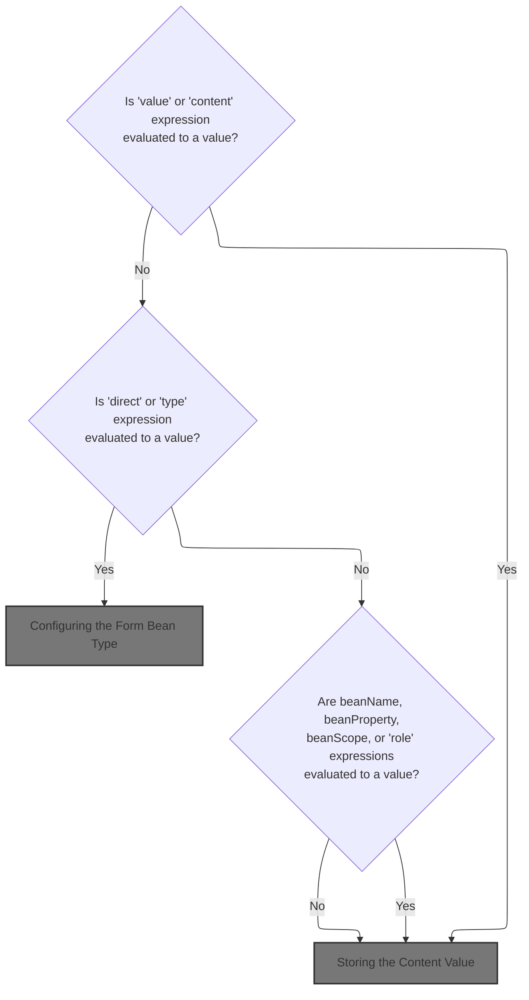
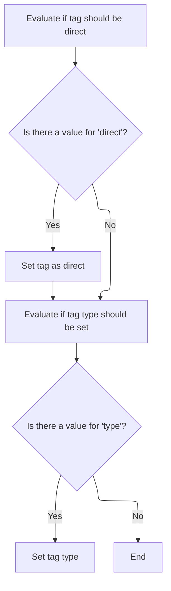
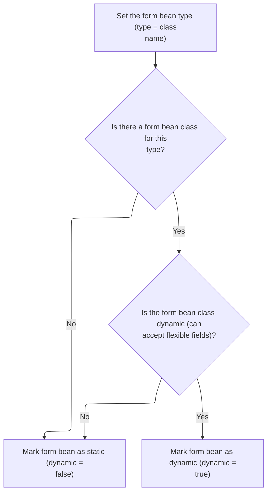

This document describes how tag attributes are prepared for use in JSP custom tags. When a tag is started, its attribute expressions are evaluated and their values are set, ensuring the tag operates with the correct data. The input is a set of tag attributes, and the output is a tag with all attributes set to their resolved values, ready for further logic.



# Starting the Tag Processing

<SwmSnippet path="/el/src/main/java/org/apache/strutsel/taglib/tiles/ELAddTag.java" line="235">

---

In <SwmToken path="el/src/main/java/org/apache/strutsel/taglib/tiles/ELAddTag.java" pos="235:5:5" line-data="    public int doStartTag() throws JspException {">`doStartTag`</SwmToken>, we start by resolving all EL expressions in the tag attributes with <SwmToken path="el/src/main/java/org/apache/strutsel/taglib/tiles/ELAddTag.java" pos="236:1:1" line-data="        evaluateExpressions();">`evaluateExpressions`</SwmToken>, so the tag works with actual values instead of raw expressions.

```java
    public int doStartTag() throws JspException {
        evaluateExpressions();

```

---

</SwmSnippet>

## Evaluating Attribute Expressions



<SwmSnippet path="/el/src/main/java/org/apache/strutsel/taglib/tiles/ELAddTag.java" line="247">

---

In <SwmToken path="el/src/main/java/org/apache/strutsel/taglib/tiles/ELAddTag.java" pos="247:5:5" line-data="    private void evaluateExpressions()">`evaluateExpressions`</SwmToken>, we go through each tag attribute and resolve its EL expression using <SwmToken path="el/src/main/java/org/apache/strutsel/taglib/tiles/ELAddTag.java" pos="252:1:3" line-data="                EvalHelper.evalString(&quot;value&quot;, getValueExpr(), this, pageContext)) != null) {">`EvalHelper.evalString`</SwmToken>, so the tag gets real values for each property.

```java
    private void evaluateExpressions()
        throws JspException {
        String string = null;

        if ((string =
                EvalHelper.evalString("value", getValueExpr(), this, pageContext)) != null) {
            setValue(string);
        }

        if ((string =
                EvalHelper.evalString("content", getContentExpr(), this,
                    pageContext)) != null) {
```

---

</SwmSnippet>

<SwmSnippet path="/el/src/main/java/org/apache/strutsel/taglib/utils/EvalHelper.java" line="64">

---

<SwmToken path="el/src/main/java/org/apache/strutsel/taglib/utils/EvalHelper.java" pos="64:7:7" line-data="    public static String evalString(String attrName, String attrValue,">`evalString`</SwmToken> checks if the input is null, and if not, uses the JSP/Struts expression evaluator to resolve the EL string in the tag and page context, returning the result as a String.

```java
    public static String evalString(String attrName, String attrValue,
        Tag tagObject, PageContext pageContext)
        throws JspException {
        Object result = null;

        if (attrValue != null) {
            result =
                ExpressionEvaluatorManager.evaluate(attrName, attrValue,
                    String.class, tagObject, pageContext);
        }

        return ((String) result);
    }
```

---

</SwmSnippet>

<SwmSnippet path="/el/src/main/java/org/apache/strutsel/taglib/tiles/ELAddTag.java" line="259">

---

Back in `ELAddTag.evaluateExpressions`, after evaluating the content expression, we call <SwmToken path="el/src/main/java/org/apache/strutsel/taglib/tiles/ELAddTag.java" pos="259:1:1" line-data="            setContent(string);">`setContent`</SwmToken> to store the resolved value for later use.

```java
            setContent(string);
        }

```

---

</SwmSnippet>

### Storing the Content Value

<SwmSnippet path="/tiles/src/main/java/org/apache/struts/tiles/xmlDefinition/XmlAttribute.java" line="166">

---

<SwmToken path="tiles/src/main/java/org/apache/struts/tiles/xmlDefinition/XmlAttribute.java" pos="166:5:5" line-data="    public void setContent(Object aValue) {">`setContent`</SwmToken> just passes the value to <SwmToken path="tiles/src/main/java/org/apache/struts/tiles/xmlDefinition/XmlAttribute.java" pos="167:1:1" line-data="        setValue(aValue);">`setValue`</SwmToken>, so all the logic for updating the attribute is handled in one place.

```java
    public void setContent(Object aValue) {
        setValue(aValue);
    }
```

---

</SwmSnippet>

<SwmSnippet path="/tiles/src/main/java/org/apache/struts/tiles/xmlDefinition/XmlAttribute.java" line="156">

---

<SwmToken path="tiles/src/main/java/org/apache/struts/tiles/xmlDefinition/XmlAttribute.java" pos="156:5:5" line-data="    public void setValue(Object aValue) {">`setValue`</SwmToken> updates the value and also clears <SwmToken path="tiles/src/main/java/org/apache/struts/tiles/xmlDefinition/XmlAttribute.java" pos="157:1:1" line-data="        realValue = null;">`realValue`</SwmToken>, which resets any cached or previously computed value for this attribute.

```java
    public void setValue(Object aValue) {
        realValue = null;
        value = aValue;
    }
```

---

</SwmSnippet>

### Evaluating More Tag Attributes



<SwmSnippet path="/el/src/main/java/org/apache/strutsel/taglib/tiles/ELAddTag.java" line="262">

---

Back in `ELAddTag.evaluateExpressions`, after setting content, we keep evaluating the next attributes (like direct and type) using <SwmToken path="el/src/main/java/org/apache/strutsel/taglib/tiles/ELAddTag.java" pos="263:1:3" line-data="                EvalHelper.evalString(&quot;direct&quot;, getDirectExpr(), this,">`EvalHelper.evalString`</SwmToken>, so each property gets its resolved value.

```java
        if ((string =
                EvalHelper.evalString("direct", getDirectExpr(), this,
                    pageContext)) != null) {
            setDirect(string);
        }

        if ((string =
                EvalHelper.evalString("type", getTypeExpr(), this, pageContext)) != null) {
```

---

</SwmSnippet>

<SwmSnippet path="/el/src/main/java/org/apache/strutsel/taglib/tiles/ELAddTag.java" line="270">

---

After evaluating the type attribute in `ELAddTag.evaluateExpressions`, we call <SwmToken path="el/src/main/java/org/apache/strutsel/taglib/tiles/ELAddTag.java" pos="270:1:1" line-data="            setType(string);">`setType`</SwmToken> to store the type and trigger logic that checks if the form bean is dynamic or not.

```java
            setType(string);
        }

```

---

</SwmSnippet>

### Configuring the Form Bean Type



<SwmSnippet path="/core/src/main/java/org/apache/struts/config/FormBeanConfig.java" line="161">

---

In <SwmToken path="core/src/main/java/org/apache/struts/config/FormBeanConfig.java" pos="161:5:5" line-data="    public void setType(String type) {">`setType`</SwmToken>, we store the type string, then check if the form bean class is a <SwmToken path="core/src/main/java/org/apache/struts/config/FormBeanConfig.java" pos="165:7:7" line-data="        Class dynaBeanClass = DynaActionForm.class;">`DynaActionForm`</SwmToken>. This sets the dynamic flag, which controls how the form bean is handled later.

```java
    public void setType(String type) {
        throwIfConfigured();
        this.type = type;

        Class dynaBeanClass = DynaActionForm.class;
        Class formBeanClass = formBeanClass();

```

---

</SwmSnippet>

<SwmSnippet path="/core/src/main/java/org/apache/struts/config/FormBeanConfig.java" line="603">

---

<SwmToken path="core/src/main/java/org/apache/struts/config/FormBeanConfig.java" pos="603:5:5" line-data="    protected Class formBeanClass() {">`formBeanClass`</SwmToken> loads the class named by <SwmToken path="core/src/main/java/org/apache/struts/config/FormBeanConfig.java" pos="612:8:10" line-data="            return (classLoader.loadClass(getType()));">`getType()`</SwmToken> using the thread context class loader if available, or falls back to the class's own loader. If the class can't be loaded, it returns null.

```java
    protected Class formBeanClass() {
        ClassLoader classLoader =
            Thread.currentThread().getContextClassLoader();

        if (classLoader == null) {
            classLoader = this.getClass().getClassLoader();
        }

        try {
            return (classLoader.loadClass(getType()));
        } catch (Exception e) {
            return (null);
        }
    }
```

---

</SwmSnippet>

<SwmSnippet path="/core/src/main/java/org/apache/struts/config/FormBeanConfig.java" line="168">

---

After <SwmToken path="el/src/main/java/org/apache/strutsel/taglib/tiles/ELAddTag.java" pos="270:1:1" line-data="            setType(string);">`setType`</SwmToken> and <SwmToken path="core/src/main/java/org/apache/struts/config/FormBeanConfig.java" pos="168:4:4" line-data="        if (formBeanClass != null) {">`formBeanClass`</SwmToken>, we check if the loaded class is a <SwmToken path="core/src/main/java/org/apache/struts/config/FormBeanConfig.java" pos="165:7:7" line-data="        Class dynaBeanClass = DynaActionForm.class;">`DynaActionForm`</SwmToken>. This sets the dynamic flag, which controls later behavior for form beans. If the class can't be loaded, dynamic is set to false.

```java
        if (formBeanClass != null) {
            if (dynaBeanClass.isAssignableFrom(formBeanClass)) {
                this.dynamic = true;
            } else {
                this.dynamic = false;
            }
        } else {
            this.dynamic = false;
        }
    }
```

---

</SwmSnippet>

### Final Attribute Evaluation

```mermaid
%%{init: {"flowchart": {"defaultRenderer": "elk"}} }%%
flowchart TD
  node1["Start evaluating tag properties"]
  click node1 openCode "el/src/main/java/org/apache/strutsel/taglib/tiles/ELAddTag.java:273:273"
  node1 --> node2{"Is bean name provided?"}
  click node2 openCode "el/src/main/java/org/apache/strutsel/taglib/tiles/ELAddTag.java:273:277"
  node2 -->|"Yes"| node3["Set bean name"]
  click node3 openCode "el/src/main/java/org/apache/strutsel/taglib/tiles/ELAddTag.java:276:277"
  node2 -->|"No"| node4
  node3 --> node4{"Is bean property provided?"}
  click node4 openCode "el/src/main/java/org/apache/strutsel/taglib/tiles/ELAddTag.java:279:283"
  node4 -->|"Yes"| node5["Set bean property"]
  click node5 openCode "el/src/main/java/org/apache/strutsel/taglib/tiles/ELAddTag.java:282:283"
  node4 -->|"No"| node6
  node5 --> node6{"Is bean scope provided?"}
  click node6 openCode "el/src/main/java/org/apache/strutsel/taglib/tiles/ELAddTag.java:285:289"
  node6 -->|"Yes"| node7["Set bean scope"]
  click node7 openCode "el/src/main/java/org/apache/strutsel/taglib/tiles/ELAddTag.java:288:289"
  node6 -->|"No"| node8
  node7 --> node8{"Is role provided?"}
  click node8 openCode "el/src/main/java/org/apache/strutsel/taglib/tiles/ELAddTag.java:291:294"
  node8 -->|"Yes"| node9["Set role"]
  click node9 openCode "el/src/main/java/org/apache/strutsel/taglib/tiles/ELAddTag.java:293:294"
  node8 -->|"No"| node10["All properties evaluated"]
  node9 --> node10
  click node10 openCode "el/src/main/java/org/apache/strutsel/taglib/tiles/ELAddTag.java:295:295"
classDef HeadingStyle fill:#777777,stroke:#333,stroke-width:2px;

%% Swimm:
%% %%{init: {"flowchart": {"defaultRenderer": "elk"}} }%%
%% flowchart TD
%%   node1["Start evaluating tag properties"]
%%   click node1 openCode "<SwmPath>[el/…/tiles/ELAddTag.java](el/src/main/java/org/apache/strutsel/taglib/tiles/ELAddTag.java)</SwmPath>:273:273"
%%   node1 --> node2{"Is bean name provided?"}
%%   click node2 openCode "<SwmPath>[el/…/tiles/ELAddTag.java](el/src/main/java/org/apache/strutsel/taglib/tiles/ELAddTag.java)</SwmPath>:273:277"
%%   node2 -->|"Yes"| node3["Set bean name"]
%%   click node3 openCode "<SwmPath>[el/…/tiles/ELAddTag.java](el/src/main/java/org/apache/strutsel/taglib/tiles/ELAddTag.java)</SwmPath>:276:277"
%%   node2 -->|"No"| node4
%%   node3 --> node4{"Is bean property provided?"}
%%   click node4 openCode "<SwmPath>[el/…/tiles/ELAddTag.java](el/src/main/java/org/apache/strutsel/taglib/tiles/ELAddTag.java)</SwmPath>:279:283"
%%   node4 -->|"Yes"| node5["Set bean property"]
%%   click node5 openCode "<SwmPath>[el/…/tiles/ELAddTag.java](el/src/main/java/org/apache/strutsel/taglib/tiles/ELAddTag.java)</SwmPath>:282:283"
%%   node4 -->|"No"| node6
%%   node5 --> node6{"Is bean scope provided?"}
%%   click node6 openCode "<SwmPath>[el/…/tiles/ELAddTag.java](el/src/main/java/org/apache/strutsel/taglib/tiles/ELAddTag.java)</SwmPath>:285:289"
%%   node6 -->|"Yes"| node7["Set bean scope"]
%%   click node7 openCode "<SwmPath>[el/…/tiles/ELAddTag.java](el/src/main/java/org/apache/strutsel/taglib/tiles/ELAddTag.java)</SwmPath>:288:289"
%%   node6 -->|"No"| node8
%%   node7 --> node8{"Is role provided?"}
%%   click node8 openCode "<SwmPath>[el/…/tiles/ELAddTag.java](el/src/main/java/org/apache/strutsel/taglib/tiles/ELAddTag.java)</SwmPath>:291:294"
%%   node8 -->|"Yes"| node9["Set role"]
%%   click node9 openCode "<SwmPath>[el/…/tiles/ELAddTag.java](el/src/main/java/org/apache/strutsel/taglib/tiles/ELAddTag.java)</SwmPath>:293:294"
%%   node8 -->|"No"| node10["All properties evaluated"]
%%   node9 --> node10
%%   click node10 openCode "<SwmPath>[el/…/tiles/ELAddTag.java](el/src/main/java/org/apache/strutsel/taglib/tiles/ELAddTag.java)</SwmPath>:295:295"
%% classDef HeadingStyle fill:#777777,stroke:#333,stroke-width:2px;
```



<SwmSnippet path="/el/src/main/java/org/apache/strutsel/taglib/tiles/ELAddTag.java" line="273">

---

Back in `ELAddTag.evaluateExpressions`, we finish up by evaluating the rest of the tag's attributes (<SwmToken path="el/src/main/java/org/apache/strutsel/taglib/tiles/ELAddTag.java" pos="274:6:6" line-data="                EvalHelper.evalString(&quot;beanName&quot;, getBeanNameExpr(), this,">`beanName`</SwmToken>, <SwmToken path="el/src/main/java/org/apache/strutsel/taglib/tiles/ELAddTag.java" pos="280:6:6" line-data="                EvalHelper.evalString(&quot;beanProperty&quot;, getBeanPropertyExpr(),">`beanProperty`</SwmToken>, <SwmToken path="el/src/main/java/org/apache/strutsel/taglib/tiles/ELAddTag.java" pos="286:6:6" line-data="                EvalHelper.evalString(&quot;beanScope&quot;, getBeanScopeExpr(), this,">`beanScope`</SwmToken>, role) with <SwmToken path="el/src/main/java/org/apache/strutsel/taglib/tiles/ELAddTag.java" pos="274:1:3" line-data="                EvalHelper.evalString(&quot;beanName&quot;, getBeanNameExpr(), this,">`EvalHelper.evalString`</SwmToken>, so everything is set before the tag runs.

```java
        if ((string =
                EvalHelper.evalString("beanName", getBeanNameExpr(), this,
                    pageContext)) != null) {
            setBeanName(string);
        }

        if ((string =
                EvalHelper.evalString("beanProperty", getBeanPropertyExpr(),
                    this, pageContext)) != null) {
            setBeanProperty(string);
        }

        if ((string =
                EvalHelper.evalString("beanScope", getBeanScopeExpr(), this,
                    pageContext)) != null) {
            setBeanScope(string);
        }

        if ((string =
                EvalHelper.evalString("role", getRoleExpr(), this, pageContext)) != null) {
            setRole(string);
        }
    }
```

---

</SwmSnippet>

## Delegating to Parent Tag Logic

<SwmSnippet path="/el/src/main/java/org/apache/strutsel/taglib/tiles/ELAddTag.java" line="238">

---

Back in `ELAddTag.doStartTag`, after all expressions are evaluated, we call the parent tag's <SwmToken path="el/src/main/java/org/apache/strutsel/taglib/tiles/ELAddTag.java" pos="238:6:6" line-data="        return (super.doStartTag());">`doStartTag`</SwmToken> to run any inherited logic.

```java
        return (super.doStartTag());
    }
```

---

</SwmSnippet>

# Resource Tag Start Processing

<SwmSnippet path="/el/src/main/java/org/apache/strutsel/taglib/bean/ELResourceTag.java" line="120">

---

<SwmToken path="el/src/main/java/org/apache/strutsel/taglib/bean/ELResourceTag.java" pos="120:5:5" line-data="    public int doStartTag() throws JspException {">`doStartTag`</SwmToken> in <SwmToken path="el/src/main/java/org/apache/strutsel/taglib/bean/ELResourceTag.java" pos="38:4:4" line-data="public class ELResourceTag extends ResourceTag {">`ELResourceTag`</SwmToken> resolves its own EL expressions, then calls the parent tag's logic to continue processing.

```java
    public int doStartTag() throws JspException {
        evaluateExpressions();

        return (super.doStartTag());
    }
```

---

</SwmSnippet>

# Evaluating Resource Tag Attributes

```mermaid
%%{init: {"flowchart": {"defaultRenderer": "elk"}} }%%
flowchart TD
    node1["Start evaluating resource attributes"] --> node2{"Evaluate 'id' expression: Value
present?"}
    click node1 openCode "el/src/main/java/org/apache/strutsel/taglib/bean/ELResourceTag.java:132:136"
    node2 -->|"Yes"| node3["Set resource id"]
    click node2 openCode "el/src/main/java/org/apache/strutsel/taglib/bean/ELResourceTag.java:136:139"
    node2 -->|"No"| node4{"Evaluate 'input' expression: Value
present?"}
    click node3 openCode "el/src/main/java/org/apache/strutsel/taglib/bean/ELResourceTag.java:138:139"
    node3 --> node4
    node4 -->|"Yes"| node5["Set resource input"]
    click node4 openCode "el/src/main/java/org/apache/strutsel/taglib/bean/ELResourceTag.java:141:144"
    node4 -->|"No"| node6{"Evaluate 'name' expression: Value
present?"}
    click node5 openCode "el/src/main/java/org/apache/strutsel/taglib/bean/ELResourceTag.java:143:144"
    node5 --> node6
    node6 -->|"Yes"| node7["Set resource name"]
    click node6 openCode "el/src/main/java/org/apache/strutsel/taglib/bean/ELResourceTag.java:146:149"
    node6 -->|"No"| node8["End of attribute evaluation"]
    click node7 openCode "el/src/main/java/org/apache/strutsel/taglib/bean/ELResourceTag.java:148:149"
    node7 --> node8
    click node8 openCode "el/src/main/java/org/apache/strutsel/taglib/bean/ELResourceTag.java:150:150"
classDef HeadingStyle fill:#777777,stroke:#333,stroke-width:2px;

%% Swimm:
%% %%{init: {"flowchart": {"defaultRenderer": "elk"}} }%%
%% flowchart TD
%%     node1["Start evaluating resource attributes"] --> node2{"Evaluate 'id' expression: Value
%% present?"}
%%     click node1 openCode "<SwmPath>[el/…/bean/ELResourceTag.java](el/src/main/java/org/apache/strutsel/taglib/bean/ELResourceTag.java)</SwmPath>:132:136"
%%     node2 -->|"Yes"| node3["Set resource id"]
%%     click node2 openCode "<SwmPath>[el/…/bean/ELResourceTag.java](el/src/main/java/org/apache/strutsel/taglib/bean/ELResourceTag.java)</SwmPath>:136:139"
%%     node2 -->|"No"| node4{"Evaluate 'input' expression: Value
%% present?"}
%%     click node3 openCode "<SwmPath>[el/…/bean/ELResourceTag.java](el/src/main/java/org/apache/strutsel/taglib/bean/ELResourceTag.java)</SwmPath>:138:139"
%%     node3 --> node4
%%     node4 -->|"Yes"| node5["Set resource input"]
%%     click node4 openCode "<SwmPath>[el/…/bean/ELResourceTag.java](el/src/main/java/org/apache/strutsel/taglib/bean/ELResourceTag.java)</SwmPath>:141:144"
%%     node4 -->|"No"| node6{"Evaluate 'name' expression: Value
%% present?"}
%%     click node5 openCode "<SwmPath>[el/…/bean/ELResourceTag.java](el/src/main/java/org/apache/strutsel/taglib/bean/ELResourceTag.java)</SwmPath>:143:144"
%%     node5 --> node6
%%     node6 -->|"Yes"| node7["Set resource name"]
%%     click node6 openCode "<SwmPath>[el/…/bean/ELResourceTag.java](el/src/main/java/org/apache/strutsel/taglib/bean/ELResourceTag.java)</SwmPath>:146:149"
%%     node6 -->|"No"| node8["End of attribute evaluation"]
%%     click node7 openCode "<SwmPath>[el/…/bean/ELResourceTag.java](el/src/main/java/org/apache/strutsel/taglib/bean/ELResourceTag.java)</SwmPath>:148:149"
%%     node7 --> node8
%%     click node8 openCode "<SwmPath>[el/…/bean/ELResourceTag.java](el/src/main/java/org/apache/strutsel/taglib/bean/ELResourceTag.java)</SwmPath>:150:150"
%% classDef HeadingStyle fill:#777777,stroke:#333,stroke-width:2px;
```



<SwmSnippet path="/el/src/main/java/org/apache/strutsel/taglib/bean/ELResourceTag.java" line="132">

---

In <SwmToken path="el/src/main/java/org/apache/strutsel/taglib/bean/ELResourceTag.java" pos="132:5:5" line-data="    private void evaluateExpressions()">`evaluateExpressions`</SwmToken> for <SwmToken path="el/src/main/java/org/apache/strutsel/taglib/bean/ELResourceTag.java" pos="38:4:4" line-data="public class ELResourceTag extends ResourceTag {">`ELResourceTag`</SwmToken>, we resolve the id and input attributes using <SwmToken path="el/src/main/java/org/apache/strutsel/taglib/bean/ELResourceTag.java" pos="137:1:3" line-data="                EvalHelper.evalString(&quot;id&quot;, getIdExpr(), this, pageContext)) != null) {">`EvalHelper.evalString`</SwmToken>, so the tag gets their actual values.

```java
    private void evaluateExpressions()
        throws JspException {
        String string = null;

        if ((string =
                EvalHelper.evalString("id", getIdExpr(), this, pageContext)) != null) {
            setId(string);
        }

        if ((string =
                EvalHelper.evalString("input", getInputExpr(), this, pageContext)) != null) {
```

---

</SwmSnippet>

<SwmSnippet path="/el/src/main/java/org/apache/strutsel/taglib/bean/ELResourceTag.java" line="143">

---

Back in `ELResourceTag.evaluateExpressions`, after evaluating the input attribute, we call <SwmToken path="el/src/main/java/org/apache/strutsel/taglib/bean/ELResourceTag.java" pos="143:1:1" line-data="            setInput(string);">`setInput`</SwmToken> to store it, but only if the configuration isn't frozen.

```java
            setInput(string);
        }

```

---

</SwmSnippet>

<SwmSnippet path="/core/src/main/java/org/apache/struts/config/ActionConfig.java" line="473">

---

<SwmToken path="core/src/main/java/org/apache/struts/config/ActionConfig.java" pos="473:5:5" line-data="    public void setInput(String input) {">`setInput`</SwmToken> sets the input value, but only if the configuration isn't frozen. If it is, it throws an exception to prevent changes.

```java
    public void setInput(String input) {
        if (configured) {
            throw new IllegalStateException("Configuration is frozen");
        }

        this.input = input;
    }
```

---

</SwmSnippet>

<SwmSnippet path="/el/src/main/java/org/apache/strutsel/taglib/bean/ELResourceTag.java" line="146">

---

Back in `ELResourceTag.evaluateExpressions`, after setting input, we keep evaluating the rest of the tag's attributes (like name) using <SwmToken path="el/src/main/java/org/apache/strutsel/taglib/bean/ELResourceTag.java" pos="147:1:3" line-data="                EvalHelper.evalString(&quot;name&quot;, getNameExpr(), this, pageContext)) != null) {">`EvalHelper.evalString`</SwmToken>, so everything is set before the tag runs.

```java
        if ((string =
                EvalHelper.evalString("name", getNameExpr(), this, pageContext)) != null) {
            setName(string);
        }
    }
```

---

</SwmSnippet>

&nbsp;

*This is an auto-generated document by Swimm 🌊 and has not yet been verified by a human*

<SwmMeta version="3.0.0" repo-id="Z2l0aHViJTNBJTNBc3RydXRzMSUzQSUzQVN3aW1tLURlbW8=" repo-name="struts1"><sup>Powered by [Swimm](https://app.swimm.io/)</sup></SwmMeta>
