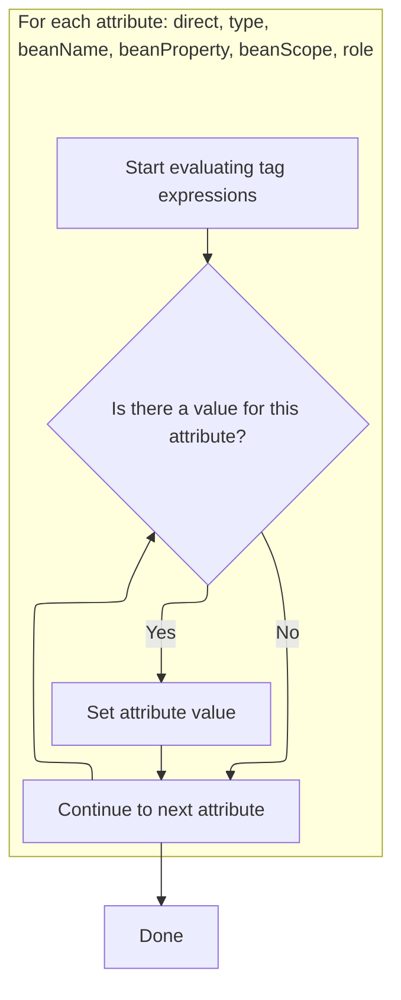

This document describes how tag attributes are prepared by evaluating dynamic expressions and setting up the tag for further processing in the tile or resource system. The flow ensures all relevant fields are evaluated and assigned, so the tag is ready for the next stage of processing.

# Triggering Expression Evaluation for Tile Put

<SwmSnippet path="/el/src/main/java/org/apache/strutsel/taglib/tiles/ELPutTag.java" line="295">

---

In <SwmToken path="el/src/main/java/org/apache/strutsel/taglib/tiles/ELPutTag.java" pos="295:5:5" line-data="    public int doStartTag() throws JspException {">`doStartTag`</SwmToken>, we kick off the flow by resolving any dynamic expressions tied to the tag. Calling <SwmToken path="el/src/main/java/org/apache/strutsel/taglib/tiles/ELPutTag.java" pos="296:1:1" line-data="        evaluateExpressions();">`evaluateExpressions`</SwmToken> here ensures all relevant fields are set up with their evaluated values before moving forward.

```java
    public int doStartTag() throws JspException {
        evaluateExpressions();

```

---

</SwmSnippet>

## Resolving Tag Attribute Expressions

<SwmSnippet path="/el/src/main/java/org/apache/strutsel/taglib/tiles/ELPutTag.java" line="307">

---

In <SwmToken path="el/src/main/java/org/apache/strutsel/taglib/tiles/ELPutTag.java" pos="307:5:5" line-data="    private void evaluateExpressions()">`evaluateExpressions`</SwmToken>, we resolve and assign values for name, value, and content attributes. We call <SwmToken path="el/src/main/java/org/apache/strutsel/taglib/tiles/ELPutTag.java" pos="324:1:1" line-data="            setContent(string);">`setContent`</SwmToken> next to handle any content-specific logic, making sure all tag fields are ready for downstream tile processing.

```java
    private void evaluateExpressions()
        throws JspException {
        String string = null;

        if ((string =
                EvalHelper.evalString("name", getNameExpr(), this, pageContext)) != null) {
            setName(string);
        }

        if ((string =
                EvalHelper.evalString("value", getValueExpr(), this, pageContext)) != null) {
            setValue(string);
        }

        if ((string =
                EvalHelper.evalString("content", getContentExpr(), this,
                    pageContext)) != null) {
            setContent(string);
        }

```

---

</SwmSnippet>

### Assigning Content and Resetting State

<SwmSnippet path="/tiles/src/main/java/org/apache/struts/tiles/xmlDefinition/XmlAttribute.java" line="166">

---

<SwmToken path="tiles/src/main/java/org/apache/struts/tiles/xmlDefinition/XmlAttribute.java" pos="166:5:5" line-data="    public void setContent(Object aValue) {">`setContent`</SwmToken> just passes the value to <SwmToken path="tiles/src/main/java/org/apache/struts/tiles/xmlDefinition/XmlAttribute.java" pos="167:1:1" line-data="        setValue(aValue);">`setValue`</SwmToken>, so content and value are treated the same internally. This keeps the logic simple and ensures any state resets happen consistently.

```java
    public void setContent(Object aValue) {
        setValue(aValue);
    }
```

---

</SwmSnippet>

<SwmSnippet path="/tiles/src/main/java/org/apache/struts/tiles/xmlDefinition/XmlAttribute.java" line="156">

---

<SwmToken path="tiles/src/main/java/org/apache/struts/tiles/xmlDefinition/XmlAttribute.java" pos="156:5:5" line-data="    public void setValue(Object aValue) {">`setValue`</SwmToken> updates the value and clears any cached state by setting <SwmToken path="tiles/src/main/java/org/apache/struts/tiles/xmlDefinition/XmlAttribute.java" pos="157:1:1" line-data="        realValue = null;">`realValue`</SwmToken> to null. This ensures that any future access gets the latest assigned value, not a stale computed one.

```java
    public void setValue(Object aValue) {
        realValue = null;
        value = aValue;
    }
```

---

</SwmSnippet>

### Resolving Direct and Type Attributes



<SwmSnippet path="/el/src/main/java/org/apache/strutsel/taglib/tiles/ELPutTag.java" line="327">

---

Back in `ELPutTag.evaluateExpressions`, after handling content, we resolve 'direct' and 'type'. Setting 'type' here leads to backend checks for dynamic behavior, prepping the tile for the right processing path.

```java
        if ((string =
                EvalHelper.evalString("direct", getDirectExpr(), this,
                    pageContext)) != null) {
            setDirect(string);
        }

        if ((string =
                EvalHelper.evalString("type", getTypeExpr(), this, pageContext)) != null) {
            setType(string);
        }

```

---

</SwmSnippet>

<SwmSnippet path="/core/src/main/java/org/apache/struts/config/FormBeanConfig.java" line="161">

---

<SwmToken path="core/src/main/java/org/apache/struts/config/FormBeanConfig.java" pos="161:5:5" line-data="    public void setType(String type) {">`setType`</SwmToken> updates the type and checks if the bean is dynamic by inspecting its class hierarchy. It also blocks changes if configuration is locked, so this step sets up dynamic behavior and enforces immutability.

```java
    public void setType(String type) {
        throwIfConfigured();
        this.type = type;

        Class dynaBeanClass = DynaActionForm.class;
        Class formBeanClass = formBeanClass();

        if (formBeanClass != null) {
            if (dynaBeanClass.isAssignableFrom(formBeanClass)) {
                this.dynamic = true;
            } else {
                this.dynamic = false;
            }
        } else {
            this.dynamic = false;
        }
    }
```

---

</SwmSnippet>

<SwmSnippet path="/el/src/main/java/org/apache/strutsel/taglib/tiles/ELPutTag.java" line="338">

---

Back in `ELPutTag.evaluateExpressions`, after handling type, we resolve bean-related fields like <SwmToken path="el/src/main/java/org/apache/strutsel/taglib/tiles/ELPutTag.java" pos="339:6:6" line-data="                EvalHelper.evalString(&quot;beanName&quot;, getBeanNameExpr(), this,">`beanName`</SwmToken>, <SwmToken path="el/src/main/java/org/apache/strutsel/taglib/tiles/ELPutTag.java" pos="345:6:6" line-data="                EvalHelper.evalString(&quot;beanProperty&quot;, getBeanPropertyExpr(),">`beanProperty`</SwmToken>, <SwmToken path="el/src/main/java/org/apache/strutsel/taglib/tiles/ELPutTag.java" pos="351:6:6" line-data="                EvalHelper.evalString(&quot;beanScope&quot;, getBeanScopeExpr(), this,">`beanScope`</SwmToken>, and role. This sets up references for bean interaction and customizes tile behavior.

```java
        if ((string =
                EvalHelper.evalString("beanName", getBeanNameExpr(), this,
                    pageContext)) != null) {
            setBeanName(string);
        }

        if ((string =
                EvalHelper.evalString("beanProperty", getBeanPropertyExpr(),
                    this, pageContext)) != null) {
            setBeanProperty(string);
        }

        if ((string =
                EvalHelper.evalString("beanScope", getBeanScopeExpr(), this,
                    pageContext)) != null) {
            setBeanScope(string);
        }

        if ((string =
                EvalHelper.evalString("role", getRoleExpr(), this, pageContext)) != null) {
            setRole(string);
        }
    }
```

---

</SwmSnippet>

## Delegating to Superclass Tag Logic

<SwmSnippet path="/el/src/main/java/org/apache/strutsel/taglib/tiles/ELPutTag.java" line="298">

---

Back in `ELPutTag.doStartTag`, after evaluating expressions, we hand off to the superclass for standard tag processing. This keeps tag behavior consistent and sets up for the next tag, like <SwmToken path="el/src/main/java/org/apache/strutsel/taglib/bean/ELResourceTag.java" pos="38:4:4" line-data="public class ELResourceTag extends ResourceTag {">`ELResourceTag`</SwmToken>.

```java
        return (super.doStartTag());
    }
```

---

</SwmSnippet>

# Starting Resource Tag Processing

<SwmSnippet path="/el/src/main/java/org/apache/strutsel/taglib/bean/ELResourceTag.java" line="120">

---

<SwmToken path="el/src/main/java/org/apache/strutsel/taglib/bean/ELResourceTag.java" pos="120:5:5" line-data="    public int doStartTag() throws JspException {">`doStartTag`</SwmToken> in <SwmToken path="el/src/main/java/org/apache/strutsel/taglib/bean/ELResourceTag.java" pos="38:4:4" line-data="public class ELResourceTag extends ResourceTag {">`ELResourceTag`</SwmToken> resolves resource-specific expressions, then delegates to the superclass for standard tag handling. This ensures all fields are set before moving on.

```java
    public int doStartTag() throws JspException {
        evaluateExpressions();

        return (super.doStartTag());
    }
```

---

</SwmSnippet>

# Resolving Resource Tag Attributes

```mermaid
%%{init: {"flowchart": {"defaultRenderer": "elk"}} }%%
flowchart TD
    node1["Start evaluating resource expressions"]
    click node1 openCode "el/src/main/java/org/apache/strutsel/taglib/bean/ELResourceTag.java:132:135"
    node1 --> node2{"Does 'id' expression yield a value?"}
    click node2 openCode "el/src/main/java/org/apache/strutsel/taglib/bean/ELResourceTag.java:136:139"
    node2 -->|"Yes"| node3["Update resource 'id'"]
    click node3 openCode "el/src/main/java/org/apache/strutsel/taglib/bean/ELResourceTag.java:138:139"
    node2 -->|"No"| node4
    node3 --> node4
    node4{"Does 'input' expression yield a value?"}
    click node4 openCode "el/src/main/java/org/apache/strutsel/taglib/bean/ELResourceTag.java:141:144"
    node4 -->|"Yes"| node5["Update resource 'input'"]
    click node5 openCode "el/src/main/java/org/apache/strutsel/taglib/bean/ELResourceTag.java:143:144"
    node4 -->|"No"| node6
    node5 --> node6
    node6{"Does 'name' expression yield a value?"}
    click node6 openCode "el/src/main/java/org/apache/strutsel/taglib/bean/ELResourceTag.java:146:149"
    node6 -->|"Yes"| node7["Update resource 'name'"]
    click node7 openCode "el/src/main/java/org/apache/strutsel/taglib/bean/ELResourceTag.java:148:149"
    node6 -->|"No"| node8["End of evaluation"]
    click node8 openCode "el/src/main/java/org/apache/strutsel/taglib/bean/ELResourceTag.java:150:150"

classDef HeadingStyle fill:#777777,stroke:#333,stroke-width:2px;

%% Swimm:
%% %%{init: {"flowchart": {"defaultRenderer": "elk"}} }%%
%% flowchart TD
%%     node1["Start evaluating resource expressions"]
%%     click node1 openCode "<SwmPath>[el/…/bean/ELResourceTag.java](el/src/main/java/org/apache/strutsel/taglib/bean/ELResourceTag.java)</SwmPath>:132:135"
%%     node1 --> node2{"Does 'id' expression yield a value?"}
%%     click node2 openCode "<SwmPath>[el/…/bean/ELResourceTag.java](el/src/main/java/org/apache/strutsel/taglib/bean/ELResourceTag.java)</SwmPath>:136:139"
%%     node2 -->|"Yes"| node3["Update resource 'id'"]
%%     click node3 openCode "<SwmPath>[el/…/bean/ELResourceTag.java](el/src/main/java/org/apache/strutsel/taglib/bean/ELResourceTag.java)</SwmPath>:138:139"
%%     node2 -->|"No"| node4
%%     node3 --> node4
%%     node4{"Does 'input' expression yield a value?"}
%%     click node4 openCode "<SwmPath>[el/…/bean/ELResourceTag.java](el/src/main/java/org/apache/strutsel/taglib/bean/ELResourceTag.java)</SwmPath>:141:144"
%%     node4 -->|"Yes"| node5["Update resource 'input'"]
%%     click node5 openCode "<SwmPath>[el/…/bean/ELResourceTag.java](el/src/main/java/org/apache/strutsel/taglib/bean/ELResourceTag.java)</SwmPath>:143:144"
%%     node4 -->|"No"| node6
%%     node5 --> node6
%%     node6{"Does 'name' expression yield a value?"}
%%     click node6 openCode "<SwmPath>[el/…/bean/ELResourceTag.java](el/src/main/java/org/apache/strutsel/taglib/bean/ELResourceTag.java)</SwmPath>:146:149"
%%     node6 -->|"Yes"| node7["Update resource 'name'"]
%%     click node7 openCode "<SwmPath>[el/…/bean/ELResourceTag.java](el/src/main/java/org/apache/strutsel/taglib/bean/ELResourceTag.java)</SwmPath>:148:149"
%%     node6 -->|"No"| node8["End of evaluation"]
%%     click node8 openCode "<SwmPath>[el/…/bean/ELResourceTag.java](el/src/main/java/org/apache/strutsel/taglib/bean/ELResourceTag.java)</SwmPath>:150:150"
%% 
%% classDef HeadingStyle fill:#777777,stroke:#333,stroke-width:2px;
```



<SwmSnippet path="/el/src/main/java/org/apache/strutsel/taglib/bean/ELResourceTag.java" line="132">

---

In <SwmToken path="el/src/main/java/org/apache/strutsel/taglib/bean/ELResourceTag.java" pos="132:5:5" line-data="    private void evaluateExpressions()">`evaluateExpressions`</SwmToken>, we resolve 'id' and 'input' for the resource tag. Setting 'input' here updates the action config, prepping the resource for downstream processing.

```java
    private void evaluateExpressions()
        throws JspException {
        String string = null;

        if ((string =
                EvalHelper.evalString("id", getIdExpr(), this, pageContext)) != null) {
            setId(string);
        }

        if ((string =
                EvalHelper.evalString("input", getInputExpr(), this, pageContext)) != null) {
            setInput(string);
        }

```

---

</SwmSnippet>

<SwmSnippet path="/core/src/main/java/org/apache/struts/config/ActionConfig.java" line="473">

---

<SwmToken path="core/src/main/java/org/apache/struts/config/ActionConfig.java" pos="473:5:5" line-data="    public void setInput(String input) {">`setInput`</SwmToken> updates the input field unless configuration is locked. If it's frozen, it throws, so this step enforces immutability and keeps resource handling stable.

```java
    public void setInput(String input) {
        if (configured) {
            throw new IllegalStateException("Configuration is frozen");
        }

        this.input = input;
    }
```

---

</SwmSnippet>

<SwmSnippet path="/el/src/main/java/org/apache/strutsel/taglib/bean/ELResourceTag.java" line="146">

---

Back in `ELResourceTag.evaluateExpressions`, after updating input, we resolve the name field. This sets up references for further customization or bean interaction.

```java
        if ((string =
                EvalHelper.evalString("name", getNameExpr(), this, pageContext)) != null) {
            setName(string);
        }
    }
```

---

</SwmSnippet>

&nbsp;

*This is an auto-generated document by Swimm 🌊 and has not yet been verified by a human*

<SwmMeta version="3.0.0" repo-id="Z2l0aHViJTNBJTNBc3RydXRzMSUzQSUzQVN3aW1tLURlbW8=" repo-name="struts1"><sup>Powered by [Swimm](https://app.swimm.io/)</sup></SwmMeta>
