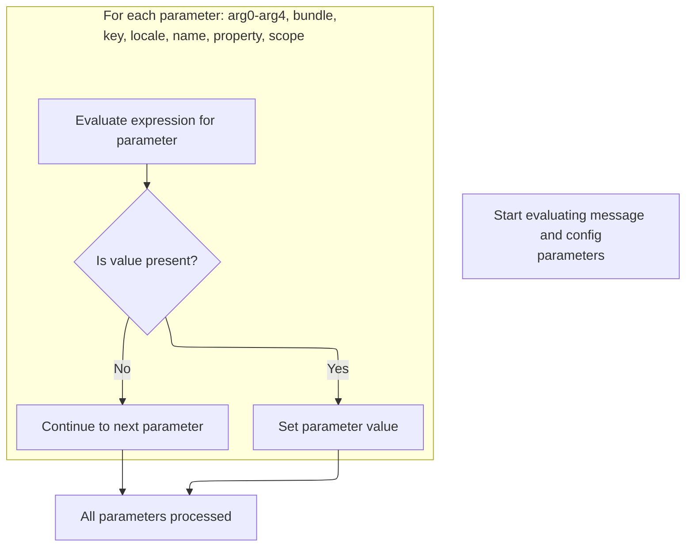

This document describes how tag attributes are prepared for further processing by evaluating dynamic expressions and applying their values. This enables JSP tags to support dynamic configuration and ensures all attributes are ready for the next processing step.

# Starting Tag Processing

<SwmSnippet path="/el/src/main/java/org/apache/strutsel/taglib/bean/ELMessageTag.java" line="306">

---

In <SwmToken path="el/src/main/java/org/apache/strutsel/taglib/bean/ELMessageTag.java" pos="306:5:5" line-data="    public int doStartTag() throws JspException {">`doStartTag`</SwmToken>, we kick things off by resolving any dynamic expressions tied to the tag's attributes. We call <SwmToken path="el/src/main/java/org/apache/strutsel/taglib/bean/ELMessageTag.java" pos="307:1:1" line-data="        evaluateExpressions();">`evaluateExpressions`</SwmToken> next so that all the tag's parameters are up-to-date and ready for the rest of the tag logic.

```java
    public int doStartTag() throws JspException {
        evaluateExpressions();

```

---

</SwmSnippet>

## Evaluating and Applying Tag Attributes



<SwmSnippet path="/el/src/main/java/org/apache/strutsel/taglib/bean/ELMessageTag.java" line="318">

---

In <SwmToken path="el/src/main/java/org/apache/strutsel/taglib/bean/ELMessageTag.java" pos="318:5:5" line-data="    private void evaluateExpressions()">`evaluateExpressions`</SwmToken>, we resolve all possible dynamic attributes for the tag, including message arguments and the bundle name. After evaluating the bundle, we call into the config logic to update which resource bundle is used for message lookup.

```java
    private void evaluateExpressions()
        throws JspException {
        String string = null;

        if ((string =
                EvalHelper.evalString("arg0", getArg0Expr(), this, pageContext)) != null) {
            setArg0(string);
        }

        if ((string =
                EvalHelper.evalString("arg1", getArg1Expr(), this, pageContext)) != null) {
            setArg1(string);
        }

        if ((string =
                EvalHelper.evalString("arg2", getArg2Expr(), this, pageContext)) != null) {
            setArg2(string);
        }

        if ((string =
                EvalHelper.evalString("arg3", getArg3Expr(), this, pageContext)) != null) {
            setArg3(string);
        }

        if ((string =
                EvalHelper.evalString("arg4", getArg4Expr(), this, pageContext)) != null) {
            setArg4(string);
        }

        if ((string =
                EvalHelper.evalString("bundle", getBundleExpr(), this,
                    pageContext)) != null) {
            setBundle(string);
        }

```

---

</SwmSnippet>

<SwmSnippet path="/core/src/main/java/org/apache/struts/config/ExceptionConfig.java" line="89">

---

<SwmToken path="core/src/main/java/org/apache/struts/config/ExceptionConfig.java" pos="89:5:5" line-data="    public void setBundle(String bundle) {">`setBundle`</SwmToken> updates the resource bundle used for messages, but only if the configuration isn't locked. If the config is frozen (the 'configured' flag is true), it throws an exception to block any changes.

```java
    public void setBundle(String bundle) {
        if (configured) {
            throw new IllegalStateException("Configuration is frozen");
        }

        this.bundle = bundle;
    }
```

---

</SwmSnippet>

<SwmSnippet path="/el/src/main/java/org/apache/strutsel/taglib/bean/ELMessageTag.java" line="353">

---

Back in `ELMessageTag.evaluateExpressions`, after updating the bundle, we finish resolving and setting other tag properties like key, locale, name, property, and scope. Setting the scope can trigger config logic that enforces immutability, so we call into the <SwmToken path="core/src/main/java/org/apache/struts/config/ExceptionConfig.java" pos="180:14:14" line-data="     * @param actionConfig The {@link ActionConfig} that this config is from,">`ActionConfig`</SwmToken> next.

```java
        if ((string =
                EvalHelper.evalString("key", getKeyExpr(), this, pageContext)) != null) {
            setKey(string);
        }

        if ((string =
                EvalHelper.evalString("locale", getLocaleExpr(), this,
                    pageContext)) != null) {
            setLocale(string);
        }

        if ((string =
                EvalHelper.evalString("name", getNameExpr(), this, pageContext)) != null) {
            setName(string);
        }

        if ((string =
                EvalHelper.evalString("property", getPropertyExpr(), this,
                    pageContext)) != null) {
            setProperty(string);
        }

        if ((string =
                EvalHelper.evalString("scope", getScopeExpr(), this, pageContext)) != null) {
            setScope(string);
        }
    }
```

---

</SwmSnippet>

<SwmSnippet path="/core/src/main/java/org/apache/struts/config/ActionConfig.java" line="652">

---

<SwmToken path="core/src/main/java/org/apache/struts/config/ActionConfig.java" pos="652:5:5" line-data="    public void setScope(String scope) {">`setScope`</SwmToken> updates where the tag's data lives (like request or session), but only if the config isn't locked. If the config is frozen, it throws to block changes, just like with the bundle.

```java
    public void setScope(String scope) {
        if (configured) {
            throw new IllegalStateException("Configuration is frozen");
        }

        this.scope = scope;
    }
```

---

</SwmSnippet>

## Delegating to Superclass Tag Logic

<SwmSnippet path="/el/src/main/java/org/apache/strutsel/taglib/bean/ELMessageTag.java" line="309">

---

Back in `ELMessageTag.doStartTag`, after resolving all expressions, we hand off to the superclass to do the actual tag processing. The next step might involve related resource tags, depending on how the tag is used.

```java
        return (super.doStartTag());
    }
```

---

</SwmSnippet>

# Starting Resource Tag Evaluation

<SwmSnippet path="/el/src/main/java/org/apache/strutsel/taglib/bean/ELResourceTag.java" line="120">

---

<SwmToken path="el/src/main/java/org/apache/strutsel/taglib/bean/ELResourceTag.java" pos="120:5:5" line-data="    public int doStartTag() throws JspException {">`doStartTag`</SwmToken> in <SwmToken path="el/src/main/java/org/apache/strutsel/taglib/bean/ELResourceTag.java" pos="38:4:4" line-data="public class ELResourceTag extends ResourceTag {">`ELResourceTag`</SwmToken> kicks off by resolving any EL expressions for tag attributes, then hands off to the parent class for the main tag logic. We need to call this because it ensures all dynamic values are set before the tag does its work.

```java
    public int doStartTag() throws JspException {
        evaluateExpressions();

        return (super.doStartTag());
    }
```

---

</SwmSnippet>

# Resolving Resource Tag Expressions and Enforcing Config State

```mermaid
%%{init: {"flowchart": {"defaultRenderer": "elk"}} }%%
flowchart TD
    node1["Start expression evaluation"]
    click node1 openCode "el/src/main/java/org/apache/strutsel/taglib/bean/ELResourceTag.java:132:135"
    node1 --> node2{"'id' expression present?"}
    click node2 openCode "el/src/main/java/org/apache/strutsel/taglib/bean/ELResourceTag.java:136:139"
    node2 -->|"Yes"| node3["Set resource id"]
    click node3 openCode "el/src/main/java/org/apache/strutsel/taglib/bean/ELResourceTag.java:138:139"
    node2 -->|"No"| node4{"'input' expression present?"}
    node3 --> node4
    click node4 openCode "el/src/main/java/org/apache/strutsel/taglib/bean/ELResourceTag.java:141:144"
    node4 -->|"Yes"| node5["Set resource input"]
    click node5 openCode "el/src/main/java/org/apache/strutsel/taglib/bean/ELResourceTag.java:143:144"
    node4 -->|"No"| node6{"'name' expression present?"}
    node5 --> node6
    click node6 openCode "el/src/main/java/org/apache/strutsel/taglib/bean/ELResourceTag.java:146:149"
    node6 -->|"Yes"| node7["Set resource name"]
    click node7 openCode "el/src/main/java/org/apache/strutsel/taglib/bean/ELResourceTag.java:148:149"
    node6 -->|"No"| node8["End of evaluation"]
    node7 --> node8
    click node8 openCode "el/src/main/java/org/apache/strutsel/taglib/bean/ELResourceTag.java:150:150"

classDef HeadingStyle fill:#777777,stroke:#333,stroke-width:2px;

%% Swimm:
%% %%{init: {"flowchart": {"defaultRenderer": "elk"}} }%%
%% flowchart TD
%%     node1["Start expression evaluation"]
%%     click node1 openCode "<SwmPath>[el/…/bean/ELResourceTag.java](el/src/main/java/org/apache/strutsel/taglib/bean/ELResourceTag.java)</SwmPath>:132:135"
%%     node1 --> node2{"'id' expression present?"}
%%     click node2 openCode "<SwmPath>[el/…/bean/ELResourceTag.java](el/src/main/java/org/apache/strutsel/taglib/bean/ELResourceTag.java)</SwmPath>:136:139"
%%     node2 -->|"Yes"| node3["Set resource id"]
%%     click node3 openCode "<SwmPath>[el/…/bean/ELResourceTag.java](el/src/main/java/org/apache/strutsel/taglib/bean/ELResourceTag.java)</SwmPath>:138:139"
%%     node2 -->|"No"| node4{"'input' expression present?"}
%%     node3 --> node4
%%     click node4 openCode "<SwmPath>[el/…/bean/ELResourceTag.java](el/src/main/java/org/apache/strutsel/taglib/bean/ELResourceTag.java)</SwmPath>:141:144"
%%     node4 -->|"Yes"| node5["Set resource input"]
%%     click node5 openCode "<SwmPath>[el/…/bean/ELResourceTag.java](el/src/main/java/org/apache/strutsel/taglib/bean/ELResourceTag.java)</SwmPath>:143:144"
%%     node4 -->|"No"| node6{"'name' expression present?"}
%%     node5 --> node6
%%     click node6 openCode "<SwmPath>[el/…/bean/ELResourceTag.java](el/src/main/java/org/apache/strutsel/taglib/bean/ELResourceTag.java)</SwmPath>:146:149"
%%     node6 -->|"Yes"| node7["Set resource name"]
%%     click node7 openCode "<SwmPath>[el/…/bean/ELResourceTag.java](el/src/main/java/org/apache/strutsel/taglib/bean/ELResourceTag.java)</SwmPath>:148:149"
%%     node6 -->|"No"| node8["End of evaluation"]
%%     node7 --> node8
%%     click node8 openCode "<SwmPath>[el/…/bean/ELResourceTag.java](el/src/main/java/org/apache/strutsel/taglib/bean/ELResourceTag.java)</SwmPath>:150:150"
%% 
%% classDef HeadingStyle fill:#777777,stroke:#333,stroke-width:2px;
```



<SwmSnippet path="/el/src/main/java/org/apache/strutsel/taglib/bean/ELResourceTag.java" line="132">

---

In <SwmToken path="el/src/main/java/org/apache/strutsel/taglib/bean/ELResourceTag.java" pos="132:5:5" line-data="    private void evaluateExpressions()">`evaluateExpressions`</SwmToken>, we resolve EL for 'id' and 'input'. After evaluating 'input', we call <SwmToken path="el/src/main/java/org/apache/strutsel/taglib/bean/ELResourceTag.java" pos="143:1:1" line-data="            setInput(string);">`setInput`</SwmToken>, which might trigger config logic to block changes if the config is frozen. That's why we need to jump into <SwmToken path="core/src/main/java/org/apache/struts/config/ExceptionConfig.java" pos="180:14:14" line-data="     * @param actionConfig The {@link ActionConfig} that this config is from,">`ActionConfig`</SwmToken> next.

```java
    private void evaluateExpressions()
        throws JspException {
        String string = null;

        if ((string =
                EvalHelper.evalString("id", getIdExpr(), this, pageContext)) != null) {
            setId(string);
        }

        if ((string =
                EvalHelper.evalString("input", getInputExpr(), this, pageContext)) != null) {
            setInput(string);
        }

```

---

</SwmSnippet>

<SwmSnippet path="/core/src/main/java/org/apache/struts/config/ActionConfig.java" line="473">

---

<SwmToken path="core/src/main/java/org/apache/struts/config/ActionConfig.java" pos="473:5:5" line-data="    public void setInput(String input) {">`setInput`</SwmToken> checks if the config is frozen before updating the input value. If it's locked, it throws an exception, making sure no changes slip through after config is finalized. This is a standard way to enforce immutability in config objects.

```java
    public void setInput(String input) {
        if (configured) {
            throw new IllegalStateException("Configuration is frozen");
        }

        this.input = input;
    }
```

---

</SwmSnippet>

<SwmSnippet path="/el/src/main/java/org/apache/strutsel/taglib/bean/ELResourceTag.java" line="146">

---

Back in <SwmToken path="el/src/main/java/org/apache/strutsel/taglib/bean/ELMessageTag.java" pos="307:1:1" line-data="        evaluateExpressions();">`evaluateExpressions`</SwmToken>, after <SwmToken path="core/src/main/java/org/apache/struts/config/ActionConfig.java" pos="473:5:5" line-data="    public void setInput(String input) {">`setInput`</SwmToken> (which could have thrown if config is frozen), we finish by resolving and setting the 'name' property. If <SwmToken path="core/src/main/java/org/apache/struts/config/ActionConfig.java" pos="473:5:5" line-data="    public void setInput(String input) {">`setInput`</SwmToken> failed, this part wouldn't run, so order matters here.

```java
        if ((string =
                EvalHelper.evalString("name", getNameExpr(), this, pageContext)) != null) {
            setName(string);
        }
    }
```

---

</SwmSnippet>

&nbsp;

*This is an auto-generated document by Swimm 🌊 and has not yet been verified by a human*

<SwmMeta version="3.0.0" repo-id="Z2l0aHViJTNBJTNBc3RydXRzMSUzQSUzQVN3aW1tLURlbW8=" repo-name="struts1"><sup>Powered by [Swimm](https://app.swimm.io/)</sup></SwmMeta>
