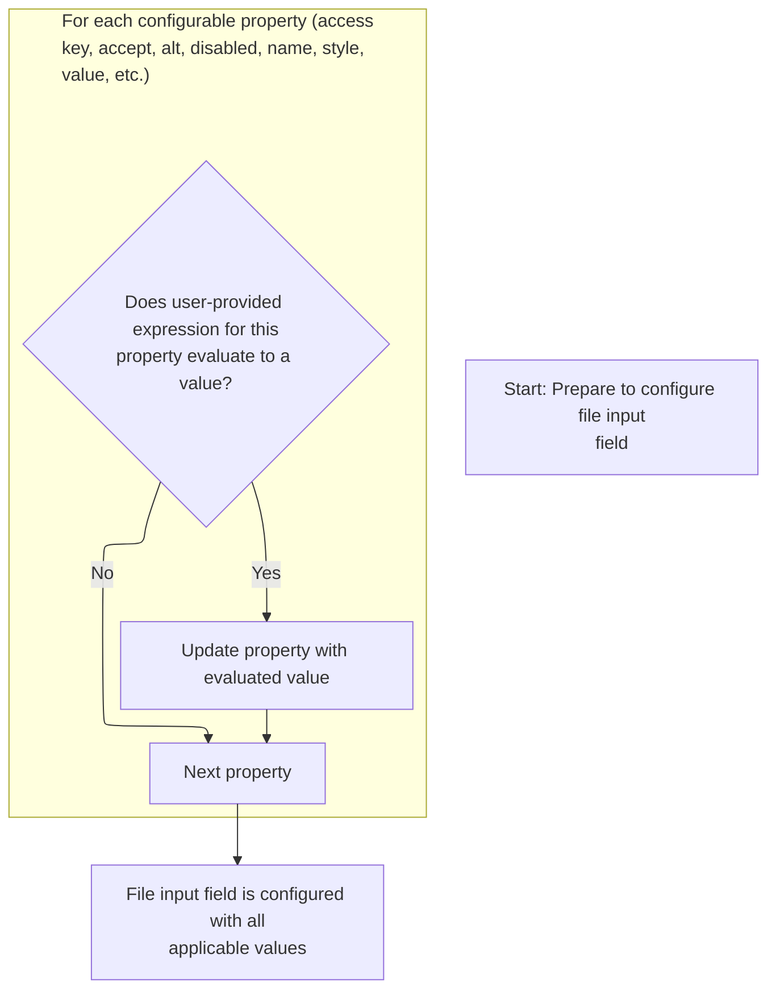

This document explains how dynamic tag attributes are evaluated and set before a tag is processed in a JSP page. The flow ensures that all user-provided expressions are resolved and applied, preparing the tag for rendering or further processing.

# Starting the Tag Evaluation

<SwmSnippet path="/el/src/main/java/org/apache/strutsel/taglib/html/ELFileTag.java" line="901">

---

In <SwmToken path="el/src/main/java/org/apache/strutsel/taglib/html/ELFileTag.java" pos="901:5:5" line-data="    public int doStartTag() throws JspException {">`doStartTag`</SwmToken>, we kick things off by resolving all the tag's dynamic attributes through <SwmToken path="el/src/main/java/org/apache/strutsel/taglib/html/ELFileTag.java" pos="902:1:1" line-data="        evaluateExpressions();">`evaluateExpressions`</SwmToken>. This step ensures that any expressions or EL values are evaluated and set before the tag logic continues.

```java
    public int doStartTag() throws JspException {
        evaluateExpressions();

```

---

</SwmSnippet>

## Evaluating and Setting Tag Attributes



<SwmSnippet path="/el/src/main/java/org/apache/strutsel/taglib/html/ELFileTag.java" line="913">

---

In <SwmToken path="el/src/main/java/org/apache/strutsel/taglib/html/ELFileTag.java" pos="913:5:5" line-data="    private void evaluateExpressions()">`evaluateExpressions`</SwmToken>, we loop through and resolve each tag attribute, including 'bundle'. If a bundle expression is present, we set it, but only if the configuration isn't frozen—otherwise, we hit an exception. This step ensures all tag properties are up-to-date before rendering.

```java
    private void evaluateExpressions()
        throws JspException {
        String string = null;
        Boolean bool = null;

        if ((string =
                EvalHelper.evalString("accesskey", getAccesskeyExpr(), this,
                    pageContext)) != null) {
            setAccesskey(string);
        }

        if ((string =
                EvalHelper.evalString("accept", getAcceptExpr(), this,
                    pageContext)) != null) {
            setAccept(string);
        }

        if ((string =
                EvalHelper.evalString("alt", getAltExpr(), this, pageContext)) != null) {
            setAlt(string);
        }

        if ((string =
                EvalHelper.evalString("altKey", getAltKeyExpr(), this,
                    pageContext)) != null) {
            setAltKey(string);
        }

        if ((string =
                EvalHelper.evalString("bundle", getBundleExpr(), this,
                    pageContext)) != null) {
            setBundle(string);
        }

```

---

</SwmSnippet>

<SwmSnippet path="/core/src/main/java/org/apache/struts/config/ExceptionConfig.java" line="89">

---

<SwmToken path="core/src/main/java/org/apache/struts/config/ExceptionConfig.java" pos="89:5:5" line-data="    public void setBundle(String bundle) {">`setBundle`</SwmToken> checks if the config is frozen using the 'configured' flag. If it's set, any attempt to change the bundle throws an exception, locking down the configuration to avoid late changes.

```java
    public void setBundle(String bundle) {
        if (configured) {
            throw new IllegalStateException("Configuration is frozen");
        }

        this.bundle = bundle;
    }
```

---

</SwmSnippet>

<SwmSnippet path="/el/src/main/java/org/apache/strutsel/taglib/html/ELFileTag.java" line="947">

---

Back in `ELFileTag.evaluateExpressions`, after handling the bundle, we keep resolving and setting more attributes. When we hit the 'size' property, we call into the config logic to validate and set it, making sure only valid values are accepted.

```java
        if ((string =
        		EvalHelper.evalString("dir", getDirExpr(), this,
        			pageContext)) != null) {
        	setDir(string);
        }
        
        if ((bool =
                EvalHelper.evalBoolean("disabled", getDisabledExpr(), this,
                    pageContext)) != null) {
            setDisabled(bool.booleanValue());
        }

        if ((string =
                EvalHelper.evalString("errorKey", getErrorKeyExpr(), this,
                    pageContext)) != null) {
            setErrorKey(string);
        }

        if ((string =
                EvalHelper.evalString("errorStyle", getErrorStyleExpr(), this,
                    pageContext)) != null) {
            setErrorStyle(string);
        }

        if ((string =
                EvalHelper.evalString("errorStyleClass",
                    getErrorStyleClassExpr(), this, pageContext)) != null) {
            setErrorStyleClass(string);
        }

        if ((string =
                EvalHelper.evalString("errorStyleId", getErrorStyleIdExpr(),
                    this, pageContext)) != null) {
            setErrorStyleId(string);
        }

        if ((bool =
                EvalHelper.evalBoolean("indexed", getIndexedExpr(), this,
                    pageContext)) != null) {
            setIndexed(bool.booleanValue());
        }

        if ((string =
            	EvalHelper.evalString("lang", getLangExpr(), this,
            		pageContext)) != null) {
        	setLang(string);
        }

        if ((string =
                EvalHelper.evalString("maxlength", getMaxlengthExpr(), this,
                    pageContext)) != null) {
            setMaxlength(string);
        }

        if ((string =
                EvalHelper.evalString("name", getNameExpr(), this, pageContext)) != null) {
            setName(string);
        }

        if ((string =
                EvalHelper.evalString("onblur", getOnblurExpr(), this,
                    pageContext)) != null) {
            setOnblur(string);
        }

        if ((string =
                EvalHelper.evalString("onchange", getOnchangeExpr(), this,
                    pageContext)) != null) {
            setOnchange(string);
        }

        if ((string =
                EvalHelper.evalString("onclick", getOnclickExpr(), this,
                    pageContext)) != null) {
            setOnclick(string);
        }

        if ((string =
                EvalHelper.evalString("ondblclick", getOndblclickExpr(), this,
                    pageContext)) != null) {
            setOndblclick(string);
        }

        if ((string =
                EvalHelper.evalString("onfocus", getOnfocusExpr(), this,
                    pageContext)) != null) {
            setOnfocus(string);
        }

        if ((string =
                EvalHelper.evalString("onkeydown", getOnkeydownExpr(), this,
                    pageContext)) != null) {
            setOnkeydown(string);
        }

        if ((string =
                EvalHelper.evalString("onkeypress", getOnkeypressExpr(), this,
                    pageContext)) != null) {
            setOnkeypress(string);
        }

        if ((string =
                EvalHelper.evalString("onkeyup", getOnkeyupExpr(), this,
                    pageContext)) != null) {
            setOnkeyup(string);
        }

        if ((string =
                EvalHelper.evalString("onmousedown", getOnmousedownExpr(),
                    this, pageContext)) != null) {
            setOnmousedown(string);
        }

        if ((string =
                EvalHelper.evalString("onmousemove", getOnmousemoveExpr(),
                    this, pageContext)) != null) {
            setOnmousemove(string);
        }

        if ((string =
                EvalHelper.evalString("onmouseout", getOnmouseoutExpr(), this,
                    pageContext)) != null) {
            setOnmouseout(string);
        }

        if ((string =
                EvalHelper.evalString("onmouseover", getOnmouseoverExpr(),
                    this, pageContext)) != null) {
            setOnmouseover(string);
        }

        if ((string =
                EvalHelper.evalString("onmouseup", getOnmouseupExpr(), this,
                    pageContext)) != null) {
            setOnmouseup(string);
        }

        if ((string =
                EvalHelper.evalString("property", getPropertyExpr(), this,
                    pageContext)) != null) {
            setProperty(string);
        }

        if ((string =
                EvalHelper.evalString("size", getSizeExpr(), this, pageContext)) != null) {
            setSize(string);
        }

```

---

</SwmSnippet>

<SwmSnippet path="/core/src/main/java/org/apache/struts/config/FormPropertyConfig.java" line="192">

---

<SwmToken path="core/src/main/java/org/apache/struts/config/FormPropertyConfig.java" pos="192:5:5" line-data="    public void setSize(int size) {">`setSize`</SwmToken> enforces two things: config can't change if frozen, and size can't be negative. If either check fails, it throws, so only valid, mutable configs get through.

```java
    public void setSize(int size) {
        if (configured) {
            throw new IllegalStateException("Configuration is frozen");
        }

        if (size < 0) {
            throw new IllegalArgumentException("size < 0");
        }

        this.size = size;
    }
```

---

</SwmSnippet>

<SwmSnippet path="/el/src/main/java/org/apache/strutsel/taglib/html/ELFileTag.java" line="1095">

---

After returning from the config size check, `ELFileTag.evaluateExpressions` just keeps looping through and resolving the rest of the tag's attributes, finishing up all the dynamic property assignments before the tag is used.

```java
        if ((string =
                EvalHelper.evalString("style", getStyleExpr(), this, pageContext)) != null) {
            setStyle(string);
        }

        if ((string =
                EvalHelper.evalString("styleClass", getStyleClassExpr(), this,
                    pageContext)) != null) {
            setStyleClass(string);
        }

        if ((string =
                EvalHelper.evalString("styleId", getStyleIdExpr(), this,
                    pageContext)) != null) {
            setStyleId(string);
        }

        if ((string =
                EvalHelper.evalString("tabindex", getTabindexExpr(), this,
                    pageContext)) != null) {
            setTabindex(string);
        }

        if ((string =
                EvalHelper.evalString("title", getTitleExpr(), this, pageContext)) != null) {
            setTitle(string);
        }

        if ((string =
                EvalHelper.evalString("titleKey", getTitleKeyExpr(), this,
                    pageContext)) != null) {
            setTitleKey(string);
        }

        if ((string =
                EvalHelper.evalString("value", getValueExpr(), this, pageContext)) != null) {
            setValue(string);
        }
    }
```

---

</SwmSnippet>

## Delegating to Superclass Tag Logic

<SwmSnippet path="/el/src/main/java/org/apache/strutsel/taglib/html/ELFileTag.java" line="904">

---

After `ELFileTag.evaluateExpressions` finishes, <SwmToken path="el/src/main/java/org/apache/strutsel/taglib/html/ELFileTag.java" pos="904:6:6" line-data="        return (super.doStartTag());">`doStartTag`</SwmToken> hands off to the superclass to run the main tag logic. This is where the actual tag output or processing happens, and it may trigger the next tag in the chain, like <SwmToken path="el/src/main/java/org/apache/strutsel/taglib/bean/ELResourceTag.java" pos="38:4:4" line-data="public class ELResourceTag extends ResourceTag {">`ELResourceTag`</SwmToken>.

```java
        return (super.doStartTag());
    }
```

---

</SwmSnippet>

# Processing the Resource Tag

<SwmSnippet path="/el/src/main/java/org/apache/strutsel/taglib/bean/ELResourceTag.java" line="120">

---

<SwmToken path="el/src/main/java/org/apache/strutsel/taglib/bean/ELResourceTag.java" pos="120:5:5" line-data="    public int doStartTag() throws JspException {">`doStartTag`</SwmToken> in <SwmToken path="el/src/main/java/org/apache/strutsel/taglib/bean/ELResourceTag.java" pos="38:4:4" line-data="public class ELResourceTag extends ResourceTag {">`ELResourceTag`</SwmToken> starts by resolving its own dynamic attributes with <SwmToken path="el/src/main/java/org/apache/strutsel/taglib/bean/ELResourceTag.java" pos="121:1:1" line-data="        evaluateExpressions();">`evaluateExpressions`</SwmToken>, then passes control to its superclass for the main tag logic.

```java
    public int doStartTag() throws JspException {
        evaluateExpressions();

        return (super.doStartTag());
    }
```

---

</SwmSnippet>

# Resolving Resource Tag Attributes

```mermaid
%%{init: {"flowchart": {"defaultRenderer": "elk"}} }%%
flowchart TD
  node1["Start evaluating resource tag
expressions"]
  click node1 openCode "el/src/main/java/org/apache/strutsel/taglib/bean/ELResourceTag.java:132:135"
  node1 --> node2{"Is there a value for 'id'?"}
  click node2 openCode "el/src/main/java/org/apache/strutsel/taglib/bean/ELResourceTag.java:136:139"
  node2 -->|"Yes"| node3["Update tag 'id' with value"]
  click node3 openCode "el/src/main/java/org/apache/strutsel/taglib/bean/ELResourceTag.java:138:139"
  node2 -->|"No"| node4{"Is there a value for 'input'?"}
  node3 --> node4
  click node4 openCode "el/src/main/java/org/apache/strutsel/taglib/bean/ELResourceTag.java:141:144"
  node4 -->|"Yes"| node5["Update tag 'input' with value"]
  click node5 openCode "el/src/main/java/org/apache/strutsel/taglib/bean/ELResourceTag.java:143:144"
  node4 -->|"No"| node6{"Is there a value for 'name'?"}
  node5 --> node6
  click node6 openCode "el/src/main/java/org/apache/strutsel/taglib/bean/ELResourceTag.java:146:149"
  node6 -->|"Yes"| node7["Update tag 'name' with value"]
  click node7 openCode "el/src/main/java/org/apache/strutsel/taglib/bean/ELResourceTag.java:148:149"
  node6 -->|"No"| node8["End"]
  node7 --> node8
  click node8 openCode "el/src/main/java/org/apache/strutsel/taglib/bean/ELResourceTag.java:150:150"

classDef HeadingStyle fill:#777777,stroke:#333,stroke-width:2px;

%% Swimm:
%% %%{init: {"flowchart": {"defaultRenderer": "elk"}} }%%
%% flowchart TD
%%   node1["Start evaluating resource tag
%% expressions"]
%%   click node1 openCode "<SwmPath>[el/…/bean/ELResourceTag.java](el/src/main/java/org/apache/strutsel/taglib/bean/ELResourceTag.java)</SwmPath>:132:135"
%%   node1 --> node2{"Is there a value for 'id'?"}
%%   click node2 openCode "<SwmPath>[el/…/bean/ELResourceTag.java](el/src/main/java/org/apache/strutsel/taglib/bean/ELResourceTag.java)</SwmPath>:136:139"
%%   node2 -->|"Yes"| node3["Update tag 'id' with value"]
%%   click node3 openCode "<SwmPath>[el/…/bean/ELResourceTag.java](el/src/main/java/org/apache/strutsel/taglib/bean/ELResourceTag.java)</SwmPath>:138:139"
%%   node2 -->|"No"| node4{"Is there a value for 'input'?"}
%%   node3 --> node4
%%   click node4 openCode "<SwmPath>[el/…/bean/ELResourceTag.java](el/src/main/java/org/apache/strutsel/taglib/bean/ELResourceTag.java)</SwmPath>:141:144"
%%   node4 -->|"Yes"| node5["Update tag 'input' with value"]
%%   click node5 openCode "<SwmPath>[el/…/bean/ELResourceTag.java](el/src/main/java/org/apache/strutsel/taglib/bean/ELResourceTag.java)</SwmPath>:143:144"
%%   node4 -->|"No"| node6{"Is there a value for 'name'?"}
%%   node5 --> node6
%%   click node6 openCode "<SwmPath>[el/…/bean/ELResourceTag.java](el/src/main/java/org/apache/strutsel/taglib/bean/ELResourceTag.java)</SwmPath>:146:149"
%%   node6 -->|"Yes"| node7["Update tag 'name' with value"]
%%   click node7 openCode "<SwmPath>[el/…/bean/ELResourceTag.java](el/src/main/java/org/apache/strutsel/taglib/bean/ELResourceTag.java)</SwmPath>:148:149"
%%   node6 -->|"No"| node8["End"]
%%   node7 --> node8
%%   click node8 openCode "<SwmPath>[el/…/bean/ELResourceTag.java](el/src/main/java/org/apache/strutsel/taglib/bean/ELResourceTag.java)</SwmPath>:150:150"
%% 
%% classDef HeadingStyle fill:#777777,stroke:#333,stroke-width:2px;
```



<SwmSnippet path="/el/src/main/java/org/apache/strutsel/taglib/bean/ELResourceTag.java" line="132">

---

In <SwmToken path="el/src/main/java/org/apache/strutsel/taglib/bean/ELResourceTag.java" pos="132:5:5" line-data="    private void evaluateExpressions()">`evaluateExpressions`</SwmToken>, we resolve the 'id' and 'input' attributes for the resource tag. If 'input' is present, we set it, but only if the config isn't frozen—otherwise, we get an exception. This ensures the tag uses the right resource reference.

```java
    private void evaluateExpressions()
        throws JspException {
        String string = null;

        if ((string =
                EvalHelper.evalString("id", getIdExpr(), this, pageContext)) != null) {
            setId(string);
        }

        if ((string =
                EvalHelper.evalString("input", getInputExpr(), this, pageContext)) != null) {
            setInput(string);
        }

```

---

</SwmSnippet>

<SwmSnippet path="/core/src/main/java/org/apache/struts/config/ActionConfig.java" line="473">

---

<SwmToken path="core/src/main/java/org/apache/struts/config/ActionConfig.java" pos="473:5:5" line-data="    public void setInput(String input) {">`setInput`</SwmToken> checks if the config is frozen and throws if you try to change it after that point. Only unfrozen configs can have their input updated, which keeps things predictable.

```java
    public void setInput(String input) {
        if (configured) {
            throw new IllegalStateException("Configuration is frozen");
        }

        this.input = input;
    }
```

---

</SwmSnippet>

<SwmSnippet path="/el/src/main/java/org/apache/strutsel/taglib/bean/ELResourceTag.java" line="146">

---

After returning from the config input check, `ELResourceTag.evaluateExpressions` just keeps resolving the rest of the tag's attributes, finishing up the setup before the tag is processed.

```java
        if ((string =
                EvalHelper.evalString("name", getNameExpr(), this, pageContext)) != null) {
            setName(string);
        }
    }
```

---

</SwmSnippet>

&nbsp;

*This is an auto-generated document by Swimm 🌊 and has not yet been verified by a human*

<SwmMeta version="3.0.0" repo-id="Z2l0aHViJTNBJTNBc3RydXRzMSUzQSUzQVN3aW1tLURlbW8=" repo-name="struts1"><sup>Powered by [Swimm](https://app.swimm.io/)</sup></SwmMeta>
