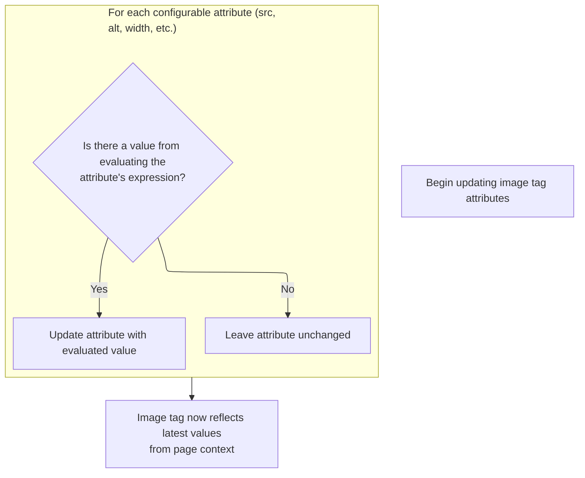

This document explains how tag attributes are prepared for rendering by evaluating expressions and updating their values. Tag attributes are processed to ensure they reflect the latest values, enabling dynamic rendering in the web application.

# Starting the Tag Evaluation

<SwmSnippet path="/el/src/main/java/org/apache/strutsel/taglib/html/ELImgTag.java" line="1076">

---

In <SwmToken path="el/src/main/java/org/apache/strutsel/taglib/html/ELImgTag.java" pos="1076:5:5" line-data="    public int doStartTag() throws JspException {">`doStartTag`</SwmToken>, we kick things off by resolving all EL-based attributes via <SwmToken path="el/src/main/java/org/apache/strutsel/taglib/html/ELImgTag.java" pos="1077:1:1" line-data="        evaluateExpressions();">`evaluateExpressions`</SwmToken>. This ensures the tag's properties are up-to-date before any rendering or further processing.

```java
    public int doStartTag() throws JspException {
        evaluateExpressions();

```

---

</SwmSnippet>

## Evaluating and Setting Tag Attributes



<SwmSnippet path="/el/src/main/java/org/apache/strutsel/taglib/html/ELImgTag.java" line="1088">

---

In <SwmToken path="el/src/main/java/org/apache/strutsel/taglib/html/ELImgTag.java" pos="1088:5:5" line-data="    private void evaluateExpressions()">`evaluateExpressions`</SwmToken>, we resolve EL expressions for 'action' and 'module', then push the module value into the config. Next, we call <SwmToken path="el/src/main/java/org/apache/strutsel/taglib/html/ELImgTag.java" pos="1102:1:1" line-data="            setModule(string);">`setModule`</SwmToken> to update the config with the new module, but only if config changes are still allowed.

```java
    private void evaluateExpressions()
        throws JspException {
        String string = null;
        Boolean bool = null;

        if ((string =
                EvalHelper.evalString("action", getActionExpr(), this,
                    pageContext)) != null) {
            setAction(string);
        }

        if ((string =
                EvalHelper.evalString("module", getModuleExpr(), this,
                    pageContext)) != null) {
            setModule(string);
        }

```

---

</SwmSnippet>

<SwmSnippet path="/core/src/main/java/org/apache/struts/config/ForwardConfig.java" line="210">

---

<SwmToken path="core/src/main/java/org/apache/struts/config/ForwardConfig.java" pos="210:5:5" line-data="    public void setModule(String module) {">`setModule`</SwmToken> updates the module property, but only if the config isn't frozen. If 'configured' is true, it throws, enforcing immutability after setup.

```java
    public void setModule(String module) {
        if (configured) {
            throw new IllegalStateException("Configuration is frozen");
        }

        this.module = module;
    }
```

---

</SwmSnippet>

<SwmSnippet path="/el/src/main/java/org/apache/strutsel/taglib/html/ELImgTag.java" line="1105">

---

Back in `ELImgTag.evaluateExpressions`, after updating the module, we move on to resolve and set more attributes like 'align', 'alt', <SwmToken path="el/src/main/java/org/apache/strutsel/taglib/html/ELImgTag.java" pos="1116:6:6" line-data="                EvalHelper.evalString(&quot;altKey&quot;, getAltKeyExpr(), this,">`altKey`</SwmToken>, 'border', and then 'bundle'. Setting 'bundle' triggers logic in <SwmToken path="core/src/main/java/org/apache/struts/config/ExceptionConfig.java" pos="34:4:4" line-data="public class ExceptionConfig extends BaseConfig {">`ExceptionConfig`</SwmToken> to update the resource bundle, but only if config changes are still allowed.

```java
        if ((string =
                EvalHelper.evalString("align", getAlignExpr(), this, pageContext)) != null) {
            setAlign(string);
        }

        if ((string =
                EvalHelper.evalString("alt", getAltExpr(), this, pageContext)) != null) {
            setAlt(string);
        }

        if ((string =
                EvalHelper.evalString("altKey", getAltKeyExpr(), this,
                    pageContext)) != null) {
            setAltKey(string);
        }

        if ((string =
                EvalHelper.evalString("border", getBorderExpr(), this,
                    pageContext)) != null) {
            setBorder(string);
        }

        if ((string =
                EvalHelper.evalString("bundle", getBundleExpr(), this,
                    pageContext)) != null) {
            setBundle(string);
        }

```

---

</SwmSnippet>

<SwmSnippet path="/core/src/main/java/org/apache/struts/config/ExceptionConfig.java" line="89">

---

<SwmToken path="core/src/main/java/org/apache/struts/config/ExceptionConfig.java" pos="89:5:5" line-data="    public void setBundle(String bundle) {">`setBundle`</SwmToken> updates the bundle property, but only if the config isn't frozen. If 'configured' is true, it throws, blocking any further changes to the bundle.

```java
    public void setBundle(String bundle) {
        if (configured) {
            throw new IllegalStateException("Configuration is frozen");
        }

        this.bundle = bundle;
    }
```

---

</SwmSnippet>

<SwmSnippet path="/el/src/main/java/org/apache/strutsel/taglib/html/ELImgTag.java" line="1133">

---

Back in `ELImgTag.evaluateExpressions`, after updating the bundle, we keep resolving and setting more attributes like 'dir', 'height', 'hspace', <SwmToken path="el/src/main/java/org/apache/strutsel/taglib/html/ELImgTag.java" pos="1152:6:6" line-data="                EvalHelper.evalString(&quot;imageName&quot;, getImageNameExpr(), this,">`imageName`</SwmToken>, 'ismap', 'lang', and then 'locale'. Setting 'locale' triggers <SwmToken path="core/src/main/java/org/apache/struts/config/ForwardConfig.java" pos="69:3:3" line-data="     * ControllerConfig} element for our current module. For the default">`ControllerConfig`</SwmToken> logic to update the locale, but only if config changes are still allowed.

```java
        if ((string =
        		EvalHelper.evalString("dir", getDirExpr(), this,
        			pageContext)) != null) {
        	setDir(string);
        }
        
        if ((string =
                EvalHelper.evalString("height", getHeightExpr(), this,
                    pageContext)) != null) {
            setHeight(string);
        }

        if ((string =
                EvalHelper.evalString("hspace", getHspaceExpr(), this,
                    pageContext)) != null) {
            setHspace(string);
        }

        if ((string =
                EvalHelper.evalString("imageName", getImageNameExpr(), this,
                    pageContext)) != null) {
            setImageName(string);
        }

        if ((string =
                EvalHelper.evalString("ismap", getIsmapExpr(), this, pageContext)) != null) {
            setIsmap(string);
        }

        if ((string =
            	EvalHelper.evalString("lang", getLangExpr(), this,
            		pageContext)) != null) {
        	setLang(string);
        }

        if ((string =
                EvalHelper.evalString("locale", getLocaleExpr(), this,
                    pageContext)) != null) {
            setLocale(string);
        }

```

---

</SwmSnippet>

<SwmSnippet path="/core/src/main/java/org/apache/struts/config/ControllerConfig.java" line="237">

---

<SwmToken path="core/src/main/java/org/apache/struts/config/ControllerConfig.java" pos="237:5:5" line-data="    public void setLocale(boolean locale) {">`setLocale`</SwmToken> updates the locale property, but only if the config isn't frozen. If 'configured' is true, it throws, so the locale can't be changed after config is locked.

```java
    public void setLocale(boolean locale) {
        if (configured) {
            throw new IllegalStateException("Configuration is frozen");
        }

        this.locale = locale;
    }
```

---

</SwmSnippet>

<SwmSnippet path="/el/src/main/java/org/apache/strutsel/taglib/html/ELImgTag.java" line="1174">

---

Back in `ELImgTag.evaluateExpressions`, after updating the locale, we keep resolving and setting a bunch of other attributes, ending with 'scope'. Setting 'scope' triggers <SwmToken path="core/src/main/java/org/apache/struts/config/ForwardConfig.java" pos="261:14:14" line-data="     * @param actionConfig The {@link ActionConfig} that this config is from,">`ActionConfig`</SwmToken> logic to update the scope, but only if config changes are still allowed.

```java
        if ((string =
                EvalHelper.evalString("name", getNameExpr(), this, pageContext)) != null) {
            setName(string);
        }

        if ((string =
                EvalHelper.evalString("onclick", getOnclickExpr(), this,
                    pageContext)) != null) {
            setOnclick(string);
        }

        if ((string =
                EvalHelper.evalString("ondblclick", getOndblclickExpr(), this,
                    pageContext)) != null) {
            setOndblclick(string);
        }

        if ((string =
                EvalHelper.evalString("onkeydown", getOnkeydownExpr(), this,
                    pageContext)) != null) {
            setOnkeydown(string);
        }

        if ((string =
                EvalHelper.evalString("onkeypress", getOnkeypressExpr(), this,
                    pageContext)) != null) {
            setOnkeypress(string);
        }

        if ((string =
                EvalHelper.evalString("onkeyup", getOnkeyupExpr(), this,
                    pageContext)) != null) {
            setOnkeyup(string);
        }

        if ((string =
                EvalHelper.evalString("onmousedown", getOnmousedownExpr(),
                    this, pageContext)) != null) {
            setOnmousedown(string);
        }

        if ((string =
                EvalHelper.evalString("onmousemove", getOnmousemoveExpr(),
                    this, pageContext)) != null) {
            setOnmousemove(string);
        }

        if ((string =
                EvalHelper.evalString("onmouseout", getOnmouseoutExpr(), this,
                    pageContext)) != null) {
            setOnmouseout(string);
        }

        if ((string =
                EvalHelper.evalString("onmouseover", getOnmouseoverExpr(),
                    this, pageContext)) != null) {
            setOnmouseover(string);
        }

        if ((string =
                EvalHelper.evalString("onmouseup", getOnmouseupExpr(), this,
                    pageContext)) != null) {
            setOnmouseup(string);
        }

        if ((string =
                EvalHelper.evalString("paramId", getParamIdExpr(), this,
                    pageContext)) != null) {
            setParamId(string);
        }

        if ((string =
                EvalHelper.evalString("page", getPageExpr(), this, pageContext)) != null) {
            setPage(string);
        }

        if ((string =
                EvalHelper.evalString("pageKey", getPageKeyExpr(), this,
                    pageContext)) != null) {
            setPageKey(string);
        }

        if ((string =
                EvalHelper.evalString("paramName", getParamNameExpr(), this,
                    pageContext)) != null) {
            setParamName(string);
        }

        if ((string =
                EvalHelper.evalString("paramProperty", getParamPropertyExpr(),
                    this, pageContext)) != null) {
            setParamProperty(string);
        }

        if ((string =
                EvalHelper.evalString("paramScope", getParamScopeExpr(), this,
                    pageContext)) != null) {
            setParamScope(string);
        }

        if ((string =
                EvalHelper.evalString("property", getPropertyExpr(), this,
                    pageContext)) != null) {
            setProperty(string);
        }

        if ((string =
                EvalHelper.evalString("scope", getScopeExpr(), this, pageContext)) != null) {
            setScope(string);
        }

```

---

</SwmSnippet>

<SwmSnippet path="/core/src/main/java/org/apache/struts/config/ActionConfig.java" line="652">

---

<SwmToken path="core/src/main/java/org/apache/struts/config/ActionConfig.java" pos="652:5:5" line-data="    public void setScope(String scope) {">`setScope`</SwmToken> updates the scope property, but only if the config isn't frozen. If 'configured' is true, it throws, so scope can't be changed after config is locked.

```java
    public void setScope(String scope) {
        if (configured) {
            throw new IllegalStateException("Configuration is frozen");
        }

        this.scope = scope;
    }
```

---

</SwmSnippet>

<SwmSnippet path="/el/src/main/java/org/apache/strutsel/taglib/html/ELImgTag.java" line="1285">

---

Back in `ELImgTag.evaluateExpressions`, after updating the scope, we finish resolving and setting the rest of the tag's attributes, like 'src', 'style', 'title', <SwmToken path="el/src/main/java/org/apache/strutsel/taglib/html/ELImgTag.java" pos="1325:6:6" line-data="                EvalHelper.evalBoolean(&quot;useLocalEncoding&quot;,">`useLocalEncoding`</SwmToken>, etc. At this point, all EL-based properties are set and ready for rendering.

```java
        if ((string =
                EvalHelper.evalString("src", getSrcExpr(), this, pageContext)) != null) {
            setSrc(string);
        }

        if ((string =
                EvalHelper.evalString("srcKey", getSrcKeyExpr(), this,
                    pageContext)) != null) {
            setSrcKey(string);
        }

        if ((string =
                EvalHelper.evalString("style", getStyleExpr(), this, pageContext)) != null) {
            setStyle(string);
        }

        if ((string =
                EvalHelper.evalString("styleClass", getStyleClassExpr(), this,
                    pageContext)) != null) {
            setStyleClass(string);
        }

        if ((string =
                EvalHelper.evalString("styleId", getStyleIdExpr(), this,
                    pageContext)) != null) {
            setStyleId(string);
        }

        if ((string =
                EvalHelper.evalString("title", getTitleExpr(), this, pageContext)) != null) {
            setTitle(string);
        }

        if ((string =
                EvalHelper.evalString("titleKey", getTitleKeyExpr(), this,
                    pageContext)) != null) {
            setTitleKey(string);
        }

        if ((bool =
                EvalHelper.evalBoolean("useLocalEncoding",
                    getUseLocalEncodingExpr(), this, pageContext)) != null) {
            setUseLocalEncoding(bool.booleanValue());
        }

        if ((string =
                EvalHelper.evalString("usemap", getUsemapExpr(), this,
                    pageContext)) != null) {
            setUsemap(string);
        }

        if ((string =
                EvalHelper.evalString("vspace", getVspaceExpr(), this,
                    pageContext)) != null) {
            setVspace(string);
        }

        if ((string =
                EvalHelper.evalString("width", getWidthExpr(), this, pageContext)) != null) {
            setWidth(string);
        }
    }
```

---

</SwmSnippet>

## Delegating to Superclass Tag Logic

<SwmSnippet path="/el/src/main/java/org/apache/strutsel/taglib/html/ELImgTag.java" line="1079">

---

Back in `ELImgTag.doStartTag`, after all attributes are resolved, we delegate to the superclass's <SwmToken path="el/src/main/java/org/apache/strutsel/taglib/html/ELImgTag.java" pos="1079:6:6" line-data="        return (super.doStartTag());">`doStartTag`</SwmToken>. This hands off control to the next tag in the chain, which could be <SwmToken path="el/src/main/java/org/apache/strutsel/taglib/bean/ELResourceTag.java" pos="38:4:4" line-data="public class ELResourceTag extends ResourceTag {">`ELResourceTag`</SwmToken> if nested or included.

```java
        return (super.doStartTag());
    }
```

---

</SwmSnippet>

# Resource Tag Evaluation

<SwmSnippet path="/el/src/main/java/org/apache/strutsel/taglib/bean/ELResourceTag.java" line="120">

---

<SwmToken path="el/src/main/java/org/apache/strutsel/taglib/bean/ELResourceTag.java" pos="120:5:5" line-data="    public int doStartTag() throws JspException {">`doStartTag`</SwmToken> in <SwmToken path="el/src/main/java/org/apache/strutsel/taglib/bean/ELResourceTag.java" pos="38:4:4" line-data="public class ELResourceTag extends ResourceTag {">`ELResourceTag`</SwmToken> resolves its own EL-based attributes, then passes control to its superclass for further processing.

```java
    public int doStartTag() throws JspException {
        evaluateExpressions();

        return (super.doStartTag());
    }
```

---

</SwmSnippet>

# Evaluating Resource Tag Attributes

```mermaid
%%{init: {"flowchart": {"defaultRenderer": "elk"}} }%%
flowchart TD
    node2{"Is there an 'id' value?"}
    click node2 openCode "el/src/main/java/org/apache/strutsel/taglib/bean/ELResourceTag.java:136:139"
    node2 -->|"Yes"| node3["Update resource id"]
    click node3 openCode "el/src/main/java/org/apache/strutsel/taglib/bean/ELResourceTag.java:138:139"
    node2 -->|"No"| node4{"Is there an 'input' value?"}
    click node4 openCode "el/src/main/java/org/apache/strutsel/taglib/bean/ELResourceTag.java:141:144"
    node3 --> node4
    node4 -->|"Yes"| node5["Update resource input"]
    click node5 openCode "el/src/main/java/org/apache/strutsel/taglib/bean/ELResourceTag.java:143:144"
    node4 -->|"No"| node6{"Is there a 'name' value?"}
    click node6 openCode "el/src/main/java/org/apache/strutsel/taglib/bean/ELResourceTag.java:146:149"
    node5 --> node6
    node6 -->|"Yes"| node7["Update resource name"]
    click node7 openCode "el/src/main/java/org/apache/strutsel/taglib/bean/ELResourceTag.java:148:149"
    node6 -->|"No"| node8["End"]
    node7 --> node8
classDef HeadingStyle fill:#777777,stroke:#333,stroke-width:2px;

%% Swimm:
%% %%{init: {"flowchart": {"defaultRenderer": "elk"}} }%%
%% flowchart TD
%%     node2{"Is there an 'id' value?"}
%%     click node2 openCode "<SwmPath>[el/…/bean/ELResourceTag.java](el/src/main/java/org/apache/strutsel/taglib/bean/ELResourceTag.java)</SwmPath>:136:139"
%%     node2 -->|"Yes"| node3["Update resource id"]
%%     click node3 openCode "<SwmPath>[el/…/bean/ELResourceTag.java](el/src/main/java/org/apache/strutsel/taglib/bean/ELResourceTag.java)</SwmPath>:138:139"
%%     node2 -->|"No"| node4{"Is there an 'input' value?"}
%%     click node4 openCode "<SwmPath>[el/…/bean/ELResourceTag.java](el/src/main/java/org/apache/strutsel/taglib/bean/ELResourceTag.java)</SwmPath>:141:144"
%%     node3 --> node4
%%     node4 -->|"Yes"| node5["Update resource input"]
%%     click node5 openCode "<SwmPath>[el/…/bean/ELResourceTag.java](el/src/main/java/org/apache/strutsel/taglib/bean/ELResourceTag.java)</SwmPath>:143:144"
%%     node4 -->|"No"| node6{"Is there a 'name' value?"}
%%     click node6 openCode "<SwmPath>[el/…/bean/ELResourceTag.java](el/src/main/java/org/apache/strutsel/taglib/bean/ELResourceTag.java)</SwmPath>:146:149"
%%     node5 --> node6
%%     node6 -->|"Yes"| node7["Update resource name"]
%%     click node7 openCode "<SwmPath>[el/…/bean/ELResourceTag.java](el/src/main/java/org/apache/strutsel/taglib/bean/ELResourceTag.java)</SwmPath>:148:149"
%%     node6 -->|"No"| node8["End"]
%%     node7 --> node8
%% classDef HeadingStyle fill:#777777,stroke:#333,stroke-width:2px;
```



<SwmSnippet path="/el/src/main/java/org/apache/strutsel/taglib/bean/ELResourceTag.java" line="132">

---

In <SwmToken path="el/src/main/java/org/apache/strutsel/taglib/bean/ELResourceTag.java" pos="132:5:5" line-data="    private void evaluateExpressions()">`evaluateExpressions`</SwmToken> for <SwmToken path="el/src/main/java/org/apache/strutsel/taglib/bean/ELResourceTag.java" pos="38:4:4" line-data="public class ELResourceTag extends ResourceTag {">`ELResourceTag`</SwmToken>, we resolve 'id' and 'input', then call <SwmToken path="el/src/main/java/org/apache/strutsel/taglib/bean/ELResourceTag.java" pos="143:1:1" line-data="            setInput(string);">`setInput`</SwmToken> to update the config with the new input value, but only if config changes are still allowed.

```java
    private void evaluateExpressions()
        throws JspException {
        String string = null;

        if ((string =
                EvalHelper.evalString("id", getIdExpr(), this, pageContext)) != null) {
            setId(string);
        }

        if ((string =
                EvalHelper.evalString("input", getInputExpr(), this, pageContext)) != null) {
            setInput(string);
        }

```

---

</SwmSnippet>

<SwmSnippet path="/core/src/main/java/org/apache/struts/config/ActionConfig.java" line="473">

---

<SwmToken path="core/src/main/java/org/apache/struts/config/ActionConfig.java" pos="473:5:5" line-data="    public void setInput(String input) {">`setInput`</SwmToken> updates the input property, but only if the config isn't frozen. If 'configured' is true, it throws, so input can't be changed after config is locked.

```java
    public void setInput(String input) {
        if (configured) {
            throw new IllegalStateException("Configuration is frozen");
        }

        this.input = input;
    }
```

---

</SwmSnippet>

<SwmSnippet path="/el/src/main/java/org/apache/strutsel/taglib/bean/ELResourceTag.java" line="146">

---

Back in `ELResourceTag.evaluateExpressions`, after updating the input, we finish resolving and setting the rest of the tag's attributes, like 'name'. At this point, all EL-based properties for the resource tag are set.

```java
        if ((string =
                EvalHelper.evalString("name", getNameExpr(), this, pageContext)) != null) {
            setName(string);
        }
    }
```

---

</SwmSnippet>

&nbsp;

*This is an auto-generated document by Swimm 🌊 and has not yet been verified by a human*

<SwmMeta version="3.0.0" repo-id="Z2l0aHViJTNBJTNBc3RydXRzMSUzQSUzQVN3aW1tLURlbW8=" repo-name="struts1"><sup>Powered by [Swimm](https://app.swimm.io/)</sup></SwmMeta>
