This document describes how select and resource tags have their attributes evaluated and set before rendering. When these tags are used in a JSP page, any expressions in their attributes are resolved so the tag is fully configured before being processed by parent logic.

# Starting the Select Tag Evaluation

<SwmSnippet path="/el/src/main/java/org/apache/strutsel/taglib/html/ELSelectTag.java" line="857">

---

In <SwmToken path="el/src/main/java/org/apache/strutsel/taglib/html/ELSelectTag.java" pos="857:5:5" line-data="    public int doStartTag() throws JspException {">`doStartTag`</SwmToken>, we immediately resolve all attribute expressions by calling <SwmToken path="el/src/main/java/org/apache/strutsel/taglib/html/ELSelectTag.java" pos="858:1:1" line-data="        evaluateExpressions();">`evaluateExpressions`</SwmToken>. This makes sure any dynamic values are set before the tag does anything else.

```java
    public int doStartTag() throws JspException {
        evaluateExpressions();

```

---

</SwmSnippet>

## Evaluating Select Tag Expressions

<SwmSnippet path="/el/src/main/java/org/apache/strutsel/taglib/html/ELSelectTag.java" line="869">

---

In <SwmToken path="el/src/main/java/org/apache/strutsel/taglib/html/ELSelectTag.java" pos="869:5:5" line-data="    private void evaluateExpressions()">`evaluateExpressions`</SwmToken>, we loop through and resolve each tag attribute that might be an expression, including 'bundle'. After evaluating 'bundle', we call <SwmToken path="el/src/main/java/org/apache/strutsel/taglib/html/ELSelectTag.java" pos="888:1:1" line-data="            setBundle(string);">`setBundle`</SwmToken> to update the resource bundle, which is needed for localization. The next step is to actually set this value in the configuration, which happens in <SwmToken path="core/src/main/java/org/apache/struts/config/ExceptionConfig.java" pos="34:4:4" line-data="public class ExceptionConfig extends BaseConfig {">`ExceptionConfig`</SwmToken>.

```java
    private void evaluateExpressions()
        throws JspException {
        String string = null;
        Boolean bool = null;

        if ((string =
                EvalHelper.evalString("alt", getAltExpr(), this, pageContext)) != null) {
            setAlt(string);
        }

        if ((string =
                EvalHelper.evalString("altKey", getAltKeyExpr(), this,
                    pageContext)) != null) {
            setAltKey(string);
        }

        if ((string =
                EvalHelper.evalString("bundle", getBundleExpr(), this,
                    pageContext)) != null) {
            setBundle(string);
        }

```

---

</SwmSnippet>

<SwmSnippet path="/core/src/main/java/org/apache/struts/config/ExceptionConfig.java" line="89">

---

<SwmToken path="core/src/main/java/org/apache/struts/config/ExceptionConfig.java" pos="89:5:5" line-data="    public void setBundle(String bundle) {">`setBundle`</SwmToken> updates the bundle value, but only if the configuration isn't frozen. If <SwmToken path="core/src/main/java/org/apache/struts/config/ExceptionConfig.java" pos="90:4:4" line-data="        if (configured) {">`configured`</SwmToken> is true, it throws an exception to prevent changes, enforcing immutability after setup.

```java
    public void setBundle(String bundle) {
        if (configured) {
            throw new IllegalStateException("Configuration is frozen");
        }

        this.bundle = bundle;
    }
```

---

</SwmSnippet>

<SwmSnippet path="/el/src/main/java/org/apache/strutsel/taglib/html/ELSelectTag.java" line="891">

---

Back in <SwmToken path="el/src/main/java/org/apache/strutsel/taglib/html/ELSelectTag.java" pos="858:1:1" line-data="        evaluateExpressions();">`evaluateExpressions`</SwmToken>, after updating the bundle, we keep resolving and setting other attributes. When we hit 'size', we call <SwmToken path="el/src/main/java/org/apache/strutsel/taglib/html/ELSelectTag.java" pos="1036:1:1" line-data="            setSize(string);">`setSize`</SwmToken> to update the select's visible size, which is handled in <SwmToken path="core/src/main/java/org/apache/struts/config/FormPropertyConfig.java" pos="38:4:4" line-data="public class FormPropertyConfig extends BaseConfig {">`FormPropertyConfig`</SwmToken> and may enforce some constraints.

```java
        if ((string =
        		EvalHelper.evalString("dir", getDirExpr(), this,
        			pageContext)) != null) {
        	setDir(string);
        }

        if ((bool =
                EvalHelper.evalBoolean("disabled", getDisabledExpr(), this,
                    pageContext)) != null) {
            setDisabled(bool.booleanValue());
        }

        if ((string =
                EvalHelper.evalString("errorKey", getErrorKeyExpr(), this,
                    pageContext)) != null) {
            setErrorKey(string);
        }

        if ((string =
                EvalHelper.evalString("errorStyle", getErrorStyleExpr(), this,
                    pageContext)) != null) {
            setErrorStyle(string);
        }

        if ((string =
                EvalHelper.evalString("errorStyleClass",
                    getErrorStyleClassExpr(), this, pageContext)) != null) {
            setErrorStyleClass(string);
        }

        if ((string =
                EvalHelper.evalString("errorStyleId", getErrorStyleIdExpr(),
                    this, pageContext)) != null) {
            setErrorStyleId(string);
        }

        if ((bool =
                EvalHelper.evalBoolean("indexed", getIndexedExpr(), this,
                    pageContext)) != null) {
            setIndexed(bool.booleanValue());
        }

        if ((string =
            	EvalHelper.evalString("lang", getLangExpr(), this,
            		pageContext)) != null) {
        	setLang(string);
        }

        if ((string =
                EvalHelper.evalString("multiple", getMultipleExpr(), this,
                    pageContext)) != null) {
            setMultiple(string);
        }

        if ((string =
                EvalHelper.evalString("name", getNameExpr(), this, pageContext)) != null) {
            setName(string);
        }

        if ((string =
                EvalHelper.evalString("onblur", getOnblurExpr(), this,
                    pageContext)) != null) {
            setOnblur(string);
        }

        if ((string =
                EvalHelper.evalString("onchange", getOnchangeExpr(), this,
                    pageContext)) != null) {
            setOnchange(string);
        }

        if ((string =
                EvalHelper.evalString("onclick", getOnclickExpr(), this,
                    pageContext)) != null) {
            setOnclick(string);
        }

        if ((string =
                EvalHelper.evalString("ondblclick", getOndblclickExpr(), this,
                    pageContext)) != null) {
            setOndblclick(string);
        }

        if ((string =
                EvalHelper.evalString("onfocus", getOnfocusExpr(), this,
                    pageContext)) != null) {
            setOnfocus(string);
        }

        if ((string =
                EvalHelper.evalString("onkeydown", getOnkeydownExpr(), this,
                    pageContext)) != null) {
            setOnkeydown(string);
        }

        if ((string =
                EvalHelper.evalString("onkeypress", getOnkeypressExpr(), this,
                    pageContext)) != null) {
            setOnkeypress(string);
        }

        if ((string =
                EvalHelper.evalString("onkeyup", getOnkeyupExpr(), this,
                    pageContext)) != null) {
            setOnkeyup(string);
        }

        if ((string =
                EvalHelper.evalString("onmousedown", getOnmousedownExpr(),
                    this, pageContext)) != null) {
            setOnmousedown(string);
        }

        if ((string =
                EvalHelper.evalString("onmousemove", getOnmousemoveExpr(),
                    this, pageContext)) != null) {
            setOnmousemove(string);
        }

        if ((string =
                EvalHelper.evalString("onmouseout", getOnmouseoutExpr(), this,
                    pageContext)) != null) {
            setOnmouseout(string);
        }

        if ((string =
                EvalHelper.evalString("onmouseover", getOnmouseoverExpr(),
                    this, pageContext)) != null) {
            setOnmouseover(string);
        }

        if ((string =
                EvalHelper.evalString("onmouseup", getOnmouseupExpr(), this,
                    pageContext)) != null) {
            setOnmouseup(string);
        }

        if ((string =
                EvalHelper.evalString("property", getPropertyExpr(), this,
                    pageContext)) != null) {
            setProperty(string);
        }

        if ((string =
                EvalHelper.evalString("size", getSizeExpr(), this, pageContext)) != null) {
            setSize(string);
        }

```

---

</SwmSnippet>

<SwmSnippet path="/core/src/main/java/org/apache/struts/config/FormPropertyConfig.java" line="192">

---

<SwmToken path="core/src/main/java/org/apache/struts/config/FormPropertyConfig.java" pos="192:5:5" line-data="    public void setSize(int size) {">`setSize`</SwmToken> updates the size property, but only if the config isn't frozen. It also throws if you try to set a negative size, so you can't break the select's layout.

```java
    public void setSize(int size) {
        if (configured) {
            throw new IllegalStateException("Configuration is frozen");
        }

        if (size < 0) {
            throw new IllegalArgumentException("size < 0");
        }

        this.size = size;
    }
```

---

</SwmSnippet>

<SwmSnippet path="/el/src/main/java/org/apache/strutsel/taglib/html/ELSelectTag.java" line="1039">

---

After returning from <SwmToken path="el/src/main/java/org/apache/strutsel/taglib/html/ELSelectTag.java" pos="1036:1:1" line-data="            setSize(string);">`setSize`</SwmToken> in <SwmToken path="core/src/main/java/org/apache/struts/config/FormPropertyConfig.java" pos="38:4:4" line-data="public class FormPropertyConfig extends BaseConfig {">`FormPropertyConfig`</SwmToken>, <SwmToken path="el/src/main/java/org/apache/strutsel/taglib/html/ELSelectTag.java" pos="858:1:1" line-data="        evaluateExpressions();">`evaluateExpressions`</SwmToken> keeps resolving and setting the rest of the tag's attributes, making sure everything is ready for rendering.

```java
        if ((string =
                EvalHelper.evalString("style", getStyleExpr(), this, pageContext)) != null) {
            setStyle(string);
        }

        if ((string =
                EvalHelper.evalString("styleClass", getStyleClassExpr(), this,
                    pageContext)) != null) {
            setStyleClass(string);
        }

        if ((string =
                EvalHelper.evalString("styleId", getStyleIdExpr(), this,
                    pageContext)) != null) {
            setStyleId(string);
        }

        if ((string =
                EvalHelper.evalString("tabindex", getTabindexExpr(), this,
                    pageContext)) != null) {
            setTabindex(string);
        }

        if ((string =
                EvalHelper.evalString("title", getTitleExpr(), this, pageContext)) != null) {
            setTitle(string);
        }

        if ((string =
                EvalHelper.evalString("titleKey", getTitleKeyExpr(), this,
                    pageContext)) != null) {
            setTitleKey(string);
        }

        if ((string =
                EvalHelper.evalString("value", getValueExpr(), this, pageContext)) != null) {
            setValue(string);
        }
    }
```

---

</SwmSnippet>

## Delegating to Parent Select Logic

<SwmSnippet path="/el/src/main/java/org/apache/strutsel/taglib/html/ELSelectTag.java" line="860">

---

After finishing up in <SwmToken path="el/src/main/java/org/apache/strutsel/taglib/html/ELSelectTag.java" pos="858:1:1" line-data="        evaluateExpressions();">`evaluateExpressions`</SwmToken>, <SwmToken path="el/src/main/java/org/apache/strutsel/taglib/html/ELSelectTag.java" pos="860:6:6" line-data="        return (super.doStartTag());">`doStartTag`</SwmToken> hands off to the parent class to do the main select tag processing. This is where the actual rendering and logic happen.

```java
        return (super.doStartTag());
    }
```

---

</SwmSnippet>

# Starting the Resource Tag Evaluation

<SwmSnippet path="/el/src/main/java/org/apache/strutsel/taglib/bean/ELResourceTag.java" line="120">

---

<SwmToken path="el/src/main/java/org/apache/strutsel/taglib/bean/ELResourceTag.java" pos="120:5:5" line-data="    public int doStartTag() throws JspException {">`doStartTag`</SwmToken> in <SwmToken path="el/src/main/java/org/apache/strutsel/taglib/bean/ELResourceTag.java" pos="38:4:4" line-data="public class ELResourceTag extends ResourceTag {">`ELResourceTag`</SwmToken> starts by resolving all attribute expressions, just like in the select tag, to make sure everything is set before moving on.

```java
    public int doStartTag() throws JspException {
        evaluateExpressions();

        return (super.doStartTag());
    }
```

---

</SwmSnippet>

# Evaluating Resource Tag Expressions

```mermaid
%%{init: {"flowchart": {"defaultRenderer": "elk"}} }%%
flowchart TD
    node1["Evaluate 'id' expression"]
    click node1 openCode "el/src/main/java/org/apache/strutsel/taglib/bean/ELResourceTag.java:136:137"
    node1 --> node2{"Is 'id' value non-null?"}
    click node2 openCode "el/src/main/java/org/apache/strutsel/taglib/bean/ELResourceTag.java:137:139"
    node2 -->|"Yes"| node3["Set tag 'id' attribute"]
    click node3 openCode "el/src/main/java/org/apache/strutsel/taglib/bean/ELResourceTag.java:138:139"
    node2 -->|"No"| node4["Evaluate 'input' expression"]
    click node4 openCode "el/src/main/java/org/apache/strutsel/taglib/bean/ELResourceTag.java:141:142"
    node3 --> node4
    node4 --> node5{"Is 'input' value non-null?"}
    click node5 openCode "el/src/main/java/org/apache/strutsel/taglib/bean/ELResourceTag.java:142:144"
    node5 -->|"Yes"| node6["Set tag 'input' attribute"]
    click node6 openCode "el/src/main/java/org/apache/strutsel/taglib/bean/ELResourceTag.java:143:144"
    node5 -->|"No"| node7["Evaluate 'name' expression"]
    click node7 openCode "el/src/main/java/org/apache/strutsel/taglib/bean/ELResourceTag.java:146:147"
    node6 --> node7
    node7 --> node8{"Is 'name' value non-null?"}
    click node8 openCode "el/src/main/java/org/apache/strutsel/taglib/bean/ELResourceTag.java:147:149"
    node8 -->|"Yes"| node9["Set tag 'name' attribute"]
    click node9 openCode "el/src/main/java/org/apache/strutsel/taglib/bean/ELResourceTag.java:148:149"
    node8 -->|"No"| node10["End"]
    click node10 openCode "el/src/main/java/org/apache/strutsel/taglib/bean/ELResourceTag.java:150:150"

classDef HeadingStyle fill:#777777,stroke:#333,stroke-width:2px;

%% Swimm:
%% %%{init: {"flowchart": {"defaultRenderer": "elk"}} }%%
%% flowchart TD
%%     node1["Evaluate 'id' expression"]
%%     click node1 openCode "<SwmPath>[el/…/bean/ELResourceTag.java](el/src/main/java/org/apache/strutsel/taglib/bean/ELResourceTag.java)</SwmPath>:136:137"
%%     node1 --> node2{"Is 'id' value non-null?"}
%%     click node2 openCode "<SwmPath>[el/…/bean/ELResourceTag.java](el/src/main/java/org/apache/strutsel/taglib/bean/ELResourceTag.java)</SwmPath>:137:139"
%%     node2 -->|"Yes"| node3["Set tag 'id' attribute"]
%%     click node3 openCode "<SwmPath>[el/…/bean/ELResourceTag.java](el/src/main/java/org/apache/strutsel/taglib/bean/ELResourceTag.java)</SwmPath>:138:139"
%%     node2 -->|"No"| node4["Evaluate 'input' expression"]
%%     click node4 openCode "<SwmPath>[el/…/bean/ELResourceTag.java](el/src/main/java/org/apache/strutsel/taglib/bean/ELResourceTag.java)</SwmPath>:141:142"
%%     node3 --> node4
%%     node4 --> node5{"Is 'input' value non-null?"}
%%     click node5 openCode "<SwmPath>[el/…/bean/ELResourceTag.java](el/src/main/java/org/apache/strutsel/taglib/bean/ELResourceTag.java)</SwmPath>:142:144"
%%     node5 -->|"Yes"| node6["Set tag 'input' attribute"]
%%     click node6 openCode "<SwmPath>[el/…/bean/ELResourceTag.java](el/src/main/java/org/apache/strutsel/taglib/bean/ELResourceTag.java)</SwmPath>:143:144"
%%     node5 -->|"No"| node7["Evaluate 'name' expression"]
%%     click node7 openCode "<SwmPath>[el/…/bean/ELResourceTag.java](el/src/main/java/org/apache/strutsel/taglib/bean/ELResourceTag.java)</SwmPath>:146:147"
%%     node6 --> node7
%%     node7 --> node8{"Is 'name' value non-null?"}
%%     click node8 openCode "<SwmPath>[el/…/bean/ELResourceTag.java](el/src/main/java/org/apache/strutsel/taglib/bean/ELResourceTag.java)</SwmPath>:147:149"
%%     node8 -->|"Yes"| node9["Set tag 'name' attribute"]
%%     click node9 openCode "<SwmPath>[el/…/bean/ELResourceTag.java](el/src/main/java/org/apache/strutsel/taglib/bean/ELResourceTag.java)</SwmPath>:148:149"
%%     node8 -->|"No"| node10["End"]
%%     click node10 openCode "<SwmPath>[el/…/bean/ELResourceTag.java](el/src/main/java/org/apache/strutsel/taglib/bean/ELResourceTag.java)</SwmPath>:150:150"
%% 
%% classDef HeadingStyle fill:#777777,stroke:#333,stroke-width:2px;
```



<SwmSnippet path="/el/src/main/java/org/apache/strutsel/taglib/bean/ELResourceTag.java" line="132">

---

In <SwmToken path="el/src/main/java/org/apache/strutsel/taglib/bean/ELResourceTag.java" pos="132:5:5" line-data="    private void evaluateExpressions()">`evaluateExpressions`</SwmToken>, we resolve the 'id' and 'input' attributes. After evaluating 'input', we call <SwmToken path="el/src/main/java/org/apache/strutsel/taglib/bean/ELResourceTag.java" pos="143:1:1" line-data="            setInput(string);">`setInput`</SwmToken> to update the configuration, which is handled in <SwmToken path="core/src/main/java/org/apache/struts/config/ExceptionConfig.java" pos="180:14:14" line-data="     * @param actionConfig The {@link ActionConfig} that this config is from,">`ActionConfig`</SwmToken>.

```java
    private void evaluateExpressions()
        throws JspException {
        String string = null;

        if ((string =
                EvalHelper.evalString("id", getIdExpr(), this, pageContext)) != null) {
            setId(string);
        }

        if ((string =
                EvalHelper.evalString("input", getInputExpr(), this, pageContext)) != null) {
            setInput(string);
        }

```

---

</SwmSnippet>

<SwmSnippet path="/core/src/main/java/org/apache/struts/config/ActionConfig.java" line="473">

---

<SwmToken path="core/src/main/java/org/apache/struts/config/ActionConfig.java" pos="473:5:5" line-data="    public void setInput(String input) {">`setInput`</SwmToken> updates the input property, but only if the config isn't frozen. If you try to change it after freezing, it throws an exception to keep the config immutable.

```java
    public void setInput(String input) {
        if (configured) {
            throw new IllegalStateException("Configuration is frozen");
        }

        this.input = input;
    }
```

---

</SwmSnippet>

<SwmSnippet path="/el/src/main/java/org/apache/strutsel/taglib/bean/ELResourceTag.java" line="146">

---

After returning from <SwmToken path="el/src/main/java/org/apache/strutsel/taglib/bean/ELResourceTag.java" pos="143:1:1" line-data="            setInput(string);">`setInput`</SwmToken> in <SwmToken path="core/src/main/java/org/apache/struts/config/ExceptionConfig.java" pos="180:14:14" line-data="     * @param actionConfig The {@link ActionConfig} that this config is from,">`ActionConfig`</SwmToken>, <SwmToken path="el/src/main/java/org/apache/strutsel/taglib/html/ELSelectTag.java" pos="858:1:1" line-data="        evaluateExpressions();">`evaluateExpressions`</SwmToken> keeps resolving and setting the rest of the tag's attributes, making sure everything is ready for the resource tag to work.

```java
        if ((string =
                EvalHelper.evalString("name", getNameExpr(), this, pageContext)) != null) {
            setName(string);
        }
    }
```

---

</SwmSnippet>

&nbsp;

*This is an auto-generated document by Swimm 🌊 and has not yet been verified by a human*

<SwmMeta version="3.0.0" repo-id="Z2l0aHViJTNBJTNBc3RydXRzMSUzQSUzQVN3aW1tLURlbW8=" repo-name="struts1"><sup>Powered by [Swimm](https://app.swimm.io/)</sup></SwmMeta>
