This document describes how tag attributes are prepared for rendering by resolving any expressions they contain and updating the tag configuration. This process applies to both options collection and resource tags, and concludes by delegating to the base tag logic for further processing.

# Starting the options collection tag processing

<SwmSnippet path="/el/src/main/java/org/apache/strutsel/taglib/html/ELOptionsCollectionTag.java" line="217">

---

In <SwmToken path="el/src/main/java/org/apache/strutsel/taglib/html/ELOptionsCollectionTag.java" pos="217:5:5" line-data="    public int doStartTag() throws JspException {">`doStartTag`</SwmToken>, we kick off tag processing and immediately resolve EL expressions for tag attributes. This sets up the tag with the right values before any rendering or logic happens. We call <SwmToken path="el/src/main/java/org/apache/strutsel/taglib/html/ELOptionsCollectionTag.java" pos="218:1:1" line-data="        evaluateExpressions();">`evaluateExpressions`</SwmToken> next to handle this resolution.

```java
    public int doStartTag() throws JspException {
        evaluateExpressions();

```

---

</SwmSnippet>

## Evaluating EL expressions for tag attributes

<SwmSnippet path="/el/src/main/java/org/apache/strutsel/taglib/html/ELOptionsCollectionTag.java" line="229">

---

In <SwmToken path="el/src/main/java/org/apache/strutsel/taglib/html/ELOptionsCollectionTag.java" pos="229:5:5" line-data="    private void evaluateExpressions()">`evaluateExpressions`</SwmToken>, we start resolving each attribute's EL expression. For booleans like 'filter', we call <SwmToken path="el/src/main/java/org/apache/strutsel/taglib/html/ELOptionsCollectionTag.java" pos="235:1:3" line-data="                EvalHelper.evalBoolean(&quot;filter&quot;, getFilterExpr(), this,">`EvalHelper.evalBoolean`</SwmToken> to get the actual value. This step is needed to convert EL expressions into usable Java values for the tag.

```java
    private void evaluateExpressions()
        throws JspException {
        String string = null;
        Boolean bool = null;

        if ((bool =
                EvalHelper.evalBoolean("filter", getFilterExpr(), this,
                    pageContext)) != null) {
            setFilter(bool.booleanValue());
        }

```

---

</SwmSnippet>

<SwmSnippet path="/el/src/main/java/org/apache/strutsel/taglib/utils/EvalHelper.java" line="102">

---

<SwmToken path="el/src/main/java/org/apache/strutsel/taglib/utils/EvalHelper.java" pos="102:7:7" line-data="    public static Boolean evalBoolean(String attrName, String attrValue,">`evalBoolean`</SwmToken> checks if the attribute value is present, then uses <SwmToken path="el/src/main/java/org/apache/strutsel/taglib/utils/EvalHelper.java" pos="109:1:1" line-data="                ExpressionEvaluatorManager.evaluate(attrName, attrValue,">`ExpressionEvaluatorManager`</SwmToken> to evaluate it as a Boolean in the JSP context. If <SwmToken path="el/src/main/java/org/apache/strutsel/taglib/utils/EvalHelper.java" pos="102:16:16" line-data="    public static Boolean evalBoolean(String attrName, String attrValue,">`attrValue`</SwmToken> is null, it just returns null. This lets us handle optional or missing attributes cleanly.

```java
    public static Boolean evalBoolean(String attrName, String attrValue,
        Tag tagObject, PageContext pageContext)
        throws JspException {
        Object result = null;

        if (attrValue != null) {
            result =
                ExpressionEvaluatorManager.evaluate(attrName, attrValue,
                    Boolean.class, tagObject, pageContext);
        }

        return ((Boolean) result);
    }
```

---

</SwmSnippet>

<SwmSnippet path="/el/src/main/java/org/apache/strutsel/taglib/html/ELOptionsCollectionTag.java" line="240">

---

After coming back from <SwmToken path="el/src/main/java/org/apache/strutsel/taglib/html/ELOptionsCollectionTag.java" pos="241:1:1" line-data="                EvalHelper.evalString(&quot;label&quot;, getLabelExpr(), this, pageContext)) != null) {">`EvalHelper`</SwmToken>, <SwmToken path="el/src/main/java/org/apache/strutsel/taglib/html/ELOptionsCollectionTag.java" pos="218:1:1" line-data="        evaluateExpressions();">`evaluateExpressions`</SwmToken> keeps resolving the rest of the tag's EL attributes (like label, name, property, style, etc.) using similar logic. It skips <SwmToken path="el/src/main/java/org/apache/strutsel/taglib/html/ELOptionsCollectionTag.java" pos="268:23:23" line-data="        // &quot;styleClass&quot; attributes, this tag does not have a &quot;styleId&quot;">`styleId`</SwmToken> because the tag can output multiple options, and unique ids can't be guaranteed.

```java
        if ((string =
                EvalHelper.evalString("label", getLabelExpr(), this, pageContext)) != null) {
            setLabel(string);
        }

        if ((string =
                EvalHelper.evalString("name", getNameExpr(), this, pageContext)) != null) {
            setName(string);
        }

        if ((string =
                EvalHelper.evalString("property", getPropertyExpr(), this,
                    pageContext)) != null) {
            setProperty(string);
        }

        if ((string =
                EvalHelper.evalString("style", getStyleExpr(), this, pageContext)) != null) {
            setStyle(string);
        }

        if ((string =
                EvalHelper.evalString("styleClass", getStyleClassExpr(), this,
                    pageContext)) != null) {
            setStyleClass(string);
        }

        // Note that in contrast to other elements which have "style" and
        // "styleClass" attributes, this tag does not have a "styleId"
        // attribute.  This is because this produces the "id" attribute, which
        // has to be unique document-wide, but this tag can generate more than
        // one "option" element.  Thus, the base tag, "OptionsCollectionTag"
        // does not support this attribute.
        if ((string =
                EvalHelper.evalString("value", getValueExpr(), this, pageContext)) != null) {
            setValue(string);
        }
    }
```

---

</SwmSnippet>

## Delegating to base tag logic

<SwmSnippet path="/el/src/main/java/org/apache/strutsel/taglib/html/ELOptionsCollectionTag.java" line="220">

---

After <SwmToken path="el/src/main/java/org/apache/strutsel/taglib/html/ELOptionsCollectionTag.java" pos="218:1:1" line-data="        evaluateExpressions();">`evaluateExpressions`</SwmToken> finishes, <SwmToken path="el/src/main/java/org/apache/strutsel/taglib/html/ELOptionsCollectionTag.java" pos="220:6:6" line-data="        return (super.doStartTag());">`doStartTag`</SwmToken> hands off to the base tag's logic by calling <SwmToken path="el/src/main/java/org/apache/strutsel/taglib/html/ELOptionsCollectionTag.java" pos="220:4:8" line-data="        return (super.doStartTag());">`super.doStartTag()`</SwmToken>. This is where the actual tag processing and rendering happens, now that all EL attributes are resolved.

```java
        return (super.doStartTag());
    }
```

---

</SwmSnippet>

# Starting resource tag processing

<SwmSnippet path="/el/src/main/java/org/apache/strutsel/taglib/bean/ELResourceTag.java" line="120">

---

<SwmToken path="el/src/main/java/org/apache/strutsel/taglib/bean/ELResourceTag.java" pos="120:5:5" line-data="    public int doStartTag() throws JspException {">`doStartTag`</SwmToken> in the resource tag works just like the options tag: it evaluates all EL expressions for its attributes, then passes control to the base tag for further processing.

```java
    public int doStartTag() throws JspException {
        evaluateExpressions();

        return (super.doStartTag());
    }
```

---

</SwmSnippet>

# Evaluating resource tag expressions and updating config

```mermaid
%%{init: {"flowchart": {"defaultRenderer": "elk"}} }%%
flowchart TD
  node1["Start evaluating resource expressions"]
  click node1 openCode "el/src/main/java/org/apache/strutsel/taglib/bean/ELResourceTag.java:132:135"
  node1 --> node2{"'id' expression yields value?"}
  click node2 openCode "el/src/main/java/org/apache/strutsel/taglib/bean/ELResourceTag.java:136:139"
  node2 -->|"Yes"| node3["Update resource 'id' with value"]
  click node3 openCode "el/src/main/java/org/apache/strutsel/taglib/bean/ELResourceTag.java:138:139"
  node2 -->|"No"| node4{"'input' expression yields value?"}
  node3 --> node4
  click node4 openCode "el/src/main/java/org/apache/strutsel/taglib/bean/ELResourceTag.java:141:144"
  node4 -->|"Yes"| node5["Update resource 'input' with value"]
  click node5 openCode "el/src/main/java/org/apache/strutsel/taglib/bean/ELResourceTag.java:143:144"
  node4 -->|"No"| node6{"'name' expression yields value?"}
  node5 --> node6
  click node6 openCode "el/src/main/java/org/apache/strutsel/taglib/bean/ELResourceTag.java:146:149"
  node6 -->|"Yes"| node7["Update resource 'name' with value"]
  click node7 openCode "el/src/main/java/org/apache/strutsel/taglib/bean/ELResourceTag.java:148:149"
  node6 -->|"No"| node8["End"]
  node7 --> node8
  click node8 openCode "el/src/main/java/org/apache/strutsel/taglib/bean/ELResourceTag.java:150:150"

classDef HeadingStyle fill:#777777,stroke:#333,stroke-width:2px;

%% Swimm:
%% %%{init: {"flowchart": {"defaultRenderer": "elk"}} }%%
%% flowchart TD
%%   node1["Start evaluating resource expressions"]
%%   click node1 openCode "<SwmPath>[el/…/bean/ELResourceTag.java](el/src/main/java/org/apache/strutsel/taglib/bean/ELResourceTag.java)</SwmPath>:132:135"
%%   node1 --> node2{"'id' expression yields value?"}
%%   click node2 openCode "<SwmPath>[el/…/bean/ELResourceTag.java](el/src/main/java/org/apache/strutsel/taglib/bean/ELResourceTag.java)</SwmPath>:136:139"
%%   node2 -->|"Yes"| node3["Update resource 'id' with value"]
%%   click node3 openCode "<SwmPath>[el/…/bean/ELResourceTag.java](el/src/main/java/org/apache/strutsel/taglib/bean/ELResourceTag.java)</SwmPath>:138:139"
%%   node2 -->|"No"| node4{"'input' expression yields value?"}
%%   node3 --> node4
%%   click node4 openCode "<SwmPath>[el/…/bean/ELResourceTag.java](el/src/main/java/org/apache/strutsel/taglib/bean/ELResourceTag.java)</SwmPath>:141:144"
%%   node4 -->|"Yes"| node5["Update resource 'input' with value"]
%%   click node5 openCode "<SwmPath>[el/…/bean/ELResourceTag.java](el/src/main/java/org/apache/strutsel/taglib/bean/ELResourceTag.java)</SwmPath>:143:144"
%%   node4 -->|"No"| node6{"'name' expression yields value?"}
%%   node5 --> node6
%%   click node6 openCode "<SwmPath>[el/…/bean/ELResourceTag.java](el/src/main/java/org/apache/strutsel/taglib/bean/ELResourceTag.java)</SwmPath>:146:149"
%%   node6 -->|"Yes"| node7["Update resource 'name' with value"]
%%   click node7 openCode "<SwmPath>[el/…/bean/ELResourceTag.java](el/src/main/java/org/apache/strutsel/taglib/bean/ELResourceTag.java)</SwmPath>:148:149"
%%   node6 -->|"No"| node8["End"]
%%   node7 --> node8
%%   click node8 openCode "<SwmPath>[el/…/bean/ELResourceTag.java](el/src/main/java/org/apache/strutsel/taglib/bean/ELResourceTag.java)</SwmPath>:150:150"
%% 
%% classDef HeadingStyle fill:#777777,stroke:#333,stroke-width:2px;
```



<SwmSnippet path="/el/src/main/java/org/apache/strutsel/taglib/bean/ELResourceTag.java" line="132">

---

In <SwmToken path="el/src/main/java/org/apache/strutsel/taglib/bean/ELResourceTag.java" pos="132:5:5" line-data="    private void evaluateExpressions()">`evaluateExpressions`</SwmToken>, we resolve EL expressions for resource tag attributes. For 'input', we call <SwmToken path="el/src/main/java/org/apache/strutsel/taglib/bean/ELResourceTag.java" pos="143:1:1" line-data="            setInput(string);">`setInput`</SwmToken> to update the config, which controls navigation if validation fails. This step ensures the config uses the latest evaluated value.

```java
    private void evaluateExpressions()
        throws JspException {
        String string = null;

        if ((string =
                EvalHelper.evalString("id", getIdExpr(), this, pageContext)) != null) {
            setId(string);
        }

        if ((string =
                EvalHelper.evalString("input", getInputExpr(), this, pageContext)) != null) {
            setInput(string);
        }

```

---

</SwmSnippet>

<SwmSnippet path="/core/src/main/java/org/apache/struts/config/ActionConfig.java" line="473">

---

<SwmToken path="core/src/main/java/org/apache/struts/config/ActionConfig.java" pos="473:5:5" line-data="    public void setInput(String input) {">`setInput`</SwmToken> updates the input property, but only if the config isn't frozen. If it's already finalized, it throws an exception to prevent changes that could mess up routing or validation.

```java
    public void setInput(String input) {
        if (configured) {
            throw new IllegalStateException("Configuration is frozen");
        }

        this.input = input;
    }
```

---

</SwmSnippet>

<SwmSnippet path="/el/src/main/java/org/apache/strutsel/taglib/bean/ELResourceTag.java" line="146">

---

After coming back from <SwmToken path="el/src/main/java/org/apache/strutsel/taglib/bean/ELResourceTag.java" pos="143:1:1" line-data="            setInput(string);">`setInput`</SwmToken>, <SwmToken path="el/src/main/java/org/apache/strutsel/taglib/html/ELOptionsCollectionTag.java" pos="218:1:1" line-data="        evaluateExpressions();">`evaluateExpressions`</SwmToken> keeps resolving the rest of the resource tag's attributes, like name. These are needed for the tag to do its job after input is set.

```java
        if ((string =
                EvalHelper.evalString("name", getNameExpr(), this, pageContext)) != null) {
            setName(string);
        }
    }
```

---

</SwmSnippet>

&nbsp;

*This is an auto-generated document by Swimm 🌊 and has not yet been verified by a human*

<SwmMeta version="3.0.0" repo-id="Z2l0aHViJTNBJTNBc3RydXRzMSUzQSUzQVN3aW1tLURlbW8=" repo-name="struts1"><sup>Powered by [Swimm](https://app.swimm.io/)</sup></SwmMeta>
