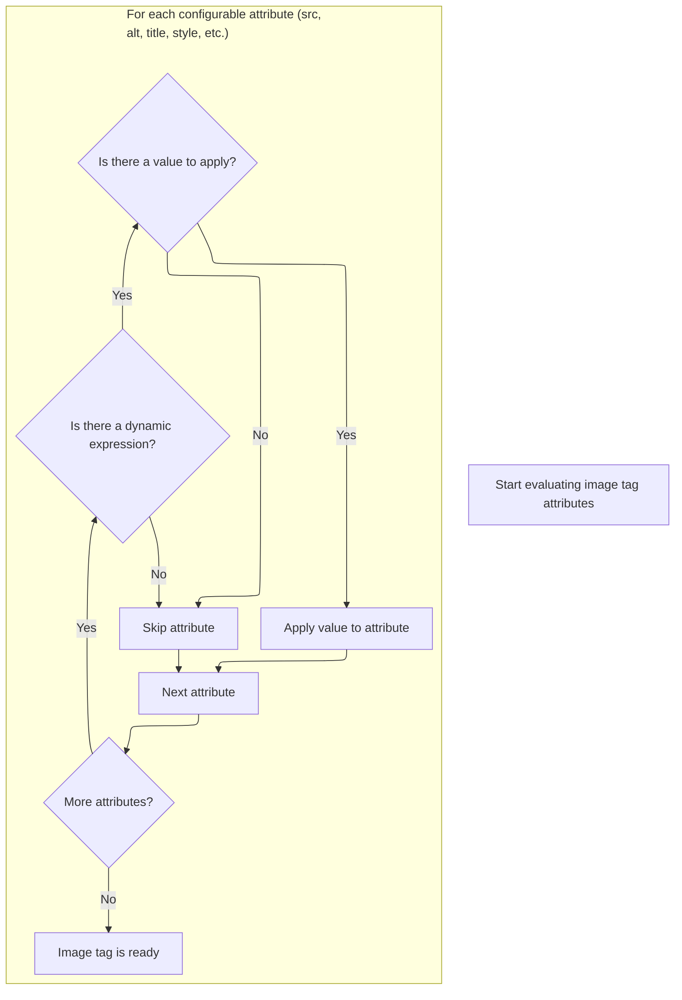

This document describes how image and resource tag attributes are prepared for rendering by resolving dynamic expressions. This enables dynamic content in the user interface by ensuring all attributes are up-to-date before rendering.

The main steps are:

- Evaluate each attribute for dynamic expressions
- Apply resolved values to the tag
- Handle configuration constraints for certain properties
- Delegate to the parent tag logic for rendering

# Starting the Image Tag Evaluation

<SwmSnippet path="/el/src/main/java/org/apache/strutsel/taglib/html/ELImageTag.java" line="901">

---

In <SwmToken path="el/src/main/java/org/apache/strutsel/taglib/html/ELImageTag.java" pos="901:5:5" line-data="    public int doStartTag() throws JspException {">`doStartTag`</SwmToken>, we immediately resolve all EL-based attributes by calling <SwmToken path="el/src/main/java/org/apache/strutsel/taglib/html/ELImageTag.java" pos="902:1:1" line-data="        evaluateExpressions();">`evaluateExpressions`</SwmToken>. This ensures every dynamic property is up-to-date before the tag logic continues.

```java
    public int doStartTag() throws JspException {
        evaluateExpressions();

```

---

</SwmSnippet>

## Evaluating Image Tag Expressions



<SwmSnippet path="/el/src/main/java/org/apache/strutsel/taglib/html/ELImageTag.java" line="913">

---

In <SwmToken path="el/src/main/java/org/apache/strutsel/taglib/html/ELImageTag.java" pos="913:5:5" line-data="    private void evaluateExpressions()">`evaluateExpressions`</SwmToken>, we loop through and resolve each EL attribute for the image tag. When we get to the bundle attribute, we call <SwmToken path="el/src/main/java/org/apache/strutsel/taglib/html/ELImageTag.java" pos="951:1:1" line-data="            setBundle(string);">`setBundle`</SwmToken>, which might throw if the config is locked, so we need to handle that before moving on.

```java
    private void evaluateExpressions()
        throws JspException {
        String string = null;
        Boolean bool = null;

        if ((string =
                EvalHelper.evalString("accessKey", getAccesskeyExpr(), this,
                    pageContext)) != null) {
            setAccesskey(string);
        }

        //  The "align" attribute is deprecated.  This needs to be removed when
        //  the "align" attribute is finally removed.
        if ((string =
                EvalHelper.evalString("align", getAlignExpr(), this, pageContext)) != null) {
            setAlign(string);
        }

        if ((string =
                EvalHelper.evalString("alt", getAltExpr(), this, pageContext)) != null) {
            setAlt(string);
        }

        if ((string =
                EvalHelper.evalString("altKey", getAltKeyExpr(), this,
                    pageContext)) != null) {
            setAltKey(string);
        }

        if ((string =
                EvalHelper.evalString("border", getBorderExpr(), this,
                    pageContext)) != null) {
            setBorder(string);
        }

        if ((string =
                EvalHelper.evalString("bundle", getBundleExpr(), this,
                    pageContext)) != null) {
            setBundle(string);
        }

```

---

</SwmSnippet>

<SwmSnippet path="/core/src/main/java/org/apache/struts/config/ExceptionConfig.java" line="89">

---

<SwmToken path="core/src/main/java/org/apache/struts/config/ExceptionConfig.java" pos="89:5:5" line-data="    public void setBundle(String bundle) {">`setBundle`</SwmToken> checks if the config is frozen using the 'configured' flag. If it's set, it throws, so you can't change the bundle after config is finalized. This isn't obvious unless you look at the code.

```java
    public void setBundle(String bundle) {
        if (configured) {
            throw new IllegalStateException("Configuration is frozen");
        }

        this.bundle = bundle;
    }
```

---

</SwmSnippet>

<SwmSnippet path="/el/src/main/java/org/apache/strutsel/taglib/html/ELImageTag.java" line="954">

---

Back in `ELImageTag.evaluateExpressions`, after handling bundle, we keep resolving and setting other attributes. When we get to module, we call <SwmToken path="el/src/main/java/org/apache/strutsel/taglib/html/ELImageTag.java" pos="987:1:1" line-data="            setModule(string);">`setModule`</SwmToken>, which also checks if config changes are allowed.

```java
        if ((string =
        		EvalHelper.evalString("dir", getDirExpr(), this,
        			pageContext)) != null) {
        	setDir(string);
        }
        
        if ((bool =
                EvalHelper.evalBoolean("disabled", getDisabledExpr(), this,
                    pageContext)) != null) {
            setDisabled(bool.booleanValue());
        }

        if ((bool =
                EvalHelper.evalBoolean("indexed", getIndexedExpr(), this,
                    pageContext)) != null) {
            setIndexed(bool.booleanValue());
        }

        if ((string =
            	EvalHelper.evalString("lang", getLangExpr(), this,
            		pageContext)) != null) {
        	setLang(string);
        }

        if ((string =
                EvalHelper.evalString("locale", getLocaleExpr(), this,
                    pageContext)) != null) {
            setLocale(string);
        }

        if ((string =
                EvalHelper.evalString("module", getModuleExpr(), this,
                    pageContext)) != null) {
            setModule(string);
        }

```

---

</SwmSnippet>

<SwmSnippet path="/core/src/main/java/org/apache/struts/config/ForwardConfig.java" line="210">

---

<SwmToken path="core/src/main/java/org/apache/struts/config/ForwardConfig.java" pos="210:5:5" line-data="    public void setModule(String module) {">`setModule`</SwmToken> works like <SwmToken path="el/src/main/java/org/apache/strutsel/taglib/html/ELImageTag.java" pos="951:1:1" line-data="            setBundle(string);">`setBundle`</SwmToken>—it checks the 'configured' flag and throws if config is frozen. This keeps the module property locked after setup, so you can't mess with it at runtime.

```java
    public void setModule(String module) {
        if (configured) {
            throw new IllegalStateException("Configuration is frozen");
        }

        this.module = module;
    }
```

---

</SwmSnippet>

<SwmSnippet path="/el/src/main/java/org/apache/strutsel/taglib/html/ELImageTag.java" line="990">

---

After returning from <SwmToken path="el/src/main/java/org/apache/strutsel/taglib/html/ELImageTag.java" pos="987:1:1" line-data="            setModule(string);">`setModule`</SwmToken> in `ELImageTag.evaluateExpressions`, we keep resolving the rest of the tag's attributes—stuff like event handlers, style, and so on—so everything is set up before rendering.

```java
        if ((string =
                EvalHelper.evalString("onblur", getOnblurExpr(), this,
                    pageContext)) != null) {
            setOnblur(string);
        }

        if ((string =
                EvalHelper.evalString("onchange", getOnchangeExpr(), this,
                    pageContext)) != null) {
            setOnchange(string);
        }

        if ((string =
                EvalHelper.evalString("onclick", getOnclickExpr(), this,
                    pageContext)) != null) {
            setOnclick(string);
        }

        if ((string =
                EvalHelper.evalString("ondblclick", getOndblclickExpr(), this,
                    pageContext)) != null) {
            setOndblclick(string);
        }

        if ((string =
                EvalHelper.evalString("onfocus", getOnfocusExpr(), this,
                    pageContext)) != null) {
            setOnfocus(string);
        }

        if ((string =
                EvalHelper.evalString("onkeydown", getOnkeydownExpr(), this,
                    pageContext)) != null) {
            setOnkeydown(string);
        }

        if ((string =
                EvalHelper.evalString("onkeypress", getOnkeypressExpr(), this,
                    pageContext)) != null) {
            setOnkeypress(string);
        }

        if ((string =
                EvalHelper.evalString("onkeyup", getOnkeyupExpr(), this,
                    pageContext)) != null) {
            setOnkeyup(string);
        }

        if ((string =
                EvalHelper.evalString("onmousedown", getOnmousedownExpr(),
                    this, pageContext)) != null) {
            setOnmousedown(string);
        }

        if ((string =
                EvalHelper.evalString("onmousemove", getOnmousemoveExpr(),
                    this, pageContext)) != null) {
            setOnmousemove(string);
        }

        if ((string =
                EvalHelper.evalString("onmouseout", getOnmouseoutExpr(), this,
                    pageContext)) != null) {
            setOnmouseout(string);
        }

        if ((string =
                EvalHelper.evalString("onmouseover", getOnmouseoverExpr(),
                    this, pageContext)) != null) {
            setOnmouseover(string);
        }

        if ((string =
                EvalHelper.evalString("onmouseup", getOnmouseupExpr(), this,
                    pageContext)) != null) {
            setOnmouseup(string);
        }

        if ((string =
                EvalHelper.evalString("page", getPageExpr(), this, pageContext)) != null) {
            setPage(string);
        }

        if ((string =
                EvalHelper.evalString("pageKey", getPageKeyExpr(), this,
                    pageContext)) != null) {
            setPageKey(string);
        }

        if ((string =
                EvalHelper.evalString("property", getPropertyExpr(), this,
                    pageContext)) != null) {
            setProperty(string);
        }

        if ((string =
                EvalHelper.evalString("src", getSrcExpr(), this, pageContext)) != null) {
            setSrc(string);
        }

        if ((string =
                EvalHelper.evalString("srcKey", getSrcKeyExpr(), this,
                    pageContext)) != null) {
            setSrcKey(string);
        }

        if ((string =
                EvalHelper.evalString("style", getStyleExpr(), this, pageContext)) != null) {
            setStyle(string);
        }

        if ((string =
                EvalHelper.evalString("styleClass", getStyleClassExpr(), this,
                    pageContext)) != null) {
            setStyleClass(string);
        }

        if ((string =
                EvalHelper.evalString("styleId", getStyleIdExpr(), this,
                    pageContext)) != null) {
            setStyleId(string);
        }

        if ((string =
                EvalHelper.evalString("tabindex", getTabindexExpr(), this,
                    pageContext)) != null) {
            setTabindex(string);
        }

        if ((string =
                EvalHelper.evalString("title", getTitleExpr(), this, pageContext)) != null) {
            setTitle(string);
        }

        if ((string =
                EvalHelper.evalString("titleKey", getTitleKeyExpr(), this,
                    pageContext)) != null) {
            setTitleKey(string);
        }

        if ((string =
                EvalHelper.evalString("value", getValueExpr(), this, pageContext)) != null) {
            setValue(string);
        }
    }
```

---

</SwmSnippet>

## Delegating to Superclass Tag Logic

<SwmSnippet path="/el/src/main/java/org/apache/strutsel/taglib/html/ELImageTag.java" line="904">

---

After `ELImageTag.evaluateExpressions` finishes, <SwmToken path="el/src/main/java/org/apache/strutsel/taglib/html/ELImageTag.java" pos="904:6:6" line-data="        return (super.doStartTag());">`doStartTag`</SwmToken> hands off to the superclass. The parent logic takes over, using all the resolved attributes to do the real tag work. Next, the flow moves to resource tag processing if needed.

```java
        return (super.doStartTag());
    }
```

---

</SwmSnippet>

# Starting the Resource Tag Evaluation

<SwmSnippet path="/el/src/main/java/org/apache/strutsel/taglib/bean/ELResourceTag.java" line="120">

---

<SwmToken path="el/src/main/java/org/apache/strutsel/taglib/bean/ELResourceTag.java" pos="120:5:5" line-data="    public int doStartTag() throws JspException {">`doStartTag`</SwmToken> in the resource tag does the same thing—runs <SwmToken path="el/src/main/java/org/apache/strutsel/taglib/bean/ELResourceTag.java" pos="121:1:1" line-data="        evaluateExpressions();">`evaluateExpressions`</SwmToken> to resolve any EL attributes before passing control to the parent tag logic.

```java
    public int doStartTag() throws JspException {
        evaluateExpressions();

        return (super.doStartTag());
    }
```

---

</SwmSnippet>

# Evaluating Resource Tag Expressions

```mermaid
%%{init: {"flowchart": {"defaultRenderer": "elk"}} }%%
flowchart TD
  node1["Start evaluating resource expressions"]
  click node1 openCode "el/src/main/java/org/apache/strutsel/taglib/bean/ELResourceTag.java:132:135"
  node1 --> node2{"Is 'id' expression non-null?"}
  click node2 openCode "el/src/main/java/org/apache/strutsel/taglib/bean/ELResourceTag.java:136:139"
  node2 -->|"Yes"| node3["Update resource id"]
  click node3 openCode "el/src/main/java/org/apache/strutsel/taglib/bean/ELResourceTag.java:138:139"
  node2 -->|"No"| node4
  node3 --> node4
  node4{"Is 'input' expression non-null?"}
  click node4 openCode "el/src/main/java/org/apache/strutsel/taglib/bean/ELResourceTag.java:141:144"
  node4 -->|"Yes"| node5["Update resource input"]
  click node5 openCode "el/src/main/java/org/apache/strutsel/taglib/bean/ELResourceTag.java:143:144"
  node4 -->|"No"| node6
  node5 --> node6
  node6{"Is 'name' expression non-null?"}
  click node6 openCode "el/src/main/java/org/apache/strutsel/taglib/bean/ELResourceTag.java:146:149"
  node6 -->|"Yes"| node7["Update resource name"]
  click node7 openCode "el/src/main/java/org/apache/strutsel/taglib/bean/ELResourceTag.java:148:149"
  node6 -->|"No"| node8["Done"]
  click node8 openCode "el/src/main/java/org/apache/strutsel/taglib/bean/ELResourceTag.java:150:150"

classDef HeadingStyle fill:#777777,stroke:#333,stroke-width:2px;

%% Swimm:
%% %%{init: {"flowchart": {"defaultRenderer": "elk"}} }%%
%% flowchart TD
%%   node1["Start evaluating resource expressions"]
%%   click node1 openCode "<SwmPath>[el/…/bean/ELResourceTag.java](el/src/main/java/org/apache/strutsel/taglib/bean/ELResourceTag.java)</SwmPath>:132:135"
%%   node1 --> node2{"Is 'id' expression non-null?"}
%%   click node2 openCode "<SwmPath>[el/…/bean/ELResourceTag.java](el/src/main/java/org/apache/strutsel/taglib/bean/ELResourceTag.java)</SwmPath>:136:139"
%%   node2 -->|"Yes"| node3["Update resource id"]
%%   click node3 openCode "<SwmPath>[el/…/bean/ELResourceTag.java](el/src/main/java/org/apache/strutsel/taglib/bean/ELResourceTag.java)</SwmPath>:138:139"
%%   node2 -->|"No"| node4
%%   node3 --> node4
%%   node4{"Is 'input' expression non-null?"}
%%   click node4 openCode "<SwmPath>[el/…/bean/ELResourceTag.java](el/src/main/java/org/apache/strutsel/taglib/bean/ELResourceTag.java)</SwmPath>:141:144"
%%   node4 -->|"Yes"| node5["Update resource input"]
%%   click node5 openCode "<SwmPath>[el/…/bean/ELResourceTag.java](el/src/main/java/org/apache/strutsel/taglib/bean/ELResourceTag.java)</SwmPath>:143:144"
%%   node4 -->|"No"| node6
%%   node5 --> node6
%%   node6{"Is 'name' expression non-null?"}
%%   click node6 openCode "<SwmPath>[el/…/bean/ELResourceTag.java](el/src/main/java/org/apache/strutsel/taglib/bean/ELResourceTag.java)</SwmPath>:146:149"
%%   node6 -->|"Yes"| node7["Update resource name"]
%%   click node7 openCode "<SwmPath>[el/…/bean/ELResourceTag.java](el/src/main/java/org/apache/strutsel/taglib/bean/ELResourceTag.java)</SwmPath>:148:149"
%%   node6 -->|"No"| node8["Done"]
%%   click node8 openCode "<SwmPath>[el/…/bean/ELResourceTag.java](el/src/main/java/org/apache/strutsel/taglib/bean/ELResourceTag.java)</SwmPath>:150:150"
%% 
%% classDef HeadingStyle fill:#777777,stroke:#333,stroke-width:2px;
```



<SwmSnippet path="/el/src/main/java/org/apache/strutsel/taglib/bean/ELResourceTag.java" line="132">

---

In <SwmToken path="el/src/main/java/org/apache/strutsel/taglib/bean/ELResourceTag.java" pos="132:5:5" line-data="    private void evaluateExpressions()">`evaluateExpressions`</SwmToken> for the resource tag, we resolve id and input. When input is set, we call <SwmToken path="el/src/main/java/org/apache/strutsel/taglib/bean/ELResourceTag.java" pos="143:1:1" line-data="            setInput(string);">`setInput`</SwmToken>, which might throw if config is locked, so we need to handle that before moving on.

```java
    private void evaluateExpressions()
        throws JspException {
        String string = null;

        if ((string =
                EvalHelper.evalString("id", getIdExpr(), this, pageContext)) != null) {
            setId(string);
        }

        if ((string =
                EvalHelper.evalString("input", getInputExpr(), this, pageContext)) != null) {
            setInput(string);
        }

```

---

</SwmSnippet>

<SwmSnippet path="/core/src/main/java/org/apache/struts/config/ActionConfig.java" line="473">

---

<SwmToken path="core/src/main/java/org/apache/struts/config/ActionConfig.java" pos="473:5:5" line-data="    public void setInput(String input) {">`setInput`</SwmToken> checks the 'configured' flag and throws if config is frozen. This keeps the input property locked after setup, so you can't change it at runtime.

```java
    public void setInput(String input) {
        if (configured) {
            throw new IllegalStateException("Configuration is frozen");
        }

        this.input = input;
    }
```

---

</SwmSnippet>

<SwmSnippet path="/el/src/main/java/org/apache/strutsel/taglib/bean/ELResourceTag.java" line="146">

---

After returning from <SwmToken path="el/src/main/java/org/apache/strutsel/taglib/bean/ELResourceTag.java" pos="143:1:1" line-data="            setInput(string);">`setInput`</SwmToken> in `ELResourceTag.evaluateExpressions`, we keep resolving the rest of the tag's attributes—like name—so everything is set up before the tag is used.

```java
        if ((string =
                EvalHelper.evalString("name", getNameExpr(), this, pageContext)) != null) {
            setName(string);
        }
    }
```

---

</SwmSnippet>

&nbsp;

*This is an auto-generated document by Swimm 🌊 and has not yet been verified by a human*

<SwmMeta version="3.0.0" repo-id="Z2l0aHViJTNBJTNBc3RydXRzMSUzQSUzQVN3aW1tLURlbW8=" repo-name="struts1"><sup>Powered by [Swimm](https://app.swimm.io/)</sup></SwmMeta>
