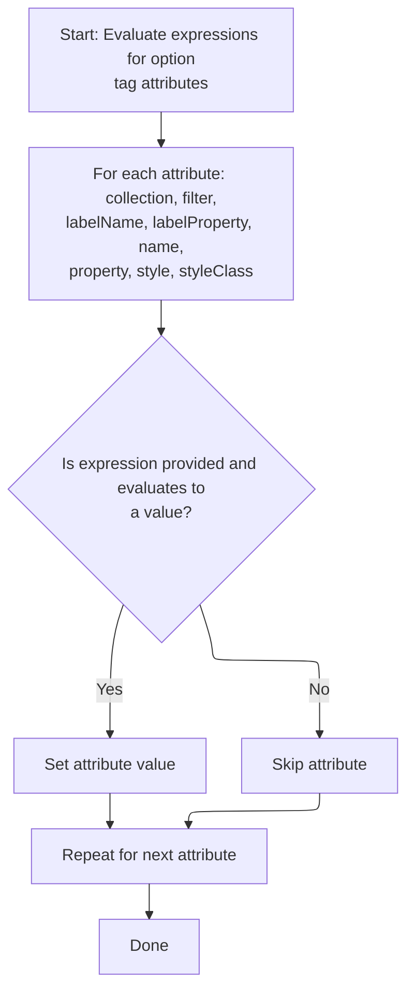

This document describes how tag attributes are prepared for rendering by evaluating any dynamic expressions they contain. Each attribute is checked and, if an expression is present, it is resolved to ensure the tag uses the latest values from the page context. This enables dynamic and context-sensitive rendering of UI components.

# Starting the tag evaluation

<SwmSnippet path="/el/src/main/java/org/apache/strutsel/taglib/html/ELOptionsTag.java" line="239">

---

<SwmToken path="el/src/main/java/org/apache/strutsel/taglib/html/ELOptionsTag.java" pos="239:5:5" line-data="    public int doStartTag() throws JspException {">`doStartTag`</SwmToken> triggers the evaluation of any dynamic expressions set on the tag before delegating to the parent tag's logic. We call <SwmToken path="el/src/main/java/org/apache/strutsel/taglib/html/ELOptionsTag.java" pos="240:1:1" line-data="        evaluateExpressions();">`evaluateExpressions`</SwmToken> here to make sure all tag attributes are up-to-date with the latest values from the page context before rendering.

```java
    public int doStartTag() throws JspException {
        evaluateExpressions();

        return (super.doStartTag());
    }
```

---

</SwmSnippet>

# Evaluating tag attribute expressions



<SwmSnippet path="/el/src/main/java/org/apache/strutsel/taglib/html/ELOptionsTag.java" line="251">

---

In <SwmToken path="el/src/main/java/org/apache/strutsel/taglib/html/ELOptionsTag.java" pos="251:5:5" line-data="    private void evaluateExpressions()">`evaluateExpressions`</SwmToken>, we resolve each attribute that might be set as an expression in the JSP. We call into <SwmToken path="el/src/main/java/org/apache/strutsel/taglib/html/ELOptionsTag.java" pos="257:1:1" line-data="                EvalHelper.evalString(&quot;collection&quot;, getCollectionExpr(), this,">`EvalHelper`</SwmToken> next to actually evaluate these expressions, so we can handle both static and dynamic values.

```java
    private void evaluateExpressions()
        throws JspException {
        String string = null;
        Boolean bool = null;

        if ((string =
                EvalHelper.evalString("collection", getCollectionExpr(), this,
                    pageContext)) != null) {
            setCollection(string);
        }

        if ((bool =
                EvalHelper.evalBoolean("filter", getFilterExpr(), this,
                    pageContext)) != null) {
```

---

</SwmSnippet>

<SwmSnippet path="/el/src/main/java/org/apache/strutsel/taglib/utils/EvalHelper.java" line="102">

---

<SwmToken path="el/src/main/java/org/apache/strutsel/taglib/utils/EvalHelper.java" pos="102:7:7" line-data="    public static Boolean evalBoolean(String attrName, String attrValue,">`evalBoolean`</SwmToken> evaluates a string expression as a Boolean in the context of the current tag and page. It uses the JSP <SwmToken path="el/src/main/java/org/apache/strutsel/taglib/utils/EvalHelper.java" pos="109:1:1" line-data="                ExpressionEvaluatorManager.evaluate(attrName, attrValue,">`ExpressionEvaluatorManager`</SwmToken>, so it can handle runtime expressions, not just static values.

```java
    public static Boolean evalBoolean(String attrName, String attrValue,
        Tag tagObject, PageContext pageContext)
        throws JspException {
        Object result = null;

        if (attrValue != null) {
            result =
                ExpressionEvaluatorManager.evaluate(attrName, attrValue,
                    Boolean.class, tagObject, pageContext);
        }

        return ((Boolean) result);
    }
```

---

</SwmSnippet>

<SwmSnippet path="/el/src/main/java/org/apache/strutsel/taglib/html/ELOptionsTag.java" line="265">

---

Back in <SwmToken path="el/src/main/java/org/apache/strutsel/taglib/html/ELOptionsTag.java" pos="240:1:1" line-data="        evaluateExpressions();">`evaluateExpressions`</SwmToken>, after evaluating the filter expression, we set the filter property on the component. Next, we call into the setter to update the internal state, which controls how output is processed.

```java
            setFilter(bool.booleanValue());
        }

```

---

</SwmSnippet>

<SwmSnippet path="/faces/src/main/java/org/apache/struts/faces/component/WriteComponent.java" line="114">

---

<SwmToken path="faces/src/main/java/org/apache/struts/faces/component/WriteComponent.java" pos="114:5:5" line-data="    public void setFilter(boolean filter) {">`setFilter`</SwmToken> updates the filter flag and marks <SwmToken path="faces/src/main/java/org/apache/struts/faces/component/WriteComponent.java" pos="117:3:3" line-data="        this.filterSet = true;">`filterSet`</SwmToken> as true, so the component knows the filter was explicitly set, not just left at its default.

```java
    public void setFilter(boolean filter) {

        this.filter = filter;
        this.filterSet = true;

    }
```

---

</SwmSnippet>

<SwmSnippet path="/el/src/main/java/org/apache/strutsel/taglib/html/ELOptionsTag.java" line="268">

---

After setting the filter, <SwmToken path="el/src/main/java/org/apache/strutsel/taglib/html/ELOptionsTag.java" pos="240:1:1" line-data="        evaluateExpressions();">`evaluateExpressions`</SwmToken> continues by resolving and setting other string attributes like <SwmToken path="el/src/main/java/org/apache/strutsel/taglib/html/ELOptionsTag.java" pos="269:6:6" line-data="                EvalHelper.evalString(&quot;labelName&quot;, getLabelNameExpr(), this,">`labelName`</SwmToken>, name, and style. There's a comment explaining why <SwmToken path="el/src/main/java/org/apache/strutsel/taglib/html/ELOptionsTag.java" pos="303:23:23" line-data="        // &quot;styleClass&quot; attributes, this tag does not have a &quot;styleId&quot;">`styleId`</SwmToken> isn't supported—since the tag can generate multiple options, unique ids can't be guaranteed.

```java
        if ((string =
                EvalHelper.evalString("labelName", getLabelNameExpr(), this,
                    pageContext)) != null) {
            setLabelName(string);
        }

        if ((string =
                EvalHelper.evalString("labelProperty", getLabelPropertyExpr(),
                    this, pageContext)) != null) {
            setLabelProperty(string);
        }

        if ((string =
                EvalHelper.evalString("name", getNameExpr(), this, pageContext)) != null) {
            setName(string);
        }

        if ((string =
                EvalHelper.evalString("property", getPropertyExpr(), this,
                    pageContext)) != null) {
            setProperty(string);
        }

        if ((string =
                EvalHelper.evalString("style", getStyleExpr(), this, pageContext)) != null) {
            setStyle(string);
        }

        if ((string =
                EvalHelper.evalString("styleClass", getStyleClassExpr(), this,
                    pageContext)) != null) {
            setStyleClass(string);
        }

        // Note that in contrast to other elements which have "style" and
        // "styleClass" attributes, this tag does not have a "styleId"
        // attribute.  This is because this produces the "id" attribute, which
        // has to be unique document-wide, but this tag can generate more than
        // one "option" element.  Thus, the base tag, "Options" does not
        // support this attribute.
    }
```

---

</SwmSnippet>

&nbsp;

*This is an auto-generated document by Swimm 🌊 and has not yet been verified by a human*

<SwmMeta version="3.0.0" repo-id="Z2l0aHViJTNBJTNBc3RydXRzMSUzQSUzQVN3aW1tLURlbW8=" repo-name="struts1"><sup>Powered by [Swimm](https://app.swimm.io/)</sup></SwmMeta>
