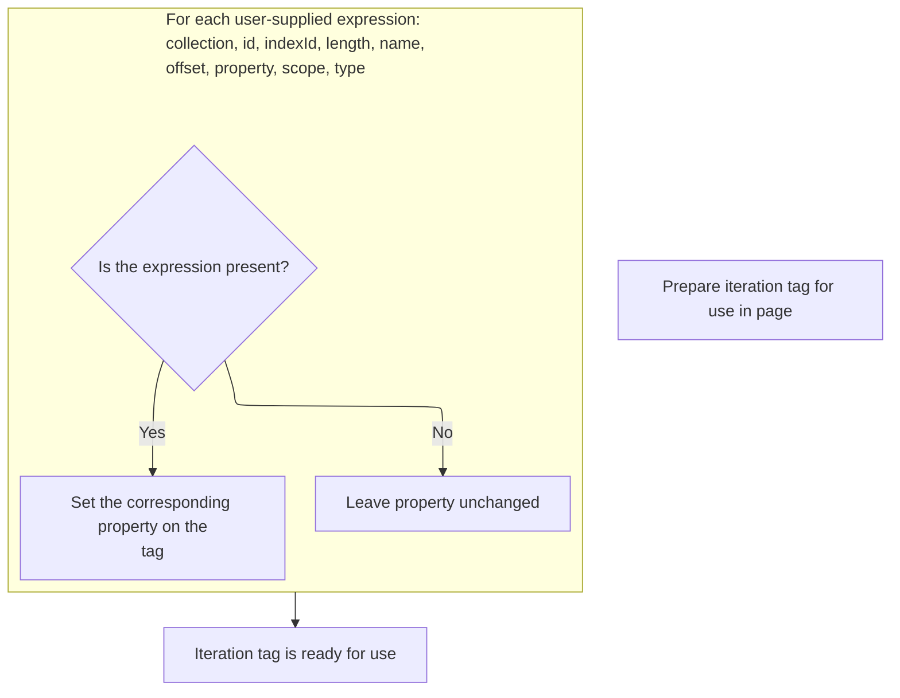

This document outlines how tag attributes are prepared for use in JSP pages by evaluating dynamic expressions and updating configurations. The process ensures that all attributes reflect their correct runtime values before the tag continues through its lifecycle.

# Starting the iteration tag evaluation

<SwmSnippet path="/el/src/main/java/org/apache/strutsel/taglib/logic/ELIterateTag.java" line="261">

---

In <SwmToken path="el/src/main/java/org/apache/strutsel/taglib/logic/ELIterateTag.java" pos="261:5:5" line-data="    public int doStartTag() throws JspException {">`doStartTag`</SwmToken>, we kick off by evaluating any dynamic expressions tied to the tag's attributes. This ensures that all values are up-to-date and ready for use before the tag logic continues. We call ELIterateTag.evaluateExpressions next to resolve these expressions so the tag can work with the actual runtime values instead of just static ones.

```java
    public int doStartTag() throws JspException {
        evaluateExpressions();

```

---

</SwmSnippet>

## Resolving tag attribute expressions and updating configs



<SwmSnippet path="/el/src/main/java/org/apache/strutsel/taglib/logic/ELIterateTag.java" line="273">

---

In <SwmToken path="el/src/main/java/org/apache/strutsel/taglib/logic/ELIterateTag.java" pos="273:5:5" line-data="    private void evaluateExpressions()">`evaluateExpressions`</SwmToken>, we start resolving the tag's attribute expressions, beginning with 'collection'. We use <SwmToken path="el/src/main/java/org/apache/strutsel/taglib/logic/ELIterateTag.java" pos="279:1:3" line-data="                EvalHelper.eval(&quot;collection&quot;, getCollectionExpr(), this,">`EvalHelper.eval`</SwmToken> to turn the expression string into an actual object, so the tag can iterate over the right collection. This step is needed to make sure we're working with the correct runtime data.

```java
    private void evaluateExpressions()
        throws JspException {
        String string = null;
        Object object = null;

        if ((object =
                EvalHelper.eval("collection", getCollectionExpr(), this,
                    pageContext)) != null) {
            setCollection(object);
        }

```

---

</SwmSnippet>

<SwmSnippet path="/el/src/main/java/org/apache/strutsel/taglib/utils/EvalHelper.java" line="45">

---

<SwmToken path="el/src/main/java/org/apache/strutsel/taglib/utils/EvalHelper.java" pos="45:7:7" line-data="    public static Object eval(String attrName, String attrValue, Tag tagObject,">`eval`</SwmToken> checks if the attribute value is present and, if so, uses <SwmToken path="el/src/main/java/org/apache/strutsel/taglib/utils/EvalHelper.java" pos="52:1:1" line-data="                ExpressionEvaluatorManager.evaluate(attrName, attrValue,">`ExpressionEvaluatorManager`</SwmToken> to evaluate it in the tag and page context. This lets us safely resolve dynamic expressions for tag attributes, relying on the JSP infrastructure to handle errors and type conversion.

```java
    public static Object eval(String attrName, String attrValue, Tag tagObject,
        PageContext pageContext)
        throws JspException {
        Object result = null;

        if (attrValue != null) {
            result =
                ExpressionEvaluatorManager.evaluate(attrName, attrValue,
                    Object.class, tagObject, pageContext);
        }

        return (result);
    }
```

---

</SwmSnippet>

<SwmSnippet path="/el/src/main/java/org/apache/strutsel/taglib/logic/ELIterateTag.java" line="284">

---

Back in <SwmToken path="el/src/main/java/org/apache/strutsel/taglib/logic/ELIterateTag.java" pos="262:1:1" line-data="        evaluateExpressions();">`evaluateExpressions`</SwmToken>, after resolving the collection, we run through each attribute, evaluating and setting them if expressions are present. When we hit 'scope', we need to update the configuration, so we call <SwmToken path="core/src/main/java/org/apache/struts/config/ActionConfig.java" pos="41:4:4" line-data="public class ActionConfig extends BaseConfig {">`ActionConfig`</SwmToken> to handle scope assignment, making sure the tag's variables are stored in the right context.

```java
        if ((string =
                EvalHelper.evalString("id", getIdExpr(), this, pageContext)) != null) {
            setId(string);
        }

        if ((string =
                EvalHelper.evalString("indexId", getIndexIdExpr(), this,
                    pageContext)) != null) {
            setIndexId(string);
        }

        if ((string =
                EvalHelper.evalString("length", getLengthExpr(), this,
                    pageContext)) != null) {
            setLength(string);
        }

        if ((string =
                EvalHelper.evalString("name", getNameExpr(), this, pageContext)) != null) {
            setName(string);
        }

        if ((string =
                EvalHelper.evalString("offset", getOffsetExpr(), this,
                    pageContext)) != null) {
            setOffset(string);
        }

        if ((string =
                EvalHelper.evalString("property", getPropertyExpr(), this,
                    pageContext)) != null) {
            setProperty(string);
        }

        if ((string =
                EvalHelper.evalString("scope", getScopeExpr(), this, pageContext)) != null) {
            setScope(string);
        }

```

---

</SwmSnippet>

<SwmSnippet path="/core/src/main/java/org/apache/struts/config/ActionConfig.java" line="652">

---

<SwmToken path="core/src/main/java/org/apache/struts/config/ActionConfig.java" pos="652:5:5" line-data="    public void setScope(String scope) {">`setScope`</SwmToken> checks if the config is locked (configured). If not, it updates the scope; otherwise, it throws an exception to prevent changes after the config is finalized. This keeps the config consistent and avoids runtime surprises.

```java
    public void setScope(String scope) {
        if (configured) {
            throw new IllegalStateException("Configuration is frozen");
        }

        this.scope = scope;
    }
```

---

</SwmSnippet>

<SwmSnippet path="/el/src/main/java/org/apache/strutsel/taglib/logic/ELIterateTag.java" line="323">

---

After updating the scope, we finish up <SwmToken path="el/src/main/java/org/apache/strutsel/taglib/logic/ELIterateTag.java" pos="262:1:1" line-data="        evaluateExpressions();">`evaluateExpressions`</SwmToken> by checking for a 'type' expression. If present, we call <SwmToken path="core/src/main/java/org/apache/struts/config/FormBeanConfig.java" pos="50:4:4" line-data="public class FormBeanConfig extends BaseConfig {">`FormBeanConfig`</SwmToken> to set it, which decides if the form bean is dynamic or not, impacting how the form behaves in the JSP.

```java
        if ((string =
                EvalHelper.evalString("type", getTypeExpr(), this, pageContext)) != null) {
            setType(string);
        }
    }
```

---

</SwmSnippet>

<SwmSnippet path="/core/src/main/java/org/apache/struts/config/FormBeanConfig.java" line="161">

---

<SwmToken path="core/src/main/java/org/apache/struts/config/FormBeanConfig.java" pos="161:5:5" line-data="    public void setType(String type) {">`setType`</SwmToken> first checks if config changes are allowed, then updates the type and figures out if the form bean is dynamic by checking its class against <SwmToken path="core/src/main/java/org/apache/struts/config/FormBeanConfig.java" pos="165:7:7" line-data="        Class dynaBeanClass = DynaActionForm.class;">`DynaActionForm`</SwmToken>. This affects how the form bean is handled in the framework, toggling dynamic behavior based on the class hierarchy.

```java
    public void setType(String type) {
        throwIfConfigured();
        this.type = type;

        Class dynaBeanClass = DynaActionForm.class;
        Class formBeanClass = formBeanClass();

        if (formBeanClass != null) {
            if (dynaBeanClass.isAssignableFrom(formBeanClass)) {
                this.dynamic = true;
            } else {
                this.dynamic = false;
            }
        } else {
            this.dynamic = false;
        }
    }
```

---

</SwmSnippet>

## Delegating tag processing to parent logic

<SwmSnippet path="/el/src/main/java/org/apache/strutsel/taglib/logic/ELIterateTag.java" line="264">

---

After finishing up ELIterateTag.evaluateExpressions, we call <SwmToken path="el/src/main/java/org/apache/strutsel/taglib/logic/ELIterateTag.java" pos="264:4:6" line-data="        return (super.doStartTag());">`super.doStartTag`</SwmToken> in ELIterateTag.doStartTag. This hands control to the parent tag handler, which takes care of the standard tag processing. We need to call <SwmToken path="el/src/main/java/org/apache/strutsel/taglib/bean/ELResourceTag.java" pos="38:4:4" line-data="public class ELResourceTag extends ResourceTag {">`ELResourceTag`</SwmToken> next because its <SwmToken path="el/src/main/java/org/apache/strutsel/taglib/logic/ELIterateTag.java" pos="264:6:6" line-data="        return (super.doStartTag());">`doStartTag`</SwmToken> also relies on parent logic, continuing the tag lifecycle and making sure any resource-related expressions are handled before moving on.

```java
        return (super.doStartTag());
    }
```

---

</SwmSnippet>

# Starting resource tag evaluation

<SwmSnippet path="/el/src/main/java/org/apache/strutsel/taglib/bean/ELResourceTag.java" line="120">

---

ELResourceTag.doStartTag starts by resolving any expressions for resource attributes, then passes control to the parent tag handler. This makes sure the tag is working with the right values before any further processing happens.

```java
    public int doStartTag() throws JspException {
        evaluateExpressions();

        return (super.doStartTag());
    }
```

---

</SwmSnippet>

# Resolving resource expressions and updating input

```mermaid
%%{init: {"flowchart": {"defaultRenderer": "elk"}} }%%
flowchart TD
    node2{"'id' expression yields value?"}
    click node2 openCode "el/src/main/java/org/apache/strutsel/taglib/bean/ELResourceTag.java:136:139"
    node2 -->|"Yes"| node3["Set id"]
    click node3 openCode "el/src/main/java/org/apache/strutsel/taglib/bean/ELResourceTag.java:138:139"
    node2 -->|"No"| node4{"'input' expression yields value?"}
    click node4 openCode "el/src/main/java/org/apache/strutsel/taglib/bean/ELResourceTag.java:141:144"
    node3 --> node4
    node4 -->|"Yes"| node5["Set input"]
    click node5 openCode "el/src/main/java/org/apache/strutsel/taglib/bean/ELResourceTag.java:143:144"
    node4 -->|"No"| node6{"'name' expression yields value?"}
    click node6 openCode "el/src/main/java/org/apache/strutsel/taglib/bean/ELResourceTag.java:146:149"
    node5 --> node6
    node6 -->|"Yes"| node7["Set name"]
    click node7 openCode "el/src/main/java/org/apache/strutsel/taglib/bean/ELResourceTag.java:148:149"
    node6 -->|"No"| node8["Done"]
    node7 --> node8
    click node8 openCode "el/src/main/java/org/apache/strutsel/taglib/bean/ELResourceTag.java:150:150"

classDef HeadingStyle fill:#777777,stroke:#333,stroke-width:2px;

%% Swimm:
%% %%{init: {"flowchart": {"defaultRenderer": "elk"}} }%%
%% flowchart TD
%%     node2{"'id' expression yields value?"}
%%     click node2 openCode "<SwmPath>[el/…/bean/ELResourceTag.java](el/src/main/java/org/apache/strutsel/taglib/bean/ELResourceTag.java)</SwmPath>:136:139"
%%     node2 -->|"Yes"| node3["Set id"]
%%     click node3 openCode "<SwmPath>[el/…/bean/ELResourceTag.java](el/src/main/java/org/apache/strutsel/taglib/bean/ELResourceTag.java)</SwmPath>:138:139"
%%     node2 -->|"No"| node4{"'input' expression yields value?"}
%%     click node4 openCode "<SwmPath>[el/…/bean/ELResourceTag.java](el/src/main/java/org/apache/strutsel/taglib/bean/ELResourceTag.java)</SwmPath>:141:144"
%%     node3 --> node4
%%     node4 -->|"Yes"| node5["Set input"]
%%     click node5 openCode "<SwmPath>[el/…/bean/ELResourceTag.java](el/src/main/java/org/apache/strutsel/taglib/bean/ELResourceTag.java)</SwmPath>:143:144"
%%     node4 -->|"No"| node6{"'name' expression yields value?"}
%%     click node6 openCode "<SwmPath>[el/…/bean/ELResourceTag.java](el/src/main/java/org/apache/strutsel/taglib/bean/ELResourceTag.java)</SwmPath>:146:149"
%%     node5 --> node6
%%     node6 -->|"Yes"| node7["Set name"]
%%     click node7 openCode "<SwmPath>[el/…/bean/ELResourceTag.java](el/src/main/java/org/apache/strutsel/taglib/bean/ELResourceTag.java)</SwmPath>:148:149"
%%     node6 -->|"No"| node8["Done"]
%%     node7 --> node8
%%     click node8 openCode "<SwmPath>[el/…/bean/ELResourceTag.java](el/src/main/java/org/apache/strutsel/taglib/bean/ELResourceTag.java)</SwmPath>:150:150"
%% 
%% classDef HeadingStyle fill:#777777,stroke:#333,stroke-width:2px;
```



<SwmSnippet path="/el/src/main/java/org/apache/strutsel/taglib/bean/ELResourceTag.java" line="132">

---

In ELResourceTag.evaluateExpressions, we resolve expressions for attributes like 'id' and 'input'. If 'input' is present, we call <SwmToken path="el/src/main/java/org/apache/strutsel/taglib/bean/ELResourceTag.java" pos="143:1:1" line-data="            setInput(string);">`setInput`</SwmToken> to update the action config, making sure the tag uses the right input value. We need to call <SwmToken path="core/src/main/java/org/apache/struts/config/ActionConfig.java" pos="41:4:4" line-data="public class ActionConfig extends BaseConfig {">`ActionConfig`</SwmToken> next because that's where the input value actually gets set and validated.

```java
    private void evaluateExpressions()
        throws JspException {
        String string = null;

        if ((string =
                EvalHelper.evalString("id", getIdExpr(), this, pageContext)) != null) {
            setId(string);
        }

        if ((string =
                EvalHelper.evalString("input", getInputExpr(), this, pageContext)) != null) {
            setInput(string);
        }

```

---

</SwmSnippet>

<SwmSnippet path="/core/src/main/java/org/apache/struts/config/ActionConfig.java" line="473">

---

SetInput checks if the config is frozen using the 'configured' flag. If it's true, it throws an exception to block changes, so input can't be modified after setup. This keeps the config stable and avoids runtime surprises.

```java
    public void setInput(String input) {
        if (configured) {
            throw new IllegalStateException("Configuration is frozen");
        }

        this.input = input;
    }
```

---

</SwmSnippet>

<SwmSnippet path="/el/src/main/java/org/apache/strutsel/taglib/bean/ELResourceTag.java" line="146">

---

After coming back from <SwmToken path="core/src/main/java/org/apache/struts/config/ActionConfig.java" pos="473:5:5" line-data="    public void setInput(String input) {">`setInput`</SwmToken> in <SwmToken path="core/src/main/java/org/apache/struts/config/ActionConfig.java" pos="41:4:4" line-data="public class ActionConfig extends BaseConfig {">`ActionConfig`</SwmToken>, ELResourceTag.evaluateExpressions keeps resolving other attributes like 'name'. If <SwmToken path="core/src/main/java/org/apache/struts/config/ActionConfig.java" pos="473:5:5" line-data="    public void setInput(String input) {">`setInput`</SwmToken> succeeded, we just move on; if it failed, the rest of the attribute setup won't happen.

```java
        if ((string =
                EvalHelper.evalString("name", getNameExpr(), this, pageContext)) != null) {
            setName(string);
        }
    }
```

---

</SwmSnippet>

&nbsp;

*This is an auto-generated document by Swimm 🌊 and has not yet been verified by a human*

<SwmMeta version="3.0.0" repo-id="Z2l0aHViJTNBJTNBc3RydXRzMSUzQSUzQVN3aW1tLURlbW8=" repo-name="struts1"><sup>Powered by [Swimm](https://app.swimm.io/)</sup></SwmMeta>
