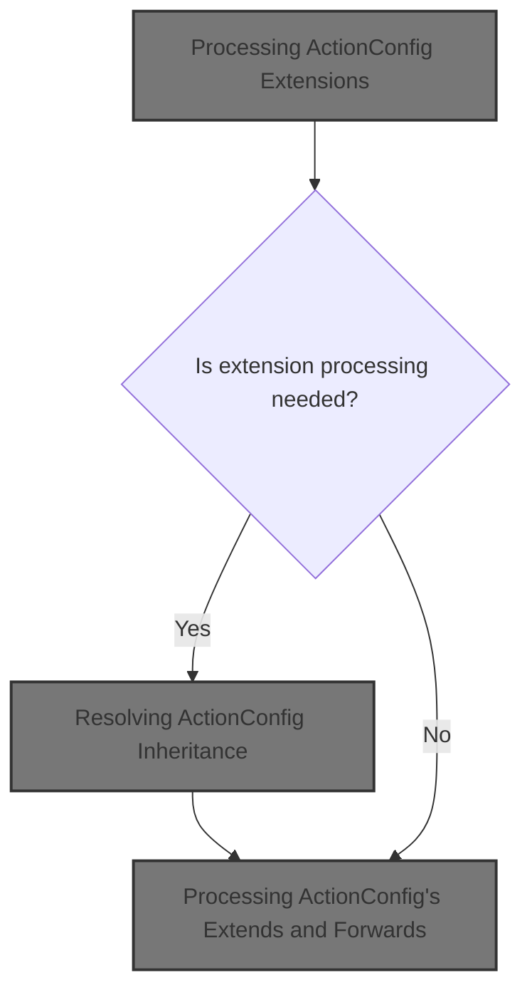

```mermaid
%%{init: {"flowchart": {"defaultRenderer": "elk"}} }%%
flowchart TD
    node1["Assign module config to action config"]
    click node1 openCode "core/src/main/java/org/apache/struts/config/impl/ModuleConfigImpl.java:289:290"
    node1 --> node2{"Is action path already registered?"}
    click node2 openCode "core/src/main/java/org/apache/struts/config/impl/ModuleConfigImpl.java:293:295"
    node2 -->|"Yes"| node3["Warn: Overriding existing action config
for path"]
    click node3 openCode "core/src/main/java/org/apache/struts/config/impl/ModuleConfigImpl.java:294:295"
    node3 --> node4{"Does config have a non-empty action ID?"}
    click node4 openCode "core/src/main/java/org/apache/struts/config/impl/ModuleConfigImpl.java:298:313"
    node2 -->|"No"| node4
    node4 -->|"Yes"| node5{"Is action ID already registered?"}
    click node5 openCode "core/src/main/java/org/apache/struts/config/impl/ModuleConfigImpl.java:299:311"
    node4 -->|"No"| node8["Register action config by path and add
to list"]
    click node8 openCode "core/src/main/java/org/apache/struts/config/impl/ModuleConfigImpl.java:315:317"
    node5 -->|"Yes"| node6["Warn: Overriding existing action config
for action ID"]
    click node6 openCode "core/src/main/java/org/apache/struts/config/impl/ModuleConfigImpl.java:300:310"
    node6 --> node7["Register action config by action ID"]
    click node7 openCode "core/src/main/java/org/apache/struts/config/impl/ModuleConfigImpl.java:312:313"
    node5 -->|"No"| node7
    node7 --> node8
classDef HeadingStyle fill:#777777,stroke:#333,stroke-width:2px;

%% Swimm:
%% %%{init: {"flowchart": {"defaultRenderer": "elk"}} }%%
%% flowchart TD
%%     node1["Assign module config to action config"]
%%     click node1 openCode "<SwmPath>[core/…/impl/ModuleConfigImpl.java](core/src/main/java/org/apache/struts/config/impl/ModuleConfigImpl.java)</SwmPath>:289:290"
%%     node1 --> node2{"Is action path already registered?"}
%%     click node2 openCode "<SwmPath>[core/…/impl/ModuleConfigImpl.java](core/src/main/java/org/apache/struts/config/impl/ModuleConfigImpl.java)</SwmPath>:293:295"
%%     node2 -->|"Yes"| node3["Warn: Overriding existing action config
%% for path"]
%%     click node3 openCode "<SwmPath>[core/…/impl/ModuleConfigImpl.java](core/src/main/java/org/apache/struts/config/impl/ModuleConfigImpl.java)</SwmPath>:294:295"
%%     node3 --> node4{"Does config have a non-empty action ID?"}
%%     click node4 openCode "<SwmPath>[core/…/impl/ModuleConfigImpl.java](core/src/main/java/org/apache/struts/config/impl/ModuleConfigImpl.java)</SwmPath>:298:313"
%%     node2 -->|"No"| node4
%%     node4 -->|"Yes"| node5{"Is action ID already registered?"}
%%     click node5 openCode "<SwmPath>[core/…/impl/ModuleConfigImpl.java](core/src/main/java/org/apache/struts/config/impl/ModuleConfigImpl.java)</SwmPath>:299:311"
%%     node4 -->|"No"| node8["Register action config by path and add
%% to list"]
%%     click node8 openCode "<SwmPath>[core/…/impl/ModuleConfigImpl.java](core/src/main/java/org/apache/struts/config/impl/ModuleConfigImpl.java)</SwmPath>:315:317"
%%     node5 -->|"Yes"| node6["Warn: Overriding existing action config
%% for action ID"]
%%     click node6 openCode "<SwmPath>[core/…/impl/ModuleConfigImpl.java](core/src/main/java/org/apache/struts/config/impl/ModuleConfigImpl.java)</SwmPath>:300:310"
%%     node6 --> node7["Register action config by action ID"]
%%     click node7 openCode "<SwmPath>[core/…/impl/ModuleConfigImpl.java](core/src/main/java/org/apache/struts/config/impl/ModuleConfigImpl.java)</SwmPath>:312:313"
%%     node5 -->|"No"| node7
%%     node7 --> node8
%% classDef HeadingStyle fill:#777777,stroke:#333,stroke-width:2px;
```

This document describes how action configurations are processed to support inheritance and extension. The flow receives an action configuration, applies any inheritance or extension logic, and ensures that all related forwards and exceptions are also extended. The updated configuration is then registered for use in the application.



# Processing <SwmToken path="core/src/main/java/org/apache/struts/action/ActionServlet.java" pos="1431:7:7" line-data="    protected void processActionConfigExtension(ActionConfig actionConfig,">`ActionConfig`</SwmToken> Extensions

<SwmSnippet path="/core/src/main/java/org/apache/struts/action/ActionServlet.java" line="1431">

---

In <SwmToken path="core/src/main/java/org/apache/struts/action/ActionServlet.java" pos="1431:5:5" line-data="    protected void processActionConfigExtension(ActionConfig actionConfig,">`processActionConfigExtension`</SwmToken>, we check if the <SwmToken path="core/src/main/java/org/apache/struts/action/ActionServlet.java" pos="1431:9:9" line-data="    protected void processActionConfigExtension(ActionConfig actionConfig,">`actionConfig`</SwmToken>'s extensions have already been processed. If not, we log and then call <SwmToken path="core/src/main/java/org/apache/struts/action/ActionServlet.java" pos="1442:1:1" line-data="                    processActionConfigClass(actionConfig, moduleConfig);">`processActionConfigClass`</SwmToken> to handle any inheritance or class replacement needed before further extension processing.

```java
    protected void processActionConfigExtension(ActionConfig actionConfig,
        ModuleConfig moduleConfig)
        throws ServletException {
        try {
            if (!actionConfig.isExtensionProcessed()) {
                if (log.isDebugEnabled()) {
                    log.debug("Processing extensions for '"
                        + actionConfig.getPath() + "'");
                }

                actionConfig =
                    processActionConfigClass(actionConfig, moduleConfig);

```

---

</SwmSnippet>

## Resolving <SwmToken path="core/src/main/java/org/apache/struts/action/ActionServlet.java" pos="1431:7:7" line-data="    protected void processActionConfigExtension(ActionConfig actionConfig,">`ActionConfig`</SwmToken> Inheritance

<SwmSnippet path="/core/src/main/java/org/apache/struts/action/ActionServlet.java" line="1479">

---

In <SwmToken path="core/src/main/java/org/apache/struts/action/ActionServlet.java" pos="1479:5:5" line-data="    protected ActionConfig processActionConfigClass(ActionConfig actionConfig,">`processActionConfigClass`</SwmToken>, we check if the <SwmToken path="core/src/main/java/org/apache/struts/action/ActionServlet.java" pos="1479:9:9" line-data="    protected ActionConfig processActionConfigClass(ActionConfig actionConfig,">`actionConfig`</SwmToken> declares an 'extends' property. If not, we bail out early. If it does, we look up the base config in <SwmToken path="core/src/main/java/org/apache/struts/action/ActionServlet.java" pos="1480:3:3" line-data="        ModuleConfig moduleConfig)">`moduleConfig`</SwmToken> by name and then by ID if needed. This sets up for copying or replacing the config if inheritance is in play.

```java
    protected ActionConfig processActionConfigClass(ActionConfig actionConfig,
        ModuleConfig moduleConfig)
        throws ServletException {
        String ancestor = actionConfig.getExtends();

        if (ancestor == null) {
            // Nothing to do, then
            return actionConfig;
        }

        // Make sure that this config is of the right class
        ActionConfig baseConfig = moduleConfig.findActionConfig(ancestor);
```

---

</SwmSnippet>

<SwmSnippet path="/core/src/main/java/org/apache/struts/action/ActionServlet.java" line="1491">

---

Back in <SwmToken path="core/src/main/java/org/apache/struts/action/ActionServlet.java" pos="1442:1:1" line-data="                    processActionConfigClass(actionConfig, moduleConfig);">`processActionConfigClass`</SwmToken>, after finding the base config, if it's not found we throw. If the <SwmToken path="core/src/main/java/org/apache/struts/action/ActionServlet.java" pos="1500:7:7" line-data="        // Was our actionConfig&#39;s class overridden already?">`actionConfig`</SwmToken> is a plain <SwmToken path="core/src/main/java/org/apache/struts/action/ActionServlet.java" pos="1501:12:12" line-data="        if (actionConfig.getClass().equals(ActionMapping.class)) {">`ActionMapping`</SwmToken> but the base config is a subclass, we create a new instance of the correct class and prep to copy over all relevant data. This is where we need to call into <SwmToken path="core/src/main/java/org/apache/struts/action/ActionServlet.java" pos="45:10:10" line-data="import org.apache.struts.config.BaseConfig;">`BaseConfig`</SwmToken> to handle property copying.

```java
        if (baseConfig == null) {
            baseConfig = moduleConfig.findActionConfigId(ancestor); 
        }
        
        if (baseConfig == null) {
            throw new UnavailableException("Unable to find "
                + "action config for '" + ancestor + "' to extend.");
        }

        // Was our actionConfig's class overridden already?
        if (actionConfig.getClass().equals(ActionMapping.class)) {
            // Ensure that our config is using the correct class
            if (!baseConfig.getClass().equals(actionConfig.getClass())) {
                // Replace the config with an instance of the correct class
                ActionConfig newActionConfig = null;
                String baseConfigClassName = baseConfig.getClass().getName();

                try {
                    newActionConfig =
                        (ActionConfig) RequestUtils.applicationInstance(baseConfigClassName);

                    // copy the values
                    BeanUtils.copyProperties(newActionConfig, actionConfig);

```

---

</SwmSnippet>

<SwmSnippet path="/core/src/main/java/org/apache/struts/action/ActionServlet.java" line="1515">

---

After copying properties in <SwmToken path="core/src/main/java/org/apache/struts/action/ActionServlet.java" pos="1442:1:1" line-data="                    processActionConfigClass(actionConfig, moduleConfig);">`processActionConfigClass`</SwmToken>, we explicitly copy all forward configs from the old to the new <SwmToken path="core/src/main/java/org/apache/struts/action/ActionServlet.java" pos="1517:1:1" line-data="                        actionConfig.findForwardConfigs();">`actionConfig`</SwmToken>

```java
                    // copy the forward and exception configs, too
                    ForwardConfig[] forwards =
                        actionConfig.findForwardConfigs();

                    for (int i = 0; i < forwards.length; i++) {
                        newActionConfig.addForwardConfig(forwards[i]);
                    }
```

---

</SwmSnippet>

<SwmSnippet path="/core/src/main/java/org/apache/struts/action/ActionServlet.java" line="1523">

---

Next, we copy all exception configs from the old to the new <SwmToken path="core/src/main/java/org/apache/struts/action/ActionServlet.java" pos="1524:1:1" line-data="                        actionConfig.findExceptionConfigs();">`actionConfig`</SwmToken>, right after handling forwards, so the new config has the same error handling setup.

```java
                    ExceptionConfig[] exceptions =
                        actionConfig.findExceptionConfigs();

                    for (int i = 0; i < exceptions.length; i++) {
                        newActionConfig.addExceptionConfig(exceptions[i]);
                    }
```

---

</SwmSnippet>

<SwmSnippet path="/core/src/main/java/org/apache/struts/action/ActionServlet.java" line="1529">

---

Finally, after copying everything, we remove the old <SwmToken path="core/src/main/java/org/apache/struts/action/ActionServlet.java" pos="1533:5:5" line-data="                // replace actionConfig with newActionConfig">`actionConfig`</SwmToken> from <SwmToken path="core/src/main/java/org/apache/struts/action/ActionServlet.java" pos="1534:1:1" line-data="                moduleConfig.removeActionConfig(actionConfig);">`moduleConfig`</SwmToken> to make room for the new one. This keeps the config registry clean and avoids duplicates.

```java
                } catch (Exception e) {
                    handleCreationException(baseConfigClassName, e);
                }

                // replace actionConfig with newActionConfig
                moduleConfig.removeActionConfig(actionConfig);
```

---

</SwmSnippet>

### Removing <SwmToken path="core/src/main/java/org/apache/struts/action/ActionServlet.java" pos="1431:7:7" line-data="    protected void processActionConfigExtension(ActionConfig actionConfig,">`ActionConfig`</SwmToken> from <SwmToken path="core/src/main/java/org/apache/struts/action/ActionServlet.java" pos="1432:1:1" line-data="        ModuleConfig moduleConfig)">`ModuleConfig`</SwmToken>

<SwmSnippet path="/core/src/main/java/org/apache/struts/config/impl/ModuleConfigImpl.java" line="663">

---

In <SwmToken path="core/src/main/java/org/apache/struts/config/impl/ModuleConfigImpl.java" pos="663:5:5" line-data="    public void removeActionConfig(ActionConfig config) {">`removeActionConfig`</SwmToken>, we first check if config changes are allowed, then clear the <SwmToken path="core/src/main/java/org/apache/struts/action/ActionServlet.java" pos="1432:3:3" line-data="        ModuleConfig moduleConfig)">`moduleConfig`</SwmToken> reference in the <SwmToken path="core/src/main/java/org/apache/struts/config/impl/ModuleConfigImpl.java" pos="663:7:7" line-data="    public void removeActionConfig(ActionConfig config) {">`ActionConfig`</SwmToken> to fully detach it before removing it from internal collections.

```java
    public void removeActionConfig(ActionConfig config) {
        throwIfConfigured();
        config.setModuleConfig(null);
```

---

</SwmSnippet>

<SwmSnippet path="/core/src/main/java/org/apache/struts/config/ActionConfig.java" line="306">

---

SetModuleConfig... If the config is frozen, we throw to prevent changes. Otherwise, we update the reference. This keeps configs immutable after setup.

```java
    public void setModuleConfig(ModuleConfig moduleConfig) {
        if (configured) {
            throw new IllegalStateException("Configuration is frozen");
        }

        this.moduleConfig = moduleConfig;
    }
```

---

</SwmSnippet>

<SwmSnippet path="/core/src/main/java/org/apache/struts/config/impl/ModuleConfigImpl.java" line="666">

---

Back in <SwmToken path="core/src/main/java/org/apache/struts/action/ActionServlet.java" pos="1534:3:3" line-data="                moduleConfig.removeActionConfig(actionConfig);">`removeActionConfig`</SwmToken>, after clearing the <SwmToken path="core/src/main/java/org/apache/struts/action/ActionServlet.java" pos="1432:3:3" line-data="        ModuleConfig moduleConfig)">`moduleConfig`</SwmToken>, we remove the <SwmToken path="core/src/main/java/org/apache/struts/action/ActionServlet.java" pos="1431:7:7" line-data="    protected void processActionConfigExtension(ActionConfig actionConfig,">`ActionConfig`</SwmToken> from both the map and the list to fully clean up all references.

```java
        actionConfigs.remove(config.getPath());
        actionConfigList.remove(config);
    }
```

---

</SwmSnippet>

### Registering the New <SwmToken path="core/src/main/java/org/apache/struts/action/ActionServlet.java" pos="1431:7:7" line-data="    protected void processActionConfigExtension(ActionConfig actionConfig,">`ActionConfig`</SwmToken>

<SwmSnippet path="/core/src/main/java/org/apache/struts/action/ActionServlet.java" line="1535">

---

Back in <SwmToken path="core/src/main/java/org/apache/struts/action/ActionServlet.java" pos="1442:1:1" line-data="                    processActionConfigClass(actionConfig, moduleConfig);">`processActionConfigClass`</SwmToken>, after removing the old config, we add the new one to <SwmToken path="core/src/main/java/org/apache/struts/action/ActionServlet.java" pos="1535:1:1" line-data="                moduleConfig.addActionConfig(newActionConfig);">`moduleConfig`</SwmToken> and update our reference. This finalizes the replacement so the rest of the system sees the correct <SwmToken path="core/src/main/java/org/apache/struts/action/ActionServlet.java" pos="1431:7:7" line-data="    protected void processActionConfigExtension(ActionConfig actionConfig,">`ActionConfig`</SwmToken>.

```java
                moduleConfig.addActionConfig(newActionConfig);
                actionConfig = newActionConfig;
            }
        }

        return actionConfig;
    }
```

---

</SwmSnippet>

## Adding <SwmToken path="core/src/main/java/org/apache/struts/action/ActionServlet.java" pos="1431:7:7" line-data="    protected void processActionConfigExtension(ActionConfig actionConfig,">`ActionConfig`</SwmToken> to <SwmToken path="core/src/main/java/org/apache/struts/action/ActionServlet.java" pos="1432:1:1" line-data="        ModuleConfig moduleConfig)">`ModuleConfig`</SwmToken>



<SwmSnippet path="/core/src/main/java/org/apache/struts/config/impl/ModuleConfigImpl.java" line="288">

---

In <SwmToken path="core/src/main/java/org/apache/struts/config/impl/ModuleConfigImpl.java" pos="288:5:5" line-data="    public void addActionConfig(ActionConfig config) {">`addActionConfig`</SwmToken>, we check if config changes are allowed, then set the <SwmToken path="core/src/main/java/org/apache/struts/action/ActionServlet.java" pos="1432:3:3" line-data="        ModuleConfig moduleConfig)">`moduleConfig`</SwmToken> reference on the <SwmToken path="core/src/main/java/org/apache/struts/config/impl/ModuleConfigImpl.java" pos="288:7:7" line-data="    public void addActionConfig(ActionConfig config) {">`ActionConfig`</SwmToken> before adding it to internal collections.

```java
    public void addActionConfig(ActionConfig config) {
        throwIfConfigured();
        config.setModuleConfig(this);

```

---

</SwmSnippet>

<SwmSnippet path="/core/src/main/java/org/apache/struts/config/impl/ModuleConfigImpl.java" line="292">

---

Back in <SwmToken path="core/src/main/java/org/apache/struts/action/ActionServlet.java" pos="1535:3:3" line-data="                moduleConfig.addActionConfig(newActionConfig);">`addActionConfig`</SwmToken>, after setting the reference, we handle possible overrides, update all relevant maps and lists, and finish registering the <SwmToken path="core/src/main/java/org/apache/struts/config/impl/ModuleConfigImpl.java" pos="294:8:8" line-data="            log.warn(&quot;Overriding ActionConfig of path &quot; + path);">`ActionConfig`</SwmToken>.

```java
        String path = config.getPath();
        if (actionConfigs.containsKey(path)) {
            log.warn("Overriding ActionConfig of path " + path);
        }

        String actionId = config.getActionId();
        if ((actionId != null) && !actionId.equals("")) {
            if (actionConfigIds.containsKey(actionId)) {
                if (log.isWarnEnabled()) {
                    ActionConfig otherConfig = (ActionConfig) actionConfigIds.get(actionId);
                    StringBuffer msg = new StringBuffer("Overriding actionId[");
                    msg.append(actionId);
                    msg.append("] for path[");
                    msg.append(otherConfig.getPath());
                    msg.append("] with path[");
                    msg.append(path);
                    msg.append("]");
                    log.warn(msg);
                }
            }
            actionConfigIds.put(actionId, config);
        }

        actionConfigs.put(path, config);
        actionConfigList.add(config);
    }
```

---

</SwmSnippet>

## Processing <SwmToken path="core/src/main/java/org/apache/struts/action/ActionServlet.java" pos="1431:7:7" line-data="    protected void processActionConfigExtension(ActionConfig actionConfig,">`ActionConfig`</SwmToken>'s Extends and Forwards

<SwmSnippet path="/core/src/main/java/org/apache/struts/action/ActionServlet.java" line="1444">

---

Back in <SwmToken path="core/src/main/java/org/apache/struts/action/ActionServlet.java" pos="1431:5:5" line-data="    protected void processActionConfigExtension(ActionConfig actionConfig,">`processActionConfigExtension`</SwmToken>, after updating the <SwmToken path="core/src/main/java/org/apache/struts/action/ActionServlet.java" pos="1444:1:1" line-data="                actionConfig.processExtends(moduleConfig);">`actionConfig`</SwmToken>, we call <SwmToken path="core/src/main/java/org/apache/struts/action/ActionServlet.java" pos="1444:3:3" line-data="                actionConfig.processExtends(moduleConfig);">`processExtends`</SwmToken> to handle any remaining inheritance logic specific to the <SwmToken path="core/src/main/java/org/apache/struts/action/ActionServlet.java" pos="1431:7:7" line-data="    protected void processActionConfigExtension(ActionConfig actionConfig,">`ActionConfig`</SwmToken>.

```java
                actionConfig.processExtends(moduleConfig);
            }

```

---

</SwmSnippet>

<SwmSnippet path="/core/src/main/java/org/apache/struts/action/ActionServlet.java" line="1447">

---

Back in <SwmToken path="core/src/main/java/org/apache/struts/action/ActionServlet.java" pos="1431:5:5" line-data="    protected void processActionConfigExtension(ActionConfig actionConfig,">`processActionConfigExtension`</SwmToken>, after handling inheritance, we loop through all forwards and process their extensions

```java
            // Process forwards extensions.
            ForwardConfig[] forwards = actionConfig.findForwardConfigs();
            for (int i = 0; i < forwards.length; i++) {
                ForwardConfig forward = forwards[i];
                processForwardExtension(forward, moduleConfig, actionConfig);
            }

```

---

</SwmSnippet>

<SwmSnippet path="/core/src/main/java/org/apache/struts/action/ActionServlet.java" line="1454">

---

Back in <SwmToken path="core/src/main/java/org/apache/struts/action/ActionServlet.java" pos="1431:5:5" line-data="    protected void processActionConfigExtension(ActionConfig actionConfig,">`processActionConfigExtension`</SwmToken>, after processing forwards, we handle all exception configs, applying any extension logic needed for error handling.

```java
            // Process exception extensions.
            ExceptionConfig[] exceptions = actionConfig.findExceptionConfigs();
            for (int i = 0; i < exceptions.length; i++) {
                ExceptionConfig exception = exceptions[i];
                processExceptionExtension(exception, moduleConfig,
                    actionConfig);
            }
```

---

</SwmSnippet>

<SwmSnippet path="/core/src/main/java/org/apache/struts/action/ActionServlet.java" line="1461">

---

Back in <SwmToken path="core/src/main/java/org/apache/struts/action/ActionServlet.java" pos="1431:5:5" line-data="    protected void processActionConfigExtension(ActionConfig actionConfig,">`processActionConfigExtension`</SwmToken>, we wrap up by catching and handling any errors from the extension processing, rethrowing <SwmToken path="core/src/main/java/org/apache/struts/action/ActionServlet.java" pos="1461:6:6" line-data="        } catch (ServletException e) {">`ServletException`</SwmToken> and logging others.

```java
        } catch (ServletException e) {
            throw e;
        } catch (Exception e) {
            handleGeneralExtensionException("Action", actionConfig.getPath(), e);
        }
    }
```

---

</SwmSnippet>

&nbsp;

*This is an auto-generated document by Swimm 🌊 and has not yet been verified by a human*

<SwmMeta version="3.0.0" repo-id="Z2l0aHViJTNBJTNBc3RydXRzMSUzQSUzQVN3aW1tLURlbW8=" repo-name="struts1"><sup>Powered by [Swimm](https://app.swimm.io/)</sup></SwmMeta>
