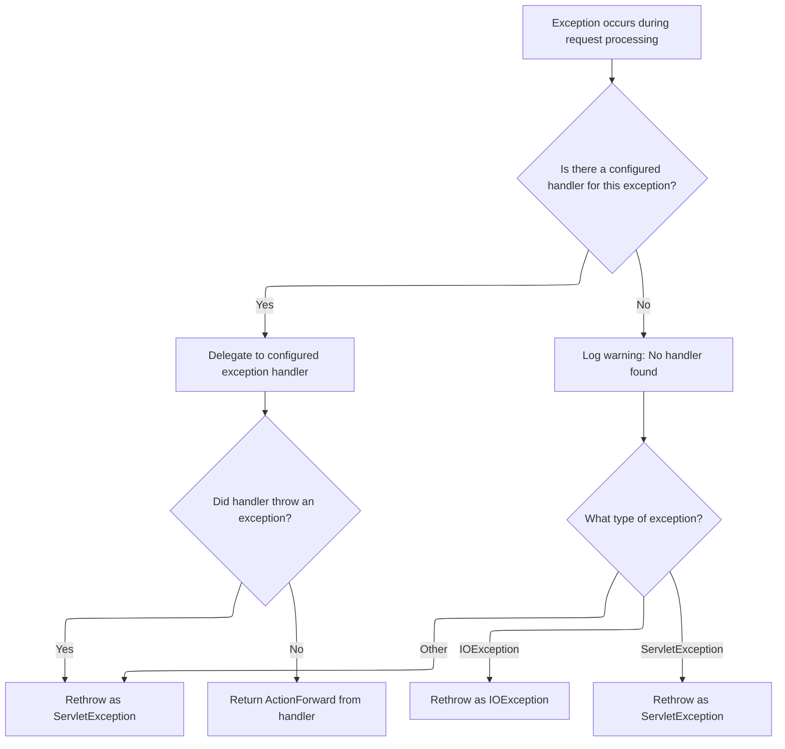

This document explains how the system processes a user-triggered action and determines the outcome. When a request is received, the system attempts to execute the action and returns the result. If an error occurs, exception handling logic determines the appropriate response.

# Where is this flow used?

This flow is used multiple times in the codebase as represented in the following diagram:

```mermaid
graph TD;
      1f3af44bfff9bae4b8af237be5302e37d202c99867273a09e77b9f6144dee63a(core/…/action/RequestProcessor.java::RequestProcessor.process) --> 14082164618534a94af15808b47dfcd643ed0875becf02fd0b0ca89f243f1553(core/…/action/RequestProcessor.java::RequestProcessor.processActionPerform)

294cd284fa406b4fe4f160157c73b79eaa7835613a545efd883ce1f14dd1ca7e(core/…/action/ActionServlet.java::ActionServlet.process) --> 1f3af44bfff9bae4b8af237be5302e37d202c99867273a09e77b9f6144dee63a(core/…/action/RequestProcessor.java::RequestProcessor.process)

dde35d78060f1afca84b5e9dedc002fc37669b07142e9d5a1f656107cc900aa0(core/…/action/ActionServlet.java::ActionServlet.doGet) --> 294cd284fa406b4fe4f160157c73b79eaa7835613a545efd883ce1f14dd1ca7e(core/…/action/ActionServlet.java::ActionServlet.process)

ec52fb7c28a6afaae4fd5937965ca776c6c12441d8a10e0b92b387b05c5c5cf5(core/…/action/ActionServlet.java::ActionServlet.doPost) --> 294cd284fa406b4fe4f160157c73b79eaa7835613a545efd883ce1f14dd1ca7e(core/…/action/ActionServlet.java::ActionServlet.process)

8a621e29539d7ec8103485c1826ea7ac430c2b3deba2e4e21eb89aae3dfd0db1(faces/…/application/ActionListenerImpl.java::ActionListenerImpl.processAction) --> 1f3af44bfff9bae4b8af237be5302e37d202c99867273a09e77b9f6144dee63a(core/…/action/RequestProcessor.java::RequestProcessor.process)

8a621e29539d7ec8103485c1826ea7ac430c2b3deba2e4e21eb89aae3dfd0db1(faces/…/application/ActionListenerImpl.java::ActionListenerImpl.processAction) --> 8a621e29539d7ec8103485c1826ea7ac430c2b3deba2e4e21eb89aae3dfd0db1(faces/…/application/ActionListenerImpl.java::ActionListenerImpl.processAction)

53533e50b64a112c29fb382f66ec6ca94d17eac0a90818829fbfbe36500f9677(faces/…/application/FacesRequestProcessor.java::FacesRequestProcessor.processActionPerform) --> 14082164618534a94af15808b47dfcd643ed0875becf02fd0b0ca89f243f1553(core/…/action/RequestProcessor.java::RequestProcessor.processActionPerform)

ccc9d121010fce67cf275828075852a5f19a397cb8b4323bd60116e9c546d50d(faces/…/application/FacesTilesRequestProcessor.java::FacesTilesRequestProcessor.processActionPerform) --> 14082164618534a94af15808b47dfcd643ed0875becf02fd0b0ca89f243f1553(core/…/action/RequestProcessor.java::RequestProcessor.processActionPerform)


classDef mainFlowStyle color:#000000,fill:#7CB9F4
classDef rootsStyle color:#000000,fill:#00FFF4
classDef Style1 color:#000000,fill:#00FFAA
classDef Style2 color:#000000,fill:#FFFF00
classDef Style3 color:#000000,fill:#AA7CB9

%% Swimm:
%% graph TD;
%%       1f3af44bfff9bae4b8af237be5302e37d202c99867273a09e77b9f6144dee63a(<SwmPath>[core/…/action/RequestProcessor.java](core/src/main/java/org/apache/struts/action/RequestProcessor.java)</SwmPath>::RequestProcessor.process) --> 14082164618534a94af15808b47dfcd643ed0875becf02fd0b0ca89f243f1553(<SwmPath>[core/…/action/RequestProcessor.java](core/src/main/java/org/apache/struts/action/RequestProcessor.java)</SwmPath>::RequestProcessor.processActionPerform)
%% 
%% 294cd284fa406b4fe4f160157c73b79eaa7835613a545efd883ce1f14dd1ca7e(<SwmPath>[core/…/action/ActionServlet.java](core/src/main/java/org/apache/struts/action/ActionServlet.java)</SwmPath>::ActionServlet.process) --> 1f3af44bfff9bae4b8af237be5302e37d202c99867273a09e77b9f6144dee63a(<SwmPath>[core/…/action/RequestProcessor.java](core/src/main/java/org/apache/struts/action/RequestProcessor.java)</SwmPath>::RequestProcessor.process)
%% 
%% dde35d78060f1afca84b5e9dedc002fc37669b07142e9d5a1f656107cc900aa0(<SwmPath>[core/…/action/ActionServlet.java](core/src/main/java/org/apache/struts/action/ActionServlet.java)</SwmPath>::ActionServlet.doGet) --> 294cd284fa406b4fe4f160157c73b79eaa7835613a545efd883ce1f14dd1ca7e(<SwmPath>[core/…/action/ActionServlet.java](core/src/main/java/org/apache/struts/action/ActionServlet.java)</SwmPath>::ActionServlet.process)
%% 
%% ec52fb7c28a6afaae4fd5937965ca776c6c12441d8a10e0b92b387b05c5c5cf5(<SwmPath>[core/…/action/ActionServlet.java](core/src/main/java/org/apache/struts/action/ActionServlet.java)</SwmPath>::ActionServlet.doPost) --> 294cd284fa406b4fe4f160157c73b79eaa7835613a545efd883ce1f14dd1ca7e(<SwmPath>[core/…/action/ActionServlet.java](core/src/main/java/org/apache/struts/action/ActionServlet.java)</SwmPath>::ActionServlet.process)
%% 
%% 8a621e29539d7ec8103485c1826ea7ac430c2b3deba2e4e21eb89aae3dfd0db1(<SwmPath>[faces/…/application/ActionListenerImpl.java](faces/src/main/java/org/apache/struts/faces/application/ActionListenerImpl.java)</SwmPath>::ActionListenerImpl.processAction) --> 1f3af44bfff9bae4b8af237be5302e37d202c99867273a09e77b9f6144dee63a(<SwmPath>[core/…/action/RequestProcessor.java](core/src/main/java/org/apache/struts/action/RequestProcessor.java)</SwmPath>::RequestProcessor.process)
%% 
%% 8a621e29539d7ec8103485c1826ea7ac430c2b3deba2e4e21eb89aae3dfd0db1(<SwmPath>[faces/…/application/ActionListenerImpl.java](faces/src/main/java/org/apache/struts/faces/application/ActionListenerImpl.java)</SwmPath>::ActionListenerImpl.processAction) --> 8a621e29539d7ec8103485c1826ea7ac430c2b3deba2e4e21eb89aae3dfd0db1(<SwmPath>[faces/…/application/ActionListenerImpl.java](faces/src/main/java/org/apache/struts/faces/application/ActionListenerImpl.java)</SwmPath>::ActionListenerImpl.processAction)
%% 
%% 53533e50b64a112c29fb382f66ec6ca94d17eac0a90818829fbfbe36500f9677(<SwmPath>[faces/…/application/FacesRequestProcessor.java](faces/src/main/java/org/apache/struts/faces/application/FacesRequestProcessor.java)</SwmPath>::FacesRequestProcessor.processActionPerform) --> 14082164618534a94af15808b47dfcd643ed0875becf02fd0b0ca89f243f1553(<SwmPath>[core/…/action/RequestProcessor.java](core/src/main/java/org/apache/struts/action/RequestProcessor.java)</SwmPath>::RequestProcessor.processActionPerform)
%% 
%% ccc9d121010fce67cf275828075852a5f19a397cb8b4323bd60116e9c546d50d(<SwmPath>[faces/…/application/FacesTilesRequestProcessor.java](faces/src/main/java/org/apache/struts/faces/application/FacesTilesRequestProcessor.java)</SwmPath>::FacesTilesRequestProcessor.processActionPerform) --> 14082164618534a94af15808b47dfcd643ed0875becf02fd0b0ca89f243f1553(<SwmPath>[core/…/action/RequestProcessor.java](core/src/main/java/org/apache/struts/action/RequestProcessor.java)</SwmPath>::RequestProcessor.processActionPerform)
%% 
%% 
%% classDef mainFlowStyle color:#000000,fill:#7CB9F4
%% classDef rootsStyle color:#000000,fill:#00FFF4
%% classDef Style1 color:#000000,fill:#00FFAA
%% classDef Style2 color:#000000,fill:#FFFF00
%% classDef Style3 color:#000000,fill:#AA7CB9
```



# Executing the Action and Handling Failures

<SwmSnippet path="/core/src/main/java/org/apache/struts/action/RequestProcessor.java" line="420">

---

ProcessActionPerform kicks off the action execution. It tries to run the action and, if everything goes fine, returns the result. If any exception pops up, it immediately hands off to <SwmToken path="core/src/main/java/org/apache/struts/action/RequestProcessor.java" pos="427:4:4" line-data="            return (processException(request, response, e, form, mapping));">`processException`</SwmToken>, which centralizes how exceptions are handled and ensures consistent error processing across actions.

```java
    protected ActionForward processActionPerform(HttpServletRequest request,
        HttpServletResponse response, Action action, ActionForm form,
        ActionMapping mapping)
        throws IOException, ServletException {
        try {
            return (action.execute(mapping, form, request, response));
        } catch (Exception e) {
            return (processException(request, response, e, form, mapping));
        }
    }
```

---

</SwmSnippet>

# Resolving Exceptions and Delegating to Handlers



<SwmSnippet path="/core/src/main/java/org/apache/struts/action/RequestProcessor.java" line="504">

---

ProcessException figures out if there's a configured handler for the exception using the mapping. If not, it logs and rethrows the exception (wrapping it if needed). If a handler is found, it instantiates it and calls its execute method, which is where the actual exception handling logic happens. That's why we jump to ExceptionHandler.execute next.

```java
    protected ActionForward processException(HttpServletRequest request,
        HttpServletResponse response, Exception exception, ActionForm form,
        ActionMapping mapping)
        throws IOException, ServletException {
        // Is there a defined handler for this exception?
        ExceptionConfig config = mapping.findException(exception.getClass());

        if (config == null) {
            log.warn(getInternal().getMessage("unhandledException",
                    exception.getClass()));

            if (exception instanceof IOException) {
                throw (IOException) exception;
            } else if (exception instanceof ServletException) {
                throw (ServletException) exception;
            } else {
                throw new ServletException(exception);
            }
        }

        // Use the configured exception handling
        try {
            ExceptionHandler handler =
                (ExceptionHandler) RequestUtils.applicationInstance(config
                    .getHandler());

            return (handler.execute(exception, config, mapping, form, request,
                response));
        } catch (Exception e) {
            throw new ServletException(e);
        }
    }
```

---

</SwmSnippet>

<SwmSnippet path="/core/src/main/java/org/apache/struts/action/ExceptionHandler.java" line="124">

---

Execute in <SwmToken path="core/src/main/java/org/apache/struts/action/ExceptionHandler.java" pos="128:6:6" line-data="        LOG.debug(&quot;ExceptionHandler executing for exception &quot; + ex);">`ExceptionHandler`</SwmToken> figures out where to forward after an exception (using the config path or input forward), builds the error message, logs and stores the exception, and then forwards if possible. If the response is already committed, it handles that edge case by logging and optionally running alternate handling.

```java
    public ActionForward execute(Exception ex, ExceptionConfig ae,
        ActionMapping mapping, ActionForm formInstance,
        HttpServletRequest request, HttpServletResponse response)
        throws ServletException {
        LOG.debug("ExceptionHandler executing for exception " + ex);

        ActionForward forward;
        ActionMessage error;
        String property;

        // Build the forward from the exception mapping if it exists
        // or from the form input
        if (ae.getPath() != null) {
            forward = new ActionForward(ae.getPath());
        } else {
            forward = mapping.getInputForward();
        }

        // Figure out the error
        if (ex instanceof ModuleException) {
            error = ((ModuleException) ex).getActionMessage();
            property = ((ModuleException) ex).getProperty();
        } else {
            // STR-2924
            if (ae.getKey() != null) {
                error = new ActionMessage(ae.getKey(), ex.getMessage());
                property = error.getKey();
            } else {
                error = null;
                property = null;
            }
        }

        this.logException(ex);

        // Store the exception
        request.setAttribute(Globals.EXCEPTION_KEY, ex);
        this.storeException(request, property, error, forward, ae.getScope());

        if (!response.isCommitted()) {
            return forward;
        }

        LOG.debug("Response is already committed, so forwarding will not work."
            + " Attempt alternate handling.");

        if (!silent(ae)) {
            handleCommittedResponse(ex, ae, mapping, formInstance, request,
                response, forward);
        } else {
            LOG.warn("ExceptionHandler configured with " + SILENT_IF_COMMITTED
                + " and response is committed.", ex);
        }

        return null;
    }
```

---

</SwmSnippet>

&nbsp;

*This is an auto-generated document by Swimm 🌊 and has not yet been verified by a human*

<SwmMeta version="3.0.0" repo-id="Z2l0aHViJTNBJTNBc3RydXRzMSUzQSUzQVN3aW1tLURlbW8=" repo-name="struts1"><sup>Powered by [Swimm](https://app.swimm.io/)</sup></SwmMeta>
