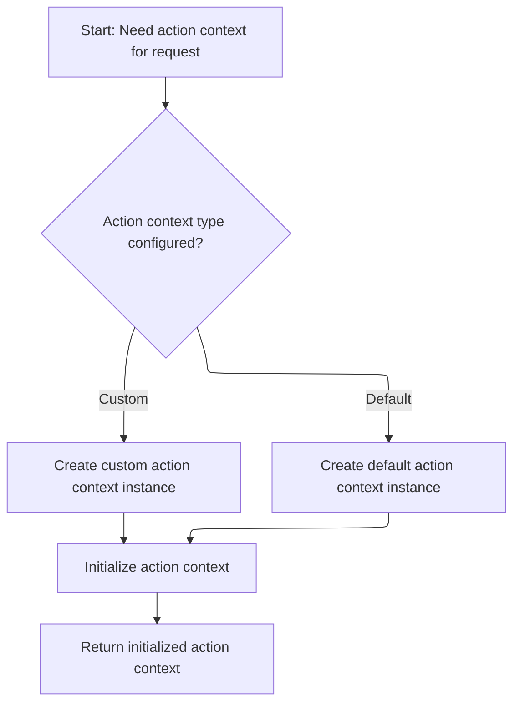

This document outlines the main flow for handling incoming HTTP requests. Serving as the entry point for web request processing, it prepares the request and context, initializes the action context, and executes the business logic chain to generate a response.

# Preparing the request and context

<SwmSnippet path="/core/src/main/java/org/apache/struts/chain/ComposableRequestProcessor.java" line="269">

---

In <SwmToken path="core/src/main/java/org/apache/struts/chain/ComposableRequestProcessor.java" pos="269:5:5" line-data="    public void process(HttpServletRequest request, HttpServletResponse response)">`process`</SwmToken>, we start by checking if the request is multipart and wrap it if needed, so file uploads are handled. Then we call <SwmToken path="core/src/main/java/org/apache/struts/chain/ComposableRequestProcessor.java" pos="275:7:7" line-data="        ActionContext context = contextInstance(request, response);">`contextInstance`</SwmToken> to set up an <SwmToken path="core/src/main/java/org/apache/struts/chain/ComposableRequestProcessor.java" pos="275:1:1" line-data="        ActionContext context = contextInstance(request, response);">`ActionContext`</SwmToken>, which ties together the request and response for the rest of the processing chain.

```java
    public void process(HttpServletRequest request, HttpServletResponse response)
        throws IOException, ServletException {
        // Wrap the request in the case of a multipart request
        request = processMultipart(request);

        // Create and populate a Context for this request
        ActionContext context = contextInstance(request, response);

```

---

</SwmSnippet>

## Instantiating and initializing the action context



<SwmSnippet path="/core/src/main/java/org/apache/struts/chain/ComposableRequestProcessor.java" line="306">

---

In <SwmToken path="core/src/main/java/org/apache/struts/chain/ComposableRequestProcessor.java" pos="306:5:5" line-data="    protected ActionContext contextInstance(HttpServletRequest request,">`contextInstance`</SwmToken>, we call <SwmToken path="core/src/main/java/org/apache/struts/chain/ComposableRequestProcessor.java" pos="310:1:1" line-data="            createActionContextInstance(getServletContext(), request, response);">`createActionContextInstance`</SwmToken> to build the <SwmToken path="core/src/main/java/org/apache/struts/chain/ComposableRequestProcessor.java" pos="306:3:3" line-data="    protected ActionContext contextInstance(HttpServletRequest request,">`ActionContext`</SwmToken> using the servlet context, request, and response. This sets up the context object, which is then initialized before use.

```java
    protected ActionContext contextInstance(HttpServletRequest request,
        HttpServletResponse response)
        throws ServletException {
        ActionContext context =
            createActionContextInstance(getServletContext(), request, response);

```

---

</SwmSnippet>

<SwmSnippet path="/core/src/main/java/org/apache/struts/chain/ComposableRequestProcessor.java" line="336">

---

<SwmToken path="core/src/main/java/org/apache/struts/chain/ComposableRequestProcessor.java" pos="336:5:5" line-data="    protected ActionContext createActionContextInstance(">`createActionContextInstance`</SwmToken> figures out which <SwmToken path="core/src/main/java/org/apache/struts/chain/ComposableRequestProcessor.java" pos="336:3:3" line-data="    protected ActionContext createActionContextInstance(">`ActionContext`</SwmToken> to instantiate based on config. It either uses the default <SwmToken path="core/src/main/java/org/apache/struts/chain/ComposableRequestProcessor.java" pos="341:5:5" line-data="            return new ServletActionContext(servletContext, request, response);">`ServletActionContext`</SwmToken> or a custom one, and can use reflection if needed. This lets you swap in different context handling if you want.

```java
    protected ActionContext createActionContextInstance(
        ServletContext servletContext, HttpServletRequest request,
        HttpServletResponse response)
        throws ServletException {
        if (this.actionContextClass == null) {
            return new ServletActionContext(servletContext, request, response);
        }

        try {
            if (this.servletActionContextConstructor == null) {
                return (ActionContext) this.actionContextClass.newInstance();
            }

            return (ActionContext) this.servletActionContextConstructor
            .newInstance(new Object[] { servletContext, request, response });
        } catch (Exception e) {
            throw new ServletException(
                "Error creating ActionContext instance of type "
                + this.actionContextClass, e);
        }
    }
```

---

</SwmSnippet>

<SwmSnippet path="/core/src/main/java/org/apache/struts/chain/ComposableRequestProcessor.java" line="312">

---

Back in <SwmToken path="core/src/main/java/org/apache/struts/chain/ComposableRequestProcessor.java" pos="275:7:7" line-data="        ActionContext context = contextInstance(request, response);">`contextInstance`</SwmToken>, after getting the <SwmToken path="core/src/main/java/org/apache/struts/chain/ComposableRequestProcessor.java" pos="275:1:1" line-data="        ActionContext context = contextInstance(request, response);">`ActionContext`</SwmToken> from <SwmToken path="core/src/main/java/org/apache/struts/chain/ComposableRequestProcessor.java" pos="310:1:1" line-data="            createActionContextInstance(getServletContext(), request, response);">`createActionContextInstance`</SwmToken>, we run initialization on it so it's ready for the rest of the request processing. Then we return it for use downstream.

```java
        initializeActionContext(context);

        return context;
    }
```

---

</SwmSnippet>

## Executing the processing chain and cleanup

<SwmSnippet path="/core/src/main/java/org/apache/struts/chain/ComposableRequestProcessor.java" line="277">

---

Back in <SwmToken path="core/src/main/java/org/apache/struts/chain/ComposableRequestProcessor.java" pos="269:5:5" line-data="    public void process(HttpServletRequest request, HttpServletResponse response)">`process`</SwmToken>, after getting the initialized <SwmToken path="core/src/main/java/org/apache/struts/chain/ComposableRequestProcessor.java" pos="275:1:1" line-data="        ActionContext context = contextInstance(request, response);">`ActionContext`</SwmToken> from <SwmToken path="core/src/main/java/org/apache/struts/chain/ComposableRequestProcessor.java" pos="275:7:7" line-data="        ActionContext context = contextInstance(request, response);">`contextInstance`</SwmToken>, we run the command chain to handle the request. Once that's done, we release the context to clean up resources, even if something goes wrong during processing.

```java
        // Create and execute the command.
        try {
            if (LOG.isDebugEnabled()) {
                LOG.debug("Using processing chain for this request");
            }

            command.execute(context);
        } catch (Exception e) {
            // Execute the exception processing chain??
            throw new ServletException(e);
        } finally {
            // Release the context.
            if (context != null) {
                context.release();
            }
        }
    }
```

---

</SwmSnippet>

&nbsp;

*This is an auto-generated document by Swimm 🌊 and has not yet been verified by a human*

<SwmMeta version="3.0.0" repo-id="Z2l0aHViJTNBJTNBc3RydXRzMSUzQSUzQVN3aW1tLURlbW8=" repo-name="struts1"><sup>Powered by [Swimm](https://app.swimm.io/)</sup></SwmMeta>
