This document describes how an incoming HTTP request is processed and routed to deliver the correct response. The flow includes selecting the appropriate module, checking user permissions, handling form data, validating user input, and executing the required business action. The process supports modular applications and handles both successful navigation and error scenarios.

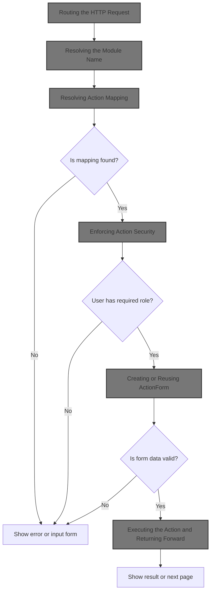

# Where is this flow used?

This flow is used multiple times in the codebase as represented in the following diagram:

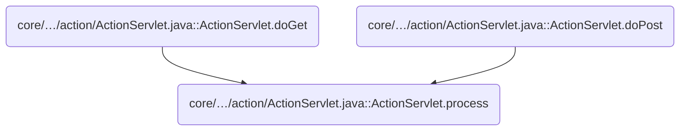

# Routing the HTTP Request

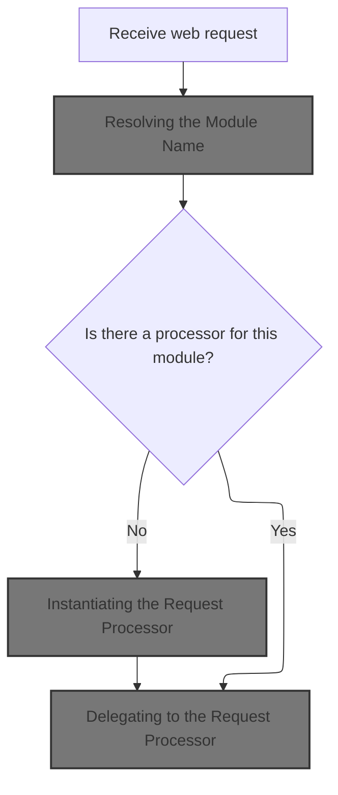

<SwmSnippet path="/core/src/main/java/org/apache/struts/action/ActionServlet.java" line="1952">

---

In <SwmToken path="core/src/main/java/org/apache/struts/action/ActionServlet.java" pos="1952:5:5" line-data="    protected void process(HttpServletRequest request,">`process`</SwmToken>, we immediately delegate to <SwmToken path="core/src/main/java/org/apache/struts/action/ActionServlet.java" pos="1955:1:1" line-data="        ModuleUtils.getInstance().selectModule(request, getServletContext());">`ModuleUtils`</SwmToken> to pick the right module for this request. This is needed so the rest of the flow knows which config and resources to use for routing and processing.

```java
    protected void process(HttpServletRequest request,
        HttpServletResponse response)
        throws IOException, ServletException {
        ModuleUtils.getInstance().selectModule(request, getServletContext());

```

---

</SwmSnippet>

## Resolving the Module Name

<SwmSnippet path="/core/src/main/java/org/apache/struts/util/ModuleUtils.java" line="222">

---

In <SwmToken path="core/src/main/java/org/apache/struts/util/ModuleUtils.java" pos="222:5:5" line-data="    public void selectModule(HttpServletRequest request, ServletContext context) {">`selectModule`</SwmToken>, we figure out which module this request is for by resolving the module name. This is the entry point for picking the right config for the rest of the request handling.

```java
    public void selectModule(HttpServletRequest request, ServletContext context) {
        // Compute module name
        String prefix = getModuleName(request, context);

```

---

</SwmSnippet>

<SwmSnippet path="/core/src/main/java/org/apache/struts/util/ModuleUtils.java" line="149">

---

<SwmToken path="core/src/main/java/org/apache/struts/util/ModuleUtils.java" pos="149:5:5" line-data="    public String getModuleName(HttpServletRequest request,">`getModuleName`</SwmToken> checks for <SwmToken path="core/src/main/java/org/apache/struts/util/ModuleUtils.java" pos="153:11:11" line-data="            (String) request.getAttribute(RequestProcessor.INCLUDE_SERVLET_PATH);">`INCLUDE_SERVLET_PATH`</SwmToken> on the request to handle forwards/includes, falls back to <SwmToken path="core/src/main/java/org/apache/struts/util/ModuleUtils.java" pos="156:7:7" line-data="            matchPath = request.getServletPath();">`getServletPath`</SwmToken> if not found, then delegates to another <SwmToken path="core/src/main/java/org/apache/struts/util/ModuleUtils.java" pos="149:5:5" line-data="    public String getModuleName(HttpServletRequest request,">`getModuleName`</SwmToken> to actually resolve the module name from the path and context.

```java
    public String getModuleName(HttpServletRequest request,
        ServletContext context) {
        // Acquire the path used to compute the module
        String matchPath =
            (String) request.getAttribute(RequestProcessor.INCLUDE_SERVLET_PATH);

        if (matchPath == null) {
            matchPath = request.getServletPath();
        }

        return this.getModuleName(matchPath, context);
    }
```

---

</SwmSnippet>

<SwmSnippet path="/core/src/main/java/org/apache/struts/util/ModuleUtils.java" line="226">

---

Back in <SwmToken path="core/src/main/java/org/apache/struts/util/ModuleUtils.java" pos="227:3:3" line-data="        this.selectModule(prefix, request, context);">`selectModule`</SwmToken>, after resolving the module name, we expose the resources for that module so the rest of the framework can use them for this request.

```java
        // Expose the resources for this module
        this.selectModule(prefix, request, context);
    }
```

---

</SwmSnippet>

## Preparing the Request Processor

<SwmSnippet path="/core/src/main/java/org/apache/struts/action/ActionServlet.java" line="1957">

---

Back in `ActionServlet.process`, after selecting the module, we grab the <SwmToken path="core/src/main/java/org/apache/struts/action/ActionServlet.java" pos="1957:1:1" line-data="        ModuleConfig config = getModuleConfig(request);">`ModuleConfig`</SwmToken> and get or create the <SwmToken path="core/src/main/java/org/apache/struts/action/ActionServlet.java" pos="1959:1:1" line-data="        RequestProcessor processor = getProcessorForModule(config);">`RequestProcessor`</SwmToken> for it. This sets up the handler that will process the request.

```java
        ModuleConfig config = getModuleConfig(request);

        RequestProcessor processor = getProcessorForModule(config);

        if (processor == null) {
            processor = getRequestProcessor(config);
        }

```

---

</SwmSnippet>

## Instantiating the Request Processor

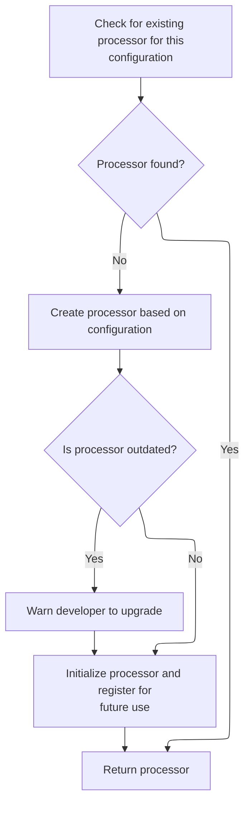

<SwmSnippet path="/core/src/main/java/org/apache/struts/action/ActionServlet.java" line="608">

---

<SwmToken path="core/src/main/java/org/apache/struts/action/ActionServlet.java" pos="608:7:7" line-data="    protected synchronized RequestProcessor getRequestProcessor(">`getRequestProcessor`</SwmToken> checks if a processor exists for the module, instantiates one if not, warns if it's the old type, initializes it, and stores it in the servlet context keyed by module prefix. Calls to init are needed to finish setup.

```java
    protected synchronized RequestProcessor getRequestProcessor(
        ModuleConfig config) throws ServletException {
        RequestProcessor processor = this.getProcessorForModule(config);

        if (processor == null) {
            try {
                processor =
                    (RequestProcessor) RequestUtils.applicationInstance(config.getControllerConfig()
                                                                              .getProcessorClass());
            } catch (Exception e) {
            	UnavailableException e2 = new UnavailableException(
                    "Cannot initialize RequestProcessor of class "
                    + config.getControllerConfig().getProcessorClass());
                e2.initCause(e);
                throw e2;
            }
            
            // Emit a warning to the log if the classic RequestProcessor is 
            // being used without composition. Hopefully developers will 
            // heed this message and make the upgrade.
            if (!(processor instanceof ComposableRequestProcessor)) {
                log.warn("Use of the classic RequestProcessor is not recommended. " +
                        "Please upgrade to the ComposableRequestProcessor to " +
                        "receive the advantage of modern enhancements and fixes.");
            }

            processor.init(this, config);

            String key = Globals.REQUEST_PROCESSOR_KEY + config.getPrefix();

            getServletContext().setAttribute(key, processor);
        }

        return (processor);
    }
```

---

</SwmSnippet>

## Servlet Initialization Entry Point

```mermaid
%%{init: {"flowchart": {"defaultRenderer": "elk"}} }%%
flowchart TD
  node1["Start ActionServlet initialization"]
  click node1 openCode "core/src/main/java/org/apache/struts/action/ActionServlet.java:339:346"
  node1 --> node2["Loading Internal Resources"]
  
  node2 --> node3["Creating the Message Resources Factory"]
  
  node3 --> node4["Instantiating the Message Resources Factory"]
  
  node4 --> node5["Creating Dynamic Form Instances"]
  
  node5 --> node6["Initializing Form Property Values"]
  
  node6 --> node7["Configuring Null Conversion and Compatibility"]
  
  node7 --> node8["Handling User Registration Action"]
  
  node8 --> node9["Forwarding to the Registration Action"]
  
  node9 --> node10["Dispatching to the Action Method"]
  
  node10 --> node11["Executing the Action Logic"]
  
  node11 --> node12["Invoking the Target Action Method"]
  
  node12 --> node13["Servlet-Specific Setup"]
  
  node13 --> node14["Configuring the Request Processing Chain"]
  
  node14 --> node15["Creating and Initializing Module Config"]
  
  node15 --> node16["Initialize default module configuration"]
  click node16 openCode "core/src/main/java/org/apache/struts/action/ActionServlet.java:683:847"
  node16 --> node17["Loading Module Message Bundles"]
  
  node17 --> node18["Initializing Module Plug-in Extensions"]
  
  node18 --> node19["Setting Up Module Form Beans"]
  
  node19 --> node20["Configuring Module Navigation Forwards"]
  
  node20 --> node21["Configuring Module Exception Handling"]
  
  node21 --> node22["Registering Module Action Mappings"]
  
  node22 --> node23["Running ModuleConfig Post-Processors"]
  
  node23 --> node24["Locking Module Configuration"]
  
  node24 --> node25["For each servlet config parameter"]
  click node25 openCode "core/src/main/java/org/apache/struts/action/ActionServlet.java:367:391"
  subgraph loop1["For each servlet config parameter"]
    node25 --> node26{"Does parameter name start with
core/…/struts/config?"}
    click node26 openCode "core/src/main/java/org/apache/struts/action/ActionServlet.java:372:374"
    node26 -->|"Yes"| node27["Initialize module configuration for
prefix"]
    click node27 openCode "core/src/main/java/org/apache/struts/action/ActionServlet.java:378:380"
    node27 --> node28["Initialize module message resources"]
    click node28 openCode "core/src/main/java/org/apache/struts/action/ActionServlet.java:381:382"
    node28 --> node29["Initialize module plugins"]
    click node29 openCode "core/src/main/java/org/apache/struts/action/ActionServlet.java:382:383"
    node29 --> node30["Initialize module form beans"]
    click node30 openCode "core/src/main/java/org/apache/struts/action/ActionServlet.java:383:384"
    node30 --> node31["Initialize module forwards"]
    click node31 openCode "core/src/main/java/org/apache/struts/action/ActionServlet.java:384:385"
    node31 --> node32["Initialize module exception configs"]
    click node32 openCode "core/src/main/java/org/apache/struts/action/ActionServlet.java:385:386"
    node32 --> node33["Initialize module actions"]
    click node33 openCode "core/src/main/java/org/apache/struts/action/ActionServlet.java:386:387"
    node33 --> node34["Post-process module config"]
    click node34 openCode "core/src/main/java/org/apache/struts/action/ActionServlet.java:387:388"
    node34 --> node35["Freeze module config"]
    click node35 openCode "core/src/main/java/org/apache/struts/action/ActionServlet.java:388:389"
    node35 --> node36["Next parameter"]
    node26 -->|"No"| node36["Next parameter"]
    node36 --> node37["End of parameters"]
  end
  node37 --> node38["Registering Module Prefixes"]
  
  node38 --> node39["Destroy config digester and finish"]
  click node39 openCode "core/src/main/java/org/apache/struts/action/ActionServlet.java:393:408"
classDef HeadingStyle fill:#777777,stroke:#333,stroke-width:2px;
click node2 goToHeading "Loading Internal Resources"
node2:::HeadingStyle
click node3 goToHeading "Creating the Message Resources Factory"
node3:::HeadingStyle
click node4 goToHeading "Instantiating the Message Resources Factory"
node4:::HeadingStyle
click node5 goToHeading "Creating Dynamic Form Instances"
node5:::HeadingStyle
click node6 goToHeading "Initializing Form Property Values"
node6:::HeadingStyle
click node7 goToHeading "Configuring Null Conversion and Compatibility"
node7:::HeadingStyle
click node8 goToHeading "Handling User Registration Action"
node8:::HeadingStyle
click node9 goToHeading "Forwarding to the Registration Action"
node9:::HeadingStyle
click node10 goToHeading "Dispatching to the Action Method"
node10:::HeadingStyle
click node11 goToHeading "Executing the Action Logic"
node11:::HeadingStyle
click node12 goToHeading "Invoking the Target Action Method"
node12:::HeadingStyle
click node13 goToHeading "Servlet-Specific Setup"
node13:::HeadingStyle
click node14 goToHeading "Configuring the Request Processing Chain"
node14:::HeadingStyle
click node15 goToHeading "Creating and Initializing Module Config"
node15:::HeadingStyle
click node17 goToHeading "Loading Module Message Bundles"
node17:::HeadingStyle
click node18 goToHeading "Initializing Module Plug-in Extensions"
node18:::HeadingStyle
click node19 goToHeading "Setting Up Module Form Beans"
node19:::HeadingStyle
click node20 goToHeading "Configuring Module Navigation Forwards"
node20:::HeadingStyle
click node21 goToHeading "Configuring Module Exception Handling"
node21:::HeadingStyle
click node22 goToHeading "Registering Module Action Mappings"
node22:::HeadingStyle
click node23 goToHeading "Running ModuleConfig Post-Processors"
node23:::HeadingStyle
click node24 goToHeading "Locking Module Configuration"
node24:::HeadingStyle
click node38 goToHeading "Registering Module Prefixes"
node38:::HeadingStyle

%% Swimm:
%% %%{init: {"flowchart": {"defaultRenderer": "elk"}} }%%
%% flowchart TD
%%   node1["Start <SwmToken path="core/src/main/java/org/apache/struts/action/ActionServlet.java" pos="400:14:14" line-data="            log.error(&quot;Unable to initialize Struts ActionServlet due to an &quot;">`ActionServlet`</SwmToken> initialization"]
%%   click node1 openCode "<SwmPath>[core/…/action/ActionServlet.java](core/src/main/java/org/apache/struts/action/ActionServlet.java)</SwmPath>:339:346"
%%   node1 --> node2["Loading Internal Resources"]
%%   
%%   node2 --> node3["Creating the Message Resources Factory"]
%%   
%%   node3 --> node4["Instantiating the Message Resources Factory"]
%%   
%%   node4 --> node5["Creating Dynamic Form Instances"]
%%   
%%   node5 --> node6["Initializing Form Property Values"]
%%   
%%   node6 --> node7["Configuring Null Conversion and Compatibility"]
%%   
%%   node7 --> node8["Handling User Registration Action"]
%%   
%%   node8 --> node9["Forwarding to the Registration Action"]
%%   
%%   node9 --> node10["Dispatching to the Action Method"]
%%   
%%   node10 --> node11["Executing the Action Logic"]
%%   
%%   node11 --> node12["Invoking the Target Action Method"]
%%   
%%   node12 --> node13["Servlet-Specific Setup"]
%%   
%%   node13 --> node14["Configuring the Request Processing Chain"]
%%   
%%   node14 --> node15["Creating and Initializing Module Config"]
%%   
%%   node15 --> node16["Initialize default module configuration"]
%%   click node16 openCode "<SwmPath>[core/…/action/ActionServlet.java](core/src/main/java/org/apache/struts/action/ActionServlet.java)</SwmPath>:683:847"
%%   node16 --> node17["Loading Module Message Bundles"]
%%   
%%   node17 --> node18["Initializing Module Plug-in Extensions"]
%%   
%%   node18 --> node19["Setting Up Module Form Beans"]
%%   
%%   node19 --> node20["Configuring Module Navigation Forwards"]
%%   
%%   node20 --> node21["Configuring Module Exception Handling"]
%%   
%%   node21 --> node22["Registering Module Action Mappings"]
%%   
%%   node22 --> node23["Running <SwmToken path="core/src/main/java/org/apache/struts/action/ActionServlet.java" pos="356:1:1" line-data="            ModuleConfig moduleConfig = initModuleConfig(&quot;&quot;, config);">`ModuleConfig`</SwmToken> Post-Processors"]
%%   
%%   node23 --> node24["Locking Module Configuration"]
%%   
%%   node24 --> node25["For each servlet config parameter"]
%%   click node25 openCode "<SwmPath>[core/…/action/ActionServlet.java](core/src/main/java/org/apache/struts/action/ActionServlet.java)</SwmPath>:367:391"
%%   subgraph loop1["For each servlet config parameter"]
%%     node25 --> node26{"Does parameter name start with
%% <SwmPath>[core/…/struts/config/](core/src/main/java/org/apache/struts/config/)</SwmPath>?"}
%%     click node26 openCode "<SwmPath>[core/…/action/ActionServlet.java](core/src/main/java/org/apache/struts/action/ActionServlet.java)</SwmPath>:372:374"
%%     node26 -->|"Yes"| node27["Initialize module configuration for
%% prefix"]
%%     click node27 openCode "<SwmPath>[core/…/action/ActionServlet.java](core/src/main/java/org/apache/struts/action/ActionServlet.java)</SwmPath>:378:380"
%%     node27 --> node28["Initialize module message resources"]
%%     click node28 openCode "<SwmPath>[core/…/action/ActionServlet.java](core/src/main/java/org/apache/struts/action/ActionServlet.java)</SwmPath>:381:382"
%%     node28 --> node29["Initialize module plugins"]
%%     click node29 openCode "<SwmPath>[core/…/action/ActionServlet.java](core/src/main/java/org/apache/struts/action/ActionServlet.java)</SwmPath>:382:383"
%%     node29 --> node30["Initialize module form beans"]
%%     click node30 openCode "<SwmPath>[core/…/action/ActionServlet.java](core/src/main/java/org/apache/struts/action/ActionServlet.java)</SwmPath>:383:384"
%%     node30 --> node31["Initialize module forwards"]
%%     click node31 openCode "<SwmPath>[core/…/action/ActionServlet.java](core/src/main/java/org/apache/struts/action/ActionServlet.java)</SwmPath>:384:385"
%%     node31 --> node32["Initialize module exception configs"]
%%     click node32 openCode "<SwmPath>[core/…/action/ActionServlet.java](core/src/main/java/org/apache/struts/action/ActionServlet.java)</SwmPath>:385:386"
%%     node32 --> node33["Initialize module actions"]
%%     click node33 openCode "<SwmPath>[core/…/action/ActionServlet.java](core/src/main/java/org/apache/struts/action/ActionServlet.java)</SwmPath>:386:387"
%%     node33 --> node34["Post-process module config"]
%%     click node34 openCode "<SwmPath>[core/…/action/ActionServlet.java](core/src/main/java/org/apache/struts/action/ActionServlet.java)</SwmPath>:387:388"
%%     node34 --> node35["Freeze module config"]
%%     click node35 openCode "<SwmPath>[core/…/action/ActionServlet.java](core/src/main/java/org/apache/struts/action/ActionServlet.java)</SwmPath>:388:389"
%%     node35 --> node36["Next parameter"]
%%     node26 -->|"No"| node36["Next parameter"]
%%     node36 --> node37["End of parameters"]
%%   end
%%   node37 --> node38["Registering Module Prefixes"]
%%   
%%   node38 --> node39["Destroy config digester and finish"]
%%   click node39 openCode "<SwmPath>[core/…/action/ActionServlet.java](core/src/main/java/org/apache/struts/action/ActionServlet.java)</SwmPath>:393:408"
%% classDef HeadingStyle fill:#777777,stroke:#333,stroke-width:2px;
%% click node2 goToHeading "Loading Internal Resources"
%% node2:::HeadingStyle
%% click node3 goToHeading "Creating the Message Resources Factory"
%% node3:::HeadingStyle
%% click node4 goToHeading "Instantiating the Message Resources Factory"
%% node4:::HeadingStyle
%% click node5 goToHeading "Creating Dynamic Form Instances"
%% node5:::HeadingStyle
%% click node6 goToHeading "Initializing Form Property Values"
%% node6:::HeadingStyle
%% click node7 goToHeading "Configuring Null Conversion and Compatibility"
%% node7:::HeadingStyle
%% click node8 goToHeading "Handling User Registration Action"
%% node8:::HeadingStyle
%% click node9 goToHeading "Forwarding to the Registration Action"
%% node9:::HeadingStyle
%% click node10 goToHeading "Dispatching to the Action Method"
%% node10:::HeadingStyle
%% click node11 goToHeading "Executing the Action Logic"
%% node11:::HeadingStyle
%% click node12 goToHeading "Invoking the Target Action Method"
%% node12:::HeadingStyle
%% click node13 goToHeading "Servlet-Specific Setup"
%% node13:::HeadingStyle
%% click node14 goToHeading "Configuring the Request Processing Chain"
%% node14:::HeadingStyle
%% click node15 goToHeading "Creating and Initializing Module Config"
%% node15:::HeadingStyle
%% click node17 goToHeading "Loading Module Message Bundles"
%% node17:::HeadingStyle
%% click node18 goToHeading "Initializing Module Plug-in Extensions"
%% node18:::HeadingStyle
%% click node19 goToHeading "Setting Up Module Form Beans"
%% node19:::HeadingStyle
%% click node20 goToHeading "Configuring Module Navigation Forwards"
%% node20:::HeadingStyle
%% click node21 goToHeading "Configuring Module Exception Handling"
%% node21:::HeadingStyle
%% click node22 goToHeading "Registering Module Action Mappings"
%% node22:::HeadingStyle
%% click node23 goToHeading "Running <SwmToken path="core/src/main/java/org/apache/struts/action/ActionServlet.java" pos="356:1:1" line-data="            ModuleConfig moduleConfig = initModuleConfig(&quot;&quot;, config);">`ModuleConfig`</SwmToken> Post-Processors"
%% node23:::HeadingStyle
%% click node24 goToHeading "Locking Module Configuration"
%% node24:::HeadingStyle
%% click node38 goToHeading "Registering Module Prefixes"
%% node38:::HeadingStyle
```

<SwmSnippet path="/core/src/main/java/org/apache/struts/action/ActionServlet.java" line="339">

---

In <SwmToken path="core/src/main/java/org/apache/struts/action/ActionServlet.java" pos="339:5:5" line-data="    public void init() throws ServletException {">`init`</SwmToken>, we start servlet initialization and delegate to <SwmToken path="core/src/main/java/org/apache/struts/action/ActionServlet.java" pos="347:1:1" line-data="            initInternal();">`initInternal`</SwmToken> for the core setup, all inside a <SwmToken path="core/src/main/java/org/apache/struts/action/ActionServlet.java" pos="343:15:17" line-data="        // Wraps the entire initialization in a try/catch to better handle">`try/catch`</SwmToken> to handle errors cleanly.

```java
    public void init() throws ServletException {
        final String configPrefix = "config/";
        final int configPrefixLength = configPrefix.length() - 1;

        // Wraps the entire initialization in a try/catch to better handle
        // unexpected exceptions and errors to provide better feedback
        // to the developer
        try {
            initInternal();
```

---

</SwmSnippet>

### Loading Internal Resources

<SwmSnippet path="/core/src/main/java/org/apache/struts/action/ActionServlet.java" line="1698">

---

<SwmToken path="core/src/main/java/org/apache/struts/action/ActionServlet.java" pos="1698:5:5" line-data="    protected void initInternal()">`initInternal`</SwmToken> loads internal message resources using <SwmToken path="core/src/main/java/org/apache/struts/action/ActionServlet.java" pos="1701:5:7" line-data="            internal = MessageResources.getMessageResources(internalName);">`MessageResources.getMessageResources`</SwmToken>. If loading fails, it logs and throws an exception.

```java
    protected void initInternal()
        throws ServletException {
        try {
            internal = MessageResources.getMessageResources(internalName);
        } catch (MissingResourceException e) {
            log.error("Cannot load internal resources from '" + internalName
                + "'", e);
            UnavailableException e2 = new UnavailableException(
                "Cannot load internal resources from '" + internalName + "'");
            e2.initCause(e);
            throw e2;
        }
    }
```

---

</SwmSnippet>

### Creating the Message Resources Factory

<SwmSnippet path="/core/src/main/java/org/apache/struts/util/MessageResources.java" line="482">

---

<SwmToken path="core/src/main/java/org/apache/struts/util/MessageResources.java" pos="482:9:9" line-data="    public synchronized static MessageResources getMessageResources(">`getMessageResources`</SwmToken> checks if the default factory exists, creates it if not, then uses it to create the actual <SwmToken path="core/src/main/java/org/apache/struts/util/MessageResources.java" pos="482:7:7" line-data="    public synchronized static MessageResources getMessageResources(">`MessageResources`</SwmToken> instance.

```java
    public synchronized static MessageResources getMessageResources(
        String config) {
        if (defaultFactory == null) {
            defaultFactory = MessageResourcesFactory.createFactory();
        }

        return defaultFactory.createResources(config);
    }
```

---

</SwmSnippet>

### Instantiating the Message Resources Factory

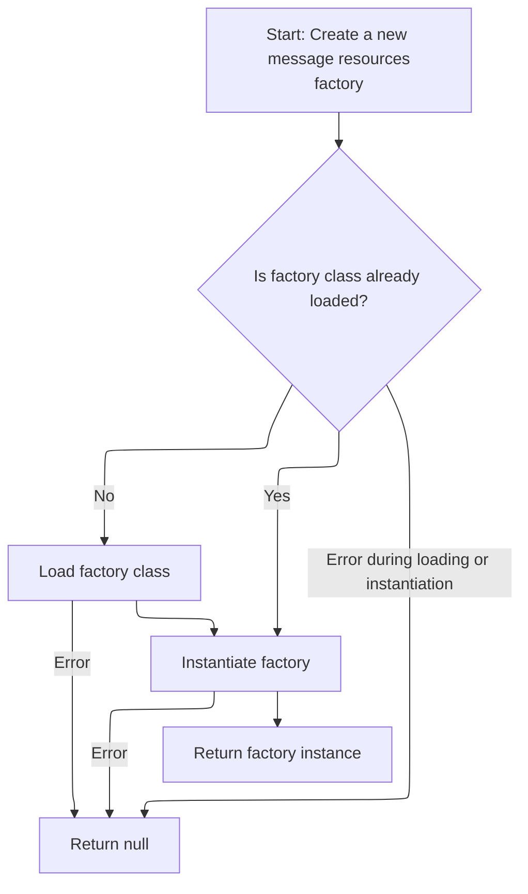

<SwmSnippet path="/core/src/main/java/org/apache/struts/util/MessageResourcesFactory.java" line="163">

---

<SwmToken path="core/src/main/java/org/apache/struts/util/MessageResourcesFactory.java" pos="163:7:7" line-data="    public static MessageResourcesFactory createFactory() {">`createFactory`</SwmToken> lazily loads the factory class using <SwmToken path="core/src/main/java/org/apache/struts/util/MessageResourcesFactory.java" pos="167:5:5" line-data="                clazz = RequestUtils.applicationClass(factoryClass);">`RequestUtils`</SwmToken>, instantiates it, and returns the instance. If anything fails, it logs and returns null.

```java
    public static MessageResourcesFactory createFactory() {
        // Construct a new instance of the specified factory class
        try {
            if (clazz == null) {
                clazz = RequestUtils.applicationClass(factoryClass);
            }

            MessageResourcesFactory factory =
                (MessageResourcesFactory) clazz.newInstance();

            return (factory);
        } catch (Throwable t) {
            LOG.error("MessageResourcesFactory.createFactory", t);

            return (null);
        }
    }
```

---

</SwmSnippet>

### Creating Dynamic Form Instances

See <SwmLink doc-title="Creating a Dynamic Form Instance">[Creating a Dynamic Form Instance](/.swm/creating-a-dynamic-form-instance.6sl69u2u.sw.md)</SwmLink>

### Initializing Form Property Values

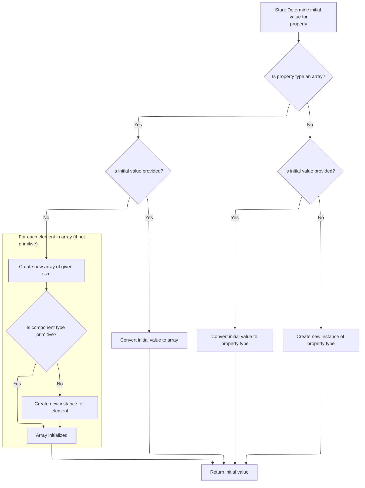

<SwmSnippet path="/core/src/main/java/org/apache/struts/config/FormPropertyConfig.java" line="318">

---

In <SwmToken path="core/src/main/java/org/apache/struts/config/FormPropertyConfig.java" pos="318:5:5" line-data="    public Object initial() {">`initial`</SwmToken>, we get the property type and branch based on whether it's an array. If so, we handle conversion or create a new array, possibly initializing elements if they're not primitives.

```java
    public Object initial() {
        Object initialValue = null;

        try {
            Class clazz = getTypeClass();

```

---

</SwmSnippet>

<SwmSnippet path="/core/src/main/java/org/apache/struts/config/FormPropertyConfig.java" line="324">

---

Back in <SwmToken path="core/src/main/java/org/apache/struts/config/FormPropertyConfig.java" pos="325:4:4" line-data="                if (initial != null) {">`initial`</SwmToken>, if the property type is an array and not primitive, we loop and instantiate each element. Errors are logged but don't stop the process.

```java
            if (clazz.isArray()) {
                if (initial != null) {
                    initialValue = ConvertUtils.convert(initial, clazz);
                } else {
                    initialValue =
                        Array.newInstance(clazz.getComponentType(), size);

                    if (!(clazz.getComponentType().isPrimitive())) {
                        for (int i = 0; i < size; i++) {
                            try {
                                Array.set(initialValue, i,
                                    clazz.getComponentType().newInstance());
                            } catch (Throwable t) {
                                log.error("Unable to create instance of "
                                    + clazz.getName() + " for property=" + name
                                    + ", type=" + type + ", initial=" + initial
                                    + ", size=" + size + ".");

                                //FIXME: Should we just dump the entire application/module ?
                            }
                        }
```

---

</SwmSnippet>

<SwmSnippet path="/core/src/main/java/org/apache/struts/config/FormPropertyConfig.java" line="348">

---

Finishing <SwmToken path="core/src/main/java/org/apache/struts/config/FormPropertyConfig.java" pos="348:4:4" line-data="                if (initial != null) {">`initial`</SwmToken>, for non-array types we convert or instantiate the value. Next, <SwmToken path="core/src/main/java/org/apache/struts/action/ActionServlet.java" pos="953:13:13" line-data="            // Force creation and registration of DynaActionFormClass instances">`DynaActionFormClass`</SwmToken> uses this to set up dynamic form properties.

```java
                if (initial != null) {
                    initialValue = ConvertUtils.convert(initial, clazz);
                } else {
                    initialValue = clazz.newInstance();
                }
            }
        } catch (Throwable t) {
            initialValue = null;
        }

        return (initialValue);
    }
```

---

</SwmSnippet>

### Other Initialization Tasks

<SwmSnippet path="/core/src/main/java/org/apache/struts/action/ActionServlet.java" line="348">

---

Back in <SwmToken path="core/src/main/java/org/apache/struts/action/ActionServlet.java" pos="339:5:5" line-data="    public void init() throws ServletException {">`init`</SwmToken>, after core setup, we call <SwmToken path="core/src/main/java/org/apache/struts/action/ActionServlet.java" pos="348:1:1" line-data="            initOther();">`initOther`</SwmToken> to handle extra servlet config and backward compatibility tweaks.

```java
            initOther();
```

---

</SwmSnippet>

### Configuring Null Conversion and Compatibility

```mermaid
%%{init: {"flowchart": {"defaultRenderer": "elk"}} }%%
flowchart TD
    node1["Check for 'config' parameter in servlet
settings"]
    click node1 openCode "core/src/main/java/org/apache/struts/action/ActionServlet.java:1757:1758"
    node1 --> node2{"Is 'config' parameter present?"}
    click node2 openCode "core/src/main/java/org/apache/struts/action/ActionServlet.java:1759:1761"
    node2 -->|"Yes"| node3["Set configuration file location"]
    click node3 openCode "core/src/main/java/org/apache/struts/action/ActionServlet.java:1760:1761"
    node2 -->|"No"| node5
    node3 --> node5["Check convertNull parameter"]
    click node5 openCode "core/src/main/java/org/apache/struts/action/ActionServlet.java:1765:1769"
    node5{"Is convertNull set to true/yes/on/y/1?"}
    node5 -->|"Yes"| node6["Enable strict compatibility for form
bean null conversion"]
    click node6 openCode "core/src/main/java/org/apache/struts/action/ActionServlet.java:1770:1787"
    node5 -->|"No"| node7["Initialization complete"]
    click node7 openCode "core/src/main/java/org/apache/struts/action/ActionServlet.java:1788:1788"
    node6 --> node7
classDef HeadingStyle fill:#777777,stroke:#333,stroke-width:2px;

%% Swimm:
%% %%{init: {"flowchart": {"defaultRenderer": "elk"}} }%%
%% flowchart TD
%%     node1["Check for 'config' parameter in servlet
%% settings"]
%%     click node1 openCode "<SwmPath>[core/…/action/ActionServlet.java](core/src/main/java/org/apache/struts/action/ActionServlet.java)</SwmPath>:1757:1758"
%%     node1 --> node2{"Is 'config' parameter present?"}
%%     click node2 openCode "<SwmPath>[core/…/action/ActionServlet.java](core/src/main/java/org/apache/struts/action/ActionServlet.java)</SwmPath>:1759:1761"
%%     node2 -->|"Yes"| node3["Set configuration file location"]
%%     click node3 openCode "<SwmPath>[core/…/action/ActionServlet.java](core/src/main/java/org/apache/struts/action/ActionServlet.java)</SwmPath>:1760:1761"
%%     node2 -->|"No"| node5
%%     node3 --> node5["Check <SwmToken path="core/src/main/java/org/apache/struts/action/ActionServlet.java" pos="1765:12:12" line-data="        value = getServletConfig().getInitParameter(&quot;convertNull&quot;);">`convertNull`</SwmToken> parameter"]
%%     click node5 openCode "<SwmPath>[core/…/action/ActionServlet.java](core/src/main/java/org/apache/struts/action/ActionServlet.java)</SwmPath>:1765:1769"
%%     node5{"Is <SwmToken path="core/src/main/java/org/apache/struts/action/ActionServlet.java" pos="1765:12:12" line-data="        value = getServletConfig().getInitParameter(&quot;convertNull&quot;);">`convertNull`</SwmToken> set to true/yes/on/y/1?"}
%%     node5 -->|"Yes"| node6["Enable strict compatibility for form
%% bean null conversion"]
%%     click node6 openCode "<SwmPath>[core/…/action/ActionServlet.java](core/src/main/java/org/apache/struts/action/ActionServlet.java)</SwmPath>:1770:1787"
%%     node5 -->|"No"| node7["Initialization complete"]
%%     click node7 openCode "<SwmPath>[core/…/action/ActionServlet.java](core/src/main/java/org/apache/struts/action/ActionServlet.java)</SwmPath>:1788:1788"
%%     node6 --> node7
%% classDef HeadingStyle fill:#777777,stroke:#333,stroke-width:2px;
```

<SwmSnippet path="/core/src/main/java/org/apache/struts/action/ActionServlet.java" line="1753">

---

<SwmToken path="core/src/main/java/org/apache/struts/action/ActionServlet.java" pos="1753:5:5" line-data="    protected void initOther()">`initOther`</SwmToken> reads extra servlet config, sets the <SwmToken path="core/src/main/java/org/apache/struts/action/ActionServlet.java" pos="1765:12:12" line-data="        value = getServletConfig().getInitParameter(&quot;convertNull&quot;);">`convertNull`</SwmToken> flag for legacy compatibility, and if enabled, resets and registers converters for Java wrapper types to handle nulls like Struts <SwmToken path="core/src/main/java/org/apache/struts/action/ActionServlet.java" pos="1764:15:17" line-data="        // Set to true for strict Struts 1.0 compatibility">`1.0`</SwmToken>.

```java
    protected void initOther()
        throws ServletException {
        String value;

        value = getServletConfig().getInitParameter("config");

        if (value != null) {
            config = value;
        }

        // Backwards compatibility for form beans of Java wrapper classes
        // Set to true for strict Struts 1.0 compatibility
        value = getServletConfig().getInitParameter("convertNull");

        if ("true".equalsIgnoreCase(value) || "yes".equalsIgnoreCase(value)
            || "on".equalsIgnoreCase(value) || "y".equalsIgnoreCase(value)
            || "1".equalsIgnoreCase(value)) {
            convertNull = true;
        }

        if (convertNull) {
            ConvertUtils.deregister();
            ConvertUtils.register(new BigDecimalConverter(null),
                BigDecimal.class);
            ConvertUtils.register(new BigIntegerConverter(null),
                BigInteger.class);
            ConvertUtils.register(new BooleanConverter(null), Boolean.class);
            ConvertUtils.register(new ByteConverter(null), Byte.class);
            ConvertUtils.register(new CharacterConverter(null), Character.class);
            ConvertUtils.register(new DoubleConverter(null), Double.class);
            ConvertUtils.register(new FloatConverter(null), Float.class);
            ConvertUtils.register(new IntegerConverter(null), Integer.class);
            ConvertUtils.register(new LongConverter(null), Long.class);
            ConvertUtils.register(new ShortConverter(null), Short.class);
        }
    }
```

---

</SwmSnippet>

### Handling User Registration Action

<SwmSnippet path="/apps/faces-example2/src/main/java/org/apache/struts/webapp/example2/LoggedOff.java" line="52">

---

<SwmToken path="apps/faces-example2/src/main/java/org/apache/struts/webapp/example2/LoggedOff.java" pos="52:5:5" line-data="    public String register() {">`register`</SwmToken> gets the current <SwmToken path="apps/faces-example2/src/main/java/org/apache/struts/webapp/example2/LoggedOff.java" pos="54:1:1" line-data="        FacesContext context = FacesContext.getCurrentInstance();">`FacesContext`</SwmToken>, logs if debug is enabled, and forwards the user to the registration edit action.

```java
    public String register() {

        FacesContext context = FacesContext.getCurrentInstance();
        if (log.isDebugEnabled()) {
            log.debug("register(" + context + ")");
        }
        forward(context, "/editRegistration.do?action=Create");
        return (null);

    }
```

---

</SwmSnippet>

### Forwarding to the Registration Action

<SwmSnippet path="/apps/faces-example2/src/main/java/org/apache/struts/webapp/example2/LoggedOff.java" line="91">

---

<SwmToken path="apps/faces-example2/src/main/java/org/apache/struts/webapp/example2/LoggedOff.java" pos="91:5:5" line-data="    private void forward(FacesContext context, String url) {">`forward`</SwmToken> uses the <SwmToken path="apps/faces-example2/src/main/java/org/apache/struts/webapp/example2/LoggedOff.java" pos="91:7:7" line-data="    private void forward(FacesContext context, String url) {">`FacesContext`</SwmToken> to dispatch to the given URL and marks the response as complete, so JSF doesn't process further.

```java
    private void forward(FacesContext context, String url) {

        try {
            context.getExternalContext().dispatch(url);
        } catch (IOException e) {
            throw new FacesException(e);
        } finally {
            context.responseComplete();
        }

    }
```

---

</SwmSnippet>

### Dispatching to the Action Method

See <SwmLink doc-title="Dispatching Web Action Requests">[Dispatching Web Action Requests](/.swm/dispatching-web-action-requests.o3e7s5hc.sw.md)</SwmLink>

### Executing the Action Logic

See <SwmLink doc-title="Processing and Dispatching User Actions">[Processing and Dispatching User Actions](/.swm/processing-and-dispatching-user-actions.smy6h1d8.sw.md)</SwmLink>

### Invoking the Target Action Method

See <SwmLink doc-title="Routing Requests to Action Handlers">[Routing Requests to Action Handlers](/.swm/routing-requests-to-action-handlers.gyb1n353.sw.md)</SwmLink>

### Servlet-Specific Initialization

<SwmSnippet path="/core/src/main/java/org/apache/struts/action/ActionServlet.java" line="349">

---

Back in <SwmToken path="core/src/main/java/org/apache/struts/action/ActionServlet.java" pos="339:5:5" line-data="    public void init() throws ServletException {">`init`</SwmToken>, after handling compatibility, we call <SwmToken path="core/src/main/java/org/apache/struts/action/ActionServlet.java" pos="349:1:1" line-data="            initServlet();">`initServlet`</SwmToken> for servlet-specific setup.

```java
            initServlet();
```

---

</SwmSnippet>

### Servlet-Specific Setup

See <SwmLink doc-title="Servlet Initialization and Application Setup">[Servlet Initialization and Application Setup](/.swm/servlet-initialization-and-application-setup.wahtyf90.sw.md)</SwmLink>

### Setting Up the Processing Chain

<SwmSnippet path="/core/src/main/java/org/apache/struts/action/ActionServlet.java" line="350">

---

Back in <SwmToken path="core/src/main/java/org/apache/struts/action/ActionServlet.java" pos="339:5:5" line-data="    public void init() throws ServletException {">`init`</SwmToken>, after servlet-specific setup, we call <SwmToken path="core/src/main/java/org/apache/struts/action/ActionServlet.java" pos="350:1:1" line-data="            initChain();">`initChain`</SwmToken> to set up the request processing chain.

```java
            initChain();

```

---

</SwmSnippet>

### Configuring the Request Processing Chain

See <SwmLink doc-title="Loading Chain Catalog Configurations">[Loading Chain Catalog Configurations](/.swm/loading-chain-catalog-configurations.hogz5gpt.sw.md)</SwmLink>

### Registering the Servlet and Starting Module Setup

<SwmSnippet path="/core/src/main/java/org/apache/struts/action/ActionServlet.java" line="352">

---

After returning from ActionServlet.initChain, we set the servlet instance in the context, prep the module config factory, and immediately call <SwmToken path="core/src/main/java/org/apache/struts/action/ActionServlet.java" pos="356:7:7" line-data="            ModuleConfig moduleConfig = initModuleConfig(&quot;&quot;, config);">`initModuleConfig`</SwmToken> to load the default module's config. This is needed so everything else in ActionServlet.init can reference the right module setup from the start.

```java
            getServletContext().setAttribute(Globals.ACTION_SERVLET_KEY, this);
            initModuleConfigFactory();

            // Initialize modules as needed
            ModuleConfig moduleConfig = initModuleConfig("", config);

```

---

</SwmSnippet>

### Creating and Initializing Module Config

See <SwmLink doc-title="Module Configuration Initialization">[Module Configuration Initialization](/.swm/module-configuration-initialization.dog9dz8o.sw.md)</SwmLink>

### Setting Up Module Message Resources

<SwmSnippet path="/core/src/main/java/org/apache/struts/action/ActionServlet.java" line="358">

---

After returning from ActionServlet.initModuleConfig, we call <SwmToken path="core/src/main/java/org/apache/struts/action/ActionServlet.java" pos="358:1:1" line-data="            initModuleMessageResources(moduleConfig);">`initModuleMessageResources`</SwmToken> to make sure all the message bundles for the module are loaded and ready. This is needed before we set up plug-ins or anything that might need localized messages.

```java
            initModuleMessageResources(moduleConfig);
```

---

</SwmSnippet>

### Loading Module Message Bundles

See <SwmLink doc-title="Setting Up Module Message Resources">[Setting Up Module Message Resources](/.swm/setting-up-module-message-resources.xi08aa70.sw.md)</SwmLink>

### Initializing Module Plug-ins

<SwmSnippet path="/core/src/main/java/org/apache/struts/action/ActionServlet.java" line="359">

---

After returning from ActionServlet.initModuleMessageResources, we call <SwmToken path="core/src/main/java/org/apache/struts/action/ActionServlet.java" pos="359:1:1" line-data="            initModulePlugIns(moduleConfig);">`initModulePlugIns`</SwmToken> so any module-specific plug-ins are initialized early. This lets them hook into the module setup before beans, forwards, or actions are registered.

```java
            initModulePlugIns(moduleConfig);
```

---

</SwmSnippet>

### Initializing Module Plug-in Extensions

See <SwmLink doc-title="Plug-in Initialization Flow">[Plug-in Initialization Flow](/.swm/plug-in-initialization-flow.m1eedz3a.sw.md)</SwmLink>

### Registering Module Form Beans

<SwmSnippet path="/core/src/main/java/org/apache/struts/action/ActionServlet.java" line="360">

---

After returning from ActionServlet.initModulePlugIns, we call <SwmToken path="core/src/main/java/org/apache/struts/action/ActionServlet.java" pos="360:1:1" line-data="            initModuleFormBeans(moduleConfig);">`initModuleFormBeans`</SwmToken> to register all the form beans for the module. This ensures they're available for mapping and validation before we set up forwards or actions.

```java
            initModuleFormBeans(moduleConfig);
```

---

</SwmSnippet>

### Setting Up Module Form Beans

See <SwmLink doc-title="Form Bean Initialization Flow">[Form Bean Initialization Flow](/.swm/form-bean-initialization-flow.vanathud.sw.md)</SwmLink>

### Registering Module Forwards

<SwmSnippet path="/core/src/main/java/org/apache/struts/action/ActionServlet.java" line="361">

---

After returning from ActionServlet.initModuleFormBeans, we call <SwmToken path="core/src/main/java/org/apache/struts/action/ActionServlet.java" pos="361:1:1" line-data="            initModuleForwards(moduleConfig);">`initModuleForwards`</SwmToken> to register all the forwards for the module. This makes sure navigation rules are in place before exception configs or actions are set up.

```java
            initModuleForwards(moduleConfig);
```

---

</SwmSnippet>

### Configuring Module Navigation Forwards

See <SwmLink doc-title="Preparing and Validating Module Forward Configurations">[Preparing and Validating Module Forward Configurations](/.swm/preparing-and-validating-module-forward-configurations.rslj2msd.sw.md)</SwmLink>

### Registering Module Exception Configs

<SwmSnippet path="/core/src/main/java/org/apache/struts/action/ActionServlet.java" line="362">

---

After returning from ActionServlet.initModuleForwards, we call <SwmToken path="core/src/main/java/org/apache/struts/action/ActionServlet.java" pos="362:1:1" line-data="            initModuleExceptionConfigs(moduleConfig);">`initModuleExceptionConfigs`</SwmToken> to register how exceptions are handled for the module. This needs to happen after forwards so exception handlers can reference navigation targets.

```java
            initModuleExceptionConfigs(moduleConfig);
```

---

</SwmSnippet>

### Configuring Module Exception Handling

See <SwmLink doc-title="Processing Exception Configurations for a Module">[Processing Exception Configurations for a Module](/.swm/processing-exception-configurations-for-a-module.5lq5vjqw.sw.md)</SwmLink>

### Registering Module Actions

<SwmSnippet path="/core/src/main/java/org/apache/struts/action/ActionServlet.java" line="363">

---

After returning from ActionServlet.initModuleExceptionConfigs, we call <SwmToken path="core/src/main/java/org/apache/struts/action/ActionServlet.java" pos="363:1:1" line-data="            initModuleActions(moduleConfig);">`initModuleActions`</SwmToken> to register all the actions for the module. This ensures that the action mappings are aware of exception handling and navigation rules.

```java
            initModuleActions(moduleConfig);
```

---

</SwmSnippet>

### Registering Module Action Mappings

See <SwmLink doc-title="Preparing and Validating Module Action Configurations">[Preparing and Validating Module Action Configurations](/.swm/preparing-and-validating-module-action-configurations.3nov6am0.sw.md)</SwmLink>

### Post-processing Module Config

<SwmSnippet path="/core/src/main/java/org/apache/struts/action/ActionServlet.java" line="364">

---

After returning from ActionServlet.initModuleActions, we call <SwmToken path="core/src/main/java/org/apache/struts/action/ActionServlet.java" pos="364:1:1" line-data="            postProcessConfig(moduleConfig);">`postProcessConfig`</SwmToken> so any plug-ins that need to finalize or adjust the module config can do it now, after everything else is registered.

```java
            postProcessConfig(moduleConfig);
```

---

</SwmSnippet>

### Running <SwmToken path="core/src/main/java/org/apache/struts/action/ActionServlet.java" pos="356:1:1" line-data="            ModuleConfig moduleConfig = initModuleConfig(&quot;&quot;, config);">`ModuleConfig`</SwmToken> Post-Processors

```mermaid
%%{init: {"flowchart": {"defaultRenderer": "elk"}} }%%
flowchart TD
    node1["Check for plug-ins in module
configuration"]
    click node1 openCode "core/src/main/java/org/apache/struts/action/ActionServlet.java:2018:2019"
    node1 --> node2{"Are plug-ins present?"}
    click node2 openCode "core/src/main/java/org/apache/struts/action/ActionServlet.java:2019:2021"
    node2 -->|"No"| node5["No post-processing needed"]
    click node5 openCode "core/src/main/java/org/apache/struts/action/ActionServlet.java:2020:2021"
    node2 -->|"Yes"| node3["Begin plug-in post-processing"]
    click node3 openCode "core/src/main/java/org/apache/struts/action/ActionServlet.java:2023:2028"

    subgraph loop1["For each plug-in in module"]
        node3 --> node4{"Is plug-in a post-processor?"}
        click node4 openCode "core/src/main/java/org/apache/struts/action/ActionServlet.java:2025:2027"
        node4 -->|"Yes"| node6["Call postProcessAfterInitialization on
plug-in"]
        click node6 openCode "core/src/main/java/org/apache/struts/action/ActionServlet.java:2026:2026"
        node4 -->|"No"| node7["Continue to next plug-in"]
        click node7 openCode "core/src/main/java/org/apache/struts/action/ActionServlet.java:2028:2028"
        node6 --> node7
        node7 --> node8{"More plug-ins?"}
        click node8 openCode "core/src/main/java/org/apache/struts/action/ActionServlet.java:2023:2028"
        node8 -->|"Yes"| node4
        node8 -->|"No"| node9["All plug-ins processed"]
        click node9 openCode "core/src/main/java/org/apache/struts/action/ActionServlet.java:2028:2028"
    end
    node9 --> node5
classDef HeadingStyle fill:#777777,stroke:#333,stroke-width:2px;

%% Swimm:
%% %%{init: {"flowchart": {"defaultRenderer": "elk"}} }%%
%% flowchart TD
%%     node1["Check for plug-ins in module
%% configuration"]
%%     click node1 openCode "<SwmPath>[core/…/action/ActionServlet.java](core/src/main/java/org/apache/struts/action/ActionServlet.java)</SwmPath>:2018:2019"
%%     node1 --> node2{"Are plug-ins present?"}
%%     click node2 openCode "<SwmPath>[core/…/action/ActionServlet.java](core/src/main/java/org/apache/struts/action/ActionServlet.java)</SwmPath>:2019:2021"
%%     node2 -->|"No"| node5["No post-processing needed"]
%%     click node5 openCode "<SwmPath>[core/…/action/ActionServlet.java](core/src/main/java/org/apache/struts/action/ActionServlet.java)</SwmPath>:2020:2021"
%%     node2 -->|"Yes"| node3["Begin plug-in post-processing"]
%%     click node3 openCode "<SwmPath>[core/…/action/ActionServlet.java](core/src/main/java/org/apache/struts/action/ActionServlet.java)</SwmPath>:2023:2028"
%% 
%%     subgraph loop1["For each plug-in in module"]
%%         node3 --> node4{"Is plug-in a post-processor?"}
%%         click node4 openCode "<SwmPath>[core/…/action/ActionServlet.java](core/src/main/java/org/apache/struts/action/ActionServlet.java)</SwmPath>:2025:2027"
%%         node4 -->|"Yes"| node6["Call <SwmToken path="core/src/main/java/org/apache/struts/action/ActionServlet.java" pos="2026:9:9" line-data="                ((ModuleConfigPostProcessor) plugIn).postProcessAfterInitialization(moduleConfig);">`postProcessAfterInitialization`</SwmToken> on
%% plug-in"]
%%         click node6 openCode "<SwmPath>[core/…/action/ActionServlet.java](core/src/main/java/org/apache/struts/action/ActionServlet.java)</SwmPath>:2026:2026"
%%         node4 -->|"No"| node7["Continue to next plug-in"]
%%         click node7 openCode "<SwmPath>[core/…/action/ActionServlet.java](core/src/main/java/org/apache/struts/action/ActionServlet.java)</SwmPath>:2028:2028"
%%         node6 --> node7
%%         node7 --> node8{"More plug-ins?"}
%%         click node8 openCode "<SwmPath>[core/…/action/ActionServlet.java](core/src/main/java/org/apache/struts/action/ActionServlet.java)</SwmPath>:2023:2028"
%%         node8 -->|"Yes"| node4
%%         node8 -->|"No"| node9["All plug-ins processed"]
%%         click node9 openCode "<SwmPath>[core/…/action/ActionServlet.java](core/src/main/java/org/apache/struts/action/ActionServlet.java)</SwmPath>:2028:2028"
%%     end
%%     node9 --> node5
%% classDef HeadingStyle fill:#777777,stroke:#333,stroke-width:2px;
```

<SwmSnippet path="/core/src/main/java/org/apache/struts/action/ActionServlet.java" line="2017">

---

In <SwmToken path="core/src/main/java/org/apache/struts/action/ActionServlet.java" pos="2017:5:5" line-data="    private void postProcessConfig(ModuleConfig moduleConfig) {">`postProcessConfig`</SwmToken>, we grab the plug-ins for the module and check if any of them need to run post-initialization logic. We call <SwmToken path="core/src/main/java/org/apache/struts/action/ActionServlet.java" pos="2018:9:9" line-data="        PlugIn[] plugIns = getModulePlugIns(moduleConfig);">`getModulePlugIns`</SwmToken> so we can find and invoke any <SwmToken path="core/src/main/java/org/apache/struts/action/ActionServlet.java" pos="2025:8:8" line-data="            if (plugIn instanceof ModuleConfigPostProcessor) {">`ModuleConfigPostProcessor`</SwmToken> implementations.

```java
    private void postProcessConfig(ModuleConfig moduleConfig) {
        PlugIn[] plugIns = getModulePlugIns(moduleConfig);
        if ((plugIns == null) || (plugIns.length == 0)) {
            return;
        }
        
```

---

</SwmSnippet>

<SwmSnippet path="/core/src/main/java/org/apache/struts/action/ActionServlet.java" line="2023">

---

After returning from <SwmToken path="core/src/main/java/org/apache/struts/action/ActionServlet.java" pos="2018:9:9" line-data="        PlugIn[] plugIns = getModulePlugIns(moduleConfig);">`getModulePlugIns`</SwmToken> in <SwmToken path="core/src/main/java/org/apache/struts/action/ActionServlet.java" pos="364:1:1" line-data="            postProcessConfig(moduleConfig);">`postProcessConfig`</SwmToken>, we loop through the plug-ins and call <SwmToken path="core/src/main/java/org/apache/struts/action/ActionServlet.java" pos="2026:9:9" line-data="                ((ModuleConfigPostProcessor) plugIn).postProcessAfterInitialization(moduleConfig);">`postProcessAfterInitialization`</SwmToken> on any that implement <SwmToken path="core/src/main/java/org/apache/struts/action/ActionServlet.java" pos="2025:8:8" line-data="            if (plugIn instanceof ModuleConfigPostProcessor) {">`ModuleConfigPostProcessor`</SwmToken>. This lets them tweak the config after all module setup is done.

```java
        for (int i = 0; i < plugIns.length; i++) {
            PlugIn plugIn = plugIns[i];
            if (plugIn instanceof ModuleConfigPostProcessor) {
                ((ModuleConfigPostProcessor) plugIn).postProcessAfterInitialization(moduleConfig);
            }
        }
```

---

</SwmSnippet>

### Freezing Module Config

<SwmSnippet path="/core/src/main/java/org/apache/struts/action/ActionServlet.java" line="365">

---

After returning from <SwmToken path="core/src/main/java/org/apache/struts/action/ActionServlet.java" pos="364:1:1" line-data="            postProcessConfig(moduleConfig);">`postProcessConfig`</SwmToken> in ActionServlet.init, we call freeze on the module config to lock it down. This prevents any further changes to the config during runtime.

```java
            moduleConfig.freeze();

```

---

</SwmSnippet>

### Locking Module Configuration

See <SwmLink doc-title="Locking Module Configuration">[Locking Module Configuration](/.swm/locking-module-configuration.lao2rft8.sw.md)</SwmLink>

### Loading Additional Module Configs

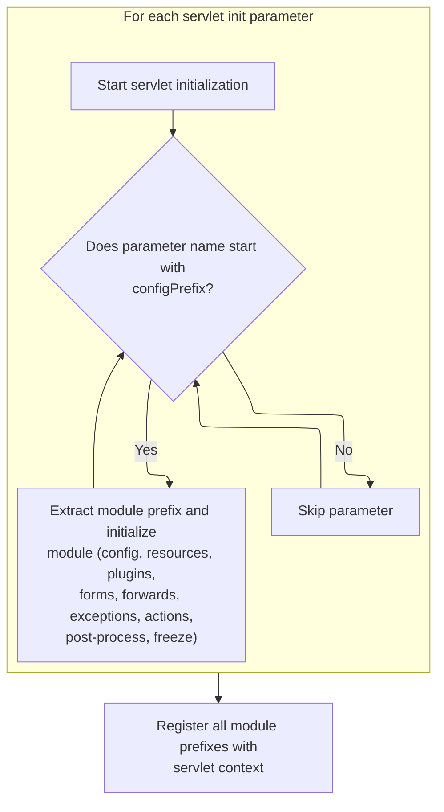

<SwmSnippet path="/core/src/main/java/org/apache/struts/action/ActionServlet.java" line="367">

---

After returning from ModuleConfigImpl.freeze, we loop through servlet init parameters and call <SwmToken path="core/src/main/java/org/apache/struts/action/ActionServlet.java" pos="379:1:1" line-data="                    initModuleConfig(prefix,">`initModuleConfig`</SwmToken> for each module prefix. This loads configs for any extra modules beyond the default.

```java
            Enumeration names = getServletConfig().getInitParameterNames();

            while (names.hasMoreElements()) {
                String name = (String) names.nextElement();

                if (!name.startsWith(configPrefix)) {
                    continue;
                }

                String prefix = name.substring(configPrefixLength);

                moduleConfig =
                    initModuleConfig(prefix,
                        getServletConfig().getInitParameter(name));
```

---

</SwmSnippet>

<SwmSnippet path="/core/src/main/java/org/apache/struts/action/ActionServlet.java" line="381">

---

After returning from ActionServlet.initModuleConfig for each module, we call <SwmToken path="core/src/main/java/org/apache/struts/action/ActionServlet.java" pos="381:1:1" line-data="                initModuleMessageResources(moduleConfig);">`initModuleMessageResources`</SwmToken> so each module gets its own message bundles loaded before continuing setup.

```java
                initModuleMessageResources(moduleConfig);
```

---

</SwmSnippet>

<SwmSnippet path="/core/src/main/java/org/apache/struts/action/ActionServlet.java" line="382">

---

After returning from ActionServlet.initModuleMessageResources for each module, we call <SwmToken path="core/src/main/java/org/apache/struts/action/ActionServlet.java" pos="382:1:1" line-data="                initModulePlugIns(moduleConfig);">`initModulePlugIns`</SwmToken> so each module's plug-ins are initialized with the right resources and config.

```java
                initModulePlugIns(moduleConfig);
```

---

</SwmSnippet>

<SwmSnippet path="/core/src/main/java/org/apache/struts/action/ActionServlet.java" line="383">

---

After returning from ActionServlet.initModulePlugIns for each module, we call <SwmToken path="core/src/main/java/org/apache/struts/action/ActionServlet.java" pos="383:1:1" line-data="                initModuleFormBeans(moduleConfig);">`initModuleFormBeans`</SwmToken> to register all the form beans for that module.

```java
                initModuleFormBeans(moduleConfig);
```

---

</SwmSnippet>

<SwmSnippet path="/core/src/main/java/org/apache/struts/action/ActionServlet.java" line="384">

---

After returning from ActionServlet.initModuleFormBeans for each module, we call <SwmToken path="core/src/main/java/org/apache/struts/action/ActionServlet.java" pos="384:1:1" line-data="                initModuleForwards(moduleConfig);">`initModuleForwards`</SwmToken> to register all the forwards for that module.

```java
                initModuleForwards(moduleConfig);
```

---

</SwmSnippet>

<SwmSnippet path="/core/src/main/java/org/apache/struts/action/ActionServlet.java" line="385">

---

After returning from ActionServlet.initModuleForwards for each module, we call <SwmToken path="core/src/main/java/org/apache/struts/action/ActionServlet.java" pos="385:1:1" line-data="                initModuleExceptionConfigs(moduleConfig);">`initModuleExceptionConfigs`</SwmToken> to register exception handling for that module.

```java
                initModuleExceptionConfigs(moduleConfig);
```

---

</SwmSnippet>

<SwmSnippet path="/core/src/main/java/org/apache/struts/action/ActionServlet.java" line="386">

---

After returning from ActionServlet.initModuleExceptionConfigs for each module, we call <SwmToken path="core/src/main/java/org/apache/struts/action/ActionServlet.java" pos="386:1:1" line-data="                initModuleActions(moduleConfig);">`initModuleActions`</SwmToken> to register all the actions for that module.

```java
                initModuleActions(moduleConfig);
```

---

</SwmSnippet>

<SwmSnippet path="/core/src/main/java/org/apache/struts/action/ActionServlet.java" line="387">

---

After returning from ActionServlet.initModuleActions for each module, we call <SwmToken path="core/src/main/java/org/apache/struts/action/ActionServlet.java" pos="387:1:1" line-data="                postProcessConfig(moduleConfig);">`postProcessConfig`</SwmToken> so plug-ins can finalize or adjust the config for that module.

```java
                postProcessConfig(moduleConfig);
```

---

</SwmSnippet>

<SwmSnippet path="/core/src/main/java/org/apache/struts/action/ActionServlet.java" line="388">

---

After returning from <SwmToken path="core/src/main/java/org/apache/struts/action/ActionServlet.java" pos="364:1:1" line-data="            postProcessConfig(moduleConfig);">`postProcessConfig`</SwmToken> for each module, we call freeze on the module config to lock it down and prevent further changes.

```java
                moduleConfig.freeze();
            }

```

---

</SwmSnippet>

<SwmSnippet path="/core/src/main/java/org/apache/struts/action/ActionServlet.java" line="391">

---

After returning from ModuleConfigImpl.freeze for all modules, we call <SwmToken path="core/src/main/java/org/apache/struts/action/ActionServlet.java" pos="391:3:3" line-data="            this.initModulePrefixes(this.getServletContext());">`initModulePrefixes`</SwmToken> to register all the module prefixes in the servlet context. This lets the framework know how to route requests to the correct module.

```java
            this.initModulePrefixes(this.getServletContext());

```

---

</SwmSnippet>

### Registering Module Prefixes

See <SwmLink doc-title="Collecting Module Prefixes">[Collecting Module Prefixes](/.swm/collecting-module-prefixes.0vl5e5v1.sw.md)</SwmLink>

### Finalizing Servlet Initialization

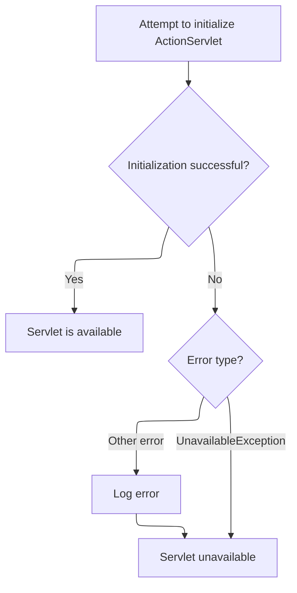

<SwmSnippet path="/core/src/main/java/org/apache/struts/action/ActionServlet.java" line="393">

---

After returning from ActionServlet.initModulePrefixes, we clean up by destroying the config digester, since config parsing is done. The rest of this block is just error handling for anything that went wrong during init—if something fails, we log it and mark the servlet as unavailable so the container knows not to serve requests. This is the final step in ActionServlet.init.

```java
            this.destroyConfigDigester();
        } catch (UnavailableException ex) {
            throw ex;
        } catch (Throwable t) {
            // The follow error message is not retrieved from internal message
            // resources as they may not have been able to have been
            // initialized
            log.error("Unable to initialize Struts ActionServlet due to an "
                + "unexpected exception or error thrown, so marking the "
                + "servlet as unavailable.  Most likely, this is due to an "
                + "incorrect or missing library dependency.", t);
            UnavailableException t2 = new UnavailableException(t.getMessage());
            t2.initCause(t);
            throw t2;
        }
    }
```

---

</SwmSnippet>

## Delegating to the Request Processor

<SwmSnippet path="/core/src/main/java/org/apache/struts/action/ActionServlet.java" line="1965">

---

Back in ActionServlet.process, after getting the <SwmToken path="core/src/main/java/org/apache/struts/action/ActionServlet.java" pos="608:5:5" line-data="    protected synchronized RequestProcessor getRequestProcessor(">`RequestProcessor`</SwmToken>, we just hand off the request and response to <SwmToken path="core/src/main/java/org/apache/struts/action/ActionServlet.java" pos="1965:1:3" line-data="        processor.process(request, response);">`processor.process`</SwmToken>. This is the last thing ActionServlet.process does—the processor takes over and runs the rest of the request flow.

```java
        processor.process(request, response);
    }
```

---

</SwmSnippet>

# Starting Request Processing

```mermaid
%%{init: {"flowchart": {"defaultRenderer": "elk"}} }%%
flowchart TD
    node1["Start processing web request"]
    click node1 openCode "core/src/main/java/org/apache/struts/action/RequestProcessor.java:148:149"
    node1 --> node2["Setting Response Content Type"]
    
    node2 --> node3{"Is request path valid?"}
    click node3 openCode "core/src/main/java/org/apache/struts/action/RequestProcessor.java:154:158"
    node3 -->|"No"| node4["Stop processing"]
    click node4 openCode "core/src/main/java/org/apache/struts/action/RequestProcessor.java:157:158"
    node3 -->|"Yes"| node5["Resolving Action Mapping"]
    
    node5 --> node6{"Is mapping found?"}
    click node6 openCode "core/src/main/java/org/apache/struts/action/RequestProcessor.java:182:184"
    node6 -->|"No"| node7["Stop processing"]
    click node7 openCode "core/src/main/java/org/apache/struts/action/RequestProcessor.java:183:184"
    node6 -->|"Yes"| node8["Enforcing Action Security"]
    
    node8 --> node9{"User has required role?"}
    click node9 openCode "core/src/main/java/org/apache/struts/action/RequestProcessor.java:187:189"
    node9 -->|"No"| node10["Stop processing"]
    click node10 openCode "core/src/main/java/org/apache/struts/action/RequestProcessor.java:188:189"
    node9 -->|"Yes"| node11["Creating or Reusing ActionForm"]
    
    node11 --> node12["Checking Form Validity"]
    
    node12 --> node13{"Form valid?"}
    click node13 openCode "core/src/main/java/org/apache/struts/action/RequestProcessor.java:198:200"
    node13 -->|"No"| node14["Handling Action Exceptions"]
    
    node14 --> node15["Process exception and forward"]
    click node15 openCode "core/src/main/java/org/apache/struts/action/RequestProcessor.java:202:204"
    node13 -->|"Yes"| node16["Process forward/include"]
    click node16 openCode "core/src/main/java/org/apache/struts/action/RequestProcessor.java:211:218"
    node16 --> node17{"Should forward?"}
    click node17 openCode "core/src/main/java/org/apache/struts/action/RequestProcessor.java:212:214"
    node17 -->|"Yes"| node18["Processing Action Forward Navigation"]
    
    node17 -->|"No"| node19{"Should include?"}
    click node19 openCode "core/src/main/java/org/apache/struts/action/RequestProcessor.java:216:218"
    node19 -->|"Yes"| node20["Including Additional Resources for Navigation"]
    
    node19 -->|"No"| node21["Instantiating or Reusing Action Objects"]
    
    node21 --> node22{"Action instance available?"}
    click node22 openCode "core/src/main/java/org/apache/struts/action/RequestProcessor.java:223:225"
    node22 -->|"No"| node23["Stop processing"]
    click node23 openCode "core/src/main/java/org/apache/struts/action/RequestProcessor.java:224:225"
    node22 -->|"Yes"| node24["Executing the Action and Returning Forward"]
    
    node24 --> node25["Process action result"]
    click node25 openCode "core/src/main/java/org/apache/struts/action/RequestProcessor.java:231:232"
    node25 --> node26["End processing"]
    click node26 openCode "core/src/main/java/org/apache/struts/action/RequestProcessor.java:233:233"

classDef HeadingStyle fill:#777777,stroke:#333,stroke-width:2px;
click node2 goToHeading "Setting Response Content Type"
node2:::HeadingStyle
click node5 goToHeading "Resolving Action Mapping"
node5:::HeadingStyle
click node8 goToHeading "Enforcing Action Security"
node8:::HeadingStyle
click node11 goToHeading "Creating or Reusing ActionForm"
node11:::HeadingStyle
click node12 goToHeading "Checking Form Validity"
node12:::HeadingStyle
click node14 goToHeading "Handling Action Exceptions"
node14:::HeadingStyle
click node18 goToHeading "Processing Action Forward Navigation"
node18:::HeadingStyle
click node20 goToHeading "Including Additional Resources for Navigation"
node20:::HeadingStyle
click node21 goToHeading "Instantiating or Reusing Action Objects"
node21:::HeadingStyle
click node24 goToHeading "Executing the Action and Returning Forward"
node24:::HeadingStyle

%% Swimm:
%% %%{init: {"flowchart": {"defaultRenderer": "elk"}} }%%
%% flowchart TD
%%     node1["Start processing web request"]
%%     click node1 openCode "<SwmPath>[core/…/action/RequestProcessor.java](core/src/main/java/org/apache/struts/action/RequestProcessor.java)</SwmPath>:148:149"
%%     node1 --> node2["Setting Response Content Type"]
%%     
%%     node2 --> node3{"Is request path valid?"}
%%     click node3 openCode "<SwmPath>[core/…/action/RequestProcessor.java](core/src/main/java/org/apache/struts/action/RequestProcessor.java)</SwmPath>:154:158"
%%     node3 -->|"No"| node4["Stop processing"]
%%     click node4 openCode "<SwmPath>[core/…/action/RequestProcessor.java](core/src/main/java/org/apache/struts/action/RequestProcessor.java)</SwmPath>:157:158"
%%     node3 -->|"Yes"| node5["Resolving Action Mapping"]
%%     
%%     node5 --> node6{"Is mapping found?"}
%%     click node6 openCode "<SwmPath>[core/…/action/RequestProcessor.java](core/src/main/java/org/apache/struts/action/RequestProcessor.java)</SwmPath>:182:184"
%%     node6 -->|"No"| node7["Stop processing"]
%%     click node7 openCode "<SwmPath>[core/…/action/RequestProcessor.java](core/src/main/java/org/apache/struts/action/RequestProcessor.java)</SwmPath>:183:184"
%%     node6 -->|"Yes"| node8["Enforcing Action Security"]
%%     
%%     node8 --> node9{"User has required role?"}
%%     click node9 openCode "<SwmPath>[core/…/action/RequestProcessor.java](core/src/main/java/org/apache/struts/action/RequestProcessor.java)</SwmPath>:187:189"
%%     node9 -->|"No"| node10["Stop processing"]
%%     click node10 openCode "<SwmPath>[core/…/action/RequestProcessor.java](core/src/main/java/org/apache/struts/action/RequestProcessor.java)</SwmPath>:188:189"
%%     node9 -->|"Yes"| node11["Creating or Reusing <SwmToken path="core/src/main/java/org/apache/struts/action/RequestProcessor.java" pos="191:7:7" line-data="        // Process any ActionForm bean related to this request">`ActionForm`</SwmToken>"]
%%     
%%     node11 --> node12["Checking Form Validity"]
%%     
%%     node12 --> node13{"Form valid?"}
%%     click node13 openCode "<SwmPath>[core/…/action/RequestProcessor.java](core/src/main/java/org/apache/struts/action/RequestProcessor.java)</SwmPath>:198:200"
%%     node13 -->|"No"| node14["Handling Action Exceptions"]
%%     
%%     node14 --> node15["Process exception and forward"]
%%     click node15 openCode "<SwmPath>[core/…/action/RequestProcessor.java](core/src/main/java/org/apache/struts/action/RequestProcessor.java)</SwmPath>:202:204"
%%     node13 -->|"Yes"| node16["Process forward/include"]
%%     click node16 openCode "<SwmPath>[core/…/action/RequestProcessor.java](core/src/main/java/org/apache/struts/action/RequestProcessor.java)</SwmPath>:211:218"
%%     node16 --> node17{"Should forward?"}
%%     click node17 openCode "<SwmPath>[core/…/action/RequestProcessor.java](core/src/main/java/org/apache/struts/action/RequestProcessor.java)</SwmPath>:212:214"
%%     node17 -->|"Yes"| node18["Processing Action Forward Navigation"]
%%     
%%     node17 -->|"No"| node19{"Should include?"}
%%     click node19 openCode "<SwmPath>[core/…/action/RequestProcessor.java](core/src/main/java/org/apache/struts/action/RequestProcessor.java)</SwmPath>:216:218"
%%     node19 -->|"Yes"| node20["Including Additional Resources for Navigation"]
%%     
%%     node19 -->|"No"| node21["Instantiating or Reusing Action Objects"]
%%     
%%     node21 --> node22{"Action instance available?"}
%%     click node22 openCode "<SwmPath>[core/…/action/RequestProcessor.java](core/src/main/java/org/apache/struts/action/RequestProcessor.java)</SwmPath>:223:225"
%%     node22 -->|"No"| node23["Stop processing"]
%%     click node23 openCode "<SwmPath>[core/…/action/RequestProcessor.java](core/src/main/java/org/apache/struts/action/RequestProcessor.java)</SwmPath>:224:225"
%%     node22 -->|"Yes"| node24["Executing the Action and Returning Forward"]
%%     
%%     node24 --> node25["Process action result"]
%%     click node25 openCode "<SwmPath>[core/…/action/RequestProcessor.java](core/src/main/java/org/apache/struts/action/RequestProcessor.java)</SwmPath>:231:232"
%%     node25 --> node26["End processing"]
%%     click node26 openCode "<SwmPath>[core/…/action/RequestProcessor.java](core/src/main/java/org/apache/struts/action/RequestProcessor.java)</SwmPath>:233:233"
%% 
%% classDef HeadingStyle fill:#777777,stroke:#333,stroke-width:2px;
%% click node2 goToHeading "Setting Response Content Type"
%% node2:::HeadingStyle
%% click node5 goToHeading "Resolving Action Mapping"
%% node5:::HeadingStyle
%% click node8 goToHeading "Enforcing Action Security"
%% node8:::HeadingStyle
%% click node11 goToHeading "Creating or Reusing <SwmToken path="core/src/main/java/org/apache/struts/action/RequestProcessor.java" pos="191:7:7" line-data="        // Process any ActionForm bean related to this request">`ActionForm`</SwmToken>"
%% node11:::HeadingStyle
%% click node12 goToHeading "Checking Form Validity"
%% node12:::HeadingStyle
%% click node14 goToHeading "Handling Action Exceptions"
%% node14:::HeadingStyle
%% click node18 goToHeading "Processing Action Forward Navigation"
%% node18:::HeadingStyle
%% click node20 goToHeading "Including Additional Resources for Navigation"
%% node20:::HeadingStyle
%% click node21 goToHeading "Instantiating or Reusing Action Objects"
%% node21:::HeadingStyle
%% click node24 goToHeading "Executing the Action and Returning Forward"
%% node24:::HeadingStyle
```

<SwmSnippet path="/core/src/main/java/org/apache/struts/action/RequestProcessor.java" line="148">

---

In process, we wrap the request if it's multipart, then extract the path using <SwmToken path="core/src/main/java/org/apache/struts/action/RequestProcessor.java" pos="154:7:7" line-data="        String path = processPath(request, response);">`processPath`</SwmToken>. If we can't get a valid path, we bail out early. Otherwise, we log the method and path for debugging. This sets up which action mapping to use next.

```java
    public void process(HttpServletRequest request, HttpServletResponse response)
        throws IOException, ServletException {
        // Wrap multipart requests with a special wrapper
        request = processMultipart(request);

        // Identify the path component we will use to select a mapping
        String path = processPath(request, response);

        if (path == null) {
            return;
        }

        if (log.isDebugEnabled()) {
            log.debug("Processing a '" + request.getMethod() + "' for path '"
                + path + "'");
        }

```

---

</SwmSnippet>

<SwmSnippet path="/core/src/main/java/org/apache/struts/action/RequestProcessor.java" line="739">

---

ProcessPath does more than just grab a path string—it checks and sets the original URI, tries to extract the path from several request attributes, validates the module prefix, and strips both the prefix and any file extension. If anything doesn't line up, it logs an error and returns null. This is all Struts-specific logic to get the right action mapping key.

```java
    protected String processPath(HttpServletRequest request,
        HttpServletResponse response)
        throws IOException {
        String path;

        // Set per request the original path for postback forms
        if (request.getAttribute(Globals.ORIGINAL_URI_KEY) == null) {
            request.setAttribute(Globals.ORIGINAL_URI_KEY, request.getServletPath());
        }

        // For prefix matching, match on the path info (if any)
        path = (String) request.getAttribute(INCLUDE_PATH_INFO);

        if (path == null) {
            path = request.getPathInfo();
        }

        if ((path != null) && (path.length() > 0)) {
            return (path);
        }

        // For extension matching, strip the module prefix and extension
        path = (String) request.getAttribute(INCLUDE_SERVLET_PATH);

        if (path == null) {
            path = request.getServletPath();
        }

        String prefix = moduleConfig.getPrefix();

        if (!path.startsWith(prefix)) {
            String msg = getInternal().getMessage("processPath");

            log.error(msg + " " + request.getRequestURI());
            response.sendError(HttpServletResponse.SC_BAD_REQUEST, msg);

            return null;
        }

        path = path.substring(prefix.length());

        int slash = path.lastIndexOf("/");
        int period = path.lastIndexOf(".");

        if ((period >= 0) && (period > slash)) {
            path = path.substring(0, period);
        }

        return (path);
    }
```

---

</SwmSnippet>

<SwmSnippet path="/core/src/main/java/org/apache/struts/action/RequestProcessor.java" line="165">

---

After <SwmToken path="core/src/main/java/org/apache/struts/action/RequestProcessor.java" pos="154:7:7" line-data="        String path = processPath(request, response);">`processPath`</SwmToken>, we immediately set up the locale and content type for the response, and then handle <SwmToken path="core/src/main/java/org/apache/struts/action/RequestProcessor.java" pos="723:13:15" line-data="            response.setHeader(&quot;Cache-Control&quot;, &quot;no-cache,no-store,max-age=0&quot;);">`no-cache`</SwmToken> headers. This makes sure the response is formatted and delivered with the right headers before we do any action-specific logic.

```java
        // Select a Locale for the current user if requested
        processLocale(request, response);

        // Set the content type and no-caching headers if requested
        processContent(request, response);
```

---

</SwmSnippet>

## Setting Response Content Type

<SwmSnippet path="/core/src/main/java/org/apache/struts/action/RequestProcessor.java" line="479">

---

ProcessContent grabs the content type from the module's controller config and sets it on the response if present. This lets each module control how its responses are served to clients.

```java
    protected void processContent(HttpServletRequest request,
        HttpServletResponse response) {
        String contentType =
            moduleConfig.getControllerConfig().getContentType();

        if (contentType != null) {
            response.setContentType(contentType);
        }
    }
```

---

</SwmSnippet>

<SwmSnippet path="/core/src/main/java/org/apache/struts/upload/CommonsMultipartRequestHandler.java" line="538">

---

SetContentType in <SwmToken path="core/src/main/java/org/apache/struts/upload/CommonsMultipartRequestHandler.java" pos="58:4:4" line-data="public class CommonsMultipartRequestHandler implements MultipartRequestHandler {">`CommonsMultipartRequestHandler`</SwmToken> just throws <SwmToken path="core/src/main/java/org/apache/struts/upload/CommonsMultipartRequestHandler.java" pos="539:5:5" line-data="            throw new UnsupportedOperationException(">`UnsupportedOperationException`</SwmToken>. It's a stub to make it clear you can't set the content type this way for multipart requests.

```java
        public void setContentType(String contentType) {
            throw new UnsupportedOperationException(
                "The setContentType() method is not supported.");
        }
```

---

</SwmSnippet>

## Applying No-Cache Headers

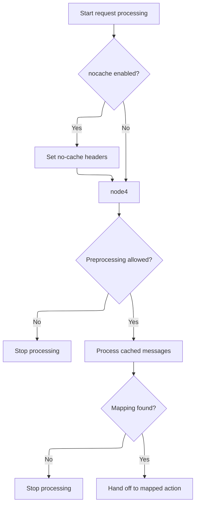

<SwmSnippet path="/core/src/main/java/org/apache/struts/action/RequestProcessor.java" line="170">

---

After <SwmToken path="core/src/main/java/org/apache/struts/action/RequestProcessor.java" pos="169:1:1" line-data="        processContent(request, response);">`processContent`</SwmToken>, we call <SwmToken path="core/src/main/java/org/apache/struts/action/RequestProcessor.java" pos="170:1:1" line-data="        processNoCache(request, response);">`processNoCache`</SwmToken> to set HTTP headers that prevent caching if the config says so. This keeps responses from being cached by browsers or proxies.

```java
        processNoCache(request, response);

```

---

</SwmSnippet>

<SwmSnippet path="/core/src/main/java/org/apache/struts/action/RequestProcessor.java" line="719">

---

ProcessNoCache checks the module config for the <SwmToken path="core/src/main/java/org/apache/struts/action/RequestProcessor.java" pos="723:13:15" line-data="            response.setHeader(&quot;Cache-Control&quot;, &quot;no-cache,no-store,max-age=0&quot;);">`no-cache`</SwmToken> flag and, if set, adds standard HTTP headers to prevent caching. Setting Expires to 1 is just a way to make sure the response is always considered expired.

```java
    protected void processNoCache(HttpServletRequest request,
        HttpServletResponse response) {
        if (moduleConfig.getControllerConfig().getNocache()) {
            response.setHeader("Pragma", "No-cache");
            response.setHeader("Cache-Control", "no-cache,no-store,max-age=0");
            response.setDateHeader("Expires", 1);
        }
    }
```

---

</SwmSnippet>

<SwmSnippet path="/core/src/main/java/org/apache/struts/action/RequestProcessor.java" line="172">

---

After <SwmToken path="core/src/main/java/org/apache/struts/action/RequestProcessor.java" pos="170:1:1" line-data="        processNoCache(request, response);">`processNoCache`</SwmToken>, we hit a preprocess hook. If <SwmToken path="core/src/main/java/org/apache/struts/action/RequestProcessor.java" pos="173:5:5" line-data="        if (!processPreprocess(request, response)) {">`processPreprocess`</SwmToken> returns false, we stop processing. Otherwise, we keep going. This is a spot for custom logic in subclasses.

```java
        // General purpose preprocessing hook
        if (!processPreprocess(request, response)) {
            return;
        }

```

---

</SwmSnippet>

<SwmSnippet path="/core/src/main/java/org/apache/struts/action/RequestProcessor.java" line="844">

---

ProcessPreprocess just returns true by default. It's a stub for subclasses to override if they want to add custom preprocessing.

```java
    protected boolean processPreprocess(HttpServletRequest request,
        HttpServletResponse response) {
        return (true);
    }
```

---

</SwmSnippet>

<SwmSnippet path="/core/src/main/java/org/apache/struts/action/RequestProcessor.java" line="177">

---

After preprocess, we process any cached messages, then try to find the action mapping for the path. If we can't find a mapping, we bail out early. Otherwise, we keep going with the mapped action.

```java
        this.processCachedMessages(request, response);

        // Identify the mapping for this request
        ActionMapping mapping = processMapping(request, response, path);

        if (mapping == null) {
            return;
        }

```

---

</SwmSnippet>

## Resolving Action Mapping

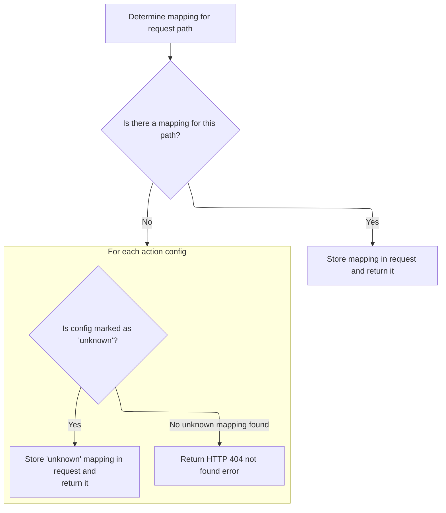

<SwmSnippet path="/core/src/main/java/org/apache/struts/action/RequestProcessor.java" line="652">

---

In <SwmToken path="core/src/main/java/org/apache/struts/action/RequestProcessor.java" pos="652:5:5" line-data="    protected ActionMapping processMapping(HttpServletRequest request,">`processMapping`</SwmToken>, we look up the action mapping for the path using <SwmToken path="core/src/main/java/org/apache/struts/action/RequestProcessor.java" pos="657:5:5" line-data="            (ActionMapping) moduleConfig.findActionConfig(path);">`moduleConfig`</SwmToken>. If we don't find one, we keep going to see if there's an 'unknown' mapping as a fallback. This is where we tie the request path to an action config.

```java
    protected ActionMapping processMapping(HttpServletRequest request,
        HttpServletResponse response, String path)
        throws IOException {
        // Is there a mapping for this path?
        ActionMapping mapping =
            (ActionMapping) moduleConfig.findActionConfig(path);

```

---

</SwmSnippet>

<SwmSnippet path="/core/src/main/java/org/apache/struts/action/RequestProcessor.java" line="659">

---

After returning from <SwmToken path="core/src/main/java/org/apache/struts/action/RequestProcessor.java" pos="667:9:9" line-data="        ActionConfig[] configs = moduleConfig.findActionConfigs();">`moduleConfig`</SwmToken>, if we found a mapping, we stash it in the request for later use and return it. If not, we check for an 'unknown' mapping. If still nothing, we bail out.

```java
        // If a mapping is found, put it in the request and return it
        if (mapping != null) {
            request.setAttribute(Globals.MAPPING_KEY, mapping);

            return (mapping);
        }

        // Locate the mapping for unknown paths (if any)
        ActionConfig[] configs = moduleConfig.findActionConfigs();

        for (int i = 0; i < configs.length; i++) {
            if (configs[i].getUnknown()) {
                mapping = (ActionMapping) configs[i];
                request.setAttribute(Globals.MAPPING_KEY, mapping);

                return (mapping);
            }
        }
```

---

</SwmSnippet>

<SwmSnippet path="/core/src/main/java/org/apache/struts/action/RequestProcessor.java" line="678">

---

If we can't find any mapping, we log an error and send a 404 response. The user just sees a not found error.

```java
        // No mapping can be found to process this request
        String msg = getInternal().getMessage("processInvalid");

        log.error(msg + " " + path);
        response.sendError(HttpServletResponse.SC_NOT_FOUND, msg);

        return null;
    }
```

---

</SwmSnippet>

## Checking Action Roles

<SwmSnippet path="/core/src/main/java/org/apache/struts/action/RequestProcessor.java" line="186">

---

After mapping, we check if the user has the required role for the action. If not, we bail out and send a forbidden error. Otherwise, we keep going.

```java
        // Check for any role required to perform this action
        if (!processRoles(request, response, mapping)) {
            return;
        }

```

---

</SwmSnippet>

## Enforcing Action Security

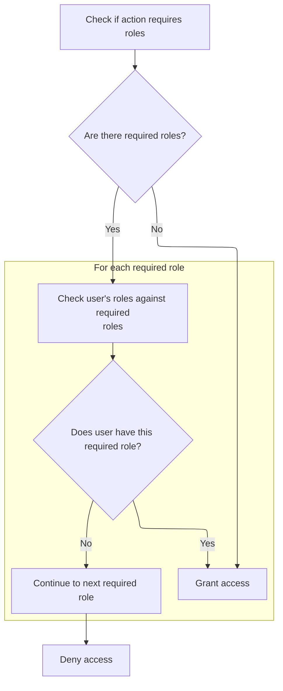

<SwmSnippet path="/core/src/main/java/org/apache/struts/action/RequestProcessor.java" line="863">

---

In <SwmToken path="core/src/main/java/org/apache/struts/action/RequestProcessor.java" pos="863:5:5" line-data="    protected boolean processRoles(HttpServletRequest request,">`processRoles`</SwmToken>, we grab the roles required for the action. If none are set, we allow access. Otherwise, we check if the user has any of the roles and grant access if so.

```java
    protected boolean processRoles(HttpServletRequest request,
        HttpServletResponse response, ActionMapping mapping)
        throws IOException, ServletException {
        // Is this action protected by role requirements?
        String[] roles = mapping.getRoleNames();

        if ((roles == null) || (roles.length < 1)) {
            return (true);
        }

        // Check the current user against the list of required roles
        for (int i = 0; i < roles.length; i++) {
            if (request.isUserInRole(roles[i])) {
                if (log.isDebugEnabled()) {
                    log.debug(" User '" + request.getRemoteUser()
                        + "' has role '" + roles[i] + "', granting access");
                }

                return (true);
            }
        }
```

---

</SwmSnippet>

<SwmSnippet path="/core/src/main/java/org/apache/struts/action/RequestProcessor.java" line="891">

---

If the user doesn't have any required role, we send a 403 error with a localized message from internal resources. This is where we bail out for unauthorized access.

```java
        response.sendError(HttpServletResponse.SC_FORBIDDEN,
            getInternal().getMessage("notAuthorized", mapping.getPath()));

        return (false);
    }
```

---

</SwmSnippet>

## Resolving Localized Messages

```mermaid
%%{init: {"flowchart": {"defaultRenderer": "elk"}} }%%
flowchart TD
  node1["Request message for locale and key"]
  click node1 openCode "core/src/main/java/org/apache/struts/util/PropertyMessageResources.java:227:232"
  node2{"Message found for requested locale?"}
  click node2 openCode "core/src/main/java/org/apache/struts/util/PropertyMessageResources.java:237:241"
  node1 --> node2
  node2 -->|"Yes"| node8["Return message"]
  click node8 openCode "core/src/main/java/org/apache/struts/util/PropertyMessageResources.java:240:241"
  node2 -->|"No"| node3{"Mode?"}
  click node3 openCode "core/src/main/java/org/apache/struts/util/PropertyMessageResources.java:244:265"
  node3 -->|"JSTL"| node6{"Message found in default properties?"}
  node3 -->|"ResourceBundle"| loop1
  node3 -->|"Default"| node5{"Message found in default locale?"}

  subgraph loop1["Search through default locale
hierarchy"]
    node4{"Message found in any fallback locale?"}
    click node4 openCode "core/src/main/java/org/apache/struts/util/PropertyMessageResources.java:252:254"
    node4 -->|"Yes"| node8
    node4 -->|"No"| node6
  end

  node5 -->|"Yes"| node8
  node5 -->|"No"| node6
  node6 -->|"Yes"| node8
  node6 -->|"No"| node7{"returnNull is true?"}
  click node7 openCode "core/src/main/java/org/apache/struts/util/PropertyMessageResources.java:277:281"
  node7 -->|"Yes"| node9["Return null"]
  click node9 openCode "core/src/main/java/org/apache/struts/util/PropertyMessageResources.java:278:279"
  node7 -->|"No"| node10["Return placeholder (???key???)"]
  click node10 openCode "core/src/main/java/org/apache/struts/util/PropertyMessageResources.java:280:281"
classDef HeadingStyle fill:#777777,stroke:#333,stroke-width:2px;

%% Swimm:
%% %%{init: {"flowchart": {"defaultRenderer": "elk"}} }%%
%% flowchart TD
%%   node1["Request message for locale and key"]
%%   click node1 openCode "<SwmPath>[core/…/util/PropertyMessageResources.java](core/src/main/java/org/apache/struts/util/PropertyMessageResources.java)</SwmPath>:227:232"
%%   node2{"Message found for requested locale?"}
%%   click node2 openCode "<SwmPath>[core/…/util/PropertyMessageResources.java](core/src/main/java/org/apache/struts/util/PropertyMessageResources.java)</SwmPath>:237:241"
%%   node1 --> node2
%%   node2 -->|"Yes"| node8["Return message"]
%%   click node8 openCode "<SwmPath>[core/…/util/PropertyMessageResources.java](core/src/main/java/org/apache/struts/util/PropertyMessageResources.java)</SwmPath>:240:241"
%%   node2 -->|"No"| node3{"Mode?"}
%%   click node3 openCode "<SwmPath>[core/…/util/PropertyMessageResources.java](core/src/main/java/org/apache/struts/util/PropertyMessageResources.java)</SwmPath>:244:265"
%%   node3 -->|"JSTL"| node6{"Message found in default properties?"}
%%   node3 -->|"ResourceBundle"| loop1
%%   node3 -->|"Default"| node5{"Message found in default locale?"}
%% 
%%   subgraph loop1["Search through default locale
%% hierarchy"]
%%     node4{"Message found in any fallback locale?"}
%%     click node4 openCode "<SwmPath>[core/…/util/PropertyMessageResources.java](core/src/main/java/org/apache/struts/util/PropertyMessageResources.java)</SwmPath>:252:254"
%%     node4 -->|"Yes"| node8
%%     node4 -->|"No"| node6
%%   end
%% 
%%   node5 -->|"Yes"| node8
%%   node5 -->|"No"| node6
%%   node6 -->|"Yes"| node8
%%   node6 -->|"No"| node7{"<SwmToken path="core/src/main/java/org/apache/struts/util/PropertyMessageResources.java" pos="277:4:4" line-data="        if (returnNull) {">`returnNull`</SwmToken> is true?"}
%%   click node7 openCode "<SwmPath>[core/…/util/PropertyMessageResources.java](core/src/main/java/org/apache/struts/util/PropertyMessageResources.java)</SwmPath>:277:281"
%%   node7 -->|"Yes"| node9["Return null"]
%%   click node9 openCode "<SwmPath>[core/…/util/PropertyMessageResources.java](core/src/main/java/org/apache/struts/util/PropertyMessageResources.java)</SwmPath>:278:279"
%%   node7 -->|"No"| node10["Return placeholder (???key???)"]
%%   click node10 openCode "<SwmPath>[core/…/util/PropertyMessageResources.java](core/src/main/java/org/apache/struts/util/PropertyMessageResources.java)</SwmPath>:280:281"
%% classDef HeadingStyle fill:#777777,stroke:#333,stroke-width:2px;
```

<SwmSnippet path="/core/src/main/java/org/apache/struts/util/PropertyMessageResources.java" line="227">

---

GetMessage tries to find a localized message for the given key and locale. It uses different fallback strategies depending on the mode, and if nothing is found, it returns null or a placeholder string.

```java
    public String getMessage(Locale locale, String key) {
        if (log.isDebugEnabled()) {
            log.debug("getMessage(" + locale + "," + key + ")");
        }

        // Initialize variables we will require
        String localeKey = localeKey(locale);
        String originalKey = messageKey(localeKey, key);
        String message = null;

        // Search the specified Locale
        message = findMessage(locale, key, originalKey);
        if (message != null) {
            return message;
        }

        // JSTL Compatibility - JSTL doesn't use the default locale
        if (mode == MODE_JSTL) {

           // do nothing (i.e. don't use default Locale)

        // PropertyResourcesBundle - searches through the hierarchy
        // for the default Locale (e.g. first en_US then en)
        } else if (mode == MODE_RESOURCE_BUNDLE) {

            if (!defaultLocale.equals(locale)) {
                message = findMessage(defaultLocale, key, originalKey);
            }

        // Default (backwards) Compatibility - just searches the
        // specified Locale (e.g. just en_US)
        } else {

            if (!defaultLocale.equals(locale)) {
                localeKey = localeKey(defaultLocale);
                message = findMessage(localeKey, key, originalKey);
            }

        }
        if (message != null) {
            return message;
        }

        // Find the message in the default properties file
        message = findMessage("", key, originalKey);
        if (message != null) {
            return message;
        }

        // Return an appropriate error indication
        if (returnNull) {
            return (null);
        } else {
            return ("???" + messageKey(locale, key) + "???");
        }
    }
```

---

</SwmSnippet>

<SwmSnippet path="/core/src/main/java/org/apache/struts/util/PropertyMessageResources.java" line="393">

---

FindMessage tries to find a message for the most specific locale key first, then strips off segments (like <SwmToken path="core/src/main/java/org/apache/struts/util/PropertyMessageResources.java" pos="249:19:19" line-data="        // for the default Locale (e.g. first en_US then en)">`en_US`</SwmToken> to 'en') to try more general keys. This keeps looking until it finds a match or gives up.

```java
    private String findMessage(Locale locale, String key, String originalKey) {

        // Initialize variables we will require
        String localeKey = localeKey(locale);
        String messageKey = null;
        String message = null;
        int underscore = 0;

        // Loop from specific to general Locales looking for this message
        while (true) {
            message = findMessage(localeKey, key, originalKey);
            if (message != null) {
                break;
            }

            // Strip trailing modifiers to try a more general locale key
            underscore = localeKey.lastIndexOf("_");

            if (underscore < 0) {
                break;
            }

            localeKey = localeKey.substring(0, underscore);
        }
```

---

</SwmSnippet>

## Handling Action Forms

<SwmSnippet path="/core/src/main/java/org/apache/struts/action/RequestProcessor.java" line="191">

---

After checking roles, we process the <SwmToken path="core/src/main/java/org/apache/struts/action/RequestProcessor.java" pos="191:7:7" line-data="        // Process any ActionForm bean related to this request">`ActionForm`</SwmToken> for the request. This is where we create or reuse the form bean that will hold the request data.

```java
        // Process any ActionForm bean related to this request
        ActionForm form = processActionForm(request, response, mapping);

```

---

</SwmSnippet>

## Creating or Reusing <SwmToken path="core/src/main/java/org/apache/struts/action/RequestProcessor.java" pos="191:7:7" line-data="        // Process any ActionForm bean related to this request">`ActionForm`</SwmToken>

<SwmSnippet path="/core/src/main/java/org/apache/struts/action/RequestProcessor.java" line="316">

---

In <SwmToken path="core/src/main/java/org/apache/struts/action/RequestProcessor.java" pos="316:5:5" line-data="    protected ActionForm processActionForm(HttpServletRequest request,">`processActionForm`</SwmToken>, we use <SwmToken path="core/src/main/java/org/apache/struts/action/RequestProcessor.java" pos="320:1:3" line-data="            RequestUtils.createActionForm(request, mapping, moduleConfig,">`RequestUtils.createActionForm`</SwmToken> to get the form bean. If the mapping doesn't specify an attribute or config, we just return null. Otherwise, we try to reuse an existing form or create a new one.

```java
    protected ActionForm processActionForm(HttpServletRequest request,
        HttpServletResponse response, ActionMapping mapping) {
        // Create (if necessary) a form bean to use
        ActionForm instance =
            RequestUtils.createActionForm(request, mapping, moduleConfig,
                servlet);

        if (instance == null) {
            return (null);
        }

        // Store the new instance in the appropriate scope
        if (log.isDebugEnabled()) {
            log.debug(" Storing ActionForm bean instance in scope '"
                + mapping.getScope() + "' under attribute key '"
                + mapping.getAttribute() + "'");
        }

```

---

</SwmSnippet>

### Instantiating or Recycling Form Beans

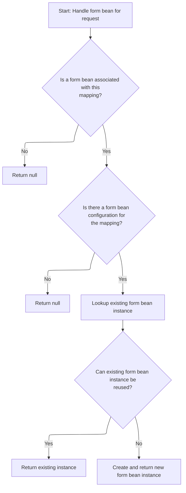

<SwmSnippet path="/core/src/main/java/org/apache/struts/util/RequestUtils.java" line="187">

---

CreateActionForm checks if there's an existing form instance and if the config says it can be reused. If not, we create a new one. This is where we decide between recycling and instantiating forms.

```java
    public static ActionForm createActionForm(HttpServletRequest request,
        ActionMapping mapping, ModuleConfig moduleConfig, ActionServlet servlet) {
        // Is there a form bean associated with this mapping?
        String attribute = mapping.getAttribute();

        if (attribute == null) {
            return (null);
        }

        // Look up the form bean configuration information to use
        String name = mapping.getName();
        FormBeanConfig config = moduleConfig.findFormBeanConfig(name);

        if (config == null) {
            log.warn("No FormBeanConfig found under '" + name + "'");

            return (null);
        }

        ActionForm instance =
            lookupActionForm(request, attribute, mapping.getScope());

        // Can we recycle the existing form bean instance (if there is one)?
        if ((instance != null) && config.canReuse(instance)) {
            return (instance);
        }

        return createActionForm(config, servlet);
    }
```

---

</SwmSnippet>

<SwmSnippet path="/core/src/main/java/org/apache/struts/config/FormBeanConfig.java" line="369">

---

CanReuse checks if the form is dynamic, a <SwmToken path="core/src/main/java/org/apache/struts/config/FormBeanConfig.java" pos="385:8:8" line-data="                    if (form instanceof BeanValidatorForm) {">`BeanValidatorForm`</SwmToken>, or just a regular form. For dynamic forms, it matches the class name. For <SwmToken path="core/src/main/java/org/apache/struts/config/FormBeanConfig.java" pos="385:8:8" line-data="                    if (form instanceof BeanValidatorForm) {">`BeanValidatorForm`</SwmToken>, it checks the wrapped instance. Otherwise, it uses class compatibility. If anything goes wrong, we just create a new instance.

```java
    public boolean canReuse(ActionForm form) {
        if (form != null) {
            if (this.getDynamic()) {
                String className = ((DynaBean) form).getDynaClass().getName();

                if (className.equals(this.getName())) {
                    log.debug("Can reuse existing instance (dynamic)");

                    return (true);
                }
            } else {
                try {
                    // check if the form's class is compatible with the class
                    //      we're configured for
                    Class formClass = form.getClass();

                    if (form instanceof BeanValidatorForm) {
                        BeanValidatorForm beanValidatorForm =
                            (BeanValidatorForm) form;

                        if (beanValidatorForm.getInstance() instanceof DynaBean) {
                            String formName = beanValidatorForm.getStrutsConfigFormName();
                            if (getName().equals(formName)) {
                                log.debug("Can reuse existing instance (BeanValidatorForm)");
                                return true;
                            } else {
                                return false;
                            }
                        }
                        formClass = beanValidatorForm.getInstance().getClass();
                    }

                    Class configClass =
                        ClassUtils.getApplicationClass(this.getType());

                    if (configClass.isAssignableFrom(formClass)) {
                        log.debug("Can reuse existing instance (non-dynamic)");

                        return (true);
                    }
                } catch (Exception e) {
                    log.debug("Error testing existing instance for reusability; just create a new instance",
                        e);
                }
            }
        }

        return false;
    }
```

---

</SwmSnippet>

### Storing the <SwmToken path="core/src/main/java/org/apache/struts/action/RequestProcessor.java" pos="191:7:7" line-data="        // Process any ActionForm bean related to this request">`ActionForm`</SwmToken> Instance

<SwmSnippet path="/core/src/main/java/org/apache/struts/action/RequestProcessor.java" line="334">

---

After getting the <SwmToken path="core/src/main/java/org/apache/struts/action/RequestProcessor.java" pos="191:7:7" line-data="        // Process any ActionForm bean related to this request">`ActionForm`</SwmToken> from <SwmToken path="core/src/main/java/org/apache/struts/action/ActionServlet.java" pos="615:5:5" line-data="                    (RequestProcessor) RequestUtils.applicationInstance(config.getControllerConfig()">`RequestUtils`</SwmToken>, we store it in the request or session based on the mapping's scope. This makes the form available for the rest of the request or across multiple requests if needed.

```java
        if ("request".equals(mapping.getScope())) {
            request.setAttribute(mapping.getAttribute(), instance);
        } else {
            HttpSession session = request.getSession();

            session.setAttribute(mapping.getAttribute(), instance);
        }

        return (instance);
    }
```

---

</SwmSnippet>

## Populating Form Data

<SwmSnippet path="/core/src/main/java/org/apache/struts/action/RequestProcessor.java" line="194">

---

After returning from <SwmToken path="core/src/main/java/org/apache/struts/action/RequestProcessor.java" pos="192:7:7" line-data="        ActionForm form = processActionForm(request, response, mapping);">`processActionForm`</SwmToken> in <SwmToken path="core/src/main/java/org/apache/struts/action/ActionServlet.java" pos="608:5:5" line-data="    protected synchronized RequestProcessor getRequestProcessor(">`RequestProcessor`</SwmToken>, we call <SwmToken path="core/src/main/java/org/apache/struts/action/RequestProcessor.java" pos="194:1:1" line-data="        processPopulate(request, response, form, mapping);">`processPopulate`</SwmToken> to fill the <SwmToken path="core/src/main/java/org/apache/struts/action/RequestProcessor.java" pos="191:7:7" line-data="        // Process any ActionForm bean related to this request">`ActionForm`</SwmToken> bean with request data. This step is needed so the form has all user input before we move on to validation or further processing.

```java
        processPopulate(request, response, form, mapping);

```

---

</SwmSnippet>

## Filling Form Properties

<SwmSnippet path="/core/src/main/java/org/apache/struts/action/RequestProcessor.java" line="803">

---

In <SwmToken path="core/src/main/java/org/apache/struts/action/RequestProcessor.java" pos="803:5:5" line-data="    protected void processPopulate(HttpServletRequest request,">`processPopulate`</SwmToken>, we reset the form, set the servlet, handle multipart setup, and then call <SwmToken path="core/src/main/java/org/apache/struts/action/RequestProcessor.java" pos="823:1:3" line-data="        RequestUtils.populate(form, mapping.getPrefix(), mapping.getSuffix(),">`RequestUtils.populate`</SwmToken> to copy request parameters into the form bean. This lets us handle both regular and multipart forms, and ensures the form is ready for validation.

```java
    protected void processPopulate(HttpServletRequest request,
        HttpServletResponse response, ActionForm form, ActionMapping mapping)
        throws ServletException {
        if (form == null) {
            return;
        }

        // Populate the bean properties of this ActionForm instance
        if (log.isDebugEnabled()) {
            log.debug(" Populating bean properties from this request");
        }

        form.setServlet(this.servlet);
        form.reset(mapping, request);

        if (mapping.getMultipartClass() != null) {
            request.setAttribute(Globals.MULTIPART_KEY,
                mapping.getMultipartClass());
        }

        RequestUtils.populate(form, mapping.getPrefix(), mapping.getSuffix(),
            request);

```

---

</SwmSnippet>

### Mapping Request Data to Form

See <SwmLink doc-title="Populating a bean from request parameters">[Populating a bean from request parameters](/.swm/populating-a-bean-from-request-parameters.naij6rnj.sw.md)</SwmLink>

### Detecting Cancel Requests

<SwmSnippet path="/core/src/main/java/org/apache/struts/action/RequestProcessor.java" line="826">

---

After returning from <SwmToken path="core/src/main/java/org/apache/struts/action/RequestProcessor.java" pos="823:1:3" line-data="        RequestUtils.populate(form, mapping.getPrefix(), mapping.getSuffix(),">`RequestUtils.populate`</SwmToken> in <SwmToken path="core/src/main/java/org/apache/struts/action/RequestProcessor.java" pos="194:1:1" line-data="        processPopulate(request, response, form, mapping);">`processPopulate`</SwmToken>, we check for cancel parameters using MultipartRequestWrapper.getParameter. If found, we set <SwmToken path="core/src/main/java/org/apache/struts/action/RequestProcessor.java" pos="829:5:7" line-data="            request.setAttribute(Globals.CANCEL_KEY, Boolean.TRUE);">`Globals.CANCEL_KEY`</SwmToken> so later logic knows the user cancelled, regardless of form type.

```java
        // Set the cancellation request attribute if appropriate
        if ((request.getParameter(Globals.CANCEL_PROPERTY) != null)
            || (request.getParameter(Globals.CANCEL_PROPERTY_X) != null)) {
            request.setAttribute(Globals.CANCEL_KEY, Boolean.TRUE);
        }
    }
```

---

</SwmSnippet>

## Retrieving Request Parameters

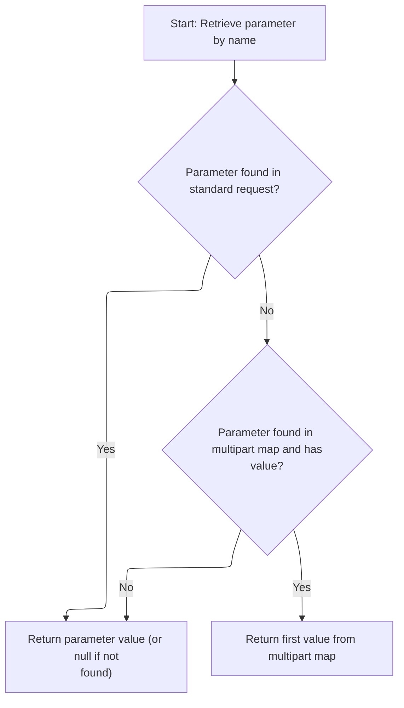

<SwmSnippet path="/core/src/main/java/org/apache/struts/upload/MultipartRequestWrapper.java" line="75">

---

In <SwmToken path="core/src/main/java/org/apache/struts/upload/MultipartRequestWrapper.java" pos="75:5:5" line-data="    public String getParameter(String name) {">`getParameter`</SwmToken>, we first try to get the value from the wrapped request. If that's null, we look in the parameters map for multipart data and return the first value if present. This fallback lets us handle both regular and multipart forms without missing user input.

```java
    public String getParameter(String name) {
        String value = getRequest().getParameter(name);

```

---

</SwmSnippet>

<SwmSnippet path="/core/src/main/java/org/apache/struts/upload/MultipartRequestWrapper.java" line="78">

---

After returning from <SwmToken path="core/src/main/java/org/apache/struts/config/FormBeanConfig.java" pos="34:12:12" line-data="import org.apache.struts.chain.contexts.ServletActionContext;">`ServletActionContext`</SwmToken>, <SwmToken path="core/src/main/java/org/apache/struts/action/RequestProcessor.java" pos="827:7:7" line-data="        if ((request.getParameter(Globals.CANCEL_PROPERTY) != null)">`getParameter`</SwmToken> finishes by checking the parameters map for a String array and returning the first element if found. This hidden assumption about the map's structure is needed for multipart forms, but if the map isn't set up right, user input could be missed.

```java
        if (value == null) {
            String[] mValue = (String[]) parameters.get(name);

            if ((mValue != null) && (mValue.length > 0)) {
                value = mValue[0];
            }
        }

        return value;
    }
```

---

</SwmSnippet>

## Validating Form Data

<SwmSnippet path="/core/src/main/java/org/apache/struts/action/RequestProcessor.java" line="196">

---

After returning from <SwmToken path="core/src/main/java/org/apache/struts/action/RequestProcessor.java" pos="194:1:1" line-data="        processPopulate(request, response, form, mapping);">`processPopulate`</SwmToken> in <SwmToken path="core/src/main/java/org/apache/struts/action/ActionServlet.java" pos="608:5:5" line-data="    protected synchronized RequestProcessor getRequestProcessor(">`RequestProcessor`</SwmToken>, we call <SwmToken path="core/src/main/java/org/apache/struts/action/RequestProcessor.java" pos="198:5:5" line-data="            if (!processValidate(request, response, form, mapping)) {">`processValidate`</SwmToken> to check the form data. If validation fails, we bail out and send the user back to the input form with errors.

```java
        // Validate any fields of the ActionForm bean, if applicable
        try {
            if (!processValidate(request, response, form, mapping)) {
                return;
            }
```

---

</SwmSnippet>

## Checking Form Validity

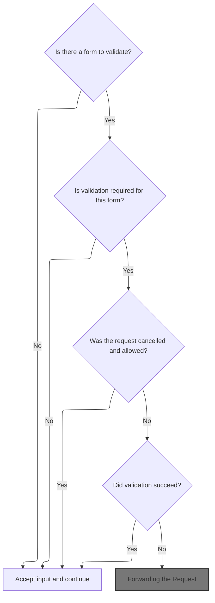

<SwmSnippet path="/core/src/main/java/org/apache/struts/action/RequestProcessor.java" line="917">

---

In <SwmToken path="core/src/main/java/org/apache/struts/action/RequestProcessor.java" pos="917:5:5" line-data="    protected boolean processValidate(HttpServletRequest request,">`processValidate`</SwmToken>, we check if validation is enabled, handle cancellation, and then call <SwmToken path="core/src/main/java/org/apache/struts/action/RequestProcessor.java" pos="950:7:9" line-data="        ActionMessages errors = form.validate(mapping, request);">`form.validate`</SwmToken> to get any errors. If errors are found, we stash them and send the user back to the input form.

```java
    protected boolean processValidate(HttpServletRequest request,
        HttpServletResponse response, ActionForm form, ActionMapping mapping)
        throws IOException, ServletException, InvalidCancelException {
        if (form == null) {
            return (true);
        }

        // Has validation been turned off for this mapping?
        if (!mapping.getValidate()) {
            return (true);
        }

        // Was this request cancelled? If it has been, the mapping also
        // needs to state whether the cancellation is permissable; otherwise
        // the cancellation is considered to be a symptom of a programmer
        // error or a spoof.
        if (request.getAttribute(Globals.CANCEL_KEY) != null) {
            if (mapping.getCancellable()) {
                if (log.isDebugEnabled()) {
                    log.debug(" Cancelled transaction, skipping validation");
                }
                return (true);
            } else {
                request.removeAttribute(Globals.CANCEL_KEY);
                throw new InvalidCancelException();
            }
        }

        // Call the form bean's validation method
        if (log.isDebugEnabled()) {
            log.debug(" Validating input form properties");
        }

        ActionMessages errors = form.validate(mapping, request);

        if ((errors == null) || errors.isEmpty()) {
            if (log.isTraceEnabled()) {
                log.trace("  No errors detected, accepting input");
            }

            return (true);
        }

```

---

</SwmSnippet>

<SwmSnippet path="/apps/faces-example1/src/main/java/org/apache/struts/webapp/example/LogonForm.java" line="137">

---

LogonForm.validate checks if username and password are missing or empty, adds error messages for each, and returns them. This is standard Struts validation—errors are shown to the user if fields are missing.

```java
    public ActionErrors validate(ActionMapping mapping,
                                 HttpServletRequest request) {

        ActionErrors errors = new ActionErrors();
        if ((username == null) || (username.length() < 1))
            errors.add("username", new ActionMessage("error.username.required"));
        if ((password == null) || (password.length() < 1))
            errors.add("password", new ActionMessage("error.password.required"));

        return errors;

    }
```

---

</SwmSnippet>

<SwmSnippet path="/core/src/main/java/org/apache/struts/action/RequestProcessor.java" line="960">

---

After returning from LogonForm.validate in <SwmToken path="core/src/main/java/org/apache/struts/action/RequestProcessor.java" pos="198:5:5" line-data="            if (!processValidate(request, response, form, mapping)) {">`processValidate`</SwmToken>, we check if the form has a multipart handler and call rollback to clean up any temporary files from uploads. This prevents leftover files if validation fails.

```java
        // Special handling for multipart request
        if (form.getMultipartRequestHandler() != null) {
            if (log.isTraceEnabled()) {
                log.trace("  Rolling back multipart request");
            }

            form.getMultipartRequestHandler().rollback();
        }

```

---

</SwmSnippet>

### Cleaning Up Uploaded Files

```mermaid
%%{init: {"flowchart": {"defaultRenderer": "elk"}} }%%
flowchart TD
    node1["Begin cleanup of uploaded files"]
    click node1 openCode "core/src/main/java/org/apache/struts/upload/CommonsMultipartRequestHandler.java:247:261"
    subgraph loop1["For each uploaded file element"]
        node2{"Is uploaded file a list?"}
        click node2 openCode "core/src/main/java/org/apache/struts/upload/CommonsMultipartRequestHandler.java:251:259"
        node2 -->|"Yes"| subgraph loop2["For each file in list"]
            node3["Delete uploaded file"]
            click node3 openCode "core/src/main/java/org/apache/struts/upload/CommonsMultipartRequestHandler.java:254:256"
            node3 --> node4["Continue to next file in list"]
            click node4 openCode "core/src/main/java/org/apache/struts/upload/CommonsMultipartRequestHandler.java:254:256"
        end
        loop2 --> node5["Continue to next uploaded file element"]
        click node5 openCode "core/src/main/java/org/apache/struts/upload/CommonsMultipartRequestHandler.java:251:259"
        node2 -->|"No"| node6["Delete uploaded file"]
        click node6 openCode "core/src/main/java/org/apache/struts/upload/CommonsMultipartRequestHandler.java:258:258"
        node6 --> node5
    end
    loop1 --> node7["All uploaded files have been deleted"]
    click node7 openCode "core/src/main/java/org/apache/struts/upload/CommonsMultipartRequestHandler.java:261:261"

classDef HeadingStyle fill:#777777,stroke:#333,stroke-width:2px;

%% Swimm:
%% %%{init: {"flowchart": {"defaultRenderer": "elk"}} }%%
%% flowchart TD
%%     node1["Begin cleanup of uploaded files"]
%%     click node1 openCode "<SwmPath>[core/…/upload/CommonsMultipartRequestHandler.java](core/src/main/java/org/apache/struts/upload/CommonsMultipartRequestHandler.java)</SwmPath>:247:261"
%%     subgraph loop1["For each uploaded file element"]
%%         node2{"Is uploaded file a list?"}
%%         click node2 openCode "<SwmPath>[core/…/upload/CommonsMultipartRequestHandler.java](core/src/main/java/org/apache/struts/upload/CommonsMultipartRequestHandler.java)</SwmPath>:251:259"
%%         node2 -->|"Yes"| subgraph loop2["For each file in list"]
%%             node3["Delete uploaded file"]
%%             click node3 openCode "<SwmPath>[core/…/upload/CommonsMultipartRequestHandler.java](core/src/main/java/org/apache/struts/upload/CommonsMultipartRequestHandler.java)</SwmPath>:254:256"
%%             node3 --> node4["Continue to next file in list"]
%%             click node4 openCode "<SwmPath>[core/…/upload/CommonsMultipartRequestHandler.java](core/src/main/java/org/apache/struts/upload/CommonsMultipartRequestHandler.java)</SwmPath>:254:256"
%%         end
%%         loop2 --> node5["Continue to next uploaded file element"]
%%         click node5 openCode "<SwmPath>[core/…/upload/CommonsMultipartRequestHandler.java](core/src/main/java/org/apache/struts/upload/CommonsMultipartRequestHandler.java)</SwmPath>:251:259"
%%         node2 -->|"No"| node6["Delete uploaded file"]
%%         click node6 openCode "<SwmPath>[core/…/upload/CommonsMultipartRequestHandler.java](core/src/main/java/org/apache/struts/upload/CommonsMultipartRequestHandler.java)</SwmPath>:258:258"
%%         node6 --> node5
%%     end
%%     loop1 --> node7["All uploaded files have been deleted"]
%%     click node7 openCode "<SwmPath>[core/…/upload/CommonsMultipartRequestHandler.java](core/src/main/java/org/apache/struts/upload/CommonsMultipartRequestHandler.java)</SwmPath>:261:261"
%% 
%% classDef HeadingStyle fill:#777777,stroke:#333,stroke-width:2px;
```

<SwmSnippet path="/core/src/main/java/org/apache/struts/upload/CommonsMultipartRequestHandler.java" line="247">

---

Rollback loops through all <SwmToken path="core/src/main/java/org/apache/struts/upload/CommonsMultipartRequestHandler.java" pos="255:3:3" line-data="                    ((FormFile)i.next()).destroy();">`FormFile`</SwmToken> objects in <SwmToken path="core/src/main/java/org/apache/struts/upload/CommonsMultipartRequestHandler.java" pos="248:7:7" line-data="        Iterator iter = elementsFile.values().iterator();">`elementsFile`</SwmToken>, whether single or in a list, and calls destroy on each. This deletes any temporary files from uploads, so nothing is left behind if the request fails.

```java
    public void rollback() {
        Iterator iter = elementsFile.values().iterator();

        Object o;
        while (iter.hasNext()) {
            o = iter.next();
            if (o instanceof List) {
                for (Iterator i = ((List)o).iterator(); i.hasNext(); ) {
                    ((FormFile)i.next()).destroy();
                }
            } else {
                ((FormFile)o).destroy();
            }
        }
    }
```

---

</SwmSnippet>

<SwmSnippet path="/core/src/main/java/org/apache/struts/upload/CommonsMultipartRequestHandler.java" line="645">

---

Destroy just calls delete on the <SwmToken path="core/src/main/java/org/apache/struts/upload/CommonsMultipartRequestHandler.java" pos="646:1:1" line-data="            fileItem.delete();">`fileItem`</SwmToken>, which removes the temporary uploaded file. If <SwmToken path="core/src/main/java/org/apache/struts/upload/CommonsMultipartRequestHandler.java" pos="646:1:1" line-data="            fileItem.delete();">`fileItem`</SwmToken> isn't set up right, this could fail, but normally it's just cleanup for failed uploads.

```java
        public void destroy() {
            fileItem.delete();
        }
```

---

</SwmSnippet>

### Handling Validation Errors

```mermaid
%%{init: {"flowchart": {"defaultRenderer": "elk"}} }%%
flowchart TD
    node1["Validation failed for user request"] --> node2{"Is input form specified ('input')?"}
    click node2 openCode "core/src/main/java/org/apache/struts/action/RequestProcessor.java:970:972"
    node2 -->|"No"| node3["Show internal server error (500)"]
    click node3 openCode "core/src/main/java/org/apache/struts/action/RequestProcessor.java:972:981"
    node2 -->|"Yes"| node4["Save error messages"]
    click node4 openCode "core/src/main/java/org/apache/struts/action/RequestProcessor.java:984:988"
    node4 --> node5{"Is input forwarding enabled?"}
    click node5 openCode "core/src/main/java/org/apache/struts/action/RequestProcessor.java:990:990"
    node5 -->|"Yes"| node6["Forward to input form specified by
'input'"]
    click node6 openCode "core/src/main/java/org/apache/struts/action/RequestProcessor.java:991:993"
    node5 -->|"No"| node7["Return to input form specified by
'input'"]
    click node7 openCode "core/src/main/java/org/apache/struts/action/RequestProcessor.java:994:994"

classDef HeadingStyle fill:#777777,stroke:#333,stroke-width:2px;

%% Swimm:
%% %%{init: {"flowchart": {"defaultRenderer": "elk"}} }%%
%% flowchart TD
%%     node1["Validation failed for user request"] --> node2{"Is input form specified ('input')?"}
%%     click node2 openCode "<SwmPath>[core/…/action/RequestProcessor.java](core/src/main/java/org/apache/struts/action/RequestProcessor.java)</SwmPath>:970:972"
%%     node2 -->|"No"| node3["Show internal server error (500)"]
%%     click node3 openCode "<SwmPath>[core/…/action/RequestProcessor.java](core/src/main/java/org/apache/struts/action/RequestProcessor.java)</SwmPath>:972:981"
%%     node2 -->|"Yes"| node4["Save error messages"]
%%     click node4 openCode "<SwmPath>[core/…/action/RequestProcessor.java](core/src/main/java/org/apache/struts/action/RequestProcessor.java)</SwmPath>:984:988"
%%     node4 --> node5{"Is input forwarding enabled?"}
%%     click node5 openCode "<SwmPath>[core/…/action/RequestProcessor.java](core/src/main/java/org/apache/struts/action/RequestProcessor.java)</SwmPath>:990:990"
%%     node5 -->|"Yes"| node6["Forward to input form specified by
%% 'input'"]
%%     click node6 openCode "<SwmPath>[core/…/action/RequestProcessor.java](core/src/main/java/org/apache/struts/action/RequestProcessor.java)</SwmPath>:991:993"
%%     node5 -->|"No"| node7["Return to input form specified by
%% 'input'"]
%%     click node7 openCode "<SwmPath>[core/…/action/RequestProcessor.java](core/src/main/java/org/apache/struts/action/RequestProcessor.java)</SwmPath>:994:994"
%% 
%% classDef HeadingStyle fill:#777777,stroke:#333,stroke-width:2px;
```

<SwmSnippet path="/core/src/main/java/org/apache/struts/action/RequestProcessor.java" line="969">

---

After returning from <SwmToken path="core/src/main/java/org/apache/struts/upload/CommonsMultipartRequestHandler.java" pos="58:4:4" line-data="public class CommonsMultipartRequestHandler implements MultipartRequestHandler {">`CommonsMultipartRequestHandler`</SwmToken> in <SwmToken path="core/src/main/java/org/apache/struts/action/RequestProcessor.java" pos="198:5:5" line-data="            if (!processValidate(request, response, form, mapping)) {">`processValidate`</SwmToken>, we check if there's an input form to return to. If not, we use <SwmToken path="core/src/main/java/org/apache/struts/util/PropertyMessageResources.java" pos="82:8:8" line-data=" * Configure &lt;code&gt;PropertyMessageResources&lt;/code&gt; to operate in this mode by">`PropertyMessageResources`</SwmToken> to send a localized server error, since the user can't fix their input.

```java
        // Was an input path (or forward) specified for this mapping?
        String input = mapping.getInput();

        if (input == null) {
            if (log.isTraceEnabled()) {
                log.trace("  Validation failed but no input form available");
            }

            response.sendError(HttpServletResponse.SC_INTERNAL_SERVER_ERROR,
                getInternal().getMessage("noInput", mapping.getPath()));

            return (false);
        }

        // Save our error messages and return to the input form if possible
        if (log.isDebugEnabled()) {
            log.debug(" Validation failed, returning to '" + input + "'");
        }

```

---

</SwmSnippet>

<SwmSnippet path="/core/src/main/java/org/apache/struts/action/RequestProcessor.java" line="988">

---

After returning from <SwmToken path="core/src/main/java/org/apache/struts/util/PropertyMessageResources.java" pos="82:8:8" line-data=" * Configure &lt;code&gt;PropertyMessageResources&lt;/code&gt; to operate in this mode by">`PropertyMessageResources`</SwmToken> in <SwmToken path="core/src/main/java/org/apache/struts/action/RequestProcessor.java" pos="198:5:5" line-data="            if (!processValidate(request, response, form, mapping)) {">`processValidate`</SwmToken>, we stash the errors in <SwmToken path="core/src/main/java/org/apache/struts/action/RequestProcessor.java" pos="988:5:7" line-data="        request.setAttribute(Globals.ERROR_KEY, errors);">`Globals.ERROR_KEY`</SwmToken> and either forward or redirect to the input form, depending on the module config. This controls how the user gets back to fix their input.

```java
        request.setAttribute(Globals.ERROR_KEY, errors);

        if (moduleConfig.getControllerConfig().getInputForward()) {
            ForwardConfig forward = mapping.findForward(input);

            processForwardConfig(request, response, forward);
        } else {
```

---

</SwmSnippet>

### Navigating to Input Form

```mermaid
%%{init: {"flowchart": {"defaultRenderer": "elk"}} }%%
flowchart TD
    node1{"Is forward configuration present?"}
    click node1 openCode "core/src/main/java/org/apache/struts/action/RequestProcessor.java:359:361"
    node1 -->|"Yes"| node2{"Can forward be mapped to an action?"}
    node1 -->|"No"| node8["End"]
    click node8 openCode "core/src/main/java/org/apache/struts/action/RequestProcessor.java:360:361"
    node2 -->|"Yes"| node3["Transform forward configuration to
action path"]
    click node2 openCode "core/src/main/java/org/apache/struts/action/RequestProcessor.java:371:377"
    click node3 openCode "core/src/main/java/org/apache/struts/action/RequestProcessor.java:373:376"
    node2 -->|"No"| node4["Use original forward path"]
    click node4 openCode "core/src/main/java/org/apache/struts/action/RequestProcessor.java:367:368"
    node3 --> node5{"Is forward path relative ('/')?"}
    node4 --> node5
    click node5 openCode "core/src/main/java/org/apache/struts/action/RequestProcessor.java:381:386"
    node5 -->|"Relative path"| node6["Calculate module-relative URI"]
    click node6 openCode "core/src/main/java/org/apache/struts/action/RequestProcessor.java:383:384"
    node5 -->|"Absolute path"| node7["Use absolute URI"]
    click node7 openCode "core/src/main/java/org/apache/struts/action/RequestProcessor.java:385:386"
    node6 --> node9{"Redirect flag set?"}
    node7 --> node9
    click node9 openCode "core/src/main/java/org/apache/struts/action/RequestProcessor.java:388:397"
    node9 -->|"Redirect"| node10["Send redirect to user (prepend context
path if relative)"]
    click node10 openCode "core/src/main/java/org/apache/struts/action/RequestProcessor.java:390:394"
    node9 -->|"Forward"| node11["Forward internally"]
    click node11 openCode "core/src/main/java/org/apache/struts/action/RequestProcessor.java:396:397"
    node10 --> node8
    node11 --> node8
classDef HeadingStyle fill:#777777,stroke:#333,stroke-width:2px;

%% Swimm:
%% %%{init: {"flowchart": {"defaultRenderer": "elk"}} }%%
%% flowchart TD
%%     node1{"Is forward configuration present?"}
%%     click node1 openCode "<SwmPath>[core/…/action/RequestProcessor.java](core/src/main/java/org/apache/struts/action/RequestProcessor.java)</SwmPath>:359:361"
%%     node1 -->|"Yes"| node2{"Can forward be mapped to an action?"}
%%     node1 -->|"No"| node8["End"]
%%     click node8 openCode "<SwmPath>[core/…/action/RequestProcessor.java](core/src/main/java/org/apache/struts/action/RequestProcessor.java)</SwmPath>:360:361"
%%     node2 -->|"Yes"| node3["Transform forward configuration to
%% action path"]
%%     click node2 openCode "<SwmPath>[core/…/action/RequestProcessor.java](core/src/main/java/org/apache/struts/action/RequestProcessor.java)</SwmPath>:371:377"
%%     click node3 openCode "<SwmPath>[core/…/action/RequestProcessor.java](core/src/main/java/org/apache/struts/action/RequestProcessor.java)</SwmPath>:373:376"
%%     node2 -->|"No"| node4["Use original forward path"]
%%     click node4 openCode "<SwmPath>[core/…/action/RequestProcessor.java](core/src/main/java/org/apache/struts/action/RequestProcessor.java)</SwmPath>:367:368"
%%     node3 --> node5{"Is forward path relative ('/')?"}
%%     node4 --> node5
%%     click node5 openCode "<SwmPath>[core/…/action/RequestProcessor.java](core/src/main/java/org/apache/struts/action/RequestProcessor.java)</SwmPath>:381:386"
%%     node5 -->|"Relative path"| node6["Calculate module-relative URI"]
%%     click node6 openCode "<SwmPath>[core/…/action/RequestProcessor.java](core/src/main/java/org/apache/struts/action/RequestProcessor.java)</SwmPath>:383:384"
%%     node5 -->|"Absolute path"| node7["Use absolute URI"]
%%     click node7 openCode "<SwmPath>[core/…/action/RequestProcessor.java](core/src/main/java/org/apache/struts/action/RequestProcessor.java)</SwmPath>:385:386"
%%     node6 --> node9{"Redirect flag set?"}
%%     node7 --> node9
%%     click node9 openCode "<SwmPath>[core/…/action/RequestProcessor.java](core/src/main/java/org/apache/struts/action/RequestProcessor.java)</SwmPath>:388:397"
%%     node9 -->|"Redirect"| node10["Send redirect to user (prepend context
%% path if relative)"]
%%     click node10 openCode "<SwmPath>[core/…/action/RequestProcessor.java](core/src/main/java/org/apache/struts/action/RequestProcessor.java)</SwmPath>:390:394"
%%     node9 -->|"Forward"| node11["Forward internally"]
%%     click node11 openCode "<SwmPath>[core/…/action/RequestProcessor.java](core/src/main/java/org/apache/struts/action/RequestProcessor.java)</SwmPath>:396:397"
%%     node10 --> node8
%%     node11 --> node8
%% classDef HeadingStyle fill:#777777,stroke:#333,stroke-width:2px;
```

<SwmSnippet path="/core/src/main/java/org/apache/struts/action/RequestProcessor.java" line="356">

---

In <SwmToken path="core/src/main/java/org/apache/struts/action/RequestProcessor.java" pos="356:5:5" line-data="    protected void processForwardConfig(HttpServletRequest request,">`processForwardConfig`</SwmToken>, we use <SwmToken path="core/src/main/java/org/apache/struts/action/RequestProcessor.java" pos="371:7:9" line-data="        String actionIdPath = RequestUtils.actionIdURL(forward, request, servlet);">`RequestUtils.actionIdURL`</SwmToken> to see if the forward path can be mapped to an action. If so, we update the <SwmToken path="core/src/main/java/org/apache/struts/action/RequestProcessor.java" pos="357:6:6" line-data="        HttpServletResponse response, ForwardConfig forward)">`ForwardConfig`</SwmToken> so navigation stays consistent and actions can be reused.

```java
    protected void processForwardConfig(HttpServletRequest request,
        HttpServletResponse response, ForwardConfig forward)
        throws IOException, ServletException {
        if (forward == null) {
            return;
        }

        if (log.isDebugEnabled()) {
            log.debug("processForwardConfig(" + forward + ")");
        }

        String forwardPath = forward.getPath();
        String uri;

        // If the forward can be unaliased into an action, then use the path of the action
        String actionIdPath = RequestUtils.actionIdURL(forward, request, servlet);
```

---

</SwmSnippet>

<SwmSnippet path="/core/src/main/java/org/apache/struts/util/RequestUtils.java" line="1080">

---

ActionIdURL checks if the path is absolute or <SwmToken path="core/src/main/java/org/apache/struts/action/ActionServlet.java" pos="164:23:25" line-data=" * &lt;li&gt;&lt;strong&gt;config&lt;/strong&gt; - Comma-separated list of context-relative">`context-relative`</SwmToken>, splits out any query string, finds the <SwmToken path="core/src/main/java/org/apache/struts/util/RequestUtils.java" pos="1098:1:1" line-data="        ActionConfig actionConfig = moduleConfig.findActionConfigId(actionId);">`ActionConfig`</SwmToken>, and builds the URL based on the servlet mapping pattern. This keeps <SwmToken path="core/src/main/java/org/apache/struts/action/ActionServlet.java" pos="1793:13:13" line-data="     * tag to generate correct destination URLs for form submissions.&lt;/p&gt;">`URLs`</SwmToken> consistent with routing rules and preserves query parameters.

```java
    public static String actionIdURL(String originalPath, ModuleConfig moduleConfig, ActionServlet servlet) {
        if (originalPath.startsWith("http") || originalPath.startsWith("/")) {
            return null;
        }

        // Split the forward path into the resource and query string;
        // it is possible a forward (or redirect) has added parameters.
        String actionId = null;
        String qs = null;
        int qpos = originalPath.indexOf("?");
        if (qpos == -1) {
            actionId = originalPath;
        } else {
            actionId = originalPath.substring(0, qpos);
            qs = originalPath.substring(qpos);
        }

        // Find the action of the given actionId
        ActionConfig actionConfig = moduleConfig.findActionConfigId(actionId);
        if (actionConfig == null) {
            if (log.isDebugEnabled()) {
                log.debug("No actionId found for " + actionId);
            }
            return null;
        }

        String path = actionConfig.getPath();
        String mapping = RequestUtils.getServletMapping(servlet);
        StringBuffer actionIdPath = new StringBuffer();

        // Form the path based on the servlet mapping pattern
        if (mapping.startsWith("*")) {
            actionIdPath.append(path);
            actionIdPath.append(mapping.substring(1));
        } else if (mapping.startsWith("/")) {  // implied ends with a *
            mapping = mapping.substring(0, mapping.length() - 1);
            if (mapping.endsWith("/") && path.startsWith("/")) {
                actionIdPath.append(mapping);
                actionIdPath.append(path.substring(1));
            } else {
                actionIdPath.append(mapping);
                actionIdPath.append(path);
            }
        } else {
            log.warn("Unknown servlet mapping pattern");
            actionIdPath.append(path);
        }

        // Lastly add any query parameters (the ? is part of the query string)
        if (qs != null) {
            actionIdPath.append(qs);
        }

        // Return the path
        if (log.isDebugEnabled()) {
            log.debug(originalPath + " unaliased to " + actionIdPath.toString());
        }
        return actionIdPath.toString();
    }
```

---

</SwmSnippet>

<SwmSnippet path="/core/src/main/java/org/apache/struts/action/RequestProcessor.java" line="372">

---

After returning from <SwmToken path="core/src/main/java/org/apache/struts/action/RequestProcessor.java" pos="371:9:9" line-data="        String actionIdPath = RequestUtils.actionIdURL(forward, request, servlet);">`actionIdURL`</SwmToken> in <SwmToken path="core/src/main/java/org/apache/struts/action/RequestProcessor.java" pos="203:1:1" line-data="            processForwardConfig(request, response, forward);">`processForwardConfig`</SwmToken>, we update the forward path and create a new <SwmToken path="core/src/main/java/org/apache/struts/action/RequestProcessor.java" pos="374:1:1" line-data="            ForwardConfig actionIdForward = new ForwardConfig(forward);">`ForwardConfig`</SwmToken> if needed. This makes sure the user is sent to the right action path for navigation.

```java
        if (actionIdPath != null) {
            forwardPath = actionIdPath;
            ForwardConfig actionIdForward = new ForwardConfig(forward);
            actionIdForward.setPath(actionIdPath);
            forward = actionIdForward;
        }

```

---

</SwmSnippet>

<SwmSnippet path="/core/src/main/java/org/apache/struts/action/RequestProcessor.java" line="379">

---

After returning from <SwmToken path="core/src/main/java/org/apache/struts/action/RequestProcessor.java" pos="357:6:6" line-data="        HttpServletResponse response, ForwardConfig forward)">`ForwardConfig`</SwmToken> in <SwmToken path="core/src/main/java/org/apache/struts/action/RequestProcessor.java" pos="203:1:1" line-data="            processForwardConfig(request, response, forward);">`processForwardConfig`</SwmToken>, we check if the path starts with '/'. If so, we use <SwmToken path="core/src/main/java/org/apache/struts/action/RequestProcessor.java" pos="383:7:7" line-data="            uri = RequestUtils.forwardURL(request, forward, null);">`forwardURL`</SwmToken> to build the module-relative URI; otherwise, we just use the path as-is. This controls how the user is forwarded or redirected.

```java
        // paths not starting with / should be passed through without any
        // processing (ie. they're absolute)
        if (forwardPath.startsWith("/")) {
            // get module relative uri
            uri = RequestUtils.forwardURL(request, forward, null);
        } else {
            uri = forwardPath;
        }

```

---

</SwmSnippet>

<SwmSnippet path="/core/src/main/java/org/apache/struts/util/RequestUtils.java" line="842">

---

ForwardURL builds the URI using module prefix and path, with optional pattern placeholders for flexibility. This ensures the user is sent to the right module and path, matching the app's navigation rules.

```java
    public static String forwardURL(HttpServletRequest request,
        ForwardConfig forward, ModuleConfig moduleConfig) {
        //load the current moduleConfig, if null
        if (moduleConfig == null) {
            moduleConfig = ModuleUtils.getInstance().getModuleConfig(request);
        }

        String path = forward.getPath();

        //load default prefix
        String prefix = moduleConfig.getPrefix();

        //override prefix if supplied by forward
        if (forward.getModule() != null) {
            prefix = forward.getModule();

            if ("/".equals(prefix)) {
                prefix = "";
            }
        }

        StringBuffer sb = new StringBuffer();

        // Calculate a context relative path for this ForwardConfig
        String forwardPattern =
            moduleConfig.getControllerConfig().getForwardPattern();

        if (forwardPattern == null) {
            // Performance optimization for previous default behavior
            sb.append(prefix);

            // smoothly insert a '/' if needed
            if (!path.startsWith("/")) {
                sb.append("/");
            }

            sb.append(path);
        } else {
            boolean dollar = false;

            for (int i = 0; i < forwardPattern.length(); i++) {
                char ch = forwardPattern.charAt(i);

                if (dollar) {
                    switch (ch) {
                    case 'M':
                        sb.append(prefix);

                        break;

                    case 'P':

                        // add '/' if needed
                        if (!path.startsWith("/")) {
                            sb.append("/");
                        }

                        sb.append(path);

                        break;

                    case '$':
                        sb.append('$');

                        break;

                    default:
                        ; // Silently swallow
                    }

                    dollar = false;

                    continue;
                } else if (ch == '$') {
                    dollar = true;
                } else {
                    sb.append(ch);
                }
            }
```

---

</SwmSnippet>

<SwmSnippet path="/core/src/main/java/org/apache/struts/action/RequestProcessor.java" line="388">

---

After returning from <SwmToken path="core/src/main/java/org/apache/struts/action/RequestProcessor.java" pos="383:7:7" line-data="            uri = RequestUtils.forwardURL(request, forward, null);">`forwardURL`</SwmToken> in <SwmToken path="core/src/main/java/org/apache/struts/action/RequestProcessor.java" pos="203:1:1" line-data="            processForwardConfig(request, response, forward);">`processForwardConfig`</SwmToken>, we check if the <SwmToken path="core/src/main/java/org/apache/struts/action/RequestProcessor.java" pos="357:6:6" line-data="        HttpServletResponse response, ForwardConfig forward)">`ForwardConfig`</SwmToken> is a redirect. If so, we prepend the context path and send a redirect; otherwise, we forward internally using <SwmToken path="core/src/main/java/org/apache/struts/action/RequestProcessor.java" pos="396:1:1" line-data="            doForward(uri, request, response);">`doForward`</SwmToken>. This controls whether the user sees a new URL or stays on the same page.

```java
        if (forward.getRedirect()) {
            // only prepend context path for relative uri
            if (uri.startsWith("/")) {
                uri = request.getContextPath() + uri;
            }

            response.sendRedirect(response.encodeRedirectURL(uri));
        } else {
            doForward(uri, request, response);
        }
    }
```

---

</SwmSnippet>

### Forwarding the Request

<SwmSnippet path="/core/src/main/java/org/apache/struts/action/RequestProcessor.java" line="1071">

---

In <SwmToken path="core/src/main/java/org/apache/struts/action/RequestProcessor.java" pos="1071:5:5" line-data="    protected void doForward(String uri, HttpServletRequest request,">`doForward`</SwmToken>, we get the <SwmToken path="core/src/main/java/org/apache/struts/action/RequestProcessor.java" pos="1074:1:1" line-data="        RequestDispatcher rd = getServletContext().getRequestDispatcher(uri);">`RequestDispatcher`</SwmToken> for the uri. If it's null, we use <SwmToken path="core/src/main/java/org/apache/struts/util/PropertyMessageResources.java" pos="82:8:8" line-data=" * Configure &lt;code&gt;PropertyMessageResources&lt;/code&gt; to operate in this mode by">`PropertyMessageResources`</SwmToken> to send a localized server error, so the user sees a proper error message if navigation fails.

```java
    protected void doForward(String uri, HttpServletRequest request,
        HttpServletResponse response)
        throws IOException, ServletException {
        RequestDispatcher rd = getServletContext().getRequestDispatcher(uri);

        if (rd == null) {
            response.sendError(HttpServletResponse.SC_INTERNAL_SERVER_ERROR,
                getInternal().getMessage("requestDispatcher", uri));

            return;
        }

```

---

</SwmSnippet>

<SwmSnippet path="/core/src/main/java/org/apache/struts/action/RequestProcessor.java" line="1083">

---

After returning from <SwmToken path="core/src/main/java/org/apache/struts/util/PropertyMessageResources.java" pos="82:8:8" line-data=" * Configure &lt;code&gt;PropertyMessageResources&lt;/code&gt; to operate in this mode by">`PropertyMessageResources`</SwmToken> in <SwmToken path="core/src/main/java/org/apache/struts/action/RequestProcessor.java" pos="396:1:1" line-data="            doForward(uri, request, response);">`doForward`</SwmToken>, we forward the request and response to the target uri. The user sees the input form or page as expected, so navigation continues.

```java
        rd.forward(request, response);
    }
```

---

</SwmSnippet>

### Module-Relative Forwarding

<SwmSnippet path="/core/src/main/java/org/apache/struts/action/RequestProcessor.java" line="995">

---

After returning from <SwmToken path="core/src/main/java/org/apache/struts/action/RequestProcessor.java" pos="203:1:1" line-data="            processForwardConfig(request, response, forward);">`processForwardConfig`</SwmToken> in <SwmToken path="core/src/main/java/org/apache/struts/action/RequestProcessor.java" pos="198:5:5" line-data="            if (!processValidate(request, response, form, mapping)) {">`processValidate`</SwmToken>, we call <SwmToken path="core/src/main/java/org/apache/struts/action/RequestProcessor.java" pos="995:1:1" line-data="            internalModuleRelativeForward(input, request, response);">`internalModuleRelativeForward`</SwmToken> to forward to the correct module-relative path if inputForward isn't enabled. This keeps navigation working for all cases.

```java
            internalModuleRelativeForward(input, request, response);
        }

        return (false);
    }
```

---

</SwmSnippet>

<SwmSnippet path="/core/src/main/java/org/apache/struts/action/RequestProcessor.java" line="1015">

---

InternalModuleRelativeForward prepends the module prefix to the uri and calls <SwmToken path="core/src/main/java/org/apache/struts/action/RequestProcessor.java" pos="1027:1:1" line-data="        doForward(uri, request, response);">`doForward`</SwmToken> to send the user to the right module context. This keeps navigation consistent across modules.

```java
    protected void internalModuleRelativeForward(String uri,
        HttpServletRequest request, HttpServletResponse response)
        throws IOException, ServletException {
        // Construct a request dispatcher for the specified path
        uri = moduleConfig.getPrefix() + uri;

        // Delegate the processing of this request
        // :FIXME: - exception handling?
        if (log.isDebugEnabled()) {
            log.debug(" Delegating via forward to '" + uri + "'");
        }

        doForward(uri, request, response);
    }
```

---

</SwmSnippet>

## Handling Validation Exceptions

<SwmSnippet path="/core/src/main/java/org/apache/struts/action/RequestProcessor.java" line="201">

---

After returning from <SwmToken path="core/src/main/java/org/apache/struts/action/RequestProcessor.java" pos="198:5:5" line-data="            if (!processValidate(request, response, form, mapping)) {">`processValidate`</SwmToken> in <SwmToken path="core/src/main/java/org/apache/struts/action/ActionServlet.java" pos="608:5:5" line-data="    protected synchronized RequestProcessor getRequestProcessor(">`RequestProcessor`</SwmToken>, we catch <SwmToken path="core/src/main/java/org/apache/struts/action/RequestProcessor.java" pos="201:6:6" line-data="        } catch (InvalidCancelException e) {">`InvalidCancelException`</SwmToken> and call <SwmToken path="core/src/main/java/org/apache/struts/action/RequestProcessor.java" pos="202:7:7" line-data="            ActionForward forward = processException(request, response, e, form, mapping);">`processException`</SwmToken> to handle it. This decides how the user is redirected or shown an error.

```java
        } catch (InvalidCancelException e) {
            ActionForward forward = processException(request, response, e, form, mapping);
```

---

</SwmSnippet>

## Handling Action Exceptions

```mermaid
%%{init: {"flowchart": {"defaultRenderer": "elk"}} }%%
flowchart TD
    node1["Exception occurs during request
processing"] --> node2{"Is there a configured handler for this
exception type?"}
    click node1 openCode "core/src/main/java/org/apache/struts/action/RequestProcessor.java:504:509"
    click node2 openCode "core/src/main/java/org/apache/struts/action/RequestProcessor.java:509:511"
    node2 -->|"Yes"| node3["Delegate to configured exception handler"]
    click node3 openCode "core/src/main/java/org/apache/struts/action/RequestProcessor.java:524:531"
    node3 --> node4{"Did handler throw an exception?"}
    click node4 openCode "core/src/main/java/org/apache/struts/action/RequestProcessor.java:532:534"
    node4 -->|"No"| node5["Exception handled"]
    click node5 openCode "core/src/main/java/org/apache/struts/action/RequestProcessor.java:530:531"
    node4 -->|"Yes"| node8["Wrap in ServletException and throw"]
    click node8 openCode "core/src/main/java/org/apache/struts/action/RequestProcessor.java:533:534"
    node2 -->|"No"| node6{"What is the exception type?"}
    click node6 openCode "core/src/main/java/org/apache/struts/action/RequestProcessor.java:511:521"
    node6 -->|IOException| node9["Rethrow IOException"]
    click node9 openCode "core/src/main/java/org/apache/struts/action/RequestProcessor.java:515:516"
    node6 -->|ServletException| node10["Rethrow ServletException"]
    click node10 openCode "core/src/main/java/org/apache/struts/action/RequestProcessor.java:517:518"
    node6 -->|"Other"| node11["Wrap in ServletException and throw"]
    click node11 openCode "core/src/main/java/org/apache/struts/action/RequestProcessor.java:520:521"

classDef HeadingStyle fill:#777777,stroke:#333,stroke-width:2px;

%% Swimm:
%% %%{init: {"flowchart": {"defaultRenderer": "elk"}} }%%
%% flowchart TD
%%     node1["Exception occurs during request
%% processing"] --> node2{"Is there a configured handler for this
%% exception type?"}
%%     click node1 openCode "<SwmPath>[core/…/action/RequestProcessor.java](core/src/main/java/org/apache/struts/action/RequestProcessor.java)</SwmPath>:504:509"
%%     click node2 openCode "<SwmPath>[core/…/action/RequestProcessor.java](core/src/main/java/org/apache/struts/action/RequestProcessor.java)</SwmPath>:509:511"
%%     node2 -->|"Yes"| node3["Delegate to configured exception handler"]
%%     click node3 openCode "<SwmPath>[core/…/action/RequestProcessor.java](core/src/main/java/org/apache/struts/action/RequestProcessor.java)</SwmPath>:524:531"
%%     node3 --> node4{"Did handler throw an exception?"}
%%     click node4 openCode "<SwmPath>[core/…/action/RequestProcessor.java](core/src/main/java/org/apache/struts/action/RequestProcessor.java)</SwmPath>:532:534"
%%     node4 -->|"No"| node5["Exception handled"]
%%     click node5 openCode "<SwmPath>[core/…/action/RequestProcessor.java](core/src/main/java/org/apache/struts/action/RequestProcessor.java)</SwmPath>:530:531"
%%     node4 -->|"Yes"| node8["Wrap in <SwmToken path="core/src/main/java/org/apache/struts/action/ActionServlet.java" pos="339:11:11" line-data="    public void init() throws ServletException {">`ServletException`</SwmToken> and throw"]
%%     click node8 openCode "<SwmPath>[core/…/action/RequestProcessor.java](core/src/main/java/org/apache/struts/action/RequestProcessor.java)</SwmPath>:533:534"
%%     node2 -->|"No"| node6{"What is the exception type?"}
%%     click node6 openCode "<SwmPath>[core/…/action/RequestProcessor.java](core/src/main/java/org/apache/struts/action/RequestProcessor.java)</SwmPath>:511:521"
%%     node6 -->|<SwmToken path="core/src/main/java/org/apache/struts/action/ActionServlet.java" pos="1954:3:3" line-data="        throws IOException, ServletException {">`IOException`</SwmToken>| node9["Rethrow <SwmToken path="core/src/main/java/org/apache/struts/action/ActionServlet.java" pos="1954:3:3" line-data="        throws IOException, ServletException {">`IOException`</SwmToken>"]
%%     click node9 openCode "<SwmPath>[core/…/action/RequestProcessor.java](core/src/main/java/org/apache/struts/action/RequestProcessor.java)</SwmPath>:515:516"
%%     node6 -->|<SwmToken path="core/src/main/java/org/apache/struts/action/ActionServlet.java" pos="339:11:11" line-data="    public void init() throws ServletException {">`ServletException`</SwmToken>| node10["Rethrow <SwmToken path="core/src/main/java/org/apache/struts/action/ActionServlet.java" pos="339:11:11" line-data="    public void init() throws ServletException {">`ServletException`</SwmToken>"]
%%     click node10 openCode "<SwmPath>[core/…/action/RequestProcessor.java](core/src/main/java/org/apache/struts/action/RequestProcessor.java)</SwmPath>:517:518"
%%     node6 -->|"Other"| node11["Wrap in <SwmToken path="core/src/main/java/org/apache/struts/action/ActionServlet.java" pos="339:11:11" line-data="    public void init() throws ServletException {">`ServletException`</SwmToken> and throw"]
%%     click node11 openCode "<SwmPath>[core/…/action/RequestProcessor.java](core/src/main/java/org/apache/struts/action/RequestProcessor.java)</SwmPath>:520:521"
%% 
%% classDef HeadingStyle fill:#777777,stroke:#333,stroke-width:2px;
```

<SwmSnippet path="/core/src/main/java/org/apache/struts/action/RequestProcessor.java" line="504">

---

In <SwmToken path="core/src/main/java/org/apache/struts/action/RequestProcessor.java" pos="504:5:5" line-data="    protected ActionForward processException(HttpServletRequest request,">`processException`</SwmToken>, we check for an <SwmToken path="core/src/main/java/org/apache/struts/action/RequestProcessor.java" pos="509:1:1" line-data="        ExceptionConfig config = mapping.findException(exception.getClass());">`ExceptionConfig`</SwmToken> for the exception. If none is found, we use <SwmToken path="core/src/main/java/org/apache/struts/util/PropertyMessageResources.java" pos="82:8:8" line-data=" * Configure &lt;code&gt;PropertyMessageResources&lt;/code&gt; to operate in this mode by">`PropertyMessageResources`</SwmToken> to log and send a localized server error, so unhandled exceptions are reported clearly.

```java
    protected ActionForward processException(HttpServletRequest request,
        HttpServletResponse response, Exception exception, ActionForm form,
        ActionMapping mapping)
        throws IOException, ServletException {
        // Is there a defined handler for this exception?
        ExceptionConfig config = mapping.findException(exception.getClass());

        if (config == null) {
            log.warn(getInternal().getMessage("unhandledException",
                    exception.getClass()));

```

---

</SwmSnippet>

<SwmSnippet path="/core/src/main/java/org/apache/struts/action/RequestProcessor.java" line="515">

---

After returning from <SwmToken path="core/src/main/java/org/apache/struts/util/PropertyMessageResources.java" pos="82:8:8" line-data=" * Configure &lt;code&gt;PropertyMessageResources&lt;/code&gt; to operate in this mode by">`PropertyMessageResources`</SwmToken> in <SwmToken path="core/src/main/java/org/apache/struts/action/RequestProcessor.java" pos="202:7:7" line-data="            ActionForward forward = processException(request, response, e, form, mapping);">`processException`</SwmToken>, we use <SwmToken path="core/src/main/java/org/apache/struts/action/RequestProcessor.java" pos="526:1:1" line-data="            ExceptionHandler handler =">`ExceptionHandler`</SwmToken> to handle configured exceptions. This lets us customize error handling and control what the user sees.

```java
            if (exception instanceof IOException) {
                throw (IOException) exception;
            } else if (exception instanceof ServletException) {
                throw (ServletException) exception;
            } else {
                throw new ServletException(exception);
            }
        }

        // Use the configured exception handling
        try {
            ExceptionHandler handler =
                (ExceptionHandler) RequestUtils.applicationInstance(config
                    .getHandler());

            return (handler.execute(exception, config, mapping, form, request,
                response));
        } catch (Exception e) {
            throw new ServletException(e);
        }
    }
```

---

</SwmSnippet>

## Handling Exception Mapping and Forwarding

<SwmSnippet path="/core/src/main/java/org/apache/struts/action/ExceptionHandler.java" line="124">

---

In <SwmToken path="core/src/main/java/org/apache/struts/action/ExceptionHandler.java" pos="124:5:5" line-data="    public ActionForward execute(Exception ex, ExceptionConfig ae,">`execute`</SwmToken>, we figure out where to send the user after an exception—either to a configured error page or back to the input form. We also decide what error message to show, and stash info about the exception for later. Calling <SwmToken path="core/src/main/java/org/apache/struts/action/ExceptionHandler.java" pos="128:6:6" line-data="        LOG.debug(&quot;ExceptionHandler executing for exception &quot; + ex);">`ExceptionHandler`</SwmToken> here lets us centralize how exceptions are handled and what the user sees.

```java
    public ActionForward execute(Exception ex, ExceptionConfig ae,
        ActionMapping mapping, ActionForm formInstance,
        HttpServletRequest request, HttpServletResponse response)
        throws ServletException {
        LOG.debug("ExceptionHandler executing for exception " + ex);

        ActionForward forward;
        ActionMessage error;
        String property;

        // Build the forward from the exception mapping if it exists
        // or from the form input
        if (ae.getPath() != null) {
            forward = new ActionForward(ae.getPath());
        } else {
            forward = mapping.getInputForward();
        }

        // Figure out the error
        if (ex instanceof ModuleException) {
            error = ((ModuleException) ex).getActionMessage();
            property = ((ModuleException) ex).getProperty();
        } else {
            // STR-2924
            if (ae.getKey() != null) {
                error = new ActionMessage(ae.getKey(), ex.getMessage());
                property = error.getKey();
            } else {
                error = null;
                property = null;
            }
        }

        this.logException(ex);

```

---

</SwmSnippet>

### Logging Exception Details with Localized Messages

<SwmSnippet path="/core/src/main/java/org/apache/struts/action/ExceptionHandler.java" line="274">

---

<SwmToken path="core/src/main/java/org/apache/struts/action/ExceptionHandler.java" pos="274:5:5" line-data="    protected void logException(Exception e) {">`logException`</SwmToken> logs the exception using a localized message from <SwmToken path="core/src/main/java/org/apache/struts/action/ActionServlet.java" pos="1701:5:5" line-data="            internal = MessageResources.getMessageResources(internalName);">`MessageResources`</SwmToken>. We call MessageResources.getMessage to grab the right log string, so logs are consistent and can be localized if needed.

```java
    protected void logException(Exception e) {
        LOG.debug(messages.getMessage("exception.LOG"), e);
    }
```

---

</SwmSnippet>

<SwmSnippet path="/core/src/main/java/org/apache/struts/util/MessageResources.java" line="196">

---

<SwmToken path="core/src/main/java/org/apache/struts/util/MessageResources.java" pos="196:5:5" line-data="    public String getMessage(String key) {">`getMessage`</SwmToken> grabs the log string for the exception using the key. It checks the bundle for the key, and if locale is null, just returns the default message. This keeps log output consistent and localized if needed.

```java
    public String getMessage(String key) {
        return this.getMessage((Locale) null, key, null);
    }
```

---

</SwmSnippet>

### Storing Exception and Error Messages

```mermaid
%%{init: {"flowchart": {"defaultRenderer": "elk"}} }%%
flowchart TD
    node1["Store exception and error details"]
    click node1 openCode "core/src/main/java/org/apache/struts/action/ExceptionHandler.java:159:161"
    node1 --> node2{"Is response already committed?"}
    click node2 openCode "core/src/main/java/org/apache/struts/action/ExceptionHandler.java:163:165"
    node2 -->|"No"| node3["Show error page to user"]
    click node3 openCode "core/src/main/java/org/apache/struts/action/ExceptionHandler.java:164:165"
    node2 -->|"Yes"| node4{"Silent mode enabled?"}
    click node4 openCode "core/src/main/java/org/apache/struts/action/ExceptionHandler.java:170:176"
    node4 -->|"No"| node5["Attempt alternate user notification
(include error page or write minimal
error message)"]
    click node5 openCode "core/src/main/java/org/apache/struts/action/ExceptionHandler.java:171:173"
    node5 --> node7["Return null"]
    click node7 openCode "core/src/main/java/org/apache/struts/action/ExceptionHandler.java:178:179"
    node4 -->|"Yes"| node6["Suppress user-facing error output"]
    click node6 openCode "core/src/main/java/org/apache/struts/action/ExceptionHandler.java:174:176"
    node6 --> node7
classDef HeadingStyle fill:#777777,stroke:#333,stroke-width:2px;

%% Swimm:
%% %%{init: {"flowchart": {"defaultRenderer": "elk"}} }%%
%% flowchart TD
%%     node1["Store exception and error details"]
%%     click node1 openCode "<SwmPath>[core/…/action/ExceptionHandler.java](core/src/main/java/org/apache/struts/action/ExceptionHandler.java)</SwmPath>:159:161"
%%     node1 --> node2{"Is response already committed?"}
%%     click node2 openCode "<SwmPath>[core/…/action/ExceptionHandler.java](core/src/main/java/org/apache/struts/action/ExceptionHandler.java)</SwmPath>:163:165"
%%     node2 -->|"No"| node3["Show error page to user"]
%%     click node3 openCode "<SwmPath>[core/…/action/ExceptionHandler.java](core/src/main/java/org/apache/struts/action/ExceptionHandler.java)</SwmPath>:164:165"
%%     node2 -->|"Yes"| node4{"Silent mode enabled?"}
%%     click node4 openCode "<SwmPath>[core/…/action/ExceptionHandler.java](core/src/main/java/org/apache/struts/action/ExceptionHandler.java)</SwmPath>:170:176"
%%     node4 -->|"No"| node5["Attempt alternate user notification
%% (include error page or write minimal
%% error message)"]
%%     click node5 openCode "<SwmPath>[core/…/action/ExceptionHandler.java](core/src/main/java/org/apache/struts/action/ExceptionHandler.java)</SwmPath>:171:173"
%%     node5 --> node7["Return null"]
%%     click node7 openCode "<SwmPath>[core/…/action/ExceptionHandler.java](core/src/main/java/org/apache/struts/action/ExceptionHandler.java)</SwmPath>:178:179"
%%     node4 -->|"Yes"| node6["Suppress user-facing error output"]
%%     click node6 openCode "<SwmPath>[core/…/action/ExceptionHandler.java](core/src/main/java/org/apache/struts/action/ExceptionHandler.java)</SwmPath>:174:176"
%%     node6 --> node7
%% classDef HeadingStyle fill:#777777,stroke:#333,stroke-width:2px;
```

<SwmSnippet path="/core/src/main/java/org/apache/struts/action/ExceptionHandler.java" line="159">

---

After logging, <SwmToken path="core/src/main/java/org/apache/struts/action/RequestProcessor.java" pos="526:1:1" line-data="            ExceptionHandler handler =">`ExceptionHandler`</SwmToken> sets the exception in the request and stores the error message in the right scope. If the response isn't committed, we return the forward so the user sees the error page. This step makes sure error info is available for later processing.

```java
        // Store the exception
        request.setAttribute(Globals.EXCEPTION_KEY, ex);
        this.storeException(request, property, error, forward, ae.getScope());

        if (!response.isCommitted()) {
            return forward;
        }

```

---

</SwmSnippet>

<SwmSnippet path="/core/src/main/java/org/apache/struts/action/ExceptionHandler.java" line="296">

---

<SwmToken path="core/src/main/java/org/apache/struts/action/ExceptionHandler.java" pos="296:5:5" line-data="    protected void storeException(HttpServletRequest request, String property,">`storeException`</SwmToken> puts the error message in either the request or session scope, depending on the scope string. It uses <SwmToken path="core/src/main/java/org/apache/struts/action/ExceptionHandler.java" pos="300:1:1" line-data="            ActionMessages errors = new ActionMessages();">`ActionMessages`</SwmToken> and <SwmToken path="core/src/main/java/org/apache/struts/action/ExceptionHandler.java" pos="304:5:7" line-data="                request.setAttribute(Globals.ERROR_KEY, errors);">`Globals.ERROR_KEY`</SwmToken>, which are Struts-specific, so later logic can grab the errors for display.

```java
    protected void storeException(HttpServletRequest request, String property,
        ActionMessage error, ActionForward forward, String scope) {
        
        if (error != null) {
            ActionMessages errors = new ActionMessages();
            errors.add(property, error);
    
            if ("request".equals(scope)) {
                request.setAttribute(Globals.ERROR_KEY, errors);
            } else {
                request.getSession().setAttribute(Globals.ERROR_KEY, errors);
            }
        }
    }
```

---

</SwmSnippet>

<SwmSnippet path="/core/src/main/java/org/apache/struts/action/ExceptionHandler.java" line="167">

---

If the response is already committed, <SwmToken path="core/src/main/java/org/apache/struts/action/ExceptionHandler.java" pos="174:6:6" line-data="            LOG.warn(&quot;ExceptionHandler configured with &quot; + SILENT_IF_COMMITTED">`ExceptionHandler`</SwmToken> can't forward. It tries to include an error page, or if that's not possible, writes a basic error message and stack trace to the response. This guarantees the user sees some error info.

```java
        LOG.debug("Response is already committed, so forwarding will not work."
            + " Attempt alternate handling.");

        if (!silent(ae)) {
            handleCommittedResponse(ex, ae, mapping, formInstance, request,
                response, forward);
        } else {
            LOG.warn("ExceptionHandler configured with " + SILENT_IF_COMMITTED
                + " and response is committed.", ex);
        }

        return null;
    }
```

---

</SwmSnippet>

<SwmSnippet path="/core/src/main/java/org/apache/struts/action/ExceptionHandler.java" line="197">

---

<SwmToken path="core/src/main/java/org/apache/struts/action/ExceptionHandler.java" pos="197:5:5" line-data="    protected void handleCommittedResponse(Exception ex,">`handleCommittedResponse`</SwmToken> checks if there's an <SwmToken path="core/src/main/java/org/apache/struts/action/ExceptionHandler.java" pos="201:3:3" line-data="        String includePath = determineIncludePath(config, actionForward);">`includePath`</SwmToken> starting with '/'. If so, it tries to include an error page using <SwmToken path="core/src/main/java/org/apache/struts/action/RequestProcessor.java" pos="62:12:14" line-data="     * processing during a &lt;code&gt;RequestDispatcher.include&lt;/code&gt; call.&lt;/p&gt;">`RequestDispatcher.include`</SwmToken>. If that fails or isn't possible, it writes a basic error message and stack trace directly to the response. This covers cases where forwarding isn't possible.

```java
    protected void handleCommittedResponse(Exception ex,
        ExceptionConfig config, ActionMapping mapping, ActionForm formInstance,
        HttpServletRequest request, HttpServletResponse response,
        ActionForward actionForward) {
        String includePath = determineIncludePath(config, actionForward);

        if (includePath != null) {
            if (includePath.startsWith("/")) {
                LOG.debug("response committed, "
                    + "but attempt to include results "
                    + "of actionForward path");

                RequestDispatcher requestDispatcher =
                    request.getRequestDispatcher(includePath);

                try {
                    requestDispatcher.include(request, response);

                    return;
                } catch (IOException e) {
                    LOG.error("IOException when trying to include "
                        + "the error page path " + includePath, e);
                } catch (ServletException e) {
                    LOG.error("ServletException when trying to include "
                        + "the error page path " + includePath, e);
                }
            } else {
                LOG.warn("Suspicious includePath doesn't seem likely to work, "
                    + "so skipping it: " + includePath
                    + "; expected path to start with '/'");
            }
        }

        LOG.debug("Include not available or failed; "
            + "try writing to the response directly.");

        try {
            response.getWriter().println("Unexpected error: " + ex);
            response.getWriter().println("<!-- ");
            ex.printStackTrace(response.getWriter());
            response.getWriter().println("-->");
        } catch (IOException e) {
            LOG.error("Error giving minimal information about exception", e);
            LOG.error("Original exception: ", ex);
        }
    }
```

---

</SwmSnippet>

## Forwarding After Exception Handling

```mermaid
%%{init: {"flowchart": {"defaultRenderer": "elk"}} }%%
flowchart TD
    node1["Start processing request"] --> node2{"Is there a forward destination
('forward')?"}
    click node1 openCode "core/src/main/java/org/apache/struts/action/RequestProcessor.java:203:204"
    click node2 openCode "core/src/main/java/org/apache/struts/action/RequestProcessor.java:203:204"
    node2 -->|"Yes"| node3["Forward to configured destination"]
    click node3 openCode "core/src/main/java/org/apache/struts/action/RequestProcessor.java:203:204"
    node3 --> node6["End"]
    node2 -->|"No"| node4{"Process request mapping ('mapping')"}
    click node4 openCode "core/src/main/java/org/apache/struts/action/RequestProcessor.java:211:214"
    node4 -->|"Mapping processed"| node6["End"]
    node4 -->|"Mapping not processed (early return)"| node6
    click node6 openCode "core/src/main/java/org/apache/struts/action/RequestProcessor.java:214:214"

classDef HeadingStyle fill:#777777,stroke:#333,stroke-width:2px;

%% Swimm:
%% %%{init: {"flowchart": {"defaultRenderer": "elk"}} }%%
%% flowchart TD
%%     node1["Start processing request"] --> node2{"Is there a forward destination
%% ('forward')?"}
%%     click node1 openCode "<SwmPath>[core/…/action/RequestProcessor.java](core/src/main/java/org/apache/struts/action/RequestProcessor.java)</SwmPath>:203:204"
%%     click node2 openCode "<SwmPath>[core/…/action/RequestProcessor.java](core/src/main/java/org/apache/struts/action/RequestProcessor.java)</SwmPath>:203:204"
%%     node2 -->|"Yes"| node3["Forward to configured destination"]
%%     click node3 openCode "<SwmPath>[core/…/action/RequestProcessor.java](core/src/main/java/org/apache/struts/action/RequestProcessor.java)</SwmPath>:203:204"
%%     node3 --> node6["End"]
%%     node2 -->|"No"| node4{"Process request mapping ('mapping')"}
%%     click node4 openCode "<SwmPath>[core/…/action/RequestProcessor.java](core/src/main/java/org/apache/struts/action/RequestProcessor.java)</SwmPath>:211:214"
%%     node4 -->|"Mapping processed"| node6["End"]
%%     node4 -->|"Mapping not processed (early return)"| node6
%%     click node6 openCode "<SwmPath>[core/…/action/RequestProcessor.java](core/src/main/java/org/apache/struts/action/RequestProcessor.java)</SwmPath>:214:214"
%% 
%% classDef HeadingStyle fill:#777777,stroke:#333,stroke-width:2px;
```

<SwmSnippet path="/core/src/main/java/org/apache/struts/action/RequestProcessor.java" line="203">

---

After exception handling, <SwmToken path="core/src/main/java/org/apache/struts/action/ActionServlet.java" pos="608:5:5" line-data="    protected synchronized RequestProcessor getRequestProcessor(">`RequestProcessor`</SwmToken> calls <SwmToken path="core/src/main/java/org/apache/struts/action/RequestProcessor.java" pos="203:1:1" line-data="            processForwardConfig(request, response, forward);">`processForwardConfig`</SwmToken> to send the user to the next page. This keeps the flow moving and makes sure the user sees the right error or input form.

```java
            processForwardConfig(request, response, forward);
            return;
        } catch (IOException e) {
            throw e;
        } catch (ServletException e) {
            throw e;
        }

```

---

</SwmSnippet>

<SwmSnippet path="/core/src/main/java/org/apache/struts/action/RequestProcessor.java" line="211">

---

After forwarding, <SwmToken path="core/src/main/java/org/apache/struts/action/ActionServlet.java" pos="608:5:5" line-data="    protected synchronized RequestProcessor getRequestProcessor(">`RequestProcessor`</SwmToken> checks if <SwmToken path="core/src/main/java/org/apache/struts/action/RequestProcessor.java" pos="212:5:5" line-data="        if (!processForward(request, response, mapping)) {">`processForward`</SwmToken> worked. If not, it tries <SwmToken path="core/src/main/java/org/apache/struts/action/RequestProcessor.java" pos="216:5:5" line-data="        if (!processInclude(request, response, mapping)) {">`processInclude`</SwmToken> next. This covers both navigation types so the flow doesn't break.

```java
        // Process a forward or include specified by this mapping
        if (!processForward(request, response, mapping)) {
            return;
        }

```

---

</SwmSnippet>

## Processing Action Forward Navigation

```mermaid
%%{init: {"flowchart": {"defaultRenderer": "elk"}} }%%
flowchart TD
  node2{"Is a forward path specified in mapping?"}
  click node2 openCode "core/src/main/java/org/apache/struts/action/RequestProcessor.java:556:558"
  node2 -->|"No"| node3["Continue processing request (no forward)"]
  click node3 openCode "core/src/main/java/org/apache/struts/action/RequestProcessor.java:557:558"
  node2 -->|"Yes"| node4{"Can forward path be resolved to action
path?"}
  click node4 openCode "core/src/main/java/org/apache/struts/action/RequestProcessor.java:562:564"
  node4 -->|"Yes"| node5["Update forward path to action path"]
  click node5 openCode "core/src/main/java/org/apache/struts/action/RequestProcessor.java:563:564"
  node4 -->|"No"| node7["Use original forward path"]
  click node7 openCode "core/src/main/java/org/apache/struts/action/RequestProcessor.java:554:564"
  node5 --> node6["Forward request to destination"]
  node7 --> node6
  click node6 openCode "core/src/main/java/org/apache/struts/action/RequestProcessor.java:566:567"
  node6 --> node8["Stop further processing (forward
performed)"]
  click node8 openCode "core/src/main/java/org/apache/struts/action/RequestProcessor.java:568:569"

classDef HeadingStyle fill:#777777,stroke:#333,stroke-width:2px;

%% Swimm:
%% %%{init: {"flowchart": {"defaultRenderer": "elk"}} }%%
%% flowchart TD
%%   node2{"Is a forward path specified in mapping?"}
%%   click node2 openCode "<SwmPath>[core/…/action/RequestProcessor.java](core/src/main/java/org/apache/struts/action/RequestProcessor.java)</SwmPath>:556:558"
%%   node2 -->|"No"| node3["Continue processing request (no forward)"]
%%   click node3 openCode "<SwmPath>[core/…/action/RequestProcessor.java](core/src/main/java/org/apache/struts/action/RequestProcessor.java)</SwmPath>:557:558"
%%   node2 -->|"Yes"| node4{"Can forward path be resolved to action
%% path?"}
%%   click node4 openCode "<SwmPath>[core/…/action/RequestProcessor.java](core/src/main/java/org/apache/struts/action/RequestProcessor.java)</SwmPath>:562:564"
%%   node4 -->|"Yes"| node5["Update forward path to action path"]
%%   click node5 openCode "<SwmPath>[core/…/action/RequestProcessor.java](core/src/main/java/org/apache/struts/action/RequestProcessor.java)</SwmPath>:563:564"
%%   node4 -->|"No"| node7["Use original forward path"]
%%   click node7 openCode "<SwmPath>[core/…/action/RequestProcessor.java](core/src/main/java/org/apache/struts/action/RequestProcessor.java)</SwmPath>:554:564"
%%   node5 --> node6["Forward request to destination"]
%%   node7 --> node6
%%   click node6 openCode "<SwmPath>[core/…/action/RequestProcessor.java](core/src/main/java/org/apache/struts/action/RequestProcessor.java)</SwmPath>:566:567"
%%   node6 --> node8["Stop further processing (forward
%% performed)"]
%%   click node8 openCode "<SwmPath>[core/…/action/RequestProcessor.java](core/src/main/java/org/apache/struts/action/RequestProcessor.java)</SwmPath>:568:569"
%% 
%% classDef HeadingStyle fill:#777777,stroke:#333,stroke-width:2px;
```

<SwmSnippet path="/core/src/main/java/org/apache/struts/action/RequestProcessor.java" line="550">

---

In <SwmToken path="core/src/main/java/org/apache/struts/action/RequestProcessor.java" pos="550:5:5" line-data="    protected boolean processForward(HttpServletRequest request,">`processForward`</SwmToken>, we grab the forward path from the mapping. If it's not null, we check if it can be mapped to an action using <SwmToken path="core/src/main/java/org/apache/struts/action/RequestProcessor.java" pos="561:7:9" line-data="        String actionIdPath = RequestUtils.actionIdURL(forward, this.moduleConfig, this.servlet);">`RequestUtils.actionIdURL`</SwmToken>. This keeps navigation consistent with action routing.

```java
    protected boolean processForward(HttpServletRequest request,
        HttpServletResponse response, ActionMapping mapping)
        throws IOException, ServletException {
        // Are we going to processing this request?
        String forward = mapping.getForward();

        if (forward == null) {
            return (true);
        }

        // If the forward can be unaliased into an action, then use the path of the action
        String actionIdPath = RequestUtils.actionIdURL(forward, this.moduleConfig, this.servlet);
```

---

</SwmSnippet>

<SwmSnippet path="/core/src/main/java/org/apache/struts/action/RequestProcessor.java" line="562">

---

After resolving the <SwmToken path="core/src/main/java/org/apache/struts/action/RequestProcessor.java" pos="562:4:4" line-data="        if (actionIdPath != null) {">`actionIdPath`</SwmToken>, we use <SwmToken path="core/src/main/java/org/apache/struts/action/RequestProcessor.java" pos="566:1:1" line-data="        internalModuleRelativeForward(forward, request, response);">`internalModuleRelativeForward`</SwmToken> to send the user to the right module-relative URI. This keeps navigation working across modules.

```java
        if (actionIdPath != null) {
            forward = actionIdPath;
        }

        internalModuleRelativeForward(forward, request, response);

        return (false);
    }
```

---

</SwmSnippet>

## Processing Action Include Navigation

<SwmSnippet path="/core/src/main/java/org/apache/struts/action/RequestProcessor.java" line="216">

---

After forwarding, <SwmToken path="core/src/main/java/org/apache/struts/action/ActionServlet.java" pos="608:5:5" line-data="    protected synchronized RequestProcessor getRequestProcessor(">`RequestProcessor`</SwmToken> checks if <SwmToken path="core/src/main/java/org/apache/struts/action/RequestProcessor.java" pos="216:5:5" line-data="        if (!processInclude(request, response, mapping)) {">`processInclude`</SwmToken> is needed. If forwarding didn't work, we try to include extra resources or error pages.

```java
        if (!processInclude(request, response, mapping)) {
            return;
        }

```

---

</SwmSnippet>

## Including Additional Resources for Navigation

```mermaid
%%{init: {"flowchart": {"defaultRenderer": "elk"}} }%%
flowchart TD
  node1["Check if include path is specified in
mapping"]
  click node1 openCode "core/src/main/java/org/apache/struts/action/RequestProcessor.java:588:590"
  node1 --> node2{"Is include path specified?"}
  click node2 openCode "core/src/main/java/org/apache/struts/action/RequestProcessor.java:590:592"
  node2 -->|"No"| node3["Continue processing request"]
  click node3 openCode "core/src/main/java/org/apache/struts/action/RequestProcessor.java:591:592"
  node2 -->|"Yes"| node4{"Can include path be resolved to action
path?"}
  click node4 openCode "core/src/main/java/org/apache/struts/action/RequestProcessor.java:595:598"
  node4 -->|"Yes"| node5["Update include path to action path"]
  click node5 openCode "core/src/main/java/org/apache/struts/action/RequestProcessor.java:597:598"
  node5 --> node6["Perform include operation"]
  click node6 openCode "core/src/main/java/org/apache/struts/action/RequestProcessor.java:600:601"
  node4 -->|"No (use original include path)"| node6
  node6 --> node7["Stop further processing"]
  click node7 openCode "core/src/main/java/org/apache/struts/action/RequestProcessor.java:602:603"
classDef HeadingStyle fill:#777777,stroke:#333,stroke-width:2px;

%% Swimm:
%% %%{init: {"flowchart": {"defaultRenderer": "elk"}} }%%
%% flowchart TD
%%   node1["Check if include path is specified in
%% mapping"]
%%   click node1 openCode "<SwmPath>[core/…/action/RequestProcessor.java](core/src/main/java/org/apache/struts/action/RequestProcessor.java)</SwmPath>:588:590"
%%   node1 --> node2{"Is include path specified?"}
%%   click node2 openCode "<SwmPath>[core/…/action/RequestProcessor.java](core/src/main/java/org/apache/struts/action/RequestProcessor.java)</SwmPath>:590:592"
%%   node2 -->|"No"| node3["Continue processing request"]
%%   click node3 openCode "<SwmPath>[core/…/action/RequestProcessor.java](core/src/main/java/org/apache/struts/action/RequestProcessor.java)</SwmPath>:591:592"
%%   node2 -->|"Yes"| node4{"Can include path be resolved to action
%% path?"}
%%   click node4 openCode "<SwmPath>[core/…/action/RequestProcessor.java](core/src/main/java/org/apache/struts/action/RequestProcessor.java)</SwmPath>:595:598"
%%   node4 -->|"Yes"| node5["Update include path to action path"]
%%   click node5 openCode "<SwmPath>[core/…/action/RequestProcessor.java](core/src/main/java/org/apache/struts/action/RequestProcessor.java)</SwmPath>:597:598"
%%   node5 --> node6["Perform include operation"]
%%   click node6 openCode "<SwmPath>[core/…/action/RequestProcessor.java](core/src/main/java/org/apache/struts/action/RequestProcessor.java)</SwmPath>:600:601"
%%   node4 -->|"No (use original include path)"| node6
%%   node6 --> node7["Stop further processing"]
%%   click node7 openCode "<SwmPath>[core/…/action/RequestProcessor.java](core/src/main/java/org/apache/struts/action/RequestProcessor.java)</SwmPath>:602:603"
%% classDef HeadingStyle fill:#777777,stroke:#333,stroke-width:2px;
```

<SwmSnippet path="/core/src/main/java/org/apache/struts/action/RequestProcessor.java" line="584">

---

In <SwmToken path="core/src/main/java/org/apache/struts/action/RequestProcessor.java" pos="584:5:5" line-data="    protected boolean processInclude(HttpServletRequest request,">`processInclude`</SwmToken>, we grab the include path from the mapping. If it's not null, we check if it can be mapped to an action using <SwmToken path="core/src/main/java/org/apache/struts/action/RequestProcessor.java" pos="595:7:9" line-data="        String actionIdPath = RequestUtils.actionIdURL(include, this.moduleConfig, this.servlet);">`RequestUtils.actionIdURL`</SwmToken>. This keeps resource inclusion consistent with action routing.

```java
    protected boolean processInclude(HttpServletRequest request,
        HttpServletResponse response, ActionMapping mapping)
        throws IOException, ServletException {
        // Are we going to processing this request?
        String include = mapping.getInclude();

        if (include == null) {
            return (true);
        }

        // If the forward can be unaliased into an action, then use the path of the action
        String actionIdPath = RequestUtils.actionIdURL(include, this.moduleConfig, this.servlet);
```

---

</SwmSnippet>

<SwmSnippet path="/core/src/main/java/org/apache/struts/action/RequestProcessor.java" line="596">

---

After resolving the <SwmToken path="core/src/main/java/org/apache/struts/action/RequestProcessor.java" pos="596:4:4" line-data="        if (actionIdPath != null) {">`actionIdPath`</SwmToken>, we use <SwmToken path="core/src/main/java/org/apache/struts/action/RequestProcessor.java" pos="600:1:1" line-data="        internalModuleRelativeInclude(include, request, response);">`internalModuleRelativeInclude`</SwmToken> to include the resource from the right module-relative URI. This keeps resource inclusion working across modules.

```java
        if (actionIdPath != null) {
            include = actionIdPath;
        }

        internalModuleRelativeInclude(include, request, response);

        return (false);
    }
```

---

</SwmSnippet>

## Including Module-Relative Resources

<SwmSnippet path="/core/src/main/java/org/apache/struts/action/RequestProcessor.java" line="1044">

---

<SwmToken path="core/src/main/java/org/apache/struts/action/RequestProcessor.java" pos="1044:5:5" line-data="    protected void internalModuleRelativeInclude(String uri,">`internalModuleRelativeInclude`</SwmToken> builds the full URI by prepending the module prefix to the given path, then hands off to <SwmToken path="core/src/main/java/org/apache/struts/action/RequestProcessor.java" pos="1056:1:1" line-data="        doInclude(uri, request, response);">`doInclude`</SwmToken>. This keeps resource inclusion module-aware and consistent.

```java
    protected void internalModuleRelativeInclude(String uri,
        HttpServletRequest request, HttpServletResponse response)
        throws IOException, ServletException {
        // Construct a request dispatcher for the specified path
        uri = moduleConfig.getPrefix() + uri;

        // Delegate the processing of this request
        // FIXME - exception handling?
        if (log.isDebugEnabled()) {
            log.debug(" Delegating via include to '" + uri + "'");
        }

        doInclude(uri, request, response);
    }
```

---

</SwmSnippet>

## Dispatching the Include Request

<SwmSnippet path="/core/src/main/java/org/apache/struts/action/RequestProcessor.java" line="1098">

---

In <SwmToken path="core/src/main/java/org/apache/struts/action/RequestProcessor.java" pos="1098:5:5" line-data="    protected void doInclude(String uri, HttpServletRequest request,">`doInclude`</SwmToken>, we grab the <SwmToken path="core/src/main/java/org/apache/struts/action/RequestProcessor.java" pos="1101:1:1" line-data="        RequestDispatcher rd = getServletContext().getRequestDispatcher(uri);">`RequestDispatcher`</SwmToken> for the URI. If it's null, we send an internal server error using a localized message from <SwmToken path="core/src/main/java/org/apache/struts/util/PropertyMessageResources.java" pos="82:8:8" line-data=" * Configure &lt;code&gt;PropertyMessageResources&lt;/code&gt; to operate in this mode by">`PropertyMessageResources`</SwmToken>. This makes sure the user sees a proper error if the resource can't be included.

```java
    protected void doInclude(String uri, HttpServletRequest request,
        HttpServletResponse response)
        throws IOException, ServletException {
        RequestDispatcher rd = getServletContext().getRequestDispatcher(uri);

        if (rd == null) {
            response.sendError(HttpServletResponse.SC_INTERNAL_SERVER_ERROR,
                getInternal().getMessage("requestDispatcher", uri));

            return;
        }

```

---

</SwmSnippet>

<SwmSnippet path="/core/src/main/java/org/apache/struts/action/RequestProcessor.java" line="1110">

---

After sending the error message if needed, <SwmToken path="core/src/main/java/org/apache/struts/action/RequestProcessor.java" pos="1056:1:1" line-data="        doInclude(uri, request, response);">`doInclude`</SwmToken> calls include on the dispatcher. If it works, the resource is included in the response. If not, earlier error handling covers it.

```java
        rd.include(request, response);
    }
```

---

</SwmSnippet>

## Creating the Action Instance

<SwmSnippet path="/core/src/main/java/org/apache/struts/action/RequestProcessor.java" line="220">

---

After includes, <SwmToken path="core/src/main/java/org/apache/struts/action/ActionServlet.java" pos="608:5:5" line-data="    protected synchronized RequestProcessor getRequestProcessor(">`RequestProcessor`</SwmToken> calls <SwmToken path="core/src/main/java/org/apache/struts/action/RequestProcessor.java" pos="221:7:7" line-data="        Action action = processActionCreate(request, response, mapping);">`processActionCreate`</SwmToken> to get the Action instance. It checks a cache for existing instances, creates a new one if needed, and returns it. This keeps Action objects reusable and efficient.

```java
        // Create or acquire the Action instance to process this request
        Action action = processActionCreate(request, response, mapping);

        if (action == null) {
            return;
        }

```

---

</SwmSnippet>

## Instantiating or Reusing Action Objects

```mermaid
%%{init: {"flowchart": {"defaultRenderer": "elk"}} }%%
flowchart TD
    node1["Determine required Action type
(className)"] --> node2{"Does Action instance exist?"}
    click node1 openCode "core/src/main/java/org/apache/struts/action/RequestProcessor.java:252:253"
    node2 -->|"Yes"| node3["Return existing Action instance"]
    click node2 openCode "core/src/main/java/org/apache/struts/action/RequestProcessor.java:263:273"
    click node3 openCode "core/src/main/java/org/apache/struts/action/RequestProcessor.java:272:273"
    node2 -->|"No"| node4["Create new Action instance"]
    click node4 openCode "core/src/main/java/org/apache/struts/action/RequestProcessor.java:280:281"
    node4 --> node5{"Was creation successful?"}
    click node5 openCode "core/src/main/java/org/apache/struts/action/RequestProcessor.java:285:293"
    node5 -->|"No"| node6["Return error: Action could not be
created"]
    click node6 openCode "core/src/main/java/org/apache/struts/action/RequestProcessor.java:289:292"
    node5 -->|"Yes"| node7{"Is servlet set on Action?"}
    click node7 openCode "core/src/main/java/org/apache/struts/action/RequestProcessor.java:297:299"
    node7 -->|"No"| node8["Set servlet on Action instance"]
    click node8 openCode "core/src/main/java/org/apache/struts/action/RequestProcessor.java:298:299"
    node8 --> node9["Return new Action instance"]
    click node9 openCode "core/src/main/java/org/apache/struts/action/RequestProcessor.java:302:302"
    node7 -->|"Yes"| node9

classDef HeadingStyle fill:#777777,stroke:#333,stroke-width:2px;

%% Swimm:
%% %%{init: {"flowchart": {"defaultRenderer": "elk"}} }%%
%% flowchart TD
%%     node1["Determine required Action type
%% (<SwmToken path="core/src/main/java/org/apache/struts/action/RequestProcessor.java" pos="252:3:3" line-data="        String className = mapping.getType();">`className`</SwmToken>)"] --> node2{"Does Action instance exist?"}
%%     click node1 openCode "<SwmPath>[core/…/action/RequestProcessor.java](core/src/main/java/org/apache/struts/action/RequestProcessor.java)</SwmPath>:252:253"
%%     node2 -->|"Yes"| node3["Return existing Action instance"]
%%     click node2 openCode "<SwmPath>[core/…/action/RequestProcessor.java](core/src/main/java/org/apache/struts/action/RequestProcessor.java)</SwmPath>:263:273"
%%     click node3 openCode "<SwmPath>[core/…/action/RequestProcessor.java](core/src/main/java/org/apache/struts/action/RequestProcessor.java)</SwmPath>:272:273"
%%     node2 -->|"No"| node4["Create new Action instance"]
%%     click node4 openCode "<SwmPath>[core/…/action/RequestProcessor.java](core/src/main/java/org/apache/struts/action/RequestProcessor.java)</SwmPath>:280:281"
%%     node4 --> node5{"Was creation successful?"}
%%     click node5 openCode "<SwmPath>[core/…/action/RequestProcessor.java](core/src/main/java/org/apache/struts/action/RequestProcessor.java)</SwmPath>:285:293"
%%     node5 -->|"No"| node6["Return error: Action could not be
%% created"]
%%     click node6 openCode "<SwmPath>[core/…/action/RequestProcessor.java](core/src/main/java/org/apache/struts/action/RequestProcessor.java)</SwmPath>:289:292"
%%     node5 -->|"Yes"| node7{"Is servlet set on Action?"}
%%     click node7 openCode "<SwmPath>[core/…/action/RequestProcessor.java](core/src/main/java/org/apache/struts/action/RequestProcessor.java)</SwmPath>:297:299"
%%     node7 -->|"No"| node8["Set servlet on Action instance"]
%%     click node8 openCode "<SwmPath>[core/…/action/RequestProcessor.java](core/src/main/java/org/apache/struts/action/RequestProcessor.java)</SwmPath>:298:299"
%%     node8 --> node9["Return new Action instance"]
%%     click node9 openCode "<SwmPath>[core/…/action/RequestProcessor.java](core/src/main/java/org/apache/struts/action/RequestProcessor.java)</SwmPath>:302:302"
%%     node7 -->|"Yes"| node9
%% 
%% classDef HeadingStyle fill:#777777,stroke:#333,stroke-width:2px;
```

<SwmSnippet path="/core/src/main/java/org/apache/struts/action/RequestProcessor.java" line="248">

---

In <SwmToken path="core/src/main/java/org/apache/struts/action/RequestProcessor.java" pos="248:5:5" line-data="    protected Action processActionCreate(HttpServletRequest request,">`processActionCreate`</SwmToken>, we check the cache for an Action instance by class name. If it's not there, we create one, store it, and set the servlet if needed. This keeps Action objects reusable and <SwmToken path="core/src/main/java/org/apache/struts/action/Action.java" pos="46:18:20" line-data=" * &lt;p&gt;Actions must be programmed in a thread-safe manner, because the">`thread-safe`</SwmToken>.

```java
    protected Action processActionCreate(HttpServletRequest request,
        HttpServletResponse response, ActionMapping mapping)
        throws IOException {
        // Acquire the Action instance we will be using (if there is one)
        String className = mapping.getType();

        if (log.isDebugEnabled()) {
            log.debug(" Looking for Action instance for class " + className);
        }

        // If there were a mapping property indicating whether
        // an Action were a singleton or not ([true]),
        // could we just instantiate and return a new instance here?
        Action instance;

        synchronized (actions) {
            // Return any existing Action instance of this class
            instance = (Action) actions.get(className);

            if (instance != null) {
                if (log.isTraceEnabled()) {
                    log.trace("  Returning existing Action instance");
                }

                return (instance);
            }

            // Create and return a new Action instance
            if (log.isTraceEnabled()) {
                log.trace("  Creating new Action instance");
            }

            try {
                instance = (Action) RequestUtils.applicationInstance(className);

                // Maybe we should propagate this exception
                // instead of returning null.
            } catch (Exception e) {
                log.error(getInternal().getMessage("actionCreate",
                        mapping.getPath(), mapping.toString()), e);

```

---

</SwmSnippet>

<SwmSnippet path="/core/src/main/java/org/apache/struts/action/RequestProcessor.java" line="289">

---

If Action creation fails, <SwmToken path="core/src/main/java/org/apache/struts/action/ActionServlet.java" pos="608:5:5" line-data="    protected synchronized RequestProcessor getRequestProcessor(">`RequestProcessor`</SwmToken> sends an internal server error using a localized message from <SwmToken path="core/src/main/java/org/apache/struts/util/PropertyMessageResources.java" pos="82:8:8" line-data=" * Configure &lt;code&gt;PropertyMessageResources&lt;/code&gt; to operate in this mode by">`PropertyMessageResources`</SwmToken>. This makes sure the user sees a proper error if the Action can't be created.

```java
                response.sendError(HttpServletResponse.SC_INTERNAL_SERVER_ERROR,
                    getInternal().getMessage("actionCreate", mapping.getPath()));

                return (null);
            }

```

---

</SwmSnippet>

<SwmSnippet path="/core/src/main/java/org/apache/struts/action/RequestProcessor.java" line="295">

---

After handling errors, we store the new Action instance in the cache and set the servlet if needed. This keeps Action objects reusable and ensures they're ready for the next request.

```java
            actions.put(className, instance);

            if (instance.getServlet() == null) {
                instance.setServlet(this.servlet);
            }
        }

        return (instance);
    }
```

---

</SwmSnippet>

## Performing the Action Logic

<SwmSnippet path="/core/src/main/java/org/apache/struts/action/RequestProcessor.java" line="227">

---

After getting the Action instance, <SwmToken path="core/src/main/java/org/apache/struts/action/ActionServlet.java" pos="608:5:5" line-data="    protected synchronized RequestProcessor getRequestProcessor(">`RequestProcessor`</SwmToken> calls <SwmToken path="core/src/main/java/org/apache/struts/action/RequestProcessor.java" pos="229:1:1" line-data="            processActionPerform(request, response, action, form, mapping);">`processActionPerform`</SwmToken> to run the Action logic. If the Action is null, we bail out; otherwise, we keep the flow moving.

```java
        // Call the Action instance itself
        ActionForward forward =
            processActionPerform(request, response, action, form, mapping);

```

---

</SwmSnippet>

## Executing the Action and Returning Forward

<SwmSnippet path="/core/src/main/java/org/apache/struts/action/RequestProcessor.java" line="420">

---

In <SwmToken path="core/src/main/java/org/apache/struts/action/RequestProcessor.java" pos="420:5:5" line-data="    protected ActionForward processActionPerform(HttpServletRequest request,">`processActionPerform`</SwmToken>, we call <SwmToken path="core/src/main/java/org/apache/struts/action/RequestProcessor.java" pos="400:9:11" line-data="    // :FIXME: if Action.execute throws Exception, and Action.process has been">`Action.execute`</SwmToken> to run the Action logic and get the <SwmToken path="core/src/main/java/org/apache/struts/action/RequestProcessor.java" pos="420:3:3" line-data="    protected ActionForward processActionPerform(HttpServletRequest request,">`ActionForward`</SwmToken>. If an exception is thrown, we handle it by calling <SwmToken path="core/src/main/java/org/apache/struts/action/RequestProcessor.java" pos="202:7:7" line-data="            ActionForward forward = processException(request, response, e, form, mapping);">`processException`</SwmToken>.

```java
    protected ActionForward processActionPerform(HttpServletRequest request,
        HttpServletResponse response, Action action, ActionForm form,
        ActionMapping mapping)
        throws IOException, ServletException {
        try {
            return (action.execute(mapping, form, request, response));
```

---

</SwmSnippet>

<SwmSnippet path="/core/src/main/java/org/apache/struts/action/Action.java" line="202">

---

<SwmToken path="core/src/main/java/org/apache/struts/action/Action.java" pos="202:5:5" line-data="    public ActionForward execute(ActionMapping mapping, ActionForm form,">`execute`</SwmToken> just returns null here—no action logic, no forwarding. Normally, this should do something and return a valid <SwmToken path="core/src/main/java/org/apache/struts/action/Action.java" pos="202:3:3" line-data="    public ActionForward execute(ActionMapping mapping, ActionForm form,">`ActionForward`</SwmToken>, but this is just a placeholder.

```java
    public ActionForward execute(ActionMapping mapping, ActionForm form,
        HttpServletRequest request, HttpServletResponse response)
        throws Exception {
        return null;
    }
```

---

</SwmSnippet>

<SwmSnippet path="/core/src/main/java/org/apache/struts/action/RequestProcessor.java" line="426">

---

If <SwmToken path="core/src/main/java/org/apache/struts/action/RequestProcessor.java" pos="400:9:11" line-data="    // :FIXME: if Action.execute throws Exception, and Action.process has been">`Action.execute`</SwmToken> returns null or throws, <SwmToken path="core/src/main/java/org/apache/struts/action/ActionServlet.java" pos="608:5:5" line-data="    protected synchronized RequestProcessor getRequestProcessor(">`RequestProcessor`</SwmToken> catches it and calls <SwmToken path="core/src/main/java/org/apache/struts/action/RequestProcessor.java" pos="427:4:4" line-data="            return (processException(request, response, e, form, mapping));">`processException`</SwmToken>. This makes sure errors are handled and the user sees an error page.

```java
        } catch (Exception e) {
            return (processException(request, response, e, form, mapping));
        }
    }
```

---

</SwmSnippet>

## Forwarding After Action Execution

<SwmSnippet path="/core/src/main/java/org/apache/struts/action/RequestProcessor.java" line="231">

---

After Action logic is executed, <SwmToken path="core/src/main/java/org/apache/struts/action/ActionServlet.java" pos="608:5:5" line-data="    protected synchronized RequestProcessor getRequestProcessor(">`RequestProcessor`</SwmToken> calls <SwmToken path="core/src/main/java/org/apache/struts/action/RequestProcessor.java" pos="232:1:1" line-data="        processForwardConfig(request, response, forward);">`processForwardConfig`</SwmToken> to send the user to the next page. This keeps the flow moving and ensures the user sees the right result.

```java
        // Process the returned ActionForward instance
        processForwardConfig(request, response, forward);
    }
```

---

</SwmSnippet>

&nbsp;

*This is an auto-generated document by Swimm 🌊 and has not yet been verified by a human*

<SwmMeta version="3.0.0" repo-id="Z2l0aHViJTNBJTNBc3RydXRzMSUzQSUzQVN3aW1tLURlbW8=" repo-name="struts1"><sup>Powered by [Swimm](https://app.swimm.io/)</sup></SwmMeta>
