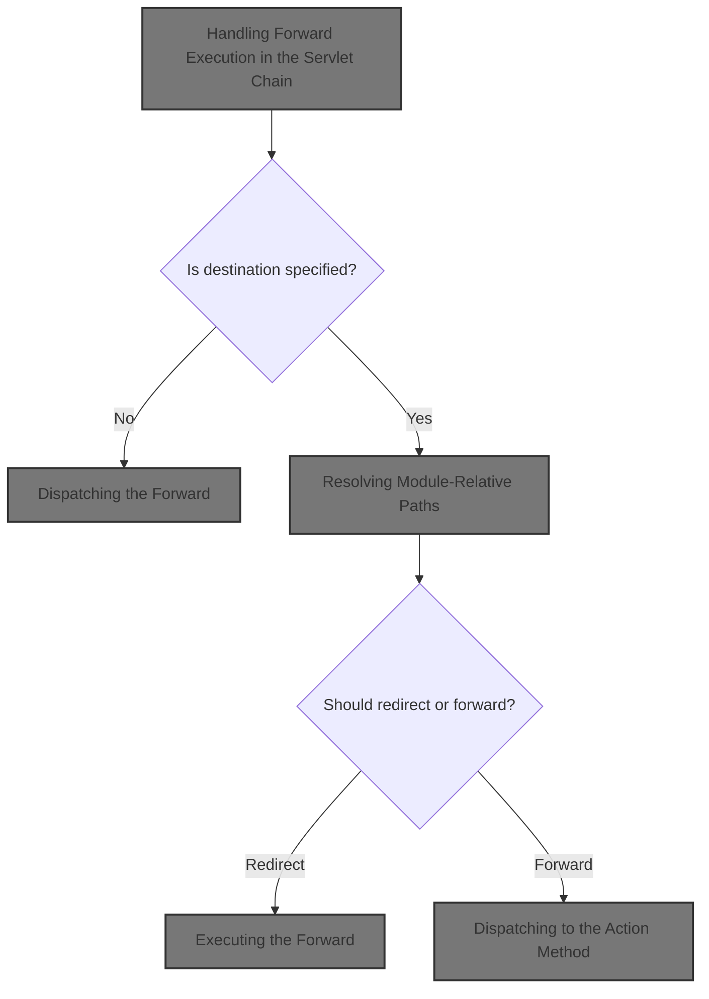
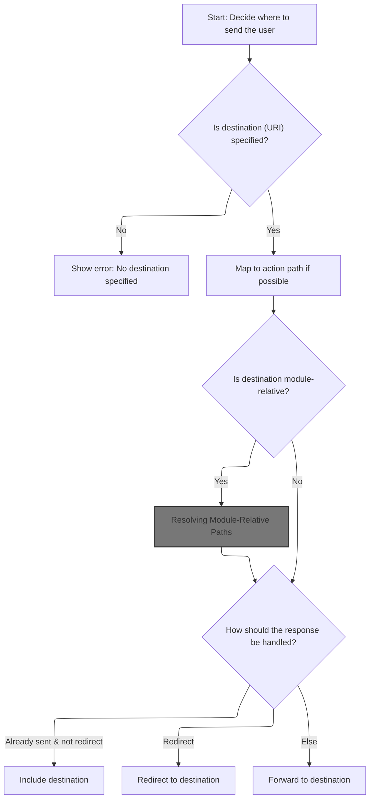
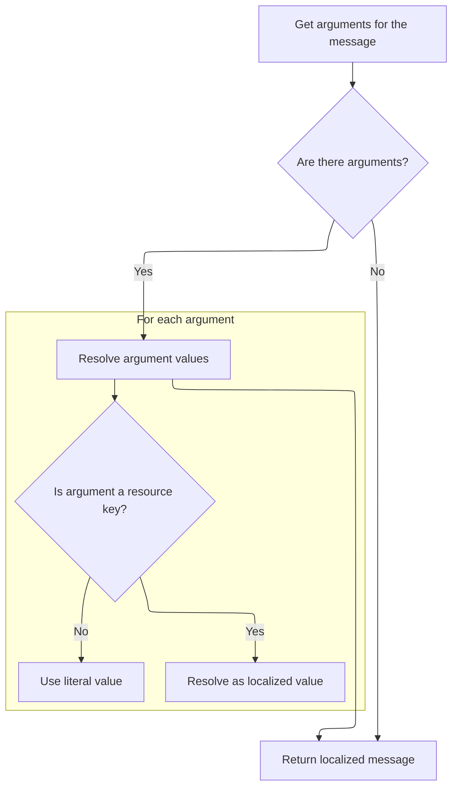
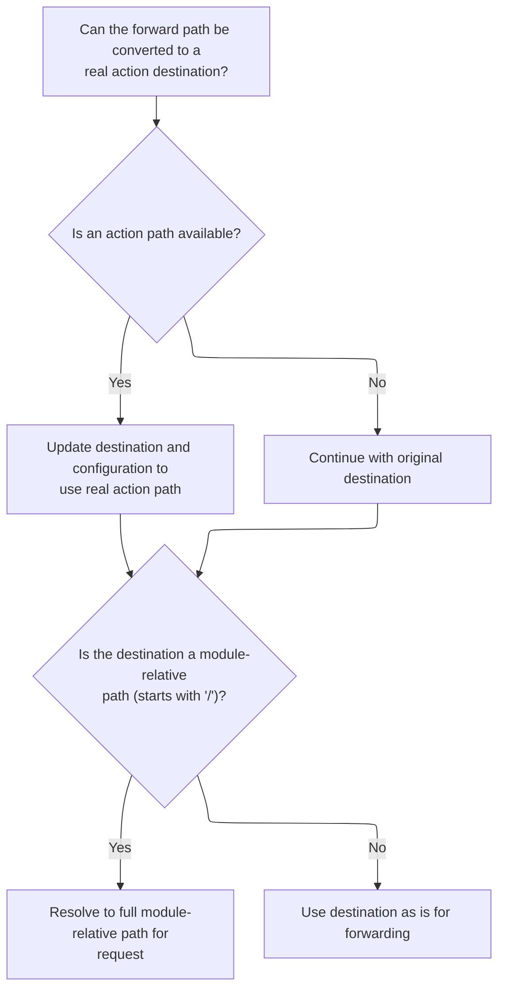
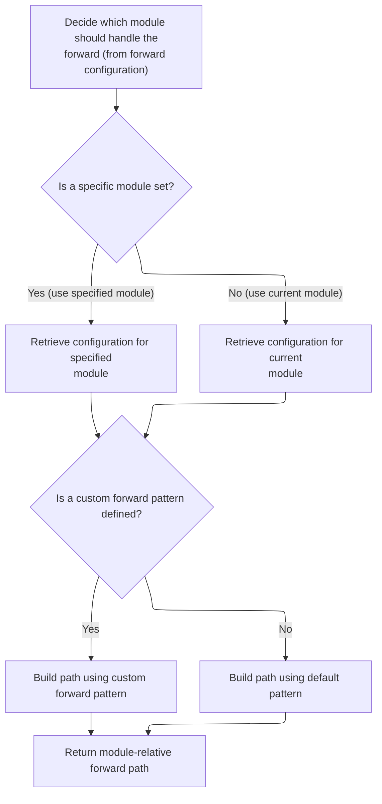
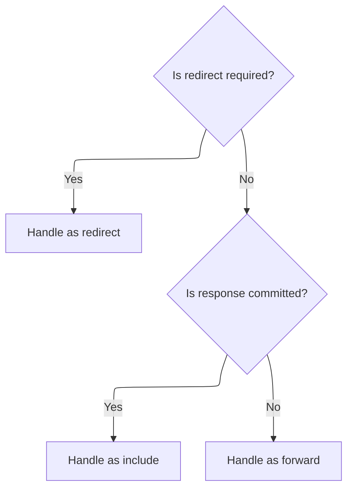
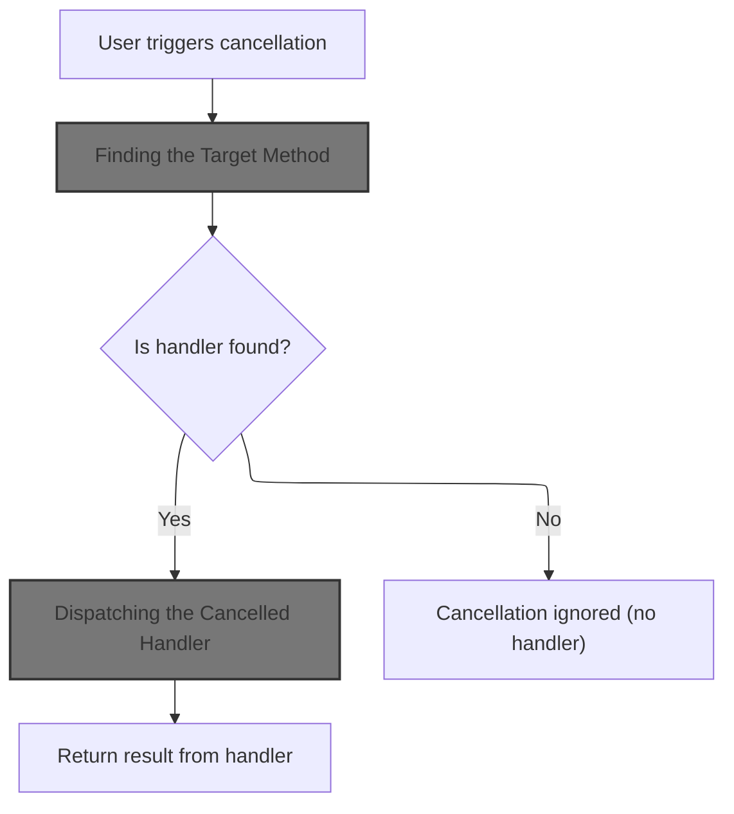
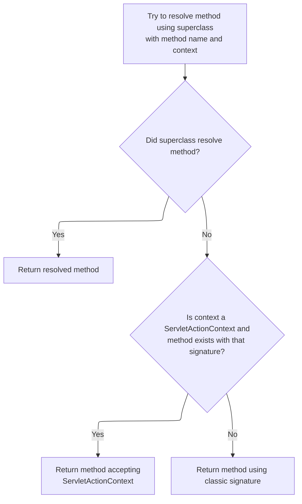
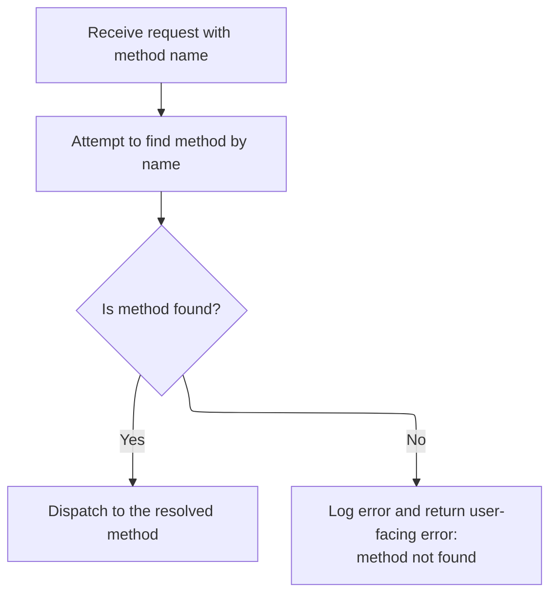

```mermaid
%%{init: {"flowchart": {"defaultRenderer": "elk"}} }%%
flowchart TD
    node1["Start: Retrieve message resources for
request and bundle"] --> node2["Ensure bundle is set (default if
missing)"]
    click node1 openCode "core/src/main/java/org/apache/struts/validator/Resources.java:117:119"
    click node2 openCode "core/src/main/java/org/apache/struts/validator/Resources.java:119:121"
    node2 --> node3["Check request for resources with bundle"]
    click node3 openCode "core/src/main/java/org/apache/struts/validator/Resources.java:123:124"
    node3 --> node4{"Resources found in request?"}
    click node4 openCode "core/src/main/java/org/apache/struts/validator/Resources.java:126:126"
    node4 -->|"Yes"| node9["Return resources"]
    node4 -->|"No"| node5["Check application for resources with
bundle and module prefix"]
    click node5 openCode "core/src/main/java/org/apache/struts/validator/Resources.java:127:132"
    node5 --> node6{"Resources found in application?"}
    click node6 openCode "core/src/main/java/org/apache/struts/validator/Resources.java:135:135"
    node6 -->|"Yes"| node9
    node6 -->|"No"| node7["Check application for resources with
bundle only"]
    click node7 openCode "core/src/main/java/org/apache/struts/validator/Resources.java:136:136"
    node7 --> node8{"Resources found?"}
    click node8 openCode "core/src/main/java/org/apache/struts/validator/Resources.java:139:139"
    node8 -->|"Yes"| node9
    node8 -->|"No"| node10["Throw error: No resources found for
bundle"]
    click node10 openCode "core/src/main/java/org/apache/struts/validator/Resources.java:140:142"
    node9["Return resources"]
    click node9 openCode "core/src/main/java/org/apache/struts/validator/Resources.java:144:145"
classDef HeadingStyle fill:#777777,stroke:#333,stroke-width:2px;

%% Swimm:
%% %%{init: {"flowchart": {"defaultRenderer": "elk"}} }%%
%% flowchart TD
%%     node1["Start: Retrieve message resources for
%% request and bundle"] --> node2["Ensure bundle is set (default if
%% missing)"]
%%     click node1 openCode "<SwmPath>[core/…/validator/Resources.java](core/src/main/java/org/apache/struts/validator/Resources.java)</SwmPath>:117:119"
%%     click node2 openCode "<SwmPath>[core/…/validator/Resources.java](core/src/main/java/org/apache/struts/validator/Resources.java)</SwmPath>:119:121"
%%     node2 --> node3["Check request for resources with bundle"]
%%     click node3 openCode "<SwmPath>[core/…/validator/Resources.java](core/src/main/java/org/apache/struts/validator/Resources.java)</SwmPath>:123:124"
%%     node3 --> node4{"Resources found in request?"}
%%     click node4 openCode "<SwmPath>[core/…/validator/Resources.java](core/src/main/java/org/apache/struts/validator/Resources.java)</SwmPath>:126:126"
%%     node4 -->|"Yes"| node9["Return resources"]
%%     node4 -->|"No"| node5["Check application for resources with
%% bundle and module prefix"]
%%     click node5 openCode "<SwmPath>[core/…/validator/Resources.java](core/src/main/java/org/apache/struts/validator/Resources.java)</SwmPath>:127:132"
%%     node5 --> node6{"Resources found in application?"}
%%     click node6 openCode "<SwmPath>[core/…/validator/Resources.java](core/src/main/java/org/apache/struts/validator/Resources.java)</SwmPath>:135:135"
%%     node6 -->|"Yes"| node9
%%     node6 -->|"No"| node7["Check application for resources with
%% bundle only"]
%%     click node7 openCode "<SwmPath>[core/…/validator/Resources.java](core/src/main/java/org/apache/struts/validator/Resources.java)</SwmPath>:136:136"
%%     node7 --> node8{"Resources found?"}
%%     click node8 openCode "<SwmPath>[core/…/validator/Resources.java](core/src/main/java/org/apache/struts/validator/Resources.java)</SwmPath>:139:139"
%%     node8 -->|"Yes"| node9
%%     node8 -->|"No"| node10["Throw error: No resources found for
%% bundle"]
%%     click node10 openCode "<SwmPath>[core/…/validator/Resources.java](core/src/main/java/org/apache/struts/validator/Resources.java)</SwmPath>:140:142"
%%     node9["Return resources"]
%%     click node9 openCode "<SwmPath>[core/…/validator/Resources.java](core/src/main/java/org/apache/struts/validator/Resources.java)</SwmPath>:144:145"
%% classDef HeadingStyle fill:#777777,stroke:#333,stroke-width:2px;
```

This document describes how an incoming HTTP request is routed to the correct business logic and destination. It outlines the main decisions for forwarding, redirecting, or including resources, resolving the action method to invoke, and handling localization and special cases. The flow receives an HTTP request and produces the appropriate response for the user.



# Handling Forward Execution in the Servlet Chain



<SwmSnippet path="/core/src/main/java/org/apache/struts/chain/commands/servlet/PerformForward.java" line="61">

---

In <SwmToken path="core/src/main/java/org/apache/struts/chain/commands/servlet/PerformForward.java" pos="61:5:5" line-data="    protected void perform(ActionContext context, ForwardConfig forwardConfig)">`perform`</SwmToken>, we're checking if the forward path is null. If it is, we grab a localized error message from the servlet's internal resources and throw an exception. This stops the flow early if the configuration is broken, and the next step is to fetch the actual error message string using the resources utility.

```java
    protected void perform(ActionContext context, ForwardConfig forwardConfig)
        throws Exception {
        ServletActionContext sacontext = (ServletActionContext) context;
        String uri = forwardConfig.getPath();

        if (uri == null) {
            ActionServlet servlet = sacontext.getActionServlet();
            MessageResources resources = servlet.getInternal();

            throw new IllegalArgumentException(resources.getMessage("forwardPathNull"));
        }

```

---

</SwmSnippet>

## Building the Error Message String

<SwmSnippet path="/core/src/main/java/org/apache/struts/validator/Resources.java" line="286">

---

In <SwmToken path="core/src/main/java/org/apache/struts/validator/Resources.java" pos="286:7:7" line-data="    public static String getMessage(ServletContext application,">`getMessage`</SwmToken>, we're figuring out which message key and bundle to use for the error message. If the field has a custom message, we use that; otherwise, we fall back to the validator action's default. If a bundle is specified, we switch to those resources. Next, we need to actually load the message resources, which is why we call <SwmToken path="core/src/main/java/org/apache/struts/validator/Resources.java" pos="307:1:1" line-data="                    getMessageResources(application, request, msg.getBundle());">`getMessageResources`</SwmToken>.

```java
    public static String getMessage(ServletContext application,
        HttpServletRequest request, MessageResources defaultMessages,
        Locale locale, ValidatorAction va, Field field) {
        Msg msg = field.getMessage(va.getName());

        if ((msg != null) && !msg.isResource()) {
            return msg.getKey();
        }

        String msgKey = null;
        String msgBundle = null;
        MessageResources messages = defaultMessages;

        if (msg == null) {
            msgKey = va.getMsg();
        } else {
            msgKey = msg.getKey();
            msgBundle = msg.getBundle();

            if (msg.getBundle() != null) {
                messages =
                    getMessageResources(application, request, msg.getBundle());
            }
        }

        if ((msgKey == null) || (msgKey.length() == 0)) {
            return "??? " + va.getName() + "." + field.getProperty() + " ???";
        }

```

---

</SwmSnippet>

### Locating the Correct <SwmToken path="core/src/main/java/org/apache/struts/chain/commands/servlet/PerformForward.java" pos="68:1:1" line-data="            MessageResources resources = servlet.getInternal();">`MessageResources`</SwmToken>



<SwmSnippet path="/core/src/main/java/org/apache/struts/validator/Resources.java" line="117">

---

In <SwmToken path="core/src/main/java/org/apache/struts/validator/Resources.java" pos="117:7:7" line-data="    public static MessageResources getMessageResources(">`getMessageResources`</SwmToken>, we're trying to find the right <SwmToken path="core/src/main/java/org/apache/struts/validator/Resources.java" pos="117:5:5" line-data="    public static MessageResources getMessageResources(">`MessageResources`</SwmToken> for the current bundle and module. We first check the request, then the application with the module prefix if needed. To do that, we need the <SwmToken path="core/src/main/java/org/apache/struts/validator/Resources.java" pos="127:1:1" line-data="            ModuleConfig moduleConfig =">`ModuleConfig`</SwmToken>, so we call into <SwmToken path="core/src/main/java/org/apache/struts/validator/Resources.java" pos="128:1:1" line-data="                ModuleUtils.getInstance().getModuleConfig(request, application);">`ModuleUtils`</SwmToken> to get it.

```java
    public static MessageResources getMessageResources(
        ServletContext application, HttpServletRequest request, String bundle) {
        if (bundle == null) {
            bundle = Globals.MESSAGES_KEY;
        }

        MessageResources resources =
            (MessageResources) request.getAttribute(bundle);

        if (resources == null) {
            ModuleConfig moduleConfig =
                ModuleUtils.getInstance().getModuleConfig(request, application);

            resources =
                (MessageResources) application.getAttribute(bundle
                    + moduleConfig.getPrefix());
        }

```

---

</SwmSnippet>

<SwmSnippet path="/core/src/main/java/org/apache/struts/util/ModuleUtils.java" line="130">

---

<SwmToken path="core/src/main/java/org/apache/struts/util/ModuleUtils.java" pos="130:5:5" line-data="    public ModuleConfig getModuleConfig(HttpServletRequest request,">`getModuleConfig`</SwmToken> tries to get the module config from the request, and if that fails, it falls back to a default using the context and sets it on the request. This fallback and side effect make sure the rest of the code can always find a <SwmToken path="core/src/main/java/org/apache/struts/util/ModuleUtils.java" pos="130:3:3" line-data="    public ModuleConfig getModuleConfig(HttpServletRequest request,">`ModuleConfig`</SwmToken>.

```java
    public ModuleConfig getModuleConfig(HttpServletRequest request,
        ServletContext context) {
        ModuleConfig moduleConfig = this.getModuleConfig(request);

        if (moduleConfig == null) {
            moduleConfig = this.getModuleConfig("", context);
            request.setAttribute(Globals.MODULE_KEY, moduleConfig);
        }

        return moduleConfig;
    }
```

---

</SwmSnippet>

<SwmSnippet path="/core/src/main/java/org/apache/struts/validator/Resources.java" line="135">

---

Back in <SwmToken path="core/src/main/java/org/apache/struts/validator/Resources.java" pos="117:7:7" line-data="    public static MessageResources getMessageResources(">`getMessageResources`</SwmToken>, after getting the <SwmToken path="core/src/main/java/org/apache/struts/chain/commands/servlet/PerformForward.java" pos="102:1:1" line-data="        ModuleConfig moduleConfig = ModuleUtils.getInstance().getModuleConfig(prefix, request, servletContext);">`ModuleConfig`</SwmToken> from <SwmToken path="core/src/main/java/org/apache/struts/chain/commands/servlet/PerformForward.java" pos="102:7:7" line-data="        ModuleConfig moduleConfig = ModuleUtils.getInstance().getModuleConfig(prefix, request, servletContext);">`ModuleUtils`</SwmToken>, we check the application for resources. If we still don't find any, we throw a <SwmToken path="core/src/main/java/org/apache/struts/validator/Resources.java" pos="140:5:5" line-data="            throw new NullPointerException(">`NullPointerException`</SwmToken>. This makes sure we don't silently fail if resources are missing.

```java
        if (resources == null) {
            resources = (MessageResources) application.getAttribute(bundle);
        }

        if (resources == null) {
            throw new NullPointerException(
                "No message resources found for bundle: " + bundle);
        }

        return resources;
    }
```

---

</SwmSnippet>

### Collecting Message Arguments



<SwmSnippet path="/core/src/main/java/org/apache/struts/validator/Resources.java" line="315">

---

Back in <SwmToken path="core/src/main/java/org/apache/struts/chain/commands/servlet/PerformForward.java" pos="70:9:9" line-data="            throw new IllegalArgumentException(resources.getMessage(&quot;forwardPathNull&quot;));">`getMessage`</SwmToken>, after loading the resources, we grab any arguments for the message from the field. These are used to fill in placeholders in the final message. Next, we need to resolve the actual argument values, so we call <SwmToken path="core/src/main/java/org/apache/struts/validator/Resources.java" pos="318:1:1" line-data="            getArgValues(application, request, messages, locale, args);">`getArgValues`</SwmToken>.

```java
        // Get the arguments
        Arg[] args = field.getArgs(va.getName());
```

---

</SwmSnippet>

<SwmSnippet path="/core/src/main/java/org/apache/struts/validator/Resources.java" line="420">

---

<SwmToken path="core/src/main/java/org/apache/struts/validator/Resources.java" pos="420:9:9" line-data="    public static String[] getArgs(String actionName,">`getArgs`</SwmToken> grabs up to four arguments for the action, localizes them if needed, and returns them as an array. The four-argument limit is baked in, so if you need more, you'd have to change the code.

```java
    public static String[] getArgs(String actionName,
        MessageResources messages, Locale locale, Field field) {
        String[] argMessages = new String[4];

        Arg[] args =
            new Arg[] {
                field.getArg(actionName, 0), field.getArg(actionName, 1),
                field.getArg(actionName, 2), field.getArg(actionName, 3)
            };

        for (int i = 0; i < args.length; i++) {
            if (args[i] == null) {
                continue;
            }

            if (args[i].isResource()) {
                argMessages[i] = getMessage(messages, locale, args[i].getKey());
            } else {
                argMessages[i] = args[i].getKey();
            }
        }
```

---

</SwmSnippet>

<SwmSnippet path="/core/src/main/java/org/apache/struts/validator/Resources.java" line="317">

---

Back in <SwmToken path="core/src/main/java/org/apache/struts/validator/Resources.java" pos="321:5:5" line-data="        return messages.getMessage(locale, msgKey, argValues);">`getMessage`</SwmToken>, after getting the argument objects, we call <SwmToken path="core/src/main/java/org/apache/struts/validator/Resources.java" pos="318:1:1" line-data="            getArgValues(application, request, messages, locale, args);">`getArgValues`</SwmToken> to resolve their actual string values, handling localization and bundles. The result is used to build the final message string.

```java
        String[] argValues =
            getArgValues(application, request, messages, locale, args);

        // Return the message
        return messages.getMessage(locale, msgKey, argValues);
    }
```

---

</SwmSnippet>

<SwmSnippet path="/core/src/main/java/org/apache/struts/validator/Resources.java" line="455">

---

<SwmToken path="core/src/main/java/org/apache/struts/validator/Resources.java" pos="455:9:9" line-data="    private static String[] getArgValues(ServletContext application,">`getArgValues`</SwmToken> loops through the argument array, resolving each one to a string. If an argument is a resource and has a bundle, it loads the right resources before getting the value. Otherwise, it just uses the key.

```java
    private static String[] getArgValues(ServletContext application,
        HttpServletRequest request, MessageResources defaultMessages,
        Locale locale, Arg[] args) {
        if ((args == null) || (args.length == 0)) {
            return null;
        }

        String[] values = new String[args.length];

        for (int i = 0; i < args.length; i++) {
            if (args[i] != null) {
                if (args[i].isResource()) {
                    MessageResources messages = defaultMessages;

                    if (args[i].getBundle() != null) {
                        messages =
                            getMessageResources(application, request,
                                args[i].getBundle());
                    }

                    values[i] = messages.getMessage(locale, args[i].getKey());
                } else {
                    values[i] = args[i].getKey();
                }
            }
        }

        return values;
    }
```

---

</SwmSnippet>

## Preparing the Forward Context

<SwmSnippet path="/core/src/main/java/org/apache/struts/chain/commands/servlet/PerformForward.java" line="73">

---

Back in <SwmToken path="core/src/main/java/org/apache/struts/chain/commands/servlet/PerformForward.java" pos="61:5:5" line-data="    protected void perform(ActionContext context, ForwardConfig forwardConfig)">`perform`</SwmToken>, after building the error message, we grab the <SwmToken path="core/src/main/java/org/apache/struts/chain/commands/servlet/PerformForward.java" pos="73:1:1" line-data="        HttpServletRequest request = sacontext.getRequest();">`HttpServletRequest`</SwmToken> from the context. This is needed for the actual forward or redirect operation.

```java
        HttpServletRequest request = sacontext.getRequest();
```

---

</SwmSnippet>

## Accessing the Servlet Request

<SwmSnippet path="/core/src/main/java/org/apache/struts/chain/contexts/ServletActionContext.java" line="94">

---

<SwmToken path="core/src/main/java/org/apache/struts/chain/contexts/ServletActionContext.java" pos="94:5:5" line-data="    public HttpServletRequest getRequest() {">`getRequest`</SwmToken> just delegates to <SwmToken path="core/src/main/java/org/apache/struts/chain/contexts/ServletActionContext.java" pos="95:3:3" line-data="        return servletWebContext().getRequest();">`servletWebContext`</SwmToken> to fetch the <SwmToken path="core/src/main/java/org/apache/struts/chain/contexts/ServletActionContext.java" pos="94:3:3" line-data="    public HttpServletRequest getRequest() {">`HttpServletRequest`</SwmToken>. This keeps the context abstraction flexible for different environments.

```java
    public HttpServletRequest getRequest() {
        return servletWebContext().getRequest();
    }
```

---

</SwmSnippet>

<SwmSnippet path="/core/src/main/java/org/apache/struts/chain/contexts/ServletActionContext.java" line="67">

---

<SwmToken path="core/src/main/java/org/apache/struts/chain/contexts/ServletActionContext.java" pos="67:5:5" line-data="    protected ServletWebContext servletWebContext() {">`servletWebContext`</SwmToken> just casts the base context to <SwmToken path="core/src/main/java/org/apache/struts/chain/contexts/ServletActionContext.java" pos="67:3:3" line-data="    protected ServletWebContext servletWebContext() {">`ServletWebContext`</SwmToken>. If the type is wrong, you'll get a <SwmToken path="extras/src/main/java/org/apache/struts/actions/ActionDispatcher.java" pos="368:6:6" line-data="        } catch (ClassCastException e) {">`ClassCastException`</SwmToken>, so the setup has to be right.

```java
    protected ServletWebContext servletWebContext() {
        return (ServletWebContext) this.getBaseContext();
    }
```

---

</SwmSnippet>

## Getting the Servlet Context



<SwmSnippet path="/core/src/main/java/org/apache/struts/chain/commands/servlet/PerformForward.java" line="74">

---

Back in <SwmToken path="core/src/main/java/org/apache/struts/chain/commands/servlet/PerformForward.java" pos="61:5:5" line-data="    protected void perform(ActionContext context, ForwardConfig forwardConfig)">`perform`</SwmToken>, after getting the request, we fetch the <SwmToken path="core/src/main/java/org/apache/struts/chain/commands/servlet/PerformForward.java" pos="74:1:1" line-data="        ServletContext servletContext = sacontext.getContext();">`ServletContext`</SwmToken>. This is needed for things like getting the <SwmToken path="core/src/main/java/org/apache/struts/chain/commands/servlet/PerformForward.java" pos="107:1:1" line-data="        RequestDispatcher rd = servletContext.getRequestDispatcher(uri);">`RequestDispatcher`</SwmToken> for the forward.

```java
        ServletContext servletContext = sacontext.getContext();
```

---

</SwmSnippet>

<SwmSnippet path="/core/src/main/java/org/apache/struts/chain/contexts/ServletActionContext.java" line="85">

---

<SwmToken path="core/src/main/java/org/apache/struts/chain/contexts/ServletActionContext.java" pos="85:5:5" line-data="    public ServletContext getContext() {">`getContext`</SwmToken> just delegates to <SwmToken path="core/src/main/java/org/apache/struts/chain/contexts/ServletActionContext.java" pos="86:3:3" line-data="        return servletWebContext().getContext();">`servletWebContext`</SwmToken> to fetch the <SwmToken path="core/src/main/java/org/apache/struts/chain/contexts/ServletActionContext.java" pos="85:3:3" line-data="    public ServletContext getContext() {">`ServletContext`</SwmToken>. This keeps the context abstraction flexible for different environments.

```java
    public ServletContext getContext() {
        return servletWebContext().getContext();
    }
```

---

</SwmSnippet>

<SwmSnippet path="/core/src/main/java/org/apache/struts/chain/commands/servlet/PerformForward.java" line="75">

---

Back in <SwmToken path="core/src/main/java/org/apache/struts/chain/commands/servlet/PerformForward.java" pos="61:5:5" line-data="    protected void perform(ActionContext context, ForwardConfig forwardConfig)">`perform`</SwmToken>, after getting the context, we fetch the <SwmToken path="core/src/main/java/org/apache/struts/chain/commands/servlet/PerformForward.java" pos="75:1:1" line-data="        HttpServletResponse response = sacontext.getResponse();">`HttpServletResponse`</SwmToken>. This is needed for the actual forward, include, or redirect operation.

```java
        HttpServletResponse response = sacontext.getResponse();

```

---

</SwmSnippet>

<SwmSnippet path="/core/src/main/java/org/apache/struts/chain/contexts/ServletActionContext.java" line="103">

---

<SwmToken path="core/src/main/java/org/apache/struts/chain/contexts/ServletActionContext.java" pos="103:5:5" line-data="    public HttpServletResponse getResponse() {">`getResponse`</SwmToken> just delegates to <SwmToken path="core/src/main/java/org/apache/struts/chain/contexts/ServletActionContext.java" pos="104:3:3" line-data="        return servletWebContext().getResponse();">`servletWebContext`</SwmToken> to fetch the <SwmToken path="core/src/main/java/org/apache/struts/chain/contexts/ServletActionContext.java" pos="103:3:3" line-data="    public HttpServletResponse getResponse() {">`HttpServletResponse`</SwmToken>. This keeps the context abstraction flexible for different environments.

```java
    public HttpServletResponse getResponse() {
        return servletWebContext().getResponse();
    }
```

---

</SwmSnippet>

<SwmSnippet path="/core/src/main/java/org/apache/struts/chain/commands/servlet/PerformForward.java" line="77">

---

Back in <SwmToken path="core/src/main/java/org/apache/struts/chain/commands/servlet/PerformForward.java" pos="61:5:5" line-data="    protected void perform(ActionContext context, ForwardConfig forwardConfig)">`perform`</SwmToken>, after getting the response, we check if the forward can be unaliased into an action path. This step is needed to handle cases where the forward is actually an action alias.

```java
        // If the forward can be unaliased into an action, then use the path of the action
        String actionIdPath = RequestUtils.actionIdURL(forwardConfig, sacontext.getRequest(), sacontext.getActionServlet());
```

---

</SwmSnippet>

<SwmSnippet path="/core/src/main/java/org/apache/struts/chain/commands/servlet/PerformForward.java" line="78">

---

Back in <SwmToken path="core/src/main/java/org/apache/struts/chain/commands/servlet/PerformForward.java" pos="61:5:5" line-data="    protected void perform(ActionContext context, ForwardConfig forwardConfig)">`perform`</SwmToken>, we call <SwmToken path="core/src/main/java/org/apache/struts/chain/commands/servlet/PerformForward.java" pos="78:7:9" line-data="        String actionIdPath = RequestUtils.actionIdURL(forwardConfig, sacontext.getRequest(), sacontext.getActionServlet());">`RequestUtils.actionIdURL`</SwmToken> to resolve the real action URL from the forward config. This handles any aliasing and query string parsing.

```java
        String actionIdPath = RequestUtils.actionIdURL(forwardConfig, sacontext.getRequest(), sacontext.getActionServlet());
```

---

</SwmSnippet>

<SwmSnippet path="/core/src/main/java/org/apache/struts/util/RequestUtils.java" line="1080">

---

<SwmToken path="core/src/main/java/org/apache/struts/util/RequestUtils.java" pos="1080:7:7" line-data="    public static String actionIdURL(String originalPath, ModuleConfig moduleConfig, ActionServlet servlet) {">`actionIdURL`</SwmToken> parses the original path, splits out any query string, finds the <SwmToken path="core/src/main/java/org/apache/struts/util/RequestUtils.java" pos="1098:1:1" line-data="        ActionConfig actionConfig = moduleConfig.findActionConfigId(actionId);">`ActionConfig`</SwmToken>, and reconstructs the action URL based on the servlet mapping pattern. It handles both extension and path mapping, and appends the query string if present.

```java
    public static String actionIdURL(String originalPath, ModuleConfig moduleConfig, ActionServlet servlet) {
        if (originalPath.startsWith("http") || originalPath.startsWith("/")) {
            return null;
        }

        // Split the forward path into the resource and query string;
        // it is possible a forward (or redirect) has added parameters.
        String actionId = null;
        String qs = null;
        int qpos = originalPath.indexOf("?");
        if (qpos == -1) {
            actionId = originalPath;
        } else {
            actionId = originalPath.substring(0, qpos);
            qs = originalPath.substring(qpos);
        }

        // Find the action of the given actionId
        ActionConfig actionConfig = moduleConfig.findActionConfigId(actionId);
        if (actionConfig == null) {
            if (log.isDebugEnabled()) {
                log.debug("No actionId found for " + actionId);
            }
            return null;
        }

        String path = actionConfig.getPath();
        String mapping = RequestUtils.getServletMapping(servlet);
        StringBuffer actionIdPath = new StringBuffer();

        // Form the path based on the servlet mapping pattern
        if (mapping.startsWith("*")) {
            actionIdPath.append(path);
            actionIdPath.append(mapping.substring(1));
        } else if (mapping.startsWith("/")) {  // implied ends with a *
            mapping = mapping.substring(0, mapping.length() - 1);
            if (mapping.endsWith("/") && path.startsWith("/")) {
                actionIdPath.append(mapping);
                actionIdPath.append(path.substring(1));
            } else {
                actionIdPath.append(mapping);
                actionIdPath.append(path);
            }
        } else {
            log.warn("Unknown servlet mapping pattern");
            actionIdPath.append(path);
        }

        // Lastly add any query parameters (the ? is part of the query string)
        if (qs != null) {
            actionIdPath.append(qs);
        }

        // Return the path
        if (log.isDebugEnabled()) {
            log.debug(originalPath + " unaliased to " + actionIdPath.toString());
        }
        return actionIdPath.toString();
    }
```

---

</SwmSnippet>

<SwmSnippet path="/core/src/main/java/org/apache/struts/chain/commands/servlet/PerformForward.java" line="79">

---

Back in <SwmToken path="core/src/main/java/org/apache/struts/chain/commands/servlet/PerformForward.java" pos="61:5:5" line-data="    protected void perform(ActionContext context, ForwardConfig forwardConfig)">`perform`</SwmToken>, after resolving the <SwmToken path="core/src/main/java/org/apache/struts/chain/commands/servlet/PerformForward.java" pos="79:4:4" line-data="        if (actionIdPath != null) {">`actionIdPath`</SwmToken>, we update the uri and create a new <SwmToken path="core/src/main/java/org/apache/struts/chain/commands/servlet/PerformForward.java" pos="81:1:1" line-data="            ForwardConfig actionIdForwardConfig = new ForwardConfig(forwardConfig);">`ForwardConfig`</SwmToken> with the new path. This ensures the forward uses the correct destination.

```java
        if (actionIdPath != null) {
            uri = actionIdPath;
            ForwardConfig actionIdForwardConfig = new ForwardConfig(forwardConfig);
            actionIdForwardConfig.setPath(actionIdPath);
            forwardConfig = actionIdForwardConfig;
        }

```

---

</SwmSnippet>

<SwmSnippet path="/core/src/main/java/org/apache/struts/config/ForwardConfig.java" line="198">

---

<SwmToken path="core/src/main/java/org/apache/struts/config/ForwardConfig.java" pos="198:5:5" line-data="    public void setPath(String path) {">`setPath`</SwmToken> in <SwmToken path="core/src/main/java/org/apache/struts/chain/commands/servlet/PerformForward.java" pos="61:12:12" line-data="    protected void perform(ActionContext context, ForwardConfig forwardConfig)">`ForwardConfig`</SwmToken> only allows changing the path if the configuration isn't frozen. If it's frozen, it throws an exception to prevent runtime changes.

```java
    public void setPath(String path) {
        if (configured) {
            throw new IllegalStateException("Configuration is frozen");
        }

        this.path = path;
    }
```

---

</SwmSnippet>

<SwmSnippet path="/core/src/main/java/org/apache/struts/chain/commands/servlet/PerformForward.java" line="86">

---

Back in <SwmToken path="core/src/main/java/org/apache/struts/chain/commands/servlet/PerformForward.java" pos="61:5:5" line-data="    protected void perform(ActionContext context, ForwardConfig forwardConfig)">`perform`</SwmToken>, if the uri starts with '/', we call <SwmToken path="core/src/main/java/org/apache/struts/chain/commands/servlet/PerformForward.java" pos="87:5:5" line-data="            uri = resolveModuleRelativePath(forwardConfig, servletContext, request);">`resolveModuleRelativePath`</SwmToken> to handle <SwmToken path="core/src/main/java/org/apache/struts/config/ForwardConfig.java" pos="66:11:13" line-data="     * considered to be the module-relative portion of the URL. It will be">`module-relative`</SwmToken> paths and get the correct URL for the forward.

```java
        if (uri.startsWith("/")) {
            uri = resolveModuleRelativePath(forwardConfig, servletContext, request);
        }


```

---

</SwmSnippet>

## Resolving Module-Relative Paths



<SwmSnippet path="/core/src/main/java/org/apache/struts/chain/commands/servlet/PerformForward.java" line="100">

---

In <SwmToken path="core/src/main/java/org/apache/struts/chain/commands/servlet/PerformForward.java" pos="100:5:5" line-data="    private String resolveModuleRelativePath(ForwardConfig forwardConfig, ServletContext servletContext, HttpServletRequest request) {">`resolveModuleRelativePath`</SwmToken>, we grab the module prefix from the forward config and use <SwmToken path="core/src/main/java/org/apache/struts/chain/commands/servlet/PerformForward.java" pos="102:7:7" line-data="        ModuleConfig moduleConfig = ModuleUtils.getInstance().getModuleConfig(prefix, request, servletContext);">`ModuleUtils`</SwmToken> to get the right <SwmToken path="core/src/main/java/org/apache/struts/chain/commands/servlet/PerformForward.java" pos="102:1:1" line-data="        ModuleConfig moduleConfig = ModuleUtils.getInstance().getModuleConfig(prefix, request, servletContext);">`ModuleConfig`</SwmToken>. This is needed to resolve the path in the correct module context.

```java
    private String resolveModuleRelativePath(ForwardConfig forwardConfig, ServletContext servletContext, HttpServletRequest request) {
        String prefix = forwardConfig.getModule();
        ModuleConfig moduleConfig = ModuleUtils.getInstance().getModuleConfig(prefix, request, servletContext);
```

---

</SwmSnippet>

<SwmSnippet path="/core/src/main/java/org/apache/struts/util/ModuleUtils.java" line="108">

---

<SwmToken path="core/src/main/java/org/apache/struts/util/ModuleUtils.java" pos="108:5:5" line-data="    public ModuleConfig getModuleConfig(String prefix,">`getModuleConfig`</SwmToken> checks if a prefix is given—if so, it looks up the module config by prefix; otherwise, it uses the current module from the request. This makes sure we get the right config for the path resolution.

```java
    public ModuleConfig getModuleConfig(String prefix,
        HttpServletRequest request, ServletContext context) {
        ModuleConfig moduleConfig = null;

        if (prefix != null) {
            //lookup module stored with the given prefix.
            moduleConfig = this.getModuleConfig(prefix, context);
        } else {
            //return the current module if no prefix was supplied.
            moduleConfig = this.getModuleConfig(request, context);
        }

        return moduleConfig;
    }
```

---

</SwmSnippet>

<SwmSnippet path="/core/src/main/java/org/apache/struts/chain/commands/servlet/PerformForward.java" line="103">

---

Back in <SwmToken path="core/src/main/java/org/apache/struts/chain/commands/servlet/PerformForward.java" pos="87:5:5" line-data="            uri = resolveModuleRelativePath(forwardConfig, servletContext, request);">`resolveModuleRelativePath`</SwmToken>, after getting the module config, we call <SwmToken path="core/src/main/java/org/apache/struts/chain/commands/servlet/PerformForward.java" pos="103:3:5" line-data="        return RequestUtils.forwardURL(request,forwardConfig, moduleConfig);">`RequestUtils.forwardURL`</SwmToken> to build the final URL string for the forward.

```java
        return RequestUtils.forwardURL(request,forwardConfig, moduleConfig);
    }
```

---

</SwmSnippet>

<SwmSnippet path="/core/src/main/java/org/apache/struts/util/RequestUtils.java" line="842">

---

<SwmToken path="core/src/main/java/org/apache/struts/util/RequestUtils.java" pos="842:7:7" line-data="    public static String forwardURL(HttpServletRequest request,">`forwardURL`</SwmToken> builds the final URL string for the forward. It uses the module prefix, path, and an optional pattern with tokens like $M and $P to match the app's routing rules.

```java
    public static String forwardURL(HttpServletRequest request,
        ForwardConfig forward, ModuleConfig moduleConfig) {
        //load the current moduleConfig, if null
        if (moduleConfig == null) {
            moduleConfig = ModuleUtils.getInstance().getModuleConfig(request);
        }

        String path = forward.getPath();

        //load default prefix
        String prefix = moduleConfig.getPrefix();

        //override prefix if supplied by forward
        if (forward.getModule() != null) {
            prefix = forward.getModule();

            if ("/".equals(prefix)) {
                prefix = "";
            }
        }

        StringBuffer sb = new StringBuffer();

        // Calculate a context relative path for this ForwardConfig
        String forwardPattern =
            moduleConfig.getControllerConfig().getForwardPattern();

        if (forwardPattern == null) {
            // Performance optimization for previous default behavior
            sb.append(prefix);

            // smoothly insert a '/' if needed
            if (!path.startsWith("/")) {
                sb.append("/");
            }

            sb.append(path);
        } else {
            boolean dollar = false;

            for (int i = 0; i < forwardPattern.length(); i++) {
                char ch = forwardPattern.charAt(i);

                if (dollar) {
                    switch (ch) {
                    case 'M':
                        sb.append(prefix);

                        break;

                    case 'P':

                        // add '/' if needed
                        if (!path.startsWith("/")) {
                            sb.append("/");
                        }

                        sb.append(path);

                        break;

                    case '$':
                        sb.append('$');

                        break;

                    default:
                        ; // Silently swallow
                    }

                    dollar = false;

                    continue;
                } else if (ch == '$') {
                    dollar = true;
                } else {
                    sb.append(ch);
                }
            }
```

---

</SwmSnippet>

## Dispatching the Forward



<SwmSnippet path="/core/src/main/java/org/apache/struts/chain/commands/servlet/PerformForward.java" line="91">

---

Back in <SwmToken path="core/src/main/java/org/apache/struts/chain/commands/servlet/PerformForward.java" pos="61:5:5" line-data="    protected void perform(ActionContext context, ForwardConfig forwardConfig)">`perform`</SwmToken>, we decide whether to include, redirect, or forward based on the response state and forward config. If it's a regular forward, we call <SwmToken path="core/src/main/java/org/apache/struts/chain/commands/servlet/PerformForward.java" pos="96:1:1" line-data="            handleAsForward(uri, servletContext, request, response);">`handleAsForward`</SwmToken> to actually dispatch the request.

```java
        if (response.isCommitted() && !forwardConfig.getRedirect()) {
            handleAsInclude(uri, servletContext, request, response);
        } else if (forwardConfig.getRedirect()) {
            handleAsRedirect(uri, request, response);
        } else {
            handleAsForward(uri, servletContext, request, response);
        }
    }
```

---

</SwmSnippet>

# Executing the Forward

<SwmSnippet path="/core/src/main/java/org/apache/struts/chain/commands/servlet/PerformForward.java" line="106">

---

<SwmToken path="core/src/main/java/org/apache/struts/chain/commands/servlet/PerformForward.java" pos="106:5:5" line-data="    private void handleAsForward(String uri, ServletContext servletContext, HttpServletRequest request, HttpServletResponse response) throws ServletException, IOException {">`handleAsForward`</SwmToken> gets a <SwmToken path="core/src/main/java/org/apache/struts/chain/commands/servlet/PerformForward.java" pos="107:1:1" line-data="        RequestDispatcher rd = servletContext.getRequestDispatcher(uri);">`RequestDispatcher`</SwmToken> for the uri and calls forward on it. This hands off the request and response to the target resource. Next, we might call into a JSF backing bean if we're in a JSF context.

```java
    private void handleAsForward(String uri, ServletContext servletContext, HttpServletRequest request, HttpServletResponse response) throws ServletException, IOException {
        RequestDispatcher rd = servletContext.getRequestDispatcher(uri);

        if (LOG.isDebugEnabled()) {
            LOG.debug("Forwarding to " + uri);
        }

        rd.forward(request, response);
    }
```

---

</SwmSnippet>

# JSF Forward Dispatch

<SwmSnippet path="/apps/faces-example1/src/main/java/org/apache/struts/webapp/example/AbstractBacking.java" line="66">

---

<SwmToken path="apps/faces-example1/src/main/java/org/apache/struts/webapp/example/AbstractBacking.java" pos="66:5:5" line-data="    protected void forward(FacesContext context, String url) {">`forward`</SwmToken> in <SwmToken path="apps/faces-example1/src/main/java/org/apache/struts/webapp/example/AbstractBacking.java" pos="35:4:4" line-data="abstract class AbstractBacking {">`AbstractBacking`</SwmToken> uses the JSF ExternalContext to dispatch to the given URL. If there's an error, it wraps it in a <SwmToken path="apps/faces-example1/src/main/java/org/apache/struts/webapp/example/AbstractBacking.java" pos="71:5:5" line-data="            throw new FacesException(e);">`FacesException`</SwmToken>, and always marks the response as complete so JSF doesn't try to render again.

```java
    protected void forward(FacesContext context, String url) {

        try {
            context.getExternalContext().dispatch(url);
        } catch (IOException e) {
            throw new FacesException(e);
        } finally {
            context.responseComplete();
        }

    }
```

---

</SwmSnippet>

# Dispatching to the Action Method

<SwmSnippet path="/extras/src/main/java/org/apache/struts/actions/ActionDispatcher.java" line="507">

---

In <SwmToken path="extras/src/main/java/org/apache/struts/actions/ActionDispatcher.java" pos="507:5:5" line-data="    public Object dispatch(ActionContext context) throws Exception {">`dispatch`</SwmToken>, we're casting the generic <SwmToken path="extras/src/main/java/org/apache/struts/actions/ActionDispatcher.java" pos="507:7:7" line-data="    public Object dispatch(ActionContext context) throws Exception {">`ActionContext`</SwmToken> to <SwmToken path="extras/src/main/java/org/apache/struts/actions/ActionDispatcher.java" pos="508:1:1" line-data="        ServletActionContext servletContext = (ServletActionContext) context;">`ServletActionContext`</SwmToken> so we can grab the servlet request and response. This is needed because the next step, calling <SwmToken path="extras/src/main/java/org/apache/struts/actions/ActionDispatcher.java" pos="509:3:3" line-data="        return execute((ActionMapping) context.getActionConfig(), context.getActionForm(),">`execute`</SwmToken>, requires those servlet-specific objects.

```java
    public Object dispatch(ActionContext context) throws Exception {
        ServletActionContext servletContext = (ServletActionContext) context;
        return execute((ActionMapping) context.getActionConfig(), context.getActionForm(),
            servletContext.getRequest(), servletContext.getResponse());
```

---

</SwmSnippet>

<SwmSnippet path="/extras/src/main/java/org/apache/struts/actions/ActionDispatcher.java" line="509">

---

Back in <SwmToken path="apps/faces-example1/src/main/java/org/apache/struts/webapp/example/AbstractBacking.java" pos="69:7:7" line-data="            context.getExternalContext().dispatch(url);">`dispatch`</SwmToken>, after getting the servlet request and response from <SwmToken path="core/src/main/java/org/apache/struts/chain/commands/servlet/PerformForward.java" pos="63:1:1" line-data="        ServletActionContext sacontext = (ServletActionContext) context;">`ServletActionContext`</SwmToken>, we call <SwmToken path="extras/src/main/java/org/apache/struts/actions/ActionDispatcher.java" pos="509:3:3" line-data="        return execute((ActionMapping) context.getActionConfig(), context.getActionForm(),">`execute`</SwmToken> to actually run the action logic. This is where the action method gets invoked with all the servlet parameters.

```java
        return execute((ActionMapping) context.getActionConfig(), context.getActionForm(),
            servletContext.getRequest(), servletContext.getResponse());
```

---

</SwmSnippet>

<SwmSnippet path="/extras/src/main/java/org/apache/struts/actions/ActionDispatcher.java" line="509">

---

The last thing <SwmToken path="apps/faces-example1/src/main/java/org/apache/struts/webapp/example/AbstractBacking.java" pos="69:7:7" line-data="            context.getExternalContext().dispatch(url);">`dispatch`</SwmToken> does is return whatever <SwmToken path="extras/src/main/java/org/apache/struts/actions/ActionDispatcher.java" pos="509:3:3" line-data="        return execute((ActionMapping) context.getActionConfig(), context.getActionForm(),">`execute`</SwmToken> gives back. That's usually an <SwmToken path="extras/src/main/java/org/apache/struts/actions/ActionDispatcher.java" pos="197:3:3" line-data="    public ActionForward execute(ActionMapping mapping, ActionForm form,">`ActionForward`</SwmToken>, which the framework uses to figure out the next step.

```java
        return execute((ActionMapping) context.getActionConfig(), context.getActionForm(),
            servletContext.getRequest(), servletContext.getResponse());
    }
```

---

</SwmSnippet>

# Running the Action Logic

<SwmSnippet path="/extras/src/main/java/org/apache/struts/actions/ActionDispatcher.java" line="197">

---

In <SwmToken path="extras/src/main/java/org/apache/struts/actions/ActionDispatcher.java" pos="197:5:5" line-data="    public ActionForward execute(ActionMapping mapping, ActionForm form,">`execute`</SwmToken>, we first check if the request was cancelled. If so, we try to handle it with the <SwmToken path="extras/src/main/java/org/apache/struts/actions/ActionDispatcher.java" pos="200:6:6" line-data="        // Process &quot;cancelled&quot;">`cancelled`</SwmToken> method. If that returns a forward, we're done; otherwise, we keep going.

```java
    public ActionForward execute(ActionMapping mapping, ActionForm form,
        HttpServletRequest request, HttpServletResponse response)
        throws Exception {
        // Process "cancelled"
        if (isCancelled(request)) {
            ActionForward af = cancelled(mapping, form, request, response);

            if (af != null) {
                return af;
            }
        }

```

---

</SwmSnippet>

## Handling Cancelled Actions



<SwmSnippet path="/extras/src/main/java/org/apache/struts/actions/ActionDispatcher.java" line="282">

---

In <SwmToken path="extras/src/main/java/org/apache/struts/actions/ActionDispatcher.java" pos="282:5:5" line-data="    protected ActionForward cancelled(ActionMapping mapping, ActionForm form,">`cancelled`</SwmToken>, we try to find a method called 'cancelled' on the action. If it's there, we'll call it; if not, we just return null and move on.

```java
    protected ActionForward cancelled(ActionMapping mapping, ActionForm form,
        HttpServletRequest request, HttpServletResponse response)
        throws Exception {
        // Identify if there is an "cancelled" method to be dispatched to
        String name = "cancelled";
        Method method = null;

        try {
            method = getMethod(name);
        } catch (NoSuchMethodException e) {
            return null;
        }

```

---

</SwmSnippet>

### Finding the Target Method

<SwmSnippet path="/extras/src/main/java/org/apache/struts/actions/ActionDispatcher.java" line="410">

---

<SwmToken path="extras/src/main/java/org/apache/struts/actions/ActionDispatcher.java" pos="410:5:5" line-data="    protected Method getMethod(String name)">`getMethod`</SwmToken> looks up the Method object for the given name and signature, using a cache to avoid repeated reflection. It synchronizes on the cache for thread safety. If the method isn't cached, it uses reflection to find it and then stores it for next time.

```java
    protected Method getMethod(String name)
        throws NoSuchMethodException {
        synchronized (methods) {
            Method method = (Method) methods.get(name);

            if (method == null) {
                method = clazz.getMethod(name, types);
                methods.put(name, method);
            }

            return (method);
        }
    }
```

---

</SwmSnippet>

### Looking Up Methods with Context

<SwmSnippet path="/core/src/main/java/org/apache/struts/dispatcher/AbstractDispatcher.java" line="203">

---

<SwmToken path="core/src/main/java/org/apache/struts/dispatcher/AbstractDispatcher.java" pos="203:7:7" line-data="    protected final Method getMethod(ActionContext context, String methodName) throws NoSuchMethodException {">`getMethod`</SwmToken> in <SwmToken path="core/src/main/java/org/apache/struts/dispatcher/AbstractDispatcher.java" pos="43:6:6" line-data="public abstract class AbstractDispatcher implements Dispatcher, Serializable {">`AbstractDispatcher`</SwmToken> builds a cache key from the action class and method name, checks the cache, and if not found, calls <SwmToken path="core/src/main/java/org/apache/struts/dispatcher/AbstractDispatcher.java" pos="215:5:5" line-data="                method = resolveMethod(context, methodName);">`resolveMethod`</SwmToken> to look it up and cache it. This avoids repeated reflection and handles multiple action classes safely.

```java
    protected final Method getMethod(ActionContext context, String methodName) throws NoSuchMethodException {
        synchronized (methods) {
            // Key the method based on the class-method combination
            StringBuffer keyBuf = new StringBuffer(100);
            keyBuf.append(context.getAction().getClass().getName());
            keyBuf.append(":");
            keyBuf.append(methodName);
            String key = keyBuf.toString();

            Method method = (Method) methods.get(key);

            if (method == null) {
                method = resolveMethod(context, methodName);
                methods.put(key, method);
            }

            return method;
        }
    }
```

---

</SwmSnippet>

### Resolving the Method Implementation

<SwmSnippet path="/core/src/main/java/org/apache/struts/dispatcher/AbstractDispatcher.java" line="288">

---

<SwmToken path="core/src/main/java/org/apache/struts/dispatcher/AbstractDispatcher.java" pos="288:3:3" line-data="    Method resolveMethod(ActionContext context, String methodName) throws NoSuchMethodException {">`resolveMethod`</SwmToken> just delegates to the <SwmToken path="core/src/main/java/org/apache/struts/dispatcher/AbstractDispatcher.java" pos="289:3:3" line-data="        return methodResolver.resolveMethod(context, methodName);">`methodResolver`</SwmToken>, which can use different strategies to find the right Method object for the action and context.

```java
    Method resolveMethod(ActionContext context, String methodName) throws NoSuchMethodException {
        return methodResolver.resolveMethod(context, methodName);
    }
```

---

</SwmSnippet>

### Choosing the Right Method Variant



<SwmSnippet path="/core/src/main/java/org/apache/struts/dispatcher/servlet/ServletMethodResolver.java" line="110">

---

In <SwmToken path="core/src/main/java/org/apache/struts/dispatcher/servlet/ServletMethodResolver.java" pos="110:5:5" line-data="    public Method resolveMethod(ActionContext context, String methodName) throws NoSuchMethodException {">`resolveMethod`</SwmToken>, we first try the superclass's method resolution. If that doesn't work, and the context is a <SwmToken path="core/src/main/java/org/apache/struts/chain/commands/servlet/PerformForward.java" pos="63:1:1" line-data="        ServletActionContext sacontext = (ServletActionContext) context;">`ServletActionContext`</SwmToken>, we look for a method that takes that type as a parameter. If all else fails, we fall back to the classic method signature. This way, we cover all the bases for different action method styles.

```java
    public Method resolveMethod(ActionContext context, String methodName) throws NoSuchMethodException {
        // First try to resolve anything the superclass supports
        try {
            return super.resolveMethod(context, methodName);
        } catch (NoSuchMethodException e) {
            // continue
        }

```

---

</SwmSnippet>

<SwmSnippet path="/core/src/main/java/org/apache/struts/dispatcher/servlet/ServletMethodResolver.java" line="118">

---

After trying the superclass, <SwmToken path="core/src/main/java/org/apache/struts/dispatcher/AbstractDispatcher.java" pos="215:5:5" line-data="                method = resolveMethod(context, methodName);">`resolveMethod`</SwmToken> in <SwmToken path="core/src/main/java/org/apache/struts/dispatcher/servlet/ServletMethodResolver.java" pos="49:4:4" line-data="public class ServletMethodResolver extends AbstractMethodResolver {">`ServletMethodResolver`</SwmToken> checks if the context is a <SwmToken path="core/src/main/java/org/apache/struts/dispatcher/servlet/ServletMethodResolver.java" pos="119:8:8" line-data="        if (context instanceof ServletActionContext) {">`ServletActionContext`</SwmToken> and looks for a method that takes that as a parameter. This supports actions that want the full context object.

```java
        // Can the method accept the servlet action context?
        if (context instanceof ServletActionContext) {
            try {
                Class actionClass = context.getAction().getClass();
                return actionClass.getMethod(methodName, new Class[] { ServletActionContext.class });
            } catch (NoSuchMethodException e) {
                // continue
            }
        }

```

---

</SwmSnippet>

<SwmSnippet path="/core/src/main/java/org/apache/struts/dispatcher/servlet/ServletMethodResolver.java" line="128">

---

If neither of the first two strategies work, <SwmToken path="core/src/main/java/org/apache/struts/dispatcher/AbstractDispatcher.java" pos="215:5:5" line-data="                method = resolveMethod(context, methodName);">`resolveMethod`</SwmToken> falls back to <SwmToken path="core/src/main/java/org/apache/struts/dispatcher/servlet/ServletMethodResolver.java" pos="129:3:3" line-data="        return resolveClassicMethod(context, methodName);">`resolveClassicMethod`</SwmToken>, which looks for the standard four-argument method. This covers the default case for most Struts actions.

```java
        // Lastly, try the classical argument listing
        return resolveClassicMethod(context, methodName);
    }
```

---

</SwmSnippet>

<SwmSnippet path="/core/src/main/java/org/apache/struts/dispatcher/servlet/ServletMethodResolver.java" line="105">

---

<SwmToken path="core/src/main/java/org/apache/struts/dispatcher/servlet/ServletMethodResolver.java" pos="105:7:7" line-data="    protected final Method resolveClassicMethod(ActionContext context, String methodName) throws NoSuchMethodException {">`resolveClassicMethod`</SwmToken> just looks for a method with the classic Struts signature: mapping, form, request, response. If it's not there, we throw.

```java
    protected final Method resolveClassicMethod(ActionContext context, String methodName) throws NoSuchMethodException {
        Class actionClass = context.getAction().getClass();
        return actionClass.getMethod(methodName, CLASSIC_EXECUTE_SIGNATURE);
    }
```

---

</SwmSnippet>

### Dispatching the Cancelled Handler

<SwmSnippet path="/extras/src/main/java/org/apache/struts/actions/ActionDispatcher.java" line="295">

---

After finding the 'cancelled' method, we call <SwmToken path="extras/src/main/java/org/apache/struts/actions/ActionDispatcher.java" pos="295:3:3" line-data="        return dispatchMethod(mapping, form, request, response, name, method);">`dispatchMethod`</SwmToken> to actually invoke it with the usual mapping, form, request, and response. The result is the <SwmToken path="extras/src/main/java/org/apache/struts/actions/ActionDispatcher.java" pos="197:3:3" line-data="    public ActionForward execute(ActionMapping mapping, ActionForm form,">`ActionForward`</SwmToken> for the cancelled case.

```java
        return dispatchMethod(mapping, form, request, response, name, method);
    }
```

---

</SwmSnippet>

<SwmSnippet path="/extras/src/main/java/org/apache/struts/actions/ActionDispatcher.java" line="358">

---

<SwmToken path="extras/src/main/java/org/apache/struts/actions/ActionDispatcher.java" pos="358:5:5" line-data="    protected ActionForward dispatchMethod(ActionMapping mapping,">`dispatchMethod`</SwmToken> uses reflection to call the target method with mapping, form, request, and response. If the method doesn't match this signature, you'll get an exception. The result is cast to <SwmToken path="extras/src/main/java/org/apache/struts/actions/ActionDispatcher.java" pos="358:3:3" line-data="    protected ActionForward dispatchMethod(ActionMapping mapping,">`ActionForward`</SwmToken> and returned.

```java
    protected ActionForward dispatchMethod(ActionMapping mapping,
        ActionForm form, HttpServletRequest request,
        HttpServletResponse response, String name, Method method)
        throws Exception {
        ActionForward forward = null;

        try {
            Object[] args = { mapping, form, request, response };

            forward = (ActionForward) method.invoke(actionInstance, args);
        } catch (ClassCastException e) {
            String message =
                messages.getMessage("dispatch.return", mapping.getPath(), name);

            log.error(message, e);
            throw e;
        } catch (IllegalAccessException e) {
            String message =
                messages.getMessage("dispatch.error", mapping.getPath(), name);

            log.error(message, e);
            throw e;
        } catch (InvocationTargetException e) {
            // Rethrow the target exception if possible so that the
            // exception handling machinery can deal with it
            Throwable t = e.getTargetException();

            if (t instanceof Exception) {
                throw ((Exception) t);
            } else {
                String message =
                    messages.getMessage("dispatch.error", mapping.getPath(),
                        name);

                log.error(message, e);
                throw new ServletException(t);
            }
        }

        // Return the returned ActionForward instance
        return (forward);
    }
```

---

</SwmSnippet>

## Resolving the Action Method Name

<SwmSnippet path="/extras/src/main/java/org/apache/struts/actions/ActionDispatcher.java" line="209">

---

After handling cancellation, <SwmToken path="extras/src/main/java/org/apache/struts/actions/ActionDispatcher.java" pos="197:5:5" line-data="    public ActionForward execute(ActionMapping mapping, ActionForm form,">`execute`</SwmToken> figures out which request parameter contains the method name by calling <SwmToken path="extras/src/main/java/org/apache/struts/actions/ActionDispatcher.java" pos="210:7:7" line-data="        String parameter = getParameter(mapping, form, request, response);">`getParameter`</SwmToken>. This lets us know which action method to call next.

```java
        // Identify the request parameter containing the method name
        String parameter = getParameter(mapping, form, request, response);

```

---

</SwmSnippet>

<SwmSnippet path="/extras/src/main/java/org/apache/struts/actions/ActionDispatcher.java" line="435">

---

<SwmToken path="extras/src/main/java/org/apache/struts/actions/ActionDispatcher.java" pos="435:5:5" line-data="    protected String getParameter(ActionMapping mapping, ActionForm form,">`getParameter`</SwmToken> uses the mapping and an internal 'flavor' field to figure out the method parameter name. If it's missing, the behavior depends on the flavor: <SwmToken path="extras/src/main/java/org/apache/struts/actions/ActionDispatcher.java" pos="444:19:19" line-data="        if ((parameter == null) &amp;&amp; (flavor == DEFAULT_FLAVOR)) {">`DEFAULT_FLAVOR`</SwmToken> returns "method", others throw. This lets the dispatcher adapt to different action setups.

```java
    protected String getParameter(ActionMapping mapping, ActionForm form,
        HttpServletRequest request, HttpServletResponse response)
        throws Exception {
        String parameter = mapping.getParameter();

        if ("".equals(parameter)) {
            parameter = null;
        }

        if ((parameter == null) && (flavor == DEFAULT_FLAVOR)) {
            // use "method" for DEFAULT_FLAVOR if no parameter was provided
            return "method";
        }

        if ((parameter == null)
            && ((flavor == MAPPING_FLAVOR) || (flavor == DISPATCH_FLAVOR))) {
            String message =
                messages.getMessage("dispatch.handler", mapping.getPath());

            log.error(message);

            throw new ServletException(message);
        }

        return parameter;
    }
```

---

</SwmSnippet>

<SwmSnippet path="/extras/src/main/java/org/apache/struts/actions/ActionDispatcher.java" line="212">

---

After getting the parameter name, <SwmToken path="extras/src/main/java/org/apache/struts/actions/ActionDispatcher.java" pos="197:5:5" line-data="    public ActionForward execute(ActionMapping mapping, ActionForm form,">`execute`</SwmToken> calls <SwmToken path="extras/src/main/java/org/apache/struts/actions/ActionDispatcher.java" pos="214:1:1" line-data="            getMethodName(mapping, form, request, response, parameter);">`getMethodName`</SwmToken> to figure out the actual method to invoke. Depending on the flavor, this might just return the parameter or pull it from the request.

```java
        // Get the method's name. This could be overridden in subclasses.
        String name =
            getMethodName(mapping, form, request, response, parameter);

```

---

</SwmSnippet>

<SwmSnippet path="/extras/src/main/java/org/apache/struts/actions/ActionDispatcher.java" line="474">

---

<SwmToken path="extras/src/main/java/org/apache/struts/actions/ActionDispatcher.java" pos="474:5:5" line-data="    protected String getMethodName(ActionMapping mapping, ActionForm form,">`getMethodName`</SwmToken> checks the flavor: if it's <SwmToken path="extras/src/main/java/org/apache/struts/actions/ActionDispatcher.java" pos="478:8:8" line-data="        if (flavor == MAPPING_FLAVOR) {">`MAPPING_FLAVOR`</SwmToken>, we just use the parameter; otherwise, we look up the method name in the request. This supports different ways of specifying which action method to call.

```java
    protected String getMethodName(ActionMapping mapping, ActionForm form,
        HttpServletRequest request, HttpServletResponse response,
        String parameter) throws Exception {
        // "Mapping" flavor, defaults to "method"
        if (flavor == MAPPING_FLAVOR) {
            return parameter;
        }

        // default behaviour
        return request.getParameter(parameter);
    }
```

---

</SwmSnippet>

<SwmSnippet path="/extras/src/main/java/org/apache/struts/actions/ActionDispatcher.java" line="216">

---

Before dispatching, <SwmToken path="extras/src/main/java/org/apache/struts/actions/ActionDispatcher.java" pos="217:5:5" line-data="        if (&quot;execute&quot;.equals(name) || &quot;perform&quot;.equals(name)) {">`execute`</SwmToken> checks if the method name is 'execute' or 'perform' to prevent recursion. If so, it logs an error and throws. Otherwise, it calls <SwmToken path="extras/src/main/java/org/apache/struts/actions/ActionDispatcher.java" pos="226:3:3" line-data="        return dispatchMethod(mapping, form, request, response, name);">`dispatchMethod`</SwmToken> to run the action method.

```java
        // Prevent recursive calls
        if ("execute".equals(name) || "perform".equals(name)) {
            String message =
                messages.getMessage("dispatch.recursive", mapping.getPath());

            log.error(message);
            throw new ServletException(message);
        }

        // Invoke the named method, and return the result
        return dispatchMethod(mapping, form, request, response, name);
    }
```

---

</SwmSnippet>

# Invoking the Action Method by Name

<SwmSnippet path="/extras/src/main/java/org/apache/struts/actions/ActionDispatcher.java" line="313">

---

In <SwmToken path="extras/src/main/java/org/apache/struts/actions/ActionDispatcher.java" pos="313:5:5" line-data="    protected ActionForward dispatchMethod(ActionMapping mapping,">`dispatchMethod`</SwmToken>, if the method name is null (maybe the user hacked the query string), we call <SwmToken path="extras/src/main/java/org/apache/struts/actions/ActionDispatcher.java" pos="320:5:5" line-data="            return this.unspecified(mapping, form, request, response);">`unspecified`</SwmToken> to handle the case where no method was given.

```java
    protected ActionForward dispatchMethod(ActionMapping mapping,
        ActionForm form, HttpServletRequest request,
        HttpServletResponse response, String name)
        throws Exception {
        // Make sure we have a valid method name to call.
        // This may be null if the user hacks the query string.
        if (name == null) {
            return this.unspecified(mapping, form, request, response);
        }

```

---

</SwmSnippet>

## Handling Unspecified Methods

<SwmSnippet path="/extras/src/main/java/org/apache/struts/actions/ActionDispatcher.java" line="245">

---

In <SwmToken path="extras/src/main/java/org/apache/struts/actions/ActionDispatcher.java" pos="245:5:5" line-data="    protected ActionForward unspecified(ActionMapping mapping, ActionForm form,">`unspecified`</SwmToken>, we try to find a method called 'unspecified' to handle cases where no method was given. If it's not there, we throw an error.

```java
    protected ActionForward unspecified(ActionMapping mapping, ActionForm form,
        HttpServletRequest request, HttpServletResponse response)
        throws Exception {
        // Identify if there is an "unspecified" method to be dispatched to
        String name = "unspecified";
        Method method = null;

        try {
            method = getMethod(name);
```

---

</SwmSnippet>

<SwmSnippet path="/extras/src/main/java/org/apache/struts/actions/ActionDispatcher.java" line="254">

---

If there's no 'unspecified' method, we log an error with the mapping path and parameter, then throw a <SwmToken path="extras/src/main/java/org/apache/struts/actions/ActionDispatcher.java" pos="261:5:5" line-data="            throw new ServletException(message, e);">`ServletException`</SwmToken>. This makes it clear why the action failed.

```java
        } catch (NoSuchMethodException e) {
            String message =
                messages.getMessage("dispatch.parameter", mapping.getPath(),
                    mapping.getParameter());

            log.error(message);

            throw new ServletException(message, e);
        }

```

---

</SwmSnippet>

<SwmSnippet path="/extras/src/main/java/org/apache/struts/actions/ActionDispatcher.java" line="264">

---

Once we've found the 'unspecified' method, we call <SwmToken path="extras/src/main/java/org/apache/struts/actions/ActionDispatcher.java" pos="264:3:3" line-data="        return dispatchMethod(mapping, form, request, response, name, method);">`dispatchMethod`</SwmToken> to run it with the usual arguments. The result is returned as the <SwmToken path="extras/src/main/java/org/apache/struts/actions/ActionDispatcher.java" pos="197:3:3" line-data="    public ActionForward execute(ActionMapping mapping, ActionForm form,">`ActionForward`</SwmToken>.

```java
        return dispatchMethod(mapping, form, request, response, name, method);
    }
```

---

</SwmSnippet>

## Invoking the Fallback Handler



<SwmSnippet path="/extras/src/main/java/org/apache/struts/actions/ActionDispatcher.java" line="323">

---

After handling the unspecified case, <SwmToken path="extras/src/main/java/org/apache/struts/actions/ActionDispatcher.java" pos="226:3:3" line-data="        return dispatchMethod(mapping, form, request, response, name);">`dispatchMethod`</SwmToken> tries to look up the Method object for the given name. If it can't find it, we log the error and throw a new exception with a user message.

```java
        // Identify the method object to be dispatched to
        Method method = null;

        try {
            method = getMethod(name);
```

---

</SwmSnippet>

<SwmSnippet path="/extras/src/main/java/org/apache/struts/actions/ActionDispatcher.java" line="328">

---

Once we've got the Method object, we call <SwmToken path="extras/src/main/java/org/apache/struts/actions/ActionDispatcher.java" pos="341:3:3" line-data="        return dispatchMethod(mapping, form, request, response, name, method);">`dispatchMethod`</SwmToken> with all the arguments and return the <SwmToken path="extras/src/main/java/org/apache/struts/actions/ActionDispatcher.java" pos="197:3:3" line-data="    public ActionForward execute(ActionMapping mapping, ActionForm form,">`ActionForward`</SwmToken>. That's the end of the dispatch flow for this action.

```java
        } catch (NoSuchMethodException e) {
            String message =
                messages.getMessage("dispatch.method", mapping.getPath(), name);

            log.error(message, e);

            String userMsg =
                messages.getMessage("dispatch.method.user", mapping.getPath());
            NoSuchMethodException e2 = new NoSuchMethodException(userMsg);
            e2.initCause(e);
            throw e2;
        }

        return dispatchMethod(mapping, form, request, response, name, method);
    }
```

---

</SwmSnippet>

&nbsp;

*This is an auto-generated document by Swimm 🌊 and has not yet been verified by a human*

<SwmMeta version="3.0.0" repo-id="Z2l0aHViJTNBJTNBc3RydXRzMSUzQSUzQVN3aW1tLURlbW8=" repo-name="struts1"><sup>Powered by [Swimm](https://app.swimm.io/)</sup></SwmMeta>
