This document describes how the system processes navigation targets for user requests, retrieves the relevant resource definition, sets up or updates the context with attributes, applies controller logic, and determines whether to include or forward the resource. Action-specific overrides allow customization, ensuring the correct output and context state for each request.

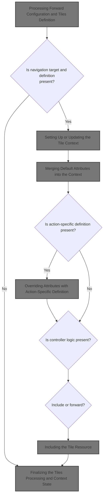

# Processing Forward Configuration and Tiles Definition

```mermaid
%%{init: {"flowchart": {"defaultRenderer": "elk"}} }%%
flowchart TD
  node1["Check if navigation target
(forwardConfig) exists"]
  click node1 openCode "tiles/src/main/java/org/apache/struts/tiles/commands/TilesPreProcessor.java:98:107"
  node1 --> node2{"Is forwardConfig and path present?"}
  click node2 openCode "tiles/src/main/java/org/apache/struts/tiles/commands/TilesPreProcessor.java:103:107"
  node2 -->|"No"| node18["End: Pass to next command"]
  click node18 openCode "tiles/src/main/java/org/apache/struts/tiles/commands/TilesPreProcessor.java:221:223"
  node2 -->|"Yes"| node3["Find Tiles Definition for path"]
  click node3 openCode "tiles/src/main/java/org/apache/struts/tiles/commands/TilesPreProcessor.java:113:115"
  node3 --> node4{"Is Tiles Definition found?"}
  click node4 openCode "tiles/src/main/java/org/apache/struts/tiles/commands/TilesPreProcessor.java:117:127"
  node4 -->|"No"| node18
  node4 -->|"Yes"| node5{"Is Tiles context present or response
committed?"}
  click node5 openCode "tiles/src/main/java/org/apache/struts/tiles/commands/TilesPreProcessor.java:135:136"
  node5 -->|"Yes"| node6["Merging Default Attributes into the Context"]
  
  node5 -->|"No"| node7["Create new Tiles context with definition
attributes"]
  click node7 openCode "tiles/src/main/java/org/apache/struts/tiles/commands/TilesPreProcessor.java:152:155"
  node6 --> node8["Set controller and URI from definition"]
  node7 --> node8
  click node8 openCode "tiles/src/main/java/org/apache/struts/tiles/commands/TilesPreProcessor.java:149:150"
  node8 --> node9{"Is there an action-specific Tiles
Definition?"}
  click node9 openCode "tiles/src/main/java/org/apache/struts/tiles/commands/TilesPreProcessor.java:167:191"
  node9 -->|"Yes"| node10["Override URI/controller/context with
action-specific definition"]
  click node10 openCode "tiles/src/main/java/org/apache/struts/tiles/commands/TilesPreProcessor.java:171:182"
  node9 -->|"No"| node11{"Does definition provide URI?"}
  node10 --> node11
  click node11 openCode "tiles/src/main/java/org/apache/struts/tiles/commands/TilesPreProcessor.java:194:197"
  node11 -->|"No"| node18
  node11 -->|"Yes"| node12{"Is controller present?"}
  click node12 openCode "tiles/src/main/java/org/apache/struts/tiles/commands/TilesPreProcessor.java:200:207"
  node12 -->|"Yes"| node13["Execute controller logic"]
  click node13 openCode "tiles/src/main/java/org/apache/struts/tiles/commands/TilesPreProcessor.java:202:207"
  node12 -->|"No"| node14{"Should include or forward? (doInclude)"}
  node13 --> node14
  click node14 openCode "tiles/src/main/java/org/apache/struts/tiles/commands/TilesPreProcessor.java:212:218"
  node14 -->|"Include"| node15["Including the Tile Resource"]
  
  node14 -->|"Forward"| node16["Forwarding Control to the Dispatcher"]
  
  node15 --> node17["Clear navigation target and finish"]
  node16 --> node17
  click node17 openCode "tiles/src/main/java/org/apache/struts/tiles/commands/TilesPreProcessor.java:221:223"
  node17 --> node18
classDef HeadingStyle fill:#777777,stroke:#333,stroke-width:2px;
click node6 goToHeading "Merging Default Attributes into the Context"
node6:::HeadingStyle
click node15 goToHeading "Including the Tile Resource"
node15:::HeadingStyle
click node16 goToHeading "Forwarding Control to the Dispatcher"
node16:::HeadingStyle

%% Swimm:
%% %%{init: {"flowchart": {"defaultRenderer": "elk"}} }%%
%% flowchart TD
%%   node1["Check if navigation target
%% (<SwmToken path="tiles/src/main/java/org/apache/struts/tiles/commands/TilesPreProcessor.java" pos="102:3:3" line-data="        ForwardConfig forwardConfig = sacontext.getForwardConfig();">`forwardConfig`</SwmToken>) exists"]
%%   click node1 openCode "<SwmPath>[tiles/…/commands/TilesPreProcessor.java](tiles/src/main/java/org/apache/struts/tiles/commands/TilesPreProcessor.java)</SwmPath>:98:107"
%%   node1 --> node2{"Is <SwmToken path="tiles/src/main/java/org/apache/struts/tiles/commands/TilesPreProcessor.java" pos="102:3:3" line-data="        ForwardConfig forwardConfig = sacontext.getForwardConfig();">`forwardConfig`</SwmToken> and path present?"}
%%   click node2 openCode "<SwmPath>[tiles/…/commands/TilesPreProcessor.java](tiles/src/main/java/org/apache/struts/tiles/commands/TilesPreProcessor.java)</SwmPath>:103:107"
%%   node2 -->|"No"| node18["End: Pass to next command"]
%%   click node18 openCode "<SwmPath>[tiles/…/commands/TilesPreProcessor.java](tiles/src/main/java/org/apache/struts/tiles/commands/TilesPreProcessor.java)</SwmPath>:221:223"
%%   node2 -->|"Yes"| node3["Find Tiles Definition for path"]
%%   click node3 openCode "<SwmPath>[tiles/…/commands/TilesPreProcessor.java](tiles/src/main/java/org/apache/struts/tiles/commands/TilesPreProcessor.java)</SwmPath>:113:115"
%%   node3 --> node4{"Is Tiles Definition found?"}
%%   click node4 openCode "<SwmPath>[tiles/…/commands/TilesPreProcessor.java](tiles/src/main/java/org/apache/struts/tiles/commands/TilesPreProcessor.java)</SwmPath>:117:127"
%%   node4 -->|"No"| node18
%%   node4 -->|"Yes"| node5{"Is Tiles context present or response
%% committed?"}
%%   click node5 openCode "<SwmPath>[tiles/…/commands/TilesPreProcessor.java](tiles/src/main/java/org/apache/struts/tiles/commands/TilesPreProcessor.java)</SwmPath>:135:136"
%%   node5 -->|"Yes"| node6["Merging Default Attributes into the Context"]
%%   
%%   node5 -->|"No"| node7["Create new Tiles context with definition
%% attributes"]
%%   click node7 openCode "<SwmPath>[tiles/…/commands/TilesPreProcessor.java](tiles/src/main/java/org/apache/struts/tiles/commands/TilesPreProcessor.java)</SwmPath>:152:155"
%%   node6 --> node8["Set controller and URI from definition"]
%%   node7 --> node8
%%   click node8 openCode "<SwmPath>[tiles/…/commands/TilesPreProcessor.java](tiles/src/main/java/org/apache/struts/tiles/commands/TilesPreProcessor.java)</SwmPath>:149:150"
%%   node8 --> node9{"Is there an action-specific Tiles
%% Definition?"}
%%   click node9 openCode "<SwmPath>[tiles/…/commands/TilesPreProcessor.java](tiles/src/main/java/org/apache/struts/tiles/commands/TilesPreProcessor.java)</SwmPath>:167:191"
%%   node9 -->|"Yes"| node10["Override URI/controller/context with
%% action-specific definition"]
%%   click node10 openCode "<SwmPath>[tiles/…/commands/TilesPreProcessor.java](tiles/src/main/java/org/apache/struts/tiles/commands/TilesPreProcessor.java)</SwmPath>:171:182"
%%   node9 -->|"No"| node11{"Does definition provide URI?"}
%%   node10 --> node11
%%   click node11 openCode "<SwmPath>[tiles/…/commands/TilesPreProcessor.java](tiles/src/main/java/org/apache/struts/tiles/commands/TilesPreProcessor.java)</SwmPath>:194:197"
%%   node11 -->|"No"| node18
%%   node11 -->|"Yes"| node12{"Is controller present?"}
%%   click node12 openCode "<SwmPath>[tiles/…/commands/TilesPreProcessor.java](tiles/src/main/java/org/apache/struts/tiles/commands/TilesPreProcessor.java)</SwmPath>:200:207"
%%   node12 -->|"Yes"| node13["Execute controller logic"]
%%   click node13 openCode "<SwmPath>[tiles/…/commands/TilesPreProcessor.java](tiles/src/main/java/org/apache/struts/tiles/commands/TilesPreProcessor.java)</SwmPath>:202:207"
%%   node12 -->|"No"| node14{"Should include or forward? (<SwmToken path="tiles/src/main/java/org/apache/struts/tiles/commands/TilesPreProcessor.java" pos="130:3:3" line-data="        boolean doInclude = false;">`doInclude`</SwmToken>)"}
%%   node13 --> node14
%%   click node14 openCode "<SwmPath>[tiles/…/commands/TilesPreProcessor.java](tiles/src/main/java/org/apache/struts/tiles/commands/TilesPreProcessor.java)</SwmPath>:212:218"
%%   node14 -->|"Include"| node15["Including the Tile Resource"]
%%   
%%   node14 -->|"Forward"| node16["Forwarding Control to the Dispatcher"]
%%   
%%   node15 --> node17["Clear navigation target and finish"]
%%   node16 --> node17
%%   click node17 openCode "<SwmPath>[tiles/…/commands/TilesPreProcessor.java](tiles/src/main/java/org/apache/struts/tiles/commands/TilesPreProcessor.java)</SwmPath>:221:223"
%%   node17 --> node18
%% classDef HeadingStyle fill:#777777,stroke:#333,stroke-width:2px;
%% click node6 goToHeading "Merging Default Attributes into the Context"
%% node6:::HeadingStyle
%% click node15 goToHeading "Including the Tile Resource"
%% node15:::HeadingStyle
%% click node16 goToHeading "Forwarding Control to the Dispatcher"
%% node16:::HeadingStyle
```

<SwmSnippet path="/tiles/src/main/java/org/apache/struts/tiles/commands/TilesPreProcessor.java" line="98">

---

In <SwmToken path="tiles/src/main/java/org/apache/struts/tiles/commands/TilesPreProcessor.java" pos="98:5:5" line-data="    public boolean execute(Context context) throws Exception {">`execute`</SwmToken>, we cast the generic Context to <SwmToken path="tiles/src/main/java/org/apache/struts/tiles/commands/TilesPreProcessor.java" pos="101:1:1" line-data="        ServletActionContext sacontext = (ServletActionContext) context;">`ServletActionContext`</SwmToken> so we can access Struts-specific request and context objects. We grab the <SwmToken path="tiles/src/main/java/org/apache/struts/tiles/commands/TilesPreProcessor.java" pos="102:1:1" line-data="        ForwardConfig forwardConfig = sacontext.getForwardConfig();">`ForwardConfig`</SwmToken> and check if it's valid. If not, we bail early. Next, we need to call <SwmToken path="tiles/src/main/java/org/apache/struts/tiles/commands/TilesPreProcessor.java" pos="101:1:1" line-data="        ServletActionContext sacontext = (ServletActionContext) context;">`ServletActionContext`</SwmToken> to get the request/context for Tiles definition lookup. This sets up the layered override logic for flexible rendering.

```java
    public boolean execute(Context context) throws Exception {

        // Is there a Tiles Definition to be processed?
        ServletActionContext sacontext = (ServletActionContext) context;
        ForwardConfig forwardConfig = sacontext.getForwardConfig();
        if (forwardConfig == null || forwardConfig.getPath() == null)
        {
            log.debug("No forwardConfig or no path, so pass to next command.");
            return (false);
        }


        ComponentDefinition definition = null;
        try
        {
            definition = TilesUtil.getDefinition(forwardConfig.getPath(),
                    sacontext.getRequest(),
```

---

</SwmSnippet>

## Accessing the HTTP Request from the Web Context

<SwmSnippet path="/core/src/main/java/org/apache/struts/chain/contexts/ServletActionContext.java" line="94">

---

<SwmToken path="core/src/main/java/org/apache/struts/chain/contexts/ServletActionContext.java" pos="94:5:5" line-data="    public HttpServletRequest getRequest() {">`getRequest`</SwmToken> just pulls the HTTP request from the underlying web context. We need this because Tiles definition lookup depends on request attributes, so we grab it here before passing it to <SwmToken path="tiles/src/main/java/org/apache/struts/tiles/commands/TilesPreProcessor.java" pos="113:5:5" line-data="            definition = TilesUtil.getDefinition(forwardConfig.getPath(),">`TilesUtil`</SwmToken>.

```java
    public HttpServletRequest getRequest() {
        return servletWebContext().getRequest();
    }
```

---

</SwmSnippet>

<SwmSnippet path="/core/src/main/java/org/apache/struts/chain/contexts/ServletActionContext.java" line="67">

---

<SwmToken path="core/src/main/java/org/apache/struts/chain/contexts/ServletActionContext.java" pos="67:5:5" line-data="    protected ServletWebContext servletWebContext() {">`servletWebContext`</SwmToken> grabs the base context and casts it to <SwmToken path="core/src/main/java/org/apache/struts/chain/contexts/ServletActionContext.java" pos="67:3:3" line-data="    protected ServletWebContext servletWebContext() {">`ServletWebContext`</SwmToken>. If the type doesn't match, you'll get a runtime exception. The code assumes the context is always set up correctly by the framework.

```java
    protected ServletWebContext servletWebContext() {
        return (ServletWebContext) this.getBaseContext();
    }
```

---

</SwmSnippet>

## Passing Context for Tiles Definition Lookup

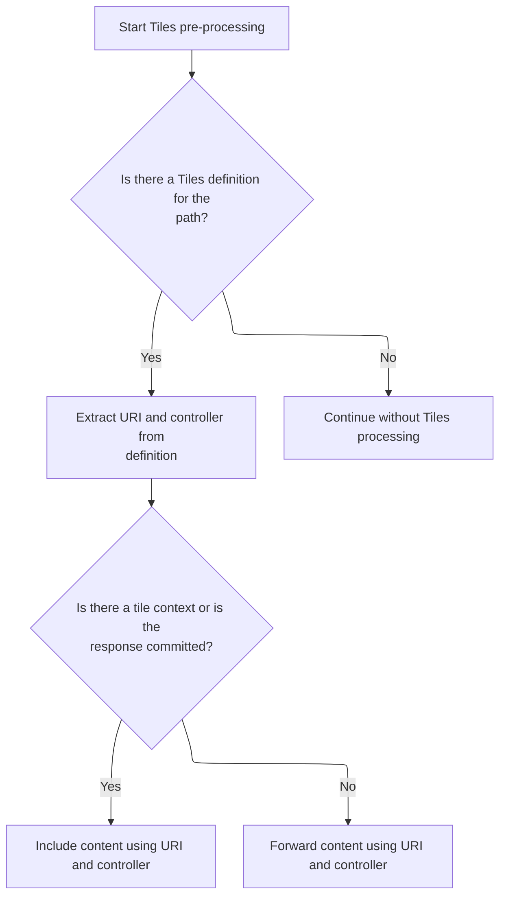

<SwmSnippet path="/tiles/src/main/java/org/apache/struts/tiles/commands/TilesPreProcessor.java" line="115">

---

Back in TilesPreProcessor.execute, after getting the request, we grab the servlet context too. Both are needed for <SwmToken path="tiles/src/main/java/org/apache/struts/tiles/commands/TilesPreProcessor.java" pos="113:5:5" line-data="            definition = TilesUtil.getDefinition(forwardConfig.getPath(),">`TilesUtil`</SwmToken> to find the right definition, since definitions can depend on either context or request scope.

```java
                    sacontext.getContext());
```

---

</SwmSnippet>

<SwmSnippet path="/core/src/main/java/org/apache/struts/chain/contexts/ServletActionContext.java" line="85">

---

<SwmToken path="core/src/main/java/org/apache/struts/chain/contexts/ServletActionContext.java" pos="85:5:5" line-data="    public ServletContext getContext() {">`getContext`</SwmToken> just fetches the servlet context from the underlying web context. <SwmToken path="tiles/src/main/java/org/apache/struts/tiles/commands/TilesPreProcessor.java" pos="113:5:5" line-data="            definition = TilesUtil.getDefinition(forwardConfig.getPath(),">`TilesUtil`</SwmToken> needs this to resolve definitions that depend on global servlet settings.

```java
    public ServletContext getContext() {
        return servletWebContext().getContext();
    }
```

---

</SwmSnippet>

<SwmSnippet path="/tiles/src/main/java/org/apache/struts/tiles/commands/TilesPreProcessor.java" line="113">

---

Back in TilesPreProcessor.execute, after getting request and context, we call <SwmToken path="tiles/src/main/java/org/apache/struts/tiles/commands/TilesPreProcessor.java" pos="113:5:5" line-data="            definition = TilesUtil.getDefinition(forwardConfig.getPath(),">`TilesUtil`</SwmToken> to fetch the definition. If the factory or definition isn't found, we log and skip Tiles processing, so the flow can continue without Tiles.

```java
            definition = TilesUtil.getDefinition(forwardConfig.getPath(),
                    sacontext.getRequest(),
                    sacontext.getContext());
        }
        catch (FactoryNotFoundException ex)
        {
            // this is not a serious error, so log at low priority
            log.debug("Tiles DefinitionFactory not found, so pass to next command.");
            return false;
        }
        catch (NoSuchDefinitionException ex)
        {
            // ignore not found
            log.debug("NoSuchDefinitionException " + ex.getMessage());
        }

```

---

</SwmSnippet>

<SwmSnippet path="/tiles/src/main/java/org/apache/struts/tiles/TilesUtil.java" line="196">

---

<SwmToken path="tiles/src/main/java/org/apache/struts/tiles/TilesUtil.java" pos="196:7:7" line-data="    public static ComponentDefinition getDefinition(">`getDefinition`</SwmToken> grabs the <SwmToken path="tiles/src/main/java/org/apache/struts/tiles/TilesUtil.java" pos="159:5:5" line-data="    public static DefinitionsFactory getDefinitionsFactory(">`DefinitionsFactory`</SwmToken> from the request/context, then tries to fetch the definition by name. It assumes the request is always an <SwmToken path="tiles/src/main/java/org/apache/struts/tiles/TilesUtil.java" pos="205:2:2" line-data="                (HttpServletRequest) request,">`HttpServletRequest`</SwmToken>, so if that's not true, you'll get a runtime error.

```java
    public static ComponentDefinition getDefinition(
        String definitionName,
        ServletRequest request,
        ServletContext servletContext)
        throws FactoryNotFoundException, DefinitionsFactoryException {

        try {
            return getDefinitionsFactory(request, servletContext).getDefinition(
                definitionName,
                (HttpServletRequest) request,
                servletContext);

        } catch (NullPointerException ex) { // Factory not found in context
            throw new FactoryNotFoundException("Can't get definitions factory from context.");
        }
    }
```

---

</SwmSnippet>

<SwmSnippet path="/tiles/src/main/java/org/apache/struts/tiles/commands/TilesPreProcessor.java" line="129">

---

Back in TilesPreProcessor.execute, after getting the definition, we check if there's a tile context or if the response is already committed. This decides if we include or forward the resource, which affects how the page is rendered.

```java
        // Do we do a forward (original behavior) or an include ?
        boolean doInclude = false;
        ComponentContext tileContext = null;

        // Get current tile context if any.
        // If context exists, or if the response has already been committed we will do an include
        tileContext = ComponentContext.getContext(sacontext.getRequest());
```

---

</SwmSnippet>

<SwmSnippet path="/tiles/src/main/java/org/apache/struts/tiles/commands/TilesPreProcessor.java" line="135">

---

Back in TilesPreProcessor.execute, we call <SwmToken path="tiles/src/main/java/org/apache/struts/tiles/commands/TilesPreProcessor.java" pos="135:5:7" line-data="        tileContext = ComponentContext.getContext(sacontext.getRequest());">`ComponentContext.getContext`</SwmToken> with the request to check for an existing tile context. If there's a JSP exception, we skip the context to avoid rendering problems.

```java
        tileContext = ComponentContext.getContext(sacontext.getRequest());
```

---

</SwmSnippet>

<SwmSnippet path="/tiles/src/main/java/org/apache/struts/tiles/ComponentContext.java" line="187">

---

<SwmToken path="tiles/src/main/java/org/apache/struts/tiles/ComponentContext.java" pos="187:7:7" line-data="    static public ComponentContext getContext(ServletRequest request) {">`getContext`</SwmToken> checks for a JSP exception attribute in the request. If it's there, we return null. Otherwise, we pull the <SwmToken path="tiles/src/main/java/org/apache/struts/tiles/ComponentContext.java" pos="187:5:5" line-data="    static public ComponentContext getContext(ServletRequest request) {">`ComponentContext`</SwmToken> from the request attributes for Tiles rendering.

```java
    static public ComponentContext getContext(ServletRequest request) {
       if (request.getAttribute("javax.servlet.jsp.jspException") != null) {
           return null;
        }        return (ComponentContext) request.getAttribute(
            ComponentConstants.COMPONENT_CONTEXT);
    }
```

---

</SwmSnippet>

<SwmSnippet path="/tiles/src/main/java/org/apache/struts/tiles/commands/TilesPreProcessor.java" line="136">

---

Back in TilesPreProcessor.execute, we set <SwmToken path="tiles/src/main/java/org/apache/struts/tiles/commands/TilesPreProcessor.java" pos="136:1:1" line-data="        doInclude = (tileContext != null || sacontext.getResponse().isCommitted());">`doInclude`</SwmToken> based on whether there's a tile context or if the response is committed. This controls if we include or forward the resource for rendering.

```java
        doInclude = (tileContext != null || sacontext.getResponse().isCommitted());

```

---

</SwmSnippet>

<SwmSnippet path="/core/src/main/java/org/apache/struts/chain/contexts/ServletActionContext.java" line="103">

---

<SwmToken path="core/src/main/java/org/apache/struts/chain/contexts/ServletActionContext.java" pos="103:5:5" line-data="    public HttpServletResponse getResponse() {">`getResponse`</SwmToken> fetches the HTTP response from the web context. We need this to check if the response is committed before deciding to include or forward.

```java
    public HttpServletResponse getResponse() {
        return servletWebContext().getResponse();
    }
```

---

</SwmSnippet>

<SwmSnippet path="/tiles/src/main/java/org/apache/struts/tiles/commands/TilesPreProcessor.java" line="138">

---

Back in TilesPreProcessor.execute, after checking response state, we grab uri and controller from the definition. These drive the rendering and controller logic for the current request.

```java
        // Controller associated to a definition, if any
        Controller controller = null;

        // Computed uri to include
        String uri = null;

        if (definition != null)
        {
            // We have a "forward config" definition.
            // We use it to complete missing attribute in context.
            // We also get uri, controller.
            uri = definition.getPath();
            controller = definition.getOrCreateController();

```

---

</SwmSnippet>

## Resolving the Controller for the Definition

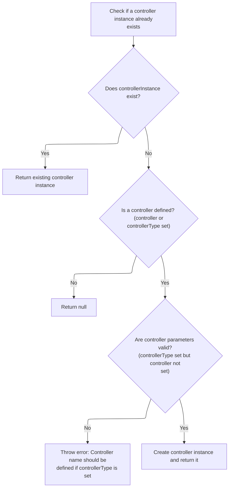

<SwmSnippet path="/tiles/src/main/java/org/apache/struts/tiles/ComponentDefinition.java" line="439">

---

<SwmToken path="tiles/src/main/java/org/apache/struts/tiles/ComponentDefinition.java" pos="439:5:5" line-data="    public Controller getOrCreateController() throws InstantiationException {">`getOrCreateController`</SwmToken> checks if there's already a controller instance. If not, it creates one using the controller name/type, so the definition can run its controller logic.

```java
    public Controller getOrCreateController() throws InstantiationException {

        if (controllerInstance != null) {
            return controllerInstance;
        }

        // Do we define a controller ?
        if (controller == null && controllerType == null) {
            return null;
        }

        // check parameters
        if (controllerType != null && controller == null) {
            throw new InstantiationException("Controller name should be defined if controllerType is set");
        }

        controllerInstance = createController(controller, controllerType);

        return controllerInstance;
    }
```

---

</SwmSnippet>

## Instantiating the Controller Based on Type

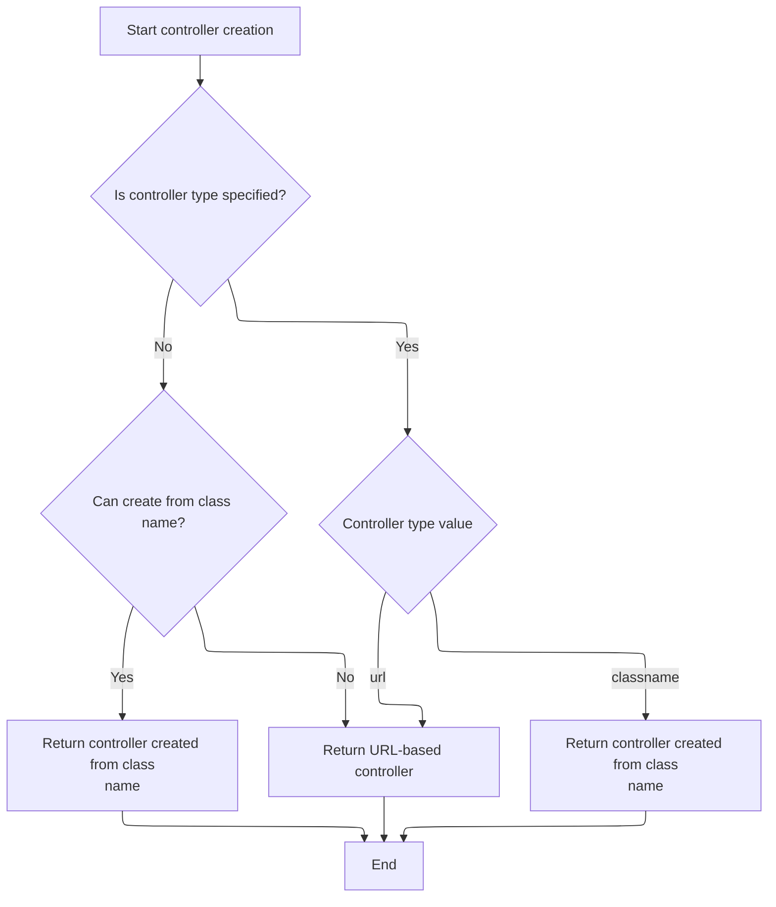

<SwmSnippet path="/tiles/src/main/java/org/apache/struts/tiles/ComponentDefinition.java" line="481">

---

<SwmToken path="tiles/src/main/java/org/apache/struts/tiles/ComponentDefinition.java" pos="481:7:7" line-data="    public static Controller createController(String name, String controllerType)">`createController`</SwmToken> tries to instantiate a controller from the name, treating it as a classname if <SwmToken path="tiles/src/main/java/org/apache/struts/tiles/ComponentDefinition.java" pos="481:16:16" line-data="    public static Controller createController(String name, String controllerType)">`controllerType`</SwmToken> is null. If that fails, it falls back to a <SwmToken path="tiles/src/main/java/org/apache/struts/tiles/ComponentDefinition.java" pos="495:7:7" line-data="                controller = new UrlController(name);">`UrlController`</SwmToken>. If <SwmToken path="tiles/src/main/java/org/apache/struts/tiles/ComponentDefinition.java" pos="481:16:16" line-data="    public static Controller createController(String name, String controllerType)">`controllerType`</SwmToken> is set, it picks the right instantiation path.

```java
    public static Controller createController(String name, String controllerType)
        throws InstantiationException {

        if (log.isDebugEnabled()) {
            log.debug("Create controller name=" + name + ", type=" + controllerType);
        }

        Controller controller = null;

        if (controllerType == null) { // first try as a classname
            try {
                return createControllerFromClassname(name);

            } catch (InstantiationException ex) { // ok, try something else
                controller = new UrlController(name);
            }

        } else if ("url".equalsIgnoreCase(controllerType)) {
            controller = new UrlController(name);

        } else if ("classname".equalsIgnoreCase(controllerType)) {
            controller = createControllerFromClassname(name);
        }

        return controller;
    }
```

---

</SwmSnippet>

## Creating Controller from Class Name

<SwmSnippet path="/tiles/src/main/java/org/apache/struts/tiles/ComponentDefinition.java" line="516">

---

In <SwmToken path="tiles/src/main/java/org/apache/struts/tiles/ComponentDefinition.java" pos="516:7:7" line-data="    public static Controller createControllerFromClassname(String classname)">`createControllerFromClassname`</SwmToken>, we use <SwmToken path="tiles/src/main/java/org/apache/struts/tiles/ComponentDefinition.java" pos="520:7:7" line-data="            Class requestedClass = RequestUtils.applicationClass(classname);">`RequestUtils`</SwmToken> to load the class and instantiate it. If anything goes wrong, we catch exceptions and wrap them for error handling. Next, we need DynaActionFormClass for instantiation logic.

```java
    public static Controller createControllerFromClassname(String classname)
        throws InstantiationException {

        try {
            Class requestedClass = RequestUtils.applicationClass(classname);
            Object instance = requestedClass.newInstance();

            if (log.isDebugEnabled()) {
                log.debug("Controller created : " + instance);
            }
            return (Controller) instance;

```

---

</SwmSnippet>

### Instantiating the Action Form Class

See <SwmLink doc-title="Creating and Initializing Dynamic Forms">[Creating and Initializing Dynamic Forms](/.swm/creating-and-initializing-dynamic-forms.tm9m3ao8.sw.md)</SwmLink>

### Handling Controller Instantiation Errors

```mermaid
%%{init: {"flowchart": {"defaultRenderer": "elk"}} }%%
flowchart TD
    node1["Try to create a controller from the
given class name"]
    click node1 openCode "tiles/src/main/java/org/apache/struts/tiles/ComponentDefinition.java:528:551"
    node1 --> node2{"Is the class found?"}
    click node2 openCode "tiles/src/main/java/org/apache/struts/tiles/ComponentDefinition.java:528:533"
    node2 -->|"No"| node3["Fail: InstantiationException - Class
not found (includes class name)"]
    click node3 openCode "tiles/src/main/java/org/apache/struts/tiles/ComponentDefinition.java:528:533"
    node2 -->|"Yes"| node4{"Is the class accessible for creation?"}
    click node4 openCode "tiles/src/main/java/org/apache/struts/tiles/ComponentDefinition.java:534:539"
    node4 -->|"No"| node5["Fail: InstantiationException - Class
access denied (includes class name)"]
    click node5 openCode "tiles/src/main/java/org/apache/struts/tiles/ComponentDefinition.java:534:539"
    node4 -->|"Yes"| node6{"Can the class be created?"}
    click node6 openCode "tiles/src/main/java/org/apache/struts/tiles/ComponentDefinition.java:540:541"
    node6 -->|"No"| node7["Fail: InstantiationException - Cannot
create controller (includes class name)"]
    click node7 openCode "tiles/src/main/java/org/apache/struts/tiles/ComponentDefinition.java:540:541"
    node6 -->|"Yes"| node8{"Is the class a valid controller type?"}
    click node8 openCode "tiles/src/main/java/org/apache/struts/tiles/ComponentDefinition.java:543:550"
    node8 -->|"No"| node9["Fail: InstantiationException - Class
must be a controller or action (includes
class name)"]
    click node9 openCode "tiles/src/main/java/org/apache/struts/tiles/ComponentDefinition.java:543:550"
    node8 -->|"Yes"| node10["Controller created"]
    click node10 openCode "tiles/src/main/java/org/apache/struts/tiles/ComponentDefinition.java:551:551"
classDef HeadingStyle fill:#777777,stroke:#333,stroke-width:2px;

%% Swimm:
%% %%{init: {"flowchart": {"defaultRenderer": "elk"}} }%%
%% flowchart TD
%%     node1["Try to create a controller from the
%% given class name"]
%%     click node1 openCode "<SwmPath>[tiles/…/tiles/ComponentDefinition.java](tiles/src/main/java/org/apache/struts/tiles/ComponentDefinition.java)</SwmPath>:528:551"
%%     node1 --> node2{"Is the class found?"}
%%     click node2 openCode "<SwmPath>[tiles/…/tiles/ComponentDefinition.java](tiles/src/main/java/org/apache/struts/tiles/ComponentDefinition.java)</SwmPath>:528:533"
%%     node2 -->|"No"| node3["Fail: <SwmToken path="tiles/src/main/java/org/apache/struts/tiles/ComponentDefinition.java" pos="439:11:11" line-data="    public Controller getOrCreateController() throws InstantiationException {">`InstantiationException`</SwmToken> - Class
%% not found (includes class name)"]
%%     click node3 openCode "<SwmPath>[tiles/…/tiles/ComponentDefinition.java](tiles/src/main/java/org/apache/struts/tiles/ComponentDefinition.java)</SwmPath>:528:533"
%%     node2 -->|"Yes"| node4{"Is the class accessible for creation?"}
%%     click node4 openCode "<SwmPath>[tiles/…/tiles/ComponentDefinition.java](tiles/src/main/java/org/apache/struts/tiles/ComponentDefinition.java)</SwmPath>:534:539"
%%     node4 -->|"No"| node5["Fail: <SwmToken path="tiles/src/main/java/org/apache/struts/tiles/ComponentDefinition.java" pos="439:11:11" line-data="    public Controller getOrCreateController() throws InstantiationException {">`InstantiationException`</SwmToken> - Class
%% access denied (includes class name)"]
%%     click node5 openCode "<SwmPath>[tiles/…/tiles/ComponentDefinition.java](tiles/src/main/java/org/apache/struts/tiles/ComponentDefinition.java)</SwmPath>:534:539"
%%     node4 -->|"Yes"| node6{"Can the class be created?"}
%%     click node6 openCode "<SwmPath>[tiles/…/tiles/ComponentDefinition.java](tiles/src/main/java/org/apache/struts/tiles/ComponentDefinition.java)</SwmPath>:540:541"
%%     node6 -->|"No"| node7["Fail: <SwmToken path="tiles/src/main/java/org/apache/struts/tiles/ComponentDefinition.java" pos="439:11:11" line-data="    public Controller getOrCreateController() throws InstantiationException {">`InstantiationException`</SwmToken> - Cannot
%% create controller (includes class name)"]
%%     click node7 openCode "<SwmPath>[tiles/…/tiles/ComponentDefinition.java](tiles/src/main/java/org/apache/struts/tiles/ComponentDefinition.java)</SwmPath>:540:541"
%%     node6 -->|"Yes"| node8{"Is the class a valid controller type?"}
%%     click node8 openCode "<SwmPath>[tiles/…/tiles/ComponentDefinition.java](tiles/src/main/java/org/apache/struts/tiles/ComponentDefinition.java)</SwmPath>:543:550"
%%     node8 -->|"No"| node9["Fail: <SwmToken path="tiles/src/main/java/org/apache/struts/tiles/ComponentDefinition.java" pos="439:11:11" line-data="    public Controller getOrCreateController() throws InstantiationException {">`InstantiationException`</SwmToken> - Class
%% must be a controller or action (includes
%% class name)"]
%%     click node9 openCode "<SwmPath>[tiles/…/tiles/ComponentDefinition.java](tiles/src/main/java/org/apache/struts/tiles/ComponentDefinition.java)</SwmPath>:543:550"
%%     node8 -->|"Yes"| node10["Controller created"]
%%     click node10 openCode "<SwmPath>[tiles/…/tiles/ComponentDefinition.java](tiles/src/main/java/org/apache/struts/tiles/ComponentDefinition.java)</SwmPath>:551:551"
%% classDef HeadingStyle fill:#777777,stroke:#333,stroke-width:2px;
```

<SwmSnippet path="/tiles/src/main/java/org/apache/struts/tiles/ComponentDefinition.java" line="528">

---

After returning from DynaActionFormClass.newInstance, if instantiation or casting fails, we throw <SwmToken path="tiles/src/main/java/org/apache/struts/tiles/ComponentDefinition.java" pos="529:1:1" line-data="        	InstantiationException e2 = new InstantiationException(">`InstantiationException`</SwmToken> with details. This ensures only valid Controller instances are used in <SwmToken path="tiles/src/main/java/org/apache/struts/tiles/commands/TilesPreProcessor.java" pos="110:1:1" line-data="        ComponentDefinition definition = null;">`ComponentDefinition`</SwmToken>.

```java
        } catch (java.lang.ClassNotFoundException ex) {
        	InstantiationException e2 = new InstantiationException(
                "Error - Class not found :" + classname);
        	e2.initCause(ex);
        	throw e2;

        } catch (java.lang.IllegalAccessException ex) {
        	InstantiationException e2 = new InstantiationException(
                "Error - Illegal class access :" + classname);
        	e2.initCause(ex);
        	throw e2;

        } catch (java.lang.InstantiationException ex) {
            throw ex;

        } catch (java.lang.ClassCastException ex) {
        	InstantiationException e2 = new InstantiationException(
                "Controller of class '"
                    + classname
                    + "' should implements 'Controller' or extends 'Action'");
        	e2.initCause(ex);
        	throw e2;
        }
    }
```

---

</SwmSnippet>

## Setting Up or Updating the Tile Context

<SwmSnippet path="/tiles/src/main/java/org/apache/struts/tiles/commands/TilesPreProcessor.java" line="152">

---

Back in TilesPreProcessor.execute, after getting the controller, we check if <SwmToken path="tiles/src/main/java/org/apache/struts/tiles/commands/TilesPreProcessor.java" pos="152:4:4" line-data="            if (tileContext == null) {">`tileContext`</SwmToken> exists. If not, we create it with definition attributes and set it in the request. Otherwise, we update it.

```java
            if (tileContext == null) {
                tileContext =
                        new ComponentContext(definition.getAttributes());
                ComponentContext.setContext(tileContext, sacontext.getRequest());

            } else {
```

---

</SwmSnippet>

<SwmSnippet path="/tiles/src/main/java/org/apache/struts/tiles/commands/TilesPreProcessor.java" line="158">

---

Back in TilesPreProcessor.execute, if <SwmToken path="tiles/src/main/java/org/apache/struts/tiles/commands/TilesPreProcessor.java" pos="158:1:1" line-data="                tileContext.addMissing(definition.getAttributes());">`tileContext`</SwmToken> already exists, we call <SwmToken path="tiles/src/main/java/org/apache/struts/tiles/commands/TilesPreProcessor.java" pos="158:3:3" line-data="                tileContext.addMissing(definition.getAttributes());">`addMissing`</SwmToken> to fill in any attributes from the definition that aren't already set.

```java
                tileContext.addMissing(definition.getAttributes());
            }
        }

```

---

</SwmSnippet>

## Merging Default Attributes into the Context

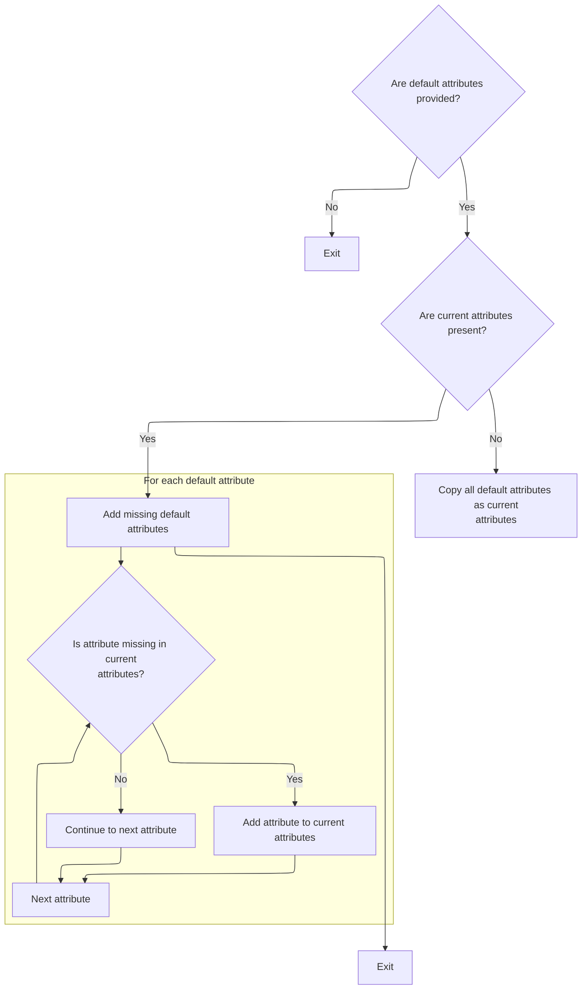

<SwmSnippet path="/tiles/src/main/java/org/apache/struts/tiles/ComponentContext.java" line="87">

---

In <SwmToken path="tiles/src/main/java/org/apache/struts/tiles/ComponentContext.java" pos="87:5:5" line-data="    public void addMissing(Map defaultAttributes) {">`addMissing`</SwmToken>, we grab the <SwmToken path="tiles/src/main/java/org/apache/struts/tiles/ComponentContext.java" pos="97:9:9" line-data="        Set entries = defaultAttributes.entrySet();">`entrySet`</SwmToken> from <SwmToken path="tiles/src/main/java/org/apache/struts/tiles/ComponentContext.java" pos="87:9:9" line-data="    public void addMissing(Map defaultAttributes) {">`defaultAttributes`</SwmToken> to iterate and merge missing keys. If <SwmToken path="tiles/src/main/java/org/apache/struts/tiles/ComponentContext.java" pos="97:9:9" line-data="        Set entries = defaultAttributes.entrySet();">`entrySet`</SwmToken> isn't supported, the merge fails, so we need to handle that.

```java
    public void addMissing(Map defaultAttributes) {
        if (defaultAttributes == null) {
            return;
        }

        if (attributes == null) {
            attributes = new HashMap(defaultAttributes);
            return;
        }

        Set entries = defaultAttributes.entrySet();
```

---

</SwmSnippet>

<SwmSnippet path="/faces/src/main/java/org/apache/struts/faces/util/MessagesMap.java" line="133">

---

<SwmToken path="faces/src/main/java/org/apache/struts/faces/util/MessagesMap.java" pos="133:5:5" line-data="    public Set entrySet() {">`entrySet`</SwmToken> in <SwmToken path="faces/src/main/java/org/apache/struts/faces/util/MessagesMap.java" pos="41:4:4" line-data="public class MessagesMap implements Map {">`MessagesMap`</SwmToken> just throws <SwmToken path="faces/src/main/java/org/apache/struts/faces/util/MessagesMap.java" pos="135:5:5" line-data="        throw new UnsupportedOperationException();">`UnsupportedOperationException`</SwmToken>. If you try to use it for merging, it'll fail, so you need to handle this case.

```java
    public Set entrySet() {

        throw new UnsupportedOperationException();

    }
```

---

</SwmSnippet>

<SwmSnippet path="/tiles/src/main/java/org/apache/struts/tiles/ComponentContext.java" line="98">

---

After returning from MessagesMap.entrySet, if the iterator can't be created, <SwmToken path="tiles/src/main/java/org/apache/struts/tiles/commands/TilesPreProcessor.java" pos="158:3:3" line-data="                tileContext.addMissing(definition.getAttributes());">`addMissing`</SwmToken> won't merge attributes. Otherwise, we loop and add any missing keys to the context.

```java
        Iterator iterator = entries.iterator();
        while (iterator.hasNext()) {
            Map.Entry entry = (Map.Entry) iterator.next();
            if (!attributes.containsKey(entry.getKey())) {
                attributes.put(entry.getKey(), entry.getValue());
            }
        }
    }
```

---

</SwmSnippet>

## Checking for Locale-Sensitive Keys in the Map

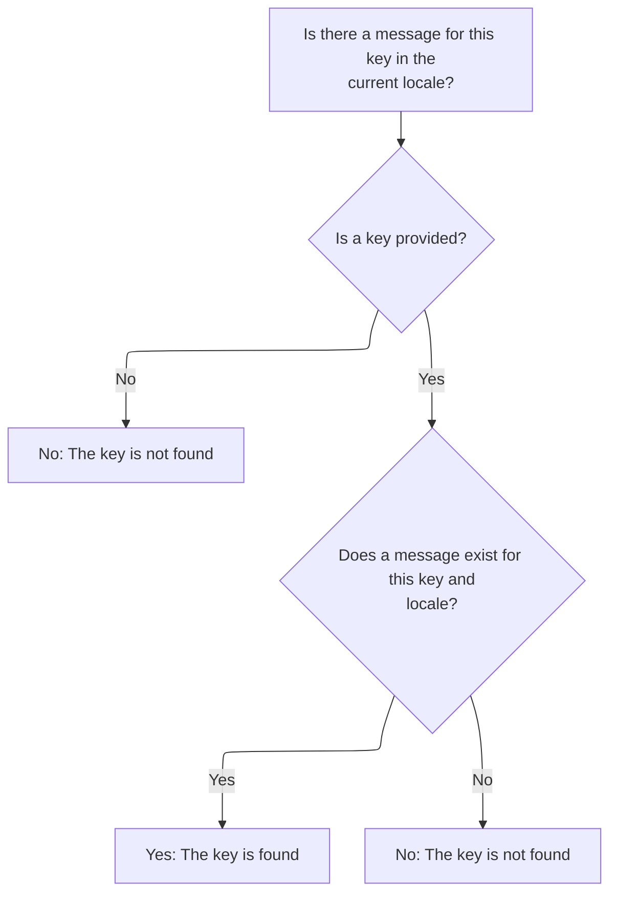

<SwmSnippet path="/faces/src/main/java/org/apache/struts/faces/util/MessagesMap.java" line="107">

---

<SwmToken path="faces/src/main/java/org/apache/struts/faces/util/MessagesMap.java" pos="107:5:5" line-data="    public boolean containsKey(Object key) {">`containsKey`</SwmToken> checks if the key is present in the map, converting it to a string and using locale-sensitive lookup. If the key is null, it returns false right away.

```java
    public boolean containsKey(Object key) {

        if (key == null) {
            return (false);
        } else {
            return (messages.isPresent(locale, key.toString()));
        }

    }
```

---

</SwmSnippet>

<SwmSnippet path="/core/src/main/java/org/apache/struts/util/MessageResources.java" line="397">

---

<SwmToken path="core/src/main/java/org/apache/struts/util/MessageResources.java" pos="397:5:5" line-data="    public boolean isPresent(Locale locale, String key) {">`isPresent`</SwmToken> checks if a message exists for the given locale and key. If the message is null or wrapped with '???', it's treated as missing. Otherwise, it's present.

```java
    public boolean isPresent(Locale locale, String key) {
        String message = getMessage(locale, key);

        if (message == null) {
            return false;
        } else if (message.startsWith("???") && message.endsWith("???")) {
            return false; // FIXME - Only valid for default implementation
        } else {
            return true;
        }
    }
```

---

</SwmSnippet>

## Overriding Attributes with Action-Specific Definition

```mermaid
%%{init: {"flowchart": {"defaultRenderer": "elk"}} }%%
flowchart TD
    node1["Start Tile preprocessing"] --> node2{"Is Tile definition present?"}
    click node1 openCode "tiles/src/main/java/org/apache/struts/tiles/commands/TilesPreProcessor.java:162:167"
    node2 -->|"Yes"| node3{"Override URI/controller?"}
    click node2 openCode "tiles/src/main/java/org/apache/struts/tiles/commands/TilesPreProcessor.java:168:191"
    node2 -->|"No"| node4["Use existing URI/controller"]
    click node4 openCode "tiles/src/main/java/org/apache/struts/tiles/commands/TilesPreProcessor.java:192:194"
    node3 -->|"Yes"| node5["Set URI/controller from definition"]
    click node5 openCode "tiles/src/main/java/org/apache/struts/tiles/commands/TilesPreProcessor.java:171:182"
    node3 -->|"No"| node6["Augment context with definition
attributes"]
    click node6 openCode "tiles/src/main/java/org/apache/struts/tiles/commands/TilesPreProcessor.java:184:190"
    node5 --> node7{"Is URI set?"}
    node6 --> node7
    node4 --> node7
    click node7 openCode "tiles/src/main/java/org/apache/struts/tiles/commands/TilesPreProcessor.java:194:197"
    node7 -->|"No"| node8["Pass to next command"]
    click node8 openCode "tiles/src/main/java/org/apache/struts/tiles/commands/TilesPreProcessor.java:194:197"
    node7 -->|"Yes"| node9{"Is controller present?"}
    click node9 openCode "tiles/src/main/java/org/apache/struts/tiles/commands/TilesPreProcessor.java:200:207"
    node9 -->|"Yes"| node10["Execute controller logic"]
    click node10 openCode "tiles/src/main/java/org/apache/struts/tiles/commands/TilesPreProcessor.java:200:207"
    node9 -->|"No"| node11["Continue"]
    node10 --> node12{"Include or Forward?"}
    node11 --> node12
    click node12 openCode "tiles/src/main/java/org/apache/struts/tiles/commands/TilesPreProcessor.java:212:216"
    node12 -->|"Include"| node13["Include request"]
    click node13 openCode "tiles/src/main/java/org/apache/struts/tiles/commands/TilesPreProcessor.java:212:214"
    node12 -->|"Forward"| node14["Forward request"]
    click node14 openCode "tiles/src/main/java/org/apache/struts/tiles/commands/TilesPreProcessor.java:215:216"

classDef HeadingStyle fill:#777777,stroke:#333,stroke-width:2px;

%% Swimm:
%% %%{init: {"flowchart": {"defaultRenderer": "elk"}} }%%
%% flowchart TD
%%     node1["Start Tile preprocessing"] --> node2{"Is Tile definition present?"}
%%     click node1 openCode "<SwmPath>[tiles/…/commands/TilesPreProcessor.java](tiles/src/main/java/org/apache/struts/tiles/commands/TilesPreProcessor.java)</SwmPath>:162:167"
%%     node2 -->|"Yes"| node3{"Override URI/controller?"}
%%     click node2 openCode "<SwmPath>[tiles/…/commands/TilesPreProcessor.java](tiles/src/main/java/org/apache/struts/tiles/commands/TilesPreProcessor.java)</SwmPath>:168:191"
%%     node2 -->|"No"| node4["Use existing URI/controller"]
%%     click node4 openCode "<SwmPath>[tiles/…/commands/TilesPreProcessor.java](tiles/src/main/java/org/apache/struts/tiles/commands/TilesPreProcessor.java)</SwmPath>:192:194"
%%     node3 -->|"Yes"| node5["Set URI/controller from definition"]
%%     click node5 openCode "<SwmPath>[tiles/…/commands/TilesPreProcessor.java](tiles/src/main/java/org/apache/struts/tiles/commands/TilesPreProcessor.java)</SwmPath>:171:182"
%%     node3 -->|"No"| node6["Augment context with definition
%% attributes"]
%%     click node6 openCode "<SwmPath>[tiles/…/commands/TilesPreProcessor.java](tiles/src/main/java/org/apache/struts/tiles/commands/TilesPreProcessor.java)</SwmPath>:184:190"
%%     node5 --> node7{"Is URI set?"}
%%     node6 --> node7
%%     node4 --> node7
%%     click node7 openCode "<SwmPath>[tiles/…/commands/TilesPreProcessor.java](tiles/src/main/java/org/apache/struts/tiles/commands/TilesPreProcessor.java)</SwmPath>:194:197"
%%     node7 -->|"No"| node8["Pass to next command"]
%%     click node8 openCode "<SwmPath>[tiles/…/commands/TilesPreProcessor.java](tiles/src/main/java/org/apache/struts/tiles/commands/TilesPreProcessor.java)</SwmPath>:194:197"
%%     node7 -->|"Yes"| node9{"Is controller present?"}
%%     click node9 openCode "<SwmPath>[tiles/…/commands/TilesPreProcessor.java](tiles/src/main/java/org/apache/struts/tiles/commands/TilesPreProcessor.java)</SwmPath>:200:207"
%%     node9 -->|"Yes"| node10["Execute controller logic"]
%%     click node10 openCode "<SwmPath>[tiles/…/commands/TilesPreProcessor.java](tiles/src/main/java/org/apache/struts/tiles/commands/TilesPreProcessor.java)</SwmPath>:200:207"
%%     node9 -->|"No"| node11["Continue"]
%%     node10 --> node12{"Include or Forward?"}
%%     node11 --> node12
%%     click node12 openCode "<SwmPath>[tiles/…/commands/TilesPreProcessor.java](tiles/src/main/java/org/apache/struts/tiles/commands/TilesPreProcessor.java)</SwmPath>:212:216"
%%     node12 -->|"Include"| node13["Include request"]
%%     click node13 openCode "<SwmPath>[tiles/…/commands/TilesPreProcessor.java](tiles/src/main/java/org/apache/struts/tiles/commands/TilesPreProcessor.java)</SwmPath>:212:214"
%%     node12 -->|"Forward"| node14["Forward request"]
%%     click node14 openCode "<SwmPath>[tiles/…/commands/TilesPreProcessor.java](tiles/src/main/java/org/apache/struts/tiles/commands/TilesPreProcessor.java)</SwmPath>:215:216"
%% 
%% classDef HeadingStyle fill:#777777,stroke:#333,stroke-width:2px;
```

<SwmSnippet path="/tiles/src/main/java/org/apache/struts/tiles/commands/TilesPreProcessor.java" line="162">

---

Back in TilesPreProcessor.execute, after merging attributes, we fetch the action-specific definition. This lets us override uri and controller if needed for the current action.

```java
        // Process definition set in Action, if any.  This may override the
        // values for uri or controller found using the ForwardConfig, and
        // may augment the tileContext with additional attributes.
        // :FIXME: the class DefinitionsUtil is deprecated, but I can't find
        // the intended alternative to use.
        definition = DefinitionsUtil.getActionDefinition(sacontext.getRequest());
```

---

</SwmSnippet>

<SwmSnippet path="/tiles/src/main/java/org/apache/struts/tiles/commands/TilesPreProcessor.java" line="168">

---

Back in TilesPreProcessor.execute, if the action definition is present, we override uri and controller with its values. This lets the action take priority over the forward config.

```java
        if (definition != null) { // We have a definition.
                // We use it to complete missing attribute in context.
                // We also overload uri and controller if set in definition.
                if (definition.getPath() != null) {
                    log.debug("Override forward uri "
                              + uri
                              + " with action uri "
                              + definition.getPath());
                        uri = definition.getPath();
                }

                if (definition.getOrCreateController() != null) {
                    log.debug("Override forward controller with action controller");
                        controller = definition.getOrCreateController();
                }

```

---

</SwmSnippet>

<SwmSnippet path="/tiles/src/main/java/org/apache/struts/tiles/commands/TilesPreProcessor.java" line="184">

---

Back in TilesPreProcessor.execute, after overriding uri/controller, we recreate or update <SwmToken path="tiles/src/main/java/org/apache/struts/tiles/commands/TilesPreProcessor.java" pos="184:4:4" line-data="                if (tileContext == null) {">`tileContext`</SwmToken> with the action definition's attributes to keep everything in sync.

```java
                if (tileContext == null) {
                        tileContext =
                                new ComponentContext(definition.getAttributes());
                        ComponentContext.setContext(tileContext, sacontext.getRequest());
                } else {
```

---

</SwmSnippet>

<SwmSnippet path="/tiles/src/main/java/org/apache/struts/tiles/commands/TilesPreProcessor.java" line="189">

---

Back in TilesPreProcessor.execute, after updating <SwmToken path="tiles/src/main/java/org/apache/struts/tiles/commands/TilesPreProcessor.java" pos="189:1:1" line-data="                        tileContext.addMissing(definition.getAttributes());">`tileContext`</SwmToken>, we call <SwmToken path="tiles/src/main/java/org/apache/struts/tiles/commands/TilesPreProcessor.java" pos="189:3:3" line-data="                        tileContext.addMissing(definition.getAttributes());">`addMissing`</SwmToken> again with the action definition's attributes. This keeps the context fully up-to-date for rendering.

```java
                        tileContext.addMissing(definition.getAttributes());
                }
        }


        if (uri == null) {
            log.debug("no uri computed, so pass to next command");
            return false;
        }

```

---

</SwmSnippet>

<SwmSnippet path="/tiles/src/main/java/org/apache/struts/tiles/commands/TilesPreProcessor.java" line="199">

---

Here, TilesPreProcessor.execute checks if a controller is attached to the definition. If so, it runs the controller, passing in the tile context, request, response, and servlet context. This lets the controller do custom processing before the tile is rendered.

```java
        // Execute controller associated to definition, if any.
        if (controller != null) {
            log.trace("Execute controller: " + controller);
            controller.execute(
                    tileContext,
                    sacontext.getRequest(),
```

---

</SwmSnippet>

<SwmSnippet path="/tiles/src/main/java/org/apache/struts/tiles/commands/TilesPreProcessor.java" line="205">

---

Next, TilesPreProcessor.execute grabs the response from the context and passes it to the controller. This gives the controller a chance to change the response before rendering.

```java
                    sacontext.getResponse(),
```

---

</SwmSnippet>

<SwmSnippet path="/tiles/src/main/java/org/apache/struts/tiles/commands/TilesPreProcessor.java" line="206">

---

Finally, TilesPreProcessor.execute passes the servlet context to the controller. This lets the controller access global resources or settings if it needs to.

```java
                    sacontext.getContext());
        }

```

---

</SwmSnippet>

<SwmSnippet path="/tiles/src/main/java/org/apache/struts/tiles/commands/TilesPreProcessor.java" line="209">

---

Back in TilesPreProcessor.execute, if <SwmToken path="tiles/src/main/java/org/apache/struts/tiles/commands/TilesPreProcessor.java" pos="212:4:4" line-data="        if (doInclude) {">`doInclude`</SwmToken> is set, we call <SwmToken path="tiles/src/main/java/org/apache/struts/tiles/commands/TilesPreProcessor.java" pos="212:4:4" line-data="        if (doInclude) {">`doInclude`</SwmToken> to insert the resource into the current request. This keeps the tile context intact and lets us nest actions inside tiles.

```java
        // If request comes from a previous Tile, do an include.
        // This allows to insert an action in a Tile.

        if (doInclude) {
            log.info("Tiles process complete; doInclude with " + uri);
            doInclude(sacontext, uri);
        } else {
            log.info("Tiles process complete; forward to " + uri);
```

---

</SwmSnippet>

## Including the Tile Resource

<SwmSnippet path="/tiles/src/main/java/org/apache/struts/tiles/commands/TilesPreProcessor.java" line="234">

---

In <SwmToken path="tiles/src/main/java/org/apache/struts/tiles/commands/TilesPreProcessor.java" pos="234:5:5" line-data="    protected void doInclude(">`doInclude`</SwmToken>, we prep for including the tile resource by getting a dispatcher for the target URI. We need <SwmToken path="tiles/src/main/java/org/apache/struts/tiles/commands/TilesPreProcessor.java" pos="239:7:7" line-data="        RequestDispatcher rd = getRequiredDispatcher(context, uri);">`getRequiredDispatcher`</SwmToken> next to actually fetch the dispatcher that will handle the include.

```java
    protected void doInclude(
        ServletActionContext context,
        String uri)
        throws IOException, ServletException {

        RequestDispatcher rd = getRequiredDispatcher(context, uri);

```

---

</SwmSnippet>

### Fetching the Dispatcher for Inclusion

<SwmSnippet path="/tiles/src/main/java/org/apache/struts/tiles/commands/TilesPreProcessor.java" line="273">

---

In <SwmToken path="tiles/src/main/java/org/apache/struts/tiles/commands/TilesPreProcessor.java" pos="273:5:5" line-data="    private RequestDispatcher getRequiredDispatcher(ServletActionContext context, String uri) throws IOException {">`getRequiredDispatcher`</SwmToken>, we ask the servlet context for a dispatcher tied to the URI. We need to call <SwmToken path="tiles/src/main/java/org/apache/struts/tiles/commands/TilesPreProcessor.java" pos="273:7:7" line-data="    private RequestDispatcher getRequiredDispatcher(ServletActionContext context, String uri) throws IOException {">`ServletActionContext`</SwmToken> to access the servlet context and get the dispatcher.

```java
    private RequestDispatcher getRequiredDispatcher(ServletActionContext context, String uri) throws IOException {
        RequestDispatcher rd = context.getContext().getRequestDispatcher(uri);
```

---

</SwmSnippet>

<SwmSnippet path="/tiles/src/main/java/org/apache/struts/tiles/commands/TilesPreProcessor.java" line="275">

---

If <SwmToken path="tiles/src/main/java/org/apache/struts/tiles/commands/TilesPreProcessor.java" pos="239:7:7" line-data="        RequestDispatcher rd = getRequiredDispatcher(context, uri);">`getRequiredDispatcher`</SwmToken> can't find a dispatcher for the URI, it sends an HTTP 500 error using the response from the context. Otherwise, it returns the dispatcher for inclusion.

```java
        if (rd == null) {
            log.debug("No request dispatcher found for " + uri);
            HttpServletResponse response = context.getResponse();
            response.sendError(
                HttpServletResponse.SC_INTERNAL_SERVER_ERROR,
                "Error getting RequestDispatcher for " + uri);
        }
        return rd;
    }
```

---

</SwmSnippet>

### Including the Resource in the Response

<SwmSnippet path="/tiles/src/main/java/org/apache/struts/tiles/commands/TilesPreProcessor.java" line="241">

---

After getting the dispatcher, <SwmToken path="tiles/src/main/java/org/apache/struts/tiles/commands/TilesPreProcessor.java" pos="130:3:3" line-data="        boolean doInclude = false;">`doInclude`</SwmToken> calls include on it, passing the request and response from the context. This inserts the resource's output into the current response.

```java
        if (rd != null) {
            rd.include(context.getRequest(), context.getResponse());
```

---

</SwmSnippet>

<SwmSnippet path="/tiles/src/main/java/org/apache/struts/tiles/commands/TilesPreProcessor.java" line="242">

---

DoInclude finishes after the include call. If the dispatcher is present, the resource is inserted; otherwise, nothing happens and the request moves on.

```java
            rd.include(context.getRequest(), context.getResponse());
        }
    }
```

---

</SwmSnippet>

## Forwarding the Tile Resource

<SwmSnippet path="/tiles/src/main/java/org/apache/struts/tiles/commands/TilesPreProcessor.java" line="217">

---

Back in TilesPreProcessor.execute, if <SwmToken path="tiles/src/main/java/org/apache/struts/tiles/commands/TilesPreProcessor.java" pos="130:3:3" line-data="        boolean doInclude = false;">`doInclude`</SwmToken> isn't set, we call <SwmToken path="tiles/src/main/java/org/apache/struts/tiles/commands/TilesPreProcessor.java" pos="217:1:1" line-data="            doForward(sacontext, uri);">`doForward`</SwmToken> to transfer control to the target URI. This ends the current request and starts a new one for the forwarded resource.

```java
            doForward(sacontext, uri);
        }

        log.debug("Tiles processed, so clearing forward config from context.");
```

---

</SwmSnippet>

## Forwarding Control to the Dispatcher

<SwmSnippet path="/tiles/src/main/java/org/apache/struts/tiles/commands/TilesPreProcessor.java" line="252">

---

In <SwmToken path="tiles/src/main/java/org/apache/struts/tiles/commands/TilesPreProcessor.java" pos="252:5:5" line-data="    protected void doForward(">`doForward`</SwmToken>, we prep for forwarding by getting a dispatcher for the target URI. We need <SwmToken path="tiles/src/main/java/org/apache/struts/tiles/commands/TilesPreProcessor.java" pos="257:7:7" line-data="        RequestDispatcher rd = getRequiredDispatcher(context, uri);">`getRequiredDispatcher`</SwmToken> next to fetch the dispatcher that will handle the forward.

```java
    protected void doForward(
        ServletActionContext context,
        String uri)
        throws IOException, ServletException {

        RequestDispatcher rd = getRequiredDispatcher(context, uri);

```

---

</SwmSnippet>

<SwmSnippet path="/tiles/src/main/java/org/apache/struts/tiles/commands/TilesPreProcessor.java" line="259">

---

After getting the dispatcher, <SwmToken path="tiles/src/main/java/org/apache/struts/tiles/commands/TilesPreProcessor.java" pos="217:1:1" line-data="            doForward(sacontext, uri);">`doForward`</SwmToken> calls forward on it, passing the request and response from the context. This hands off control to the new resource.

```java
        if (rd != null) {
            rd.forward(context.getRequest(), context.getResponse());
```

---

</SwmSnippet>

<SwmSnippet path="/tiles/src/main/java/org/apache/struts/tiles/commands/TilesPreProcessor.java" line="260">

---

DoForward finishes after the forward call. If the dispatcher is present, control is handed off; otherwise, nothing happens and the request moves on.

```java
            rd.forward(context.getRequest(), context.getResponse());
```

---

</SwmSnippet>

<SwmSnippet path="/tiles/src/main/java/org/apache/struts/tiles/commands/TilesPreProcessor.java" line="260">

---

After <SwmToken path="tiles/src/main/java/org/apache/struts/tiles/commands/TilesPreProcessor.java" pos="217:1:1" line-data="            doForward(sacontext, uri);">`doForward`</SwmToken> finishes, we call AbstractBacking.forward to update the <SwmToken path="apps/faces-example1/src/main/java/org/apache/struts/webapp/example/AbstractBacking.java" pos="66:7:7" line-data="    protected void forward(FacesContext context, String url) {">`FacesContext`</SwmToken> and mark the response as complete. This signals JSF that the request is done.

```java
            rd.forward(context.getRequest(), context.getResponse());
        }
    }
```

---

</SwmSnippet>

## Completing the JSF Response

<SwmSnippet path="/apps/faces-example1/src/main/java/org/apache/struts/webapp/example/AbstractBacking.java" line="66">

---

<SwmToken path="apps/faces-example1/src/main/java/org/apache/struts/webapp/example/AbstractBacking.java" pos="66:5:5" line-data="    protected void forward(FacesContext context, String url) {">`forward`</SwmToken> in <SwmToken path="apps/faces-example1/src/main/java/org/apache/struts/webapp/example/AbstractBacking.java" pos="35:4:4" line-data="abstract class AbstractBacking {">`AbstractBacking`</SwmToken> uses the <SwmToken path="apps/faces-example1/src/main/java/org/apache/struts/webapp/example/AbstractBacking.java" pos="66:7:7" line-data="    protected void forward(FacesContext context, String url) {">`FacesContext`</SwmToken> to dispatch the request to the given URL, handles exceptions, and marks the response as complete. We need to call <SwmToken path="extras/src/main/java/org/apache/struts/actions/ActionDispatcher.java" pos="56:5:5" line-data=" *       protected ActionDispatcher dispatcher">`ActionDispatcher`</SwmToken> next to actually execute the action logic tied to the dispatched URL.

```java
    protected void forward(FacesContext context, String url) {

        try {
            context.getExternalContext().dispatch(url);
        } catch (IOException e) {
            throw new FacesException(e);
        } finally {
            context.responseComplete();
        }

    }
```

---

</SwmSnippet>

## Dispatching the Action Logic

<SwmSnippet path="/extras/src/main/java/org/apache/struts/actions/ActionDispatcher.java" line="507">

---

In <SwmToken path="extras/src/main/java/org/apache/struts/actions/ActionDispatcher.java" pos="507:5:5" line-data="    public Object dispatch(ActionContext context) throws Exception {">`dispatch`</SwmToken>, we cast the context to <SwmToken path="extras/src/main/java/org/apache/struts/actions/ActionDispatcher.java" pos="508:1:1" line-data="        ServletActionContext servletContext = (ServletActionContext) context;">`ServletActionContext`</SwmToken> and call execute with the action mapping, form, request, and response. We need <SwmToken path="extras/src/main/java/org/apache/struts/actions/ActionDispatcher.java" pos="508:1:1" line-data="        ServletActionContext servletContext = (ServletActionContext) context;">`ServletActionContext`</SwmToken> to get the right request and response objects for action execution.

```java
    public Object dispatch(ActionContext context) throws Exception {
        ServletActionContext servletContext = (ServletActionContext) context;
        return execute((ActionMapping) context.getActionConfig(), context.getActionForm(),
            servletContext.getRequest(), servletContext.getResponse());
```

---

</SwmSnippet>

<SwmSnippet path="/extras/src/main/java/org/apache/struts/actions/ActionDispatcher.java" line="509">

---

After casting the context, <SwmToken path="extras/src/main/java/org/apache/struts/actions/ActionDispatcher.java" pos="56:5:5" line-data=" *       protected ActionDispatcher dispatcher">`ActionDispatcher`</SwmToken> calls execute with the servlet request and response. This makes sure the action logic runs with the right objects.

```java
        return execute((ActionMapping) context.getActionConfig(), context.getActionForm(),
            servletContext.getRequest(), servletContext.getResponse());
```

---

</SwmSnippet>

<SwmSnippet path="/extras/src/main/java/org/apache/struts/actions/ActionDispatcher.java" line="509">

---

<SwmToken path="extras/src/main/java/org/apache/struts/actions/ActionDispatcher.java" pos="56:5:5" line-data=" *       protected ActionDispatcher dispatcher">`ActionDispatcher`</SwmToken> finishes dispatch by returning the result of execute, which is an <SwmToken path="extras/src/main/java/org/apache/struts/actions/ActionDispatcher.java" pos="197:3:3" line-data="    public ActionForward execute(ActionMapping mapping, ActionForm form,">`ActionForward`</SwmToken>. This tells Struts what to do next.

```java
        return execute((ActionMapping) context.getActionConfig(), context.getActionForm(),
            servletContext.getRequest(), servletContext.getResponse());
    }
```

---

</SwmSnippet>

## Executing the Action Mapping

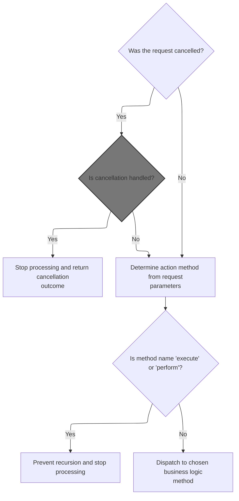

<SwmSnippet path="/extras/src/main/java/org/apache/struts/actions/ActionDispatcher.java" line="197">

---

In <SwmToken path="extras/src/main/java/org/apache/struts/actions/ActionDispatcher.java" pos="197:5:5" line-data="    public ActionForward execute(ActionMapping mapping, ActionForm form,">`execute`</SwmToken>, we check if the request is cancelled and handle it if so. If not, we continue with normal action processing. We need to call cancelled next to handle the special case where the user cancels the action.

```java
    public ActionForward execute(ActionMapping mapping, ActionForm form,
        HttpServletRequest request, HttpServletResponse response)
        throws Exception {
        // Process "cancelled"
        if (isCancelled(request)) {
            ActionForward af = cancelled(mapping, form, request, response);

            if (af != null) {
                return af;
            }
        }

```

---

</SwmSnippet>

### Handling Cancelled Actions

<SwmSnippet path="/extras/src/main/java/org/apache/struts/actions/ActionDispatcher.java" line="282">

---

<SwmToken path="extras/src/main/java/org/apache/struts/actions/ActionDispatcher.java" pos="282:5:5" line-data="    protected ActionForward cancelled(ActionMapping mapping, ActionForm form,">`cancelled`</SwmToken> in <SwmToken path="extras/src/main/java/org/apache/struts/actions/ActionDispatcher.java" pos="56:5:5" line-data=" *       protected ActionDispatcher dispatcher">`ActionDispatcher`</SwmToken> looks for a method named 'cancelled' to handle the cancelled action. If found, it dispatches to that method; otherwise, it returns null. We need to call <SwmToken path="extras/src/main/java/org/apache/struts/actions/ActionDispatcher.java" pos="290:5:5" line-data="            method = getMethod(name);">`getMethod`</SwmToken> next to actually find the method to dispatch.

```java
    protected ActionForward cancelled(ActionMapping mapping, ActionForm form,
        HttpServletRequest request, HttpServletResponse response)
        throws Exception {
        // Identify if there is an "cancelled" method to be dispatched to
        String name = "cancelled";
        Method method = null;

        try {
            method = getMethod(name);
        } catch (NoSuchMethodException e) {
            return null;
        }

        return dispatchMethod(mapping, form, request, response, name, method);
    }
```

---

</SwmSnippet>

### Resolving the Cancelled Method

<SwmSnippet path="/extras/src/main/java/org/apache/struts/actions/ActionDispatcher.java" line="410">

---

<SwmToken path="extras/src/main/java/org/apache/struts/actions/ActionDispatcher.java" pos="410:5:5" line-data="    protected Method getMethod(String name)">`getMethod`</SwmToken> in <SwmToken path="extras/src/main/java/org/apache/struts/actions/ActionDispatcher.java" pos="56:5:5" line-data=" *       protected ActionDispatcher dispatcher">`ActionDispatcher`</SwmToken> checks the cache for the method by name. If not found, it uses reflection to get the method and stores it. We need <SwmToken path="core/src/main/java/org/apache/struts/dispatcher/AbstractDispatcher.java" pos="43:6:6" line-data="public abstract class AbstractDispatcher implements Dispatcher, Serializable {">`AbstractDispatcher`</SwmToken> next for more advanced method resolution.

```java
    protected Method getMethod(String name)
        throws NoSuchMethodException {
        synchronized (methods) {
            Method method = (Method) methods.get(name);

            if (method == null) {
                method = clazz.getMethod(name, types);
                methods.put(name, method);
            }

            return (method);
        }
    }
```

---

</SwmSnippet>

### Advanced Method Lookup

<SwmSnippet path="/core/src/main/java/org/apache/struts/dispatcher/AbstractDispatcher.java" line="203">

---

<SwmToken path="core/src/main/java/org/apache/struts/dispatcher/AbstractDispatcher.java" pos="203:7:7" line-data="    protected final Method getMethod(ActionContext context, String methodName) throws NoSuchMethodException {">`getMethod`</SwmToken> in <SwmToken path="core/src/main/java/org/apache/struts/dispatcher/AbstractDispatcher.java" pos="43:6:6" line-data="public abstract class AbstractDispatcher implements Dispatcher, Serializable {">`AbstractDispatcher`</SwmToken> builds a cache key from the action class and method name, checks the cache, and resolves the method if needed. We call <SwmToken path="core/src/main/java/org/apache/struts/dispatcher/AbstractDispatcher.java" pos="215:5:5" line-data="                method = resolveMethod(context, methodName);">`resolveMethod`</SwmToken> next to actually find the method if it's not cached.

```java
    protected final Method getMethod(ActionContext context, String methodName) throws NoSuchMethodException {
        synchronized (methods) {
            // Key the method based on the class-method combination
            StringBuffer keyBuf = new StringBuffer(100);
            keyBuf.append(context.getAction().getClass().getName());
            keyBuf.append(":");
            keyBuf.append(methodName);
            String key = keyBuf.toString();

            Method method = (Method) methods.get(key);

            if (method == null) {
                method = resolveMethod(context, methodName);
                methods.put(key, method);
            }

            return method;
        }
    }
```

---

</SwmSnippet>

### Resolving the Action Method

<SwmSnippet path="/core/src/main/java/org/apache/struts/dispatcher/AbstractDispatcher.java" line="288">

---

<SwmToken path="core/src/main/java/org/apache/struts/dispatcher/AbstractDispatcher.java" pos="288:3:3" line-data="    Method resolveMethod(ActionContext context, String methodName) throws NoSuchMethodException {">`resolveMethod`</SwmToken> in <SwmToken path="core/src/main/java/org/apache/struts/dispatcher/AbstractDispatcher.java" pos="43:6:6" line-data="public abstract class AbstractDispatcher implements Dispatcher, Serializable {">`AbstractDispatcher`</SwmToken> delegates to the <SwmToken path="core/src/main/java/org/apache/struts/dispatcher/AbstractDispatcher.java" pos="289:3:3" line-data="        return methodResolver.resolveMethod(context, methodName);">`methodResolver`</SwmToken> to find the method. We need <SwmToken path="core/src/main/java/org/apache/struts/dispatcher/servlet/ServletMethodResolver.java" pos="49:4:4" line-data="public class ServletMethodResolver extends AbstractMethodResolver {">`ServletMethodResolver`</SwmToken> next for servlet-specific method resolution logic.

```java
    Method resolveMethod(ActionContext context, String methodName) throws NoSuchMethodException {
        return methodResolver.resolveMethod(context, methodName);
    }
```

---

</SwmSnippet>

### Multi-Strategy Method Resolution

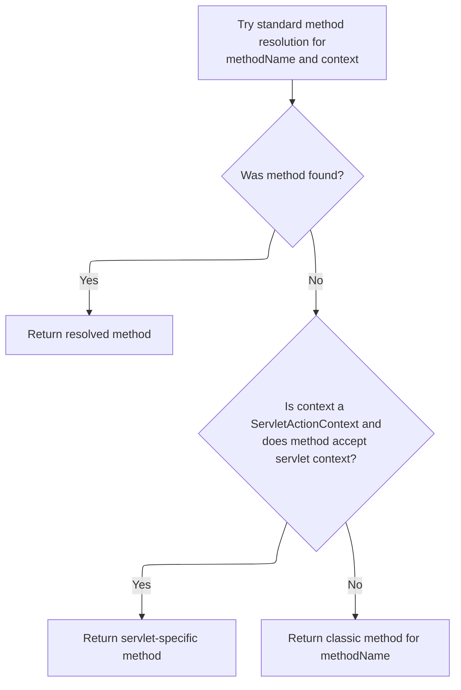

<SwmSnippet path="/core/src/main/java/org/apache/struts/dispatcher/servlet/ServletMethodResolver.java" line="110">

---

In <SwmToken path="core/src/main/java/org/apache/struts/dispatcher/servlet/ServletMethodResolver.java" pos="110:5:5" line-data="    public Method resolveMethod(ActionContext context, String methodName) throws NoSuchMethodException {">`resolveMethod`</SwmToken>, <SwmToken path="core/src/main/java/org/apache/struts/dispatcher/servlet/ServletMethodResolver.java" pos="49:4:4" line-data="public class ServletMethodResolver extends AbstractMethodResolver {">`ServletMethodResolver`</SwmToken> first tries the superclass's method resolution. If that fails, it checks for a method that takes <SwmToken path="tiles/src/main/java/org/apache/struts/tiles/commands/TilesPreProcessor.java" pos="101:1:1" line-data="        ServletActionContext sacontext = (ServletActionContext) context;">`ServletActionContext`</SwmToken>. If both fail, it falls back to classic method resolution. This covers more cases than a simple name lookup.

```java
    public Method resolveMethod(ActionContext context, String methodName) throws NoSuchMethodException {
        // First try to resolve anything the superclass supports
        try {
            return super.resolveMethod(context, methodName);
        } catch (NoSuchMethodException e) {
            // continue
        }

```

---

</SwmSnippet>

<SwmSnippet path="/core/src/main/java/org/apache/struts/dispatcher/servlet/ServletMethodResolver.java" line="118">

---

<SwmToken path="core/src/main/java/org/apache/struts/dispatcher/servlet/ServletMethodResolver.java" pos="49:4:4" line-data="public class ServletMethodResolver extends AbstractMethodResolver {">`ServletMethodResolver`</SwmToken> checks if the action has a method that takes <SwmToken path="core/src/main/java/org/apache/struts/dispatcher/servlet/ServletMethodResolver.java" pos="119:8:8" line-data="        if (context instanceof ServletActionContext) {">`ServletActionContext`</SwmToken>. If not, it keeps looking. This lets actions handle requests with more context if needed.

```java
        // Can the method accept the servlet action context?
        if (context instanceof ServletActionContext) {
            try {
                Class actionClass = context.getAction().getClass();
                return actionClass.getMethod(methodName, new Class[] { ServletActionContext.class });
            } catch (NoSuchMethodException e) {
                // continue
            }
        }

```

---

</SwmSnippet>

<SwmSnippet path="/core/src/main/java/org/apache/struts/dispatcher/servlet/ServletMethodResolver.java" line="128">

---

If neither the superclass nor ServletActionContext-specific method is found, <SwmToken path="core/src/main/java/org/apache/struts/dispatcher/servlet/ServletMethodResolver.java" pos="49:4:4" line-data="public class ServletMethodResolver extends AbstractMethodResolver {">`ServletMethodResolver`</SwmToken> falls back to classic method resolution. This keeps older action methods working.

```java
        // Lastly, try the classical argument listing
        return resolveClassicMethod(context, methodName);
    }
```

---

</SwmSnippet>

<SwmSnippet path="/core/src/main/java/org/apache/struts/dispatcher/servlet/ServletMethodResolver.java" line="105">

---

<SwmToken path="core/src/main/java/org/apache/struts/dispatcher/servlet/ServletMethodResolver.java" pos="105:7:7" line-data="    protected final Method resolveClassicMethod(ActionContext context, String methodName) throws NoSuchMethodException {">`resolveClassicMethod`</SwmToken> in <SwmToken path="core/src/main/java/org/apache/struts/dispatcher/servlet/ServletMethodResolver.java" pos="49:4:4" line-data="public class ServletMethodResolver extends AbstractMethodResolver {">`ServletMethodResolver`</SwmToken> grabs the method from the action class using the classic signature. We need <SwmToken path="core/src/main/java/org/apache/struts/dispatcher/AbstractDispatcher.java" pos="43:6:6" line-data="public abstract class AbstractDispatcher implements Dispatcher, Serializable {">`AbstractDispatcher`</SwmToken> next to continue with the resolved method for dispatch.

```java
    protected final Method resolveClassicMethod(ActionContext context, String methodName) throws NoSuchMethodException {
        Class actionClass = context.getAction().getClass();
        return actionClass.getMethod(methodName, CLASSIC_EXECUTE_SIGNATURE);
    }
```

---

</SwmSnippet>

### Resolving the Method Parameter for Dispatch

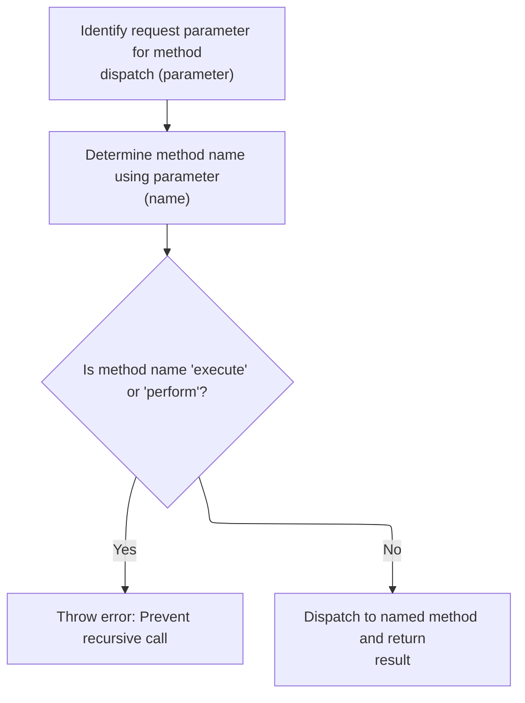

<SwmSnippet path="/extras/src/main/java/org/apache/struts/actions/ActionDispatcher.java" line="209">

---

Here we just returned from ActionDispatcher.cancelled, and now we're grabbing the method parameter using <SwmToken path="extras/src/main/java/org/apache/struts/actions/ActionDispatcher.java" pos="210:7:7" line-data="        String parameter = getParameter(mapping, form, request, response);">`getParameter`</SwmToken>. This is needed so we know which action method to dispatch next. The value comes from mapping, form, request, or response, and controls which logic gets executed.

```java
        // Identify the request parameter containing the method name
        String parameter = getParameter(mapping, form, request, response);

```

---

</SwmSnippet>

<SwmSnippet path="/extras/src/main/java/org/apache/struts/actions/ActionDispatcher.java" line="435">

---

GetParameter figures out which method to dispatch by checking <SwmToken path="extras/src/main/java/org/apache/struts/actions/ActionDispatcher.java" pos="438:7:11" line-data="        String parameter = mapping.getParameter();">`mapping.getParameter()`</SwmToken>, then uses the flavor variable to decide what to do if it's missing. <SwmToken path="extras/src/main/java/org/apache/struts/actions/ActionDispatcher.java" pos="444:19:19" line-data="        if ((parameter == null) &amp;&amp; (flavor == DEFAULT_FLAVOR)) {">`DEFAULT_FLAVOR`</SwmToken> returns 'method', <SwmToken path="extras/src/main/java/org/apache/struts/actions/ActionDispatcher.java" pos="450:9:9" line-data="            &amp;&amp; ((flavor == MAPPING_FLAVOR) || (flavor == DISPATCH_FLAVOR))) {">`MAPPING_FLAVOR`</SwmToken> or <SwmToken path="extras/src/main/java/org/apache/struts/actions/ActionDispatcher.java" pos="450:19:19" line-data="            &amp;&amp; ((flavor == MAPPING_FLAVOR) || (flavor == DISPATCH_FLAVOR))) {">`DISPATCH_FLAVOR`</SwmToken> throw an exception, and empty strings are treated as null. This isn't obvious from the function signature.

```java
    protected String getParameter(ActionMapping mapping, ActionForm form,
        HttpServletRequest request, HttpServletResponse response)
        throws Exception {
        String parameter = mapping.getParameter();

        if ("".equals(parameter)) {
            parameter = null;
        }

        if ((parameter == null) && (flavor == DEFAULT_FLAVOR)) {
            // use "method" for DEFAULT_FLAVOR if no parameter was provided
            return "method";
        }

        if ((parameter == null)
            && ((flavor == MAPPING_FLAVOR) || (flavor == DISPATCH_FLAVOR))) {
            String message =
                messages.getMessage("dispatch.handler", mapping.getPath());

            log.error(message);

            throw new ServletException(message);
        }

        return parameter;
    }
```

---

</SwmSnippet>

<SwmSnippet path="/extras/src/main/java/org/apache/struts/actions/ActionDispatcher.java" line="212">

---

After grabbing the parameter, we call <SwmToken path="extras/src/main/java/org/apache/struts/actions/ActionDispatcher.java" pos="214:1:1" line-data="            getMethodName(mapping, form, request, response, parameter);">`getMethodName`</SwmToken> to figure out the actual method name to dispatch. This lets subclasses override the logic if needed, and ensures we're calling the right action method.

```java
        // Get the method's name. This could be overridden in subclasses.
        String name =
            getMethodName(mapping, form, request, response, parameter);

```

---

</SwmSnippet>

<SwmSnippet path="/extras/src/main/java/org/apache/struts/actions/ActionDispatcher.java" line="474">

---

GetMethodName checks if flavor is <SwmToken path="extras/src/main/java/org/apache/struts/actions/ActionDispatcher.java" pos="478:8:8" line-data="        if (flavor == MAPPING_FLAVOR) {">`MAPPING_FLAVOR`</SwmToken>—if so, it just returns the parameter as the method name. Otherwise, it looks up the method name in the request parameters using the parameter as a key. This lets the dispatcher handle different strategies for resolving which method to call.

```java
    protected String getMethodName(ActionMapping mapping, ActionForm form,
        HttpServletRequest request, HttpServletResponse response,
        String parameter) throws Exception {
        // "Mapping" flavor, defaults to "method"
        if (flavor == MAPPING_FLAVOR) {
            return parameter;
        }

        // default behaviour
        return request.getParameter(parameter);
    }
```

---

</SwmSnippet>

<SwmSnippet path="/extras/src/main/java/org/apache/struts/actions/ActionDispatcher.java" line="216">

---

After resolving the method name, we check if it's 'execute' or 'perform' to avoid recursion. If it is, we log and throw an exception. Otherwise, we call <SwmToken path="extras/src/main/java/org/apache/struts/actions/ActionDispatcher.java" pos="226:3:3" line-data="        return dispatchMethod(mapping, form, request, response, name);">`dispatchMethod`</SwmToken> to actually invoke the action logic.

```java
        // Prevent recursive calls
        if ("execute".equals(name) || "perform".equals(name)) {
            String message =
                messages.getMessage("dispatch.recursive", mapping.getPath());

            log.error(message);
            throw new ServletException(message);
        }

        // Invoke the named method, and return the result
        return dispatchMethod(mapping, form, request, response, name);
    }
```

---

</SwmSnippet>

## Dispatching to the Target Action Method

<SwmSnippet path="/extras/src/main/java/org/apache/struts/actions/ActionDispatcher.java" line="313">

---

In <SwmToken path="extras/src/main/java/org/apache/struts/actions/ActionDispatcher.java" pos="313:5:5" line-data="    protected ActionForward dispatchMethod(ActionMapping mapping,">`dispatchMethod`</SwmToken>, we check if the method name is null. If it is, we call unspecified to handle cases where the user didn't specify which action method to run. This keeps the flow from breaking when the method name is missing.

```java
    protected ActionForward dispatchMethod(ActionMapping mapping,
        ActionForm form, HttpServletRequest request,
        HttpServletResponse response, String name)
        throws Exception {
        // Make sure we have a valid method name to call.
        // This may be null if the user hacks the query string.
        if (name == null) {
            return this.unspecified(mapping, form, request, response);
        }

```

---

</SwmSnippet>

### Handling Unspecified Action Methods

<SwmSnippet path="/extras/src/main/java/org/apache/struts/actions/ActionDispatcher.java" line="245">

---

In unspecified, we try to find a method named 'unspecified' to handle cases where no method name was provided. If it's not found, we throw an exception. Otherwise, we dispatch to it.

```java
    protected ActionForward unspecified(ActionMapping mapping, ActionForm form,
        HttpServletRequest request, HttpServletResponse response)
        throws Exception {
        // Identify if there is an "unspecified" method to be dispatched to
        String name = "unspecified";
        Method method = null;

        try {
            method = getMethod(name);
```

---

</SwmSnippet>

<SwmSnippet path="/extras/src/main/java/org/apache/struts/actions/ActionDispatcher.java" line="254">

---

After trying to get the 'unspecified' method, if it's not found, we log an error and throw a <SwmToken path="extras/src/main/java/org/apache/struts/actions/ActionDispatcher.java" pos="261:5:5" line-data="            throw new ServletException(message, e);">`ServletException`</SwmToken>. If it's found, we dispatch to it using <SwmToken path="extras/src/main/java/org/apache/struts/actions/ActionDispatcher.java" pos="264:3:3" line-data="        return dispatchMethod(mapping, form, request, response, name, method);">`dispatchMethod`</SwmToken>.

```java
        } catch (NoSuchMethodException e) {
            String message =
                messages.getMessage("dispatch.parameter", mapping.getPath(),
                    mapping.getParameter());

            log.error(message);

            throw new ServletException(message, e);
        }

        return dispatchMethod(mapping, form, request, response, name, method);
    }
```

---

</SwmSnippet>

### Resolving and Invoking the Action Method

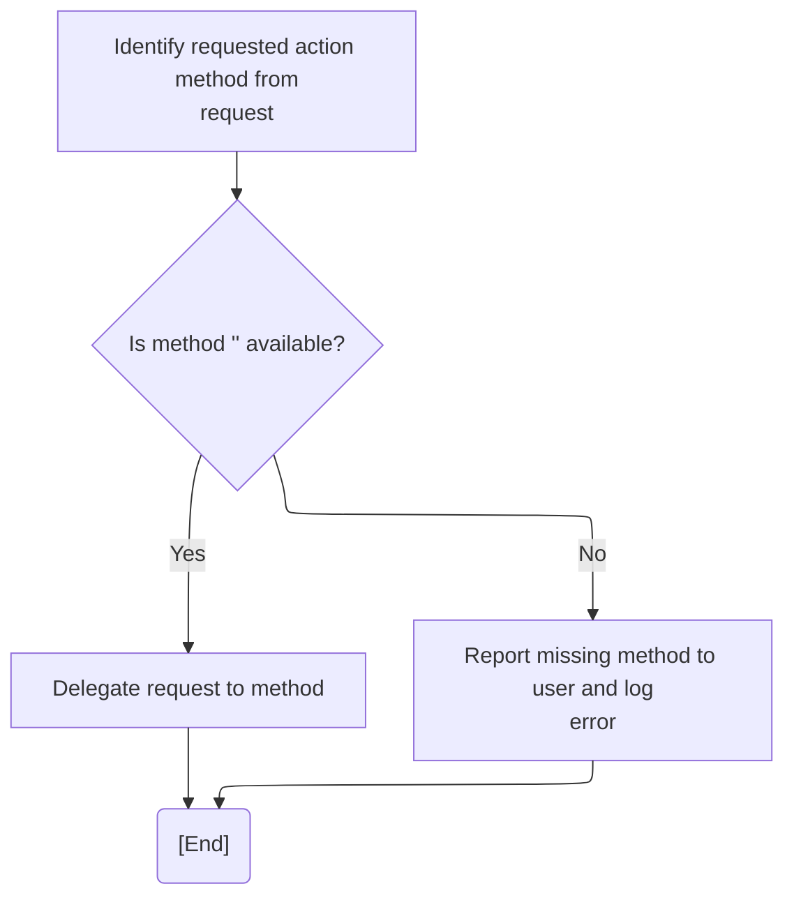

<SwmSnippet path="/extras/src/main/java/org/apache/struts/actions/ActionDispatcher.java" line="323">

---

After getting the method name, we try to resolve the Method object using <SwmToken path="extras/src/main/java/org/apache/struts/actions/ActionDispatcher.java" pos="327:5:5" line-data="            method = getMethod(name);">`getMethod`</SwmToken>. If it fails, we handle the exception and log an error. If it succeeds, we dispatch to the method.

```java
        // Identify the method object to be dispatched to
        Method method = null;

        try {
            method = getMethod(name);
```

---

</SwmSnippet>

<SwmSnippet path="/extras/src/main/java/org/apache/struts/actions/ActionDispatcher.java" line="328">

---

If <SwmToken path="extras/src/main/java/org/apache/struts/actions/ActionDispatcher.java" pos="253:5:5" line-data="            method = getMethod(name);">`getMethod`</SwmToken> fails to find the method, we log the error, wrap the exception, and throw it. If the method is found, we dispatch to it using <SwmToken path="extras/src/main/java/org/apache/struts/actions/ActionDispatcher.java" pos="341:3:3" line-data="        return dispatchMethod(mapping, form, request, response, name, method);">`dispatchMethod`</SwmToken> with the resolved Method object.

```java
        } catch (NoSuchMethodException e) {
            String message =
                messages.getMessage("dispatch.method", mapping.getPath(), name);

            log.error(message, e);

            String userMsg =
                messages.getMessage("dispatch.method.user", mapping.getPath());
            NoSuchMethodException e2 = new NoSuchMethodException(userMsg);
            e2.initCause(e);
            throw e2;
        }

        return dispatchMethod(mapping, form, request, response, name, method);
    }
```

---

</SwmSnippet>

## Finalizing the Tiles Processing and Context State

<SwmSnippet path="/tiles/src/main/java/org/apache/struts/tiles/commands/TilesPreProcessor.java" line="221">

---

After <SwmToken path="tiles/src/main/java/org/apache/struts/tiles/commands/TilesPreProcessor.java" pos="217:1:1" line-data="            doForward(sacontext, uri);">`doForward`</SwmToken> finishes, TilesPreProcessor.execute clears the <SwmToken path="tiles/src/main/java/org/apache/struts/tiles/commands/TilesPreProcessor.java" pos="102:3:3" line-data="        ForwardConfig forwardConfig = sacontext.getForwardConfig();">`forwardConfig`</SwmToken> from the context and returns false. This prevents stale state from affecting later processing and signals the chain to stop further handling.

```java
        sacontext.setForwardConfig( null );
        return (false);
    }
```

---

</SwmSnippet>

&nbsp;

*This is an auto-generated document by Swimm 🌊 and has not yet been verified by a human*

<SwmMeta version="3.0.0" repo-id="Z2l0aHViJTNBJTNBc3RydXRzMSUzQSUzQVN3aW1tLURlbW8=" repo-name="struts1"><sup>Powered by [Swimm](https://app.swimm.io/)</sup></SwmMeta>
