This document explains how tag attributes with dynamic expressions are evaluated and resolved before tags perform their main operations. The flow ensures that all dynamic values are processed and that configuration remains consistent by preventing changes after setup.

# Triggering Expression Evaluation for Validator Tag

<SwmSnippet path="/el/src/main/java/org/apache/strutsel/taglib/html/ELJavascriptValidatorTag.java" line="282">

---

In <SwmToken path="el/src/main/java/org/apache/strutsel/taglib/html/ELJavascriptValidatorTag.java" pos="282:5:5" line-data="    public int doStartTag() throws JspException {">`doStartTag`</SwmToken>, we kick off the flow by calling <SwmToken path="el/src/main/java/org/apache/strutsel/taglib/html/ELJavascriptValidatorTag.java" pos="283:1:1" line-data="        evaluateExpressions();">`evaluateExpressions`</SwmToken>. This step ensures all tag attributes that might be expressions are resolved to their actual values before any further processing. Without this, the tag would just use defaults or static values, missing any dynamic user input.

```java
    public int doStartTag() throws JspException {
        evaluateExpressions();

```

---

</SwmSnippet>

## Resolving Validator Tag Expressions and Enforcing Bundle Immutability

<SwmSnippet path="/el/src/main/java/org/apache/strutsel/taglib/html/ELJavascriptValidatorTag.java" line="294">

---

<SwmToken path="el/src/main/java/org/apache/strutsel/taglib/html/ELJavascriptValidatorTag.java" pos="294:5:5" line-data="    private void evaluateExpressions()">`evaluateExpressions`</SwmToken> loops through each tag attribute, resolving any expressions and updating the tag's properties. When it comes to the bundle property, it calls <SwmToken path="el/src/main/java/org/apache/strutsel/taglib/html/ELJavascriptValidatorTag.java" pos="354:1:1" line-data="            setBundle(string);">`setBundle`</SwmToken>, which checks if the configuration is frozen before allowing changes. This prevents accidental or late modifications to the validator's resource bundle.

```java
    private void evaluateExpressions()
        throws JspException {
        String string = null;
        Integer integer = null;
        Boolean bool = null;

        if ((string =
                EvalHelper.evalString("cdata", getCdataExpr(), this, pageContext)) != null) {
            setCdata(string);
        }

        if ((string =
                EvalHelper.evalString("dynamicJavascript",
                    getDynamicJavascriptExpr(), this, pageContext)) != null) {
            setDynamicJavascript(string);
        }

        if ((string =
                EvalHelper.evalString("formName", getFormNameExpr(), this,
                    pageContext)) != null) {
            setFormName(string);
        }

        if ((string =
                EvalHelper.evalString("method", getMethodExpr(), this,
                    pageContext)) != null) {
            setMethod(string);
        }

        if ((integer =
                EvalHelper.evalInteger("page", getPageExpr(), this, pageContext)) != null) {
            setPage(integer.intValue());
        }

        if ((bool =
                EvalHelper.evalBoolean("scriptLanguage",
                    getScriptLanguageExpr(), this, pageContext)) != null) {
            setScriptLanguage(bool.booleanValue());
        }

        if ((string =
                EvalHelper.evalString("src", getSrcExpr(), this, pageContext)) != null) {
            setSrc(string);
        }

        if ((string =
                EvalHelper.evalString("staticJavascript",
                    getStaticJavascriptExpr(), this, pageContext)) != null) {
            setStaticJavascript(string);
        }

        if ((string =
                EvalHelper.evalString("htmlComment", getHtmlCommentExpr(),
                    this, pageContext)) != null) {
            setHtmlComment(string);
        }

        if ((string =
                EvalHelper.evalString("bundle", getBundleExpr(), this,
                    pageContext)) != null) {
            setBundle(string);
        }
    }
```

---

</SwmSnippet>

<SwmSnippet path="/core/src/main/java/org/apache/struts/config/ExceptionConfig.java" line="89">

---

<SwmToken path="core/src/main/java/org/apache/struts/config/ExceptionConfig.java" pos="89:5:5" line-data="    public void setBundle(String bundle) {">`setBundle`</SwmToken> enforces that the bundle property can't be changed after the configuration is marked as frozen. If you try to set it when configured is true, it throws an exception. This keeps the validator's resource bundle locked in once setup is complete.

```java
    public void setBundle(String bundle) {
        if (configured) {
            throw new IllegalStateException("Configuration is frozen");
        }

        this.bundle = bundle;
    }
```

---

</SwmSnippet>

## Delegating to Superclass After Expression Resolution

<SwmSnippet path="/el/src/main/java/org/apache/strutsel/taglib/html/ELJavascriptValidatorTag.java" line="285">

---

Back in ELJavascriptValidatorTag.doStartTag, after resolving all expressions, we delegate to the superclass. This step handles the standard tag processing, like including scripts needed for validation. The flow then moves to <SwmToken path="el/src/main/java/org/apache/strutsel/taglib/bean/ELResourceTag.java" pos="38:4:4" line-data="public class ELResourceTag extends ResourceTag {">`ELResourceTag`</SwmToken> to handle resource inclusion.

```java
        return (super.doStartTag());
    }
```

---

</SwmSnippet>

# Resource Tag Expression Evaluation and Delegation

<SwmSnippet path="/el/src/main/java/org/apache/strutsel/taglib/bean/ELResourceTag.java" line="120">

---

<SwmToken path="el/src/main/java/org/apache/strutsel/taglib/bean/ELResourceTag.java" pos="120:5:5" line-data="    public int doStartTag() throws JspException {">`doStartTag`</SwmToken> in <SwmToken path="el/src/main/java/org/apache/strutsel/taglib/bean/ELResourceTag.java" pos="38:4:4" line-data="public class ELResourceTag extends ResourceTag {">`ELResourceTag`</SwmToken> triggers expression evaluation for its attributes, then delegates to the superclass for standard tag processing. This ensures any dynamic resource configuration is handled before the tag does its usual work.

```java
    public int doStartTag() throws JspException {
        evaluateExpressions();

        return (super.doStartTag());
    }
```

---

</SwmSnippet>

# Resolving Resource Tag Expressions and Enforcing Input Immutability

```mermaid
%%{init: {"flowchart": {"defaultRenderer": "elk"}} }%%
flowchart TD
    node1{"Evaluate 'id' expression: value
present?"}
    click node1 openCode "el/src/main/java/org/apache/strutsel/taglib/bean/ELResourceTag.java:136:139"
    node1 -->|"Yes"| node2["Update resource id"]
    click node2 openCode "el/src/main/java/org/apache/strutsel/taglib/bean/ELResourceTag.java:138:139"
    node1 -->|"No"| node3{"Evaluate 'input' expression: value
present?"}
    node2 --> node3
    click node3 openCode "el/src/main/java/org/apache/strutsel/taglib/bean/ELResourceTag.java:141:144"
    node3 -->|"Yes"| node4["Update resource input"]
    click node4 openCode "el/src/main/java/org/apache/strutsel/taglib/bean/ELResourceTag.java:143:144"
    node3 -->|"No"| node5{"Evaluate 'name' expression: value
present?"}
    node4 --> node5
    click node5 openCode "el/src/main/java/org/apache/strutsel/taglib/bean/ELResourceTag.java:146:149"
    node5 -->|"Yes"| node6["Update resource name"]
    click node6 openCode "el/src/main/java/org/apache/strutsel/taglib/bean/ELResourceTag.java:148:149"
    node5 -->|"No"| node7["End"]
    node6 --> node7
classDef HeadingStyle fill:#777777,stroke:#333,stroke-width:2px;

%% Swimm:
%% %%{init: {"flowchart": {"defaultRenderer": "elk"}} }%%
%% flowchart TD
%%     node1{"Evaluate 'id' expression: value
%% present?"}
%%     click node1 openCode "<SwmPath>[el/…/bean/ELResourceTag.java](el/src/main/java/org/apache/strutsel/taglib/bean/ELResourceTag.java)</SwmPath>:136:139"
%%     node1 -->|"Yes"| node2["Update resource id"]
%%     click node2 openCode "<SwmPath>[el/…/bean/ELResourceTag.java](el/src/main/java/org/apache/strutsel/taglib/bean/ELResourceTag.java)</SwmPath>:138:139"
%%     node1 -->|"No"| node3{"Evaluate 'input' expression: value
%% present?"}
%%     node2 --> node3
%%     click node3 openCode "<SwmPath>[el/…/bean/ELResourceTag.java](el/src/main/java/org/apache/strutsel/taglib/bean/ELResourceTag.java)</SwmPath>:141:144"
%%     node3 -->|"Yes"| node4["Update resource input"]
%%     click node4 openCode "<SwmPath>[el/…/bean/ELResourceTag.java](el/src/main/java/org/apache/strutsel/taglib/bean/ELResourceTag.java)</SwmPath>:143:144"
%%     node3 -->|"No"| node5{"Evaluate 'name' expression: value
%% present?"}
%%     node4 --> node5
%%     click node5 openCode "<SwmPath>[el/…/bean/ELResourceTag.java](el/src/main/java/org/apache/strutsel/taglib/bean/ELResourceTag.java)</SwmPath>:146:149"
%%     node5 -->|"Yes"| node6["Update resource name"]
%%     click node6 openCode "<SwmPath>[el/…/bean/ELResourceTag.java](el/src/main/java/org/apache/strutsel/taglib/bean/ELResourceTag.java)</SwmPath>:148:149"
%%     node5 -->|"No"| node7["End"]
%%     node6 --> node7
%% classDef HeadingStyle fill:#777777,stroke:#333,stroke-width:2px;
```



<SwmSnippet path="/el/src/main/java/org/apache/strutsel/taglib/bean/ELResourceTag.java" line="132">

---

In <SwmToken path="el/src/main/java/org/apache/strutsel/taglib/bean/ELResourceTag.java" pos="132:5:5" line-data="    private void evaluateExpressions()">`evaluateExpressions`</SwmToken>, we resolve the id and input attributes for the resource tag. Setting input calls into <SwmToken path="core/src/main/java/org/apache/struts/config/ExceptionConfig.java" pos="180:14:14" line-data="     * @param actionConfig The {@link ActionConfig} that this config is from,">`ActionConfig`</SwmToken>, which checks if configuration is frozen before allowing changes, locking in the input value once setup is done.

```java
    private void evaluateExpressions()
        throws JspException {
        String string = null;

        if ((string =
                EvalHelper.evalString("id", getIdExpr(), this, pageContext)) != null) {
            setId(string);
        }

        if ((string =
                EvalHelper.evalString("input", getInputExpr(), this, pageContext)) != null) {
            setInput(string);
        }

```

---

</SwmSnippet>

<SwmSnippet path="/core/src/main/java/org/apache/struts/config/ActionConfig.java" line="473">

---

<SwmToken path="core/src/main/java/org/apache/struts/config/ActionConfig.java" pos="473:5:5" line-data="    public void setInput(String input) {">`setInput`</SwmToken> checks if configuration is frozen before setting the input value. If it's frozen, it throws an exception, enforcing that the input can't be changed after setup. This keeps the resource tag's input consistent.

```java
    public void setInput(String input) {
        if (configured) {
            throw new IllegalStateException("Configuration is frozen");
        }

        this.input = input;
    }
```

---

</SwmSnippet>

<SwmSnippet path="/el/src/main/java/org/apache/strutsel/taglib/bean/ELResourceTag.java" line="146">

---

After returning from <SwmToken path="el/src/main/java/org/apache/strutsel/taglib/bean/ELResourceTag.java" pos="143:1:1" line-data="            setInput(string);">`setInput`</SwmToken> in <SwmToken path="core/src/main/java/org/apache/struts/config/ExceptionConfig.java" pos="180:14:14" line-data="     * @param actionConfig The {@link ActionConfig} that this config is from,">`ActionConfig`</SwmToken>, <SwmToken path="el/src/main/java/org/apache/strutsel/taglib/html/ELJavascriptValidatorTag.java" pos="283:1:1" line-data="        evaluateExpressions();">`evaluateExpressions`</SwmToken> in <SwmToken path="el/src/main/java/org/apache/strutsel/taglib/bean/ELResourceTag.java" pos="38:4:4" line-data="public class ELResourceTag extends ResourceTag {">`ELResourceTag`</SwmToken> keeps going and resolves the name attribute. This makes sure all tag properties are set up before the tag finishes processing.

```java
        if ((string =
                EvalHelper.evalString("name", getNameExpr(), this, pageContext)) != null) {
            setName(string);
        }
    }
```

---

</SwmSnippet>

&nbsp;

*This is an auto-generated document by Swimm 🌊 and has not yet been verified by a human*

<SwmMeta version="3.0.0" repo-id="Z2l0aHViJTNBJTNBc3RydXRzMSUzQSUzQVN3aW1tLURlbW8=" repo-name="struts1"><sup>Powered by [Swimm](https://app.swimm.io/)</sup></SwmMeta>
