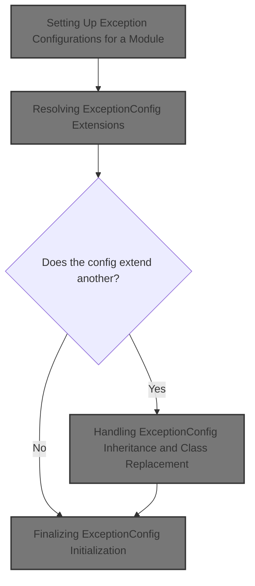
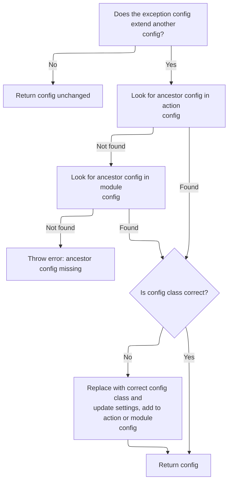

This document explains how exception configurations for a module are processed to ensure all inheritance and extension logic is resolved. The flow takes a set of exception configurations, prepares them for extension handling, resolves parent-child relationships, and finalizes the configurations so that the module can handle exceptions according to the defined rules.



# Setting Up Exception Configurations for a Module

<SwmSnippet path="/core/src/main/java/org/apache/struts/action/ActionServlet.java" line="1213">

---

In <SwmToken path="core/src/main/java/org/apache/struts/action/ActionServlet.java" pos="1213:5:5" line-data="    protected void initModuleExceptionConfigs(ModuleConfig config)">`initModuleExceptionConfigs`</SwmToken>, we loop through all ExceptionConfigs for the module and call <SwmToken path="core/src/main/java/org/apache/struts/action/ActionServlet.java" pos="1226:1:1" line-data="            postProcessConfig(exception, config, true);">`postProcessConfig`</SwmToken> on each. This is where we prep each config for extension handling, making sure they're normalized before any inheritance or extension logic is applied.

```java
    protected void initModuleExceptionConfigs(ModuleConfig config)
        throws ServletException {
        if (log.isDebugEnabled()) {
            log.debug("Initializing module path '" + config.getPrefix()
                + "' forwards");
        }

        // Process exception config extensions.
        ExceptionConfig[] exceptions = config.findExceptionConfigs();

        for (int i = 0; i < exceptions.length; i++) {
            ExceptionConfig exception = exceptions[i];

            postProcessConfig(exception, config, true);
```

---

</SwmSnippet>

<SwmSnippet path="/core/src/main/java/org/apache/struts/action/ActionServlet.java" line="1227">

---

Back in ActionServlet.initModuleExceptionConfigs, after <SwmToken path="core/src/main/java/org/apache/struts/action/ActionServlet.java" pos="1226:1:1" line-data="            postProcessConfig(exception, config, true);">`postProcessConfig`</SwmToken>, we immediately call <SwmToken path="core/src/main/java/org/apache/struts/action/ActionServlet.java" pos="1227:1:1" line-data="            processExceptionExtension(exception, config, null);">`processExceptionExtension`</SwmToken>. This is where we resolve any inheritance or extension logic for each <SwmToken path="core/src/main/java/org/apache/struts/action/ActionServlet.java" pos="1221:1:1" line-data="        ExceptionConfig[] exceptions = config.findExceptionConfigs();">`ExceptionConfig`</SwmToken>, making sure all parent-child relationships are handled.

```java
            processExceptionExtension(exception, config, null);
```

---

</SwmSnippet>

## Resolving <SwmToken path="core/src/main/java/org/apache/struts/action/ActionServlet.java" pos="1221:1:1" line-data="        ExceptionConfig[] exceptions = config.findExceptionConfigs();">`ExceptionConfig`</SwmToken> Extensions

<SwmSnippet path="/core/src/main/java/org/apache/struts/action/ActionServlet.java" line="1254">

---

In <SwmToken path="core/src/main/java/org/apache/struts/action/ActionServlet.java" pos="1254:5:5" line-data="    protected void processExceptionExtension(ExceptionConfig exceptionConfig,">`processExceptionExtension`</SwmToken>, we check if the <SwmToken path="core/src/main/java/org/apache/struts/action/ActionServlet.java" pos="1254:7:7" line-data="    protected void processExceptionExtension(ExceptionConfig exceptionConfig,">`ExceptionConfig`</SwmToken> has already been processed for extensions. If not, we call <SwmToken path="core/src/main/java/org/apache/struts/action/ActionServlet.java" pos="1265:1:1" line-data="                    processExceptionConfigClass(exceptionConfig, moduleConfig,">`processExceptionConfigClass`</SwmToken> to handle any class-level inheritance, making sure the config is the right type if it extends another.

```java
    protected void processExceptionExtension(ExceptionConfig exceptionConfig,
        ModuleConfig moduleConfig, ActionConfig actionConfig)
        throws ServletException {
        try {
            if (!exceptionConfig.isExtensionProcessed()) {
                if (log.isDebugEnabled()) {
                    log.debug("Processing extensions for '"
                        + exceptionConfig.getType() + "'");
                }

                exceptionConfig =
                    processExceptionConfigClass(exceptionConfig, moduleConfig,
                        actionConfig);

```

---

</SwmSnippet>

### Handling <SwmToken path="core/src/main/java/org/apache/struts/action/ActionServlet.java" pos="1221:1:1" line-data="        ExceptionConfig[] exceptions = config.findExceptionConfigs();">`ExceptionConfig`</SwmToken> Inheritance and Class Replacement



<SwmSnippet path="/core/src/main/java/org/apache/struts/action/ActionServlet.java" line="1293">

---

In <SwmToken path="core/src/main/java/org/apache/struts/action/ActionServlet.java" pos="1293:5:5" line-data="    protected ExceptionConfig processExceptionConfigClass(">`processExceptionConfigClass`</SwmToken>, we check if the <SwmToken path="core/src/main/java/org/apache/struts/action/ActionServlet.java" pos="1293:3:3" line-data="    protected ExceptionConfig processExceptionConfigClass(">`ExceptionConfig`</SwmToken> extends another. If so, we look up the ancestor config, and if it's a different class, we create a new instance of the ancestor's class and copy over the properties. This is where we handle dynamic class replacement for config inheritance, using Struts utilities for instantiation and copying.

```java
    protected ExceptionConfig processExceptionConfigClass(
        ExceptionConfig exceptionConfig, ModuleConfig moduleConfig,
        ActionConfig actionConfig)
        throws ServletException {
        String ancestor = exceptionConfig.getExtends();

        if (ancestor == null) {
            // Nothing to do, then
            return exceptionConfig;
        }

        // Make sure that this config is of the right class
        ExceptionConfig baseConfig = null;
        if (actionConfig != null) {
            baseConfig = actionConfig.findExceptionConfig(ancestor);
        }

        if (baseConfig == null) {
            // This means either there's no actionConfig anyway, or the
            // ancestor is not defined within the action.
            baseConfig = moduleConfig.findExceptionConfig(ancestor);
        }

        if (baseConfig == null) {
            throw new UnavailableException("Unable to find "
                + "exception config '" + ancestor + "' to extend.");
        }

        // Was our config's class overridden already?
        if (exceptionConfig.getClass().equals(ExceptionConfig.class)) {
            // Ensure that our config is using the correct class
            if (!baseConfig.getClass().equals(exceptionConfig.getClass())) {
                // Replace the config with an instance of the correct class
                ExceptionConfig newExceptionConfig = null;
                String baseConfigClassName = baseConfig.getClass().getName();

                try {
                    newExceptionConfig =
                        (ExceptionConfig) RequestUtils.applicationInstance(
                            baseConfigClassName);

                    // copy the values
                    BeanUtils.copyProperties(newExceptionConfig,
                        exceptionConfig);
```

---

</SwmSnippet>

<SwmSnippet path="/core/src/main/java/org/apache/struts/action/ActionServlet.java" line="1337">

---

Back in <SwmToken path="core/src/main/java/org/apache/struts/action/ActionServlet.java" pos="1265:1:1" line-data="                    processExceptionConfigClass(exceptionConfig, moduleConfig,">`processExceptionConfigClass`</SwmToken>, if creating or copying the new <SwmToken path="core/src/main/java/org/apache/struts/action/ActionServlet.java" pos="1221:1:1" line-data="        ExceptionConfig[] exceptions = config.findExceptionConfigs();">`ExceptionConfig`</SwmToken> fails, we call <SwmToken path="core/src/main/java/org/apache/struts/action/ActionServlet.java" pos="1338:1:1" line-data="                    handleCreationException(baseConfigClassName, e);">`handleCreationException`</SwmToken> to deal with instantiation errors in a consistent way.

```java
                } catch (Exception e) {
                    handleCreationException(baseConfigClassName, e);
                }

```

---

</SwmSnippet>

<SwmSnippet path="/core/src/main/java/org/apache/struts/action/ActionServlet.java" line="1341">

---

Back in <SwmToken path="core/src/main/java/org/apache/struts/action/ActionServlet.java" pos="1265:1:1" line-data="                    processExceptionConfigClass(exceptionConfig, moduleConfig,">`processExceptionConfigClass`</SwmToken>, after handling creation exceptions, we remove the old <SwmToken path="core/src/main/java/org/apache/struts/action/ActionServlet.java" pos="1221:1:1" line-data="        ExceptionConfig[] exceptions = config.findExceptionConfigs();">`ExceptionConfig`</SwmToken> from the <SwmToken path="core/src/main/java/org/apache/struts/action/ActionServlet.java" pos="1342:4:4" line-data="                if (actionConfig != null) {">`actionConfig`</SwmToken> (if present) to make room for the new subclass instance.

```java
                // replace exceptionConfig with newExceptionConfig
                if (actionConfig != null) {
                    actionConfig.removeExceptionConfig(exceptionConfig);
```

---

</SwmSnippet>

<SwmSnippet path="/core/src/main/java/org/apache/struts/config/ActionConfig.java" line="1340">

---

RemoveExceptionConfig removes the <SwmToken path="core/src/main/java/org/apache/struts/config/ActionConfig.java" pos="1340:7:7" line-data="    public void removeExceptionConfig(ExceptionConfig config) {">`ExceptionConfig`</SwmToken> from the exceptions map using its type as the key, but only if the configuration isn't frozen. This prevents accidental changes after setup.

```java
    public void removeExceptionConfig(ExceptionConfig config) {
        if (configured) {
            throw new IllegalStateException("Configuration is frozen");
        }

        exceptions.remove(config.getType());
    }
```

---

</SwmSnippet>

<SwmSnippet path="/core/src/main/java/org/apache/struts/action/ActionServlet.java" line="1344">

---

Back in <SwmToken path="core/src/main/java/org/apache/struts/action/ActionServlet.java" pos="1265:1:1" line-data="                    processExceptionConfigClass(exceptionConfig, moduleConfig,">`processExceptionConfigClass`</SwmToken>, after removing the old config, we add the new <SwmToken path="core/src/main/java/org/apache/struts/action/ActionServlet.java" pos="1221:1:1" line-data="        ExceptionConfig[] exceptions = config.findExceptionConfigs();">`ExceptionConfig`</SwmToken> to either <SwmToken path="core/src/main/java/org/apache/struts/action/ActionServlet.java" pos="1344:1:1" line-data="                    actionConfig.addExceptionConfig(newExceptionConfig);">`actionConfig`</SwmToken> or <SwmToken path="core/src/main/java/org/apache/struts/action/ActionServlet.java" pos="1346:1:1" line-data="                    moduleConfig.removeExceptionConfig(exceptionConfig);">`moduleConfig`</SwmToken>, making sure the updated config is registered for use.

```java
                    actionConfig.addExceptionConfig(newExceptionConfig);
                } else {
                    moduleConfig.removeExceptionConfig(exceptionConfig);
                    moduleConfig.addExceptionConfig(newExceptionConfig);
                }
                exceptionConfig = newExceptionConfig;
            }
        }

        return exceptionConfig;
    }
```

---

</SwmSnippet>

<SwmSnippet path="/core/src/main/java/org/apache/struts/config/impl/ModuleConfigImpl.java" line="327">

---

AddExceptionConfig puts the <SwmToken path="core/src/main/java/org/apache/struts/config/impl/ModuleConfigImpl.java" pos="327:7:7" line-data="    public void addExceptionConfig(ExceptionConfig config) {">`ExceptionConfig`</SwmToken> into the exceptions map using its type as the key, after checking that configuration isn't locked. If a config with the same key exists, it logs a warning about the override.

```java
    public void addExceptionConfig(ExceptionConfig config) {
        throwIfConfigured();

        String key = config.getType();

        if (exceptions.containsKey(key)) {
            log.warn("Overriding ExceptionConfig of type " + key);
        }

        exceptions.put(key, config);
    }
```

---

</SwmSnippet>

### Finalizing <SwmToken path="core/src/main/java/org/apache/struts/action/ActionServlet.java" pos="1221:1:1" line-data="        ExceptionConfig[] exceptions = config.findExceptionConfigs();">`ExceptionConfig`</SwmToken> Extension Processing

<SwmSnippet path="/core/src/main/java/org/apache/struts/action/ActionServlet.java" line="1268">

---

Back in <SwmToken path="core/src/main/java/org/apache/struts/action/ActionServlet.java" pos="1227:1:1" line-data="            processExceptionExtension(exception, config, null);">`processExceptionExtension`</SwmToken>, after updating the <SwmToken path="core/src/main/java/org/apache/struts/action/ActionServlet.java" pos="1221:1:1" line-data="        ExceptionConfig[] exceptions = config.findExceptionConfigs();">`ExceptionConfig`</SwmToken> class, we call <SwmToken path="core/src/main/java/org/apache/struts/action/ActionServlet.java" pos="1268:3:3" line-data="                exceptionConfig.processExtends(moduleConfig, actionConfig);">`processExtends`</SwmToken> to resolve any remaining inheritance logic and check for circular references.

```java
                exceptionConfig.processExtends(moduleConfig, actionConfig);
            }
```

---

</SwmSnippet>

### Resolving Inheritance and Circular Reference Checks

See <SwmLink doc-title="Exception Configuration Inheritance Flow">[Exception Configuration Inheritance Flow](/.swm/exception-configuration-inheritance-flow.qcuuyh78.sw.md)</SwmLink>

### Handling Extension Processing Errors

<SwmSnippet path="/core/src/main/java/org/apache/struts/action/ActionServlet.java" line="1270">

---

Back in <SwmToken path="core/src/main/java/org/apache/struts/action/ActionServlet.java" pos="1227:1:1" line-data="            processExceptionExtension(exception, config, null);">`processExceptionExtension`</SwmToken>, if any exception other than <SwmToken path="core/src/main/java/org/apache/struts/action/ActionServlet.java" pos="1270:6:6" line-data="        } catch (ServletException e) {">`ServletException`</SwmToken> is thrown during extension processing, we call <SwmToken path="core/src/main/java/org/apache/struts/action/ActionServlet.java" pos="1273:1:1" line-data="            handleGeneralExtensionException(&quot;Exception&quot;,">`handleGeneralExtensionException`</SwmToken> to log and handle the error consistently.

```java
        } catch (ServletException e) {
            throw e;
        } catch (Exception e) {
            handleGeneralExtensionException("Exception",
                exceptionConfig.getType(), e);
        }
    }
```

---

</SwmSnippet>

## Finalizing <SwmToken path="core/src/main/java/org/apache/struts/action/ActionServlet.java" pos="1221:1:1" line-data="        ExceptionConfig[] exceptions = config.findExceptionConfigs();">`ExceptionConfig`</SwmToken> Initialization

<SwmSnippet path="/core/src/main/java/org/apache/struts/action/ActionServlet.java" line="1228">

---

Back in ActionServlet.initModuleExceptionConfigs, after extension processing, we call <SwmToken path="core/src/main/java/org/apache/struts/action/ActionServlet.java" pos="1228:1:1" line-data="            postProcessConfig(exception, config, false);">`postProcessConfig`</SwmToken> again to finalize and normalize any changes made during extension handling.

```java
            postProcessConfig(exception, config, false);
        }

```

---

</SwmSnippet>

<SwmSnippet path="/core/src/main/java/org/apache/struts/action/ActionServlet.java" line="1231">

---

Back in ActionServlet.initModuleExceptionConfigs, the final block for verifying required fields is commented out, probably due to a known issue (<SwmToken path="core/src/main/java/org/apache/struts/action/ActionServlet.java" pos="1231:2:4" line-data="// STR-2924">`STR-2924`</SwmToken>). Any required field checks are either skipped or handled elsewhere.

```java
// STR-2924
//        for (int i = 0; i < exceptions.length; i++) {
//            ExceptionConfig exception = exceptions[i];
//
//            // Verify that required fields are all present for the config
//            if (exception.getKey() == null) {
//                handleValueRequiredException("key", exception.getType(),
//                    "global exception config");
//            }
//        }
    }
```

---

</SwmSnippet>

&nbsp;

*This is an auto-generated document by Swimm 🌊 and has not yet been verified by a human*

<SwmMeta version="3.0.0" repo-id="Z2l0aHViJTNBJTNBc3RydXRzMSUzQSUzQVN3aW1tLURlbW8=" repo-name="struts1"><sup>Powered by [Swimm](https://app.swimm.io/)</sup></SwmMeta>
