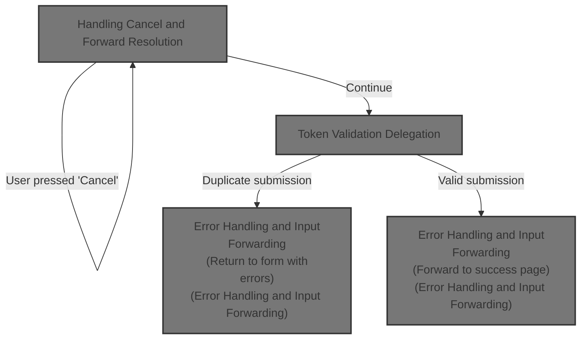
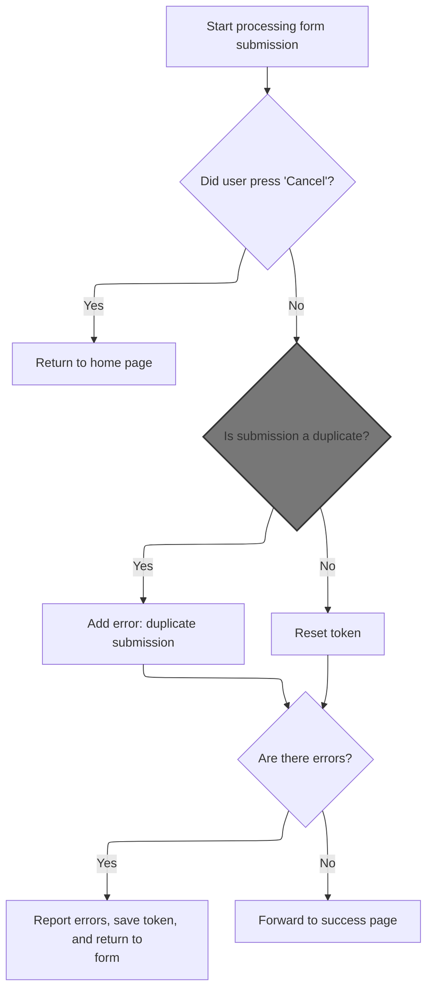

This document explains how user form submissions are managed, including handling cancellations, preventing duplicate submissions, and determining the correct page to display. The flow receives a form submission, checks for cancellation, validates the submission token, and then either redirects the user, reports errors, or forwards to a success page based on the result.



# Handling Cancel and Forward Resolution



<SwmSnippet path="/apps/cookbook/src/main/java/examples/token/ProcessTokenAction.java" line="67">

---

In `ProcessTokenAction.execute`, we check if the request was cancelled and, if so, immediately resolve the forward using <SwmToken path="apps/cookbook/src/main/java/examples/token/ProcessTokenAction.java" pos="77:3:5" line-data="            return mapping.findForward(&quot;home&quot;);">`mapping.findForward`</SwmToken>("home"). This avoids any further processing and jumps straight to the home page, so next we need <SwmToken path="apps/cookbook/src/main/java/examples/token/ProcessTokenAction.java" pos="68:1:1" line-data="        ActionMapping mapping,">`ActionMapping`</SwmToken> to figure out where 'home' actually points.

```java
    public ActionForward execute(
        ActionMapping mapping,
        ActionForm form,
        HttpServletRequest request,
        HttpServletResponse response)
        throws Exception {

        // If user pressed 'Cancel' button,
        // return to home page
        if (isCancelled(request)) {
            return mapping.findForward("home");
        }

        ActionErrors errors = new ActionErrors();

```

---

</SwmSnippet>

<SwmSnippet path="/core/src/main/java/org/apache/struts/action/ActionMapping.java" line="70">

---

<SwmToken path="core/src/main/java/org/apache/struts/action/ActionMapping.java" pos="70:5:5" line-data="    public ActionForward findForward(String forwardName) {">`findForward`</SwmToken> looks up the forward name first in the local config, then falls back to the module config if not found, logs a warning if missing, and finally returns the result as an <SwmToken path="core/src/main/java/org/apache/struts/action/ActionMapping.java" pos="70:3:3" line-data="    public ActionForward findForward(String forwardName) {">`ActionForward`</SwmToken>. This lets the flow resolve where to go next based on configuration.

```java
    public ActionForward findForward(String forwardName) {
        ForwardConfig config = findForwardConfig(forwardName);

        if (config == null) {
            config = getModuleConfig().findForwardConfig(forwardName);
        }

        // TODO: remove warning since findRequiredForward takes care of use case? 
        if (config == null) {
            if (log.isWarnEnabled()) {
                log.warn("Unable to find '" + forwardName + "' forward.");
            }
        }

        return ((ActionForward) config);
    }
```

---

</SwmSnippet>

<SwmSnippet path="/apps/cookbook/src/main/java/examples/token/ProcessTokenAction.java" line="82">

---

Back in `ProcessTokenAction.execute`, after resolving the forward for cancellation, we check if the token is valid to prevent duplicate submissions. If it's not valid, we add an error message. Next, we need Action.isTokenValid to actually verify the token.

```java
        // Prevent unintentional duplication submissions by checking
        // that we have not received this token previously
        if (!isTokenValid(request)) {
            errors.add(
                ActionMessages.GLOBAL_MESSAGE,
                new ActionMessage("errors.token"));
        }
```

---

</SwmSnippet>

## Token Validation Delegation

<SwmSnippet path="/core/src/main/java/org/apache/struts/action/Action.java" line="429">

---

<SwmToken path="core/src/main/java/org/apache/struts/action/Action.java" pos="429:5:5" line-data="    protected boolean isTokenValid(HttpServletRequest request) {">`isTokenValid`</SwmToken> in Action just passes the request to <SwmToken path="core/src/main/java/org/apache/struts/action/Action.java" pos="28:10:10" line-data="import org.apache.struts.util.TokenProcessor;">`TokenProcessor`</SwmToken> for validation, so the actual check is handled elsewhere. Next, we need <SwmToken path="core/src/main/java/org/apache/struts/action/Action.java" pos="28:10:10" line-data="import org.apache.struts.util.TokenProcessor;">`TokenProcessor`</SwmToken> to do the real work.

```java
    protected boolean isTokenValid(HttpServletRequest request) {
        return token.isTokenValid(request, false);
    }
```

---

</SwmSnippet>

## Session Token Comparison

<SwmSnippet path="/core/src/main/java/org/apache/struts/util/TokenProcessor.java" line="111">

---

<SwmToken path="core/src/main/java/org/apache/struts/util/TokenProcessor.java" pos="111:7:7" line-data="    public synchronized boolean isTokenValid(HttpServletRequest request,">`isTokenValid`</SwmToken> in <SwmToken path="core/src/main/java/org/apache/struts/action/Action.java" pos="28:10:10" line-data="import org.apache.struts.util.TokenProcessor;">`TokenProcessor`</SwmToken> compares the session token with the one from the request. If either is missing or doesn't match, validation fails. Next, we need <SwmToken path="core/src/main/java/org/apache/struts/upload/MultipartRequestWrapper.java" pos="38:4:4" line-data="public class MultipartRequestWrapper extends HttpServletRequestWrapper {">`MultipartRequestWrapper`</SwmToken> to fetch the token from the request parameters.

```java
    public synchronized boolean isTokenValid(HttpServletRequest request,
        boolean reset) {
        // Retrieve the current session for this request
        HttpSession session = request.getSession(false);

        if (session == null) {
            return false;
        }

        // Retrieve the transaction token from this session, and
        // reset it if requested
        String saved =
            (String) session.getAttribute(Globals.TRANSACTION_TOKEN_KEY);

        if (saved == null) {
            return false;
        }

        if (reset) {
            this.resetToken(request);
        }

        // Retrieve the transaction token included in this request
        String token = request.getParameter(Globals.TOKEN_KEY);

        if (token == null) {
            return false;
        }

        return saved.equals(token);
    }
```

---

</SwmSnippet>

## Parameter Retrieval Abstraction

<SwmSnippet path="/core/src/main/java/org/apache/struts/upload/MultipartRequestWrapper.java" line="75">

---

In <SwmToken path="core/src/main/java/org/apache/struts/upload/MultipartRequestWrapper.java" pos="75:5:5" line-data="    public String getParameter(String name) {">`getParameter`</SwmToken>, <SwmToken path="core/src/main/java/org/apache/struts/upload/MultipartRequestWrapper.java" pos="38:4:4" line-data="public class MultipartRequestWrapper extends HttpServletRequestWrapper {">`MultipartRequestWrapper`</SwmToken> calls <SwmToken path="core/src/main/java/org/apache/struts/upload/MultipartRequestWrapper.java" pos="76:7:9" line-data="        String value = getRequest().getParameter(name);">`getRequest()`</SwmToken><SwmToken path="core/src/main/java/org/apache/struts/upload/MultipartRequestWrapper.java" pos="76:10:11" line-data="        String value = getRequest().getParameter(name);">`.getParameter`</SwmToken>(name) to fetch the parameter from the underlying request. If not found, it checks its own map. Next, we need <SwmToken path="core/src/main/java/org/apache/struts/chain/contexts/ServletActionContext.java" pos="39:4:4" line-data="public class ServletActionContext extends WebActionContext {">`ServletActionContext`</SwmToken> to get the actual request object.

```java
    public String getParameter(String name) {
        String value = getRequest().getParameter(name);

```

---

</SwmSnippet>

### Request Context Resolution

<SwmSnippet path="/core/src/main/java/org/apache/struts/chain/contexts/ServletActionContext.java" line="94">

---

<SwmToken path="core/src/main/java/org/apache/struts/chain/contexts/ServletActionContext.java" pos="94:5:5" line-data="    public HttpServletRequest getRequest() {">`getRequest`</SwmToken> in <SwmToken path="core/src/main/java/org/apache/struts/chain/contexts/ServletActionContext.java" pos="39:4:4" line-data="public class ServletActionContext extends WebActionContext {">`ServletActionContext`</SwmToken> grabs the request from <SwmToken path="core/src/main/java/org/apache/struts/chain/contexts/ServletActionContext.java" pos="95:3:3" line-data="        return servletWebContext().getRequest();">`servletWebContext`</SwmToken>, so we need to resolve the web context first. Next, we call <SwmToken path="core/src/main/java/org/apache/struts/chain/contexts/ServletActionContext.java" pos="95:3:3" line-data="        return servletWebContext().getRequest();">`servletWebContext`</SwmToken> to get the actual context object.

```java
    public HttpServletRequest getRequest() {
        return servletWebContext().getRequest();
    }
```

---

</SwmSnippet>

<SwmSnippet path="/core/src/main/java/org/apache/struts/chain/contexts/ServletActionContext.java" line="67">

---

<SwmToken path="core/src/main/java/org/apache/struts/chain/contexts/ServletActionContext.java" pos="67:5:5" line-data="    protected ServletWebContext servletWebContext() {">`servletWebContext`</SwmToken> just casts the base context to <SwmToken path="core/src/main/java/org/apache/struts/chain/contexts/ServletActionContext.java" pos="67:3:3" line-data="    protected ServletWebContext servletWebContext() {">`ServletWebContext`</SwmToken> without checking, so if the hierarchy is wrong, it'll throw. This is standard OOP stuff for context resolution.

```java
    protected ServletWebContext servletWebContext() {
        return (ServletWebContext) this.getBaseContext();
    }
```

---

</SwmSnippet>

### Fallback Parameter Lookup

<SwmSnippet path="/core/src/main/java/org/apache/struts/upload/MultipartRequestWrapper.java" line="78">

---

Back in `MultipartRequestWrapper.getParameter`, if the request doesn't have the parameter, we check our internal map for multipart values. This ensures we catch parameters from both standard and multipart forms.

```java
        if (value == null) {
            String[] mValue = (String[]) parameters.get(name);

            if ((mValue != null) && (mValue.length > 0)) {
                value = mValue[0];
            }
        }

        return value;
    }
```

---

</SwmSnippet>

## Error Handling and Input Forwarding

<SwmSnippet path="/apps/cookbook/src/main/java/examples/token/ProcessTokenAction.java" line="89">

---

Back in `ProcessTokenAction.execute`, after token validation, we reset the token, save errors, and if any errors exist, we forward to the input page using <SwmToken path="apps/cookbook/src/main/java/examples/token/ProcessTokenAction.java" pos="95:4:6" line-data="            return (mapping.getInputForward());">`mapping.getInputForward`</SwmToken>. Next, we need <SwmToken path="apps/cookbook/src/main/java/examples/token/ProcessTokenAction.java" pos="68:1:1" line-data="        ActionMapping mapping,">`ActionMapping`</SwmToken> to resolve which input forward to use based on config.

```java
        resetToken(request);

        // Report any errors we have discovered back to the original form
        if (!errors.isEmpty()) {
            saveErrors(request, errors);
            saveToken(request);
            return (mapping.getInputForward());
        }

```

---

</SwmSnippet>

<SwmSnippet path="/core/src/main/java/org/apache/struts/action/ActionMapping.java" line="139">

---

<SwmToken path="core/src/main/java/org/apache/struts/action/ActionMapping.java" pos="139:5:5" line-data="    public ActionForward getInputForward() {">`getInputForward`</SwmToken> checks if input forwarding is enabled in the controller config. If so, it tries to resolve the input forward by name, otherwise it constructs a new <SwmToken path="core/src/main/java/org/apache/struts/action/ActionMapping.java" pos="139:3:3" line-data="    public ActionForward getInputForward() {">`ActionForward`</SwmToken>. This lets the flow adapt to module-specific settings.

```java
    public ActionForward getInputForward() {
        String input = getInput();
        if (getModuleConfig().getControllerConfig().getInputForward()) {
            if (input != null) {
                return findForward(input);
            }
            return findForward(Action.INPUT);
        }
        return (new ActionForward(input));
    }
```

---

</SwmSnippet>

<SwmSnippet path="/apps/cookbook/src/main/java/examples/token/ProcessTokenAction.java" line="98">

---

Back in `ProcessTokenAction.execute`, after handling errors, we forward to the result page using <SwmToken path="apps/cookbook/src/main/java/examples/token/ProcessTokenAction.java" pos="99:3:5" line-data="        return mapping.findForward(&quot;success&quot;);">`mapping.findForward`</SwmToken>("success"). This lets the flow finish by resolving the configured success page.

```java
        // Forward to result page
        return mapping.findForward("success");
    }
```

---

</SwmSnippet>

&nbsp;

*This is an auto-generated document by Swimm 🌊 and has not yet been verified by a human*

<SwmMeta version="3.0.0" repo-id="Z2l0aHViJTNBJTNBc3RydXRzMSUzQSUzQVN3aW1tLURlbW8=" repo-name="struts1"><sup>Powered by [Swimm](https://app.swimm.io/)</sup></SwmMeta>
