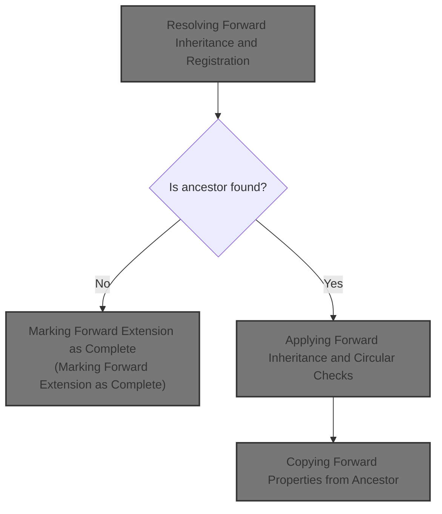
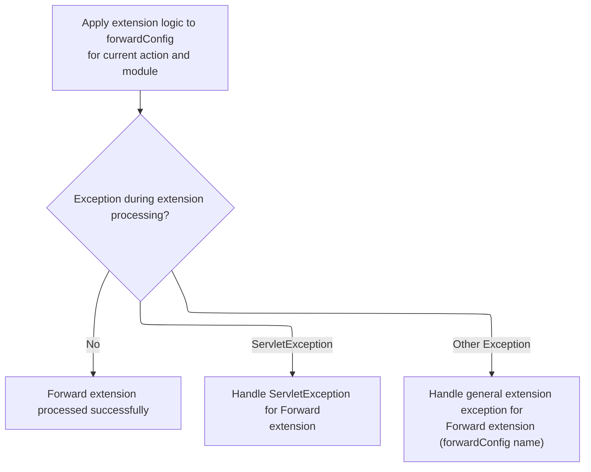
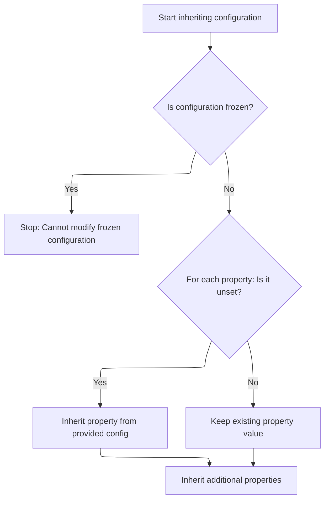

This document explains how forward configurations are processed to enable modular and reusable navigation rules. When a forward configuration inherits from another, the system resolves the ancestor, applies property inheritance, and ensures that circular references are avoided. The result is a finalized, immutable configuration ready for use in navigation.



# Handling Forward Extension Processing

<SwmSnippet path="/core/src/main/java/org/apache/struts/action/ActionServlet.java" line="1102">

---

In <SwmToken path="core/src/main/java/org/apache/struts/action/ActionServlet.java" pos="1102:5:5" line-data="    protected void processForwardExtension(ForwardConfig forwardConfig,">`processForwardExtension`</SwmToken>, we check if the forward's extension logic has already run. If not, we log the action and call <SwmToken path="core/src/main/java/org/apache/struts/action/ActionServlet.java" pos="1113:1:1" line-data="                    processForwardConfigClass(forwardConfig, moduleConfig,">`processForwardConfigClass`</SwmToken> to handle any inheritance or class replacement for the forward before continuing.

```java
    protected void processForwardExtension(ForwardConfig forwardConfig,
        ModuleConfig moduleConfig, ActionConfig actionConfig)
        throws ServletException {
        try {
            if (!forwardConfig.isExtensionProcessed()) {
                if (log.isDebugEnabled()) {
                    log.debug("Processing extensions for '"
                        + forwardConfig.getName() + "'");
                }

                forwardConfig =
                    processForwardConfigClass(forwardConfig, moduleConfig,
                        actionConfig);

```

---

</SwmSnippet>

## Resolving Forward Inheritance and Registration

```mermaid
%%{init: {"flowchart": {"defaultRenderer": "elk"}} }%%
flowchart TD
    node1["Start: Process ForwardConfig"] --> node2{"Does ForwardConfig have an ancestor to
extend?"}
    click node1 openCode "core/src/main/java/org/apache/struts/action/ActionServlet.java:1142:1146"
    node2 -->|"No"| node3["Return ForwardConfig as-is"]
    click node2 openCode "core/src/main/java/org/apache/struts/action/ActionServlet.java:1146:1150"
    click node3 openCode "core/src/main/java/org/apache/struts/action/ActionServlet.java:1150:1151"
    node2 -->|"Yes"| node4{"Is ancestor found in actionConfig or
moduleConfig?"}
    click node4 openCode "core/src/main/java/org/apache/struts/action/ActionServlet.java:1155:1164"
    node4 -->|"No"| node5["Throw error: Ancestor not found"]
    click node5 openCode "core/src/main/java/org/apache/struts/action/ActionServlet.java:1166:1169"
    node4 -->|"Yes"| node6{"Does ForwardConfig's class match
ancestor's class?"}
    click node6 openCode "core/src/main/java/org/apache/struts/action/ActionServlet.java:1172:1174"
    node6 -->|"Yes"| node7["Return ForwardConfig"]
    click node7 openCode "core/src/main/java/org/apache/struts/action/ActionServlet.java:1203:1204"
    node6 -->|"No"| node8["Create new ForwardConfig instance and
copy properties"]
    click node8 openCode "core/src/main/java/org/apache/struts/action/ActionServlet.java:1176:1186"
    node8 --> node9{"Is this an action-specific or global
forward?"}
    click node9 openCode "core/src/main/java/org/apache/struts/action/ActionServlet.java:1191:1198"
    node9 -->|"Action-specific"| node10["Update actionConfig with new
ForwardConfig"]
    click node10 openCode "core/src/main/java/org/apache/struts/action/ActionServlet.java:1192:1193"
    node9 -->|"Global"| node11["Update moduleConfig with new
ForwardConfig"]
    click node11 openCode "core/src/main/java/org/apache/struts/action/ActionServlet.java:1196:1197"
    node10 --> node7
    node11 --> node7

classDef HeadingStyle fill:#777777,stroke:#333,stroke-width:2px;

%% Swimm:
%% %%{init: {"flowchart": {"defaultRenderer": "elk"}} }%%
%% flowchart TD
%%     node1["Start: Process <SwmToken path="core/src/main/java/org/apache/struts/action/ActionServlet.java" pos="1102:7:7" line-data="    protected void processForwardExtension(ForwardConfig forwardConfig,">`ForwardConfig`</SwmToken>"] --> node2{"Does <SwmToken path="core/src/main/java/org/apache/struts/action/ActionServlet.java" pos="1102:7:7" line-data="    protected void processForwardExtension(ForwardConfig forwardConfig,">`ForwardConfig`</SwmToken> have an ancestor to
%% extend?"}
%%     click node1 openCode "<SwmPath>[core/…/action/ActionServlet.java](core/src/main/java/org/apache/struts/action/ActionServlet.java)</SwmPath>:1142:1146"
%%     node2 -->|"No"| node3["Return <SwmToken path="core/src/main/java/org/apache/struts/action/ActionServlet.java" pos="1102:7:7" line-data="    protected void processForwardExtension(ForwardConfig forwardConfig,">`ForwardConfig`</SwmToken> as-is"]
%%     click node2 openCode "<SwmPath>[core/…/action/ActionServlet.java](core/src/main/java/org/apache/struts/action/ActionServlet.java)</SwmPath>:1146:1150"
%%     click node3 openCode "<SwmPath>[core/…/action/ActionServlet.java](core/src/main/java/org/apache/struts/action/ActionServlet.java)</SwmPath>:1150:1151"
%%     node2 -->|"Yes"| node4{"Is ancestor found in <SwmToken path="core/src/main/java/org/apache/struts/action/ActionServlet.java" pos="1103:8:8" line-data="        ModuleConfig moduleConfig, ActionConfig actionConfig)">`actionConfig`</SwmToken> or
%% <SwmToken path="core/src/main/java/org/apache/struts/action/ActionServlet.java" pos="1103:3:3" line-data="        ModuleConfig moduleConfig, ActionConfig actionConfig)">`moduleConfig`</SwmToken>?"}
%%     click node4 openCode "<SwmPath>[core/…/action/ActionServlet.java](core/src/main/java/org/apache/struts/action/ActionServlet.java)</SwmPath>:1155:1164"
%%     node4 -->|"No"| node5["Throw error: Ancestor not found"]
%%     click node5 openCode "<SwmPath>[core/…/action/ActionServlet.java](core/src/main/java/org/apache/struts/action/ActionServlet.java)</SwmPath>:1166:1169"
%%     node4 -->|"Yes"| node6{"Does <SwmToken path="core/src/main/java/org/apache/struts/action/ActionServlet.java" pos="1102:7:7" line-data="    protected void processForwardExtension(ForwardConfig forwardConfig,">`ForwardConfig`</SwmToken>'s class match
%% ancestor's class?"}
%%     click node6 openCode "<SwmPath>[core/…/action/ActionServlet.java](core/src/main/java/org/apache/struts/action/ActionServlet.java)</SwmPath>:1172:1174"
%%     node6 -->|"Yes"| node7["Return <SwmToken path="core/src/main/java/org/apache/struts/action/ActionServlet.java" pos="1102:7:7" line-data="    protected void processForwardExtension(ForwardConfig forwardConfig,">`ForwardConfig`</SwmToken>"]
%%     click node7 openCode "<SwmPath>[core/…/action/ActionServlet.java](core/src/main/java/org/apache/struts/action/ActionServlet.java)</SwmPath>:1203:1204"
%%     node6 -->|"No"| node8["Create new <SwmToken path="core/src/main/java/org/apache/struts/action/ActionServlet.java" pos="1102:7:7" line-data="    protected void processForwardExtension(ForwardConfig forwardConfig,">`ForwardConfig`</SwmToken> instance and
%% copy properties"]
%%     click node8 openCode "<SwmPath>[core/…/action/ActionServlet.java](core/src/main/java/org/apache/struts/action/ActionServlet.java)</SwmPath>:1176:1186"
%%     node8 --> node9{"Is this an action-specific or global
%% forward?"}
%%     click node9 openCode "<SwmPath>[core/…/action/ActionServlet.java](core/src/main/java/org/apache/struts/action/ActionServlet.java)</SwmPath>:1191:1198"
%%     node9 -->|"Action-specific"| node10["Update <SwmToken path="core/src/main/java/org/apache/struts/action/ActionServlet.java" pos="1103:8:8" line-data="        ModuleConfig moduleConfig, ActionConfig actionConfig)">`actionConfig`</SwmToken> with new
%% <SwmToken path="core/src/main/java/org/apache/struts/action/ActionServlet.java" pos="1102:7:7" line-data="    protected void processForwardExtension(ForwardConfig forwardConfig,">`ForwardConfig`</SwmToken>"]
%%     click node10 openCode "<SwmPath>[core/…/action/ActionServlet.java](core/src/main/java/org/apache/struts/action/ActionServlet.java)</SwmPath>:1192:1193"
%%     node9 -->|"Global"| node11["Update <SwmToken path="core/src/main/java/org/apache/struts/action/ActionServlet.java" pos="1103:3:3" line-data="        ModuleConfig moduleConfig, ActionConfig actionConfig)">`moduleConfig`</SwmToken> with new
%% <SwmToken path="core/src/main/java/org/apache/struts/action/ActionServlet.java" pos="1102:7:7" line-data="    protected void processForwardExtension(ForwardConfig forwardConfig,">`ForwardConfig`</SwmToken>"]
%%     click node11 openCode "<SwmPath>[core/…/action/ActionServlet.java](core/src/main/java/org/apache/struts/action/ActionServlet.java)</SwmPath>:1196:1197"
%%     node10 --> node7
%%     node11 --> node7
%% 
%% classDef HeadingStyle fill:#777777,stroke:#333,stroke-width:2px;
```



<SwmSnippet path="/core/src/main/java/org/apache/struts/action/ActionServlet.java" line="1142">

---

In <SwmToken path="core/src/main/java/org/apache/struts/action/ActionServlet.java" pos="1142:5:5" line-data="    protected ForwardConfig processForwardConfigClass(">`processForwardConfigClass`</SwmToken>, we resolve any inheritance for the forward by looking up its ancestor in both the action and module configs. If the class type doesn't match, we create a new instance of the correct type and copy over the properties. Next, we call into <SwmToken path="core/src/main/java/org/apache/struts/action/ActionServlet.java" pos="45:10:10" line-data="import org.apache.struts.config.BaseConfig;">`BaseConfig`</SwmToken> logic to handle property copying and further inheritance.

```java
    protected ForwardConfig processForwardConfigClass(
        ForwardConfig forwardConfig, ModuleConfig moduleConfig,
        ActionConfig actionConfig)
        throws ServletException {
        String ancestor = forwardConfig.getExtends();

        if (ancestor == null) {
            // Nothing to do, then
            return forwardConfig;
        }

        // Make sure that this config is of the right class
        ForwardConfig baseConfig = null;
        if (actionConfig != null) {
            // Look for this in the actionConfig
            baseConfig = actionConfig.findForwardConfig(ancestor);
        }

        if (baseConfig == null) {
            // Either this is a forwardConfig that inherits a global config,
            //  or actionConfig is null
            baseConfig = moduleConfig.findForwardConfig(ancestor);
        }

        if (baseConfig == null) {
            throw new UnavailableException("Unable to find " + "forward '"
                + ancestor + "' to extend.");
        }

        // Was our forwards's class overridden already?
        if (forwardConfig.getClass().equals(ActionForward.class)) {
            // Ensure that our forward is using the correct class
            if (!baseConfig.getClass().equals(forwardConfig.getClass())) {
                // Replace the config with an instance of the correct class
                ForwardConfig newForwardConfig = null;
                String baseConfigClassName = baseConfig.getClass().getName();

                try {
                    newForwardConfig =
                        (ForwardConfig) RequestUtils.applicationInstance(
                                baseConfigClassName);

                    // copy the values
                    BeanUtils.copyProperties(newForwardConfig, forwardConfig);
                } catch (Exception e) {
                    handleCreationException(baseConfigClassName, e);
                }

```

---

</SwmSnippet>

<SwmSnippet path="/core/src/main/java/org/apache/struts/action/ActionServlet.java" line="1190">

---

Back in <SwmToken path="core/src/main/java/org/apache/struts/action/ActionServlet.java" pos="1113:1:1" line-data="                    processForwardConfigClass(forwardConfig, moduleConfig,">`processForwardConfigClass`</SwmToken>, after property copying in <SwmToken path="core/src/main/java/org/apache/struts/action/ActionServlet.java" pos="45:10:10" line-data="import org.apache.struts.config.BaseConfig;">`BaseConfig`</SwmToken>, we update the <SwmToken path="core/src/main/java/org/apache/struts/action/ActionServlet.java" pos="1190:5:5" line-data="                // replace forwardConfig with newForwardConfig">`forwardConfig`</SwmToken> reference in either the <SwmToken path="core/src/main/java/org/apache/struts/action/ActionServlet.java" pos="1191:4:4" line-data="                if (actionConfig != null) {">`actionConfig`</SwmToken> or <SwmToken path="core/src/main/java/org/apache/struts/action/ActionServlet.java" pos="1196:1:1" line-data="                    moduleConfig.removeForwardConfig(forwardConfig);">`moduleConfig`</SwmToken>. This ensures the correct config is used going forward. The next step is to register this config in the module's forward map.

```java
                // replace forwardConfig with newForwardConfig
                if (actionConfig != null) {
                    actionConfig.removeForwardConfig(forwardConfig);
                    actionConfig.addForwardConfig(newForwardConfig);
                } else {
                    // this is a global forward
                    moduleConfig.removeForwardConfig(forwardConfig);
                    moduleConfig.addForwardConfig(newForwardConfig);
                }
                forwardConfig = newForwardConfig;
            }
        }

        return forwardConfig;
    }
```

---

</SwmSnippet>

<SwmSnippet path="/core/src/main/java/org/apache/struts/config/impl/ModuleConfigImpl.java" line="386">

---

<SwmToken path="core/src/main/java/org/apache/struts/config/impl/ModuleConfigImpl.java" pos="386:5:5" line-data="    public void addForwardConfig(ForwardConfig config) {">`addForwardConfig`</SwmToken> just puts the config into the forwards map using its name as the key. It assumes both the config and its name are valid and non-null—no checks are done here, so upstream code must guarantee that.

```java
    public void addForwardConfig(ForwardConfig config) {
        throwIfConfigured();

        String key = config.getName();

        if (forwards.containsKey(key)) {
            log.warn("Overriding global ActionForward of name " + key);
        }

        forwards.put(key, config);
    }
```

---

</SwmSnippet>

## Finalizing Forward Extension Logic



<SwmSnippet path="/core/src/main/java/org/apache/struts/action/ActionServlet.java" line="1116">

---

Back in <SwmToken path="core/src/main/java/org/apache/struts/action/ActionServlet.java" pos="1102:5:5" line-data="    protected void processForwardExtension(ForwardConfig forwardConfig,">`processForwardExtension`</SwmToken>, after updating the forward config, we call <SwmToken path="core/src/main/java/org/apache/struts/action/ActionServlet.java" pos="1116:3:3" line-data="                forwardConfig.processExtends(moduleConfig, actionConfig);">`processExtends`</SwmToken> on the <SwmToken path="core/src/main/java/org/apache/struts/action/ActionServlet.java" pos="1102:7:7" line-data="    protected void processForwardExtension(ForwardConfig forwardConfig,">`ForwardConfig`</SwmToken>. This step applies property inheritance and checks for circular references.

```java
                forwardConfig.processExtends(moduleConfig, actionConfig);
            }
        } catch (ServletException e) {
            throw e;
        } catch (Exception e) {
            handleGeneralExtensionException("Forward", forwardConfig.getName(),
                e);
        }
    }
```

---

</SwmSnippet>

# Applying Forward Inheritance and Circular Checks

<SwmSnippet path="/core/src/main/java/org/apache/struts/config/ForwardConfig.java" line="417">

---

In <SwmToken path="core/src/main/java/org/apache/struts/config/ForwardConfig.java" pos="417:5:5" line-data="    public void processExtends(ModuleConfig moduleConfig,">`processExtends`</SwmToken>, we determine if we need to look for the ancestor in <SwmToken path="core/src/main/java/org/apache/struts/config/ForwardConfig.java" pos="418:3:3" line-data="        ActionConfig actionConfig)">`actionConfig`</SwmToken> or <SwmToken path="core/src/main/java/org/apache/struts/config/ForwardConfig.java" pos="417:9:9" line-data="    public void processExtends(ModuleConfig moduleConfig,">`moduleConfig`</SwmToken> based on the context and names. If an ancestor is found, we check for circular inheritance before proceeding. If the ancestor's extension isn't processed, we recursively process it next.

```java
    public void processExtends(ModuleConfig moduleConfig,
        ActionConfig actionConfig)
        throws ClassNotFoundException, IllegalAccessException,
            InstantiationException, InvocationTargetException {
        if (configured) {
            throw new IllegalStateException("Configuration is frozen");
        }

        String ancestorName = getExtends();

        if ((!extensionProcessed) && (ancestorName != null)) {
            ForwardConfig baseConfig = null;

            // We only check the action config if we're not a global forward
            boolean checkActionConfig =
                (this != moduleConfig.findForwardConfig(getName()));

            // ... and the action config was provided
            checkActionConfig &= (actionConfig != null);

            // ... and we're not extending a config with the same name
            // (because if we are, that means we're an action-level forward
            //  extending a global forward).
            checkActionConfig &= !ancestorName.equals(getName());

            // We first check in the action config's forwards
            if (checkActionConfig) {
                baseConfig = actionConfig.findForwardConfig(ancestorName);
            }

            // Then check the global forwards
            if (baseConfig == null) {
                baseConfig = moduleConfig.findForwardConfig(ancestorName);
            }

            if (baseConfig == null) {
                throw new NullPointerException("Unable to find " + "forward '"
                    + ancestorName + "' to extend.");
            }

            // Check for circular inheritance and make sure the base config's
            //  own extends have been processed already
            if (checkCircularInheritance(moduleConfig, actionConfig)) {
                throw new IllegalArgumentException(
                    "Circular inheritance detected for forward " + getName());
            }

```

---

</SwmSnippet>

<SwmSnippet path="/core/src/main/java/org/apache/struts/config/ForwardConfig.java" line="266">

---

<SwmToken path="core/src/main/java/org/apache/struts/config/ForwardConfig.java" pos="266:5:5" line-data="    protected boolean checkCircularInheritance(ModuleConfig moduleConfig,">`checkCircularInheritance`</SwmToken> walks up the ancestor chain, switching between action and global forwards as needed. It returns true if it finds a loop, and handles special cases like self-extension and ambiguous inheritance by switching context or returning early.

```java
    protected boolean checkCircularInheritance(ModuleConfig moduleConfig,
        ActionConfig actionConfig) {
        String ancestorName = getExtends();

        if (ancestorName == null) {
            return false;
        }

        // Find our ancestor
        ForwardConfig ancestor = null;

        // First check the action config
        if (actionConfig != null) {
            ancestor = actionConfig.findForwardConfig(ancestorName);

            // If we found *this*, set ancestor to null to check for a global def
            if (ancestor == this) {
                ancestor = null;
            }
        }

        // Then check the global forwards
        if (ancestor == null) {
            ancestor = moduleConfig.findForwardConfig(ancestorName);

            if (ancestor != null) {
                // If the ancestor is a global forward, set actionConfig
                //  to null so further searches are only done among
                //  global forwards.
                actionConfig = null;
            }
        }

        while (ancestor != null) {
            // Check if an ancestor is extending *this*
            if (ancestor == this) {
                return true;
            }

            // Get our ancestor's ancestor
            ancestorName = ancestor.getExtends();

            // check against ancestors extending same named ancestors
            if (ancestor.getName().equals(ancestorName)) {
                // If the ancestor is extending a config with the same name
                //  make sure we look for its ancestor in the global forwards.
                //  If we're already at that level, we return false.
                if (actionConfig == null) {
                    return false;
                } else {
                    // Set actionConfig = null to force us to look for global
                    //  forwards
                    actionConfig = null;
                }
            }

            ancestor = null;

            // First check the action config
            if (actionConfig != null) {
                ancestor = actionConfig.findForwardConfig(ancestorName);
            }

            // Then check the global forwards
            if (ancestor == null) {
                ancestor = moduleConfig.findForwardConfig(ancestorName);

                if (ancestor != null) {
                    // Limit further checks to moduleConfig.
                    actionConfig = null;
                }
            }
        }
```

---

</SwmSnippet>

<SwmSnippet path="/core/src/main/java/org/apache/struts/config/ForwardConfig.java" line="464">

---

After returning from <SwmToken path="core/src/main/java/org/apache/struts/config/ForwardConfig.java" pos="266:5:5" line-data="    protected boolean checkCircularInheritance(ModuleConfig moduleConfig,">`checkCircularInheritance`</SwmToken> in <SwmToken path="core/src/main/java/org/apache/struts/config/ForwardConfig.java" pos="465:3:3" line-data="                baseConfig.processExtends(moduleConfig, actionConfig);">`processExtends`</SwmToken>, if the ancestor's extension isn't processed, we recursively process it. Then we call <SwmToken path="core/src/main/java/org/apache/struts/config/ForwardConfig.java" pos="469:1:1" line-data="            inheritFrom(baseConfig);">`inheritFrom`</SwmToken> to copy over properties from the ancestor.

```java
            if (!baseConfig.isExtensionProcessed()) {
                baseConfig.processExtends(moduleConfig, actionConfig);
            }

            // copy values from the base config
            inheritFrom(baseConfig);
        }

```

---

</SwmSnippet>

## Copying Forward Properties from Ancestor



<SwmSnippet path="/core/src/main/java/org/apache/struts/config/ForwardConfig.java" line="370">

---

In <SwmToken path="core/src/main/java/org/apache/struts/config/ForwardConfig.java" pos="370:5:5" line-data="    public void inheritFrom(ForwardConfig config)">`inheritFrom`</SwmToken>, we copy catalog, command, module, name, path, and redirect from the ancestor, but only if they're not already set. Each property is set using its setter, which enforces immutability if the config is frozen. Next, we call the setter for the next property.

```java
    public void inheritFrom(ForwardConfig config)
        throws ClassNotFoundException, IllegalAccessException,
            InstantiationException, InvocationTargetException {
        if (configured) {
            throw new IllegalStateException("Configuration is frozen");
        }

        // Inherit values that have not been overridden
        if (getCatalog() == null) {
            setCatalog(config.getCatalog());
        }

```

---

</SwmSnippet>

<SwmSnippet path="/core/src/main/java/org/apache/struts/config/ForwardConfig.java" line="246">

---

<SwmToken path="core/src/main/java/org/apache/struts/config/ForwardConfig.java" pos="246:5:5" line-data="    public void setCatalog(String catalog) {">`setCatalog`</SwmToken> sets the catalog value unless the config is frozen, in which case it throws. This enforces immutability after configuration.

```java
    public void setCatalog(String catalog) {
        if (configured) {
            throw new IllegalStateException("Configuration is frozen");
        }

        this.catalog = catalog;
    }
```

---

</SwmSnippet>

<SwmSnippet path="/core/src/main/java/org/apache/struts/config/ForwardConfig.java" line="382">

---

Back in <SwmToken path="core/src/main/java/org/apache/struts/config/ForwardConfig.java" pos="370:5:5" line-data="    public void inheritFrom(ForwardConfig config)">`inheritFrom`</SwmToken>, after catalog, we set the command if it's not already set, again using the setter to enforce immutability. Next, we move on to module and name.

```java
        if (getCommand() == null) {
            setCommand(config.getCommand());
        }

```

---

</SwmSnippet>

<SwmSnippet path="/core/src/main/java/org/apache/struts/config/ForwardConfig.java" line="234">

---

<SwmToken path="core/src/main/java/org/apache/struts/config/ForwardConfig.java" pos="234:5:5" line-data="    public void setCommand(String command) {">`setCommand`</SwmToken> only sets the command if the config isn't frozen, throwing otherwise. This keeps the config immutable after setup.

```java
    public void setCommand(String command) {
        if (configured) {
            throw new IllegalStateException("Configuration is frozen");
        }

        this.command = command;
    }
```

---

</SwmSnippet>

<SwmSnippet path="/core/src/main/java/org/apache/struts/config/ForwardConfig.java" line="386">

---

Back in <SwmToken path="core/src/main/java/org/apache/struts/config/ForwardConfig.java" pos="370:5:5" line-data="    public void inheritFrom(ForwardConfig config)">`inheritFrom`</SwmToken>, after command, we set module and name if they're not already set, using their setters to enforce immutability. Next, we handle the path property.

```java
        if (getModule() == null) {
            setModule(config.getModule());
        }

        if (getName() == null) {
            setName(config.getName());
        }

```

---

</SwmSnippet>

<SwmSnippet path="/core/src/main/java/org/apache/struts/config/ForwardConfig.java" line="186">

---

<SwmToken path="core/src/main/java/org/apache/struts/config/ForwardConfig.java" pos="186:5:5" line-data="    public void setName(String name) {">`setName`</SwmToken> sets the name only if the config isn't frozen, throwing if it is. This prevents changes after the config is locked.

```java
    public void setName(String name) {
        if (configured) {
            throw new IllegalStateException("Configuration is frozen");
        }

        this.name = name;
    }
```

---

</SwmSnippet>

<SwmSnippet path="/core/src/main/java/org/apache/struts/config/ForwardConfig.java" line="394">

---

Back in <SwmToken path="core/src/main/java/org/apache/struts/config/ForwardConfig.java" pos="370:5:5" line-data="    public void inheritFrom(ForwardConfig config)">`inheritFrom`</SwmToken>, after name, we set the path if it's not already set, using the setter to enforce immutability. Next, we handle the redirect property.

```java
        if (getPath() == null) {
            setPath(config.getPath());
        }

```

---

</SwmSnippet>

<SwmSnippet path="/core/src/main/java/org/apache/struts/config/ForwardConfig.java" line="198">

---

<SwmToken path="core/src/main/java/org/apache/struts/config/ForwardConfig.java" pos="198:5:5" line-data="    public void setPath(String path) {">`setPath`</SwmToken> sets the path unless the config is frozen, throwing if it is. This keeps the config immutable after it's locked.

```java
    public void setPath(String path) {
        if (configured) {
            throw new IllegalStateException("Configuration is frozen");
        }

        this.path = path;
    }
```

---

</SwmSnippet>

<SwmSnippet path="/core/src/main/java/org/apache/struts/config/ForwardConfig.java" line="398">

---

Back in <SwmToken path="core/src/main/java/org/apache/struts/config/ForwardConfig.java" pos="370:5:5" line-data="    public void inheritFrom(ForwardConfig config)">`inheritFrom`</SwmToken>, after path, we set redirect if it's not already true, using the setter to enforce immutability. Next, we call <SwmToken path="core/src/main/java/org/apache/struts/config/ForwardConfig.java" pos="402:1:1" line-data="        inheritProperties(config);">`inheritProperties`</SwmToken> for any extra property copying.

```java
        if (!getRedirect()) {
            setRedirect(config.getRedirect());
        }

```

---

</SwmSnippet>

<SwmSnippet path="/core/src/main/java/org/apache/struts/config/ForwardConfig.java" line="402">

---

Back in <SwmToken path="core/src/main/java/org/apache/struts/config/ForwardConfig.java" pos="370:5:5" line-data="    public void inheritFrom(ForwardConfig config)">`inheritFrom`</SwmToken>, after setting all main fields, we call <SwmToken path="core/src/main/java/org/apache/struts/config/ForwardConfig.java" pos="402:1:1" line-data="        inheritProperties(config);">`inheritProperties`</SwmToken> to copy any remaining properties from the ancestor. This wraps up the inheritance logic before marking the extension as processed.

```java
        inheritProperties(config);
    }
```

---

</SwmSnippet>

## Marking Forward Extension as Complete

<SwmSnippet path="/core/src/main/java/org/apache/struts/config/ForwardConfig.java" line="472">

---

Back in <SwmToken path="core/src/main/java/org/apache/struts/action/ActionServlet.java" pos="1116:3:3" line-data="                forwardConfig.processExtends(moduleConfig, actionConfig);">`processExtends`</SwmToken>, after inheriting all properties, we mark the extension as processed so future calls skip the inheritance logic. This prevents redundant work and avoids recursion.

```java
        extensionProcessed = true;
    }
```

---

</SwmSnippet>

&nbsp;

*This is an auto-generated document by Swimm 🌊 and has not yet been verified by a human*

<SwmMeta version="3.0.0" repo-id="Z2l0aHViJTNBJTNBc3RydXRzMSUzQSUzQVN3aW1tLURlbW8=" repo-name="struts1"><sup>Powered by [Swimm](https://app.swimm.io/)</sup></SwmMeta>
