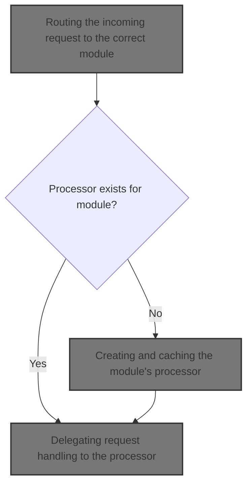
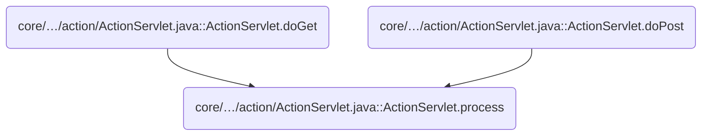
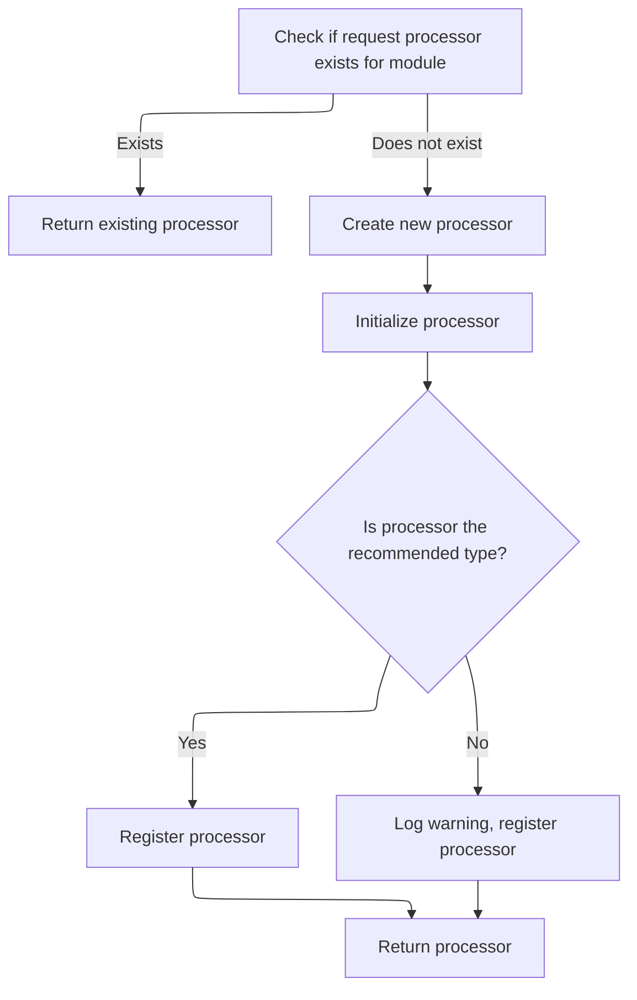
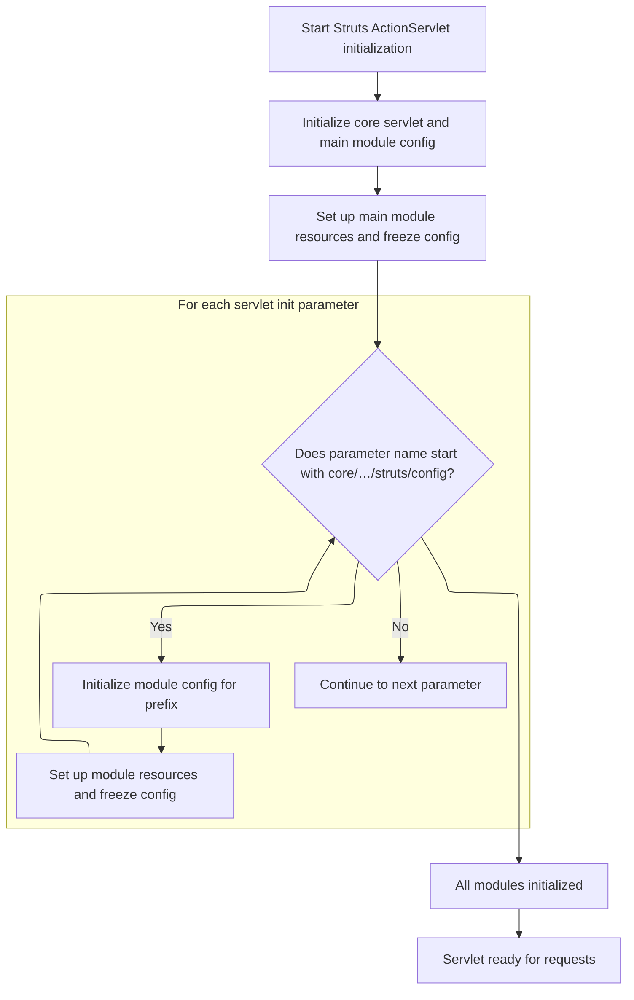

This document explains how incoming requests are routed to the correct module and handled by the appropriate business logic. The flow enables modular and scalable processing of user actions, ensuring each request is managed according to its module configuration. The main steps are routing the request, setting up the module's processor, initializing modules and resources, and delegating the request for execution.



# Where is this flow used?

This flow is used multiple times in the codebase as represented in the following diagram:



# Routing the incoming request to the correct module

<SwmSnippet path="/core/src/main/java/org/apache/struts/action/ActionServlet.java" line="1952">

---

In <SwmToken path="core/src/main/java/org/apache/struts/action/ActionServlet.java" pos="1952:5:5" line-data="    protected void process(HttpServletRequest request,">`process`</SwmToken>, we start by picking the right module for the request and grabbing its config. Then we check if there's already a <SwmToken path="core/src/main/java/org/apache/struts/action/ActionServlet.java" pos="1959:1:1" line-data="        RequestProcessor processor = getProcessorForModule(config);">`RequestProcessor`</SwmToken> for this module. If not, we call <SwmToken path="core/src/main/java/org/apache/struts/action/ActionServlet.java" pos="1962:5:5" line-data="            processor = getRequestProcessor(config);">`getRequestProcessor`</SwmToken> to set one up, so the request gets handled with the right logic for its module.

```java
    protected void process(HttpServletRequest request,
        HttpServletResponse response)
        throws IOException, ServletException {
        ModuleUtils.getInstance().selectModule(request, getServletContext());

        ModuleConfig config = getModuleConfig(request);

        RequestProcessor processor = getProcessorForModule(config);

        if (processor == null) {
            processor = getRequestProcessor(config);
        }

```

---

</SwmSnippet>

## Creating and caching the module's processor



<SwmSnippet path="/core/src/main/java/org/apache/struts/action/ActionServlet.java" line="608">

---

<SwmToken path="core/src/main/java/org/apache/struts/action/ActionServlet.java" pos="608:7:7" line-data="    protected synchronized RequestProcessor getRequestProcessor(">`getRequestProcessor`</SwmToken> checks for a cached processor for the module. If it's missing, it instantiates the processor class from the module config, initializes it, logs a warning if it's the old type, and stores it in the servlet context for reuse. Calling init here sets up the processor with everything it needs before handling requests.

```java
    protected synchronized RequestProcessor getRequestProcessor(
        ModuleConfig config) throws ServletException {
        RequestProcessor processor = this.getProcessorForModule(config);

        if (processor == null) {
            try {
                processor =
                    (RequestProcessor) RequestUtils.applicationInstance(config.getControllerConfig()
                                                                              .getProcessorClass());
            } catch (Exception e) {
            	UnavailableException e2 = new UnavailableException(
                    "Cannot initialize RequestProcessor of class "
                    + config.getControllerConfig().getProcessorClass());
                e2.initCause(e);
                throw e2;
            }
            
            // Emit a warning to the log if the classic RequestProcessor is 
            // being used without composition. Hopefully developers will 
            // heed this message and make the upgrade.
            if (!(processor instanceof ComposableRequestProcessor)) {
                log.warn("Use of the classic RequestProcessor is not recommended. " +
                        "Please upgrade to the ComposableRequestProcessor to " +
                        "receive the advantage of modern enhancements and fixes.");
            }

            processor.init(this, config);

            String key = Globals.REQUEST_PROCESSOR_KEY + config.getPrefix();

            getServletContext().setAttribute(key, processor);
        }

        return (processor);
    }
```

---

</SwmSnippet>

## Initializing modules and their resources



<SwmSnippet path="/core/src/main/java/org/apache/struts/action/ActionServlet.java" line="339">

---

In <SwmToken path="core/src/main/java/org/apache/struts/action/ActionServlet.java" pos="339:5:5" line-data="    public void init() throws ServletException {">`init`</SwmToken>, we loop through servlet config parameters, picking out those with <SwmPath>[core/…/struts/config/](core/target/test-classes/org/apache/struts/config/)</SwmPath> to figure out module prefixes. For each, we initialize the module and its resources. This lets the servlet handle multiple modules based on config naming.

```java
    public void init() throws ServletException {
        final String configPrefix = "config/";
        final int configPrefixLength = configPrefix.length() - 1;

        // Wraps the entire initialization in a try/catch to better handle
        // unexpected exceptions and errors to provide better feedback
        // to the developer
        try {
            initInternal();
            initOther();
            initServlet();
            initChain();

            getServletContext().setAttribute(Globals.ACTION_SERVLET_KEY, this);
            initModuleConfigFactory();

            // Initialize modules as needed
            ModuleConfig moduleConfig = initModuleConfig("", config);

            initModuleMessageResources(moduleConfig);
            initModulePlugIns(moduleConfig);
            initModuleFormBeans(moduleConfig);
            initModuleForwards(moduleConfig);
            initModuleExceptionConfigs(moduleConfig);
            initModuleActions(moduleConfig);
            postProcessConfig(moduleConfig);
            moduleConfig.freeze();

            Enumeration names = getServletConfig().getInitParameterNames();

            while (names.hasMoreElements()) {
                String name = (String) names.nextElement();

                if (!name.startsWith(configPrefix)) {
                    continue;
                }

                String prefix = name.substring(configPrefixLength);

                moduleConfig =
                    initModuleConfig(prefix,
                        getServletConfig().getInitParameter(name));
                initModuleMessageResources(moduleConfig);
                initModulePlugIns(moduleConfig);
                initModuleFormBeans(moduleConfig);
                initModuleForwards(moduleConfig);
                initModuleExceptionConfigs(moduleConfig);
                initModuleActions(moduleConfig);
                postProcessConfig(moduleConfig);
                moduleConfig.freeze();
            }
```

---

</SwmSnippet>

<SwmSnippet path="/core/src/main/java/org/apache/struts/action/ActionServlet.java" line="391">

---

After setting up modules and their prefixes, <SwmToken path="core/src/main/java/org/apache/struts/action/ActionServlet.java" pos="339:5:5" line-data="    public void init() throws ServletException {">`init`</SwmToken> cleans up the config digester and handles errors by marking the servlet unavailable if anything goes wrong.

```java
            this.initModulePrefixes(this.getServletContext());

            this.destroyConfigDigester();
        } catch (UnavailableException ex) {
            throw ex;
        } catch (Throwable t) {
            // The follow error message is not retrieved from internal message
            // resources as they may not have been able to have been
            // initialized
            log.error("Unable to initialize Struts ActionServlet due to an "
                + "unexpected exception or error thrown, so marking the "
                + "servlet as unavailable.  Most likely, this is due to an "
                + "incorrect or missing library dependency.", t);
            UnavailableException t2 = new UnavailableException(t.getMessage());
            t2.initCause(t);
            throw t2;
        }
    }
```

---

</SwmSnippet>

## Delegating request handling to the processor

<SwmSnippet path="/core/src/main/java/org/apache/struts/action/ActionServlet.java" line="1965">

---

Back in ActionServlet.process, after getting the processor from <SwmToken path="core/src/main/java/org/apache/struts/action/ActionServlet.java" pos="608:7:7" line-data="    protected synchronized RequestProcessor getRequestProcessor(">`getRequestProcessor`</SwmToken>, we hand off the request and response to <SwmToken path="core/src/main/java/org/apache/struts/action/ActionServlet.java" pos="1965:1:3" line-data="        processor.process(request, response);">`processor.process`</SwmToken>. This means the request is now handled by the module-specific processor we just set up or reused.

```java
        processor.process(request, response);
    }
```

---

</SwmSnippet>

&nbsp;

*This is an auto-generated document by Swimm 🌊 and has not yet been verified by a human*

<SwmMeta version="3.0.0" repo-id="Z2l0aHViJTNBJTNBc3RydXRzMSUzQSUzQVN3aW1tLURlbW8=" repo-name="struts1"><sup>Powered by [Swimm](https://app.swimm.io/)</sup></SwmMeta>
