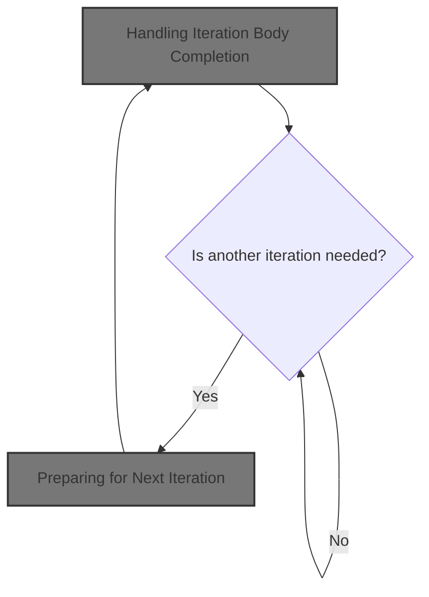
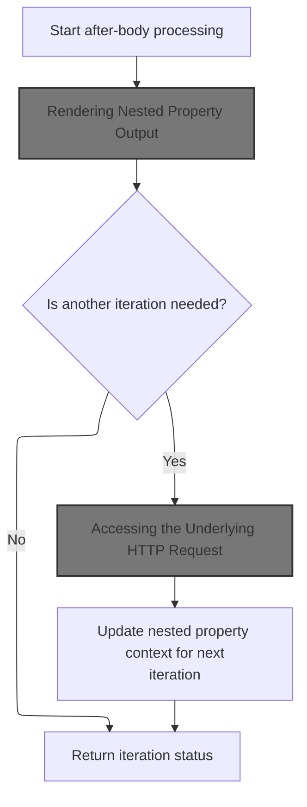

This document describes how the system processes the completion of each iteration's body content, renders the output to the parent stream, and updates the context for subsequent iterations if needed. This enables dynamic and accurate rendering of repeated content in server-side templates.



# Handling Iteration Body Completion



<SwmSnippet path="/taglib/src/main/java/org/apache/struts/taglib/nested/logic/NestedIterateTag.java" line="125">

---

In <SwmToken path="taglib/src/main/java/org/apache/struts/taglib/nested/logic/NestedIterateTag.java" pos="125:5:5" line-data="    public int doAfterBody() throws JspException {">`doAfterBody`</SwmToken>, we call the superclass to process the body and manage iteration state. Next, we need to handle nested property output, so control moves to <SwmToken path="taglib/src/main/java/org/apache/struts/taglib/nested/NestedPropertyTag.java" pos="30:3:3" line-data=" * NestedPropertyTag.">`NestedPropertyTag`</SwmToken> to render the body content.

```java
    public int doAfterBody() throws JspException {
        // store original result
        int temp = super.doAfterBody();
```

---

</SwmSnippet>

## Rendering Nested Property Output

<SwmSnippet path="/taglib/src/main/java/org/apache/struts/taglib/nested/NestedPropertyTag.java" line="108">

---

<SwmToken path="taglib/src/main/java/org/apache/struts/taglib/nested/NestedPropertyTag.java" pos="108:5:5" line-data="    public int doAfterBody() throws JspException {">`doAfterBody`</SwmToken> in <SwmToken path="taglib/src/main/java/org/apache/struts/taglib/nested/NestedPropertyTag.java" pos="30:3:3" line-data=" * NestedPropertyTag.">`NestedPropertyTag`</SwmToken> writes the evaluated body content to the parent output using TagUtils.writePrevious, then clears the buffer. This ensures the nested property value is rendered in the correct place.

```java
    public int doAfterBody() throws JspException {
        /* Render the output */
        if (bodyContent != null) {
            TagUtils.getInstance().writePrevious(pageContext,
                bodyContent.getString());
            bodyContent.clearBody();
        }

        return (SKIP_BODY);
    }
```

---

</SwmSnippet>

## Writing Output to Parent Stream

<SwmSnippet path="/taglib/src/main/java/org/apache/struts/taglib/TagUtils.java" line="1206">

---

<SwmToken path="taglib/src/main/java/org/apache/struts/taglib/TagUtils.java" pos="1206:5:5" line-data="    public void writePrevious(PageContext pageContext, String text)">`writePrevious`</SwmToken> checks if the output writer is a <SwmToken path="taglib/src/main/java/org/apache/struts/taglib/TagUtils.java" pos="1210:8:8" line-data="        if (writer instanceof BodyContent) {">`BodyContent`</SwmToken> and, if so, writes to its parent stream. This ensures the rendered text appears in the right place in the final output. If writing fails, it records the exception.

```java
    public void writePrevious(PageContext pageContext, String text)
        throws JspException {
        JspWriter writer = pageContext.getOut();

        if (writer instanceof BodyContent) {
            writer = ((BodyContent) writer).getEnclosingWriter();
        }

        try {
            writer.print(text);
        } catch (IOException e) {
            saveException(pageContext, e);
            throw new JspException(messages.getMessage("write.io", e.toString()), e);
        }
    }
```

---

</SwmSnippet>

## Recording Exceptions in Request Scope

<SwmSnippet path="/taglib/src/main/java/org/apache/struts/taglib/TagUtils.java" line="1170">

---

<SwmToken path="taglib/src/main/java/org/apache/struts/taglib/TagUtils.java" pos="1170:5:5" line-data="    public void saveException(PageContext pageContext, Throwable exception) {">`saveException`</SwmToken> puts the exception in the request scope under a known key. This makes the error available for error handling during the current request.

```java
    public void saveException(PageContext pageContext, Throwable exception) {
        pageContext.setAttribute(Globals.EXCEPTION_KEY, exception,
            PageContext.REQUEST_SCOPE);
    }
```

---

</SwmSnippet>

<SwmSnippet path="/tiles/src/main/java/org/apache/struts/tiles/taglib/util/TagUtils.java" line="290">

---

<SwmToken path="tiles/src/main/java/org/apache/struts/tiles/taglib/util/TagUtils.java" pos="290:7:7" line-data="    public static void setAttribute(PageContext pageContext, String name, Object beanValue)">`setAttribute`</SwmToken> always puts the attribute in the request scope, regardless of caller intent. This limits the attribute's visibility to the current request only.

```java
    public static void setAttribute(PageContext pageContext, String name, Object beanValue)
        throws JspException {
        pageContext.setAttribute(name, beanValue, PageContext.REQUEST_SCOPE);
    }
```

---

</SwmSnippet>

## Preparing for Next Iteration

<SwmSnippet path="/taglib/src/main/java/org/apache/struts/taglib/nested/logic/NestedIterateTag.java" line="128">

---

Back in NestedIterateTag.doAfterBody, after handling the nested property output, we grab the <SwmToken path="taglib/src/main/java/org/apache/struts/taglib/nested/logic/NestedIterateTag.java" pos="128:1:1" line-data="        HttpServletRequest request =">`HttpServletRequest`</SwmToken> to update iteration-related attributes for the next loop cycle.

```java
        HttpServletRequest request =
            (HttpServletRequest) pageContext.getRequest();

```

---

</SwmSnippet>

## Accessing the Underlying HTTP Request

<SwmSnippet path="/core/src/main/java/org/apache/struts/chain/contexts/ServletActionContext.java" line="94">

---

<SwmToken path="core/src/main/java/org/apache/struts/chain/contexts/ServletActionContext.java" pos="94:5:5" line-data="    public HttpServletRequest getRequest() {">`getRequest`</SwmToken> fetches the <SwmToken path="core/src/main/java/org/apache/struts/chain/contexts/ServletActionContext.java" pos="94:3:3" line-data="    public HttpServletRequest getRequest() {">`HttpServletRequest`</SwmToken> from the underlying <SwmToken path="core/src/main/java/org/apache/struts/chain/contexts/ServletActionContext.java" pos="67:3:3" line-data="    protected ServletWebContext servletWebContext() {">`ServletWebContext`</SwmToken>. This relies on <SwmToken path="core/src/main/java/org/apache/struts/chain/contexts/ServletActionContext.java" pos="68:9:11" line-data="        return (ServletWebContext) this.getBaseContext();">`getBaseContext()`</SwmToken> returning the expected type.

```java
    public HttpServletRequest getRequest() {
        return servletWebContext().getRequest();
    }
```

---

</SwmSnippet>

<SwmSnippet path="/core/src/main/java/org/apache/struts/chain/contexts/ServletActionContext.java" line="67">

---

<SwmToken path="core/src/main/java/org/apache/struts/chain/contexts/ServletActionContext.java" pos="67:5:5" line-data="    protected ServletWebContext servletWebContext() {">`servletWebContext`</SwmToken> just casts the base context to <SwmToken path="core/src/main/java/org/apache/struts/chain/contexts/ServletActionContext.java" pos="67:3:3" line-data="    protected ServletWebContext servletWebContext() {">`ServletWebContext`</SwmToken>. If the type is wrong, this will throw a <SwmToken path="taglib/src/main/java/org/apache/struts/taglib/TagUtils.java" pos="209:8:8" line-data="            //        } catch (ClassCastException e) {">`ClassCastException`</SwmToken>—no checks, just a direct cast.

```java
    protected ServletWebContext servletWebContext() {
        return (ServletWebContext) this.getBaseContext();
    }
```

---

</SwmSnippet>

## Updating Nested Property Reference

<SwmSnippet path="/taglib/src/main/java/org/apache/struts/taglib/nested/logic/NestedIterateTag.java" line="131">

---

Back in NestedIterateTag.doAfterBody, after getting the request, we update the nested property reference if we're continuing iteration. This sets up the right context for the next loop or nested tag.

```java
        if (temp != SKIP_BODY) {
            // set the new reference
            NestedPropertyHelper.setProperty(request, deriveNestedProperty());
        }

        // return super result
        return temp;
    }
```

---

</SwmSnippet>

# Building the Nested Property Path

<SwmSnippet path="/taglib/src/main/java/org/apache/struts/taglib/nested/logic/NestedIterateTag.java" line="109">

---

<SwmToken path="taglib/src/main/java/org/apache/struts/taglib/nested/logic/NestedIterateTag.java" pos="109:5:5" line-data="    private String deriveNestedProperty() {">`deriveNestedProperty`</SwmToken> builds the property path for the current iteration. If the context object is a <SwmToken path="taglib/src/main/java/org/apache/struts/taglib/nested/logic/NestedIterateTag.java" pos="112:8:10" line-data="        if (idObj instanceof Map.Entry) {">`Map.Entry`</SwmToken>, it uses the key; otherwise, it uses the current index from <SwmToken path="taglib/src/main/java/org/apache/struts/taglib/nested/logic/NestedIterateTag.java" pos="115:15:17" line-data="            return nesting + &quot;[&quot; + this.getIndex() + &quot;]&quot;;">`getIndex()`</SwmToken>.

```java
    private String deriveNestedProperty() {
        Object idObj = pageContext.getAttribute(id);

        if (idObj instanceof Map.Entry) {
            return nesting + "(" + ((Map.Entry) idObj).getKey() + ")";
        } else {
            return nesting + "[" + this.getIndex() + "]";
        }
    }
```

---

</SwmSnippet>

<SwmSnippet path="/taglib/src/main/java/org/apache/struts/taglib/logic/IterateTag.java" line="159">

---

<SwmToken path="taglib/src/main/java/org/apache/struts/taglib/logic/IterateTag.java" pos="159:5:5" line-data="    public int getIndex() {">`getIndex`</SwmToken> returns the current iteration index, using offset and length to compute the zero-based position if iteration has started; otherwise, it returns zero.

```java
    public int getIndex() {
        if (started) {
            return ((offsetValue + lengthCount) - 1);
        } else {
            return (0);
        }
    }
```

---

</SwmSnippet>

&nbsp;

*This is an auto-generated document by Swimm 🌊 and has not yet been verified by a human*

<SwmMeta version="3.0.0" repo-id="Z2l0aHViJTNBJTNBc3RydXRzMSUzQSUzQVN3aW1tLURlbW8=" repo-name="struts1"><sup>Powered by [Swimm](https://app.swimm.io/)</sup></SwmMeta>
