This document explains how multipart HTTP requests are processed to extract and organize form field values and uploaded files. When users submit forms with file uploads, the system parses the request, separates form fields from files, and stores them so the application can access these values later.

# Parsing and Partitioning Multipart Requests

```mermaid
%%{init: {"flowchart": {"defaultRenderer": "elk"}} }%%
flowchart TD
    node1["Configure upload settings (size limits,
memory threshold, repository path)"]
    click node1 openCode "core/src/main/java/org/apache/struts/upload/CommonsMultipartRequestHandler.java:158:177"
    node1 --> node2["Parse multipart request"]
    click node2 openCode "core/src/main/java/org/apache/struts/upload/CommonsMultipartRequestHandler.java:183:188"
    node2 --> node3{"Was upload size exceeded?"}
    click node3 openCode "core/src/main/java/org/apache/struts/upload/CommonsMultipartRequestHandler.java:188:193"
    node3 -->|"Yes"| node4["Reject upload and notify user"]
    click node4 openCode "core/src/main/java/org/apache/struts/upload/CommonsMultipartRequestHandler.java:190:193"
    node3 -->|"No"| node5{"Did parsing succeed?"}
    click node5 openCode "core/src/main/java/org/apache/struts/upload/CommonsMultipartRequestHandler.java:194:197"
    node5 -->|"No"| node6["Reject upload due to error"]
    click node6 openCode "core/src/main/java/org/apache/struts/upload/CommonsMultipartRequestHandler.java:195:197"
    node5 -->|"Yes"| node7["Process all items in request"]
    click node7 openCode "core/src/main/java/org/apache/struts/upload/CommonsMultipartRequestHandler.java:201:211"
    
    subgraph loop1["For each item in the request"]
        node7 --> node8{"Is item a form field?"}
        click node8 openCode "core/src/main/java/org/apache/struts/upload/CommonsMultipartRequestHandler.java:206:210"
        node8 -->|"Yes"| node9["Store form field"]
        click node9 openCode "core/src/main/java/org/apache/struts/upload/CommonsMultipartRequestHandler.java:207:207"
        node8 -->|"No"| node10["Store uploaded file"]
        click node10 openCode "core/src/main/java/org/apache/struts/upload/CommonsMultipartRequestHandler.java:209:209"
    end
    node7 --> node11["Finish processing request"]
    click node11 openCode "core/src/main/java/org/apache/struts/upload/CommonsMultipartRequestHandler.java:212:212"
classDef HeadingStyle fill:#777777,stroke:#333,stroke-width:2px;

%% Swimm:
%% %%{init: {"flowchart": {"defaultRenderer": "elk"}} }%%
%% flowchart TD
%%     node1["Configure upload settings (size limits,
%% memory threshold, repository path)"]
%%     click node1 openCode "<SwmPath>[core/…/upload/CommonsMultipartRequestHandler.java](core/src/main/java/org/apache/struts/upload/CommonsMultipartRequestHandler.java)</SwmPath>:158:177"
%%     node1 --> node2["Parse multipart request"]
%%     click node2 openCode "<SwmPath>[core/…/upload/CommonsMultipartRequestHandler.java](core/src/main/java/org/apache/struts/upload/CommonsMultipartRequestHandler.java)</SwmPath>:183:188"
%%     node2 --> node3{"Was upload size exceeded?"}
%%     click node3 openCode "<SwmPath>[core/…/upload/CommonsMultipartRequestHandler.java](core/src/main/java/org/apache/struts/upload/CommonsMultipartRequestHandler.java)</SwmPath>:188:193"
%%     node3 -->|"Yes"| node4["Reject upload and notify user"]
%%     click node4 openCode "<SwmPath>[core/…/upload/CommonsMultipartRequestHandler.java](core/src/main/java/org/apache/struts/upload/CommonsMultipartRequestHandler.java)</SwmPath>:190:193"
%%     node3 -->|"No"| node5{"Did parsing succeed?"}
%%     click node5 openCode "<SwmPath>[core/…/upload/CommonsMultipartRequestHandler.java](core/src/main/java/org/apache/struts/upload/CommonsMultipartRequestHandler.java)</SwmPath>:194:197"
%%     node5 -->|"No"| node6["Reject upload due to error"]
%%     click node6 openCode "<SwmPath>[core/…/upload/CommonsMultipartRequestHandler.java](core/src/main/java/org/apache/struts/upload/CommonsMultipartRequestHandler.java)</SwmPath>:195:197"
%%     node5 -->|"Yes"| node7["Process all items in request"]
%%     click node7 openCode "<SwmPath>[core/…/upload/CommonsMultipartRequestHandler.java](core/src/main/java/org/apache/struts/upload/CommonsMultipartRequestHandler.java)</SwmPath>:201:211"
%%     
%%     subgraph loop1["For each item in the request"]
%%         node7 --> node8{"Is item a form field?"}
%%         click node8 openCode "<SwmPath>[core/…/upload/CommonsMultipartRequestHandler.java](core/src/main/java/org/apache/struts/upload/CommonsMultipartRequestHandler.java)</SwmPath>:206:210"
%%         node8 -->|"Yes"| node9["Store form field"]
%%         click node9 openCode "<SwmPath>[core/…/upload/CommonsMultipartRequestHandler.java](core/src/main/java/org/apache/struts/upload/CommonsMultipartRequestHandler.java)</SwmPath>:207:207"
%%         node8 -->|"No"| node10["Store uploaded file"]
%%         click node10 openCode "<SwmPath>[core/…/upload/CommonsMultipartRequestHandler.java](core/src/main/java/org/apache/struts/upload/CommonsMultipartRequestHandler.java)</SwmPath>:209:209"
%%     end
%%     node7 --> node11["Finish processing request"]
%%     click node11 openCode "<SwmPath>[core/…/upload/CommonsMultipartRequestHandler.java](core/src/main/java/org/apache/struts/upload/CommonsMultipartRequestHandler.java)</SwmPath>:212:212"
%% classDef HeadingStyle fill:#777777,stroke:#333,stroke-width:2px;
```



<SwmSnippet path="/core/src/main/java/org/apache/struts/upload/CommonsMultipartRequestHandler.java" line="156">

---

In <SwmToken path="core/src/main/java/org/apache/struts/upload/CommonsMultipartRequestHandler.java" pos="156:5:5" line-data="    public void handleRequest(HttpServletRequest request)">`handleRequest`</SwmToken>, we're grabbing the upload config from the request (<SwmToken path="core/src/main/java/org/apache/struts/upload/CommonsMultipartRequestHandler.java" pos="160:9:11" line-data="            (ModuleConfig) request.getAttribute(Globals.MODULE_KEY);">`Globals.MODULE_KEY`</SwmToken>), setting up <SwmToken path="core/src/main/java/org/apache/struts/upload/CommonsMultipartRequestHandler.java" pos="163:1:1" line-data="        DiskFileUpload upload = new DiskFileUpload();">`DiskFileUpload`</SwmToken> with encoding, size limits, and temp directory, then parsing the request into FileItems. We need to call IteratorAdapter.next because we're iterating over the parsed items, and next() gives us each <SwmToken path="core/src/main/java/org/apache/struts/upload/CommonsMultipartRequestHandler.java" pos="204:1:1" line-data="            FileItem item = (FileItem) iter.next();">`FileItem`</SwmToken> to check if it's a form field or a file, so we can split them into the right collections.

```java
    public void handleRequest(HttpServletRequest request)
        throws ServletException {
        // Get the app config for the current request.
        ModuleConfig ac =
            (ModuleConfig) request.getAttribute(Globals.MODULE_KEY);

        // Create and configure a DIskFileUpload instance.
        DiskFileUpload upload = new DiskFileUpload();

        // The following line is to support an "EncodingFilter"
        // see http://issues.apache.org/bugzilla/show_bug.cgi?id=23255
        upload.setHeaderEncoding(request.getCharacterEncoding());

        // Set the maximum size before a FileUploadException will be thrown.
        upload.setSizeMax(getSizeMax(ac));

        // Set the maximum size that will be stored in memory.
        upload.setSizeThreshold((int) getSizeThreshold(ac));

        // Set the the location for saving data on disk.
        upload.setRepositoryPath(getRepositoryPath(ac));

        // Create the hash tables to be populated.
        elementsText = new Hashtable();
        elementsFile = new Hashtable();
        elementsAll = new Hashtable();

        // Parse the request into file items.
        List items = null;

        try {
            items = upload.parseRequest(request);
        } catch (DiskFileUpload.SizeLimitExceededException e) {
            // Special handling for uploads that are too big.
            request.setAttribute(MultipartRequestHandler.ATTRIBUTE_MAX_LENGTH_EXCEEDED,
                Boolean.TRUE);
            clearInputStream(request);
            return;
        } catch (FileUploadException e) {
            log.error("Failed to parse multipart request", e);
            clearInputStream(request);
            throw new ServletException(e);
        }

        // Partition the items into form fields and files.
        Iterator iter = items.iterator();

        while (iter.hasNext()) {
            FileItem item = (FileItem) iter.next();

```

---

</SwmSnippet>

<SwmSnippet path="/core/src/main/java/org/apache/struts/util/IteratorAdapter.java" line="47">

---

`IteratorAdapter.next` just wraps Enumeration to look like an Iterator, so we can use standard iteration patterns over collections that only provide Enumeration. It assumes 'e' is valid and just hands back the next element.

```java
    public Object next() {
        if (!e.hasMoreElements()) {
            throw new NoSuchElementException(
                "IteratorAdaptor.next() has no more elements");
        }

        return e.nextElement();
    }
```

---

</SwmSnippet>

<SwmSnippet path="/core/src/main/java/org/apache/struts/upload/CommonsMultipartRequestHandler.java" line="206">

---

Back in CommonsMultipartRequestHandler.handleRequest, after getting each <SwmToken path="core/src/main/java/org/apache/struts/upload/CommonsMultipartRequestHandler.java" pos="204:1:1" line-data="            FileItem item = (FileItem) iter.next();">`FileItem`</SwmToken> from IteratorAdapter.next, we check if it's a form field. If so, we call <SwmToken path="core/src/main/java/org/apache/struts/upload/CommonsMultipartRequestHandler.java" pos="207:1:1" line-data="                addTextParameter(request, item);">`addTextParameter`</SwmToken> to handle encoding and storage, keeping the main loop focused on partitioning items.

```java
            if (item.isFormField()) {
                addTextParameter(request, item);
            } else {
                addFileParameter(item);
            }
        }
    }
```

---

</SwmSnippet>

# Extracting and Storing Form Field Values

```mermaid
%%{init: {"flowchart": {"defaultRenderer": "elk"}} }%%
flowchart TD
  node1["Determine encoding for text parameter"] 
  click node1 openCode "core/src/main/java/org/apache/struts/upload/CommonsMultipartRequestHandler.java:416:428"
  node1 --> node2{"Is encoding available?"}
  click node2 openCode "core/src/main/java/org/apache/struts/upload/CommonsMultipartRequestHandler.java:423:428"
  node2 -->|"Yes"| node3["Try extracting value using encoding"]
  click node3 openCode "core/src/main/java/org/apache/struts/upload/CommonsMultipartRequestHandler.java:430:437"
  node2 -->|"No"| node4["Try extracting value using default
encoding"]
  click node4 openCode "core/src/main/java/org/apache/struts/upload/CommonsMultipartRequestHandler.java:439:442"
  node3 --> node5{"Was extraction successful?"}
  click node5 openCode "core/src/main/java/org/apache/struts/upload/CommonsMultipartRequestHandler.java:433:434"
  node5 -->|"Yes"| node6{"Is request a MultipartRequestWrapper?"}
  node5 -->|"No"| node4
  node4 --> node7["Try extracting value without encoding"]
  click node7 openCode "core/src/main/java/org/apache/struts/upload/CommonsMultipartRequestHandler.java:443:444"
  node7 --> node6
  node6 -->|"Yes"| node8["Store parameter in request wrapper"]
  click node8 openCode "core/src/main/java/org/apache/struts/upload/CommonsMultipartRequestHandler.java:449:453"
  node6 -->|"No"| node9["Continue"]
  node8 --> node10{"Does parameter already exist?"}
  click node10 openCode "core/src/main/java/org/apache/struts/upload/CommonsMultipartRequestHandler.java:458:464"
  node9 --> node10
  node10 -->|"Yes"| node11["Append value to parameter"]
  click node11 openCode "core/src/main/java/org/apache/struts/upload/CommonsMultipartRequestHandler.java:459:461"
  node10 -->|"No"| node12["Create new parameter entry"]
  click node12 openCode "core/src/main/java/org/apache/struts/upload/CommonsMultipartRequestHandler.java:463:464"
  node11 --> node13["Store parameter in internal storage"]
  click node13 openCode "core/src/main/java/org/apache/struts/upload/CommonsMultipartRequestHandler.java:466:468"
  node12 --> node13
classDef HeadingStyle fill:#777777,stroke:#333,stroke-width:2px;

%% Swimm:
%% %%{init: {"flowchart": {"defaultRenderer": "elk"}} }%%
%% flowchart TD
%%   node1["Determine encoding for text parameter"] 
%%   click node1 openCode "<SwmPath>[core/…/upload/CommonsMultipartRequestHandler.java](core/src/main/java/org/apache/struts/upload/CommonsMultipartRequestHandler.java)</SwmPath>:416:428"
%%   node1 --> node2{"Is encoding available?"}
%%   click node2 openCode "<SwmPath>[core/…/upload/CommonsMultipartRequestHandler.java](core/src/main/java/org/apache/struts/upload/CommonsMultipartRequestHandler.java)</SwmPath>:423:428"
%%   node2 -->|"Yes"| node3["Try extracting value using encoding"]
%%   click node3 openCode "<SwmPath>[core/…/upload/CommonsMultipartRequestHandler.java](core/src/main/java/org/apache/struts/upload/CommonsMultipartRequestHandler.java)</SwmPath>:430:437"
%%   node2 -->|"No"| node4["Try extracting value using default
%% encoding"]
%%   click node4 openCode "<SwmPath>[core/…/upload/CommonsMultipartRequestHandler.java](core/src/main/java/org/apache/struts/upload/CommonsMultipartRequestHandler.java)</SwmPath>:439:442"
%%   node3 --> node5{"Was extraction successful?"}
%%   click node5 openCode "<SwmPath>[core/…/upload/CommonsMultipartRequestHandler.java](core/src/main/java/org/apache/struts/upload/CommonsMultipartRequestHandler.java)</SwmPath>:433:434"
%%   node5 -->|"Yes"| node6{"Is request a <SwmToken path="core/src/main/java/org/apache/struts/upload/CommonsMultipartRequestHandler.java" pos="449:8:8" line-data="        if (request instanceof MultipartRequestWrapper) {">`MultipartRequestWrapper`</SwmToken>?"}
%%   node5 -->|"No"| node4
%%   node4 --> node7["Try extracting value without encoding"]
%%   click node7 openCode "<SwmPath>[core/…/upload/CommonsMultipartRequestHandler.java](core/src/main/java/org/apache/struts/upload/CommonsMultipartRequestHandler.java)</SwmPath>:443:444"
%%   node7 --> node6
%%   node6 -->|"Yes"| node8["Store parameter in request wrapper"]
%%   click node8 openCode "<SwmPath>[core/…/upload/CommonsMultipartRequestHandler.java](core/src/main/java/org/apache/struts/upload/CommonsMultipartRequestHandler.java)</SwmPath>:449:453"
%%   node6 -->|"No"| node9["Continue"]
%%   node8 --> node10{"Does parameter already exist?"}
%%   click node10 openCode "<SwmPath>[core/…/upload/CommonsMultipartRequestHandler.java](core/src/main/java/org/apache/struts/upload/CommonsMultipartRequestHandler.java)</SwmPath>:458:464"
%%   node9 --> node10
%%   node10 -->|"Yes"| node11["Append value to parameter"]
%%   click node11 openCode "<SwmPath>[core/…/upload/CommonsMultipartRequestHandler.java](core/src/main/java/org/apache/struts/upload/CommonsMultipartRequestHandler.java)</SwmPath>:459:461"
%%   node10 -->|"No"| node12["Create new parameter entry"]
%%   click node12 openCode "<SwmPath>[core/…/upload/CommonsMultipartRequestHandler.java](core/src/main/java/org/apache/struts/upload/CommonsMultipartRequestHandler.java)</SwmPath>:463:464"
%%   node11 --> node13["Store parameter in internal storage"]
%%   click node13 openCode "<SwmPath>[core/…/upload/CommonsMultipartRequestHandler.java](core/src/main/java/org/apache/struts/upload/CommonsMultipartRequestHandler.java)</SwmPath>:466:468"
%%   node12 --> node13
%% classDef HeadingStyle fill:#777777,stroke:#333,stroke-width:2px;
```



<SwmSnippet path="/core/src/main/java/org/apache/struts/upload/CommonsMultipartRequestHandler.java" line="410">

---

In <SwmToken path="core/src/main/java/org/apache/struts/upload/CommonsMultipartRequestHandler.java" pos="410:5:5" line-data="    protected void addTextParameter(HttpServletRequest request, FileItem item) {">`addTextParameter`</SwmToken>, we extract the form field value from the <SwmToken path="core/src/main/java/org/apache/struts/upload/CommonsMultipartRequestHandler.java" pos="410:12:12" line-data="    protected void addTextParameter(HttpServletRequest request, FileItem item) {">`FileItem`</SwmToken>, trying different encodings to avoid mangling the data. If the request is a <SwmToken path="core/src/main/java/org/apache/struts/upload/CommonsMultipartRequestHandler.java" pos="449:8:8" line-data="        if (request instanceof MultipartRequestWrapper) {">`MultipartRequestWrapper`</SwmToken>, we call <SwmToken path="core/src/main/java/org/apache/struts/upload/CommonsMultipartRequestHandler.java" pos="452:3:3" line-data="            wrapper.setParameter(name, value);">`setParameter`</SwmToken> to store the value in the wrapper, so later code can access it like a normal parameter.

```java
    protected void addTextParameter(HttpServletRequest request, FileItem item) {
        String name = item.getFieldName();
        String value = null;
        boolean haveValue = false;
        String encoding = null;

        if (item instanceof DiskFileItem) {
            encoding = ((DiskFileItem)item).getCharSet();
            if (log.isDebugEnabled()) {
                log.debug("DiskFileItem.getCharSet=[" + encoding + "]");
            }
        }

        if (encoding == null) {
            encoding = request.getCharacterEncoding();
            if (log.isDebugEnabled()) {
                log.debug("request.getCharacterEncoding=[" + encoding + "]");
            }
        }

        if (encoding != null) {
            try {
                value = item.getString(encoding);
                haveValue = true;
            } catch (Exception e) {
                // Handled below, since haveValue is false.
            }
        }

        if (!haveValue) {
            try {
                value = item.getString("ISO-8859-1");
            } catch (java.io.UnsupportedEncodingException uee) {
                value = item.getString();
            }

            haveValue = true;
        }

        if (request instanceof MultipartRequestWrapper) {
            MultipartRequestWrapper wrapper = (MultipartRequestWrapper) request;

            wrapper.setParameter(name, value);
        }

```

---

</SwmSnippet>

<SwmSnippet path="/core/src/main/java/org/apache/struts/upload/MultipartRequestWrapper.java" line="54">

---

<SwmToken path="core/src/main/java/org/apache/struts/upload/MultipartRequestWrapper.java" pos="54:5:5" line-data="    public void setParameter(String name, String value) {">`setParameter`</SwmToken> in <SwmToken path="core/src/main/java/org/apache/struts/upload/CommonsMultipartRequestHandler.java" pos="449:8:8" line-data="        if (request instanceof MultipartRequestWrapper) {">`MultipartRequestWrapper`</SwmToken> adds the new value to the end of the existing array for that parameter name, so all values are kept if the same field appears multiple times in the form.

```java
    public void setParameter(String name, String value) {
        String[] mValue = (String[]) parameters.get(name);

        if (mValue == null) {
            mValue = new String[0];
        }

        String[] newValue = new String[mValue.length + 1];

        System.arraycopy(mValue, 0, newValue, 0, mValue.length);
        newValue[mValue.length] = value;

        parameters.put(name, newValue);
    }
```

---

</SwmSnippet>

<SwmSnippet path="/core/src/main/java/org/apache/struts/upload/CommonsMultipartRequestHandler.java" line="455">

---

After <SwmToken path="core/src/main/java/org/apache/struts/upload/CommonsMultipartRequestHandler.java" pos="452:3:3" line-data="            wrapper.setParameter(name, value);">`setParameter`</SwmToken> in <SwmToken path="core/src/main/java/org/apache/struts/upload/CommonsMultipartRequestHandler.java" pos="449:8:8" line-data="        if (request instanceof MultipartRequestWrapper) {">`MultipartRequestWrapper`</SwmToken>, CommonsMultipartRequestHandler.addTextParameter updates <SwmToken path="core/src/main/java/org/apache/struts/upload/CommonsMultipartRequestHandler.java" pos="455:15:15" line-data="        String[] oldArray = (String[]) elementsText.get(name);">`elementsText`</SwmToken> and <SwmToken path="core/src/main/java/org/apache/struts/upload/CommonsMultipartRequestHandler.java" pos="467:1:1" line-data="        elementsAll.put(name, newArray);">`elementsAll`</SwmToken> by appending the new value to the arrays for that parameter name. This way, all values for repeated fields are kept and accessible.

```java
        String[] oldArray = (String[]) elementsText.get(name);
        String[] newArray;

        if (oldArray != null) {
            newArray = new String[oldArray.length + 1];
            System.arraycopy(oldArray, 0, newArray, 0, oldArray.length);
            newArray[oldArray.length] = value;
        } else {
            newArray = new String[] { value };
        }

        elementsText.put(name, newArray);
        elementsAll.put(name, newArray);
    }
```

---

</SwmSnippet>

&nbsp;

*This is an auto-generated document by Swimm 🌊 and has not yet been verified by a human*

<SwmMeta version="3.0.0" repo-id="Z2l0aHViJTNBJTNBc3RydXRzMSUzQSUzQVN3aW1tLURlbW8=" repo-name="struts1"><sup>Powered by [Swimm](https://app.swimm.io/)</sup></SwmMeta>
