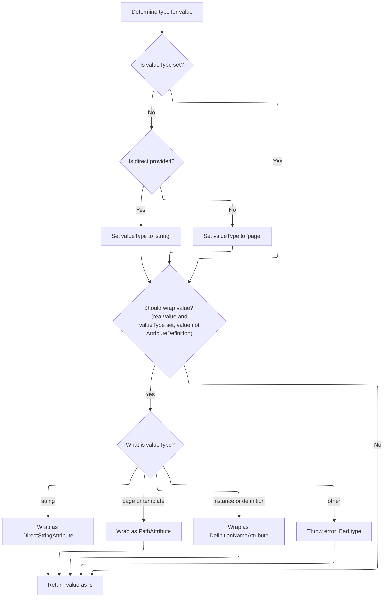

This document describes how a nested attribute tag is processed within a template. The flow resolves the attribute's value, determines its type, optionally assigns a role, and adds it to the parent definition.

# Handling Nested Attribute Processing

<SwmSnippet path="/tiles/src/main/java/org/apache/struts/tiles/taglib/DefinitionTag.java" line="100">

---

In <SwmToken path="tiles/src/main/java/org/apache/struts/tiles/taglib/DefinitionTag.java" pos="100:5:5" line-data="    public void processNestedTag(PutTag nestedTag) throws JspException {">`processNestedTag`</SwmToken>, we grab the actual value from the nested tag by calling its <SwmToken path="tiles/src/main/java/org/apache/struts/tiles/taglib/DefinitionTag.java" pos="104:9:9" line-data="        Object attributeValue = nestedTag.getRealValue();">`getRealValue`</SwmToken> method. This step ensures we're working with the final computed value, which could come from tag attributes, body content, or beans. We need to call <SwmToken path="tiles/src/main/java/org/apache/struts/tiles/taglib/DefinitionTag.java" pos="100:7:7" line-data="    public void processNestedTag(PutTag nestedTag) throws JspException {">`PutTag`</SwmToken> next because that's where the logic for resolving the value lives.

```java
    public void processNestedTag(PutTag nestedTag) throws JspException {
        // Get real value and check role
        // If role is set, add it in attribute definition if any.
        // If no attribute definition, create untyped one and set role.
        Object attributeValue = nestedTag.getRealValue();
```

---

</SwmSnippet>

## Resolving Attribute Value

<SwmSnippet path="/tiles/src/main/java/org/apache/struts/tiles/taglib/PutTag.java" line="308">

---

<SwmToken path="tiles/src/main/java/org/apache/struts/tiles/taglib/PutTag.java" pos="308:5:5" line-data="    public Object getRealValue() throws JspException {">`getRealValue`</SwmToken> checks if the value is already computed. If not, it calls <SwmToken path="tiles/src/main/java/org/apache/struts/tiles/taglib/PutTag.java" pos="310:1:1" line-data="            computeRealValue();">`computeRealValue`</SwmToken> to resolve it. This avoids redundant work and ensures we always get the latest value when needed.

```java
    public Object getRealValue() throws JspException {
        if (realValue == null) {
            computeRealValue();
        }

        return realValue;
    }
```

---

</SwmSnippet>

## Determining and Typing the Value

<SwmSnippet path="/tiles/src/main/java/org/apache/struts/tiles/taglib/PutTag.java" line="320">

---

In <SwmToken path="tiles/src/main/java/org/apache/struts/tiles/taglib/PutTag.java" pos="320:5:5" line-data="    protected void computeRealValue() throws JspException {">`computeRealValue`</SwmToken>, we figure out where the value comes from: first from 'value', then from the tag body if 'value' and <SwmToken path="tiles/src/main/java/org/apache/struts/tiles/taglib/PutTag.java" pos="325:12:12" line-data="        if (value == null &amp;&amp; beanName == null) {">`beanName`</SwmToken> are missing, and finally from a bean if needed. After that, we decide the attribute type based on <SwmToken path="tiles/src/main/java/org/apache/struts/tiles/taglib/PutTag.java" pos="341:22:22" line-data="        // First check direct attribute, and translate it to a valueType.">`valueType`</SwmToken> or the 'direct' flag, and wrap the value accordingly. This sets up the value for use in the rest of the tag flow.

```java
    protected void computeRealValue() throws JspException {
        // Compute real value from attributes set.
        realValue = value;

        // If realValue is not set, value must come from body
        if (value == null && beanName == null) {
            // Test body content in case of empty body.
            if (body != null) {
                realValue = body;
            } else {
                realValue = "";
            }
        }

        // Does value comes from a bean ?
        if (realValue == null && beanName != null) {
            getRealValueFromBean();
            return;
        }

```

---

</SwmSnippet>

### Fetching Value from Bean

See <SwmLink doc-title="Retrieving a Value from a Bean">[Retrieving a Value from a Bean](/.swm/retrieving-a-value-from-a-bean.53l9n36h.sw.md)</SwmLink>

### Wrapping Value in Attribute Types



<SwmSnippet path="/tiles/src/main/java/org/apache/struts/tiles/taglib/PutTag.java" line="340">

---

Back in <SwmToken path="tiles/src/main/java/org/apache/struts/tiles/taglib/PutTag.java" pos="310:1:1" line-data="            computeRealValue();">`computeRealValue`</SwmToken>, after resolving the value source, we check the type and wrap the value in the right attribute class (<SwmToken path="tiles/src/main/java/org/apache/struts/tiles/taglib/PutTag.java" pos="358:7:7" line-data="                realValue = new DirectStringAttribute(strValue);">`DirectStringAttribute`</SwmToken>, <SwmToken path="tiles/src/main/java/org/apache/struts/tiles/taglib/PutTag.java" pos="361:7:7" line-data="                realValue = new PathAttribute(strValue);">`PathAttribute`</SwmToken>, or <SwmToken path="tiles/src/main/java/org/apache/struts/tiles/taglib/PutTag.java" pos="367:7:7" line-data="                realValue = new DefinitionNameAttribute(strValue);">`DefinitionNameAttribute`</SwmToken>). This lets the framework handle the value according to its intended use, not just as a raw string.

```java
        // Is there a type set ?
        // First check direct attribute, and translate it to a valueType.
        // Then, evaluate valueType, and create requested typed attribute.
        // If valueType is not set, use the value "as is".
        if (valueType == null && direct != null) {
            if (Boolean.valueOf(direct).booleanValue() == true) {
                valueType = "string";
            } else {
                valueType = "page";
            }
        }

        if (realValue != null
            && valueType != null
            && !(value instanceof AttributeDefinition)) {

            String strValue = realValue.toString();
            if (valueType.equalsIgnoreCase("string")) {
                realValue = new DirectStringAttribute(strValue);

            } else if (valueType.equalsIgnoreCase("page")) {
                realValue = new PathAttribute(strValue);

            } else if (valueType.equalsIgnoreCase("template")) {
                realValue = new PathAttribute(strValue);

            } else if (valueType.equalsIgnoreCase("instance")) {
                realValue = new DefinitionNameAttribute(strValue);

            } else if (valueType.equalsIgnoreCase("definition")) {
                realValue = new DefinitionNameAttribute(strValue);

            } else { // bad type
                throw new JspException(
                    "Warning - Tag put : Bad type '" + valueType + "'.");
            }
        }

    }
```

---

</SwmSnippet>

## Assigning Role and Adding Attribute

<SwmSnippet path="/tiles/src/main/java/org/apache/struts/tiles/taglib/DefinitionTag.java" line="105">

---

After coming back from `PutTag.getRealValue`, <SwmToken path="tiles/src/main/java/org/apache/struts/tiles/taglib/DefinitionTag.java" pos="100:5:5" line-data="    public void processNestedTag(PutTag nestedTag) throws JspException {">`processNestedTag`</SwmToken> checks if a role is set. If so, it wraps the value in an attribute definition (or <SwmToken path="tiles/src/main/java/org/apache/struts/tiles/taglib/DefinitionTag.java" pos="111:7:7" line-data="                def = new UntypedAttribute(attributeValue);">`UntypedAttribute`</SwmToken> if needed), assigns the role, and then adds the attribute to the parent object. This step links the resolved value with any access control info before storing it.

```java
        AttributeDefinition def;

        if (nestedTag.getRole() != null) {
            try {
                def = ((AttributeDefinition) attributeValue);
            } catch (ClassCastException ex) {
                def = new UntypedAttribute(attributeValue);
            }
            def.setRole(nestedTag.getRole());
            attributeValue = def;
        }

        // now add attribute to enclosing parent (i.e. : this object)
        putAttribute(nestedTag.getName(), attributeValue);
    }
```

---

</SwmSnippet>

&nbsp;

*This is an auto-generated document by Swimm 🌊 and has not yet been verified by a human*

<SwmMeta version="3.0.0" repo-id="Z2l0aHViJTNBJTNBc3RydXRzMSUzQSUzQVN3aW1tLURlbW8=" repo-name="struts1"><sup>Powered by [Swimm](https://app.swimm.io/)</sup></SwmMeta>
